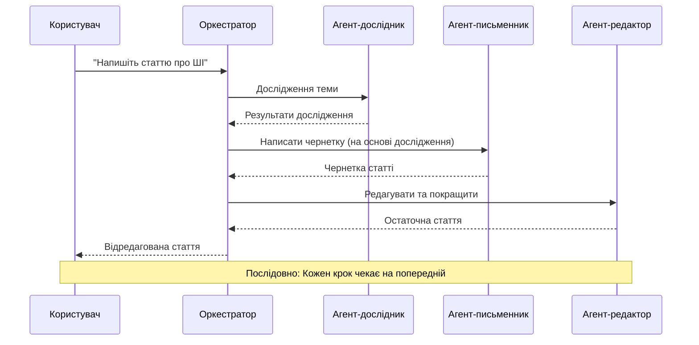
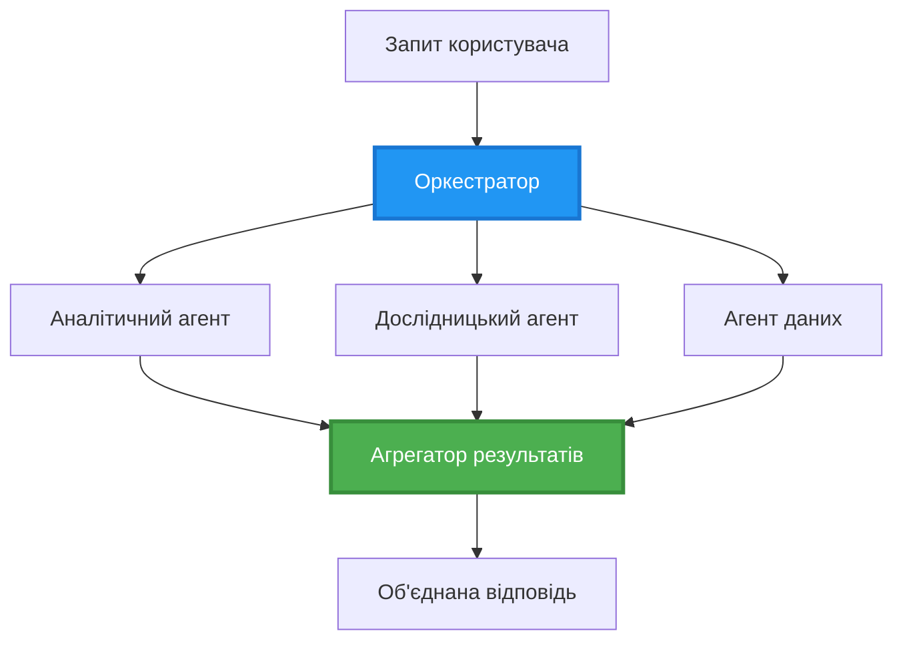
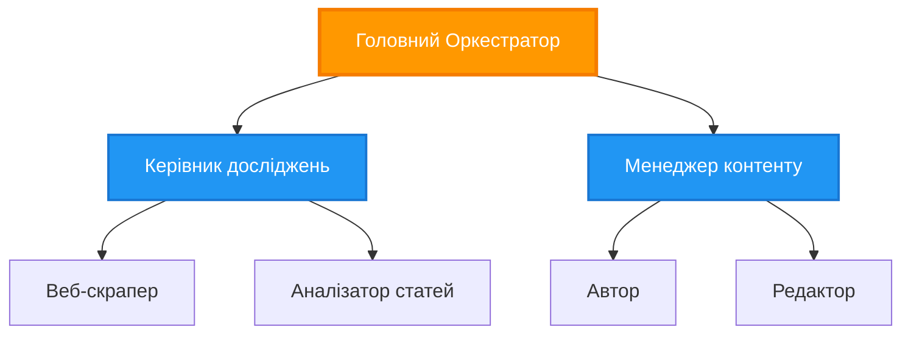
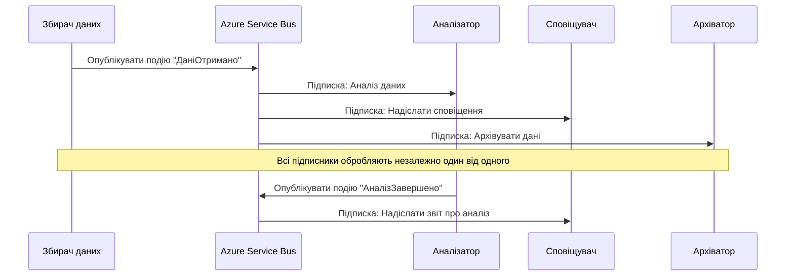
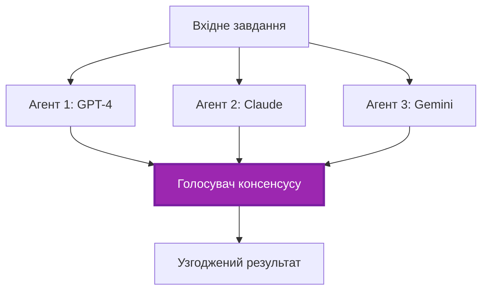

# Мультиагентні шаблони координації

⏱️ **Орієнтовний час**: 60-75 хвилин | 💰 **Оцінка витрат**: ~$100-300/місяць | ⭐ **Складність**: Просунутий

**📚 Шлях навчання:**
- ← Попередній: [Планування ємності](capacity-planning.md) - Оцінка ресурсів та стратегії масштабування
- 🎯 **Ви тут**: Мультиагентні шаблони координації (Оркестрація, комунікація, управління станом)
- → Далі: [Вибір SKU](sku-selection.md) - Вибір правильних служб Azure
- 🏠 [Головна сторінка курсу](../../README.md)

---

## Чого ви навчитеся

Після проходження цього уроку ви:
- Зрозумієте **шаблони мультиагентної архітектури** та коли їх застосовувати
- Реалізуєте **шаблони оркестрації** (централізовані, децентралізовані, ієрархічні)
- Розробите стратегії **комунікації агентів** (синхронні, асинхронні, орієнтовані на події)
- Керуєте **спільним станом** між розподіленими агентами
- Розгорнете **мультиагентні системи** на Azure за допомогою AZD
- Застосуєте **шаблони координації** для реальних AI-сценаріїв
- Моніторитимете та відлагоджуватимете розподілені агентні системи

## Чому координація мультиагентних систем важлива

### Еволюція: від одного агента до мультиагентної системи

**Один агент (Просто):**
```
User → Agent → Response
```
- ✅ Легко зрозуміти та реалізувати
- ✅ Швидко для простих завдань
- ❌ Обмежено можливостями однієї моделі
- ❌ Неможливо виконувати складні завдання паралельно
- ❌ Відсутність спеціалізації

**Мультиагентна система (Розширена):**
```
           ┌─────────────┐
           │ Orchestrator│
           └──────┬──────┘
        ┌─────────┼─────────┐
        │         │         │
    ┌───▼──┐  ┌──▼───┐  ┌──▼────┐
    │Agent1│  │Agent2│  │Agent3 │
    │(Plan)│  │(Code)│  │(Review)│
    └──────┘  └──────┘  └───────┘
```
- ✅ Агенти, спеціалізовані на конкретних завданнях
- ✅ Паралельне виконання для швидкості
- ✅ Модульна та зручна для обслуговування
- ✅ Краще підходить для складних робочих процесів
- ⚠️ Потребує логіки координації

**Аналогія**: Один агент — як одна людина, що виконує всі завдання. Мультиагентна система — як команда, де кожен має спеціалізовані навички (дослідник, програміст, рецензент, автор), що працюють разом.

---

## Основні шаблони координації

### Шаблон 1: Послідовна координація (Ланцюг відповідальності)

**Коли використовувати**: Завдання мають виконуватись у певному порядку, кожен агент будує на основі виходу попереднього.



**Переваги:**
- ✅ Чіткий потік даних
- ✅ Легко відлагодити
- ✅ Передбачуваний порядок виконання

**Обмеження:**
- ❌ Повільніше (немає паралелізму)
- ❌ Одна помилка блокує весь ланцюжок
- ❌ Неможливо обробляти взаємозалежні завдання

**Приклади використання:**
- Конвеєр створення контенту (дослідження → написання → редагування → публікація)
- Генерація коду (план → реалізація → тестування → розгортання)
- Генерація звітів (збір даних → аналіз → візуалізація → підсумок)

---

### Шаблон 2: Паралельна координація (Fan-Out/Fan-In)

**Коли використовувати**: Незалежні завдання можуть виконуватись одночасно, результати комбінуються в кінці.


**Переваги:**
- ✅ Швидко (паралельне виконання)
- ✅ Відмовостійкість (приймаються часткові результати)
- ✅ Горизонтально масштабоване

**Обмеження:**
- ⚠️ Результати можуть надходити поза порядком
- ⚠️ Потрібна логіка агрегування
- ⚠️ Складне керування станом

**Приклади використання:**
- Збір даних з кількох джерел (APIs + бази даних + веб-скрапінг)
- Конкурентний аналіз (кілька моделей генерують рішення, вибирається найкраще)
- Сервіси перекладу (переклад на кілька мов одночасно)

---

### Шаблон 3: Ієрархічна координація (Менеджер-Виконавець)

**Коли використовувати**: Складні робочі процеси з підзавданнями, потрібна делегація.


**Переваги:**
- ✅ Обробляє складні робочі процеси
- ✅ Модульна та зручна для обслуговування
- ✅ Чіткі межі відповідальності

**Обмеження:**
- ⚠️ Більш складна архітектура
- ⚠️ Вища затримка (кілька рівнів координації)
- ⚠️ Потребує складної оркестрації

**Приклади використання:**
- Обробка корпоративних документів (класифікація → маршрутизація → обробка → архівація)
- Багатоступеневі конвеєри даних (збирання → очищення → трансформація → аналіз → звіт)
- Складні автоматизації (планування → розподіл ресурсів → виконання → моніторинг)

---

### Шаблон 4: Подієво-орієнтована координація (Публікація-Підписка)

**Коли використовувати**: Агенти повинні реагувати на події, бажано слабке зв'язування.



**Переваги:**
- ✅ Слабке зв'язування між агентами
- ✅ Легко додавати нових агентів (просто підписатися)
- ✅ Асинхронна обробка
- ✅ Стійкість (персистентність повідомлень)

**Обмеження:**
- ⚠️ Остаточна узгодженість (eventual consistency)
- ⚠️ Складне відлагодження
- ⚠️ Проблеми з порядком повідомлень

**Приклади використання:**
- Системи моніторингу в реальному часі (алерти, панелі, логи)
- Повідомлення в багатьох каналах (email, SMS, push, Slack)
- Конвеєри обробки даних (кілька споживачів одного й того ж набору даних)

---

### Шаблон 5: Координація на основі консенсусу (Голосування/Кворум)

**Коли використовувати**: Потрібна згода кількох агентів перед продовженням.


**Переваги:**
- ✅ Вища точність (декілька думок)
- ✅ Відмовостійкість (незначні відмови прийнятні)
- ✅ Вбудована перевірка якості

**Обмеження:**
- ❌ Дорого (кілька викликів моделей)
- ❌ Повільніше (чекання на всі відповіді)
- ⚠️ Потрібне вирішення конфліктів

**Приклади використання:**
- Модерація контенту (декілька моделей переглядають контент)
- Рев’ю коду (декілька лінтерів/аналізаторів)
- Медична діагностика (кілька AI-моделей, підтвердження експертом)

---

## Огляд архітектури

### Повна мультиагентна система на Azure


**Ключові компоненти:**

| Компонент | Призначення | Служба Azure |
|-----------|---------|---------------|
| **API Gateway** | Точка входу, обмеження частоти, автентифікація | API Management |
| **Orchestrator** | Координує робочі процеси агентів | Container Apps |
| **Message Queue** | Асинхронна комунікація | Service Bus / Event Hubs |
| **Agents** | Спеціалізовані AI-виконавці | Container Apps / Functions |
| **State Store** | Спільний стан, відстеження завдань | Cosmos DB |
| **Artifact Storage** | Документи, результати, логи | Blob Storage |
| **Monitoring** | Розподілене трасування, логи | Application Insights |

---

## Передумови

### Потрібні інструменти

```bash
# Перевірте Azure Developer CLI
azd version
# ✅ Очікується: версія azd 1.0.0 або новіша

# Перевірте Azure CLI
az --version
# ✅ Очікується: azure-cli 2.50.0 або новіша

# Перевірте Docker (для локального тестування)
docker --version
# ✅ Очікується: версія Docker 20.10 або новіша
```

### Вимоги Azure

- Активна підписка Azure
- Права для створення:
  - Container Apps
  - Service Bus namespaces
  - Cosmos DB accounts
  - Storage accounts
  - Application Insights

### Необхідні знання

Ви повинні завершити:
- [Управління конфігураціями](../chapter-03-configuration/configuration.md)
- [Аутентифікація та безпека](../chapter-03-configuration/authsecurity.md)
- [Приклад мікросервісів](../../../../examples/microservices)

---

## Посібник з реалізації

### Структура проєкту

```
multi-agent-system/
├── azure.yaml                    # AZD configuration
├── infra/
│   ├── main.bicep               # Main infrastructure
│   ├── core/
│   │   ├── servicebus.bicep     # Message queue
│   │   ├── cosmos.bicep         # State store
│   │   ├── storage.bicep        # Artifact storage
│   │   └── monitoring.bicep     # Application Insights
│   └── app/
│       ├── orchestrator.bicep   # Orchestrator service
│       └── agent.bicep          # Agent template
└── src/
    ├── orchestrator/            # Orchestration logic
    │   ├── app.py
    │   ├── workflows.py
    │   └── Dockerfile
    ├── agents/
    │   ├── research/            # Research agent
    │   ├── writer/              # Writer agent
    │   ├── analyst/             # Analyst agent
    │   └── reviewer/            # Reviewer agent
    └── shared/
        ├── state_manager.py     # Shared state logic
        └── message_handler.py   # Message handling
```

---

## Урок 1: Шаблон послідовної координації

### Реалізація: Конвеєр створення контенту

Побудуємо послідовний конвеєр: Дослідження → Написання → Редагування → Публікація

### 1. Конфігурація AZD

**File: `azure.yaml`**

```yaml
name: content-pipeline
metadata:
  template: multi-agent-sequential@1.0.0

services:
  orchestrator:
    project: ./src/orchestrator
    language: python
    host: containerapp
  
  research-agent:
    project: ./src/agents/research
    language: python
    host: containerapp
  
  writer-agent:
    project: ./src/agents/writer
    language: python
    host: containerapp
  
  editor-agent:
    project: ./src/agents/editor
    language: python
    host: containerapp
```

### 2. Інфраструктура: Service Bus для координації

**File: `infra/core/servicebus.bicep`**

```bicep
param name string
param location string
param tags object = {}

resource serviceBusNamespace 'Microsoft.ServiceBus/namespaces@2022-10-01-preview' = {
  name: name
  location: location
  tags: tags
  sku: {
    name: 'Standard'
    tier: 'Standard'
  }
  properties: {
    minimumTlsVersion: '1.2'
  }
}

// Queue for orchestrator → research agent
resource researchQueue 'Microsoft.ServiceBus/namespaces/queues@2022-10-01-preview' = {
  parent: serviceBusNamespace
  name: 'research-tasks'
  properties: {
    maxDeliveryCount: 3
    lockDuration: 'PT5M'
    deadLetteringOnMessageExpiration: true
  }
}

// Queue for research agent → writer agent
resource writerQueue 'Microsoft.ServiceBus/namespaces/queues@2022-10-01-preview' = {
  parent: serviceBusNamespace
  name: 'writer-tasks'
  properties: {
    maxDeliveryCount: 3
    lockDuration: 'PT5M'
  }
}

// Queue for writer agent → editor agent
resource editorQueue 'Microsoft.ServiceBus/namespaces/queues@2022-10-01-preview' = {
  parent: serviceBusNamespace
  name: 'editor-tasks'
  properties: {
    maxDeliveryCount: 3
    lockDuration: 'PT5M'
  }
}

output namespace string = serviceBusNamespace.name
output connectionString string = listKeys('${serviceBusNamespace.id}/AuthorizationRules/RootManageSharedAccessKey', serviceBusNamespace.apiVersion).primaryConnectionString
```

### 3. Менеджер спільного стану

**File: `src/shared/state_manager.py`**

```python
from azure.cosmos import CosmosClient, PartitionKey
from datetime import datetime
import os

class StateManager:
    """Manages shared state across agents using Cosmos DB"""
    
    def __init__(self):
        endpoint = os.environ['COSMOS_ENDPOINT']
        key = os.environ['COSMOS_KEY']
        
        self.client = CosmosClient(endpoint, key)
        self.database = self.client.get_database_client('agent-state')
        self.container = self.database.get_container_client('tasks')
    
    def create_task(self, task_id: str, task_type: str, input_data: dict):
        """Create a new task"""
        task = {
            'id': task_id,
            'type': task_type,
            'status': 'pending',
            'input': input_data,
            'created_at': datetime.utcnow().isoformat(),
            'steps': []
        }
        self.container.create_item(task)
        return task
    
    def update_task_step(self, task_id: str, step_name: str, result: dict):
        """Update task with completed step"""
        task = self.container.read_item(task_id, partition_key=task_id)
        
        task['steps'].append({
            'name': step_name,
            'completed_at': datetime.utcnow().isoformat(),
            'result': result
        })
        
        self.container.replace_item(task_id, task)
        return task
    
    def complete_task(self, task_id: str, final_result: dict):
        """Mark task as complete"""
        task = self.container.read_item(task_id, partition_key=task_id)
        task['status'] = 'completed'
        task['result'] = final_result
        task['completed_at'] = datetime.utcnow().isoformat()
        self.container.replace_item(task_id, task)
        return task
    
    def get_task(self, task_id: str):
        """Retrieve task state"""
        return self.container.read_item(task_id, partition_key=task_id)
```

### 4. Сервіс оркестратора

**File: `src/orchestrator/app.py`**

```python
from flask import Flask, request, jsonify
from azure.servicebus import ServiceBusClient, ServiceBusMessage
import json
import uuid
import os
from shared.state_manager import StateManager

app = Flask(__name__)
state_manager = StateManager()

# Підключення до Service Bus
servicebus_connection_str = os.environ['SERVICEBUS_CONNECTION_STRING']
servicebus_client = ServiceBusClient.from_connection_string(servicebus_connection_str)

@app.route('/health', methods=['GET'])
def health():
    return jsonify({'status': 'healthy', 'service': 'orchestrator'})

@app.route('/create-content', methods=['POST'])
def create_content():
    """
    Sequential workflow: Research → Write → Edit → Publish
    """
    data = request.json
    topic = data.get('topic')
    
    if not topic:
        return jsonify({'error': 'Topic required'}), 400
    
    # Створити завдання в сховищі станів
    task_id = str(uuid.uuid4())
    task = state_manager.create_task(
        task_id=task_id,
        task_type='content_creation',
        input_data={'topic': topic}
    )
    
    # Надіслати повідомлення агенту дослідження (перший крок)
    sender = servicebus_client.get_queue_sender('research-tasks')
    message = ServiceBusMessage(
        body=json.dumps({
            'task_id': task_id,
            'topic': topic,
            'next_queue': 'writer-tasks'  # Куди надсилати результати
        }),
        content_type='application/json'
    )
    
    with sender:
        sender.send_messages(message)
    
    return jsonify({
        'task_id': task_id,
        'status': 'started',
        'workflow': 'sequential',
        'steps': ['research', 'write', 'edit', 'publish'],
        'message': 'Content creation pipeline initiated'
    }), 202

@app.route('/task/<task_id>', methods=['GET'])
def get_task_status(task_id):
    """Check task status"""
    try:
        task = state_manager.get_task(task_id)
        return jsonify(task)
    except Exception as e:
        return jsonify({'error': str(e)}), 404

if __name__ == '__main__':
    app.run(host='0.0.0.0', port=8080)
```

### 5. Агент-дослідник

**File: `src/agents/research/app.py`**

```python
from azure.servicebus import ServiceBusClient, ServiceBusMessage
from openai import AzureOpenAI
import json
import os
import time
from shared.state_manager import StateManager

# Ініціалізувати клієнтів
state_manager = StateManager()
servicebus_client = ServiceBusClient.from_connection_string(
    os.environ['SERVICEBUS_CONNECTION_STRING']
)

openai_client = AzureOpenAI(
    api_key=os.environ['AZURE_OPENAI_API_KEY'],
    api_version="2024-02-01",
    azure_endpoint=os.environ['AZURE_OPENAI_ENDPOINT']
)

def process_research_task(message_data):
    """Process research request and pass to writer"""
    task_id = message_data['task_id']
    topic = message_data['topic']
    next_queue = message_data['next_queue']
    
    print(f"🔬 Researching: {topic}")
    
    # Звернутися до Azure OpenAI для дослідження
    response = openai_client.chat.completions.create(
        model="gpt-4",
        messages=[
            {"role": "system", "content": "You are a research assistant. Provide comprehensive research on the given topic."},
            {"role": "user", "content": f"Research this topic thoroughly: {topic}"}
        ],
        max_tokens=1500
    )
    
    research_results = response.choices[0].message.content
    
    # Оновити стан
    state_manager.update_task_step(
        task_id=task_id,
        step_name='research',
        result={'research': research_results}
    )
    
    # Надіслати наступному агенту (автору)
    sender = servicebus_client.get_queue_sender(next_queue)
    message = ServiceBusMessage(
        body=json.dumps({
            'task_id': task_id,
            'topic': topic,
            'research': research_results,
            'next_queue': 'editor-tasks'
        }),
        content_type='application/json'
    )
    
    with sender:
        sender.send_messages(message)
    
    print(f"✅ Research complete for task {task_id}")

def main():
    """Listen to research queue"""
    receiver = servicebus_client.get_queue_receiver('research-tasks')
    
    print("🔬 Research Agent started, listening for tasks...")
    
    with receiver:
        while True:
            messages = receiver.receive_messages(max_wait_time=5)
            for message in messages:
                try:
                    message_data = json.loads(str(message))
                    process_research_task(message_data)
                    receiver.complete_message(message)
                except Exception as e:
                    print(f"❌ Error processing message: {e}")
                    receiver.abandon_message(message)

if __name__ == '__main__':
    main()
```

### 6. Агент-письменник

**File: `src/agents/writer/app.py`**

```python
from azure.servicebus import ServiceBusClient, ServiceBusMessage
from openai import AzureOpenAI
import json
import os
from shared.state_manager import StateManager

state_manager = StateManager()
servicebus_client = ServiceBusClient.from_connection_string(
    os.environ['SERVICEBUS_CONNECTION_STRING']
)

openai_client = AzureOpenAI(
    api_key=os.environ['AZURE_OPENAI_API_KEY'],
    api_version="2024-02-01",
    azure_endpoint=os.environ['AZURE_OPENAI_ENDPOINT']
)

def process_writing_task(message_data):
    """Write article based on research"""
    task_id = message_data['task_id']
    topic = message_data['topic']
    research = message_data['research']
    next_queue = message_data['next_queue']
    
    print(f"✍️ Writing article: {topic}")
    
    # Викликати Azure OpenAI для написання статті
    response = openai_client.chat.completions.create(
        model="gpt-4",
        messages=[
            {"role": "system", "content": "You are a professional writer. Write engaging, well-structured articles."},
            {"role": "user", "content": f"Based on this research:\n\n{research}\n\nWrite a comprehensive article about: {topic}"}
        ],
        max_tokens=2000
    )
    
    article_draft = response.choices[0].message.content
    
    # Оновити стан
    state_manager.update_task_step(
        task_id=task_id,
        step_name='writing',
        result={'draft': article_draft}
    )
    
    # Надіслати редактору
    sender = servicebus_client.get_queue_sender(next_queue)
    message = ServiceBusMessage(
        body=json.dumps({
            'task_id': task_id,
            'topic': topic,
            'draft': article_draft
        }),
        content_type='application/json'
    )
    
    with sender:
        sender.send_messages(message)
    
    print(f"✅ Article draft complete for task {task_id}")

def main():
    """Listen to writer queue"""
    receiver = servicebus_client.get_queue_receiver('writer-tasks')
    
    print("✍️ Writer Agent started, listening for tasks...")
    
    with receiver:
        while True:
            messages = receiver.receive_messages(max_wait_time=5)
            for message in messages:
                try:
                    message_data = json.loads(str(message))
                    process_writing_task(message_data)
                    receiver.complete_message(message)
                except Exception as e:
                    print(f"❌ Error: {e}")
                    receiver.abandon_message(message)

if __name__ == '__main__':
    main()
```

### 7. Агент-редактор

**File: `src/agents/editor/app.py`**

```python
from azure.servicebus import ServiceBusClient
from openai import AzureOpenAI
import json
import os
from shared.state_manager import StateManager

state_manager = StateManager()
servicebus_client = ServiceBusClient.from_connection_string(
    os.environ['SERVICEBUS_CONNECTION_STRING']
)

openai_client = AzureOpenAI(
    api_key=os.environ['AZURE_OPENAI_API_KEY'],
    api_version="2024-02-01",
    azure_endpoint=os.environ['AZURE_OPENAI_ENDPOINT']
)

def process_editing_task(message_data):
    """Edit and finalize article"""
    task_id = message_data['task_id']
    topic = message_data['topic']
    draft = message_data['draft']
    
    print(f"📝 Editing article: {topic}")
    
    # Викликати Azure OpenAI для редагування
    response = openai_client.chat.completions.create(
        model="gpt-4",
        messages=[
            {"role": "system", "content": "You are an expert editor. Improve grammar, clarity, and structure."},
            {"role": "user", "content": f"Edit and improve this article:\n\n{draft}"}
        ],
        max_tokens=2000
    )
    
    final_article = response.choices[0].message.content
    
    # Позначити завдання як виконане
    state_manager.complete_task(
        task_id=task_id,
        final_result={
            'topic': topic,
            'final_article': final_article,
            'word_count': len(final_article.split())
        }
    )
    
    print(f"✅ Article finalized for task {task_id}")

def main():
    """Listen to editor queue"""
    receiver = servicebus_client.get_queue_receiver('editor-tasks')
    
    print("📝 Editor Agent started, listening for tasks...")
    
    with receiver:
        while True:
            messages = receiver.receive_messages(max_wait_time=5)
            for message in messages:
                try:
                    message_data = json.loads(str(message))
                    process_editing_task(message_data)
                    receiver.complete_message(message)
                except Exception as e:
                    print(f"❌ Error: {e}")
                    receiver.abandon_message(message)

if __name__ == '__main__':
    main()
```

### 8. Розгортання та тестування

```bash
# Ініціалізувати та розгорнути
azd init
azd up

# Отримати URL-адресу оркестратора
ORCHESTRATOR_URL=$(azd env get-values | grep ORCHESTRATOR_URL | cut -d '=' -f2 | tr -d '"')

# Створити вміст
curl -X POST $ORCHESTRATOR_URL/create-content \
  -H "Content-Type: application/json" \
  -d '{"topic": "The Future of AI in Healthcare"}'
```

**✅ Очікуваний результат:**
```json
{
  "task_id": "a1b2c3d4-e5f6-7890-abcd-ef1234567890",
  "status": "started",
  "workflow": "sequential",
  "steps": ["research", "write", "edit", "publish"],
  "message": "Content creation pipeline initiated"
}
```

**Перевірити прогрес завдання:**
```bash
TASK_ID="a1b2c3d4-e5f6-7890-abcd-ef1234567890"
curl $ORCHESTRATOR_URL/task/$TASK_ID
```

**✅ Очікуваний результат (завершено):**
```json
{
  "id": "a1b2c3d4-e5f6-7890-abcd-ef1234567890",
  "type": "content_creation",
  "status": "completed",
  "steps": [
    {
      "name": "research",
      "completed_at": "2025-11-19T10:30:00Z",
      "result": {"research": "..."}
    },
    {
      "name": "writing",
      "completed_at": "2025-11-19T10:32:00Z",
      "result": {"draft": "..."}
    }
  ],
  "result": {
    "topic": "The Future of AI in Healthcare",
    "final_article": "...",
    "word_count": 1500
  }
}
```

---

## Урок 2: Паралельний шаблон координації

### Реалізація: Агрегатор досліджень з кількох джерел

Побудуємо паралельну систему, яка збирає інформацію з кількох джерел одночасно.

### Паралельний оркестратор

**File: `src/orchestrator/parallel_workflow.py`**

```python
from flask import Flask, request, jsonify
from azure.servicebus import ServiceBusClient, ServiceBusMessage
import json
import uuid
import os
from shared.state_manager import StateManager

app = Flask(__name__)
state_manager = StateManager()

servicebus_client = ServiceBusClient.from_connection_string(
    os.environ['SERVICEBUS_CONNECTION_STRING']
)

@app.route('/research-parallel', methods=['POST'])
def research_parallel():
    """
    Parallel workflow: Multiple agents work simultaneously
    """
    data = request.json
    query = data.get('query')
    
    task_id = str(uuid.uuid4())
    task = state_manager.create_task(
        task_id=task_id,
        task_type='parallel_research',
        input_data={
            'query': query,
            'agents': ['web', 'academic', 'news', 'social']
        }
    )
    
    # Розгалуження: Надіслати всім агентам одночасно
    agents = [
        ('web-research-queue', 'web'),
        ('academic-research-queue', 'academic'),
        ('news-research-queue', 'news'),
        ('social-research-queue', 'social')
    ]
    
    for queue_name, agent_type in agents:
        sender = servicebus_client.get_queue_sender(queue_name)
        message = ServiceBusMessage(
            body=json.dumps({
                'task_id': task_id,
                'query': query,
                'agent_type': agent_type,
                'result_queue': 'aggregation-queue'
            }),
            content_type='application/json'
        )
        
        with sender:
            sender.send_messages(message)
    
    return jsonify({
        'task_id': task_id,
        'status': 'started',
        'workflow': 'parallel',
        'agents_dispatched': 4,
        'message': 'Parallel research initiated'
    }), 202

if __name__ == '__main__':
    app.run(host='0.0.0.0', port=8080)
```

### Логіка агрегування

**File: `src/agents/aggregator/app.py`**

```python
from azure.servicebus import ServiceBusClient
import json
import os
from collections import defaultdict
from shared.state_manager import StateManager

state_manager = StateManager()
servicebus_client = ServiceBusClient.from_connection_string(
    os.environ['SERVICEBUS_CONNECTION_STRING']
)

# Відстежувати результати для кожного завдання
task_results = defaultdict(list)
expected_agents = 4  # веб, академічні, новинні, соціальні

def process_result(message_data):
    """Aggregate results from parallel agents"""
    task_id = message_data['task_id']
    agent_type = message_data['agent_type']
    result = message_data['result']
    
    # Зберегти результат
    task_results[task_id].append({
        'agent': agent_type,
        'data': result
    })
    
    print(f"📊 Received result from {agent_type} agent ({len(task_results[task_id])}/{expected_agents})")
    
    # Перевірити, чи всі агенти завершили (fan-in)
    if len(task_results[task_id]) == expected_agents:
        print(f"✅ All agents completed for task {task_id}. Aggregating...")
        
        # Об'єднати результати
        aggregated = {
            'query': message_data['query'],
            'sources': task_results[task_id],
            'summary': generate_summary(task_results[task_id])
        }
        
        # Позначити як завершене
        state_manager.complete_task(task_id, aggregated)
        
        # Очистити
        del task_results[task_id]
        
        print(f"✅ Aggregation complete for task {task_id}")

def generate_summary(results):
    """Generate summary from all sources"""
    summaries = [r['data'].get('summary', '') for r in results]
    return '\n\n'.join(summaries)

def main():
    """Listen to aggregation queue"""
    receiver = servicebus_client.get_queue_receiver('aggregation-queue')
    
    print("📊 Aggregator started, listening for results...")
    
    with receiver:
        while True:
            messages = receiver.receive_messages(max_wait_time=5)
            for message in messages:
                try:
                    message_data = json.loads(str(message))
                    process_result(message_data)
                    receiver.complete_message(message)
                except Exception as e:
                    print(f"❌ Error: {e}")
                    receiver.abandon_message(message)

if __name__ == '__main__':
    main()
```

**Переваги паралельного шаблону:**
- ⚡ **У 4 рази швидше** (агенти працюють одночасно)
- 🔄 **Відмовостійкість** (приймаються часткові результати)
- 📈 **Масштабований** (легко додавати більше агентів)

---

## Практичні вправи

### Вправа 1: Додати обробку таймаутів ⭐⭐ (Середній)

**Мета**: Реалізувати логіку таймауту, щоб агрегатор не чекав вічно на повільних агентів.

**Кроки**:

1. **Додати відстеження таймаутів в агрегатор:**

```python
from datetime import datetime, timedelta

task_timeouts = {}  # task_id -> expiration_time

def process_result(message_data):
    task_id = message_data['task_id']
    
    # Встановити таймаут для першого результату
    if task_id not in task_timeouts:
        task_timeouts[task_id] = datetime.utcnow() + timedelta(seconds=30)
    
    task_results[task_id].append({
        'agent': message_data['agent_type'],
        'data': message_data['result']
    })
    
    # Перевірити, чи завершено або чи сплив час
    if len(task_results[task_id]) == expected_agents or \
       datetime.utcnow() > task_timeouts[task_id]:
        
        print(f"📊 Aggregating with {len(task_results[task_id])}/{expected_agents} results")
        
        aggregated = {
            'query': message_data['query'],
            'sources': task_results[task_id],
            'completed_agents': len(task_results[task_id]),
            'timed_out': len(task_results[task_id]) < expected_agents
        }
        
        state_manager.complete_task(task_id, aggregated)
        
        # Очищення
        del task_results[task_id]
        del task_timeouts[task_id]
```

2. **Протестувати зі штучними затримками:**

```python
# У одному агенті додайте затримку, щоб симулювати повільну обробку
import time
time.sleep(35)  # Перевищує 30-секундний таймаут
```

3. **Розгорнути та перевірити:**

```bash
azd deploy aggregator

# Надіслати завдання
curl -X POST $ORCHESTRATOR_URL/research-parallel \
  -H "Content-Type: application/json" \
  -d '{"query": "AI safety research"}'

# Перевірте результати через 30 секунд
curl $ORCHESTRATOR_URL/task/$TASK_ID
```

**✅ Критерії успіху:**
- ✅ Завдання завершується через 30 секунд навіть якщо агенти не завершили свою роботу
- ✅ У відповіді вказані часткові результати (`"timed_out": true`)
- ✅ Повертаються доступні результати (3 з 4 агентів)

**Час**: 20-25 хвилин

---

### Вправа 2: Реалізувати логіку повторних спроб ⭐⭐⭐ (Просунутий)

**Мета**: Автоматично повторювати невдалі завдання агентів перед здачею.

**Кроки**:

1. **Додати відстеження повторів в оркестратор:**

```python
from dataclasses import dataclass
from typing import Dict

@dataclass
class RetryConfig:
    max_retries: int = 3
    backoff_seconds: int = 5

retry_counts: Dict[str, int] = {}  # ідентифікатор_повідомлення -> кількість_повторів

def send_with_retry(queue_name: str, message_data: dict, retry_config: RetryConfig):
    """Send message with retry metadata"""
    message_id = message_data.get('message_id', str(uuid.uuid4()))
    message_data['message_id'] = message_id
    message_data['retry_count'] = retry_counts.get(message_id, 0)
    message_data['max_retries'] = retry_config.max_retries
    
    sender = servicebus_client.get_queue_sender(queue_name)
    message = ServiceBusMessage(
        body=json.dumps(message_data),
        content_type='application/json',
        message_id=message_id
    )
    
    with sender:
        sender.send_messages(message)
```

2. **Додати обробник повторів в агентах:**

```python
def process_with_retry(message, receiver, process_func):
    """Process message with automatic retry on failure"""
    try:
        message_data = json.loads(str(message))
        
        # Обробити повідомлення
        process_func(message_data)
        
        # Успіх — завершено
        receiver.complete_message(message)
        
    except Exception as e:
        message_id = message.message_id
        retry_count = message_data.get('retry_count', 0)
        max_retries = message_data.get('max_retries', 3)
        
        if retry_count < max_retries:
            # Повторна спроба: відкинути та повторно поставити в чергу зі збільшеним лічильником
            print(f"⚠️ Retry {retry_count + 1}/{max_retries} for message {message_id}")
            
            message_data['retry_count'] = retry_count + 1
            
            # Відправити назад у ту саму чергу з затримкою
            time.sleep(5 * (retry_count + 1))  # Експоненційне збільшення інтервалів
            send_with_retry(queue_name, message_data, RetryConfig())
            
            receiver.complete_message(message)  # Видалити оригінал
        else:
            # Перевищено максимальну кількість повторів — перемістити в чергу відхилених повідомлень
            print(f"❌ Max retries exceeded for message {message_id}")
            receiver.dead_letter_message(
                message,
                reason="MaxRetriesExceeded",
                error_description=str(e)
            )
```

3. **Моніторити dead letter queue:**

```python
def monitor_dead_letters():
    """Check dead letter queue for failed messages"""
    receiver = servicebus_client.get_queue_receiver(
        'research-queue',
        sub_queue='deadletter'
    )
    
    with receiver:
        messages = receiver.receive_messages(max_wait_time=5)
        for message in messages:
            print(f"☠️ Dead letter: {message.message_id}")
            print(f"Reason: {message.dead_letter_reason}")
            print(f"Description: {message.dead_letter_error_description}")
```

**✅ Критерії успіху:**
- ✅ Невдалі завдання автоматично повторюються (до 3 разів)
- ✅ Експоненційне збільшення затримки між спробами (5s, 10s, 15s)
- ✅ Після максимальних повторів повідомлення потрапляють до dead letter queue
- ✅ Dead letter queue можна моніторити та повторно програвати

**Час**: 30-40 хвилин

---

### Вправа 3: Реалізувати Circuit Breaker ⭐⭐⭐ (Просунутий)

**Мета**: Запобігти каскадним відмовам, зупиняючи запити до проблемних агентів.

**Кроки**:

1. **Створити клас circuit breaker:**

```python
from enum import Enum
from datetime import datetime, timedelta

class CircuitState(Enum):
    CLOSED = "closed"      # Нормальна робота
    OPEN = "open"          # Несправний, відхиляти запити
    HALF_OPEN = "half_open"  # Перевірка, чи відновлено

class CircuitBreaker:
    def __init__(self, failure_threshold=5, timeout_seconds=60):
        self.failure_threshold = failure_threshold
        self.timeout_seconds = timeout_seconds
        self.failure_count = 0
        self.last_failure_time = None
        self.state = CircuitState.CLOSED
    
    def call(self, func):
        """Execute function with circuit breaker protection"""
        if self.state == CircuitState.OPEN:
            # Перевірити, чи минув таймаут
            if datetime.utcnow() - self.last_failure_time > timedelta(seconds=self.timeout_seconds):
                self.state = CircuitState.HALF_OPEN
                print("🔄 Circuit breaker: HALF_OPEN (testing)")
            else:
                raise Exception(f"Circuit breaker OPEN for agent. Try again in {self.timeout_seconds}s")
        
        try:
            result = func()
            
            # Успіх
            if self.state == CircuitState.HALF_OPEN:
                self.state = CircuitState.CLOSED
                self.failure_count = 0
                print("✅ Circuit breaker: CLOSED (recovered)")
            
            return result
            
        except Exception as e:
            self.failure_count += 1
            self.last_failure_time = datetime.utcnow()
            
            if self.failure_count >= self.failure_threshold:
                self.state = CircuitState.OPEN
                print(f"🔴 Circuit breaker: OPEN (too many failures)")
            
            raise e
```

2. **Застосувати до викликів агентів:**

```python
# У оркестраторі
agent_circuits = {
    'web': CircuitBreaker(failure_threshold=5, timeout_seconds=60),
    'academic': CircuitBreaker(failure_threshold=5, timeout_seconds=60),
    'news': CircuitBreaker(failure_threshold=5, timeout_seconds=60),
    'social': CircuitBreaker(failure_threshold=5, timeout_seconds=60)
}

def send_to_agent(agent_type, message_data):
    """Send with circuit breaker protection"""
    circuit = agent_circuits[agent_type]
    
    try:
        circuit.call(lambda: send_message(agent_type, message_data))
    except Exception as e:
        print(f"⚠️ Skipping {agent_type} agent: {e}")
        # Продовжуйте з іншими агентами
```

3. **Протестувати circuit breaker:**

```bash
# Симулювати повторювані збої (зупинити одного агента)
az containerapp stop --name web-research-agent --resource-group rg-agents

# Надіслати кілька запитів
for i in {1..10}; do
  curl -X POST $ORCHESTRATOR_URL/research-parallel \
    -H "Content-Type: application/json" \
    -d '{"query": "test query '$i'"}'
  sleep 2
done

# Перевірити логи - має бути видно, що ланцюг відкритий після 5 збоїв
# Використовуйте Azure CLI для журналів Container App:
az containerapp logs show --name orchestrator --resource-group $RG_NAME --tail 50
```

**✅ Критерії успіху:**
- ✅ Після 5 невдач, механізм розмикається (відхиляє запити)
- ✅ Після 60 секунд стан стає напіввідкритим (перевірка відновлення)
- ✅ Інші агенти продовжують працювати нормально
- ✅ Механізм автоматично замикається, коли агент відновлюється

**Час**: 40-50 хвилин

---

## Моніторинг та відлагодження

### Розподілене трасування з Application Insights

**File: `src/shared/tracing.py`**

```python
from opencensus.ext.azure.log_exporter import AzureLogHandler
from opencensus.ext.azure.trace_exporter import AzureExporter
from opencensus.trace import config_integration
from opencensus.trace.tracer import Tracer
from opencensus.trace.samplers import AlwaysOnSampler
import logging
import os

# Налаштувати трасування
config_integration.trace_integrations(['requests', 'logging'])

connection_string = os.environ.get('APPLICATIONINSIGHTS_CONNECTION_STRING')

# Створити трасер
tracer = Tracer(
    exporter=AzureExporter(connection_string=connection_string),
    sampler=AlwaysOnSampler()
)

# Налаштувати логування
logger = logging.getLogger(__name__)
logger.addHandler(AzureLogHandler(connection_string=connection_string))
logger.setLevel(logging.INFO)

def trace_agent_call(agent_name, task_id, operation):
    """Trace agent operations"""
    with tracer.span(name=f'{agent_name}.{operation}') as span:
        span.add_attribute('agent', agent_name)
        span.add_attribute('task_id', task_id)
        span.add_attribute('operation', operation)
        
        try:
            result = operation()
            span.add_attribute('status', 'success')
            return result
        except Exception as e:
            span.add_attribute('status', 'error')
            span.add_attribute('error', str(e))
            raise
```

### Запити Application Insights

**Відстежувати мультиагентні робочі процеси:**

```kusto
// Trace complete workflow for a task
traces
| where customDimensions.task_id == "a1b2c3d4-..."
| project timestamp, message, customDimensions.agent, customDimensions.operation
| order by timestamp asc
```

**Порівняння продуктивності агентів:**

```kusto
// Compare agent execution times
dependencies
| where name contains "agent"
| summarize 
    avg_duration = avg(duration),
    p95_duration = percentile(duration, 95),
    count = count()
  by agent = tostring(customDimensions.agent)
| order by avg_duration desc
```

**Аналіз відмов:**

```kusto
// Find which agents fail most
exceptions
| where customDimensions.agent != ""
| summarize 
    failure_count = count(),
    unique_errors = dcount(outerMessage)
  by agent = tostring(customDimensions.agent)
| order by failure_count desc
```

---

## Аналіз витрат

### Витрати мультиагентної системи (місячні оцінки)

| Компонент | Конфігурація | Вартість |
|-----------|--------------|------|
| **Orchestrator** | 1 Container App (1 vCPU, 2GB) | $30-50 |
| **4 Agents** | 4 Container Apps (0.5 vCPU, 1GB each) | $60-120 |
| **Service Bus** | Standard tier, 10M messages | $10-20 |
| **Cosmos DB** | Serverless, 5GB storage, 1M RUs | $25-50 |
| **Blob Storage** | 10GB storage, 100K operations | $5-10 |
| **Application Insights** | 5GB ingestion | $10-15 |
| **Azure OpenAI** | GPT-4, 10M tokens | $100-300 |
| **Всього** | | **$240-565/month** |

### Стратегії оптимізації витрат

1. **Використовуйте serverless де можливо:**
   ```bicep
   // Cosmos DB serverless (no minimum cost)
   properties: {
     databaseAccountOfferType: 'Standard'
     capabilities: [{ name: 'EnableServerless' }]
   }
   ```

2. **Масштабуйте агентів до нуля, коли вони неактивні:**
   ```bicep
   scale: {
     minReplicas: 0  // Scale to zero when no messages
     maxReplicas: 10
   }
   ```

3. **Використовуйте пакетну обробку для Service Bus:**
   ```python
   # Надсилайте повідомлення пакетами (дешевше)
   sender.send_messages([message1, message2, message3])
   ```

4. **Кешуйте часто використовувані результати:**
   ```python
   # Використовуйте Azure Cache for Redis
   if cache.exists(query_hash):
       return cache.get(query_hash)
   ```

---

## Кращі практики

### ✅ РОБІТЬ:

1. **Використовуйте ідемпотентні операції**
   ```python
   # Агент може безпечно обробляти те саме повідомлення кілька разів
   def process_task(task_id):
       if state_manager.task_exists(task_id):
           print(f"Task {task_id} already processed, skipping")
           return
       # Обробка завдання...
   ```

2. **Впровадьте всебічне логування**
   ```python
   logger.info(f"Agent: {agent_name}, Task: {task_id}, Action: {action}")
   ```

3. **Використовуйте ідентифікатори кореляції**
   ```python
   # Передати task_id через весь робочий процес
   message_data = {
       'task_id': task_id,  # Ідентифікатор кореляції
       'timestamp': datetime.utcnow().isoformat()
   }
   ```

4. **Встановлюйте TTL повідомлень (time-to-live)**
   ```bicep
   properties: {
     defaultMessageTimeToLive: 'PT1H'  // 1 hour max
   }
   ```

5. **Моніторте черги dead-letter**
   ```python
   # Регулярний моніторинг невдалих повідомлень
   monitor_dead_letters()
   ```

### ❌ НЕ РОБІТЬ:

1. **Не створюйте циклічні залежності**
   ```python
   # ❌ ПОГАНО: Агент A → Агент B → Агент A (безкінечний цикл)
   # ✅ ДОБРЕ: Визначте чіткий орієнтований ациклічний граф (DAG)
   ```

2. **Не блокувати потоки агентів**
   ```python
   # ❌ ПОГАНО: Синхронне очікування
   while not task_complete:
       time.sleep(1)
   
   # ✅ ДОБРЕ: Використовуйте зворотні виклики черги повідомлень
   ```

3. **Не ігноруйте часткові відмови**
   ```python
   # ❌ ПОГАНО: Припиняти весь робочий процес, якщо один агент зазнає невдачі
   # ✅ ДОБРЕ: Повернути часткові результати з індикаторами помилок
   ```

4. **Не використовуйте нескінченні повтори**
   ```python
   # ❌ ПОГАНО: повторювати нескінченно
   # ✅ ДОБРЕ: max_retries = 3, потім у чергу відхилених повідомлень
   ```

---
## Troubleshooting Guide

### Problem: Messages stuck in queue

**Symptoms:**
- Повідомлення накопичуються в черзі
- Агенти не обробляють
- Статус завдання застряг у "pending"

**Diagnosis:**
```bash
# Перевірте глибину черги
az servicebus queue show \
  --namespace-name mybus \
  --name research-tasks \
  --query "countDetails"

# Перевірте журнали агента за допомогою Azure CLI
az containerapp logs show --name research-agent --resource-group $RG_NAME --tail 50
```

**Solutions:**

1. **Increase agent replicas:**
   ```bash
   az containerapp update \
     --name research-agent \
     --min-replicas 3 \
     --max-replicas 10
   ```

2. **Check dead letter queue:**
   ```bash
   az servicebus queue show \
     --namespace-name mybus \
     --name research-tasks \
     --query "countDetails.deadLetterMessageCount"
   ```

---

### Problem: Task timeout/never completes

**Symptoms:**
- Статус завдання залишається "in_progress"
- Деякі агенти завершують, інші — ні
- Жодних повідомлень про помилки

**Diagnosis:**
```bash
# Перевірити стан завдання
curl $ORCHESTRATOR_URL/task/$TASK_ID

# Перевірити Application Insights
# Запустити запит: traces | where customDimensions.task_id == "..."
```

**Solutions:**

1. **Implement timeout in aggregator (Exercise 1)**

2. **Check for agent failures using Azure Monitor:**
   ```bash
   # Перегляньте журнали за допомогою azd monitor
   azd monitor --logs
   
   # Або використайте Azure CLI, щоб перевірити журнали конкретного контейнерного додатка
   az containerapp logs show --name <agent-name> --resource-group $RG_NAME --follow | grep "ERROR\|FAIL"
   ```

3. **Verify all agents are running:**
   ```bash
   az containerapp list \
     --resource-group rg-agents \
     --query "[].{name:name, status:properties.runningStatus}"
   ```

---

## Learn More

### Official Documentation
- [Azure Service Bus](https://learn.microsoft.com/azure/service-bus-messaging/service-bus-messaging-overview)
- [Cosmos DB](https://learn.microsoft.com/azure/cosmos-db/introduction)
- [Container Apps DAPR](https://learn.microsoft.com/azure/container-apps/dapr-overview)
- [Multi-Agent Design Patterns](https://learn.microsoft.com/azure/architecture/guide/ai/multi-agent-systems)

### Next Steps in This Course
- ← Попередній: [Планування потужностей](capacity-planning.md)
- → Наступний: [Вибір SKU](sku-selection.md)
- 🏠 [Головна сторінка курсу](../../README.md)

### Related Examples
- [Microservices Example](../../../../examples/microservices) - Шаблони взаємодії сервісів
- [Azure OpenAI Example](../../../../examples/azure-openai-chat) - Інтеграція ШІ

---

## Summary

**You've learned:**
- ✅ П'ять патернів координації (послідовний, паралельний, ієрархічний, подіє-орієнтований, консенсусний)
- ✅ Архітектура мультиагентної системи на Azure (Service Bus, Cosmos DB, Container Apps)
- ✅ Управління станом між розподіленими агентами
- ✅ Обробка таймаутів, повторних спроб та механізмів circuit breaker
- ✅ Моніторинг та налагодження розподілених систем
- ✅ Стратегії оптимізації витрат

**Key Takeaways:**
1. **Choose the right pattern** - Послідовний для впорядкованих робочих процесів, паралельний для швидкості, подіє-орієнтований для гнучкості
2. **Manage state carefully** - Використовуйте Cosmos DB або подібні для спільного стану
3. **Handle failures gracefully** - Таймаути, повторні спроби, механізми circuit breaker, черги відхилених повідомлень
4. **Monitor everything** - Розподілене трасування є необхідним для налагодження
5. **Optimize costs** - Масштабуйте до нуля, використовуйте serverless, впроваджуйте кешування

**Next Steps:**
1. Завершіть практичні вправи
2. Побудуйте мультиагентну систему для вашого випадку використання
3. Вивчіть [Вибір SKU](sku-selection.md) для оптимізації продуктивності та витрат

---

<!-- CO-OP TRANSLATOR DISCLAIMER START -->
Відмова від відповідальності:
Цей документ було перекладено за допомогою сервісу машинного перекладу Co-op Translator (https://github.com/Azure/co-op-translator). Хоча ми прагнемо до точності, зверніть увагу, що автоматичні переклади можуть містити помилки або неточності. Оригінальний документ його рідною мовою слід вважати авторитетним джерелом. Для критичної інформації рекомендується професійний переклад, виконаний людиною. Ми не несемо відповідальності за будь-які непорозуміння чи неправильні тлумачення, що виникли внаслідок використання цього перекладу.
<!-- CO-OP TRANSLATOR DISCLAIMER END -->