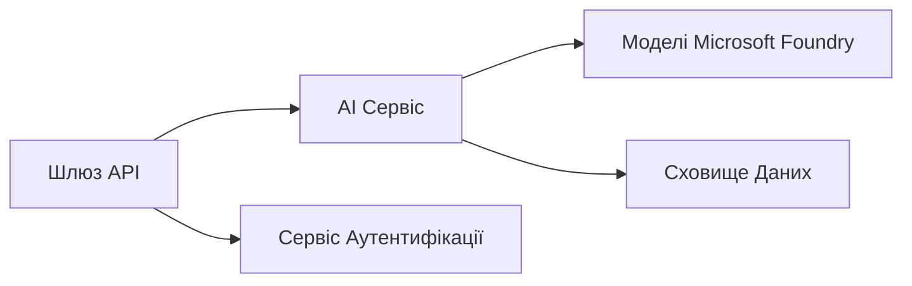

# Розділ 8: Промислові та корпоративні шаблони

**📚 Курс**: [AZD Для початківців](../../README.md) | **⏱️ Тривалість**: 2-3 години | **⭐ Складність**: Просунутий

---

## Огляд

Цей розділ охоплює шаблони розгортання, готові для підприємств, посилення безпеки, моніторинг та оптимізацію витрат для продуктивних навантажень ШІ.

> Перевірено на `azd 1.27.1` у липні 2026 р.

## Цілі навчання

Завершивши цей розділ, ви зможете:
- Розгортати мульти-регіональні стійкі додатки
- Впроваджувати корпоративні шаблони безпеки
- Налаштовувати комплексний моніторинг
- Оптимізовувати витрати у масштабі
- Налаштовувати CI/CD конвеєри з AZD

---

## 📚 Уроки

| # | Урок | Опис | Час |
|---|--------|-------------|------|
| 1 | [Практики продуктивного ШІ](production-ai-practices.md) | Шаблони розгортання для підприємств | 90 хв |

---

## 🚀 Контрольний список для продуктивного середовища

- [ ] Мульти-регіональне розгортання для стійкості
- [ ] Керована ідентичність для автентифікації (без ключів)
- [ ] Application Insights для моніторингу
- [ ] Налаштовані бюджети витрат та оповіщення
- [ ] Увімкнено сканування безпеки
- [ ] Інтеграція CI/CD конвеєром
- [ ] План аварійного відновлення

---

## 🏗️ Архітектурні шаблони

### Шаблон 1: Мікросервісний ШІ



### Шаблон 2: Подієво-орієнтований ШІ


---

## 🔐 Найкращі практики безпеки

```bicep
// Use managed identity
identity: {
  type: 'SystemAssigned'
}

// Private endpoints for AI services
properties: {
  publicNetworkAccess: 'Disabled'
  networkAcls: {
    defaultAction: 'Deny'
  }
}
```

---

## 💰 Оптимізація витрат

| Стратегія | Економія |
|----------|---------|
| Масштабування до нуля (Container Apps) | 60-80% |
| Використання споживчих рівнів для розробки | 50-70% |
| Заплановане масштабування | 30-50% |
| Резервована потужність | 20-40% |

```bash
# Встановити оповіщення про бюджет
az consumption budget create \
  --budget-name "AI-Budget" \
  --amount 500 \
  --category Cost \
  --time-grain Monthly
```

---

## 📊 Налаштування моніторингу

```bash
# Потокове передавання логів
azd monitor --logs

# Перевірте Application Insights
azd monitor --overview

# Переглянути метрики
az monitor metrics list --resource <resource-id>
```

---

## 🔗 Навігація

| Напрямок | Розділ |
|-----------|---------|
| **Попередній** | [Розділ 7: Усунення несправностей](../chapter-07-troubleshooting/README.md) |
| **Курс завершено** | [Домашня сторінка курсу](../../README.md) |

---

## 📖 Пов’язані ресурси

- [Посібник з агентів ШІ](../chapter-02-ai-development/agents.md)
- [Application Insights](../chapter-06-pre-deployment/application-insights.md)
- [Рішення з кількох агентів](../chapter-05-multi-agent/README.md)
- [Приклад мікросервісів](../../examples/microservices/README.md)

---

<!-- CO-OP TRANSLATOR DISCLAIMER START -->
**Відмова від відповідальності**:
Цей документ було перекладено за допомогою сервісу штучного інтелекту для перекладу [Co-op Translator](https://github.com/Azure/co-op-translator). Хоча ми прагнемо до точності, будь ласка, майте на увазі, що автоматичні переклади можуть містити помилки або неточності. Оригінальний документ рідною мовою слід вважати авторитетним джерелом. Для критично важливої інформації рекомендується професійний людський переклад. Ми не несемо відповідальності за будь-які непорозуміння або неправильні тлумачення, що виникли внаслідок використання цього перекладу.
<!-- CO-OP TRANSLATOR DISCLAIMER END -->