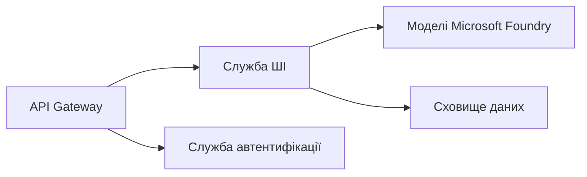

# Розділ 8: Виробничі та корпоративні шаблони

**📚 Курс**: [AZD Для початківців](../../README.md) | **⏱️ Тривалість**: 2-3 години | **⭐ Складність**: Просунутий

---

## Огляд

У цьому розділі розглядаються шаблони розгортання, готові до корпоративного рівня, посилення безпеки, моніторинг і оптимізація витрат для виробничих AI-навантажень.

> Перевірено на `azd 1.25.6` у червні 2026 року.

## Цілі навчання

Після проходження цього розділу ви зможете:
- Розгорнути стійкі додатки з підтримкою декількох регіонів
- Реалізувати корпоративні шаблони безпеки
- Налаштувати комплексний моніторинг
- Оптимізувати витрати в масштабі
- Налаштувати CI/CD конвеєри за допомогою AZD

---

## 📚 Уроки

| # | Урок | Опис | Час |
|---|--------|-------------|------|
| 1 | [Практики виробничого AI](production-ai-practices.md) | Корпоративні шаблони розгортання | 90 хв |

---

## 🚀 Контрольний список для виробництва

- [ ] Розгортання в кількох регіонах для стійкості
- [ ] Керована ідентичність для автентифікації (без ключів)
- [ ] Application Insights для моніторингу
- [ ] Налаштувати бюджети витрат і сповіщення
- [ ] Увімкнено сканування безпеки
- [ ] Інтеграція з CI/CD конвеєром
- [ ] Плани відновлення після аварій

---

## 🏗️ Архітектурні шаблони

### Шаблон 1: Microservices AI



### Шаблон 2: Подієво-орієнтований AI


---

## 🔐 Найкращі практики безпеки

```bicep
// Use managed identity
identity: {
  type: 'SystemAssigned'
}

// Private endpoints for AI services
properties: {
  publicNetworkAccess: 'Disabled'
  networkAcls: {
    defaultAction: 'Deny'
  }
}
```

---

## 💰 Оптимізація витрат

| Стратегія | Економія |
|----------|---------|
| Масштабування до нуля (Container Apps) | 60-80% |
| Використання тарифів споживання для розробки | 50-70% |
| Планове масштабування | 30-50% |
| Зарезервована потужність | 20-40% |

```bash
# Встановити оповіщення про бюджет
az consumption budget create \
  --budget-name "AI-Budget" \
  --amount 500 \
  --category Cost \
  --time-grain Monthly
```

---

## 📊 Налаштування моніторингу

```bash
# Потік журналів
azd monitor --logs

# Перевірте Application Insights
azd monitor --overview

# Переглянути метрики
az monitor metrics list --resource <resource-id>
```

---

## 🔗 Навігація

| Напрямок | Розділ |
|-----------|---------|
| **Попередній** | [Розділ 7: Усунення несправностей](../chapter-07-troubleshooting/README.md) |
| **Завершення курсу** | [Головна сторінка курсу](../../README.md) |

---

## 📖 Пов’язані ресурси

- [Посібник з AI агентів](../chapter-02-ai-development/agents.md)
- [Application Insights](../chapter-06-pre-deployment/application-insights.md)
- [Багатоагентні рішення](../chapter-05-multi-agent/README.md)
- [Приклад Microservices](../../examples/microservices/README.md)

---

<!-- CO-OP TRANSLATOR DISCLAIMER START -->
**Відмова від відповідальності**:
Цей документ було перекладено за допомогою сервісу штучного інтелекту для перекладу [Co-op Translator](https://github.com/Azure/co-op-translator). Хоча ми прагнемо до точності, будь ласка, майте на увазі, що автоматичні переклади можуть містити помилки або неточності. Оригінальний документ рідною мовою слід вважати авторитетним джерелом. Для критично важливої інформації рекомендується професійний людський переклад. Ми не несемо відповідальності за будь-які непорозуміння або неправильні тлумачення, що виникли внаслідок використання цього перекладу.
<!-- CO-OP TRANSLATOR DISCLAIMER END -->