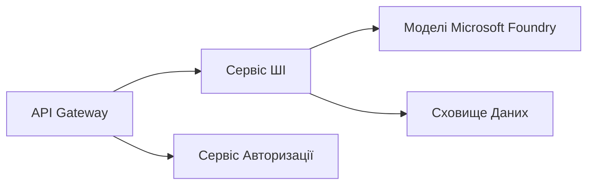

# Розділ 8: Виробничі та корпоративні шаблони

**📚 Курс**: [AZD Для початківців](../../README.md) | **⏱️ Тривалість**: 2-3 години | **⭐ Складність**: Просунутий

---

## Огляд

У цьому розділі розглядаються готові до корпоративного використання шаблони розгортання, посилення безпеки, моніторинг і оптимізація витрат для виробничих AI-навантажень.

> Перевірено за допомогою `azd 1.23.12` у березні 2026 року.

## Цілі навчання

Завершивши цей розділ, ви зможете:
- Розгортати стійкі багаторегіональні додатки
- Впроваджувати корпоративні шаблони безпеки
- Налаштовувати комплексний моніторинг
- Оптимізувати витрати в масштабі
- Налагоджувати CI/CD конвеєри з AZD

---

## 📚 Уроки

| № | Урок | Опис | Час |
|---|-------|--------------|------|
| 1 | [Практики виробничого AI](production-ai-practices.md) | Корпоративні шаблони розгортання | 90 хв |

---

## 🚀 Контрольний список для виробництва

- [ ] Багаторегіональне розгортання для стійкості
- [ ] Керована ідентичність для автентифікації (без ключів)
- [ ] Application Insights для моніторингу
- [ ] Налаштовані бюджети та оповіщення про витрати
- [ ] Увімкнено сканування безпеки
- [ ] Інтеграція CI/CD конвеєру
- [ ] План аварійного відновлення

---

## 🏗️ Архітектурні шаблони

### Шаблон 1: Мікросервісний AI


### Шаблон 2: Подієво-орієнтований AI


---

## 🔐 Найкращі практики безпеки

```bicep
// Use managed identity
identity: {
  type: 'SystemAssigned'
}

// Private endpoints for AI services
properties: {
  publicNetworkAccess: 'Disabled'
  networkAcls: {
    defaultAction: 'Deny'
  }
}
```

---

## 💰 Оптимізація витрат

| Стратегія | Заощадження |
|----------|-------------|
| Масштабування до нуля (Container Apps) | 60-80% |
| Використання рівнів споживання для розробки | 50-70% |
| Планове масштабування | 30-50% |
| Зарезервована потужність | 20-40% |

```bash
# Встановити сповіщення про бюджет
az consumption budget create \
  --budget-name "AI-Budget" \
  --amount 500 \
  --category Cost \
  --time-grain Monthly
```

---

## 📊 Налаштування моніторингу

```bash
# Потік журналів
azd monitor --logs

# Перевірте Application Insights
azd monitor --overview

# Переглянути метрики
az monitor metrics list --resource <resource-id>
```

---

## 🔗 Навігація

| Напрямок | Розділ |
|-----------|---------|
| **Попередній** | [Розділ 7: Усунення несправностей](../chapter-07-troubleshooting/README.md) |
| **Закінчення курсу** | [Домашня сторінка курсу](../../README.md) |

---

## 📖 Пов’язані ресурси

- [Гід по AI-агентам](../chapter-02-ai-development/agents.md)
- [Application Insights](../chapter-06-pre-deployment/application-insights.md)
- [Рішення з кількома агентами](../chapter-05-multi-agent/README.md)
- [Приклад мікросервісів](../../examples/microservices/README.md)

---

<!-- CO-OP TRANSLATOR DISCLAIMER START -->
**Відмова від відповідальності**:  
Цей документ було перекладено за допомогою сервісу автоматичного перекладу [Co-op Translator](https://github.com/Azure/co-op-translator). Хоча ми прагнемо до точності, будь ласка, майте на увазі, що автоматичні переклади можуть містити помилки або неточності. Оригінальний документ мовою оригіналу слід вважати авторитетним джерелом. Для критично важливої інформації рекомендується професійний людський переклад. Ми не несемо відповідальності за будь-які непорозуміння або неправильні тлумачення, які можуть виникнути внаслідок використання цього перекладу.
<!-- CO-OP TRANSLATOR DISCLAIMER END -->