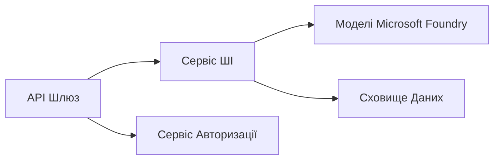

# Розділ 8: Патерни для Продакшн та Підприємств

**📚 Курс**: [AZD для початківців](../../README.md) | **⏱️ Тривалість**: 2-3 години | **⭐ Складність**: Просунутий

---

## Огляд

У цьому розділі розглядаються патерни розгортання, готові до підприємств, підвищення безпеки, моніторинг та оптимізація витрат для продакшн-навантажень в AI.

## Навчальні Цілі

Після проходження цього розділу ви зможете:
- Розгортати додатки з відмовостійкістю в декількох регіонах
- Впроваджувати корпоративні патерни безпеки
- Налаштовувати комплексний моніторинг
- Оптимізувати витрати в масштабі
- Налаштовувати CI/CD пайплайни з AZD

---

## 📚 Уроки

| # | Урок | Опис | Час |
|---|--------|-------------|------|
| 1 | [Практики продакшн AI](production-ai-practices.md) | Патерни розгортання для підприємств | 90 хв |

---

## 🚀 Контрольний список для продакшн

- [ ] Розгортання в декількох регіонах для відмовостійкості
- [ ] Керована ідентичність для автентифікації (без ключів)
- [ ] Application Insights для моніторингу
- [ ] Налаштовані бюджети та сповіщення про витрати
- [ ] Увімкнене сканування безпеки
- [ ] Інтеграція з CI/CD пайплайном
- [ ] План аварійного відновлення

---

## 🏗️ Архітектурні патерни

### Патерн 1: AI на базі мікросервісів


### Патерн 2: Подієво-орієнтований AI


---

## 🔐 Кращі практики безпеки

```bicep
// Use managed identity
identity: {
  type: 'SystemAssigned'
}

// Private endpoints for AI services
properties: {
  publicNetworkAccess: 'Disabled'
  networkAcls: {
    defaultAction: 'Deny'
  }
}
```

---

## 💰 Оптимізація витрат

| Стратегія | Економія |
|----------|---------|
| Масштабування до нуля (Container Apps) | 60-80% |
| Використання тарифних планів за споживанням для розробки | 50-70% |
| Планове масштабування | 30-50% |
| Резервована ємність | 20-40% |

```bash
# Встановити оповіщення про бюджет
az consumption budget create \
  --budget-name "AI-Budget" \
  --amount 500 \
  --category Cost \
  --time-grain Monthly
```

---

## 📊 Налаштування моніторингу

```bash
# Потокові журнали
azd monitor --logs

# Перевірте Application Insights
azd monitor

# Переглянути метрики
az monitor metrics list --resource <resource-id>
```

---

## 🔗 Навігація

| Напрямок | Розділ |
|-----------|---------|
| **Попередній** | [Розділ 7: Виправлення неполадок](../chapter-07-troubleshooting/README.md) |
| **Завершення курсу** | [Головна курсу](../../README.md) |

---

## 📖 Пов’язані ресурси

- [Посібник з AI агентів](../chapter-02-ai-development/agents.md)
- [Application Insights](../chapter-06-pre-deployment/application-insights.md)
- [Рішення з багатьма агентами](../chapter-05-multi-agent/README.md)
- [Приклад мікросервісів](../../examples/microservices/README.md)

---

<!-- CO-OP TRANSLATOR DISCLAIMER START -->
**Відмова від відповідальності**:  
Цей документ було перекладено за допомогою сервісу автоматичного перекладу [Co-op Translator](https://github.com/Azure/co-op-translator). Хоча ми прагнемо до точності, зверніть увагу, що автоматичні переклади можуть містити помилки або неточності. Оригінальний документ рідною мовою слід вважати авторитетним джерелом. Для критичної інформації рекомендується професійний переклад людиною. Ми не несемо відповідальності за будь-які непорозуміння чи неправильні тлумачення, що виникли внаслідок використання цього перекладу.
<!-- CO-OP TRANSLATOR DISCLAIMER END -->