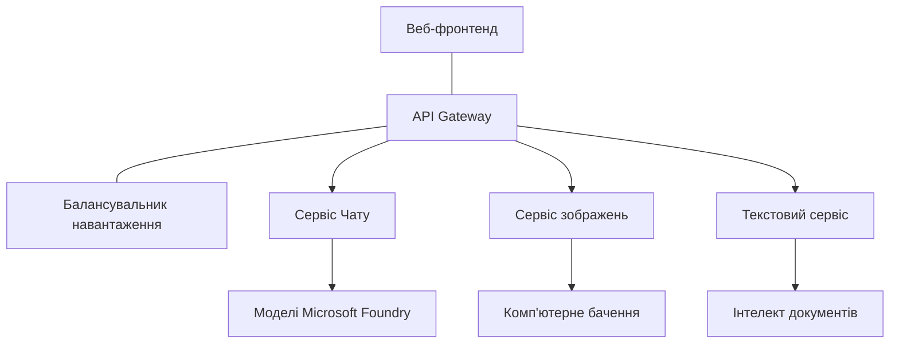

# Production AI Workload Best Practices with AZD

**Chapter Navigation:**
- **📚 Course Home**: [AZD For Beginners](../../README.md)
- **📖 Current Chapter**: Chapter 8 - Production & Enterprise Patterns
- **⬅️ Previous Chapter**: [Chapter 7: Troubleshooting](../chapter-07-troubleshooting/debugging.md)
- **⬅️ Also Related**: [AI Workshop Lab](ai-workshop-lab.md)
- **🎯 Course Complete**: [AZD For Beginners](../../README.md)

## Overview

Цей посібник надає комплексні найкращі практики для розгортання готових до продуктивності AI-навантажень із використанням інструменту Azure Developer CLI (AZD). На основі відгуків спільноти Microsoft Foundry Discord та реальних розгортань клієнтів, ці практики вирішують найпоширеніші проблеми у продуктивних AI-системах.

## Key Challenges Addressed

На основі результатів нашого опитування в спільноті, це основні виклики, з якими стикаються розробники:

- **45%** мають труднощі з багатосервісними AI-розгортаннями
- **38%** мають проблеми з управлінням обліковими даними та секретами  
- **35%** вважають складним забезпечення готовності до продуктивності та масштабування
- **32%** потребують покращених стратегій оптимізації вартості
- **29%** потребують покращеного моніторингу та усунення несправностей

## Architecture Patterns for Production AI

### Pattern 1: Microservices AI Architecture

**Коли використовувати**: складні AI-додатки з кількома можливостями


**Реалізація з AZD**:

```yaml
# azure.yaml
name: enterprise-ai-platform
services:
  web:
    project: ./web
    host: staticwebapp
  api-gateway:
    project: ./api-gateway
    host: containerapp
  chat-service:
    project: ./services/chat
    host: containerapp
  vision-service:
    project: ./services/vision
    host: containerapp
  text-service:
    project: ./services/text
    host: containerapp
```

### Pattern 2: Event-Driven AI Processing

**Коли використовувати**: пакетна обробка, аналіз документів, асинхронні робочі процеси

```bicep
// Event Hub for AI processing pipeline
resource eventHub 'Microsoft.EventHub/namespaces@2023-01-01-preview' = {
  name: eventHubNamespaceName
  location: location
  sku: {
    name: 'Standard'
    tier: 'Standard'
    capacity: 1
  }
}

// Service Bus for reliable message processing
resource serviceBus 'Microsoft.ServiceBus/namespaces@2022-10-01-preview' = {
  name: serviceBusNamespaceName
  location: location
  sku: {
    name: 'Premium'
    tier: 'Premium'
    capacity: 1
  }
}

// Function App for processing
resource functionApp 'Microsoft.Web/sites@2023-01-01' = {
  name: functionAppName
  location: location
  kind: 'functionapp,linux'
  properties: {
    siteConfig: {
      appSettings: [
        {
          name: 'FUNCTIONS_EXTENSION_VERSION'
          value: '~4'
        }
        {
          name: 'AZURE_OPENAI_ENDPOINT'
          value: '@Microsoft.KeyVault(VaultName=${keyVault.name};SecretName=openai-endpoint)'
        }
      ]
    }
  }
}
```

## Thinking About AI Agent Health

Коли традиційний веб-застосунок виходить з ладу, симптоми знайомі: сторінка не завантажується, API повертає помилку, або розгортання завершується невдачею. AI-застосунки можуть виходити з ладу однаковими способами — але вони також можуть поводитись більш тонко, без очевидних повідомлень про помилки.

Цей розділ допоможе вибудувати ментальну модель моніторингу AI-навантажень, щоб знати, де шукати проблему, коли щось йде не так.

### How Agent Health Differs from Traditional App Health

Традиційний застосунок або працює, або ні. AI-агент може здаватися працюючим, але продукувати погані результати. Розглянемо стан агента в два шари:

| Layer | What to Watch | Where to Look |
|-------|--------------|---------------|
| **Інфраструктурне здоров'я** | Чи працює сервіс? Чи надані ресурси? Чи доступні кінцеві точки? | `azd monitor`, здоров'я ресурсів в Azure Portal, логи контейнера/додатку |
| **Здоров'я поведінки** | Чи правильно реагує агент? Чи своєчасні відповіді? Чи коректно викликається модель? | Application Insights traces, метрики затримки виклику моделі, логи якості відповіді |

Інфраструктурне здоров'я знайоме — воно однакове для будь-якого azd-застосунку. Здоров'я поведінки — це новий шар, який додають AI-навантаження.

### Where to Look When AI Apps Don't Behave as Expected

Якщо ваш AI-застосунок не дає очікуваних результатів, ось концептуальний чеклист:

1. **Почніть з основ.** Чи працює застосунок? Чи може він дістатися до своїх залежностей? Перевірте `azd monitor` та здоров'я ресурсів так само, як для будь-якого застосунку.
2. **Перевірте з’єднання з моделлю.** Чи успішно ваш застосунок викликає AI-модель? Невдалі або тайм-аутовані виклики моделі — найпоширеніша причина проблем AI-застосунків і будуть відображені у ваших логах.
3. **Подивіться, що отримала модель.** Відповіді AI залежать від вхідних даних (prompt і будь-якого витягнутого контексту). Якщо вихідні дані помилкові, зазвичай вхідні також некоректні. Перевірте, чи сигналізує ваш застосунок правильні дані моделі.
4. **Перевірте затримку відповіді.** Виклики AI-моделі повільніші за типові API-виклики. Якщо застосунок здається повільним, перевірте, чи не збільшилися часи відповіді моделі — це може вказувати на обмеження пропускної здатності, квоти або регіональні затори.
5. **Слідкуйте за сигналами витрат.** Несподівані стрибки використання токенів або API-викликів можуть вказувати на цикл, некоректний prompt або надмірні повторні запити.

Вам не потрібно одразу освоювати всі інструменти спостереження. Головний висновок — у AI-застосунків є додатковий шар моніторингу поведінки, і вбудований моніторинг azd (`azd monitor`) дає стартову точку для аналізу обох шарів.

---

## Security Best Practices

### 1. Zero-Trust Security Model

**Стратегія впровадження**:
- Жодного сервіс-сервіс зв’язку без автентифікації
- Всі API виклики використовують керовані ідентичності
- Ізоляція мережі з приватними кінцевими точками
- Контроль доступу з мінімальними привілеями

```bicep
// Managed Identity for each service
resource chatServiceIdentity 'Microsoft.ManagedIdentity/userAssignedIdentities@2023-01-31' = {
  name: 'chat-service-identity'
  location: location
}

// Role assignments with minimal permissions
resource openAIUserRole 'Microsoft.Authorization/roleAssignments@2022-04-01' = {
  scope: openAIAccount
  name: guid(openAIAccount.id, chatServiceIdentity.id, openAIUserRoleDefinitionId)
  properties: {
    roleDefinitionId: subscriptionResourceId('Microsoft.Authorization/roleDefinitions', '5e0bd9bd-7b93-4f28-af87-19fc36ad61bd')
    principalId: chatServiceIdentity.properties.principalId
    principalType: 'ServicePrincipal'
  }
}
```

### 2. Secure Secret Management

**Патерн інтеграції з Key Vault**:

```bicep
// Key Vault with proper access policies
resource keyVault 'Microsoft.KeyVault/vaults@2023-02-01' = {
  name: keyVaultName
  location: location
  properties: {
    tenantId: tenant().tenantId
    sku: {
      family: 'A'
      name: 'premium'  // Use premium for production
    }
    enableRbacAuthorization: true  // Use RBAC instead of access policies
    enablePurgeProtection: true    // Prevent accidental deletion
    enableSoftDelete: true
    softDeleteRetentionInDays: 90
  }
}

// Store all AI service credentials
resource openAIKeySecret 'Microsoft.KeyVault/vaults/secrets@2023-02-01' = {
  parent: keyVault
  name: 'openai-api-key'
  properties: {
    value: openAIAccount.listKeys().key1
    attributes: {
      enabled: true
    }
  }
}
```

### 3. Network Security

**Конфігурація приватних кінцевих точок**:

```bicep
// Virtual Network for AI services
resource virtualNetwork 'Microsoft.Network/virtualNetworks@2023-04-01' = {
  name: vnetName
  location: location
  properties: {
    addressSpace: {
      addressPrefixes: ['10.0.0.0/16']
    }
    subnets: [
      {
        name: 'ai-services-subnet'
        properties: {
          addressPrefix: '10.0.1.0/24'
          privateEndpointNetworkPolicies: 'Disabled'
        }
      }
      {
        name: 'app-services-subnet'
        properties: {
          addressPrefix: '10.0.2.0/24'
          delegations: [
            {
              name: 'Microsoft.Web/serverFarms'
              properties: {
                serviceName: 'Microsoft.Web/serverFarms'
              }
            }
          ]
        }
      }
    ]
  }
}

// Private endpoints for all AI services
resource openAIPrivateEndpoint 'Microsoft.Network/privateEndpoints@2023-04-01' = {
  name: '${openAIAccountName}-pe'
  location: location
  properties: {
    subnet: {
      id: virtualNetwork.properties.subnets[0].id
    }
    privateLinkServiceConnections: [
      {
        name: 'openai-connection'
        properties: {
          privateLinkServiceId: openAIAccount.id
          groupIds: ['account']
        }
      }
    ]
  }
}
```

## Performance and Scaling

### 1. Auto-Scaling Strategies

**Автоматичне масштабування для контейнерних застосунків**:

```bicep
resource containerApp 'Microsoft.App/containerApps@2023-05-01' = {
  name: containerAppName
  location: location
  properties: {
    configuration: {
      ingress: {
        external: true
        targetPort: 8000
        transport: 'http'
      }
    }
    template: {
      scale: {
        minReplicas: 2  // Always have 2 instances minimum
        maxReplicas: 50 // Scale up to 50 for high load
        rules: [
          {
            name: 'http-scaling'
            http: {
              metadata: {
                concurrentRequests: '20'  // Scale when >20 concurrent requests
              }
            }
          }
          {
            name: 'cpu-scaling'
            custom: {
              type: 'cpu'
              metadata: {
                type: 'Utilization'
                value: '70'  // Scale when CPU >70%
              }
            }
          }
        ]
      }
    }
  }
}
```

### 2. Caching Strategies

**Redis кеш для AI-відповідей**:

```bicep
// Redis Premium for production workloads
resource redisCache 'Microsoft.Cache/redis@2023-04-01' = {
  name: redisCacheName
  location: location
  properties: {
    sku: {
      name: 'Premium'
      family: 'P'
      capacity: 1
    }
    enableNonSslPort: false
    minimumTlsVersion: '1.2'
    redisConfiguration: {
      'maxmemory-policy': 'allkeys-lru'
    }
    // Enable clustering for high availability
    redisVersion: '6.0'
    shardCount: 2
  }
}

// Cache configuration in application
var cacheConnectionString = '${redisCache.properties.hostName}:6380,password=${redisCache.listKeys().primaryKey},ssl=True,abortConnect=False'
```

### 3. Load Balancing and Traffic Management

**Application Gateway з WAF**:

```bicep
// Application Gateway with Web Application Firewall
resource applicationGateway 'Microsoft.Network/applicationGateways@2023-04-01' = {
  name: appGatewayName
  location: location
  properties: {
    sku: {
      name: 'WAF_v2'
      tier: 'WAF_v2'
      capacity: 2
    }
    webApplicationFirewallConfiguration: {
      enabled: true
      firewallMode: 'Prevention'
      ruleSetType: 'OWASP'
      ruleSetVersion: '3.2'
    }
    // Backend pools for AI services
    backendAddressPools: [
      {
        name: 'ai-services-pool'
        properties: {
          backendAddresses: [
            {
              fqdn: '${containerApp.properties.configuration.ingress.fqdn}'
            }
          ]
        }
      }
    ]
  }
}
```

## 💰 Cost Optimization

### 1. Resource Right-Sizing

**Конфігурації середовищ за вимогою**:

```bash
# Середовище розробки
azd env new development
azd env set AZURE_OPENAI_SKU "S0"
azd env set AZURE_OPENAI_CAPACITY 10
azd env set AZURE_SEARCH_SKU "basic"
azd env set CONTAINER_CPU 0.5
azd env set CONTAINER_MEMORY 1.0

# Середовище виробництва
azd env new production
azd env set AZURE_OPENAI_SKU "S0"
azd env set AZURE_OPENAI_CAPACITY 100
azd env set AZURE_SEARCH_SKU "standard"
azd env set CONTAINER_CPU 2.0
azd env set CONTAINER_MEMORY 4.0
```

### 2. Cost Monitoring and Budgets

```bicep
// Cost management and budgets
resource budget 'Microsoft.Consumption/budgets@2023-05-01' = {
  name: 'ai-workload-budget'
  properties: {
    timePeriod: {
      startDate: '2024-01-01'
      endDate: '2024-12-31'
    }
    timeGrain: 'Monthly'
    amount: 2000  // $2000 monthly budget
    category: 'Cost'
    notifications: {
      warning: {
        enabled: true
        operator: 'GreaterThan'
        threshold: 80
        contactEmails: [
          'finance@company.com'
          'engineering@company.com'
        ]
        contactRoles: [
          'Owner'
          'Contributor'
        ]
      }
      critical: {
        enabled: true
        operator: 'GreaterThan'
        threshold: 95
        contactEmails: [
          'cto@company.com'
        ]
      }
    }
  }
}
```

### 3. Token Usage Optimization

**Управління вартістю OpenAI**:

```typescript
// Оптимізація токенів на рівні застосунку
class TokenOptimizer {
  private readonly maxTokens = 4000;
  private readonly reserveTokens = 500;
  
  optimizePrompt(userInput: string, context: string): string {
    const availableTokens = this.maxTokens - this.reserveTokens;
    const estimatedTokens = this.estimateTokens(userInput + context);
    
    if (estimatedTokens > availableTokens) {
      // Обрізати контекст, а не введення користувача
      context = this.truncateContext(context, availableTokens - this.estimateTokens(userInput));
    }
    
    return `${context}\n\nUser: ${userInput}`;
  }
  
  private estimateTokens(text: string): number {
    // Приблизна оцінка: 1 токен ≈ 4 символи
    return Math.ceil(text.length / 4);
  }
}
```

## Monitoring and Observability

### 1. Comprehensive Application Insights

```bicep
// Application Insights with advanced features
resource applicationInsights 'Microsoft.Insights/components@2020-02-02' = {
  name: applicationInsightsName
  location: location
  kind: 'web'
  properties: {
    Application_Type: 'web'
    WorkspaceResourceId: logAnalyticsWorkspace.id
    SamplingPercentage: 100  // Full sampling for AI apps
    DisableIpMasking: false  // Enable for security
  }
}

// Custom metrics for AI operations
resource aiMetricAlerts 'Microsoft.Insights/metricAlerts@2018-03-01' = {
  name: 'ai-high-error-rate'
  location: 'global'
  properties: {
    description: 'Alert when AI service error rate is high'
    severity: 2
    enabled: true
    scopes: [
      applicationInsights.id
    ]
    evaluationFrequency: 'PT1M'
    windowSize: 'PT5M'
    criteria: {
      'odata.type': 'Microsoft.Azure.Monitor.SingleResourceMultipleMetricCriteria'
      allOf: [
        {
          name: 'high-error-rate'
          metricName: 'requests/failed'
          operator: 'GreaterThan'
          threshold: 10
          timeAggregation: 'Count'
        }
      ]
    }
  }
}
```

### 2. AI-Specific Monitoring

**Користувацькі панелі для AI-метрик**:

```json
// Dashboard configuration for AI workloads
{
  "dashboard": {
    "name": "AI Application Monitoring",
    "tiles": [
      {
        "name": "OpenAI Request Volume",
        "query": "requests | where name contains 'openai' | summarize count() by bin(timestamp, 5m)"
      },
      {
        "name": "AI Response Latency",
        "query": "requests | where name contains 'openai' | summarize avg(duration) by bin(timestamp, 5m)"
      },
      {
        "name": "Token Usage",
        "query": "customMetrics | where name == 'openai_tokens_used' | summarize sum(value) by bin(timestamp, 1h)"
      },
      {
        "name": "Cost per Hour",
        "query": "customMetrics | where name == 'openai_cost' | summarize sum(value) by bin(timestamp, 1h)"
      }
    ]
  }
}
```

### 3. Health Checks and Uptime Monitoring

```bicep
// Application Insights availability tests
resource availabilityTest 'Microsoft.Insights/webtests@2022-06-15' = {
  name: 'ai-app-availability-test'
  location: location
  tags: {
    'hidden-link:${applicationInsights.id}': 'Resource'
  }
  properties: {
    SyntheticMonitorId: 'ai-app-availability-test'
    Name: 'AI Application Availability Test'
    Description: 'Tests AI application endpoints'
    Enabled: true
    Frequency: 300  // 5 minutes
    Timeout: 120    // 2 minutes
    Kind: 'ping'
    Locations: [
      {
        Id: 'us-east-2-azr'
      }
      {
        Id: 'us-west-2-azr'
      }
    ]
    Configuration: {
      WebTest: '''
        <WebTest Name="AI Health Check" 
                 Id="8d2de8d2-a2b0-4c2e-9a0d-8f9c9a0b8c8d" 
                 Enabled="True" 
                 CssProjectStructure="" 
                 CssIteration="" 
                 Timeout="120" 
                 WorkItemIds="" 
                 xmlns="http://microsoft.com/schemas/VisualStudio/TeamTest/2010" 
                 Description="" 
                 CredentialUserName="" 
                 CredentialPassword="" 
                 PreAuthenticate="True" 
                 Proxy="default" 
                 StopOnError="False" 
                 RecordedResultFile="" 
                 ResultsLocale="">
          <Items>
            <Request Method="GET" 
                     Guid="a5f10126-e4cd-570d-961c-cea43999a200" 
                     Version="1.1" 
                     Url="${webApp.properties.defaultHostName}/health" 
                     ThinkTime="0" 
                     Timeout="120" 
                     ParseDependentRequests="True" 
                     FollowRedirects="True" 
                     RecordResult="True" 
                     Cache="False" 
                     ResponseTimeGoal="0" 
                     Encoding="utf-8" 
                     ExpectedHttpStatusCode="200" 
                     ExpectedResponseUrl="" 
                     ReportingName="" 
                     IgnoreHttpStatusCode="False" />
          </Items>
        </WebTest>
      '''
    }
  }
}
```

## Disaster Recovery and High Availability

### 1. Multi-Region Deployment

```yaml
# azure.yaml - Multi-region configuration
name: ai-app-multiregion
services:
  api-primary:
    project: ./api
    host: containerapp
    env:
      - AZURE_REGION=eastus
  api-secondary:
    project: ./api
    host: containerapp
    env:
      - AZURE_REGION=westus2
```

```bicep
// Traffic Manager for global load balancing
resource trafficManager 'Microsoft.Network/trafficManagerProfiles@2022-04-01' = {
  name: trafficManagerProfileName
  location: 'global'
  properties: {
    profileStatus: 'Enabled'
    trafficRoutingMethod: 'Priority'
    dnsConfig: {
      relativeName: trafficManagerProfileName
      ttl: 30
    }
    monitorConfig: {
      protocol: 'HTTPS'
      port: 443
      path: '/health'
      intervalInSeconds: 30
      toleratedNumberOfFailures: 3
      timeoutInSeconds: 10
    }
    endpoints: [
      {
        name: 'primary-endpoint'
        type: 'Microsoft.Network/trafficManagerProfiles/azureEndpoints'
        properties: {
          targetResourceId: primaryAppService.id
          endpointStatus: 'Enabled'
          priority: 1
        }
      }
      {
        name: 'secondary-endpoint'
        type: 'Microsoft.Network/trafficManagerProfiles/azureEndpoints'
        properties: {
          targetResourceId: secondaryAppService.id
          endpointStatus: 'Enabled'
          priority: 2
        }
      }
    ]
  }
}
```

### 2. Data Backup and Recovery

```bicep
// Backup configuration for critical data
resource backupVault 'Microsoft.DataProtection/backupVaults@2023-05-01' = {
  name: backupVaultName
  location: location
  identity: {
    type: 'SystemAssigned'
  }
  properties: {
    storageSettings: [
      {
        datastoreType: 'VaultStore'
        type: 'LocallyRedundant'
      }
    ]
  }
}

// Backup policy for AI models and data
resource backupPolicy 'Microsoft.DataProtection/backupVaults/backupPolicies@2023-05-01' = {
  parent: backupVault
  name: 'ai-data-backup-policy'
  properties: {
    policyRules: [
      {
        backupParameters: {
          backupType: 'Full'
          objectType: 'AzureBackupParams'
        }
        trigger: {
          schedule: {
            repeatingTimeIntervals: [
              'R/2024-01-01T02:00:00+00:00/P1D'  // Daily at 2 AM
            ]
          }
          objectType: 'ScheduleBasedTriggerContext'
        }
        dataStore: {
          datastoreType: 'VaultStore'
          objectType: 'DataStoreInfoBase'
        }
        name: 'BackupDaily'
        objectType: 'AzureBackupRule'
      }
    ]
  }
}
```

## DevOps and CI/CD Integration

### 1. GitHub Actions Workflow

```yaml
# .github/workflows/deploy-ai-app.yml
name: Deploy AI Application

on:
  push:
    branches: [main]
  pull_request:
    branches: [main]

jobs:
  test:
    runs-on: ubuntu-latest
    steps:
      - uses: actions/checkout@v4
      
      - name: Setup Python
        uses: actions/setup-python@v4
        with:
          python-version: '3.11'
          
      - name: Install dependencies
        run: |
          pip install -r requirements.txt
          pip install pytest
          
      - name: Run tests
        run: pytest tests/
        
      - name: AI Safety Tests
        run: |
          python scripts/test_ai_safety.py
          python scripts/validate_prompts.py

  deploy-staging:
    needs: test
    if: github.event_name == 'pull_request'
    runs-on: ubuntu-latest
    steps:
      - uses: actions/checkout@v4
      
      - name: Setup AZD
        uses: Azure/setup-azd@v1.0.0
        
      - name: Login to Azure
        uses: azure/login@v1
        with:
          creds: ${{ secrets.AZURE_CREDENTIALS }}
          
      - name: Deploy to Staging
        run: |
          azd env select staging
          azd deploy

  deploy-production:
    needs: test
    if: github.ref == 'refs/heads/main'
    runs-on: ubuntu-latest
    steps:
      - uses: actions/checkout@v4
      
      - name: Setup AZD
        uses: Azure/setup-azd@v1.0.0
        
      - name: Login to Azure
        uses: azure/login@v1
        with:
          creds: ${{ secrets.AZURE_CREDENTIALS }}
          
      - name: Deploy to Production
        run: |
          azd env select production
          azd deploy
          
      - name: Run Production Health Checks
        run: |
          python scripts/health_check.py --env production
```

### 2. Infrastructure Validation

```bash
# scripts/validate_infrastructure.sh
#!/bin/bash

echo "Validating AI infrastructure deployment..."

# Перевірте, чи всі необхідні служби працюють
services=("openai" "search" "storage" "keyvault")
for service in "${services[@]}"; do
    echo "Checking $service..."
    if ! az resource list --resource-type "Microsoft.CognitiveServices/accounts" --query "[?contains(name, '$service')]" -o tsv; then
        echo "ERROR: $service not found"
        exit 1
    fi
done

# Перевірте розгортання моделей OpenAI
echo "Validating OpenAI model deployments..."
models=$(az cognitiveservices account deployment list --name $AZURE_OPENAI_NAME --resource-group $AZURE_RESOURCE_GROUP --query "[].name" -o tsv)
if [[ ! $models == *"gpt-35-turbo"* ]]; then
    echo "ERROR: Required model gpt-35-turbo not deployed"
    exit 1
fi

# Тестуйте підключення до AI-служби
echo "Testing AI service connectivity..."
python scripts/test_connectivity.py

echo "Infrastructure validation completed successfully!"
```

## Production Readiness Checklist

### Security ✅
- [ ] Всі сервіси використовують керовані ідентичності
- [ ] Секрети зберігаються в Key Vault
- [ ] Налаштовані приватні кінцеві точки
- [ ] Впроваджені мережеві групи безпеки
- [ ] RBAC з мінімальними привілеями
- [ ] WAF увімкнено на публічних кінцевих точках

### Performance ✅
- [ ] Налаштоване авто-масштабування
- [ ] Впроваджено кешування
- [ ] Налаштовано балансування навантаження
- [ ] CDN для статичного контенту
- [ ] Пул підключень до бази даних
- [ ] Оптимізація використання токенів

### Monitoring ✅
- [ ] Налаштовано Application Insights
- [ ] Визначено користувацькі метрики
- [ ] Налаштовано правила сповіщень
- [ ] Створено панель моніторингу
- [ ] Впроваджено health checks
- [ ] Політики зберігання логів

### Reliability ✅
- [ ] Мульти-регіональне розгортання
- [ ] План резервного копіювання та відновлення
- [ ] Впроваджено circuit breakers
- [ ] Налаштовані політики повторних спроб
- [ ] Граціозна деградація
- [ ] Endpoints для перевірки здоров’я

### Cost Management ✅
- [ ] Налаштовані оповіщення бюджету
- [ ] Оптимальний розмір ресурсів
- [ ] Застосовані знижки для dev/test
- [ ] Придбані зарезервовані екземпляри
- [ ] Панель моніторингу витрат
- [ ] Регулярний перегляд витрат

### Compliance ✅
- [ ] Виконані вимоги щодо розташування даних
- [ ] Увімкнено аудит логування
- [ ] Застосовані політики відповідності
- [ ] Впроваджені базові заходи безпеки
- [ ] Регулярні оцінки безпеки
- [ ] План реагування на інциденти

## Performance Benchmarks

### Typical Production Metrics

| Metric | Target | Monitoring |
|--------|--------|------------|
| **Час відповіді** | < 2 секунди | Application Insights |
| **Доступність** | 99.9% | Моніторинг часу роботи |
| **Рівень помилок** | < 0.1% | Логи застосунку |
| **Використання токенів** | < $500/місяць | Управління витратами |
| **Паралельні користувачі** | 1000+ | Навантажувальне тестування |
| **Час відновлення** | < 1 година | Тести аварійного відновлення |

### Load Testing

```bash
# Скрипт навантажувального тестування для AI-додатків
python scripts/load_test.py \
  --endpoint https://your-ai-app.azurewebsites.net \
  --concurrent-users 100 \
  --duration 300 \
  --ramp-up 60
```

## 🤝 Community Best Practices

На основі відгуків спільноти Microsoft Foundry Discord:

### Найкращі рекомендації спільноти:

1. **Починайте з малого, масштабуйтесь поступово**: Починайте з базових SKU та масштабуйтесь відповідно до реального використання
2. **Моніторьте все**: Налаштуйте комплексний моніторинг з першого дня
3. **Автоматизуйте безпеку**: Використовуйте інфраструктуру як код для послідовної безпеки
4. **Тестуйте ретельно**: Включайте AI-специфічне тестування у ваш пайплайн
5. **Плануйте витрати**: Слідкуйте за використанням токенів і встановлюйте оповіщення бюджету заздалегідь

### Поширені помилки, яких слід уникати:

- ❌ Жорстке кодування ключів API у коді
- ❌ Відсутність належного моніторингу
- ❌ Ігнорування оптимізації витрат
- ❌ Відсутність тестування сценаріїв відмов
- ❌ Розгортання без перевірки стану сервісів

## AZD AI CLI Commands and Extensions

AZD включає зростаючий набір команд і розширень, спеціально для AI, які спрощують робочі процеси продуктивних AI-навантажень. Ці інструменти створюють міст між локальною розробкою і розгортанням у продуктивному середовищі AI.

### AZD Extensions for AI

AZD використовує систему розширень для додавання AI-специфічних можливостей. Встановлюйте та керуйте розширеннями за допомогою:

```bash
# Перелік усіх доступних розширень (включаючи AI)
azd extension list

# Встановити розширення агентів Foundry
azd extension install azure.ai.agents

# Встановити розширення тонкого налаштування
azd extension install azure.ai.finetune

# Встановити розширення користувацьких моделей
azd extension install azure.ai.models

# Оновити всі встановлені розширення
azd extension upgrade --all
```

**Доступні AI-розширення:**

| Extension | Purpose | Status |
|-----------|---------|--------|
| `azure.ai.agents` | Керування Foundry Agent Service | Preview |
| `azure.ai.finetune` | Тонке налаштування моделей Foundry | Preview |
| `azure.ai.models` | Користувацькі моделі Foundry | Preview |
| `azure.coding-agent` | Конфігурація coding agent | Available |

### Initializing Agent Projects with `azd ai agent init`

Команда `azd ai agent init` створює проект AI-агента, готового до продуктивності, інтегрованого з Microsoft Foundry Agent Service:

```bash
# Ініціалізувати новий агентський проєкт з маніфесту агента
azd ai agent init -m <manifest-path-or-uri>

# Ініціалізувати і націлити конкретний проєкт Foundry
azd ai agent init -m agent-manifest.yaml --project-id <foundry-project-id>

# Ініціалізувати з користувацькою директорією джерела
azd ai agent init -m agent-manifest.yaml --src ./agents/my-agent

# Націлити Container Apps як хост
azd ai agent init -m agent-manifest.yaml --host containerapp
```

**Ключові прапорці:**

| Flag | Description |
|------|-------------|
| `-m, --manifest` | Шлях або URI до маніфесту агента для додавання у проект |
| `-p, --project-id` | Існуючий ID проекту Microsoft Foundry для вашого середовища azd |
| `-s, --src` | Каталог для завантаження визначення агента (за замовчуванням `src/<agent-id>`) |
| `--host` | Перезапис хоста за замовчуванням (наприклад, `containerapp`) |
| `-e, --environment` | Середовище azd для використання |

**Порада для продуктивності**: Використовуйте `--project-id` для прямого підключення до існуючого проекту Foundry, зберігаючи ваш код агента та хмарні ресурси зв’язаними з самого початку.

### Model Context Protocol (MCP) with `azd mcp`

AZD містить вбудовану підтримку MCP-сервера (Alpha), що дозволяє AI-агентам і інструментам взаємодіяти з вашими ресурсами Azure через стандартизований протокол:

```bash
# Запустіть сервер MCP для вашого проєкту
azd mcp start

# Керуйте згодою інструменту для операцій MCP
azd mcp consent
```

MCP-сервер відкриває контекст вашого проекту azd — середовища, сервіси та ресурси Azure — для AI-інструментів розробки. Це забезпечує:

- **AI-підтримуване розгортання**: дозволяє coding agents запитувати стан вашого проекту і запускати розгортання
- **Виявлення ресурсів**: AI-інструменти можуть знаходити, які ресурси Azure використовує ваш проект
- **Управління середовищем**: агенти можуть перемикатися між dev/staging/production середовищами

### Infrastructure Generation with `azd infra generate`

Для продуктивних AI-навантажень ви можете генерувати і налаштовувати інфраструктуру як код замість автоматичного надання:

```bash
# Генерувати файли Bicep/Terraform з вашого визначення проєкту
azd infra generate
```

Це записує IaC на диск, щоб ви могли:
- Переглядати та перевіряти інфраструктуру перед розгортанням
- Додавати власні політики безпеки (мережеві правила, приватні кінцеві точки)
- Інтегруватися з існуючими процесами перевірки IaC
- Вести контроль версій інфраструктурних змін окремо від коду застосунку

### Production Lifecycle Hooks

AZD hooks дозволяють вам впроваджувати власну логіку на кожному етапі життєвого циклу розгортання — критично для продуктивних AI-робочих процесів:

```yaml
# azure.yaml - Production hooks example
name: ai-production-app
hooks:
  preprovision:
    shell: sh
    run: scripts/validate-quotas.sh    # Check AI model quota before provisioning
  postprovision:
    shell: sh
    run: scripts/configure-networking.sh  # Set up private endpoints
  predeploy:
    shell: sh
    run: scripts/run-ai-safety-tests.sh  # Run prompt safety checks
  postdeploy:
    shell: sh
    run: scripts/smoke-test.sh           # Verify agent responses post-deploy
services:
  agent-api:
    project: ./src/agent
    host: containerapp
    hooks:
      predeploy:
        shell: sh
        run: scripts/validate-model-access.sh  # Per-service hook
```

```bash
# Запустіть конкретний хук вручну під час розробки
azd hooks run predeploy
```

**Рекомендовані production hooks для AI-навантажень:**

| Hook | Use Case |
|------|----------|
| `preprovision` | Перевірка квот підписки для потужностей AI-моделі |
| `postprovision` | Налаштування приватних кінцевих точок, розгортання ваг моделі |
| `predeploy` | Запуск тестів безпеки AI, перевірка шаблонів prompt |
| `postdeploy` | Димові тести відповідей агента, перевірка підключення до моделі |

### CI/CD Pipeline Configuration

Використовуйте `azd pipeline config` для підключення проекту до GitHub Actions або Azure Pipelines із безпечною Azure-аутентифікацією:

```bash
# Налаштувати конвеєр CI/CD (інтерактивно)
azd pipeline config

# Налаштувати з конкретним провайдером
azd pipeline config --provider github
```

Ця команда:
- Створює service principal з мінімальним доступом
- Налаштовує федеративні облікові дані (без збережених секретів)
- Генерує або оновлює файл визначення пайплайну
- Налаштовує необхідні змінні оточення у вашій CI/CD системі

**Продакшн-робочий процес із pipeline config:**

```bash
# 1. Налаштувати виробниче середовище
azd env new production
azd env set AZURE_OPENAI_CAPACITY 100

# 2. Налаштувати конвеєр
azd pipeline config --provider github

# 3. Конвеєр запускає azd deploy при кожному пуші в main
```

### Adding Components with `azd add`

Поступово додавайте Azure-сервіси до існуючого проекту:

```bash
# Додати новий компонент служби інтерактивно
azd add
```

Це особливо корисно для розширення продуктивних AI-застосунків — наприклад, додавання сервісу пошуку за вектором, нового кінцевого пункту агента або компонента моніторингу в існуюче розгортання.

## Additional Resources
- **Azure Well-Architected Framework**: [Інструкції щодо робочих навантажень ШІ](https://learn.microsoft.com/azure/well-architected/ai/)
- **Microsoft Foundry Documentation**: [Офіційна документація](https://learn.microsoft.com/azure/ai-studio/)
- **Community Templates**: [Приклади Azure](https://github.com/Azure-Samples)
- **Discord Community**: [#Azure канал](https://discord.gg/microsoft-azure)
- **Agent Skills for Azure**: [microsoft/github-copilot-for-azure на skills.sh](https://skills.sh/microsoft/github-copilot-for-azure) - 37 відкритих навичок агентів для Azure AI, Foundry, розгортання, оптимізації витрат і діагностики. Встановіть у вашому редакторі:
  ```bash
  npx skills add microsoft/github-copilot-for-azure
  ```

---

**Навігація по розділах:**
- **📚 Домашня сторінка курсу**: [AZD Для початківців](../../README.md)
- **📖 Поточний розділ**: Розділ 8 - Патерни для продакшн та підприємств
- **⬅️ Попередній розділ**: [Розділ 7: Вирішення проблем](../chapter-07-troubleshooting/debugging.md)
- **⬅️ Також пов’язано**: [Лабораторія AI Workshop](ai-workshop-lab.md)
- **� Курс завершено**: [AZD Для початківців](../../README.md)

**Пам’ятайте**: робочі навантаження ШІ в продакшн потребують ретельного планування, моніторингу та постійної оптимізації. Починайте з цих паттернів і адаптуйте їх до ваших специфічних вимог.

---

<!-- CO-OP TRANSLATOR DISCLAIMER START -->
**Відмова від відповідальності**:  
Цей документ було перекладено за допомогою сервісу AI-перекладу [Co-op Translator](https://github.com/Azure/co-op-translator). Хоча ми прагнемо до точності, будь ласка, майте на увазі, що автоматичні переклади можуть містити помилки або неточності. Оригінальний документ рідною мовою слід вважати авторитетним джерелом. Для критичної інформації рекомендується професійний людський переклад. Ми не несемо відповідальності за будь-які непорозуміння або неправильні тлумачення, що виникли внаслідок використання цього перекладу.
<!-- CO-OP TRANSLATOR DISCLAIMER END -->