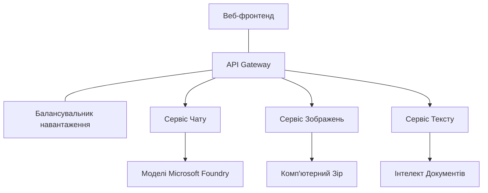

# Найкращі практики продуктивного AI-навантаження з AZD

**Навігація по розділах:**
- **📚 Головна сторінка курсу**: [AZD For Beginners](../../README.md)
- **📖 Поточний розділ**: Розділ 8 - Продуктові та корпоративні патерни
- **⬅️ Попередній розділ**: [Розділ 7: Усунення несправностей](../chapter-07-troubleshooting/debugging.md)
- **⬅️ Також пов’язано**: [AI Workshop Lab](ai-workshop-lab.md)
- **🎯 Завершення курсу**: [AZD For Beginners](../../README.md)

## Огляд

Цей посібник надає комплексні найкращі практики для розгортання готових до продукції AI-навантажень за допомогою Azure Developer CLI (AZD). На основі відгуків спільноти Microsoft Foundry Discord та реального досвіду клієнтів, ці практики охоплюють найпоширеніші проблеми в продуктивних AI-системах.

## Основні розглянуті проблеми

За результатами нашого опитування спільноти, ось топ-завдань, з якими стикаються розробники:

- **45%** мають труднощі з багатосервісними AI-розгортаннями
- **38%** мають проблеми з управлінням обліковими даними та секретами  
- **35%** вважають складною готовність до продукції та масштабування
- **32%** потребують кращих стратегій оптимізації витрат
- **29%** потребують покращеного моніторингу та усунення несправностей

## Патерни архітектури для продуктивного AI

### Патерн 1: Мікросервісна AI-архітектура

**Коли використовувати**: Складні AI-додатки з кількома можливостями



**Імплементація в AZD**:

```yaml
# azure.yaml
name: enterprise-ai-platform
services:
  web:
    project: ./web
    host: staticwebapp
  api-gateway:
    project: ./api-gateway
    host: containerapp
  chat-service:
    project: ./services/chat
    host: containerapp
  vision-service:
    project: ./services/vision
    host: containerapp
  text-service:
    project: ./services/text
    host: containerapp
```

### Патерн 2: Обробка AI на основі подій

**Коли використовувати**: Пакетна обробка, аналіз документів, асинхронні робочі процеси

```bicep
// Event Hub for AI processing pipeline
resource eventHub 'Microsoft.EventHub/namespaces@2023-01-01-preview' = {
  name: eventHubNamespaceName
  location: location
  sku: {
    name: 'Standard'
    tier: 'Standard'
    capacity: 1
  }
}

// Service Bus for reliable message processing
resource serviceBus 'Microsoft.ServiceBus/namespaces@2022-10-01-preview' = {
  name: serviceBusNamespaceName
  location: location
  sku: {
    name: 'Premium'
    tier: 'Premium'
    capacity: 1
  }
}

// Function App for processing
resource functionApp 'Microsoft.Web/sites@2023-01-01' = {
  name: functionAppName
  location: location
  kind: 'functionapp,linux'
  properties: {
    siteConfig: {
      appSettings: [
        {
          name: 'FUNCTIONS_EXTENSION_VERSION'
          value: '~4'
        }
        {
          name: 'AZURE_OPENAI_ENDPOINT'
          value: '@Microsoft.KeyVault(VaultName=${keyVault.name};SecretName=openai-endpoint)'
        }
      ]
    }
  }
}
```

## Роздуми про здоров’я AI-агента

Коли традиційний веб-додаток ламається, прояви знайомі: сторінка не завантажується, API повертає помилку або розгортання не вдається. AI-застосунки можуть ламатися так само, але також поводяться більш делікатно, без очевидних повідомлень про помилки.

Цей розділ допомагає побудувати ментальну модель моніторингу AI-навантажень, щоб знати, куди дивитися, якщо щось йде не так.

### Чим здоров’я агента відрізняється від здоров’я традиційного додатка

Традиційний додаток або працює, або ні. AI-агент може виглядати працюючим, але давати погані результати. Уявляйте здоров’я агента у двох шарах:

| Шар | На що дивитися | Де шукати |
|-------|--------------|---------------|
| **Здоров’я інфраструктури** | Чи працює сервіс? Чи виділені ресурси? Чи досяжні кінцеві точки? | `azd monitor`, здоров’я ресурсів в Azure Portal, логи контейнерів/додатків |
| **Здоров’я поведінки** | Чи відповідає агент точно? Чи відповіді вчасні? Чи коректно викликається модель? | трасування Application Insights, метрики затримки викликів моделі, логи якості відповідей |

Здоров’я інфраструктури знайоме — так само, як у будь-якого azd-додатка. Здоров’я поведінки — це новий шар, який вводять AI-навантаження.

### Куди дивитися, коли AI-додатки поводяться не так, як очікувалося

Якщо ваш AI-додаток не дає бажаних результатів, ось концептуальний чекліст:

1. **Почніть з основ.** Чи запущено додаток? Чи він може звертатись до своїх залежностей? Перевірте `azd monitor` і здоров’я ресурсів, як для звичайного додатку.
2. **Перевірте підключення до моделі.** Чи успішно ваше додаток викликає AI-модель? Невдалі або з тайм-аутом виклики моделі — найпоширеніша причина проблем і будуть видно в логах додатку.
3. **Подивіться, що модель отримала.** Відповіді AI залежать від вводу (промпт і будь-який витягнутий контекст). Якщо вихід некоректний, вхід зазвичай неправильний. Перевірте, чи ваше додаток надсилає в модель правильні дані.
4. **Перевірте затримку відповіді.** Виклики AI-моделі повільніші, ніж звичайні API-виклики. Якщо додаток здається повільним, перевірте, чи збільшився час відповіді моделі — це може свідчити про обмеження пропускної здатності, ліміти потужності або затори в регіоні.
5. **Слідкуйте за сигналами вартості.** Несподівані сплески використання токенів або викликів API можуть вказувати на цикл, неправильно налаштований промпт або надмірні повторні спроби.

Вам не потрібно відразу освоювати інструменти спостереження. Головне — AI-додатки мають додатковий шар поведінки для моніторингу, і вбудований моніторинг azd (`azd monitor`) дає відправну точку для дослідження обох шарів.

---

## Найкращі практики безпеки

### 1. Модель безпеки "нульова довіра"

**Стратегія імплементації:**
- Немає комунікацій між сервісами без автентифікації
- Всі API виклики використовують керовані ідентичності
- Ізоляція мережі за допомогою приватних кінцевих точок
- Політики найменшого привілею для доступу

```bicep
// Managed Identity for each service
resource chatServiceIdentity 'Microsoft.ManagedIdentity/userAssignedIdentities@2023-01-31' = {
  name: 'chat-service-identity'
  location: location
}

// Role assignments with minimal permissions
resource openAIUserRole 'Microsoft.Authorization/roleAssignments@2022-04-01' = {
  scope: openAIAccount
  name: guid(openAIAccount.id, chatServiceIdentity.id, openAIUserRoleDefinitionId)
  properties: {
    roleDefinitionId: subscriptionResourceId('Microsoft.Authorization/roleDefinitions', '5e0bd9bd-7b93-4f28-af87-19fc36ad61bd')
    principalId: chatServiceIdentity.properties.principalId
    principalType: 'ServicePrincipal'
  }
}
```

### 2. Безпечне управління секретами

**Патерн інтеграції з Key Vault**:

```bicep
// Key Vault with proper access policies
resource keyVault 'Microsoft.KeyVault/vaults@2023-02-01' = {
  name: keyVaultName
  location: location
  properties: {
    tenantId: tenant().tenantId
    sku: {
      family: 'A'
      name: 'premium'  // Use premium for production
    }
    enableRbacAuthorization: true  // Use RBAC instead of access policies
    enablePurgeProtection: true    // Prevent accidental deletion
    enableSoftDelete: true
    softDeleteRetentionInDays: 90
  }
}

// Store all AI service credentials
resource openAIKeySecret 'Microsoft.KeyVault/vaults/secrets@2023-02-01' = {
  parent: keyVault
  name: 'openai-api-key'
  properties: {
    value: openAIAccount.listKeys().key1
    attributes: {
      enabled: true
    }
  }
}
```

### 3. Мережева безпека

**Налаштування приватних кінцевих точок**:

```bicep
// Virtual Network for AI services
resource virtualNetwork 'Microsoft.Network/virtualNetworks@2023-04-01' = {
  name: vnetName
  location: location
  properties: {
    addressSpace: {
      addressPrefixes: ['10.0.0.0/16']
    }
    subnets: [
      {
        name: 'ai-services-subnet'
        properties: {
          addressPrefix: '10.0.1.0/24'
          privateEndpointNetworkPolicies: 'Disabled'
        }
      }
      {
        name: 'app-services-subnet'
        properties: {
          addressPrefix: '10.0.2.0/24'
          delegations: [
            {
              name: 'Microsoft.Web/serverFarms'
              properties: {
                serviceName: 'Microsoft.Web/serverFarms'
              }
            }
          ]
        }
      }
    ]
  }
}

// Private endpoints for all AI services
resource openAIPrivateEndpoint 'Microsoft.Network/privateEndpoints@2023-04-01' = {
  name: '${openAIAccountName}-pe'
  location: location
  properties: {
    subnet: {
      id: virtualNetwork.properties.subnets[0].id
    }
    privateLinkServiceConnections: [
      {
        name: 'openai-connection'
        properties: {
          privateLinkServiceId: openAIAccount.id
          groupIds: ['account']
        }
      }
    ]
  }
}
```

## Продуктивність і масштабування

### 1. Автоматичні стратегії масштабування

**Автоматичне масштабування контейнерних додатків**:

```bicep
resource containerApp 'Microsoft.App/containerApps@2023-05-01' = {
  name: containerAppName
  location: location
  properties: {
    configuration: {
      ingress: {
        external: true
        targetPort: 8000
        transport: 'http'
      }
    }
    template: {
      scale: {
        minReplicas: 2  // Always have 2 instances minimum
        maxReplicas: 50 // Scale up to 50 for high load
        rules: [
          {
            name: 'http-scaling'
            http: {
              metadata: {
                concurrentRequests: '20'  // Scale when >20 concurrent requests
              }
            }
          }
          {
            name: 'cpu-scaling'
            custom: {
              type: 'cpu'
              metadata: {
                type: 'Utilization'
                value: '70'  // Scale when CPU >70%
              }
            }
          }
        ]
      }
    }
  }
}
```

### 2. Стратегії кешування

**Redis кеш для AI-відповідей**:

```bicep
// Redis Premium for production workloads
resource redisCache 'Microsoft.Cache/redis@2023-04-01' = {
  name: redisCacheName
  location: location
  properties: {
    sku: {
      name: 'Premium'
      family: 'P'
      capacity: 1
    }
    enableNonSslPort: false
    minimumTlsVersion: '1.2'
    redisConfiguration: {
      'maxmemory-policy': 'allkeys-lru'
    }
    // Enable clustering for high availability
    redisVersion: '6.0'
    shardCount: 2
  }
}

// Cache configuration in application
var cacheConnectionString = '${redisCache.properties.hostName}:6380,password=${redisCache.listKeys().primaryKey},ssl=True,abortConnect=False'
```

### 3. Балансування навантаження та керування трафіком

**Application Gateway з WAF**:

```bicep
// Application Gateway with Web Application Firewall
resource applicationGateway 'Microsoft.Network/applicationGateways@2023-04-01' = {
  name: appGatewayName
  location: location
  properties: {
    sku: {
      name: 'WAF_v2'
      tier: 'WAF_v2'
      capacity: 2
    }
    webApplicationFirewallConfiguration: {
      enabled: true
      firewallMode: 'Prevention'
      ruleSetType: 'OWASP'
      ruleSetVersion: '3.2'
    }
    // Backend pools for AI services
    backendAddressPools: [
      {
        name: 'ai-services-pool'
        properties: {
          backendAddresses: [
            {
              fqdn: '${containerApp.properties.configuration.ingress.fqdn}'
            }
          ]
        }
      }
    ]
  }
}
```

## 💰 Оптимізація витрат

### 1. Правильний розмір ресурсів

**Конфігурації для конкретного середовища**:

```bash
# Середовище розробки
azd env new development
azd env set AZURE_OPENAI_SKU "S0"
azd env set AZURE_OPENAI_CAPACITY 10
azd env set AZURE_SEARCH_SKU "basic"
azd env set CONTAINER_CPU 0.5
azd env set CONTAINER_MEMORY 1.0

# Продуктивне середовище
azd env new production
azd env set AZURE_OPENAI_SKU "S0"
azd env set AZURE_OPENAI_CAPACITY 100
azd env set AZURE_SEARCH_SKU "standard"
azd env set CONTAINER_CPU 2.0
azd env set CONTAINER_MEMORY 4.0
```

### 2. Моніторинг витрат та бюджети

```bicep
// Cost management and budgets
resource budget 'Microsoft.Consumption/budgets@2023-05-01' = {
  name: 'ai-workload-budget'
  properties: {
    timePeriod: {
      startDate: '2024-01-01'
      endDate: '2024-12-31'
    }
    timeGrain: 'Monthly'
    amount: 2000  // $2000 monthly budget
    category: 'Cost'
    notifications: {
      warning: {
        enabled: true
        operator: 'GreaterThan'
        threshold: 80
        contactEmails: [
          'finance@company.com'
          'engineering@company.com'
        ]
        contactRoles: [
          'Owner'
          'Contributor'
        ]
      }
      critical: {
        enabled: true
        operator: 'GreaterThan'
        threshold: 95
        contactEmails: [
          'cto@company.com'
        ]
      }
    }
  }
}
```

### 3. Оптимізація використання токенів

**Управління вартістю OpenAI**:

```typescript
// Оптимізація токенів на рівні застосунку
class TokenOptimizer {
  private readonly maxTokens = 4000;
  private readonly reserveTokens = 500;
  
  optimizePrompt(userInput: string, context: string): string {
    const availableTokens = this.maxTokens - this.reserveTokens;
    const estimatedTokens = this.estimateTokens(userInput + context);
    
    if (estimatedTokens > availableTokens) {
      // Усікати контекст, а не введення користувача
      context = this.truncateContext(context, availableTokens - this.estimateTokens(userInput));
    }
    
    return `${context}\n\nUser: ${userInput}`;
  }
  
  private estimateTokens(text: string): number {
    // Приблизна оцінка: 1 токен ≈ 4 символи
    return Math.ceil(text.length / 4);
  }
}
```

## Моніторинг та спостереження

### 1. Вичерпні Application Insights

```bicep
// Application Insights with advanced features
resource applicationInsights 'Microsoft.Insights/components@2020-02-02' = {
  name: applicationInsightsName
  location: location
  kind: 'web'
  properties: {
    Application_Type: 'web'
    WorkspaceResourceId: logAnalyticsWorkspace.id
    SamplingPercentage: 100  // Full sampling for AI apps
    DisableIpMasking: false  // Enable for security
  }
}

// Custom metrics for AI operations
resource aiMetricAlerts 'Microsoft.Insights/metricAlerts@2018-03-01' = {
  name: 'ai-high-error-rate'
  location: 'global'
  properties: {
    description: 'Alert when AI service error rate is high'
    severity: 2
    enabled: true
    scopes: [
      applicationInsights.id
    ]
    evaluationFrequency: 'PT1M'
    windowSize: 'PT5M'
    criteria: {
      'odata.type': 'Microsoft.Azure.Monitor.SingleResourceMultipleMetricCriteria'
      allOf: [
        {
          name: 'high-error-rate'
          metricName: 'requests/failed'
          operator: 'GreaterThan'
          threshold: 10
          timeAggregation: 'Count'
        }
      ]
    }
  }
}
```

### 2. Специфічний моніторинг AI

**Кастомні дашборди для AI-метрик**:

```json
// Dashboard configuration for AI workloads
{
  "dashboard": {
    "name": "AI Application Monitoring",
    "tiles": [
      {
        "name": "OpenAI Request Volume",
        "query": "requests | where name contains 'openai' | summarize count() by bin(timestamp, 5m)"
      },
      {
        "name": "AI Response Latency",
        "query": "requests | where name contains 'openai' | summarize avg(duration) by bin(timestamp, 5m)"
      },
      {
        "name": "Token Usage",
        "query": "customMetrics | where name == 'openai_tokens_used' | summarize sum(value) by bin(timestamp, 1h)"
      },
      {
        "name": "Cost per Hour",
        "query": "customMetrics | where name == 'openai_cost' | summarize sum(value) by bin(timestamp, 1h)"
      }
    ]
  }
}
```

### 3. Перевірки здоров’я та моніторинг часу доступності

```bicep
// Application Insights availability tests
resource availabilityTest 'Microsoft.Insights/webtests@2022-06-15' = {
  name: 'ai-app-availability-test'
  location: location
  tags: {
    'hidden-link:${applicationInsights.id}': 'Resource'
  }
  properties: {
    SyntheticMonitorId: 'ai-app-availability-test'
    Name: 'AI Application Availability Test'
    Description: 'Tests AI application endpoints'
    Enabled: true
    Frequency: 300  // 5 minutes
    Timeout: 120    // 2 minutes
    Kind: 'ping'
    Locations: [
      {
        Id: 'us-east-2-azr'
      }
      {
        Id: 'us-west-2-azr'
      }
    ]
    Configuration: {
      WebTest: '''
        <WebTest Name="AI Health Check" 
                 Id="8d2de8d2-a2b0-4c2e-9a0d-8f9c9a0b8c8d" 
                 Enabled="True" 
                 CssProjectStructure="" 
                 CssIteration="" 
                 Timeout="120" 
                 WorkItemIds="" 
                 xmlns="http://microsoft.com/schemas/VisualStudio/TeamTest/2010" 
                 Description="" 
                 CredentialUserName="" 
                 CredentialPassword="" 
                 PreAuthenticate="True" 
                 Proxy="default" 
                 StopOnError="False" 
                 RecordedResultFile="" 
                 ResultsLocale="">
          <Items>
            <Request Method="GET" 
                     Guid="a5f10126-e4cd-570d-961c-cea43999a200" 
                     Version="1.1" 
                     Url="${webApp.properties.defaultHostName}/health" 
                     ThinkTime="0" 
                     Timeout="120" 
                     ParseDependentRequests="True" 
                     FollowRedirects="True" 
                     RecordResult="True" 
                     Cache="False" 
                     ResponseTimeGoal="0" 
                     Encoding="utf-8" 
                     ExpectedHttpStatusCode="200" 
                     ExpectedResponseUrl="" 
                     ReportingName="" 
                     IgnoreHttpStatusCode="False" />
          </Items>
        </WebTest>
      '''
    }
  }
}
```

## Відновлення після аварій та висока доступність

### 1. Розгортання в кількох регіонах

```yaml
# azure.yaml - Multi-region configuration
name: ai-app-multiregion
services:
  api-primary:
    project: ./api
    host: containerapp
    env:
      - AZURE_REGION=eastus
  api-secondary:
    project: ./api
    host: containerapp
    env:
      - AZURE_REGION=westus2
```

```bicep
// Traffic Manager for global load balancing
resource trafficManager 'Microsoft.Network/trafficManagerProfiles@2022-04-01' = {
  name: trafficManagerProfileName
  location: 'global'
  properties: {
    profileStatus: 'Enabled'
    trafficRoutingMethod: 'Priority'
    dnsConfig: {
      relativeName: trafficManagerProfileName
      ttl: 30
    }
    monitorConfig: {
      protocol: 'HTTPS'
      port: 443
      path: '/health'
      intervalInSeconds: 30
      toleratedNumberOfFailures: 3
      timeoutInSeconds: 10
    }
    endpoints: [
      {
        name: 'primary-endpoint'
        type: 'Microsoft.Network/trafficManagerProfiles/azureEndpoints'
        properties: {
          targetResourceId: primaryAppService.id
          endpointStatus: 'Enabled'
          priority: 1
        }
      }
      {
        name: 'secondary-endpoint'
        type: 'Microsoft.Network/trafficManagerProfiles/azureEndpoints'
        properties: {
          targetResourceId: secondaryAppService.id
          endpointStatus: 'Enabled'
          priority: 2
        }
      }
    ]
  }
}
```

### 2. Резервне копіювання та відновлення даних

```bicep
// Backup configuration for critical data
resource backupVault 'Microsoft.DataProtection/backupVaults@2023-05-01' = {
  name: backupVaultName
  location: location
  identity: {
    type: 'SystemAssigned'
  }
  properties: {
    storageSettings: [
      {
        datastoreType: 'VaultStore'
        type: 'LocallyRedundant'
      }
    ]
  }
}

// Backup policy for AI models and data
resource backupPolicy 'Microsoft.DataProtection/backupVaults/backupPolicies@2023-05-01' = {
  parent: backupVault
  name: 'ai-data-backup-policy'
  properties: {
    policyRules: [
      {
        backupParameters: {
          backupType: 'Full'
          objectType: 'AzureBackupParams'
        }
        trigger: {
          schedule: {
            repeatingTimeIntervals: [
              'R/2024-01-01T02:00:00+00:00/P1D'  // Daily at 2 AM
            ]
          }
          objectType: 'ScheduleBasedTriggerContext'
        }
        dataStore: {
          datastoreType: 'VaultStore'
          objectType: 'DataStoreInfoBase'
        }
        name: 'BackupDaily'
        objectType: 'AzureBackupRule'
      }
    ]
  }
}
```

## DevOps та інтеграція CI/CD

### 1. GitHub Actions робочий процес

```yaml
# .github/workflows/deploy-ai-app.yml
name: Deploy AI Application

on:
  push:
    branches: [main]
  pull_request:
    branches: [main]

jobs:
  test:
    runs-on: ubuntu-latest
    steps:
      - uses: actions/checkout@v4
      
      - name: Setup Python
        uses: actions/setup-python@v4
        with:
          python-version: '3.11'
          
      - name: Install dependencies
        run: |
          pip install -r requirements.txt
          pip install pytest
          
      - name: Run tests
        run: pytest tests/
        
      - name: AI Safety Tests
        run: |
          python scripts/test_ai_safety.py
          python scripts/validate_prompts.py

  deploy-staging:
    needs: test
    if: github.event_name == 'pull_request'
    runs-on: ubuntu-latest
    steps:
      - uses: actions/checkout@v4
      
      - name: Setup AZD
        uses: Azure/setup-azd@v2
        
      - name: Login to Azure
        uses: azure/login@v1
        with:
          creds: ${{ secrets.AZURE_CREDENTIALS }}
          
      - name: Deploy to Staging
        run: |
          azd env select staging
          azd deploy

  deploy-production:
    needs: test
    if: github.ref == 'refs/heads/main'
    runs-on: ubuntu-latest
    steps:
      - uses: actions/checkout@v4
      
      - name: Setup AZD
        uses: Azure/setup-azd@v2
        
      - name: Login to Azure
        uses: azure/login@v1
        with:
          creds: ${{ secrets.AZURE_CREDENTIALS }}
          
      - name: Deploy to Production
        run: |
          azd env select production
          azd deploy
          
      - name: Run Production Health Checks
        run: |
          python scripts/health_check.py --env production
```

### 2. Валідація інфраструктури

```bash
# scripts/validate_infrastructure.sh
#!/bin/bash

echo "Validating AI infrastructure deployment..."

# Перевірте, чи всі необхідні служби працюють
services=("openai" "search" "storage" "keyvault")
for service in "${services[@]}"; do
    echo "Checking $service..."
    if ! az resource list --resource-type "Microsoft.CognitiveServices/accounts" --query "[?contains(name, '$service')]" -o tsv; then
        echo "ERROR: $service not found"
        exit 1
    fi
done

# Перевірте розгортання моделей OpenAI
echo "Validating OpenAI model deployments..."
models=$(az cognitiveservices account deployment list --name $AZURE_OPENAI_NAME --resource-group $AZURE_RESOURCE_GROUP --query "[].name" -o tsv)
if [[ ! $models == *"gpt-4.1-mini"* ]]; then
  echo "ERROR: Required model gpt-4.1-mini not deployed"
    exit 1
fi

# Перевірте підключення до AI-сервісу
echo "Testing AI service connectivity..."
python scripts/test_connectivity.py

echo "Infrastructure validation completed successfully!"
```

## Чекліст готовності до продукції

### Безпека ✅
- [ ] Всі сервіси використовують керовані ідентичності
- [ ] Секрети зберігаються в Key Vault
- [ ] Налаштовані приватні кінцеві точки
- [ ] Впроваджені мережеві групи безпеки
- [ ] RBAC з найменшим привілеєм
- [ ] WAF увімкнено на публічних кінцевих точках

### Продуктивність ✅
- [ ] Налаштоване автоматичне масштабування
- [ ] Впроваджене кешування
- [ ] Налаштоване балансування навантаження
- [ ] CDN для статичного контенту
- [ ] Пулінг підключень до бази даних
- [ ] Оптимізація використання токенів

### Моніторинг ✅
- [ ] Налаштований Application Insights
- [ ] Визначені кастомні метрики
- [ ] Налаштовані правила оповіщень
- [ ] Створено дашборд
- [ ] Впроваджені перевірки здоров’я
- [ ] Політики збереження логів

### Надійність ✅
- [ ] Розгортання в кількох регіонах
- [ ] План резервного копіювання та відновлення
- [ ] Впроваджені circuit breakers
- [ ] Налаштовані політики повторних спроб
- [ ] Коректне деградування
- [ ] Кінцеві точки для перевірки здоров’я

### Управління витратами ✅
- [ ] Налаштовані сповіщення про бюджет
- [ ] Правильний розмір ресурсів
- [ ] Застосовані знижки для dev/test середовищ
- [ ] Придбані резервовані інстанси
- [ ] Дашборд моніторингу витрат
- [ ] Регулярні огляди витрат

### Відповідність ✅
- [ ] Відповідність вимогам розміщення даних
- [ ] Увімкнене аудиторське логування
- [ ] Застосовані політики відповідності
- [ ] Впроваджені базові заходи безпеки
- [ ] Регулярні оцінки безпеки
- [ ] План реагування на інциденти

## Бенчмарки продуктивності

### Типові виробничі метрики

| Метрика | Ціль | Моніторинг |
|--------|--------|------------|
| **Час відповіді** | < 2 секунд | Application Insights |
| **Доступність** | 99.9% | Моніторинг часу доступності |
| **Рівень помилок** | < 0.1% | Логи додатку |
| **Використання токенів** | < $500/місяць | Управління витратами |
| **Конкурентні користувачі** | 1000+ | Навантажувальне тестування |
| **Час відновлення** | < 1 година | Тести відновлення після аварій |

### Навантажувальне тестування

```bash
# Скрипт для навантажувального тестування AI-додатків
python scripts/load_test.py \
  --endpoint https://your-ai-app.azurewebsites.net \
  --concurrent-users 100 \
  --duration 300 \
  --ramp-up 60
```

## 🤝 Спільнотні найкращі практики

На основі відгуків спільноти Microsoft Foundry Discord:

### Топ рекомендації від спільноти:

1. **Починайте з малого, масштабуйтесь поступово**: Починайте з базових SKU та нарощуйте залежно від реального навантаження
2. **Моніторте все**: Налаштуйте комплексний моніторинг з першого дня
3. **Автоматизуйте безпеку**: Використовуйте інфраструктуру як код для послідовної безпеки
4. **Перевіряйте ретельно**: Включайте AI-специфічне тестування у ваш pipeline
5. **Плануйте витрати**: Моніторте використання токенів і рано налаштовуйте оповіщення бюджету

### Поширені помилки, яких слід уникати:

- ❌ Хардкодити ключі API у коді
- ❌ Не налаштовувати належний моніторинг
- ❌ Ігнорувати оптимізацію витрат
- ❌ Не тестувати сценарії відмов
- ❌ Розгортати без перевірок здоров’я

## AZD AI CLI команди та розширення

AZD включає зростаючий набір AI-специфічних команд та розширень, які оптимізують продуктивні AI-робочі процеси. Ці інструменти з’єднують локальну розробку і продуктивне розгортання AI-навантажень.

### Розширення AZD для AI

AZD використовує систему розширень для додавання AI-специфічних можливостей. Встановлюйте і керуйте розширеннями за допомогою:

```bash
# Перелік усіх доступних розширень (включно з AI)
azd extension list

# Переглянути інформацію про встановлені розширення
azd extension show azure.ai.agents

# Встановити розширення агентів Foundry
azd extension install azure.ai.agents

# Встановити розширення тонкого налаштування
azd extension install azure.ai.finetune

# Встановити розширення користувацьких моделей
azd extension install azure.ai.models

# Оновити всі встановлені розширення
azd extension upgrade --all
```

**Доступні AI-розширення:**

| Розширення | Призначення | Статус |
|-----------|---------|--------|
| `azure.ai.agents` | Керування Foundry Agent Service | Preview |
| `azure.ai.skills` | Повторно використовувані навички агента | Preview |
| `azure.ai.connections` | Foundry connections (джерела даних, інструменти) | Preview |
| `azure.ai.finetune` | Тонке налаштування моделей Foundry | Preview |
| `azure.ai.models` | Користувацькі моделі Foundry | Preview |
| `azure.coding-agent` | Конфігурація агента для кодування | Доступно |

> Розширення `azure.ai.agents` швидко розвивається. Цей курс перевірено проти версії `0.1.40-preview`. Запустіть `azd extension upgrade --all`, щоб отримати найновіші команди, і `azd extension show azure.ai.agents`, щоб переконатися у версії.

**Що таке нові розширення `skills` і `connections`?**

Два прев’ю-розширення з’явилися разом із агентськими інструментами і є корисними для розуміння, навіть для початківців:

- **`azure.ai.skills`** — **Навичка** — це повторно використовувана можливість (пакетний інструмент або поведінка), яку можна прикріпити до одного або кількох агентів замість повторної реалізації кожного разу. Це як спільний будівельний блок: визначте навичку "пошук в документації" або "перевірка замовлення" один раз, а потім використовуйте її у різних агентах. Це забезпечує консистентність мультиагентних систем (Розділ 5) і запобігає копіюванню та вставці.
- **`azure.ai.connections`** — **Підключення** — це кероване посилання з вашого проекту Foundry до зовнішнього ресурсу, необхідного вашим агентам — джерела даних (наприклад, Azure AI Search), кінцевої точки інструменту або іншого сервісу. Підключення централізують **де** і **як** агенти отримують дані, тож облікові дані та кінцеві точки зберігаються в одному керованому місці, а не розкидані по коду.

Для першого розгортання агентів вони не потрібні — дотримуйтесь `azure.ai.agents` під час навчання. Використовуйте `skills`, коли дублюєте одні й ті ж інструменти між агентами, та `connections`, коли декілька агентів спільно використовують одне джерело даних.

### Ініціалізація агентських проектів з `azd ai agent init`

Команда `azd ai agent init` створює проект AI-агента, готовий для продуктивності, з інтеграцією Microsoft Foundry Agent Service:

```bash
# Ініціалізувати новий проект агента з маніфесту агента
azd ai agent init -m <manifest-path-or-uri>

# Ініціалізувати та націлити конкретний проект Foundry
azd ai agent init -m agent-manifest.yaml --project-id <foundry-project-id>

# Ініціалізувати з власним каталогом джерела
azd ai agent init -m agent-manifest.yaml --src ./agents/my-agent

# Використовувати Container Apps як хост
azd ai agent init -m agent-manifest.yaml --host containerapp
```

**Основні прапорці:**

| Прапорець | Опис |
|------|-------------|
| `-m, --manifest` | Шлях або URI маніфесту агента для додавання у проект |
| `-p, --project-id` | Існуючий Project ID Microsoft Foundry для вашого середовища azd |
| `-s, --src` | Директорія для завантаження визначення агента (за замовчуванням `src/<agent-id>`) |
| `--host` | Перевизначення стандартного хоста (наприклад, `containerapp`) |
| `-e, --environment` | Середовище azd для використання |

**Порада для продуктивності**: Використовуйте `--project-id`, щоб підключатися безпосередньо до існуючого проекту Foundry, зберігаючи зв’язок коду агента та хмарних ресурсів з самого початку.

### Керування життєвим циклом агента

Окрім `init`, розширення `azure.ai.agents` забезпечує команди для повного життєвого циклу розміщеного агента – тестування, оцінки, оптимізації та виведення з експлуатації:

```bash
# Викликати розгорнутого агента та переглянути час відповіді сервера
# (загальна затримка та час до першого байта)
azd ai agent invoke

# Показати конфігурацію активного кінцевого пункту перед її зміною
azd ai agent endpoint show

# Згенерувати набір даних для оцінювання агента
azd ai agent eval generate --dataset ./eval/dataset.jsonl

# Оптимізувати інструкції агента на основі ваших оцінювальних даних
# (потребує optimization_model у проекті агента)
azd ai agent optimize

# Завантажити розгорнуте джерело агента, основаного на коді
# (з перевіркою SHA-256)
azd ai agent code download

# Видалити розміщеного агента та всі його версії
# (--force завершує активні сесії)
azd ai agent delete --force
```

**Життєвий цикл коротко:**

| Етап | Команда | Використання у продукції |
|-------|---------|----------------|
| Тестування | `azd ai agent invoke` | Перевірка відповідей та вимірювання затримки перед релізом |
| Перевірка | `azd ai agent endpoint show` | Огляд авторизації/конфігурації кінцевої точки; раннє виявлення помилок |
| Вимірювання | `azd ai agent eval generate` | Створення повторюваного набору оцінки з реальних трас |
| Покращення | `azd ai agent optimize` | Налаштування інструкцій на основі вимірюваної якості |
| Відновлення | `azd ai agent code download` | Отримання точної розгорнутої версії коду для аудиту/відкату |
| Виведення | `azd ai agent delete --force` | Чисте видалення агента та його версій |

> Це прев’ю-команди і вони можуть змінюватися між релізами розширень. Виконайте `azd ai agent --help`, щоб побачити актуальні підкоманди у вашій версії.

### Протокол контексту моделі (MCP) з `azd mcp`
AZD включає вбудовану підтримку MCP сервера (альфа-версія), що дозволяє AI агентам і інструментам взаємодіяти з вашими ресурсами Azure через стандартизований протокол:

```bash
# Запустіть сервер MCP для вашого проєкту
azd mcp start

# Перегляньте поточні правила згоди Copilot для виконання інструменту
azd copilot consent list
```

MCP сервер надає контекст вашого проєкту azd — середовища, служби та ресурси Azure — інструментам розробки з підтримкою AI. Це дає змогу:

- **Розгортання з підтримкою AI**: дозвольте агентам кодувати, щоб вони могли запитувати стан вашого проєкту і запускати розгортання
- **Виявлення ресурсів**: інструменти AI можуть з’ясувати, які ресурси Azure використовує ваш проєкт
- **Керування середовищами**: агенти можуть перемикатися між середовищами розробки/staging/production

### Генерація інфраструктури за допомогою `azd infra generate`

Для робочих навантажень AI у продакшені ви можете генерувати та налаштовувати Інфраструктуру як код, замість автоматичного надання:

```bash
# Генеруйте файли Bicep/Terraform з вашого визначення проекту
azd infra generate
```

Це записує IaC на диск, щоб ви могли:
- Переглянути та проаналізувати інфраструктуру перед розгортанням
- Додати власні політики безпеки (правила мережі, приватні кінцеві точки)
- Інтегрувати з існуючими процесами перегляду IaC
- Версіонувати зміни інфраструктури окремо від коду програми

### Хуки життєвого циклу для продакшену

Хуки AZD дозволяють вставляти власну логіку на кожному етапі життєвого циклу розгортання — критично важливо для робочих навантажень AI у продакшені:

```yaml
# azure.yaml - Production hooks example
name: ai-production-app
hooks:
  preprovision:
    shell: sh
    run: scripts/validate-quotas.sh    # Check AI model quota before provisioning
  postprovision:
    shell: sh
    run: scripts/configure-networking.sh  # Set up private endpoints
  predeploy:
    shell: sh
    run: scripts/run-ai-safety-tests.sh  # Run prompt safety checks
  postdeploy:
    shell: sh
    run: scripts/smoke-test.sh           # Verify agent responses post-deploy
services:
  agent-api:
    project: ./src/agent
    host: containerapp
    hooks:
      predeploy:
        shell: sh
        run: scripts/validate-model-access.sh  # Per-service hook
```

```bash
# Запустити конкретний хук вручну під час розробки
azd hooks run predeploy
```

**Рекомендовані продакшен хукi для AI навантажень:**

| Hook | Використання |
|------|----------|
| `preprovision` | Перевірка квот підписки для ємності AI моделей |
| `postprovision` | Налаштування приватних кінцевих точок, розгортання ваг моделей |
| `predeploy` | Запуск тестів безпеки AI, перевірка шаблонів запитів |
| `postdeploy` | Смок-тестування відповідей агентів, перевірка підключення моделей |

### Налаштування CI/CD конвеєра

Використовуйте `azd pipeline config`, щоб підключити ваш проєкт до GitHub Actions або Azure Pipelines із безпечним Azure-аутентифікатором:

```bash
# Налаштуйте конвеєр CI/CD (інтерактивно)
azd pipeline config

# Налаштуйте з певним провайдером
azd pipeline config --provider github
```

Ця команда:
- Створює сервісний принципал з найбільш обмеженими правами
- Налаштовує федеративну автентифікацію (без збережених секретів)
- Генерує або оновлює файл визначення вашого конвеєра
- Встановлює потрібні змінні середовища у вашій системі CI/CD

#### Покроково: ваш перший конвеєр GitHub Actions

Ось повний посібник від робочого проєкту azd до автоматичних розгортань при кожному пуші.

**1. Переконайтеся, що ваш проєкт на GitHub**

```bash
git init
git add .
git commit -m "Initial azd project"
gh repo create my-ai-app --private --source=. --push
```

**2. Запустіть pipeline config**

```bash
azd pipeline config --provider github
```

azd інтерактивно:
- Запитає, яку підписку Azure та середовище використовувати
- Створить реєстрацію додатку Entra **+ сервісний принципал** для конвеєра
- Налаштує **федеративні облікові дані (OIDC)** — щоб GitHub аутентифікувався в Azure за допомогою токенів з коротким терміном дії і **без збереження секретів**
- Додасть необхідні **змінні** до вашого GitHub репозиторію (`AZURE_CLIENT_ID`, `AZURE_TENANT_ID`, `AZURE_SUBSCRIPTION_ID`, `AZURE_ENV_NAME`, `AZURE_LOCATION`)

**3. Ознайомтеся зі згенерованим workflow**

azd додає `.github/workflows/azure-dev.yml`. Основні частини виглядають так:

```yaml
# .github/workflows/azure-dev.yml
on:
  push:
    branches: [ main ]
  workflow_dispatch:        # lets you run it manually too

permissions:
  id-token: write           # required for OIDC federated login
  contents: read

jobs:
  build:
    runs-on: ubuntu-latest
    env:
      AZURE_CLIENT_ID: ${{ vars.AZURE_CLIENT_ID }}
      AZURE_TENANT_ID: ${{ vars.AZURE_TENANT_ID }}
      AZURE_SUBSCRIPTION_ID: ${{ vars.AZURE_SUBSCRIPTION_ID }}
      AZURE_ENV_NAME: ${{ vars.AZURE_ENV_NAME }}
      AZURE_LOCATION: ${{ vars.AZURE_LOCATION }}
    steps:
      - uses: actions/checkout@v4
      - name: Install azd
        uses: Azure/setup-azd@v2
      - name: Log in with OIDC
        run: azd auth login --client-id "$AZURE_CLIENT_ID" --federated-credential-provider "github" --tenant-id "$AZURE_TENANT_ID"
      - name: Provision infrastructure
        run: azd provision --no-prompt
      - name: Deploy application
        run: azd deploy --no-prompt
```

**4. Перевірте, що це працює**

```bash
# Натисніть зміни, щоб запустити конвеєр
git commit -am "Trigger pipeline" --allow-empty
git push
```

Відкрийте вкладку **Actions** у вашому GitHub репозиторії та спостерігайте, як workflow автоматично запускає `azd provision` і `azd deploy`.

> **Чому важливі федеративні облікові дані:** старі конвеєри зберігали клієнтський секрет в GitHub. Федеративні облікові дані OIDC повністю усувають цей секрет — GitHub запитує короткостроковий токен під час виконання, що є безпечнішим і не потребує ротації або ризику витоку. Це стандартна конфігурація `azd pipeline config`.

> **Секрети проти змінних:** не чутливі ідентифікатори (`AZURE_CLIENT_ID` тощо) зберігаються у змінних репозиторію. Якщо ваш застосунок справді потребує секрету під час збірки, додайте його як GitHub **секрет** і звертайтесь до нього через `${{ secrets.NAME }}` — але віддавайте перевагу Key Vault + керованій ідентичності під час виконання (див. [Розділ 3](../chapter-03-configuration/authsecurity.md)).

**Продакшен workflow з pipeline config:**

```bash
# 1. Налаштуйте виробниче середовище
azd env new production
azd env set AZURE_OPENAI_CAPACITY 100

# 2. Налаштуйте конвеєр
azd pipeline config --provider github

# 3. Конвеєр запускає azd deploy при кожному пуші в main
```

#### Покроково: Azure DevOps Pipelines

Віддаєте перевагу Azure DevOps замість GitHub Actions? azd підтримує це рідною підтримкою через провайдера `azdo`. Потік майже ідентичний — azd створює файл конвеєра, створює сервісне з’єднання і налаштовує автентифікацію.

**1. Переконайтесь, що у вас є проєкт Azure DevOps**

Вам потрібна організація та проєкт на `https://dev.azure.com/<your-org>`. Створіть персональний токен доступу (PAT) із правами **Build (Read & execute)**, **Code (Read & write)** та **Service Connections (Read, query & manage)** – azd запропонує ввести його.

**2. Налаштуйте конвеєр**

```bash
azd pipeline config --provider azdo
```

azd:
- Запитає вашу організацію Azure DevOps і проєкт
- Створить (або переиспользує) **сервісне з’єднання** до Azure з використанням сервісного принципала
- Налаштує **федеративну автентифікацію (OIDC)**, щоб не зберігати клієнтський секрет
- Задіє `azure-dev.yml` файл з визначенням конвеєра у ваш репозиторій

**3. Перевірте згенерований `azure-dev.yml`**

azd створює конвеєр, який забезпечує провізію та розгортання при кожному пуші до `main`:

```yaml
# azure-dev.yml
trigger:
  - main

pool:
  vmImage: ubuntu-latest

steps:
  - task: setup-azd@1
    displayName: Install azd

  - script: azd provision --no-prompt
    displayName: Provision Infrastructure
    env:
      AZURE_SUBSCRIPTION_ID: $(AZURE_SUBSCRIPTION_ID)
      AZURE_ENV_NAME: $(AZURE_ENV_NAME)
      AZURE_LOCATION: $(AZURE_LOCATION)

  - script: azd deploy --no-prompt
    displayName: Deploy Application
    env:
      AZURE_SUBSCRIPTION_ID: $(AZURE_SUBSCRIPTION_ID)
      AZURE_ENV_NAME: $(AZURE_ENV_NAME)
      AZURE_LOCATION: $(AZURE_LOCATION)
```

**4. Звідки беруться змінні**

azd зберігає значення середовища (`AZURE_ENV_NAME`, `AZURE_LOCATION`, `AZURE_SUBSCRIPTION_ID`) у **variable group** в Azure DevOps, щоб конвеєр міг їх читати. Ви можете переглядати та редагувати їх у **Pipelines → Library**.

> **Та сама перевага OIDC, що й у GitHub:** провайдер `azdo` також за замовчуванням налаштовує федеративний доступ через workload identity, тому сервісне з’єднання не зберігає клієнтський секрет — Azure DevOps обмінює короткостроковий токен під час виконання. Використовуйте `--auth-type client-credentials` лише якщо ваша організація ще не підтримує OIDC.

**5. Запустіть його**

```bash
git commit -am "Add Azure DevOps pipeline" --allow-empty
git push
```

Відкрийте **Pipelines** в Azure DevOps і дивіться, як запускаються `azd provision` та `azd deploy`.

### Додавання компонентів за допомогою `azd add`

Поступово додавайте сервіси Azure до існуючого проєкту:

```bash
# Додати новий компонент сервісу інтерактивно
azd add
```

Це особливо корисно для розширення продакшен AI-застосунків — наприклад, додавання служби векторного пошуку, нового кінцевого пункту агента або компонента моніторингу до існуючого розгортання.

## Додаткові ресурси

- **Azure Well-Architected Framework**: [Рекомендації для AI навантажень](https://learn.microsoft.com/azure/well-architected/ai/)
- **Документація Microsoft Foundry**: [Офіційна документація](https://learn.microsoft.com/azure/ai-studio/)
- **Шаблони спільноти**: [Azure Samples](https://github.com/Azure-Samples)
- **Спільнота Discord**: [Канал #Azure](https://discord.gg/microsoft-azure)
- **Навички агентів для Azure**: [microsoft/github-copilot-for-azure на skills.sh](https://skills.sh/microsoft/github-copilot-for-azure) - 37 відкритих навичок агентів для Azure AI, Foundry, розгортання, оптимізації вартості та діагностики. Встановіть у ваш редактор:
  ```bash
  npx skills add microsoft/github-copilot-for-azure
  ```

---

**Навігація по розділах:**
- **📚 Головна сторінка курсу**: [AZD For Beginners](../../README.md)
- **📖 Поточний розділ**: Розділ 8 - Продакшен та корпоративні шаблони
- **⬅️ Попередній розділ**: [Розділ 7: Усунення несправностей](../chapter-07-troubleshooting/debugging.md)
- **⬅️ Також пов’язаний**: [AI Workshop Lab](ai-workshop-lab.md)
- **� Завершення курсу**: [AZD For Beginners](../../README.md)

**Пам’ятайте:** робочі навантаження AI у продакшені потребують ретельного планування, моніторингу та постійної оптимізації. Починайте з цих шаблонів і адаптуйте їх під ваші конкретні вимоги.

---

<!-- CO-OP TRANSLATOR DISCLAIMER START -->
**Відмова від відповідальності**:
Цей документ було перекладено за допомогою сервісу штучного інтелекту для перекладу [Co-op Translator](https://github.com/Azure/co-op-translator). Хоча ми прагнемо до точності, будь ласка, майте на увазі, що автоматичні переклади можуть містити помилки або неточності. Оригінальний документ рідною мовою слід вважати авторитетним джерелом. Для критично важливої інформації рекомендується професійний людський переклад. Ми не несемо відповідальності за будь-які непорозуміння або неправильні тлумачення, що виникли внаслідок використання цього перекладу.
<!-- CO-OP TRANSLATOR DISCLAIMER END -->