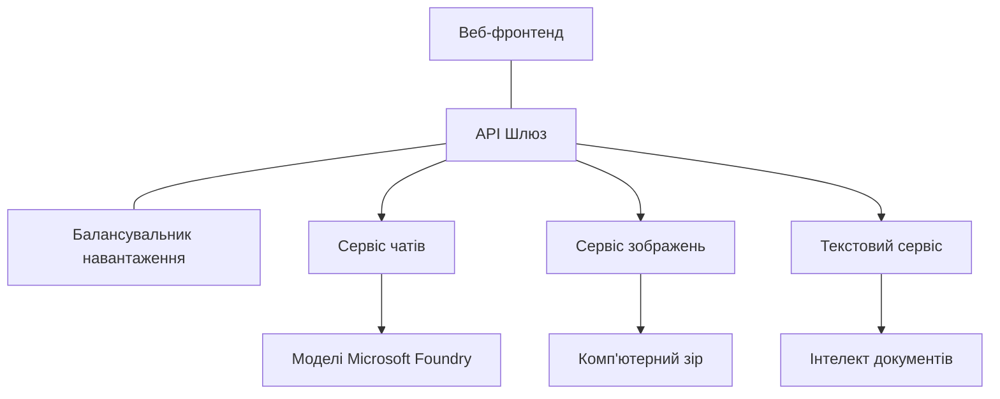

# Найкращі практики для продуктивних AI-навантажень з AZD

**Навігація розділом:**
- **📚 Головна курсу**: [AZD для початківців](../../README.md)
- **📖 Поточний розділ**: Розділ 8 - Продуктивність та корпоративні шаблони
- **⬅️ Попередній розділ**: [Розділ 7: Усунення несправностей](../chapter-07-troubleshooting/debugging.md)
- **⬅️ Також пов’язано**: [Лабораторія AI Workshop](ai-workshop-lab.md)
- **🎯 Курс завершено**: [AZD для початківців](../../README.md)

## Огляд

Цей посібник містить комплексні найкращі практики розгортання продуктивних AI-навантажень із використанням Azure Developer CLI (AZD). Базуючись на відгуках спільноти Microsoft Foundry Discord та реальних замовленнях клієнтів, ці практики вирішують найпоширеніші проблеми у продуктивних AI-системах.

## Основні виклики, які розглядаються

За результатами опитування в спільноті, це головні проблеми, з якими стикаються розробники:

- **45%** мають труднощі з багатосервісними AI-розгортаннями
- **38%** мають проблеми з керуванням обліковими даними і секретами  
- **35%** вважають складним забезпечення продуктивності та масштабування
- **32%** потребують кращих стратегій оптимізації витрат
- **29%** потребують покращеного моніторингу та усунення несправностей

## Шаблони архітектури для продуктивного AI

### Шаблон 1: Архітектура AI на основі мікросервісів

**Коли застосовувати**: Складні AI-застосунки з кількома можливостями


**Реалізація в AZD**:

```yaml
# azure.yaml
name: enterprise-ai-platform
services:
  web:
    project: ./web
    host: staticwebapp
  api-gateway:
    project: ./api-gateway
    host: containerapp
  chat-service:
    project: ./services/chat
    host: containerapp
  vision-service:
    project: ./services/vision
    host: containerapp
  text-service:
    project: ./services/text
    host: containerapp
```

### Шаблон 2: Подієво-орієнтована обробка AI

**Коли застосовувати**: Пакетна обробка, аналіз документів, асинхронні робочі процеси

```bicep
// Event Hub for AI processing pipeline
resource eventHub 'Microsoft.EventHub/namespaces@2023-01-01-preview' = {
  name: eventHubNamespaceName
  location: location
  sku: {
    name: 'Standard'
    tier: 'Standard'
    capacity: 1
  }
}

// Service Bus for reliable message processing
resource serviceBus 'Microsoft.ServiceBus/namespaces@2022-10-01-preview' = {
  name: serviceBusNamespaceName
  location: location
  sku: {
    name: 'Premium'
    tier: 'Premium'
    capacity: 1
  }
}

// Function App for processing
resource functionApp 'Microsoft.Web/sites@2023-01-01' = {
  name: functionAppName
  location: location
  kind: 'functionapp,linux'
  properties: {
    siteConfig: {
      appSettings: [
        {
          name: 'FUNCTIONS_EXTENSION_VERSION'
          value: '~4'
        }
        {
          name: 'AZURE_OPENAI_ENDPOINT'
          value: '@Microsoft.KeyVault(VaultName=${keyVault.name};SecretName=openai-endpoint)'
        }
      ]
    }
  }
}
```

## Роздуми про здоров’я AI агента

Коли традиційний вебзастосунок ламається, симптоми знайомі: сторінка не завантажується, API повертає помилку або не вдається розгорнути. AI-застосунки можуть ламатися так само, але іноді вони поводяться менш очевидно, без явних повідомлень про помилки.

Цей розділ допоможе побудувати мисленнєву модель спостереження за AI-навантаженнями, щоб знати, де шукати причини, якщо щось виглядає не так.

### Чим здоров’я агента відрізняється від здоров’я звичайного застосунку

Традиційний застосунок або працює, або ні. AI агент може здаватися працездатним, але давати погані результати. Розгляньте здоров’я агента у два шари:

| Шар | Що контролювати | Де дивитись |
|-------|--------------|---------------|
| **Здоров’я інфраструктури** | Сервіс запущено? Ресурси виділено? Ендпоінти доступні? | `azd monitor`, ресурсний стан в Azure Portal, журнали контейнерів/додатків |
| **Здоров’я поведінки** | Чи агент відповідає точно? Чи відповіді вчасні? Чи коректно викликається модель? | Application Insights трасування, метрики затримки виклику моделі, журнали якості відповідей |

Здоров’я інфраструктури знайоме — це так само, як для будь-якого azd-застосунку. Здоров’я поведінки — новий шар, який додають AI-навантаження.

### Куди дивитись, якщо AI-застосунок поводиться не так, як очікується

Якщо ваш AI-застосунок не дає очікуваних результатів, ось концептуальний чеклист:

1. **Почніть з основ.** Чи працює застосунок? Чи доступні залежності? Перевірте `azd monitor` і стан ресурсів, як з будь-яким застосунком.
2. **Перевірте зв’язок з моделлю.** Чи ваше застосування успішно викликає AI-модель? Неуспішні або з тайм-аутом виклики моделі — найпоширеніша причина проблем з AI-додатками, вони будуть відображені в логах.
3. **Подивіться, що отримала модель.** Відповіді AI залежать від вхідних даних (запиту та будь-якого контексту). Якщо вихід неправильний, зазвичай вхід некоректний. Перевірте, чи ваше застосування надсилає правильні дані моделі.
4. **Перегляньте затримку відповіді.** Виклики AI-моделі повільніші за типові API-виклики. Якщо застосунок здається повільним, перевірте, чи збільшився час відповіді моделі — це може вказувати на обмеження пропускної здатності, ліміти або регіональні затори.
5. **Слідкуйте за сигналами витрат.** Неочікувані сплески використання токенів або викликів API можуть свідчити про цикл, некоректний запит або надмірні повторні спроби.

Не потрібно одразу майстерно володіти інструментами спостереження. Головне — AI-застосунки мають додатковий шар поведінки для моніторингу, і вбудований в azd моніторинг (`azd monitor`) дає стартову точку для аналізу обох шарів.

---

## Найкращі практики безпеки

### 1. Модель безпеки «нульова довіра»

**Стратегія впровадження**:
- Ніякого спілкування сервісів без автентифікації
- Всі API-виклики через керовані ідентичності
- Ізоляція мережі з приватними кінцевими точками
- Контроль доступу з мінімальними правами

```bicep
// Managed Identity for each service
resource chatServiceIdentity 'Microsoft.ManagedIdentity/userAssignedIdentities@2023-01-31' = {
  name: 'chat-service-identity'
  location: location
}

// Role assignments with minimal permissions
resource openAIUserRole 'Microsoft.Authorization/roleAssignments@2022-04-01' = {
  scope: openAIAccount
  name: guid(openAIAccount.id, chatServiceIdentity.id, openAIUserRoleDefinitionId)
  properties: {
    roleDefinitionId: subscriptionResourceId('Microsoft.Authorization/roleDefinitions', '5e0bd9bd-7b93-4f28-af87-19fc36ad61bd')
    principalId: chatServiceIdentity.properties.principalId
    principalType: 'ServicePrincipal'
  }
}
```

### 2. Безпечне керування секретами

**Шаблон інтеграції з Key Vault**:

```bicep
// Key Vault with proper access policies
resource keyVault 'Microsoft.KeyVault/vaults@2023-02-01' = {
  name: keyVaultName
  location: location
  properties: {
    tenantId: tenant().tenantId
    sku: {
      family: 'A'
      name: 'premium'  // Use premium for production
    }
    enableRbacAuthorization: true  // Use RBAC instead of access policies
    enablePurgeProtection: true    // Prevent accidental deletion
    enableSoftDelete: true
    softDeleteRetentionInDays: 90
  }
}

// Store all AI service credentials
resource openAIKeySecret 'Microsoft.KeyVault/vaults/secrets@2023-02-01' = {
  parent: keyVault
  name: 'openai-api-key'
  properties: {
    value: openAIAccount.listKeys().key1
    attributes: {
      enabled: true
    }
  }
}
```

### 3. Мережева безпека

**Налаштування приватних кінцевих точок**:

```bicep
// Virtual Network for AI services
resource virtualNetwork 'Microsoft.Network/virtualNetworks@2023-04-01' = {
  name: vnetName
  location: location
  properties: {
    addressSpace: {
      addressPrefixes: ['10.0.0.0/16']
    }
    subnets: [
      {
        name: 'ai-services-subnet'
        properties: {
          addressPrefix: '10.0.1.0/24'
          privateEndpointNetworkPolicies: 'Disabled'
        }
      }
      {
        name: 'app-services-subnet'
        properties: {
          addressPrefix: '10.0.2.0/24'
          delegations: [
            {
              name: 'Microsoft.Web/serverFarms'
              properties: {
                serviceName: 'Microsoft.Web/serverFarms'
              }
            }
          ]
        }
      }
    ]
  }
}

// Private endpoints for all AI services
resource openAIPrivateEndpoint 'Microsoft.Network/privateEndpoints@2023-04-01' = {
  name: '${openAIAccountName}-pe'
  location: location
  properties: {
    subnet: {
      id: virtualNetwork.properties.subnets[0].id
    }
    privateLinkServiceConnections: [
      {
        name: 'openai-connection'
        properties: {
          privateLinkServiceId: openAIAccount.id
          groupIds: ['account']
        }
      }
    ]
  }
}
```

## Продуктивність і масштабування

### 1. Стратегії авто-масштабування

**Авто-масштабування для контейнерних додатків**:

```bicep
resource containerApp 'Microsoft.App/containerApps@2023-05-01' = {
  name: containerAppName
  location: location
  properties: {
    configuration: {
      ingress: {
        external: true
        targetPort: 8000
        transport: 'http'
      }
    }
    template: {
      scale: {
        minReplicas: 2  // Always have 2 instances minimum
        maxReplicas: 50 // Scale up to 50 for high load
        rules: [
          {
            name: 'http-scaling'
            http: {
              metadata: {
                concurrentRequests: '20'  // Scale when >20 concurrent requests
              }
            }
          }
          {
            name: 'cpu-scaling'
            custom: {
              type: 'cpu'
              metadata: {
                type: 'Utilization'
                value: '70'  // Scale when CPU >70%
              }
            }
          }
        ]
      }
    }
  }
}
```

### 2. Стратегії кешування

**Redis Cache для відповідей AI**:

```bicep
// Redis Premium for production workloads
resource redisCache 'Microsoft.Cache/redis@2023-04-01' = {
  name: redisCacheName
  location: location
  properties: {
    sku: {
      name: 'Premium'
      family: 'P'
      capacity: 1
    }
    enableNonSslPort: false
    minimumTlsVersion: '1.2'
    redisConfiguration: {
      'maxmemory-policy': 'allkeys-lru'
    }
    // Enable clustering for high availability
    redisVersion: '6.0'
    shardCount: 2
  }
}

// Cache configuration in application
var cacheConnectionString = '${redisCache.properties.hostName}:6380,password=${redisCache.listKeys().primaryKey},ssl=True,abortConnect=False'
```

### 3. Балансування навантаження і управління трафіком

**Application Gateway з WAF**:

```bicep
// Application Gateway with Web Application Firewall
resource applicationGateway 'Microsoft.Network/applicationGateways@2023-04-01' = {
  name: appGatewayName
  location: location
  properties: {
    sku: {
      name: 'WAF_v2'
      tier: 'WAF_v2'
      capacity: 2
    }
    webApplicationFirewallConfiguration: {
      enabled: true
      firewallMode: 'Prevention'
      ruleSetType: 'OWASP'
      ruleSetVersion: '3.2'
    }
    // Backend pools for AI services
    backendAddressPools: [
      {
        name: 'ai-services-pool'
        properties: {
          backendAddresses: [
            {
              fqdn: '${containerApp.properties.configuration.ingress.fqdn}'
            }
          ]
        }
      }
    ]
  }
}
```

## 💰 Оптимізація витрат

### 1. Правильний розмір ресурсів

**Конфігурації, специфічні для середовища**:

```bash
# Середовище розробки
azd env new development
azd env set AZURE_OPENAI_SKU "S0"
azd env set AZURE_OPENAI_CAPACITY 10
azd env set AZURE_SEARCH_SKU "basic"
azd env set CONTAINER_CPU 0.5
azd env set CONTAINER_MEMORY 1.0

# Продуктивне середовище
azd env new production
azd env set AZURE_OPENAI_SKU "S0"
azd env set AZURE_OPENAI_CAPACITY 100
azd env set AZURE_SEARCH_SKU "standard"
azd env set CONTAINER_CPU 2.0
azd env set CONTAINER_MEMORY 4.0
```

### 2. Моніторинг витрат і бюджети

```bicep
// Cost management and budgets
resource budget 'Microsoft.Consumption/budgets@2023-05-01' = {
  name: 'ai-workload-budget'
  properties: {
    timePeriod: {
      startDate: '2024-01-01'
      endDate: '2024-12-31'
    }
    timeGrain: 'Monthly'
    amount: 2000  // $2000 monthly budget
    category: 'Cost'
    notifications: {
      warning: {
        enabled: true
        operator: 'GreaterThan'
        threshold: 80
        contactEmails: [
          'finance@company.com'
          'engineering@company.com'
        ]
        contactRoles: [
          'Owner'
          'Contributor'
        ]
      }
      critical: {
        enabled: true
        operator: 'GreaterThan'
        threshold: 95
        contactEmails: [
          'cto@company.com'
        ]
      }
    }
  }
}
```

### 3. Оптимізація використання токенів

**Управління вартістю OpenAI**:

```typescript
// Оптимізація токенів на рівні застосунку
class TokenOptimizer {
  private readonly maxTokens = 4000;
  private readonly reserveTokens = 500;
  
  optimizePrompt(userInput: string, context: string): string {
    const availableTokens = this.maxTokens - this.reserveTokens;
    const estimatedTokens = this.estimateTokens(userInput + context);
    
    if (estimatedTokens > availableTokens) {
      // Усікати контекст, а не вхідні дані користувача
      context = this.truncateContext(context, availableTokens - this.estimateTokens(userInput));
    }
    
    return `${context}\n\nUser: ${userInput}`;
  }
  
  private estimateTokens(text: string): number {
    // Груба оцінка: 1 токен ≈ 4 символи
    return Math.ceil(text.length / 4);
  }
}
```

## Моніторинг і спостережливість

### 1. Комплексне Application Insights

```bicep
// Application Insights with advanced features
resource applicationInsights 'Microsoft.Insights/components@2020-02-02' = {
  name: applicationInsightsName
  location: location
  kind: 'web'
  properties: {
    Application_Type: 'web'
    WorkspaceResourceId: logAnalyticsWorkspace.id
    SamplingPercentage: 100  // Full sampling for AI apps
    DisableIpMasking: false  // Enable for security
  }
}

// Custom metrics for AI operations
resource aiMetricAlerts 'Microsoft.Insights/metricAlerts@2018-03-01' = {
  name: 'ai-high-error-rate'
  location: 'global'
  properties: {
    description: 'Alert when AI service error rate is high'
    severity: 2
    enabled: true
    scopes: [
      applicationInsights.id
    ]
    evaluationFrequency: 'PT1M'
    windowSize: 'PT5M'
    criteria: {
      'odata.type': 'Microsoft.Azure.Monitor.SingleResourceMultipleMetricCriteria'
      allOf: [
        {
          name: 'high-error-rate'
          metricName: 'requests/failed'
          operator: 'GreaterThan'
          threshold: 10
          timeAggregation: 'Count'
        }
      ]
    }
  }
}
```

### 2. Моніторинг AI-специфічних метрик

**Кастомні дашборди для AI-метрик**:

```json
// Dashboard configuration for AI workloads
{
  "dashboard": {
    "name": "AI Application Monitoring",
    "tiles": [
      {
        "name": "OpenAI Request Volume",
        "query": "requests | where name contains 'openai' | summarize count() by bin(timestamp, 5m)"
      },
      {
        "name": "AI Response Latency",
        "query": "requests | where name contains 'openai' | summarize avg(duration) by bin(timestamp, 5m)"
      },
      {
        "name": "Token Usage",
        "query": "customMetrics | where name == 'openai_tokens_used' | summarize sum(value) by bin(timestamp, 1h)"
      },
      {
        "name": "Cost per Hour",
        "query": "customMetrics | where name == 'openai_cost' | summarize sum(value) by bin(timestamp, 1h)"
      }
    ]
  }
}
```

### 3. Перевірки стану і моніторинг часу роботи

```bicep
// Application Insights availability tests
resource availabilityTest 'Microsoft.Insights/webtests@2022-06-15' = {
  name: 'ai-app-availability-test'
  location: location
  tags: {
    'hidden-link:${applicationInsights.id}': 'Resource'
  }
  properties: {
    SyntheticMonitorId: 'ai-app-availability-test'
    Name: 'AI Application Availability Test'
    Description: 'Tests AI application endpoints'
    Enabled: true
    Frequency: 300  // 5 minutes
    Timeout: 120    // 2 minutes
    Kind: 'ping'
    Locations: [
      {
        Id: 'us-east-2-azr'
      }
      {
        Id: 'us-west-2-azr'
      }
    ]
    Configuration: {
      WebTest: '''
        <WebTest Name="AI Health Check" 
                 Id="8d2de8d2-a2b0-4c2e-9a0d-8f9c9a0b8c8d" 
                 Enabled="True" 
                 CssProjectStructure="" 
                 CssIteration="" 
                 Timeout="120" 
                 WorkItemIds="" 
                 xmlns="http://microsoft.com/schemas/VisualStudio/TeamTest/2010" 
                 Description="" 
                 CredentialUserName="" 
                 CredentialPassword="" 
                 PreAuthenticate="True" 
                 Proxy="default" 
                 StopOnError="False" 
                 RecordedResultFile="" 
                 ResultsLocale="">
          <Items>
            <Request Method="GET" 
                     Guid="a5f10126-e4cd-570d-961c-cea43999a200" 
                     Version="1.1" 
                     Url="${webApp.properties.defaultHostName}/health" 
                     ThinkTime="0" 
                     Timeout="120" 
                     ParseDependentRequests="True" 
                     FollowRedirects="True" 
                     RecordResult="True" 
                     Cache="False" 
                     ResponseTimeGoal="0" 
                     Encoding="utf-8" 
                     ExpectedHttpStatusCode="200" 
                     ExpectedResponseUrl="" 
                     ReportingName="" 
                     IgnoreHttpStatusCode="False" />
          </Items>
        </WebTest>
      '''
    }
  }
}
```

## Відновлення після аварій та висока доступність

### 1. Розгортання в кількох регіонах

```yaml
# azure.yaml - Multi-region configuration
name: ai-app-multiregion
services:
  api-primary:
    project: ./api
    host: containerapp
    env:
      - AZURE_REGION=eastus
  api-secondary:
    project: ./api
    host: containerapp
    env:
      - AZURE_REGION=westus2
```

```bicep
// Traffic Manager for global load balancing
resource trafficManager 'Microsoft.Network/trafficManagerProfiles@2022-04-01' = {
  name: trafficManagerProfileName
  location: 'global'
  properties: {
    profileStatus: 'Enabled'
    trafficRoutingMethod: 'Priority'
    dnsConfig: {
      relativeName: trafficManagerProfileName
      ttl: 30
    }
    monitorConfig: {
      protocol: 'HTTPS'
      port: 443
      path: '/health'
      intervalInSeconds: 30
      toleratedNumberOfFailures: 3
      timeoutInSeconds: 10
    }
    endpoints: [
      {
        name: 'primary-endpoint'
        type: 'Microsoft.Network/trafficManagerProfiles/azureEndpoints'
        properties: {
          targetResourceId: primaryAppService.id
          endpointStatus: 'Enabled'
          priority: 1
        }
      }
      {
        name: 'secondary-endpoint'
        type: 'Microsoft.Network/trafficManagerProfiles/azureEndpoints'
        properties: {
          targetResourceId: secondaryAppService.id
          endpointStatus: 'Enabled'
          priority: 2
        }
      }
    ]
  }
}
```

### 2. Резервне копіювання та відновлення даних

```bicep
// Backup configuration for critical data
resource backupVault 'Microsoft.DataProtection/backupVaults@2023-05-01' = {
  name: backupVaultName
  location: location
  identity: {
    type: 'SystemAssigned'
  }
  properties: {
    storageSettings: [
      {
        datastoreType: 'VaultStore'
        type: 'LocallyRedundant'
      }
    ]
  }
}

// Backup policy for AI models and data
resource backupPolicy 'Microsoft.DataProtection/backupVaults/backupPolicies@2023-05-01' = {
  parent: backupVault
  name: 'ai-data-backup-policy'
  properties: {
    policyRules: [
      {
        backupParameters: {
          backupType: 'Full'
          objectType: 'AzureBackupParams'
        }
        trigger: {
          schedule: {
            repeatingTimeIntervals: [
              'R/2024-01-01T02:00:00+00:00/P1D'  // Daily at 2 AM
            ]
          }
          objectType: 'ScheduleBasedTriggerContext'
        }
        dataStore: {
          datastoreType: 'VaultStore'
          objectType: 'DataStoreInfoBase'
        }
        name: 'BackupDaily'
        objectType: 'AzureBackupRule'
      }
    ]
  }
}
```

## Інтеграція DevOps та CI/CD

### 1. Робочий процес GitHub Actions

```yaml
# .github/workflows/deploy-ai-app.yml
name: Deploy AI Application

on:
  push:
    branches: [main]
  pull_request:
    branches: [main]

jobs:
  test:
    runs-on: ubuntu-latest
    steps:
      - uses: actions/checkout@v4
      
      - name: Setup Python
        uses: actions/setup-python@v4
        with:
          python-version: '3.11'
          
      - name: Install dependencies
        run: |
          pip install -r requirements.txt
          pip install pytest
          
      - name: Run tests
        run: pytest tests/
        
      - name: AI Safety Tests
        run: |
          python scripts/test_ai_safety.py
          python scripts/validate_prompts.py

  deploy-staging:
    needs: test
    if: github.event_name == 'pull_request'
    runs-on: ubuntu-latest
    steps:
      - uses: actions/checkout@v4
      
      - name: Setup AZD
        uses: Azure/setup-azd@v2
        
      - name: Login to Azure
        uses: azure/login@v1
        with:
          creds: ${{ secrets.AZURE_CREDENTIALS }}
          
      - name: Deploy to Staging
        run: |
          azd env select staging
          azd deploy

  deploy-production:
    needs: test
    if: github.ref == 'refs/heads/main'
    runs-on: ubuntu-latest
    steps:
      - uses: actions/checkout@v4
      
      - name: Setup AZD
        uses: Azure/setup-azd@v2
        
      - name: Login to Azure
        uses: azure/login@v1
        with:
          creds: ${{ secrets.AZURE_CREDENTIALS }}
          
      - name: Deploy to Production
        run: |
          azd env select production
          azd deploy
          
      - name: Run Production Health Checks
        run: |
          python scripts/health_check.py --env production
```

### 2. Валідація інфраструктури

```bash
# scripts/validate_infrastructure.sh
#!/bin/bash

echo "Validating AI infrastructure deployment..."

# Перевірте, чи всі необхідні служби запущені
services=("openai" "search" "storage" "keyvault")
for service in "${services[@]}"; do
    echo "Checking $service..."
    if ! az resource list --resource-type "Microsoft.CognitiveServices/accounts" --query "[?contains(name, '$service')]" -o tsv; then
        echo "ERROR: $service not found"
        exit 1
    fi
done

# Перевірте розгортання моделей OpenAI
echo "Validating OpenAI model deployments..."
models=$(az cognitiveservices account deployment list --name $AZURE_OPENAI_NAME --resource-group $AZURE_RESOURCE_GROUP --query "[].name" -o tsv)
if [[ ! $models == *"gpt-4.1-mini"* ]]; then
  echo "ERROR: Required model gpt-4.1-mini not deployed"
    exit 1
fi

# Перевірте з'єднання зі службою AI
echo "Testing AI service connectivity..."
python scripts/test_connectivity.py

echo "Infrastructure validation completed successfully!"
```

## Чеклист готовності до продуктивності

### Безпека ✅
- [ ] Всі сервіси використовують керовані ідентичності
- [ ] Секрети зберігаються в Key Vault
- [ ] Налаштовані приватні кінцеві точки
- [ ] Впроваджені мережеві групи безпеки
- [ ] RBAC з мінімальними правами
- [ ] WAF увімкнено на публічних кінцевих точках

### Продуктивність ✅
- [ ] Авто-масштабування налаштовано
- [ ] Реалізоване кешування
- [ ] Налаштовано балансування навантаження
- [ ] CDN для статичного контенту
- [ ] Пулінг з’єднань з базою даних
- [ ] Оптимізація використання токенів

### Моніторинг ✅
- [ ] Application Insights налаштовано
- [ ] Визначені кастомні метрики
- [ ] Встановлені правила сповіщень
- [ ] Створено дашборд
- [ ] Реалізовані перевірки стану
- [ ] Політики зберігання логів

### Надійність ✅
- [ ] Розгортання у кількох регіонах
- [ ] План резервного копіювання і відновлення
- [ ] Впроваджені circuit breakers
- [ ] Налаштовані політики повторних спроб
- [ ] Грамотне деградування
- [ ] Ендпоінти для перевірки здоров’я

### Управління витратами ✅
- [ ] Налаштовані сповіщення про бюджет
- [ ] Правильний розмір ресурсів
- [ ] Застосовані скидки для Dev/Test
- [ ] Придбані зарезервовані інстанції
- [ ] Дашборд моніторингу вартості
- [ ] Регулярні огляди витрат

### Відповідність вимогам ✅
- [ ] Вимоги до розташування даних виконані
- [ ] Увімкнено аудит логування
- [ ] Застосовані політики відповідності
- [ ] Впроваджені базові рівні безпеки
- [ ] Регулярні оцінки безпеки
- [ ] План реагування на інциденти

## Показники продуктивності

### Типові метрики для продуктивної експлуатації

| Метрика | Ціль | Моніторинг |
|--------|--------|------------|
| **Час відповіді** | < 2 секунди | Application Insights |
| **Доступність** | 99.9% | Моніторинг uptime |
| **Рівень помилок** | < 0.1% | Логи застосунку |
| **Використання токенів** | < $500/місяць | Управління витратами |
| **Паралельні користувачі** | 1000+ | Навантажувальне тестування |
| **Час відновлення** | < 1 година | Тести аварійного відновлення |

### Навантажувальне тестування

```bash
# Скрипт навантажувального тестування для AI-застосунків
python scripts/load_test.py \
  --endpoint https://your-ai-app.azurewebsites.net \
  --concurrent-users 100 \
  --duration 300 \
  --ramp-up 60
```

## 🤝 Найкращі практики спільноти

На основі відгуків спільноти Microsoft Foundry Discord:

### Топ-рекомендації від спільноти:

1. **Починайте з малого, масштабуйте поступово**: Починайте з базових SKU і нарощуйте в залежності від реального використання
2. **Моніторте все**: Налаштуйте комплексний моніторинг з першого дня
3. **Автоматизуйте безпеку**: Використовуйте інфраструктуру як код для послідовної безпеки
4. **Ретельно тестуйте**: Включайте AI-специфічне тестування у свій пайплайн
5. **Плануйте витрати**: Раннє відстеження використання токенів і встановлення бюджетних оповіщень

### Поширені помилки, яких варто уникати:

- ❌ Хардкодити ключі API в коді
- ❌ Не налаштовувати правильний моніторинг
- ❌ Ігнорувати оптимізацію витрат
- ❌ Не тестувати сценарії відмов
- ❌ Розгортати без перевірок стану

## Команди та розширення AZD AI CLI

AZD містить розширюваний набір AI-специфічних команд і розширень, які спрощують продуктивні AI-робочі процеси. Ці інструменти зв’язують локальну розробку з продуктивним розгортанням AI-навантажень.

### Розширення AZD для AI

AZD використовує систему розширень для додавання AI-можливостей. Встановлюйте та керуйте розширеннями за допомогою:

```bash
# Перелічити всі доступні розширення (включаючи ШІ)
azd extension list

# Перевірити деталі встановленого розширення
azd extension show azure.ai.agents

# Встановити розширення агентів Foundry
azd extension install azure.ai.agents

# Встановити розширення для тонкого налаштування
azd extension install azure.ai.finetune

# Встановити розширення для користувацьких моделей
azd extension install azure.ai.models

# Оновити всі встановлені розширення
azd extension upgrade --all
```

**Доступні AI-розширення:**

| Розширення | Призначення | Статус |
|-----------|---------|--------|
| `azure.ai.agents` | Керування Foundry Agent Service | Перегляд |
| `azure.ai.finetune` | Тонке налаштування моделей Foundry | Перегляд |
| `azure.ai.models` | Користувацькі моделі Foundry | Перегляд |
| `azure.coding-agent` | Конфігурація кодувального агента | Доступне |

### Ініціалізація агентських проектів з `azd ai agent init`

Команда `azd ai agent init` створює каркас продакшен AI-агента інтегрованого з Microsoft Foundry Agent Service:

```bash
# Ініціалізувати новий агентський проєкт з маніфесту агента
azd ai agent init -m <manifest-path-or-uri>

# Ініціалізувати та націлити конкретний проєкт Foundry
azd ai agent init -m agent-manifest.yaml --project-id <foundry-project-id>

# Ініціалізувати з користувацькою директорією джерела
azd ai agent init -m agent-manifest.yaml --src ./agents/my-agent

# Націлити Container Apps як хост
azd ai agent init -m agent-manifest.yaml --host containerapp
```

**Ключові прапори:**

| Прапор | Опис |
|------|-------------|
| `-m, --manifest` | Шлях або URI до маніфесту агента для додавання у проект |
| `-p, --project-id` | Існуючий ID проекту Microsoft Foundry для вашого середовища azd |
| `-s, --src` | Каталог для завантаження визначення агента (за замовчуванням `src/<agent-id>`) |
| `--host` | Перевизначити хост за замовчуванням (наприклад, `containerapp`) |
| `-e, --environment` | azd середовище для використання |

**Порада для продакшену**: Використовуйте `--project-id` для прямого підключення до існуючого проекту Foundry, щоб ваш код агента й хмарні ресурси були пов’язані з самого початку.

### Протокол контексту моделі (MCP) з `azd mcp`

AZD включає вбудовану підтримку MCP сервера (альфа-версія), що дозволяє AI-агентам і інструментам взаємодіяти з вашими Azure ресурсами через стандартизований протокол:

```bash
# Запустіть сервер MCP для вашого проекту
azd mcp start

# Перегляньте поточні правила згоди Copilot для виконання інструменту
azd copilot consent list
```

MCP сервер надає контекст вашого проекту azd — середовища, сервіси та ресурси Azure — AI-інструментам розробки. Це дає змогу:

- **AI-допомога в розгортанні**: Кодувальні агенти можуть запитувати стан проекту і запускати деплоя
- **Відкриття ресурсів**: AI-інструменти можуть знаходити, які ресурси Azure використовує ваш проект
- **Управління середовищами**: Агенти можуть переключатися між dev/staging/production середовищами

### Генерація інфраструктури з `azd infra generate`

Для продуктивних AI-навантажень можна генерувати і налаштовувати інфраструктуру як код замість автоматичного провізіонінгу:

```bash
# Згенерувати файли Bicep/Terraform з визначення вашого проєкту
azd infra generate
```

Це записує IaC на диск, щоб ви могли:
- Переглядати та аудитувати інфраструктуру перед деплоєм
- Додавати власні політики безпеки (мережеві правила, приватні кінцеві точки)
- Інтегрувати з існуючими процесами рев’ю IaC
- Контролювати версії змін інфраструктури окремо від коду застосунку

### Продакшен хук-и життєвого циклу

Хуки AZD дозволяють додавати користувацьку логіку на кожному етапі життєвого циклу розгортання — критично важливо для виробничих AI-процесів:

```yaml
# azure.yaml - Production hooks example
name: ai-production-app
hooks:
  preprovision:
    shell: sh
    run: scripts/validate-quotas.sh    # Check AI model quota before provisioning
  postprovision:
    shell: sh
    run: scripts/configure-networking.sh  # Set up private endpoints
  predeploy:
    shell: sh
    run: scripts/run-ai-safety-tests.sh  # Run prompt safety checks
  postdeploy:
    shell: sh
    run: scripts/smoke-test.sh           # Verify agent responses post-deploy
services:
  agent-api:
    project: ./src/agent
    host: containerapp
    hooks:
      predeploy:
        shell: sh
        run: scripts/validate-model-access.sh  # Per-service hook
```

```bash
# Запустіть конкретний хук вручну під час розробки
azd hooks run predeploy
```

**Рекомендовані hooks для AI-навантажень у продакшені:**

| Хук | Випадок використання |
|------|----------|
| `preprovision` | Перевірка квоти підписки для потужності AI-моделі |
| `postprovision` | Налаштування приватних кінцевих точок, розгортання ваг моделей |
| `predeploy` | Запуск тестів безпеки AI, валідація шаблонів prompt |
| `postdeploy` | Димові тести відповідей агента, перевірка з’єднання з моделлю |

### Конфігурація CI/CD пайплайнів

Використовуйте `azd pipeline config` для підключення проєкту до GitHub Actions або Azure Pipelines із безпечною автентифікацією Azure:

```bash
# Налаштуйте конвеєр CI/CD (інтерактивно)
azd pipeline config

# Налаштуйте з конкретним провайдером
azd pipeline config --provider github
```

Ця команда:
- Створює сервіс-принципал з мінімальними правами
- Налаштовує федеративні облікові дані (без збережених секретів)
- Генерує або оновлює визначення пайплайну
- Встановлює необхідні змінні середовища у вашій CI/CD системі

**Продакшен-робочий процес з pipeline config:**

```bash
# 1. Налаштуйте виробниче середовище
azd env new production
azd env set AZURE_OPENAI_CAPACITY 100

# 2. Налаштуйте конвеєр
azd pipeline config --provider github

# 3. Конвеєр запускає azd deploy при кожному пуші в main
```

### Додавання компонентів з `azd add`

Поступово додавайте Azure сервіси в існуючий проект:

```bash
# Додати новий компонент сервісу інтерактивно
azd add
```

Це особливо корисно для розширення продуктивних AI-застосунків — наприклад, для додавання сервісу векторного пошуку, нового кінцевого пункту агента або компонента моніторингу в існуюче розгортання.

## Додаткові ресурси
- **Архітектурна рамка Azure**: [Рекомендації для AI-навантажень](https://learn.microsoft.com/azure/well-architected/ai/)
- **Документація Microsoft Foundry**: [Офіційні документи](https://learn.microsoft.com/azure/ai-studio/)
- **Шаблони спільноти**: [Приклади Azure](https://github.com/Azure-Samples)
- **Спільнота Discord**: [канал #Azure](https://discord.gg/microsoft-azure)
- **Навички агентів для Azure**: [microsoft/github-copilot-for-azure на skills.sh](https://skills.sh/microsoft/github-copilot-for-azure) - 37 відкритих навичок агентів для Azure AI, Foundry, розгортання, оптимізації витрат та діагностики. Встановіть у свій редактор:
  ```bash
  npx skills add microsoft/github-copilot-for-azure
  ```

---

**Навігація по розділах:**
- **📚 Головна сторінка курсу**: [AZD Для початківців](../../README.md)
- **📖 Поточний розділ**: Розділ 8 - Виробничі та корпоративні шаблони
- **⬅️ Попередній розділ**: [Розділ 7: Виправлення несправностей](../chapter-07-troubleshooting/debugging.md)
- **⬅️ Також пов’язано**: [Лабораторія AI Workshop](ai-workshop-lab.md)
- **� Завершення курсу**: [AZD Для початківців](../../README.md)

**Пам’ятайте**: Виробничі AI-навантаження вимагають ретельного планування, моніторингу та постійної оптимізації. Починайте з цих шаблонів і адаптуйте їх до своїх конкретних вимог.

---

<!-- CO-OP TRANSLATOR DISCLAIMER START -->
**Відмова від відповідальності**:  
Цей документ був перекладений за допомогою сервісу автоматичного перекладу штучного інтелекту [Co-op Translator](https://github.com/Azure/co-op-translator). Хоча ми прагнемо до точності, будь ласка, майте на увазі, що автоматичні переклади можуть містити помилки або неточності. Оригінальний документ його рідною мовою слід вважати авторитетним джерелом. Для критичної інформації рекомендується професійний людський переклад. Ми не несемо відповідальності за будь-які непорозуміння або неправильні тлумачення, що виникли внаслідок використання цього перекладу.
<!-- CO-OP TRANSLATOR DISCLAIMER END -->