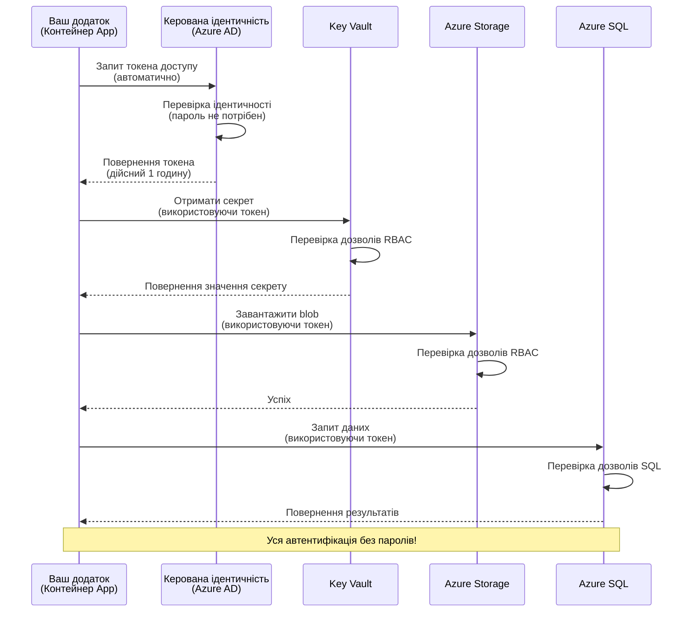
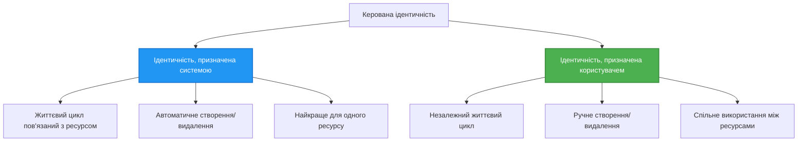

# Шаблони автентифікації та Керована Ідентичність

⏱️ **Орієнтовний час**: 45-60 хвилин | 💰 **Вплив на вартість**: Безкоштовно (без додаткових витрат) | ⭐ **Складність**: Середня

**📚 Навчальний шлях:**
- ← Попереднє: [Управління конфігурацією](configuration.md) - Управління змінними середовища та секретами
- 🎯 **Ви тут**: Автентифікація та безпека (Керована ідентичність, Key Vault, безпечні шаблони)
- → Далі: [Перший проєкт](first-project.md) - Створіть свій перший додаток AZD
- 🏠 [Головна сторінка курсу](../../README.md)

---

## Що ви дізнаєтесь

Завершивши цей урок, ви:
- Зрозумієте шаблони автентифікації Azure (ключі, рядки підключення, керована ідентичність)
- Реалізуєте **Керовану Ідентичність** для автентифікації без паролів
- Захистите секрети за допомогою інтеграції з **Azure Key Vault**
- Налаштуєте **контроль доступу на основі ролей (RBAC)** для розгортань AZD
- Застосуєте найкращі практики безпеки в Container Apps та службах Azure
- Перейдете від автентифікації на основі ключів до автентифікації на основі ідентичності

## Чому важлива Керована Ідентичність

### Проблема: Традиційна автентифікація

**До Керованої Ідентичності:**
```javascript
// ❌ РИЗИК БЕЗПЕКИ: Жорстко закодовані секрети в коді
const connectionString = "Server=mydb.database.windows.net;User=admin;Password=P@ssw0rd123";
const storageKey = "xK7mN9pQ2wR5tY8uI0oP3aS6dF1gH4jK...";
const cosmosKey = "C2x7B9n4M1p8Q5w3E6r0T2y5U8i1O4p7...";
```

**Проблеми:**
- 🔴 **Секрети у відкритому доступі** в коді, файлах конфігурації, змінних середовища
- 🔴 **Ротація облікових даних** вимагає змін у коді та повторного розгортання
- 🔴 **Проблеми аудиту** - хто отримав доступ, коли?
- 🔴 **Розпорошення** - секрети розкидані по різних системах
- 🔴 **Ризики відповідності** - не проходить перевірки безпеки

### Рішення: Керована Ідентичність

**Після Керованої Ідентичності:**
```javascript
// ✅ БЕЗПЕЧНО: Немає секретів у коді
const credential = new DefaultAzureCredential();
const client = new BlobServiceClient(
  "https://mystorageaccount.blob.core.windows.net",
  credential  // Azure автоматично обробляє автентифікацію
);
```

**Переваги:**
- ✅ **Жодних секретів** у коді чи конфігурації
- ✅ **Автоматична ротація** - Azure це обробляє
- ✅ **Повний журнал аудиту** в логах Azure AD
- ✅ **Централізована безпека** - керування через Azure Portal
- ✅ **Готовність до відповідності** - відповідає стандартам безпеки

**Аналогія**: Традиційна автентифікація схожа на носіння кількох фізичних ключів для різних дверей. Керована Ідентичність - це як мати пропуск, який автоматично надає доступ залежно від вашої особи — без ключів, які можна загубити, скопіювати чи замінити.

---

## Огляд архітектури

### Потік автентифікації з Керованою Ідентичністю


### Типи Керованих Ідентичностей


| Функція | Системно-призначена | Користувацько-призначена |
|---------|---------------------|-------------------------|
| **Життєвий цикл** | Прив'язана до ресурсу | Незалежна |
| **Створення** | Автоматично з ресурсом | Ручне створення |
| **Видалення** | Видаляється разом із ресурсом | Залишається після видалення ресурсу |
| **Спільне використання** | Лише один ресурс | Кілька ресурсів |
| **Випадок використання** | Простий сценарій | Складні сценарії з кількома ресурсами |
| **AZD за замовчуванням** | ✅ Рекомендовано | Опціонально |

---

## Попередні вимоги

### Необхідні інструменти

Ви вже повинні мати встановлені ці інструменти з попередніх уроків:

```bash
# Перевірте Azure Developer CLI
azd version
# ✅ Очікувано: azd версії 1.0.0 або вище

# Перевірте Azure CLI
az --version
# ✅ Очікувано: azure-cli версії 2.50.0 або вище
```

### Вимоги Azure

- Активна підписка Azure
- Дозволи на:
  - Створення керованих ідентичностей
  - Призначення ролей RBAC
  - Створення ресурсів Key Vault
  - Розгортання Container Apps

### Необхідні знання

Ви повинні завершити:
- [Посібник з установки](installation.md) - Налаштування AZD
- [Основи AZD](azd-basics.md) - Основні концепції
- [Управління конфігурацією](configuration.md) - Змінні середовища

---

## Урок 1: Розуміння шаблонів автентифікації

### Шаблон 1: Рядки підключення (Застарілий - Уникати)

**Як це працює:**
```bash
# Рядок підключення містить облікові дані
STORAGE_CONNECTION_STRING="DefaultEndpointsProtocol=https;AccountName=myaccount;AccountKey=xK7mN9pQ2wR5..."
COSMOS_CONNECTION_STRING="AccountEndpoint=https://myaccount.documents.azure.com:443/;AccountKey=C2x7..."
SQL_CONNECTION_STRING="Server=myserver.database.windows.net;User=admin;Password=P@ssw0rd..."
```

**Проблеми:**
- ❌ Секрети видно у змінних середовища
- ❌ Логуються в системах розгортання
- ❌ Складно обертати
- ❌ Відсутній журнал доступу

**Коли використовувати:** Тільки для локальної розробки, ніколи у продакшені.

---

### Шаблон 2: Посилання на Key Vault (Краще)

**Як це працює:**
```bicep
// Store secret in Key Vault
resource keyVault 'Microsoft.KeyVault/vaults@2023-02-01' = {
  name: 'mykv'
  properties: {
    enableRbacAuthorization: true
  }
}

// Reference in Container App
env: [
  {
    name: 'STORAGE_KEY'
    secretRef: 'storage-key'  // References Key Vault
  }
]
```

**Переваги:**
- ✅ Секрети зберігаються безпечно в Key Vault
- ✅ Централізоване управління секретами
- ✅ Ротація без змін у коді

**Обмеження:**
- ⚠️ Все ще використовуються ключі/паролі
- ⚠️ Потрібно керувати доступом до Key Vault

**Коли використовувати:** Перехідний етап від рядків підключення до керованої ідентичності.

---

### Шаблон 3: Керована Ідентичність (Найкраща практика)

**Як це працює:**
```bicep
// Enable managed identity
resource containerApp 'Microsoft.App/containerApps@2023-05-01' = {
  name: 'myapp'
  identity: {
    type: 'SystemAssigned'  // Automatically creates identity
  }
}

// Grant permissions
resource roleAssignment 'Microsoft.Authorization/roleAssignments@2022-04-01' = {
  scope: storageAccount
  properties: {
    roleDefinitionId: storageBlobDataContributorRole
    principalId: containerApp.identity.principalId
  }
}
```

**Код додатку:**
```javascript
// Секрети не потрібні!
const { DefaultAzureCredential } = require('@azure/identity');
const { BlobServiceClient } = require('@azure/storage-blob');

const credential = new DefaultAzureCredential();
const blobServiceClient = new BlobServiceClient(
  'https://mystorageaccount.blob.core.windows.net',
  credential
);
```

**Переваги:**
- ✅ Жодних секретів у коді/конфігурації
- ✅ Автоматична ротація облікових даних
- ✅ Повний журнал аудиту
- ✅ Дозволи на основі RBAC
- ✅ Готовність до відповідності

**Коли використовувати:** Завжди, для продакшн-додатків.

---

## Урок 2: Реалізація Керованої Ідентичності з AZD

### Покрокова реалізація

Давайте створимо безпечний Container App, який використовує керовану ідентичність для доступу до Azure Storage та Key Vault.

### Структура проєкту

```
secure-app/
├── azure.yaml                 # AZD configuration
├── infra/
│   ├── main.bicep            # Main infrastructure
│   ├── core/
│   │   ├── identity.bicep    # Managed identity setup
│   │   ├── keyvault.bicep    # Key Vault configuration
│   │   └── storage.bicep     # Storage with RBAC
│   └── app/
│       └── container-app.bicep
└── src/
    ├── app.js                # Application code
    ├── package.json
    └── Dockerfile
```

### 1. Налаштування AZD (azure.yaml)

```yaml
name: secure-app
metadata:
  template: secure-app@1.0.0

services:
  api:
    project: ./src
    language: js
    host: containerapp

# Enable managed identity (AZD handles this automatically)
```

### 2. Інфраструктура: Увімкнення Керованої Ідентичності

**Файл: `infra/main.bicep`**

```bicep
targetScope = 'subscription'

param environmentName string
param location string = 'eastus'

var tags = { 'azd-env-name': environmentName }

// Resource group
resource rg 'Microsoft.Resources/resourceGroups@2021-04-01' = {
  name: 'rg-${environmentName}'
  location: location
  tags: tags
}

// Storage Account
module storage './core/storage.bicep' = {
  name: 'storage'
  scope: rg
  params: {
    name: 'st${uniqueString(rg.id)}'
    location: location
    tags: tags
  }
}

// Key Vault
module keyVault './core/keyvault.bicep' = {
  name: 'keyvault'
  scope: rg
  params: {
    name: 'kv-${uniqueString(rg.id)}'
    location: location
    tags: tags
  }
}

// Container App with Managed Identity
module containerApp './app/container-app.bicep' = {
  name: 'container-app'
  scope: rg
  params: {
    name: 'ca-${environmentName}'
    location: location
    tags: tags
    storageAccountName: storage.outputs.name
    keyVaultName: keyVault.outputs.name
  }
}

// Grant Container App access to Storage
module storageRoleAssignment './core/role-assignment.bicep' = {
  name: 'storage-role'
  scope: rg
  params: {
    principalId: containerApp.outputs.identityPrincipalId
    roleDefinitionId: 'ba92f5b4-2d11-453d-a403-e96b0029c9fe'  // Storage Blob Data Contributor
    targetResourceId: storage.outputs.id
  }
}

// Grant Container App access to Key Vault
module kvRoleAssignment './core/role-assignment.bicep' = {
  name: 'kv-role'
  scope: rg
  params: {
    principalId: containerApp.outputs.identityPrincipalId
    roleDefinitionId: '4633458b-17de-408a-b874-0445c86b69e6'  // Key Vault Secrets User
    targetResourceId: keyVault.outputs.id
  }
}

// Outputs
output AZURE_STORAGE_ACCOUNT_NAME string = storage.outputs.name
output AZURE_KEY_VAULT_NAME string = keyVault.outputs.name
output APP_URL string = containerApp.outputs.url
```

### 3. Container App із системно-призначеною ідентичністю

**Файл: `infra/app/container-app.bicep`**

```bicep
param name string
param location string
param tags object = {}
param storageAccountName string
param keyVaultName string

resource containerApp 'Microsoft.App/containerApps@2023-05-01' = {
  name: name
  location: location
  tags: tags
  identity: {
    type: 'SystemAssigned'  // 🔑 Enable managed identity
  }
  properties: {
    configuration: {
      ingress: {
        external: true
        targetPort: 3000
      }
    }
    template: {
      containers: [
        {
          name: 'api'
          image: 'myregistry.azurecr.io/api:latest'
          resources: {
            cpu: json('0.5')
            memory: '1Gi'
          }
          env: [
            {
              name: 'AZURE_STORAGE_ACCOUNT_NAME'
              value: storageAccountName
            }
            {
              name: 'AZURE_KEY_VAULT_NAME'
              value: keyVaultName
            }
            // 🔑 No secrets - managed identity handles authentication!
          ]
        }
      ]
    }
  }
}

// Output the identity for RBAC assignments
output identityPrincipalId string = containerApp.identity.principalId
output id string = containerApp.id
output url string = 'https://${containerApp.properties.configuration.ingress.fqdn}'
```

### 4. Модуль призначення ролей RBAC

**Файл: `infra/core/role-assignment.bicep`**

```bicep
param principalId string
param roleDefinitionId string  // Azure built-in role ID
param targetResourceId string

resource roleAssignment 'Microsoft.Authorization/roleAssignments@2022-04-01' = {
  name: guid(principalId, roleDefinitionId, targetResourceId)
  scope: resourceId('Microsoft.Resources/resourceGroups', resourceGroup().name)
  properties: {
    roleDefinitionId: subscriptionResourceId('Microsoft.Authorization/roleDefinitions', roleDefinitionId)
    principalId: principalId
    principalType: 'ServicePrincipal'
  }
}

output id string = roleAssignment.id
```

### 5. Код додатку з Керованою Ідентичністю

**Файл: `src/app.js`**

```javascript
const express = require('express');
const { DefaultAzureCredential } = require('@azure/identity');
const { BlobServiceClient } = require('@azure/storage-blob');
const { SecretClient } = require('@azure/keyvault-secrets');

const app = express();
const PORT = process.env.PORT || 3000;

// 🔑 Ініціалізуйте облікові дані (працює автоматично з керованою ідентичністю)
const credential = new DefaultAzureCredential();

// Налаштування Azure Storage
const storageAccountName = process.env.AZURE_STORAGE_ACCOUNT_NAME;
const blobServiceClient = new BlobServiceClient(
  `https://${storageAccountName}.blob.core.windows.net`,
  credential  // Ключі не потрібні!
);

// Налаштування Key Vault
const keyVaultName = process.env.AZURE_KEY_VAULT_NAME;
const secretClient = new SecretClient(
  `https://${keyVaultName}.vault.azure.net`,
  credential  // Ключі не потрібні!
);

// Перевірка стану
app.get('/health', (req, res) => {
  res.json({ status: 'healthy', authentication: 'managed-identity' });
});

// Завантажити файл у сховище блобів
app.post('/upload', async (req, res) => {
  try {
    const containerClient = blobServiceClient.getContainerClient('uploads');
    await containerClient.createIfNotExists();
    
    const blobName = `file-${Date.now()}.txt`;
    const blockBlobClient = containerClient.getBlockBlobClient(blobName);
    
    await blockBlobClient.upload('Hello from managed identity!', 30);
    
    res.json({
      success: true,
      blobName: blobName,
      message: 'File uploaded using managed identity!'
    });
  } catch (error) {
    console.error('Upload error:', error);
    res.status(500).json({ error: error.message });
  }
});

// Отримати секрет із Key Vault
app.get('/secret/:name', async (req, res) => {
  try {
    const secretName = req.params.name;
    const secret = await secretClient.getSecret(secretName);
    
    res.json({
      name: secretName,
      value: secret.value,
      message: 'Secret retrieved using managed identity!'
    });
  } catch (error) {
    console.error('Secret error:', error);
    res.status(500).json({ error: error.message });
  }
});

// Список контейнерів блобів (демонструє доступ для читання)
app.get('/containers', async (req, res) => {
  try {
    const containers = [];
    for await (const container of blobServiceClient.listContainers()) {
      containers.push(container.name);
    }
    
    res.json({
      containers: containers,
      count: containers.length,
      message: 'Containers listed using managed identity!'
    });
  } catch (error) {
    console.error('List error:', error);
    res.status(500).json({ error: error.message });
  }
});

app.listen(PORT, () => {
  console.log(`Secure API listening on port ${PORT}`);
  console.log('Authentication: Managed Identity (passwordless)');
});
```

**Файл: `src/package.json`**

```json
{
  "name": "secure-app",
  "version": "1.0.0",
  "dependencies": {
    "express": "^4.18.2",
    "@azure/identity": "^4.0.0",
    "@azure/storage-blob": "^12.17.0",
    "@azure/keyvault-secrets": "^4.7.0"
  },
  "scripts": {
    "start": "node app.js"
  }
}
```

### 6. Розгортання та тестування

```bash
# Ініціалізувати середовище AZD
azd init

# Розгорнути інфраструктуру та додаток
azd up

# Отримати URL додатка
APP_URL=$(azd env get-values | grep APP_URL | cut -d '=' -f2 | tr -d '"')

# Перевірити стан здоров'я
curl $APP_URL/health
```

**✅ Очікуваний результат:**
```json
{
  "status": "healthy",
  "authentication": "managed-identity"
}
```

**Тест завантаження блобу:**
```bash
curl -X POST $APP_URL/upload
```

**✅ Очікуваний результат:**
```json
{
  "success": true,
  "blobName": "file-1700404800000.txt",
  "message": "File uploaded using managed identity!"
}
```

**Тестування списку контейнерів:**
```bash
curl $APP_URL/containers
```

**✅ Очікуваний результат:**
```json
{
  "containers": ["uploads"],
  "count": 1,
  "message": "Containers listed using managed identity!"
}
```

---

## Загальні ролі RBAC Azure

### Вбудовані ідентифікатори ролей для Керованої Ідентичності

| Сервіс | Назва ролі | Ідентифікатор ролі | Дозволи |
|--------|------------|--------------------|---------|
| **Storage** | Storage Blob Data Reader | `2a2b9908-6b94-4a3d-8e5a-a7d8f8cc8a12` | Читання блобів і контейнерів |
| **Storage** | Storage Blob Data Contributor | `ba92f5b4-2d11-453d-a403-e96b0029c9fe` | Читання, запис, видалення блобів |
| **Storage** | Storage Queue Data Contributor | `974c5e8b-45b9-4653-ba55-5f855dd0fb88` | Читання, запис, видалення повідомлень черги |
| **Key Vault** | Key Vault Secrets User | `4633458b-17de-408a-b874-0445c86b69e6` | Читання секретів |
| **Key Vault** | Key Vault Secrets Officer | `b86a8fe4-44ce-4948-aee5-eccb2c155cd7` | Читання, запис, видалення секретів |
| **Cosmos DB** | Cosmos DB Built-in Data Reader | `00000000-0000-0000-0000-000000000001` | Читання даних Cosmos DB |
| **Cosmos DB** | Cosmos DB Built-in Data Contributor | `00000000-0000-0000-0000-000000000002` | Читання, запис даних Cosmos DB |
| **SQL Database** | SQL DB Contributor | `9b7fa17d-e63e-47b0-bb0a-15c516ac86ec` | Управління базами даних SQL |
| **Service Bus** | Azure Service Bus Data Owner | `090c5cfd-751d-490a-894a-3ce6f1109419` | Надсилання, отримання, управління повідомленнями |

### Як знайти ідентифікатори ролей

```bash
# Перелічити всі вбудовані ролі
az role definition list --query "[].{Name:roleName, ID:name}" --output table

# Шукати конкретну роль
az role definition list --query "[?contains(roleName, 'Storage Blob')].{Name:roleName, ID:name}" --output table

# Отримати деталі ролі
az role definition list --name "Storage Blob Data Contributor"
```

---

## Практичні вправи

### Вправа 1: Увімкнення Керованої Ідентичності для існуючого додатку ⭐⭐ (Середня)

**Мета**: Додати керовану ідентичність до існуючого розгортання Container App

**Сценарій**: У вас є Container App, який використовує рядки підключення. Перетворіть його на керовану ідентичність.

**Початкова точка**: Container App з такою конфігурацією:

```bicep
// ❌ Current: Using connection string
env: [
  {
    name: 'STORAGE_CONNECTION_STRING'
    secretRef: 'storage-connection'
  }
]
```

**Кроки**:

1. **Увімкніть керовану ідентичність у Bicep:**

```bicep
resource containerApp 'Microsoft.App/containerApps@2023-05-01' = {
  name: 'myapp'
  identity: {
    type: 'SystemAssigned'  // Add this
  }
  // ... rest of configuration
}
```

2. **Надайте доступ до Storage:**

```bicep
// Get storage account reference
resource storageAccount 'Microsoft.Storage/storageAccounts@2023-01-01' existing = {
  name: storageAccountName
}

// Assign role
resource roleAssignment 'Microsoft.Authorization/roleAssignments@2022-04-01' = {
  name: guid(containerApp.id, 'ba92f5b4-2d11-453d-a403-e96b0029c9fe', storageAccount.id)
  scope: storageAccount
  properties: {
    roleDefinitionId: subscriptionResourceId('Microsoft.Authorization/roleDefinitions', 'ba92f5b4-2d11-453d-a403-e96b0029c9fe')
    principalId: containerApp.identity.principalId
    principalType: 'ServicePrincipal'
  }
}
```

3. **Оновіть код додатку:**

**До (рядок підключення):**
```javascript
const { BlobServiceClient } = require('@azure/storage-blob');

const blobServiceClient = BlobServiceClient.fromConnectionString(
  process.env.STORAGE_CONNECTION_STRING
);
```

**Після (керована ідентичність):**
```javascript
const { DefaultAzureCredential } = require('@azure/identity');
const { BlobServiceClient } = require('@azure/storage-blob');

const credential = new DefaultAzureCredential();
const blobServiceClient = new BlobServiceClient(
  `https://${process.env.STORAGE_ACCOUNT_NAME}.blob.core.windows.net`,
  credential
);
```

4. **Оновіть змінні середовища:**

```bicep
env: [
  {
    name: 'STORAGE_ACCOUNT_NAME'
    value: storageAccountName  // Just the name, no secrets!
  }
  // Remove STORAGE_CONNECTION_STRING
]
```

5. **Розгорніть і протестуйте:**

```bash
# Перерозгорнути
azd up

# Перевірте, чи це все ще працює
curl https://myapp.azurecontainerapps.io/upload
```

**✅ Критерії успіху:**
- ✅ Додаток розгортається без помилок
- ✅ Операції зі Storage працюють (завантаження, список, завантаження)
- ✅ Жодних рядків підключення у змінних середовища
- ✅ Ідентичність видима в Azure Portal у розділі "Identity"

**Перевірка:**

```bash
# Перевірте, чи увімкнено керовану ідентичність
az containerapp show \
  --name myapp \
  --resource-group rg-myapp \
  --query "identity.type"
# ✅ Очікувано: "SystemAssigned"

# Перевірте призначення ролі
az role assignment list \
  --assignee $(az containerapp show --name myapp --resource-group rg-myapp --query "identity.principalId" -o tsv) \
  --scope /subscriptions/{sub-id}/resourceGroups/rg-myapp/providers/Microsoft.Storage/storageAccounts/mystorageaccount
# ✅ Очікувано: Показує роль "Storage Blob Data Contributor"
```

**Час**: 20-30 хвилин

---

### Вправа 2: Доступ до кількох сервісів із користувацько-призначеною ідентичністю ⭐⭐⭐ (Складна)

**Мета**: Створити користувацько-призначену ідентичність, яку використовують кілька Container Apps

**Сценарій**: У вас є 3 мікросервіси, які всі потребують доступу до одного Storage-акаунту та Key Vault.

**Кроки**:

1. **Створіть користувацько-призначену ідентичність:**

**Файл: `infra/core/identity.bicep`**

```bicep
param name string
param location string
param tags object = {}

resource userAssignedIdentity 'Microsoft.ManagedIdentity/userAssignedIdentities@2023-01-31' = {
  name: name
  location: location
  tags: tags
}

output id string = userAssignedIdentity.id
output principalId string = userAssignedIdentity.properties.principalId
output clientId string = userAssignedIdentity.properties.clientId
```

2. **Призначте ролі користувацько-призначеній ідентичності:**

```bicep
// In main.bicep
module userIdentity './core/identity.bicep' = {
  name: 'user-identity'
  scope: rg
  params: {
    name: 'id-${environmentName}'
    location: location
    tags: tags
  }
}

// Grant Storage access
resource storageRoleAssignment 'Microsoft.Authorization/roleAssignments@2022-04-01' = {
  name: guid(userIdentity.outputs.principalId, 'storage-contributor')
  scope: storageAccount
  properties: {
    roleDefinitionId: subscriptionResourceId('Microsoft.Authorization/roleDefinitions', 'ba92f5b4-2d11-453d-a403-e96b0029c9fe')
    principalId: userIdentity.outputs.principalId
    principalType: 'ServicePrincipal'
  }
}

// Grant Key Vault access
resource kvRoleAssignment 'Microsoft.Authorization/roleAssignments@2022-04-01' = {
  name: guid(userIdentity.outputs.principalId, 'kv-secrets-user')
  scope: keyVault
  properties: {
    roleDefinitionId: subscriptionResourceId('Microsoft.Authorization/roleDefinitions', '4633458b-17de-408a-b874-0445c86b69e6')
    principalId: userIdentity.outputs.principalId
    principalType: 'ServicePrincipal'
  }
}
```

3. **Призначте ідентичність кільком Container Apps:**

```bicep
resource apiGateway 'Microsoft.App/containerApps@2023-05-01' = {
  name: 'api-gateway'
  identity: {
    type: 'UserAssigned'
    userAssignedIdentities: {
      '${userIdentity.outputs.id}': {}
    }
  }
  // ... rest of config
}

resource productService 'Microsoft.App/containerApps@2023-05-01' = {
  name: 'product-service'
  identity: {
    type: 'UserAssigned'
    userAssignedIdentities: {
      '${userIdentity.outputs.id}': {}
    }
  }
  // ... rest of config
}

resource orderService 'Microsoft.App/containerApps@2023-05-01' = {
  name: 'order-service'
  identity: {
    type: 'UserAssigned'
    userAssignedIdentities: {
      '${userIdentity.outputs.id}': {}
    }
  }
  // ... rest of config
}
```

4. **Код додатку (усі сервіси використовують однаковий шаблон):**

```javascript
const { DefaultAzureCredential, ManagedIdentityCredential } = require('@azure/identity');

// Для призначеної користувачем ідентичності вкажіть ідентифікатор клієнта
const credential = new ManagedIdentityCredential(
  process.env.AZURE_CLIENT_ID  // Ідентифікатор клієнта призначеної користувачем ідентичності
);

// Або використовуйте DefaultAzureCredential (автоматичне виявлення)
const credential = new DefaultAzureCredential();

const blobServiceClient = new BlobServiceClient(
  `https://${process.env.STORAGE_ACCOUNT_NAME}.blob.core.windows.net`,
  credential
);
```

5. **Розгорніть і перевірте:**

```bash
azd up

# Перевірте, чи всі служби можуть отримати доступ до сховища
curl https://api-gateway.azurecontainerapps.io/upload
curl https://product-service.azurecontainerapps.io/upload
curl https://order-service.azurecontainerapps.io/upload
```

**✅ Критерії успіху:**
- ✅ Одна ідентичність використовується 3 сервісами
- ✅ Усі сервіси мають доступ до Storage та Key Vault
- ✅ Ідентичність зберігається, якщо ви видалите один сервіс
- ✅ Централізоване управління дозволами

**Переваги користувацько-призначеної ідентичності:**
- Одна ідентичність для управління
- Узгоджені дозволи для сервісів
- Зберігається після видалення сервісу
- Краще для складних архітектур

**Час**: 30-40 хвилин

---

### Вправа 3: Реалізація ротації секретів у Key Vault ⭐⭐⭐ (Складна)

**Мета**: Зберігати API-ключі сторонніх сервісів у Key Vault та отримувати їх за допомогою керованої ідентичності

**Сценарій**: Ваш додаток повинен викликати зовнішній API (OpenAI, Stripe, SendGrid), який вимагає API-ключів.

**Кроки**:

1. **Створіть Key Vault із RBAC:**

**Файл: `infra/core/keyvault.bicep`**

```bicep
param name string
param location string
param tags object = {}

resource keyVault 'Microsoft.KeyVault/vaults@2023-02-01' = {
  name: name
  location: location
  tags: tags
  properties: {
    enableRbacAuthorization: true  // Use RBAC instead of access policies
    sku: {
      family: 'A'
      name: 'standard'
    }
    tenantId: subscription().tenantId
    enableSoftDelete: true
    softDeleteRetentionInDays: 90
  }
}

// Allow Container App to read secrets
output id string = keyVault.id
output name string = keyVault.name
output uri string = keyVault.properties.vaultUri
```

2. **Збережіть секрети в Key Vault:**

```bash
# Отримати назву Key Vault
KV_NAME=$(azd env get-values | grep AZURE_KEY_VAULT_NAME | cut -d '=' -f2 | tr -d '"')

# Зберігати ключі API сторонніх сервісів
az keyvault secret set \
  --vault-name $KV_NAME \
  --name "OpenAI-ApiKey" \
  --value "sk-proj-xxxxxxxxxxxxx"

az keyvault secret set \
  --vault-name $KV_NAME \
  --name "Stripe-ApiKey" \
  --value "sk_live_xxxxxxxxxxxxx"

az keyvault secret set \
  --vault-name $KV_NAME \
  --name "SendGrid-ApiKey" \
  --value "SG.xxxxxxxxxxxxx"
```

3. **Код додатку для отримання секретів:**

**Файл: `src/config.js`**

```javascript
const { DefaultAzureCredential } = require('@azure/identity');
const { SecretClient } = require('@azure/keyvault-secrets');

class Config {
  constructor() {
    this.credential = new DefaultAzureCredential();
    this.secretClient = new SecretClient(
      `https://${process.env.AZURE_KEY_VAULT_NAME}.vault.azure.net`,
      this.credential
    );
    this.cache = {};
  }

  async getSecret(secretName) {
    // Спочатку перевірте кеш
    if (this.cache[secretName]) {
      return this.cache[secretName];
    }

    try {
      const secret = await this.secretClient.getSecret(secretName);
      this.cache[secretName] = secret.value;
      console.log(`✅ Retrieved secret: ${secretName}`);
      return secret.value;
    } catch (error) {
      console.error(`❌ Failed to get secret ${secretName}:`, error.message);
      throw error;
    }
  }

  async getOpenAIKey() {
    return this.getSecret('OpenAI-ApiKey');
  }

  async getStripeKey() {
    return this.getSecret('Stripe-ApiKey');
  }

  async getSendGridKey() {
    return this.getSecret('SendGrid-ApiKey');
  }
}

module.exports = new Config();
```

4. **Використовуйте секрети в додатку:**

**Файл: `src/app.js`**

```javascript
const express = require('express');
const config = require('./config');
const { OpenAI } = require('openai');

const app = express();

// Ініціалізувати OpenAI з ключем із Key Vault
let openaiClient;

async function initializeServices() {
  const openaiKey = await config.getOpenAIKey();
  openaiClient = new OpenAI({ apiKey: openaiKey });
  console.log('✅ Services initialized with secrets from Key Vault');
}

// Викликати під час запуску
initializeServices().catch(console.error);

app.post('/chat', async (req, res) => {
  try {
    const completion = await openaiClient.chat.completions.create({
      model: 'gpt-4',
      messages: [{ role: 'user', content: 'Hello!' }]
    });
    
    res.json({
      response: completion.choices[0].message.content,
      authentication: 'Key from Key Vault via Managed Identity'
    });
  } catch (error) {
    res.status(500).json({ error: error.message });
  }
});

app.listen(3000, () => {
  console.log('Secure API with Key Vault integration running');
});
```

5. **Розгорніть і протестуйте:**

```bash
azd up

# Перевірте, чи працюють ключі API
curl -X POST https://myapp.azurecontainerapps.io/chat \
  -H "Content-Type: application/json" \
  -d '{"message":"Hello AI"}'
```

**✅ Критерії успіху:**
- ✅ Жодних API-ключів у коді чи змінних середовища
- ✅ Додаток отримує ключі з Key Vault
- ✅ Сторонні API працюють коректно
- ✅ Можна обертати ключі без змін у коді

**Обертання секрету:**

```bash
# Оновити секрет у Key Vault
az keyvault secret set \
  --vault-name $KV_NAME \
  --name "OpenAI-ApiKey" \
  --value "sk-proj-NEW_KEY_HERE"

# Перезапустити додаток, щоб застосувати новий ключ
az containerapp revision restart \
  --name myapp \
  --resource-group rg-myapp
```

**Час**: 25-35 хвилин

---

## Контрольний пункт знань

### 1. Шаблони автентифікації ✓

Перевірте свої знання:

- [ ] **Q1**: Які три основні шаблони автентифікації? 
  - **A**: Рядки підключення (застарілий), посилання на Key Vault (перехідний), Керована Ідентичність (найкращий)

- [ ] **Q2**: Чому керована ідентичність краща за рядки підключення?
  - **A**: Жодних секретів у коді, автоматична ротація, повний журнал аудиту, дозволи RBAC

- [ ] **Q3**: Коли слід використовувати користувацько-призначену ідентичність замість системно-призначеної?
  - **A**: Коли ідентичність використовується кількома ресурсами або коли життєвий цикл ідентичності незалежний від ресурсу

**Практична перевірка:**
```bash
# Перевірте, який тип ідентичності використовує ваш додаток
az containerapp show \
  --name myapp \
  --resource-group rg-myapp \
  --query "identity.type"

# Перелічіть усі призначення ролей для ідентичності
az role assignment list \
  --assignee $(az containerapp show --name myapp --resource-group rg-myapp --query "identity.principalId" -o tsv)
```

---

### 2. RBAC та дозволи ✓

Перевірте свої знання:

- [ ] **Q1**: Який ідентифікатор ролі для "Storage Blob Data Contributor"?
  - **A**: `ba92f5b4-2d11-453d-a403-e96b0029c9fe`

- [ ] **Q2**: Які дозволи надає "Key Vault Secrets User"?
  - **A**: Доступ лише для читання секретів (не можна створювати, оновлювати чи видаляти)

- [ ] **Q3**: Як надати Container App доступ до Azure SQL?
  - **A**: Призначити роль "SQL DB Contributor" або налаштувати автентифікацію Azure AD для SQL

**Практична перевірка
- [ ] **Q1**: Як увімкнути RBAC для Key Vault замість політик доступу?
  - **A**: Встановіть `enableRbacAuthorization: true` у Bicep

- [ ] **Q2**: Яка бібліотека Azure SDK обробляє автентифікацію за допомогою керованої ідентичності?
  - **A**: `@azure/identity` з класом `DefaultAzureCredential`

- [ ] **Q3**: Як довго секрети Key Vault залишаються в кеші?
  - **A**: Залежить від програми; реалізуйте власну стратегію кешування

**Практична перевірка:**
```bash
# Тест доступу до Key Vault
az keyvault secret show \
  --vault-name $KV_NAME \
  --name "OpenAI-ApiKey" \
  --query "value"

# Перевірте, чи увімкнено RBAC
az keyvault show \
  --name $KV_NAME \
  --query "properties.enableRbacAuthorization"
# ✅ Очікувано: true
```

---

## Найкращі практики безпеки

### ✅ РОБІТЬ:

1. **Завжди використовуйте керовану ідентичність у продакшені**
   ```bicep
   identity: {
     type: 'SystemAssigned'
   }
   ```

2. **Використовуйте ролі RBAC з мінімальними привілеями**
   - Використовуйте ролі "Reader", коли це можливо
   - Уникайте ролей "Owner" або "Contributor", якщо це не обов'язково

3. **Зберігайте ключі сторонніх сервісів у Key Vault**
   ```javascript
   const apiKey = await secretClient.getSecret('ThirdPartyApiKey');
   ```

4. **Увімкніть аудит логів**
   ```bicep
   diagnosticSettings: {
     logs: [{ category: 'AuditEvent', enabled: true }]
   }
   ```

5. **Використовуйте різні ідентичності для dev/staging/prod**
   ```bash
   azd env new dev
   azd env new staging
   azd env new prod
   ```

6. **Регулярно обертайте секрети**
   - Встановлюйте дати закінчення терміну дії для секретів Key Vault
   - Автоматизуйте обертання за допомогою Azure Functions

### ❌ НЕ РОБІТЬ:

1. **Ніколи не хардкодьте секрети**
   ```javascript
   // ❌ ПОГАНО
   const apiKey = "sk-proj-xxxxxxxxxxxxx";
   ```

2. **Не використовуйте рядки підключення у продакшені**
   ```javascript
   // ❌ ПОГАНО
   BlobServiceClient.fromConnectionString(process.env.STORAGE_CONNECTION_STRING)
   ```

3. **Не надавайте надмірних дозволів**
   ```bicep
   // ❌ BAD - too much access
   roleDefinitionId: 'Owner'
   
   // ✅ GOOD - least privilege
   roleDefinitionId: 'Storage Blob Data Reader'
   ```

4. **Не логуйте секрети**
   ```javascript
   // ❌ ПОГАНО
   console.log('API Key:', apiKey);
   
   // ✅ ДОБРЕ
   console.log('API Key retrieved successfully');
   ```

5. **Не використовуйте однакові ідентичності для продакшену та інших середовищ**
   ```bicep
   // ❌ BAD - same identity for dev and prod
   // ✅ GOOD - separate identities per environment
   ```

---

## Посібник з усунення несправностей

### Проблема: "Unauthorized" при доступі до Azure Storage

**Симптоми:**
```
Error: Unauthorized (403)
AuthorizationPermissionMismatch: This request is not authorized to perform this operation
```

**Діагностика:**

```bash
# Перевірте, чи увімкнено керовану ідентичність
az containerapp show \
  --name myapp \
  --resource-group rg-myapp \
  --query "identity.type"
# ✅ Очікувано: "SystemAssigned" або "UserAssigned"

# Перевірте призначення ролей
PRINCIPAL_ID=$(az containerapp show --name myapp --resource-group rg-myapp --query "identity.principalId" -o tsv)
az role assignment list --assignee $PRINCIPAL_ID

# Очікувано: Повинна бути роль "Storage Blob Data Contributor" або подібна
```

**Рішення:**

1. **Надайте правильну роль RBAC:**
```bash
STORAGE_ID=$(az storage account show --name mystorageaccount --resource-group rg-myapp --query "id" -o tsv)
az role assignment create \
  --assignee $PRINCIPAL_ID \
  --role "Storage Blob Data Contributor" \
  --scope $STORAGE_ID
```

2. **Зачекайте на поширення (може зайняти 5-10 хвилин):**
```bash
# Перевірте статус призначення ролі
az role assignment list --assignee $PRINCIPAL_ID --scope $STORAGE_ID
```

3. **Перевірте, чи використовує код програми правильні облікові дані:**
```javascript
// Переконайтеся, що ви використовуєте DefaultAzureCredential
const credential = new DefaultAzureCredential();
```

---

### Проблема: Відмовлено в доступі до Key Vault

**Симптоми:**
```
Error: Forbidden (403)
The user, group or application does not have secrets get permission
```

**Діагностика:**

```bash
# Перевірте, чи увімкнено RBAC для Key Vault
az keyvault show \
  --name $KV_NAME \
  --query "properties.enableRbacAuthorization"
# ✅ Очікувано: true

# Перевірте призначення ролей
az role assignment list \
  --assignee $PRINCIPAL_ID \
  --scope /subscriptions/{sub-id}/resourceGroups/rg-myapp/providers/Microsoft.KeyVault/vaults/$KV_NAME
```

**Рішення:**

1. **Увімкніть RBAC для Key Vault:**
```bash
az keyvault update \
  --name $KV_NAME \
  --enable-rbac-authorization true
```

2. **Надайте роль Key Vault Secrets User:**
```bash
KV_ID=$(az keyvault show --name $KV_NAME --query "id" -o tsv)
az role assignment create \
  --assignee $PRINCIPAL_ID \
  --role "Key Vault Secrets User" \
  --scope $KV_ID
```

---

### Проблема: DefaultAzureCredential не працює локально

**Симптоми:**
```
Error: DefaultAzureCredential failed to retrieve a token
CredentialUnavailableError: No credential available
```

**Діагностика:**

```bash
# Перевірте, чи ви увійшли в систему
az account show

# Перевірте автентифікацію Azure CLI
az ad signed-in-user show
```

**Рішення:**

1. **Увійдіть у Azure CLI:**
```bash
az login
```

2. **Встановіть підписку Azure:**
```bash
az account set --subscription "Your Subscription Name"
```

3. **Для локальної розробки використовуйте змінні середовища:**
```bash
export AZURE_TENANT_ID="your-tenant-id"
export AZURE_CLIENT_ID="your-client-id"
export AZURE_CLIENT_SECRET="your-client-secret"
```

4. **Або використовуйте інші облікові дані локально:**
```javascript
const { DefaultAzureCredential, AzureCliCredential } = require('@azure/identity');

// Використовуйте AzureCliCredential для локальної розробки
const credential = process.env.NODE_ENV === 'production' 
  ? new DefaultAzureCredential()
  : new AzureCliCredential();
```

---

### Проблема: Призначення ролі займає занадто багато часу для поширення

**Симптоми:**
- Роль успішно призначена
- Все ще отримуєте помилки 403
- Періодичний доступ (іноді працює, іноді ні)

**Пояснення:**
Зміни в Azure RBAC можуть займати 5-10 хвилин для глобального поширення.

**Рішення:**

```bash
# Зачекайте і повторіть спробу
echo "Waiting for RBAC propagation..."
sleep 300  # Зачекайте 5 хвилин

# Перевірте доступ
curl https://myapp.azurecontainerapps.io/upload

# Якщо все ще не працює, перезапустіть додаток
az containerapp revision restart \
  --name myapp \
  --resource-group rg-myapp
```

---

## Витрати

### Витрати на керовану ідентичність

| Ресурс | Вартість |
|--------|----------|
| **Керована ідентичність** | 🆓 **БЕЗКОШТОВНО** - Безкоштовно |
| **Призначення ролей RBAC** | 🆓 **БЕЗКОШТОВНО** - Безкоштовно |
| **Запити токенів Azure AD** | 🆓 **БЕЗКОШТОВНО** - Включено |
| **Операції Key Vault** | $0.03 за 10,000 операцій |
| **Зберігання Key Vault** | $0.024 за секрет на місяць |

**Керована ідентичність економить гроші завдяки:**
- ✅ Усуненню операцій Key Vault для автентифікації між сервісами
- ✅ Зменшенню інцидентів безпеки (відсутність витоків облікових даних)
- ✅ Зниженню операційного навантаження (відсутність ручного обертання)

**Приклад порівняння витрат (щомісячно):**

| Сценарій | Рядки підключення | Керована ідентичність | Економія |
|----------|-------------------|-----------------------|----------|
| Невеликий додаток (1M запитів) | ~$50 (Key Vault + операції) | ~$0 | $50/місяць |
| Середній додаток (10M запитів) | ~$200 | ~$0 | $200/місяць |
| Великий додаток (100M запитів) | ~$1,500 | ~$0 | $1,500/місяць |

---

## Дізнатися більше

### Офіційна документація
- [Azure Managed Identity](https://learn.microsoft.com/entra/identity/managed-identities-azure-resources/overview)
- [Azure RBAC](https://learn.microsoft.com/azure/role-based-access-control/overview)
- [Azure Key Vault](https://learn.microsoft.com/azure/key-vault/general/overview)
- [DefaultAzureCredential](https://learn.microsoft.com/dotnet/api/azure.identity.defaultazurecredential)

### Документація SDK
- [@azure/identity (Node.js)](https://www.npmjs.com/package/@azure/identity)
- [Azure.Identity (C#)](https://www.nuget.org/packages/Azure.Identity/)
- [azure-identity (Python)](https://pypi.org/project/azure-identity/)

### Наступні кроки в цьому курсі
- ← Попередній: [Управління конфігурацією](configuration.md)
- → Наступний: [Перший проєкт](first-project.md)
- 🏠 [Головна сторінка курсу](../../README.md)

### Схожі приклади
- [Приклад Azure OpenAI Chat](../../../../examples/azure-openai-chat) - Використовує керовану ідентичність для Azure OpenAI
- [Приклад мікросервісів](../../../../examples/microservices) - Шаблони автентифікації для багатосервісних додатків

---

## Підсумок

**Ви дізналися:**
- ✅ Три шаблони автентифікації (рядки підключення, Key Vault, керована ідентичність)
- ✅ Як увімкнути та налаштувати керовану ідентичність у AZD
- ✅ Призначення ролей RBAC для сервісів Azure
- ✅ Інтеграцію Key Vault для секретів сторонніх сервісів
- ✅ Відмінності між користувацькими та системними ідентичностями
- ✅ Найкращі практики безпеки та усунення несправностей

**Основні висновки:**
1. **Завжди використовуйте керовану ідентичність у продакшені** - Відсутність секретів, автоматичне обертання
2. **Використовуйте ролі RBAC з мінімальними привілеями** - Надавайте лише необхідні дозволи
3. **Зберігайте ключі сторонніх сервісів у Key Vault** - Централізоване управління секретами
4. **Розділяйте ідентичності для кожного середовища** - Ізоляція dev, staging, prod
5. **Увімкніть аудит логів** - Відстежуйте, хто і що отримував доступ

**Наступні кроки:**
1. Виконайте практичні завдання, наведені вище
2. Перенесіть існуючий додаток з рядків підключення на керовану ідентичність
3. Створіть свій перший проєкт AZD із безпекою з першого дня: [Перший проєкт](first-project.md)

---

<!-- CO-OP TRANSLATOR DISCLAIMER START -->
**Відмова від відповідальності**:  
Цей документ був перекладений за допомогою сервісу автоматичного перекладу [Co-op Translator](https://github.com/Azure/co-op-translator). Хоча ми прагнемо до точності, будь ласка, майте на увазі, що автоматичні переклади можуть містити помилки або неточності. Оригінальний документ на його рідній мові слід вважати авторитетним джерелом. Для критичної інформації рекомендується професійний людський переклад. Ми не несемо відповідальності за будь-які непорозуміння або неправильні тлумачення, що виникають внаслідок використання цього перекладу.
<!-- CO-OP TRANSLATOR DISCLAIMER END -->