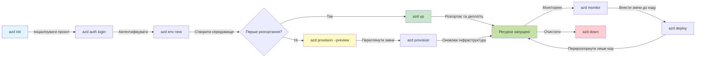
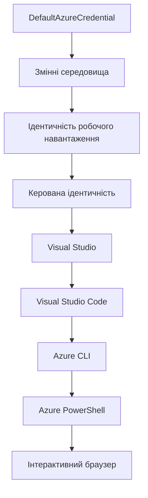

<!--
CO_OP_TRANSLATOR_METADATA:
{
  "original_hash": "e855e899d2705754fe85b04190edd0f0",
  "translation_date": "2025-11-23T22:13:38+00:00",
  "source_file": "docs/getting-started/azd-basics.md",
  "language_code": "uk"
}
-->
# Основи AZD - Розуміння Azure Developer CLI

# Основи AZD - Основні концепції та принципи

**Навігація по розділу:**
- **📚 Головна сторінка курсу**: [AZD для початківців](../../README.md)
- **📖 Поточний розділ**: Розділ 1 - Основи та швидкий старт
- **⬅️ Попередній**: [Огляд курсу](../../README.md#-chapter-1-foundation--quick-start)
- **➡️ Наступний**: [Встановлення та налаштування](installation.md)
- **🚀 Наступний розділ**: [Розділ 2: Розробка з акцентом на AI](../microsoft-foundry/microsoft-foundry-integration.md)

## Вступ

У цьому уроці ви познайомитеся з Azure Developer CLI (azd) — потужним інструментом командного рядка, який прискорює ваш шлях від локальної розробки до розгортання в Azure. Ви дізнаєтеся про основні концепції, ключові функції та зрозумієте, як azd спрощує розгортання хмарних додатків.

## Цілі навчання

До кінця цього уроку ви:
- Зрозумієте, що таке Azure Developer CLI і його основне призначення
- Вивчите основні концепції шаблонів, середовищ і сервісів
- Ознайомитеся з ключовими функціями, включаючи розробку на основі шаблонів та Infrastructure as Code
- Зрозумієте структуру проекту azd та робочий процес
- Будете готові встановити та налаштувати azd для вашого середовища розробки

## Результати навчання

Після завершення уроку ви зможете:
- Пояснити роль azd у сучасних робочих процесах хмарної розробки
- Визначити компоненти структури проекту azd
- Описати, як шаблони, середовища та сервіси працюють разом
- Зрозуміти переваги Infrastructure as Code з azd
- Розпізнавати різні команди azd та їх призначення

## Що таке Azure Developer CLI (azd)?

Azure Developer CLI (azd) — це інструмент командного рядка, створений для прискорення вашого шляху від локальної розробки до розгортання в Azure. Він спрощує процес створення, розгортання та управління хмарними додатками на Azure.

### 🎯 Чому варто використовувати AZD? Порівняння з реальним світом

Порівняємо розгортання простого веб-додатку з базою даних:

#### ❌ БЕЗ AZD: Ручне розгортання в Azure (30+ хвилин)

```bash
# Крок 1: Створіть групу ресурсів
az group create --name myapp-rg --location eastus

# Крок 2: Створіть план служби додатків
az appservice plan create --name myapp-plan \
  --resource-group myapp-rg \
  --sku B1 --is-linux

# Крок 3: Створіть веб-додаток
az webapp create --name myapp-web-unique123 \
  --resource-group myapp-rg \
  --plan myapp-plan \
  --runtime "NODE:18-lts"

# Крок 4: Створіть обліковий запис Cosmos DB (10-15 хвилин)
az cosmosdb create --name myapp-cosmos-unique123 \
  --resource-group myapp-rg \
  --kind MongoDB

# Крок 5: Створіть базу даних
az cosmosdb mongodb database create \
  --account-name myapp-cosmos-unique123 \
  --resource-group myapp-rg \
  --name tododb

# Крок 6: Створіть колекцію
az cosmosdb mongodb collection create \
  --account-name myapp-cosmos-unique123 \
  --resource-group myapp-rg \
  --database-name tododb \
  --name todos

# Крок 7: Отримайте рядок підключення
CONN_STR=$(az cosmosdb keys list \
  --name myapp-cosmos-unique123 \
  --resource-group myapp-rg \
  --type connection-strings \
  --query "connectionStrings[0].connectionString" -o tsv)

# Крок 8: Налаштуйте параметри додатка
az webapp config appsettings set \
  --name myapp-web-unique123 \
  --resource-group myapp-rg \
  --settings MONGODB_URI="$CONN_STR"

# Крок 9: Увімкніть ведення журналу
az webapp log config --name myapp-web-unique123 \
  --resource-group myapp-rg \
  --application-logging filesystem \
  --detailed-error-messages true

# Крок 10: Налаштуйте Application Insights
az monitor app-insights component create \
  --app myapp-insights \
  --location eastus \
  --resource-group myapp-rg

# Крок 11: Зв’яжіть App Insights з веб-додатком
INSTRUMENTATION_KEY=$(az monitor app-insights component show \
  --app myapp-insights \
  --resource-group myapp-rg \
  --query "instrumentationKey" -o tsv)

az webapp config appsettings set \
  --name myapp-web-unique123 \
  --resource-group myapp-rg \
  --settings APPINSIGHTS_INSTRUMENTATIONKEY="$INSTRUMENTATION_KEY"

# Крок 12: Зберіть додаток локально
npm install
npm run build

# Крок 13: Створіть пакет розгортання
zip -r app.zip . -x "*.git*" "node_modules/*"

# Крок 14: Розгорніть додаток
az webapp deployment source config-zip \
  --resource-group myapp-rg \
  --name myapp-web-unique123 \
  --src app.zip

# Крок 15: Чекайте і моліться, щоб це працювало 🙏
# (Автоматична перевірка відсутня, потрібне ручне тестування)
```

**Проблеми:**
- ❌ 15+ команд, які потрібно запам'ятати та виконати
- ❌ 30-45 хвилин ручної роботи
- ❌ Легко зробити помилки (друкарські помилки, неправильні параметри)
- ❌ Рядки підключення видно в історії терміналу
- ❌ Немає автоматичного відкату, якщо щось піде не так
- ❌ Важко повторити для членів команди
- ❌ Кожного разу по-різному (не відтворюється)

#### ✅ З AZD: Автоматизоване розгортання (5 команд, 10-15 хвилин)

```bash
# Крок 1: Ініціалізувати з шаблону
azd init --template todo-nodejs-mongo

# Крок 2: Автентифікувати
azd auth login

# Крок 3: Створити середовище
azd env new dev

# Крок 4: Переглянути зміни (необов'язково, але рекомендовано)
azd provision --preview

# Крок 5: Розгорнути все
azd up

# ✨ Готово! Все розгорнуто, налаштовано та моніториться
```

**Переваги:**
- ✅ **5 команд** проти 15+ ручних кроків
- ✅ **10-15 хвилин** загального часу (переважно очікування Azure)
- ✅ **Нуль помилок** — автоматизовано та протестовано
- ✅ **Секрети зберігаються безпечно** через Key Vault
- ✅ **Автоматичний відкат** у разі невдачі
- ✅ **Повністю відтворюється** — однаковий результат кожного разу
- ✅ **Готовність до команди** — будь-хто може розгорнути за допомогою тих самих команд
- ✅ **Infrastructure as Code** — шаблони Bicep під контролем версій
- ✅ **Вбудований моніторинг** — Application Insights налаштовано автоматично

### 📊 Зменшення часу та помилок

| Метрика | Ручне розгортання | Розгортання з AZD | Покращення |
|:-------|:------------------|:---------------|:------------|
| **Команди** | 15+ | 5 | На 67% менше |
| **Час** | 30-45 хв | 10-15 хв | На 60% швидше |
| **Рівень помилок** | ~40% | <5% | Зменшення на 88% |
| **Послідовність** | Низька (ручна) | 100% (автоматизована) | Ідеально |
| **Навчання команди** | 2-4 години | 30 хвилин | На 75% швидше |
| **Час відкату** | 30+ хв (ручний) | 2 хв (автоматизований) | На 93% швидше |

## Основні концепції

### Шаблони
Шаблони — це основа azd. Вони містять:
- **Код додатку** — ваш вихідний код та залежності
- **Визначення інфраструктури** — ресурси Azure, визначені в Bicep або Terraform
- **Файли конфігурації** — налаштування та змінні середовища
- **Скрипти розгортання** — автоматизовані робочі процеси розгортання

### Середовища
Середовища представляють різні цілі розгортання:
- **Розробка** — для тестування та розробки
- **Стадія** — передпродуктивне середовище
- **Продуктивність** — живе продуктивне середовище

Кожне середовище має власні:
- Групу ресурсів Azure
- Налаштування конфігурації
- Стан розгортання

### Сервіси
Сервіси — це будівельні блоки вашого додатку:
- **Фронтенд** — веб-додатки, SPA
- **Бекенд** — API, мікросервіси
- **База даних** — рішення для зберігання даних
- **Сховище** — файлове та блобове сховище

## Ключові функції

### 1. Розробка на основі шаблонів
```bash
# Переглянути доступні шаблони
azd template list

# Ініціалізувати з шаблону
azd init --template <template-name>
```

### 2. Infrastructure as Code
- **Bicep** — спеціалізована мова Azure
- **Terraform** — інструмент для мультихмарної інфраструктури
- **ARM Templates** — шаблони Azure Resource Manager

### 3. Інтегровані робочі процеси
```bash
# Завершити робочий процес розгортання
azd up            # Підготовка + Розгортання, це автоматизовано для першого налаштування

# 🧪 НОВЕ: Попередній перегляд змін інфраструктури перед розгортанням (БЕЗПЕЧНО)
azd provision --preview    # Симуляція розгортання інфраструктури без внесення змін

azd provision     # Створіть ресурси Azure, якщо ви оновлюєте інфраструктуру, використовуйте це
azd deploy        # Розгорніть код програми або повторно розгорніть код програми після оновлення
azd down          # Очистити ресурси
```

#### 🛡️ Безпечне планування інфраструктури з Preview
Команда `azd provision --preview` змінює правила гри для безпечного розгортання:
- **Аналіз без виконання** — показує, що буде створено, змінено або видалено
- **Нульовий ризик** — жодних реальних змін у вашому середовищі Azure
- **Співпраця команди** — поділіться результатами попереднього перегляду перед розгортанням
- **Оцінка витрат** — зрозумійте витрати на ресурси перед зобов'язанням

```bash
# Приклад робочого процесу попереднього перегляду
azd provision --preview           # Перегляньте, що зміниться
# Перегляньте результат, обговоріть з командою
azd provision                     # Застосуйте зміни з упевненістю
```

### 📊 Візуалізація: Робочий процес розробки з AZD


**Пояснення робочого процесу:**
1. **Init** — Початок з шаблону або нового проекту
2. **Auth** — Аутентифікація в Azure
3. **Environment** — Створення ізольованого середовища розгортання
4. **Preview** — 🆕 Завжди попередньо переглядайте зміни інфраструктури (безпечна практика)
5. **Provision** — Створення/оновлення ресурсів Azure
6. **Deploy** — Завантаження вашого коду додатку
7. **Monitor** — Спостереження за продуктивністю додатку
8. **Iterate** — Внесення змін та повторне розгортання коду
9. **Cleanup** — Видалення ресурсів після завершення роботи

### 4. Управління середовищами
```bash
# Створення та управління середовищами
azd env new <environment-name>
azd env select <environment-name>
azd env list
```

## 📁 Структура проекту

Типова структура проекту azd:
```
my-app/
├── .azd/                    # azd configuration
│   └── config.json
├── .azure/                  # Azure deployment artifacts
├── .devcontainer/          # Development container config
├── .github/workflows/      # GitHub Actions
├── .vscode/               # VS Code settings
├── infra/                 # Infrastructure code
│   ├── main.bicep        # Main infrastructure template
│   ├── main.parameters.json
│   └── modules/          # Reusable modules
├── src/                  # Application source code
│   ├── api/             # Backend services
│   └── web/             # Frontend application
├── azure.yaml           # azd project configuration
└── README.md
```

## 🔧 Файли конфігурації

### azure.yaml
Основний файл конфігурації проекту:
```yaml
name: my-awesome-app
metadata:
  template: my-template@1.0.0

services:
  web:
    project: ./src/web
    language: js
    host: appservice
  api:
    project: ./src/api
    language: js
    host: appservice

hooks:
  preprovision:
    shell: pwsh
    run: echo "Preparing to provision..."
```

### .azure/config.json
Конфігурація, специфічна для середовища:
```json
{
  "version": 1,
  "defaultEnvironment": "dev",
  "environments": {
    "dev": {
      "subscriptionId": "your-subscription-id",
      "location": "eastus"
    }
  }
}
```

## 🎪 Загальні робочі процеси з практичними вправами

> **💡 Порада для навчання:** Виконуйте ці вправи послідовно, щоб поступово розвивати свої навички роботи з AZD.

### 🎯 Вправа 1: Ініціалізація вашого першого проекту

**Мета:** Створити проект AZD та дослідити його структуру

**Кроки:**
```bash
# Використовуйте перевірений шаблон
azd init --template todo-nodejs-mongo

# Досліджуйте створені файли
ls -la  # Перегляньте всі файли, включаючи приховані

# Створені ключові файли:
# - azure.yaml (основна конфігурація)
# - infra/ (код інфраструктури)
# - src/ (код додатка)
```

**✅ Успіх:** У вас є azure.yaml, infra/ та src/ каталоги

---

### 🎯 Вправа 2: Розгортання в Azure

**Мета:** Завершити розгортання від початку до кінця

**Кроки:**
```bash
# 1. Автентифікація
az login && azd auth login

# 2. Створити середовище
azd env new dev
azd env set AZURE_LOCATION eastus

# 3. Переглянути зміни (РЕКОМЕНДОВАНО)
azd provision --preview

# 4. Розгорнути все
azd up

# 5. Перевірити розгортання
azd show    # Переглянути URL вашого додатку
```

**Очікуваний час:** 10-15 хвилин  
**✅ Успіх:** URL додатку відкривається в браузері

---

### 🎯 Вправа 3: Кілька середовищ

**Мета:** Розгорнути в dev та staging

**Кроки:**
```bash
# Вже є dev, створіть staging
azd env new staging
azd env set AZURE_LOCATION westus2
azd up

# Перемикайтеся між ними
azd env list
azd env select dev
```

**✅ Успіх:** Дві окремі групи ресурсів у Azure Portal

---

### 🛡️ Чистий старт: `azd down --force --purge`

Коли вам потрібно повністю скинути:

```bash
azd down --force --purge
```

**Що робить:**
- `--force`: Без підтверджень
- `--purge`: Видаляє весь локальний стан та ресурси Azure

**Використовуйте, коли:**
- Розгортання не вдалося завершити
- Перемикання проектів
- Потрібен новий старт

---

## 🎪 Оригінальний довідник робочого процесу

### Початок нового проекту
```bash
# Метод 1: Використати існуючий шаблон
azd init --template todo-nodejs-mongo

# Метод 2: Почати з нуля
azd init

# Метод 3: Використати поточний каталог
azd init .
```

### Цикл розробки
```bash
# Налаштуйте середовище розробки
azd auth login
azd env new dev
azd env select dev

# Розгорніть все
azd up

# Внесіть зміни та повторно розгорніть
azd deploy

# Приберіть після завершення
azd down --force --purge # команда в Azure Developer CLI є **жорстким скиданням** для вашого середовища—особливо корисна при усуненні несправностей невдалих розгортань, очищенні сирітських ресурсів або підготовці до нового розгортання.
```

## Розуміння `azd down --force --purge`
Команда `azd down --force --purge` — це потужний спосіб повністю знищити ваше середовище azd та всі пов'язані ресурси. Ось розбір того, що робить кожен прапорець:
```
--force
```
- Пропускає запити на підтвердження.
- Корисно для автоматизації або сценаріїв, де ручний ввід неможливий.
- Забезпечує, що процес знищення продовжується без переривань, навіть якщо CLI виявляє невідповідності.

```
--purge
```
Видаляє **всі пов'язані метадані**, включаючи:
Стан середовища
Локальну папку `.azure`
Кешовану інформацію про розгортання
Запобігає "запам'ятовуванню" попередніх розгортань azd, що може викликати проблеми, такі як невідповідність груп ресурсів або застарілі посилання на реєстр.


### Чому використовувати обидва?
Коли ви зіткнулися з проблемами `azd up` через залишковий стан або часткові розгортання, ця комбінація забезпечує **чистий старт**.

Це особливо корисно після ручного видалення ресурсів у порталі Azure або при зміні шаблонів, середовищ чи конвенцій іменування груп ресурсів.


### Управління кількома середовищами
```bash
# Створити проміжне середовище
azd env new staging
azd env select staging
azd up

# Переключитися назад на розробку
azd env select dev

# Порівняти середовища
azd env list
```

## 🔐 Аутентифікація та облікові дані

Розуміння аутентифікації є ключовим для успішного розгортання azd. Azure використовує кілька методів аутентифікації, і azd використовує той самий ланцюжок облікових даних, що й інші інструменти Azure.

### Аутентифікація через Azure CLI (`az login`)

Перед використанням azd вам потрібно аутентифікуватися в Azure. Найпоширеніший метод — використання Azure CLI:

```bash
# Інтерактивний вхід (відкриває браузер)
az login

# Вхід з конкретним орендарем
az login --tenant <tenant-id>

# Вхід за допомогою службового облікового запису
az login --service-principal -u <app-id> -p <password> --tenant <tenant-id>

# Перевірка поточного статусу входу
az account show

# Список доступних підписок
az account list --output table

# Встановити підписку за замовчуванням
az account set --subscription <subscription-id>
```

### Потік аутентифікації
1. **Інтерактивний вхід**: Відкриває ваш браузер за замовчуванням для аутентифікації
2. **Код пристрою**: Для середовищ без доступу до браузера
3. **Службовий обліковий запис**: Для автоматизації та сценаріїв CI/CD
4. **Керована ідентичність**: Для додатків, розміщених в Azure

### Ланцюжок DefaultAzureCredential

`DefaultAzureCredential` — це тип облікових даних, який забезпечує спрощений досвід аутентифікації, автоматично пробуючи кілька джерел облікових даних у певному порядку:

#### Порядок ланцюжка облікових даних

#### 1. Змінні середовища
```bash
# Встановіть змінні середовища для службового принципала
export AZURE_CLIENT_ID="<app-id>"
export AZURE_CLIENT_SECRET="<password>"
export AZURE_TENANT_ID="<tenant-id>"
```

#### 2. Ідентичність робочого навантаження (Kubernetes/GitHub Actions)
Використовується автоматично в:
- Azure Kubernetes Service (AKS) з Workload Identity
- GitHub Actions з OIDC федерацією
- Інші сценарії федеративної ідентичності

#### 3. Керована ідентичність
Для ресурсів Azure, таких як:
- Віртуальні машини
- App Service
- Azure Functions
- Container Instances

```bash
# Перевірте, чи працює на ресурсі Azure з керованою ідентичністю
az account show --query "user.type" --output tsv
# Повертає: "servicePrincipal", якщо використовується керована ідентичність
```

#### 4. Інтеграція з інструментами розробки
- **Visual Studio**: Автоматично використовує обліковий запис, у якому виконано вхід
- **VS Code**: Використовує облікові дані розширення Azure Account
- **Azure CLI**: Використовує облікові дані `az login` (найпоширеніше для локальної розробки)

### Налаштування аутентифікації AZD

```bash
# Метод 1: Використання Azure CLI (Рекомендовано для розробки)
az login
azd auth login  # Використовує існуючі облікові дані Azure CLI

# Метод 2: Пряма автентифікація azd
azd auth login --use-device-code  # Для безголових середовищ

# Метод 3: Перевірка статусу автентифікації
azd auth login --check-status

# Метод 4: Вихід з системи та повторна автентифікація
azd auth logout
azd auth login
```

### Найкращі практики аутентифікації

#### Для локальної розробки
```bash
# 1. Увійдіть за допомогою Azure CLI
az login

# 2. Перевірте правильну підписку
az account show
az account set --subscription "Your Subscription Name"

# 3. Використовуйте azd з існуючими обліковими даними
azd auth login
```

#### Для CI/CD конвеєрів
```yaml
# GitHub Actions example
- name: Azure Login
  uses: azure/login@v1
  with:
    creds: ${{ secrets.AZURE_CREDENTIALS }}

- name: Deploy with azd
  run: |
    azd auth login --client-id ${{ secrets.AZURE_CLIENT_ID }} \
                    --client-secret ${{ secrets.AZURE_CLIENT_SECRET }} \
                    --tenant-id ${{ secrets.AZURE_TENANT_ID }}
    azd up --no-prompt
```

#### Для продуктивних середовищ
- Використовуйте **Керовану ідентичність**, якщо додатки працюють на ресурсах Azure
- Використовуйте **Службовий обліковий запис** для сценаріїв автоматизації
- Уникайте зберігання облікових даних у коді або файлах конфігурації
- Використовуйте **Azure Key Vault** для конфіденційної конфігурації

### Поширені проблеми з аутентифікацією та їх вирішення

#### Проблема: "Не знайдено підписки"
```bash
# Рішення: Встановити підписку за замовчуванням
az account list --output table
az account set --subscription "<subscription-id>"
azd env set AZURE_SUBSCRIPTION_ID "<subscription-id>"
```

#### Проблема: "Недостатньо дозволів"
```bash
# Рішення: Перевірте та призначте необхідні ролі
az role assignment list --assignee $(az account show --query user.name --output tsv)

# Загальні необхідні ролі:
# - Співавтор (для управління ресурсами)
# - Адміністратор доступу користувачів (для призначення ролей)
```

#### Проблема: "Токен закінчився"
```bash
# Рішення: Повторна автентифікація
az logout
az login
azd auth logout
azd auth login
```

### Аутентифікація в різних сценаріях

#### Локальна розробка
```bash
# Рахунок особистого розвитку
az login
azd auth login
```

#### Розробка в команді
```bash
# Використовуйте конкретного орендаря для організації
az login --tenant contoso.onmicrosoft.com
azd auth login
```

#### Сценарії з кількома орендарями
```bash
# Перемикання між орендарями
az login --tenant tenant1.onmicrosoft.com
# Розгортання для орендаря 1
azd up

az login --tenant tenant2.onmicrosoft.com  
# Розгортання для орендаря 2
azd up
```

### Міркування щодо безпеки

1. **Зберігання облікових даних**: Ніколи не зберігайте облікові дані в вихідному коді
2. **Обмеження доступу**: Використовуйте принцип найменших привілеїв для службових облікових записів
3. **Ротація токенів**: Регулярно змінюйте секрети службових облікових записів
4. **Журнал аудиту**: Моніторинг аутентифікації та активностей розгортання
5. **Мережева безпека**: Використовуйте приватні кінцеві точки, коли це можливо

### Вирішення проблем з аутентифікацією

```bash
# Виправлення проблем автентифікації
azd auth login --check-status
az account show
az account get-access-token

# Загальні команди для діагностики
whoami                          # Поточний контекст користувача
az ad signed-in-user show      # Деталі користувача Azure AD
az group list                  # Тестування доступу до ресурсу
```

## Розуміння `azd down --force --purge`

### Відкриття
```bash
azd template list              # Переглянути шаблони
azd template show <template>   # Деталі шаблону
azd init --help               # Опції ініціалізації
```

### Управління проектами
```bash
azd show                     # Огляд проєкту
azd env show                 # Поточне середовище
azd config list             # Налаштування конфігурації
```

### Моніторинг
```bash
azd monitor                  # Відкрити портал Azure
azd pipeline config          # Налаштувати CI/CD
azd logs                     # Переглянути журнали додатків
```

## Найкращі практики

### 
- [Встановлення та налаштування](installation.md) - Встановіть та налаштуйте azd
- [Ваш перший проєкт](first-project.md) - Практичний посібник
- [Посібник з конфігурації](configuration.md) - Розширені параметри конфігурації

**🎯 Готові до наступного розділу?**
- [Розділ 2: Розробка з акцентом на AI](../microsoft-foundry/microsoft-foundry-integration.md) - Почніть створювати AI-додатки

## Додаткові ресурси

- [Огляд Azure Developer CLI](https://learn.microsoft.com/en-us/azure/developer/azure-developer-cli/)
- [Галерея шаблонів](https://azure.github.io/awesome-azd/)
- [Зразки від спільноти](https://github.com/Azure-Samples)

---

## 🙋 Часті запитання

### Загальні питання

**П: У чому різниця між AZD та Azure CLI?**

В: Azure CLI (`az`) використовується для управління окремими ресурсами Azure. AZD (`azd`) використовується для управління цілими додатками:

```bash
# Azure CLI - Управління ресурсами низького рівня
az webapp create --name myapp --resource-group rg
az sql server create --name myserver --resource-group rg
# ...потрібно багато інших команд

# AZD - Управління на рівні додатків
azd up  # Розгортає весь додаток з усіма ресурсами
```

**Подумайте про це так:**
- `az` = Робота з окремими кубиками Lego
- `azd` = Робота з повними наборами Lego

---

**П: Чи потрібно знати Bicep або Terraform, щоб використовувати AZD?**

В: Ні! Почніть із шаблонів:
```bash
# Використовуйте існуючий шаблон - знання IaC не потрібні
azd init --template todo-nodejs-mongo
azd up
```

Ви можете вивчити Bicep пізніше для налаштування інфраструктури. Шаблони надають робочі приклади для навчання.

---

**П: Скільки коштує запуск шаблонів AZD?**

В: Вартість залежить від шаблону. Більшість шаблонів для розробки коштують $50-150/місяць:

```bash
# Перегляньте витрати перед розгортанням
azd provision --preview

# Завжди очищуйте, коли не використовуєте
azd down --force --purge  # Видаляє всі ресурси
```

**Порада:** Використовуйте безкоштовні рівні, якщо вони доступні:
- App Service: рівень F1 (безкоштовний)
- Azure OpenAI: 50,000 токенів/місяць безкоштовно
- Cosmos DB: 1000 RU/s безкоштовний рівень

---

**П: Чи можу я використовувати AZD з існуючими ресурсами Azure?**

В: Так, але легше почати з нуля. AZD найкраще працює, коли він керує повним життєвим циклом. Для існуючих ресурсів:

```bash
# Варіант 1: Імпортувати існуючі ресурси (розширений)
azd init
# Потім змінити infra/, щоб посилатися на існуючі ресурси

# Варіант 2: Почати з нуля (рекомендовано)
azd init --template matching-your-stack
azd up  # Створює нове середовище
```

---

**П: Як поділитися своїм проєктом із командою?**

В: Збережіть проєкт AZD у Git (але НЕ зберігайте папку .azure):

```bash
# Вже є в .gitignore за замовчуванням
.azure/        # Містить секрети та дані середовища
*.env          # Змінні середовища

# Члени команди тоді:
git clone <your-repo>
azd auth login
azd env new <their-name>-dev
azd up
```

Усі отримають однакову інфраструктуру з тих самих шаблонів.

---

### Питання з усунення несправностей

**П: "azd up" зупинився на півдорозі. Що робити?**

В: Перевірте помилку, виправте її, а потім повторіть спробу:

```bash
# Переглянути детальні журнали
azd show

# Загальні виправлення:

# 1. Якщо перевищено квоту:
azd env set AZURE_LOCATION "westus2"  # Спробуйте інший регіон

# 2. Якщо конфлікт імені ресурсу:
azd down --force --purge  # Очистити все
azd up  # Повторити спробу

# 3. Якщо термін дії авторизації закінчився:
az login
azd auth login
azd up
```

**Найпоширеніша проблема:** Обрано неправильну підписку Azure
```bash
az account list --output table
az account set --subscription "<correct-subscription>"
```

---

**П: Як розгорнути лише зміни в коді без повторного створення інфраструктури?**

В: Використовуйте `azd deploy` замість `azd up`:

```bash
azd up          # Перший раз: підготовка + розгортання (повільно)

# Внесіть зміни до коду...

azd deploy      # Наступні рази: тільки розгортання (швидко)
```

Порівняння швидкості:
- `azd up`: 10-15 хвилин (створює інфраструктуру)
- `azd deploy`: 2-5 хвилин (лише код)

---

**П: Чи можу я налаштувати шаблони інфраструктури?**

В: Так! Редагуйте файли Bicep у папці `infra/`:

```bash
# Після azd init
cd infra/
code main.bicep  # Редагувати у VS Code

# Переглянути зміни
azd provision --preview

# Застосувати зміни
azd provision
```

**Порада:** Почніть з малого - змініть лише SKUs:
```bicep
// infra/main.bicep
sku: {
  name: 'B1'  // Change to 'P1V2' for production
}
```

---

**П: Як видалити все, що створив AZD?**

В: Одна команда видаляє всі ресурси:

```bash
azd down --force --purge

# Це видаляє:
# - Усі ресурси Azure
# - Групу ресурсів
# - Стан локального середовища
# - Кешовані дані розгортання
```

**Завжди виконуйте це, коли:**
- Завершили тестування шаблону
- Переходите до іншого проєкту
- Хочете почати з нуля

**Економія коштів:** Видалення невикористаних ресурсів = $0 витрат

---

**П: Що робити, якщо я випадково видалив ресурси в Azure Portal?**

В: Стан AZD може вийти з синхронізації. Використовуйте підхід "чистого аркуша":

```bash
# 1. Видалити локальний стан
azd down --force --purge

# 2. Почати з чистого аркуша
azd up

# Альтернатива: Дозволити AZD виявити та виправити
azd provision  # Створить відсутні ресурси
```

---

### Питання для досвідчених користувачів

**П: Чи можу я використовувати AZD у CI/CD конвеєрах?**

В: Так! Приклад для GitHub Actions:

```yaml
# .github/workflows/deploy.yml
name: Deploy with AZD

on:
  push:
    branches: [main]

jobs:
  deploy:
    runs-on: ubuntu-latest
    steps:
      - uses: actions/checkout@v2
      
      - name: Install azd
        run: curl -fsSL https://aka.ms/install-azd.sh | bash
      
      - name: Azure Login
        run: |
          azd auth login \
            --client-id ${{ secrets.AZURE_CLIENT_ID }} \
            --client-secret ${{ secrets.AZURE_CLIENT_SECRET }} \
            --tenant-id ${{ secrets.AZURE_TENANT_ID }}
      
      - name: Deploy
        run: azd up --no-prompt
```

---

**П: Як працювати з секретами та конфіденційними даними?**

В: AZD автоматично інтегрується з Azure Key Vault:

```bash
# Секрети зберігаються в Key Vault, а не в коді
azd env set DATABASE_PASSWORD "$(openssl rand -base64 32)"

# AZD автоматично:
# 1. Створює Key Vault
# 2. Зберігає секрет
# 3. Надає доступ додатку через Managed Identity
# 4. Впроваджує під час виконання
```

**Ніколи не зберігайте:**
- Папку `.azure/` (містить дані середовища)
- Файли `.env` (локальні секрети)
- Рядки підключення

---

**П: Чи можу я розгортати в кількох регіонах?**

В: Так, створіть середовище для кожного регіону:

```bash
# Середовище Східного США
azd env new prod-eastus
azd env set AZURE_LOCATION eastus
azd up

# Середовище Західної Європи
azd env new prod-westeurope
azd env set AZURE_LOCATION westeurope
azd up

# Кожне середовище є незалежним
azd env list
```

Для справжніх багаторегіональних додатків налаштуйте шаблони Bicep для одночасного розгортання в кількох регіонах.

---

**П: Де я можу отримати допомогу, якщо застряг?**

1. **Документація AZD:** https://learn.microsoft.com/azure/developer/azure-developer-cli/
2. **GitHub Issues:** https://github.com/Azure/azure-dev/issues
3. **Discord:** [Azure Discord](https://discord.gg/microsoft-azure) - канал #azure-developer-cli
4. **Stack Overflow:** Тег `azure-developer-cli`
5. **Цей курс:** [Посібник з усунення несправностей](../troubleshooting/common-issues.md)

**Порада:** Перед тим, як запитати, виконайте:
```bash
azd show       # Показує поточний стан
azd version    # Показує вашу версію
```
Додайте цю інформацію до свого запитання для швидшої допомоги.

---

## 🎓 Що далі?

Тепер ви розумієте основи AZD. Оберіть свій шлях:

### 🎯 Для початківців:
1. **Далі:** [Встановлення та налаштування](installation.md) - Встановіть AZD на свій пристрій
2. **Потім:** [Ваш перший проєкт](first-project.md) - Розгорніть свій перший додаток
3. **Практика:** Виконайте всі 3 вправи цього уроку

### 🚀 Для розробників AI:
1. **Перейдіть до:** [Розділ 2: Розробка з акцентом на AI](../microsoft-foundry/microsoft-foundry-integration.md)
2. **Розгорніть:** Почніть із `azd init --template get-started-with-ai-chat`
3. **Вивчайте:** Створюйте під час розгортання

### 🏗️ Для досвідчених розробників:
1. **Перегляньте:** [Посібник з конфігурації](configuration.md) - Розширені налаштування
2. **Досліджуйте:** [Інфраструктура як код](../deployment/provisioning.md) - Глибоке вивчення Bicep
3. **Створюйте:** Розробляйте власні шаблони для вашого стеку

---

**Навігація по розділах:**
- **📚 Головна сторінка курсу**: [AZD для початківців](../../README.md)
- **📖 Поточний розділ**: Розділ 1 - Основи та швидкий старт  
- **⬅️ Попередній**: [Огляд курсу](../../README.md#-chapter-1-foundation--quick-start)
- **➡️ Наступний**: [Встановлення та налаштування](installation.md)
- **🚀 Наступний розділ**: [Розділ 2: Розробка з акцентом на AI](../microsoft-foundry/microsoft-foundry-integration.md)

---

<!-- CO-OP TRANSLATOR DISCLAIMER START -->
**Відмова від відповідальності**:  
Цей документ був перекладений за допомогою сервісу автоматичного перекладу [Co-op Translator](https://github.com/Azure/co-op-translator). Хоча ми прагнемо до точності, будь ласка, майте на увазі, що автоматичні переклади можуть містити помилки або неточності. Оригінальний документ на його рідній мові слід вважати авторитетним джерелом. Для критичної інформації рекомендується професійний людський переклад. Ми не несемо відповідальності за будь-які непорозуміння або неправильні тлумачення, що виникають внаслідок використання цього перекладу.
<!-- CO-OP TRANSLATOR DISCLAIMER END -->