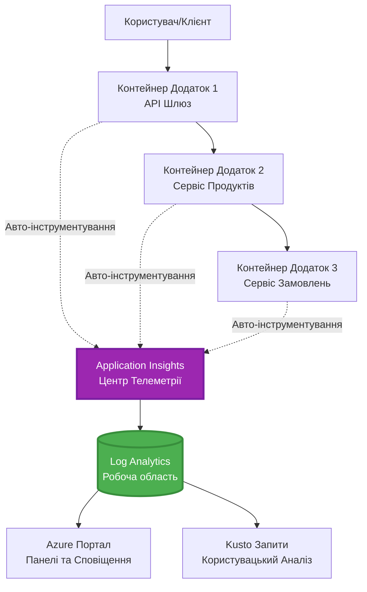
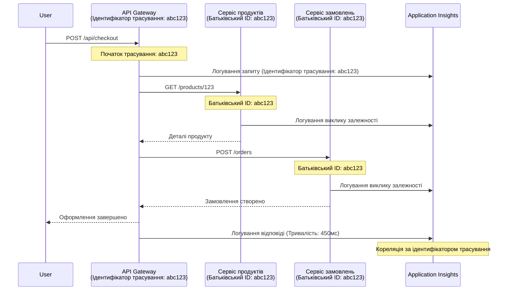

<!--
CO_OP_TRANSLATOR_METADATA:
{
  "original_hash": "e5aa37cdb6378c09099500ac31600b8c",
  "translation_date": "2025-11-23T23:56:26+00:00",
  "source_file": "docs/pre-deployment/application-insights.md",
  "language_code": "uk"
}
-->
# Інтеграція Application Insights з AZD

⏱️ **Орієнтовний час**: 40-50 хвилин | 💰 **Вартість**: ~$5-15/місяць | ⭐ **Складність**: Середня

**📚 Навчальний шлях:**
- ← Попереднє: [Перевірки перед запуском](preflight-checks.md) - Валідація перед розгортанням
- 🎯 **Ви тут**: Інтеграція Application Insights (Моніторинг, телеметрія, налагодження)
- → Далі: [Посібник з розгортання](../deployment/deployment-guide.md) - Розгортання в Azure
- 🏠 [Головна сторінка курсу](../../README.md)

---

## Що ви дізнаєтесь

Після завершення цього уроку ви зможете:
- Автоматично інтегрувати **Application Insights** у проєкти AZD
- Налаштувати **розподілене трасування** для мікросервісів
- Реалізувати **кастомну телеметрію** (метрики, події, залежності)
- Налаштувати **живі метрики** для моніторингу в реальному часі
- Створювати **сповіщення та інформаційні панелі** з розгортань AZD
- Налагоджувати проблеми у продакшені за допомогою **запитів телеметрії**
- Оптимізувати **витрати та стратегії вибірки**
- Моніторити **AI/LLM-додатки** (токени, затримки, витрати)

## Чому важлива інтеграція Application Insights з AZD

### Проблема: Спостережуваність у продакшені

**Без Application Insights:**
```
❌ No visibility into production behavior
❌ Manual log aggregation across services
❌ Reactive debugging (wait for customer complaints)
❌ No performance metrics
❌ Cannot trace requests across services
❌ Unknown failure rates and bottlenecks
```

**З Application Insights + AZD:**
```
✅ Automatic telemetry collection
✅ Centralized logs from all services
✅ Proactive issue detection
✅ End-to-end request tracing
✅ Performance metrics and insights
✅ Real-time dashboards
✅ AZD provisions everything automatically
```

**Аналогія**: Application Insights — це як "чорна скринька" літака + панель приладів для вашого додатку. Ви бачите все, що відбувається в реальному часі, і можете відтворити будь-який інцидент.

---

## Огляд архітектури

### Application Insights в архітектурі AZD


### Що моніториться автоматично

| Тип телеметрії | Що фіксується | Використання |
|----------------|---------------|--------------|
| **Запити** | HTTP-запити, коди статусу, тривалість | Моніторинг продуктивності API |
| **Залежності** | Зовнішні виклики (БД, API, сховища) | Виявлення вузьких місць |
| **Винятки** | Невловлені помилки зі стек-трейсами | Налагодження збоїв |
| **Кастомні події** | Бізнес-події (реєстрація, покупка) | Аналітика та воронки |
| **Метрики** | Лічильники продуктивності, кастомні метрики | Планування потужностей |
| **Трейси** | Лог-повідомлення з рівнем важливості | Налагодження та аудит |
| **Доступність** | Тести часу роботи та відгуку | Моніторинг SLA |

---

## Попередні вимоги

### Необхідні інструменти

```bash
# Перевірте Azure Developer CLI
azd version
# ✅ Очікувано: azd версія 1.0.0 або вище

# Перевірте Azure CLI
az --version
# ✅ Очікувано: azure-cli 2.50.0 або вище
```

### Вимоги до Azure

- Активна підписка Azure
- Дозволи на створення:
  - Ресурсів Application Insights
  - Робочих областей Log Analytics
  - Container Apps
  - Ресурсних груп

### Необхідні знання

Ви повинні завершити:
- [Основи AZD](../getting-started/azd-basics.md) - Основні концепції AZD
- [Налаштування](../getting-started/configuration.md) - Налаштування середовища
- [Перший проєкт](../getting-started/first-project.md) - Базове розгортання

---

## Урок 1: Автоматичний Application Insights з AZD

### Як AZD налаштовує Application Insights

AZD автоматично створює та налаштовує Application Insights під час розгортання. Давайте подивимось, як це працює.

### Структура проєкту

```
monitored-app/
├── azure.yaml                     # AZD configuration
├── infra/
│   ├── main.bicep                # Main infrastructure
│   ├── core/
│   │   └── monitoring.bicep      # Application Insights + Log Analytics
│   └── app/
│       └── api.bicep             # Container App with monitoring
└── src/
    ├── app.py                    # Application with telemetry
    ├── requirements.txt
    └── Dockerfile
```

---

### Крок 1: Налаштування AZD (azure.yaml)

**Файл: `azure.yaml`**

```yaml
name: monitored-app
metadata:
  template: monitored-app@1.0.0

services:
  api:
    project: ./src
    language: python
    host: containerapp

# AZD automatically provisions monitoring!
```

**І все!** AZD створить Application Insights за замовчуванням. Додаткові налаштування для базового моніторингу не потрібні.

---

### Крок 2: Інфраструктура моніторингу (Bicep)

**Файл: `infra/core/monitoring.bicep`**

```bicep
param logAnalyticsName string
param applicationInsightsName string
param location string = resourceGroup().location
param tags object = {}

// Log Analytics Workspace (required for Application Insights)
resource logAnalytics 'Microsoft.OperationalInsights/workspaces@2022-10-01' = {
  name: logAnalyticsName
  location: location
  tags: tags
  properties: {
    sku: {
      name: 'PerGB2018'  // Pay-as-you-go pricing
    }
    retentionInDays: 30  // Keep logs for 30 days
    features: {
      enableLogAccessUsingOnlyResourcePermissions: true
    }
  }
}

// Application Insights
resource applicationInsights 'Microsoft.Insights/components@2020-02-02' = {
  name: applicationInsightsName
  location: location
  tags: tags
  kind: 'web'
  properties: {
    Application_Type: 'web'
    WorkspaceResourceId: logAnalytics.id
    IngestionMode: 'LogAnalytics'
    publicNetworkAccessForIngestion: 'Enabled'
    publicNetworkAccessForQuery: 'Enabled'
  }
}

// Outputs for Container Apps
output logAnalyticsWorkspaceId string = logAnalytics.id
output logAnalyticsWorkspaceName string = logAnalytics.name
output applicationInsightsConnectionString string = applicationInsights.properties.ConnectionString
output applicationInsightsInstrumentationKey string = applicationInsights.properties.InstrumentationKey
output applicationInsightsName string = applicationInsights.name
```

---

### Крок 3: Підключення Container App до Application Insights

**Файл: `infra/app/api.bicep`**

```bicep
param name string
param location string
param tags object = {}
param containerAppsEnvironmentName string
param applicationInsightsConnectionString string

resource containerApp 'Microsoft.App/containerApps@2023-05-01' = {
  name: name
  location: location
  tags: tags
  properties: {
    configuration: {
      ingress: {
        external: true
        targetPort: 8000
      }
      secrets: [
        {
          name: 'appinsights-connection-string'
          value: applicationInsightsConnectionString
        }
      ]
    }
    template: {
      containers: [
        {
          name: 'api'
          image: 'myregistry.azurecr.io/api:latest'
          resources: {
            cpu: json('0.5')
            memory: '1Gi'
          }
          env: [
            {
              name: 'APPLICATIONINSIGHTS_CONNECTION_STRING'
              secretRef: 'appinsights-connection-string'
            }
            {
              name: 'APPLICATIONINSIGHTS_ENABLED'
              value: 'true'
            }
          ]
        }
      ]
    }
  }
}

output uri string = 'https://${containerApp.properties.configuration.ingress.fqdn}'
```

---

### Крок 4: Код додатку з телеметрією

**Файл: `src/app.py`**

```python
from flask import Flask, request, jsonify
from opencensus.ext.azure.log_exporter import AzureLogHandler
from opencensus.ext.azure.trace_exporter import AzureExporter
from opencensus.ext.flask.flask_middleware import FlaskMiddleware
from opencensus.trace.samplers import ProbabilitySampler
import logging
import os

app = Flask(__name__)

# Отримати рядок підключення Application Insights
connection_string = os.environ.get('APPLICATIONINSIGHTS_CONNECTION_STRING')

if connection_string:
    # Налаштувати розподілене трасування
    middleware = FlaskMiddleware(
        app,
        exporter=AzureExporter(connection_string=connection_string),
        sampler=ProbabilitySampler(rate=1.0)  # 100% вибірка для розробки
    )
    
    # Налаштувати логування
    logger = logging.getLogger(__name__)
    logger.addHandler(AzureLogHandler(connection_string=connection_string))
    logger.setLevel(logging.INFO)
    
    print("✅ Application Insights enabled")
else:
    logger = logging.getLogger(__name__)
    logger.setLevel(logging.INFO)
    print("⚠️ Application Insights not configured")

@app.route('/health')
def health():
    logger.info('Health check endpoint called')
    return jsonify({'status': 'healthy', 'monitoring': 'enabled'})

@app.route('/api/products')
def get_products():
    logger.info('Fetching products')
    
    # Імітувати виклик бази даних (автоматично відстежується як залежність)
    products = [
        {'id': 1, 'name': 'Laptop', 'price': 999.99},
        {'id': 2, 'name': 'Mouse', 'price': 29.99},
        {'id': 3, 'name': 'Keyboard', 'price': 79.99}
    ]
    
    logger.info(f'Returned {len(products)} products')
    return jsonify(products)

@app.route('/api/error-test')
def error_test():
    """Test error tracking"""
    logger.error('Testing error tracking')
    try:
        raise ValueError('This is a test exception')
    except Exception as e:
        logger.exception('Exception occurred in error-test endpoint')
        return jsonify({'error': str(e)}), 500

@app.route('/api/slow')
def slow_endpoint():
    """Test performance tracking"""
    import time
    logger.info('Slow endpoint called')
    time.sleep(3)  # Імітувати повільну операцію
    logger.warning('Endpoint took 3 seconds to respond')
    return jsonify({'message': 'Slow operation completed'})

if __name__ == '__main__':
    app.run(host='0.0.0.0', port=8000)
```

**Файл: `src/requirements.txt`**

```txt
Flask==3.0.0
opencensus-ext-azure==1.1.13
opencensus-ext-flask==0.8.1
gunicorn==21.2.0
```

---

### Крок 5: Розгортання та перевірка

```bash
# Ініціалізувати AZD
azd init

# Розгорнути (автоматично забезпечує Application Insights)
azd up

# Отримати URL додатку
APP_URL=$(azd env get-values | grep API_URL | cut -d '=' -f2 | tr -d '"')

# Генерувати телеметрію
curl $APP_URL/health
curl $APP_URL/api/products
curl $APP_URL/api/error-test
curl $APP_URL/api/slow
```

**✅ Очікуваний результат:**
```json
{
  "status": "healthy",
  "monitoring": "enabled"
}
```

---

### Крок 6: Перегляд телеметрії в Azure Portal

```bash
# Отримати деталі Application Insights
azd env get-values | grep APPLICATIONINSIGHTS

# Відкрити в Azure Portal
az monitor app-insights component show \
  --app $(azd env get-values | grep APPLICATIONINSIGHTS_NAME | cut -d '=' -f2 | tr -d '"') \
  --resource-group $(azd env get-values | grep AZURE_RESOURCE_GROUP | cut -d '=' -f2 | tr -d '"') \
  --query "appId" -o tsv
```

**Перейдіть до Azure Portal → Application Insights → Transaction Search**

Ви повинні побачити:
- ✅ HTTP-запити з кодами статусу
- ✅ Тривалість запитів (3+ секунди для `/api/slow`)
- ✅ Деталі винятків з `/api/error-test`
- ✅ Кастомні лог-повідомлення

---

## Урок 2: Кастомна телеметрія та події

### Відстеження бізнес-подій

Додамо кастомну телеметрію для критично важливих бізнес-подій.

**Файл: `src/telemetry.py`**

```python
from opencensus.ext.azure import metrics_exporter
from opencensus.stats import aggregation as aggregation_module
from opencensus.stats import measure as measure_module
from opencensus.stats import stats as stats_module
from opencensus.stats import view as view_module
from opencensus.tags import tag_map as tag_map_module
from opencensus.ext.azure.log_exporter import AzureLogHandler
from opencensus.ext.azure.trace_exporter import AzureExporter
from opencensus.trace import tracer as tracer_module
import logging
import os

class TelemetryClient:
    """Custom telemetry client for Application Insights"""
    
    def __init__(self, connection_string=None):
        self.connection_string = connection_string or os.environ.get('APPLICATIONINSIGHTS_CONNECTION_STRING')
        
        if not self.connection_string:
            print("⚠️ Application Insights connection string not found")
            return
        
        # Налаштування логера
        self.logger = logging.getLogger(__name__)
        self.logger.addHandler(AzureLogHandler(connection_string=self.connection_string))
        self.logger.setLevel(logging.INFO)
        
        # Налаштування експортера метрик
        self.stats = stats_module.stats
        self.view_manager = self.stats.view_manager
        self.stats_recorder = self.stats.stats_recorder
        
        exporter = metrics_exporter.new_metrics_exporter(
            connection_string=self.connection_string
        )
        self.view_manager.register_exporter(exporter)
        
        # Налаштування трасувальника
        self.tracer = tracer_module.Tracer(
            exporter=AzureExporter(connection_string=self.connection_string)
        )
        
        print("✅ Custom telemetry client initialized")
    
    def track_event(self, event_name: str, properties: dict = None):
        """Track custom business event"""
        properties = properties or {}
        self.logger.info(
            f"CustomEvent: {event_name}",
            extra={
                'custom_dimensions': {
                    'event_name': event_name,
                    **properties
                }
            }
        )
    
    def track_metric(self, metric_name: str, value: float, properties: dict = None):
        """Track custom metric"""
        properties = properties or {}
        self.logger.info(
            f"CustomMetric: {metric_name} = {value}",
            extra={
                'custom_dimensions': {
                    'metric_name': metric_name,
                    'value': value,
                    **properties
                }
            }
        )
    
    def track_dependency(self, name: str, dependency_type: str, duration: float, success: bool):
        """Track external dependency call"""
        with self.tracer.span(name=name) as span:
            span.add_attribute('dependency.type', dependency_type)
            span.add_attribute('duration', duration)
            span.add_attribute('success', success)

# Глобальний клієнт телеметрії
telemetry = TelemetryClient()
```

### Оновлення додатку з кастомними подіями

**Файл: `src/app.py` (розширений)**

```python
from flask import Flask, request, jsonify
from telemetry import telemetry
import time
import random

app = Flask(__name__)

@app.route('/api/purchase', methods=['POST'])
def purchase():
    """Track purchase event with custom telemetry"""
    data = request.json
    product_id = data.get('product_id')
    quantity = data.get('quantity', 1)
    price = data.get('price', 0)
    
    # Відстежити бізнес-подію
    telemetry.track_event('Purchase', {
        'product_id': product_id,
        'quantity': quantity,
        'total_amount': price * quantity,
        'user_id': request.headers.get('X-User-Id', 'anonymous')
    })
    
    # Відстежити метрику доходу
    telemetry.track_metric('Revenue', price * quantity, {
        'product_id': product_id,
        'currency': 'USD'
    })
    
    return jsonify({
        'order_id': f'ORD-{random.randint(1000, 9999)}',
        'status': 'confirmed',
        'total': price * quantity
    })

@app.route('/api/search')
def search():
    """Track search queries"""
    query = request.args.get('q', '')
    
    start_time = time.time()
    
    # Симулювати пошук (було б реальним запитом до бази даних)
    results = [{'id': 1, 'name': f'Result for {query}'}]
    
    duration = (time.time() - start_time) * 1000  # Перетворити в мс
    
    # Відстежити подію пошуку
    telemetry.track_event('Search', {
        'query': query,
        'results_count': len(results),
        'duration_ms': duration
    })
    
    # Відстежити метрику продуктивності пошуку
    telemetry.track_metric('SearchDuration', duration, {
        'query_length': len(query)
    })
    
    return jsonify({'results': results, 'count': len(results)})

@app.route('/api/external-call')
def external_call():
    """Track external API dependency"""
    import requests
    
    start_time = time.time()
    success = True
    
    try:
        # Симулювати виклик зовнішнього API
        response = requests.get('https://api.example.com/data', timeout=5)
        result = response.json()
    except Exception as e:
        success = False
        result = {'error': str(e)}
    
    duration = (time.time() - start_time) * 1000
    
    # Відстежити залежність
    telemetry.track_dependency(
        name='ExternalAPI',
        dependency_type='HTTP',
        duration=duration,
        success=success
    )
    
    return jsonify(result)

if __name__ == '__main__':
    app.run(host='0.0.0.0', port=8000)
```

### Тестування кастомної телеметрії

```bash
# Відстежити подію покупки
curl -X POST $APP_URL/api/purchase \
  -H "Content-Type: application/json" \
  -H "X-User-Id: user123" \
  -d '{"product_id": 1, "quantity": 2, "price": 29.99}'

# Відстежити подію пошуку
curl "$APP_URL/api/search?q=laptop"

# Відстежити зовнішню залежність
curl $APP_URL/api/external-call
```

**Перегляд в Azure Portal:**

Перейдіть до Application Insights → Logs, потім виконайте:

```kusto
// View purchase events
traces
| where customDimensions.event_name == "Purchase"
| project 
    timestamp,
    product_id = tostring(customDimensions.product_id),
    total_amount = todouble(customDimensions.total_amount),
    user_id = tostring(customDimensions.user_id)
| order by timestamp desc

// View revenue metrics
traces
| where customDimensions.metric_name == "Revenue"
| summarize TotalRevenue = sum(todouble(customDimensions.value)) by bin(timestamp, 1h)
| render timechart

// View search performance
traces
| where customDimensions.event_name == "Search"
| summarize 
    AvgDuration = avg(todouble(customDimensions.duration_ms)),
    SearchCount = count()
  by bin(timestamp, 5m)
| render timechart
```

---

## Урок 3: Розподілене трасування для мікросервісів

### Увімкнення трасування між сервісами

Для мікросервісів Application Insights автоматично корелює запити між сервісами.

**Файл: `infra/main.bicep`**

```bicep
targetScope = 'subscription'

param environmentName string
param location string = 'eastus'

var tags = { 'azd-env-name': environmentName }

resource rg 'Microsoft.Resources/resourceGroups@2021-04-01' = {
  name: 'rg-${environmentName}'
  location: location
  tags: tags
}

// Monitoring (shared by all services)
module monitoring './core/monitoring.bicep' = {
  name: 'monitoring'
  scope: rg
  params: {
    logAnalyticsName: 'log-${environmentName}'
    applicationInsightsName: 'appi-${environmentName}'
    location: location
    tags: tags
  }
}

// API Gateway
module apiGateway './app/api-gateway.bicep' = {
  name: 'api-gateway'
  scope: rg
  params: {
    name: 'ca-gateway-${environmentName}'
    location: location
    tags: union(tags, { 'azd-service-name': 'gateway' })
    applicationInsightsConnectionString: monitoring.outputs.applicationInsightsConnectionString
  }
}

// Product Service
module productService './app/product-service.bicep' = {
  name: 'product-service'
  scope: rg
  params: {
    name: 'ca-products-${environmentName}'
    location: location
    tags: union(tags, { 'azd-service-name': 'products' })
    applicationInsightsConnectionString: monitoring.outputs.applicationInsightsConnectionString
  }
}

// Order Service
module orderService './app/order-service.bicep' = {
  name: 'order-service'
  scope: rg
  params: {
    name: 'ca-orders-${environmentName}'
    location: location
    tags: union(tags, { 'azd-service-name': 'orders' })
    applicationInsightsConnectionString: monitoring.outputs.applicationInsightsConnectionString
  }
}

output APPLICATIONINSIGHTS_CONNECTION_STRING string = monitoring.outputs.applicationInsightsConnectionString
output GATEWAY_URL string = apiGateway.outputs.uri
```

### Перегляд транзакції від початку до кінця


**Запит трасування від початку до кінця:**

```kusto
// Find complete request flow
let traceId = "abc123...";  // Get from response header
dependencies
| union requests
| where operation_Id == traceId
| project 
    timestamp,
    type = itemType,
    name,
    duration,
    success,
    cloud_RoleName
| order by timestamp asc
```

---

## Урок 4: Живі метрики та моніторинг у реальному часі

### Увімкнення потоку живих метрик

Живі метрики надають телеметрію в реальному часі з затримкою <1 секунди.

**Доступ до живих метрик:**

```bash
# Отримати ресурс Application Insights
APPI_NAME=$(azd env get-values | grep APPLICATIONINSIGHTS_NAME | cut -d '=' -f2 | tr -d '"')

# Отримати групу ресурсів
RG_NAME=$(azd env get-values | grep AZURE_RESOURCE_GROUP | cut -d '=' -f2 | tr -d '"')

echo "Navigate to: Azure Portal → Resource Groups → $RG_NAME → $APPI_NAME → Live Metrics"
```

**Що ви побачите в реальному часі:**
- ✅ Швидкість вхідних запитів (запити/сек)
- ✅ Виклики зовнішніх залежностей
- ✅ Кількість винятків
- ✅ Використання CPU та пам'яті
- ✅ Кількість активних серверів
- ✅ Вибіркова телеметрія

### Генерація навантаження для тестування

```bash
# Генеруйте навантаження, щоб побачити живі метрики
for i in {1..100}; do
  curl $APP_URL/api/products &
  curl $APP_URL/api/search?q=test$i &
done

# Переглядайте живі метрики в Azure Portal
# Ви повинні побачити сплеск швидкості запитів
```

---

## Практичні вправи

### Вправа 1: Налаштування сповіщень ⭐⭐ (Середня)

**Мета**: Створити сповіщення для високих рівнів помилок та повільних відповідей.

**Кроки:**

1. **Створіть сповіщення для рівня помилок:**

```bash
# Отримати ідентифікатор ресурсу Application Insights
APPI_ID=$(az monitor app-insights component show \
  --app $APPI_NAME \
  --resource-group $RG_NAME \
  --query "id" -o tsv)

# Створити метрику сповіщення для невдалих запитів
az monitor metrics alert create \
  --name "High-Error-Rate" \
  --resource-group $RG_NAME \
  --scopes $APPI_ID \
  --condition "count requests/failed > 10" \
  --window-size 5m \
  --evaluation-frequency 1m \
  --description "Alert when error rate exceeds 10 per 5 minutes"
```

2. **Створіть сповіщення для повільних відповідей:**

```bash
az monitor metrics alert create \
  --name "Slow-Responses" \
  --resource-group $RG_NAME \
  --scopes $APPI_ID \
  --condition "avg requests/duration > 3000" \
  --window-size 5m \
  --evaluation-frequency 1m \
  --description "Alert when average response time exceeds 3 seconds"
```

3. **Створіть сповіщення через Bicep (рекомендовано для AZD):**

**Файл: `infra/core/alerts.bicep`**

```bicep
param applicationInsightsId string
param actionGroupId string = ''
param location string = resourceGroup().location

// High error rate alert
resource errorRateAlert 'Microsoft.Insights/metricAlerts@2018-03-01' = {
  name: 'high-error-rate'
  location: 'global'
  properties: {
    description: 'Alert when error rate exceeds threshold'
    severity: 2
    enabled: true
    scopes: [
      applicationInsightsId
    ]
    evaluationFrequency: 'PT1M'
    windowSize: 'PT5M'
    criteria: {
      'odata.type': 'Microsoft.Azure.Monitor.SingleResourceMultipleMetricCriteria'
      allOf: [
        {
          name: 'Error rate'
          metricName: 'requests/failed'
          operator: 'GreaterThan'
          threshold: 10
          timeAggregation: 'Count'
        }
      ]
    }
    actions: actionGroupId != '' ? [
      {
        actionGroupId: actionGroupId
      }
    ] : []
  }
}

// Slow response alert
resource slowResponseAlert 'Microsoft.Insights/metricAlerts@2018-03-01' = {
  name: 'slow-responses'
  location: 'global'
  properties: {
    description: 'Alert when response time is too high'
    severity: 3
    enabled: true
    scopes: [
      applicationInsightsId
    ]
    evaluationFrequency: 'PT1M'
    windowSize: 'PT5M'
    criteria: {
      'odata.type': 'Microsoft.Azure.Monitor.SingleResourceMultipleMetricCriteria'
      allOf: [
        {
          name: 'Response duration'
          metricName: 'requests/duration'
          operator: 'GreaterThan'
          threshold: 3000
          timeAggregation: 'Average'
        }
      ]
    }
  }
}

output errorAlertId string = errorRateAlert.id
output slowResponseAlertId string = slowResponseAlert.id
```

4. **Протестуйте сповіщення:**

```bash
# Генерувати помилки
for i in {1..20}; do
  curl $APP_URL/api/error-test
done

# Генерувати повільні відповіді
for i in {1..10}; do
  curl $APP_URL/api/slow
done

# Перевірити статус сповіщення (зачекайте 5-10 хвилин)
az monitor metrics alert list \
  --resource-group $RG_NAME \
  --query "[].{Name:name, Enabled:enabled, State:properties.enabled}" \
  --output table
```

**✅ Критерії успіху:**
- ✅ Сповіщення успішно створені
- ✅ Сповіщення спрацьовують при перевищенні порогів
- ✅ Можна переглянути історію сповіщень в Azure Portal
- ✅ Інтеграція з розгортанням AZD

**Час**: 20-25 хвилин

---

### Вправа 2: Створення кастомної інформаційної панелі ⭐⭐ (Середня)

**Мета**: Створити панель, що відображає ключові метрики додатку.

**Кроки:**

1. **Створіть панель через Azure Portal:**

Перейдіть до: Azure Portal → Dashboards → New Dashboard

2. **Додайте плитки для ключових метрик:**

- Кількість запитів (за останні 24 години)
- Середній час відповіді
- Рівень помилок
- Топ-5 найповільніших операцій
- Географічний розподіл користувачів

3. **Створіть панель через Bicep:**

**Файл: `infra/core/dashboard.bicep`**

```bicep
param dashboardName string
param applicationInsightsId string
param location string = resourceGroup().location

resource dashboard 'Microsoft.Portal/dashboards@2020-09-01-preview' = {
  name: dashboardName
  location: location
  properties: {
    lenses: [
      {
        order: 0
        parts: [
          // Request count
          {
            position: { x: 0, y: 0, rowSpan: 4, colSpan: 6 }
            metadata: {
              type: 'Extension/Microsoft_OperationsManagementSuite_Workspace/PartType/LogsDashboardPart'
              inputs: [
                {
                  name: 'resourceId'
                  value: applicationInsightsId
                }
                {
                  name: 'query'
                  value: '''
                    requests
                    | summarize RequestCount = count() by bin(timestamp, 1h)
                    | render timechart
                  '''
                }
              ]
            }
          }
          // Error rate
          {
            position: { x: 6, y: 0, rowSpan: 4, colSpan: 6 }
            metadata: {
              type: 'Extension/Microsoft_OperationsManagementSuite_Workspace/PartType/LogsDashboardPart'
              inputs: [
                {
                  name: 'resourceId'
                  value: applicationInsightsId
                }
                {
                  name: 'query'
                  value: '''
                    requests
                    | summarize 
                        Total = count(),
                        Failed = countif(success == false)
                    | extend ErrorRate = (Failed * 100.0) / Total
                    | project ErrorRate
                  '''
                }
              ]
            }
          }
        ]
      }
    ]
  }
}

output dashboardId string = dashboard.id
```

4. **Розгорніть панель:**

```bash
# Додати до main.bicep
module dashboard './core/dashboard.bicep' = {
  name: 'dashboard'
  scope: rg
  params: {
    dashboardName: 'dashboard-${environmentName}'
    applicationInsightsId: monitoring.outputs.applicationInsightsId
    location: location
  }
}

# Розгорнути
azd up
```

**✅ Критерії успіху:**
- ✅ Панель відображає ключові метрики
- ✅ Можна закріпити на головній сторінці Azure Portal
- ✅ Оновлюється в реальному часі
- ✅ Розгортається через AZD

**Час**: 25-30 хвилин

---

### Вправа 3: Моніторинг AI/LLM-додатку ⭐⭐⭐ (Просунута)

**Мета**: Відстежувати використання Azure OpenAI (токени, витрати, затримки).

**Кроки:**

1. **Створіть обгортку для моніторингу AI:**

**Файл: `src/ai_telemetry.py`**

```python
from telemetry import telemetry
from openai import AzureOpenAI
import time

class MonitoredAzureOpenAI:
    """Azure OpenAI client with automatic telemetry"""
    
    def __init__(self, api_key, endpoint, api_version="2024-02-01"):
        self.client = AzureOpenAI(
            api_key=api_key,
            api_version=api_version,
            azure_endpoint=endpoint
        )
    
    def chat_completion(self, model: str, messages: list, **kwargs):
        """Track chat completion with telemetry"""
        start_time = time.time()
        
        try:
            # Виклик Azure OpenAI
            response = self.client.chat.completions.create(
                model=model,
                messages=messages,
                **kwargs
            )
            
            duration = (time.time() - start_time) * 1000  # мс
            
            # Витягнути використання
            usage = response.usage
            prompt_tokens = usage.prompt_tokens
            completion_tokens = usage.completion_tokens
            total_tokens = usage.total_tokens
            
            # Розрахувати вартість (ціноутворення GPT-4)
            prompt_cost = (prompt_tokens / 1000) * 0.03  # $0.03 за 1K токенів
            completion_cost = (completion_tokens / 1000) * 0.06  # $0.06 за 1K токенів
            total_cost = prompt_cost + completion_cost
            
            # Відстежити користувацьку подію
            telemetry.track_event('OpenAI_Request', {
                'model': model,
                'prompt_tokens': prompt_tokens,
                'completion_tokens': completion_tokens,
                'total_tokens': total_tokens,
                'duration_ms': duration,
                'cost_usd': total_cost,
                'success': True
            })
            
            # Відстежити метрики
            telemetry.track_metric('OpenAI_Tokens', total_tokens, {
                'model': model,
                'type': 'total'
            })
            
            telemetry.track_metric('OpenAI_Cost', total_cost, {
                'model': model,
                'currency': 'USD'
            })
            
            telemetry.track_metric('OpenAI_Duration', duration, {
                'model': model
            })
            
            return response
            
        except Exception as e:
            duration = (time.time() - start_time) * 1000
            
            telemetry.track_event('OpenAI_Request', {
                'model': model,
                'duration_ms': duration,
                'success': False,
                'error': str(e)
            })
            
            raise
```

2. **Використовуйте клієнт з моніторингом:**

```python
from flask import Flask, request, jsonify
from ai_telemetry import MonitoredAzureOpenAI
import os

app = Flask(__name__)

# Ініціалізувати клієнта OpenAI з моніторингом
openai_client = MonitoredAzureOpenAI(
    api_key=os.environ['AZURE_OPENAI_API_KEY'],
    endpoint=os.environ['AZURE_OPENAI_ENDPOINT']
)

@app.route('/api/chat', methods=['POST'])
def chat():
    data = request.json
    user_message = data.get('message')
    
    # Викликати з автоматичним моніторингом
    response = openai_client.chat_completion(
        model='gpt-4',
        messages=[
            {'role': 'user', 'content': user_message}
        ]
    )
    
    return jsonify({
        'response': response.choices[0].message.content,
        'tokens': response.usage.total_tokens
    })
```

3. **Запитуйте метрики AI:**

```kusto
// Total AI spend over time
traces
| where customDimensions.event_name == "OpenAI_Request"
| where customDimensions.success == "True"
| summarize TotalCost = sum(todouble(customDimensions.cost_usd)) by bin(timestamp, 1h)
| render timechart

// Token usage by model
traces
| where customDimensions.event_name == "OpenAI_Request"
| summarize 
    TotalTokens = sum(toint(customDimensions.total_tokens)),
    RequestCount = count()
  by Model = tostring(customDimensions.model)

// Average latency
traces
| where customDimensions.event_name == "OpenAI_Request"
| summarize AvgDuration = avg(todouble(customDimensions.duration_ms))
| project AvgDurationSeconds = AvgDuration / 1000

// Cost per request
traces
| where customDimensions.event_name == "OpenAI_Request"
| extend Cost = todouble(customDimensions.cost_usd)
| summarize 
    TotalCost = sum(Cost),
    RequestCount = count(),
    AvgCostPerRequest = avg(Cost)
```

**✅ Критерії успіху:**
- ✅ Кожен виклик OpenAI автоматично відстежується
- ✅ Видно використання токенів та витрати
- ✅ Моніторинг затримок
- ✅ Можна налаштувати сповіщення про бюджет

**Час**: 35-45 хвилин

---

## Оптимізація витрат

### Стратегії вибірки

Контролюйте витрати, використовуючи вибіркову телеметрію:

```python
from opencensus.trace.samplers import ProbabilitySampler

# Розробка: 100% вибірка
sampler = ProbabilitySampler(rate=1.0)

# Виробництво: 10% вибірка (зменшити витрати на 90%)
sampler = ProbabilitySampler(rate=0.1)

# Адаптивна вибірка (автоматично налаштовується)
from opencensus.trace.samplers import AdaptiveSampler
sampler = AdaptiveSampler()
```

**У Bicep:**

```bicep
resource applicationInsights 'Microsoft.Insights/components@2020-02-02' = {
  name: applicationInsightsName
  properties: {
    SamplingPercentage: 10  // 10% sampling
  }
}
```

### Збереження даних

```bicep
resource logAnalytics 'Microsoft.OperationalInsights/workspaces@2022-10-01' = {
  name: logAnalyticsName
  properties: {
    retentionInDays: 30  // Minimum (cheapest)
    // Options: 30, 31, 60, 90, 120, 180, 270, 365, 550, 730
  }
}
```

### Оцінка щомісячних витрат

| Обсяг даних | Збереження | Щомісячна вартість |
|-------------|------------|--------------------|
| 1 ГБ/місяць | 30 днів    | ~$2-5             |
| 5 ГБ/місяць | 30 днів    | ~$10-15           |
| 10 ГБ/місяць | 90 днів   | ~$25-40           |
| 50 ГБ/місяць | 90 днів   | ~$100-150         |

**Безкоштовний рівень**: 5 ГБ/місяць включено

---

## Контроль знань

### 1. Базова інтеграція ✓

Перевірте свої знання:

- [ ] **П1**: Як AZD налаштовує Application Insights?
  - **В**: Автоматично через шаблони Bicep у `infra/core/monitoring.bicep`

- [ ] **П2**: Яка змінна середовища активує Application Insights?
  - **В**: `APPLICATIONINSIGHTS_CONNECTION_STRING`

- [ ] **П3**: Які три основні типи телеметрії?
  - **В**: Запити (HTTP-виклики), Залежності (зовнішні виклики), Винятки (помилки)

**Практична перевірка:**
```bash
# Перевірте, чи налаштовано Application Insights
azd env get-values | grep APPLICATIONINSIGHTS

# Переконайтеся, що телеметрія надходить
az monitor app-insights metrics show \
  --app $APPI_NAME \
  --resource-group $RG_NAME \
  --metric "requests/count"
```

---

### 2. Кастомна телеметрія ✓

Перевірте свої знання:

- [ ] **П1**: Як відстежувати кастомні бізнес-події?
  - **В**: Використовуйте logger з `custom_dimensions` або `TelemetryClient.track_event()`

- [ ] **П2**: У чому різниця між подіями та метриками?
  - **В**: Події — це дискретні події, метрики — числові вимірювання

- [ ] **П3**: Як корелювати телеметрію між сервісами?
  - **В**: Application Insights автоматично використовує `operation_Id` для кореляції

**Практична перевірка:**
```kusto
// Verify custom events
traces
| where customDimensions.event_name != ""
| summarize count() by tostring(customDimensions.event_name)
```

---

### 3. Моніторинг у продакшені ✓

Перевірте свої знання:

- [ ] **П1**: Що таке вибірка і навіщо вона потрібна?
  - **В**: Вибірка зменшує обсяг даних (і витрати), фіксуючи лише частину телеметрії

- [ ] **П2**: Як налаштувати сповіщення?
  - **В**: Використовуйте метрики сповіщень у Bicep або Azure Portal на основі метрик Application Insights

- [ ] **П3**: У чому різниця між Log Analytics та Application Insights?
  - **В**: Application Insights зберігає дані в Log Analytics workspace; App Insights надає специфічні для додатків перегляди

**Практична перевірка:**
```bash
# Перевірте конфігурацію вибірки
az monitor app-insights component show \
  --app $APPI_NAME \
  --resource-group $RG_NAME \
  --query "properties.SamplingPercentage"
```

---

## Найкращі практики

### ✅ РОБІТЬ:

1. **Використовуйте ідентифікатори кореляції**
   ```python
   logger.info('Processing order', extra={
       'custom_dimensions': {
           'order_id': order_id,
           'user_id': user_id
       }
   })
   ```

2. **Налаштуйте сповіщення для критичних метрик**
   ```bicep
   // Error rate, slow responses, availability
   ```

3. **Використовуйте структуроване логування**
   ```python
   # ✅ ДОБРЕ: Структурований
   logger.info('User signup', extra={'custom_dimensions': {'user_id': 123}})
   
   # ❌ ПОГАНО: Неструктурований
   logger.info(f'User 123 signed up')
   ```

4. **Моніторте залежності**
   ```python
   # Автоматично відстежувати виклики бази даних, HTTP-запити тощо.
   ```

5. **Використовуйте живі метрики під час розгортання**

### ❌ НЕ РОБІТЬ:

1. **Не логуйте конфіденційні дані**
   ```python
   # ❌ ПОГАНО
   logger.info(f'Login: {username}:{password}')
   
   # ✅ ДОБРЕ
   logger.info('Login attempt', extra={'custom_dimensions': {'username': username}})
   ```

2. **Не використовуйте 100% вибірку у продакшені**
   ```python
   # ❌ Дорого
   sampler = ProbabilitySampler(rate=1.0)
   
   # ✅ Економічно вигідно
   sampler = ProbabilitySampler(rate=0.1)
   ```

3. **Не ігноруйте черги dead letter**

4. **Не забувайте встановлювати ліміти збереження даних**

---

## Вирішення проблем

### Проблема: Телеметрія не відображається

**Діагностика:**
```bash
# Перевірте, чи встановлено рядок підключення
azd env get-values | grep APPLICATIONINSIGHTS

# Перевірте журнали додатка
azd logs api --tail 50
```

**Рішення:**
```bash
# Перевірте рядок підключення в Container App
az containerapp show \
  --name $APP_NAME \
  --resource-group $RG_NAME \
  --query "properties.template.containers[0].env" \
  | grep -i applicationinsights
```

---

### Проблема: Високі витрати

**Діагностика:**
```bash
# Перевірка завантаження даних
az monitor app-insights metrics show \
  --app $APPI_NAME \
  --resource-group $RG_NAME \
  --metric "availabilityResults/count"
```

**Рішення:**
- Зменште рівень вибірки
- Скоротіть період збереження
- Видаліть надмірне логування

---

## Дізнайтеся більше

### Офіційна документація
- [Огляд Application Insights](https://learn.microsoft.com/azure/azure-monitor/app/app-insights-overview)
- [Application Insights для Python](https://learn.microsoft.com/azure/azure-monitor/app/opencensus-python)
- [Мова запитів Kusto](https://learn.microsoft.com/azure/data-explorer/kusto/query/)
- [Моніторинг AZD](https://learn.microsoft.com/azure/developer/azure-developer-cli/monitor-your-app)

### Наступні кроки в цьому курсі
- ← Попереднє: [Перевірки перед запуском](preflight-checks.md)
- → Далі: [Посібник з розгортання](../deployment/deployment-guide.md)
- 🏠 [Головна сторінка курсу](../../README.md)

### Схожі приклади
- [Приклад Azure OpenAI](../../../../examples/azure-openai-chat) - Телеметрія AI
- [Приклад мікросервісів](../../../../examples/microservices) - Розподілене трасування

---

## Підсумок

**Ви дізналися:**
- ✅ Автоматичне налаштування Application Insights з AZD
- ✅ Кастомну телеметрію (події, метрики, залежності)
- ✅ Розподілене трасування між мікросервісами
- ✅ Живі метрики та моніторинг у реальному часі
- ✅ Сповіщення та інформаційні панелі
- ✅ Моніторинг застосунків AI/LLM
- ✅ Стратегії оптимізації витрат

**Основні моменти:**
1. **AZD автоматично налаштовує моніторинг** - Немає потреби в ручному налаштуванні
2. **Використовуйте структуроване логування** - Полегшує запити
3. **Відстежуйте бізнес-події** - Не лише технічні метрики
4. **Моніторинг витрат на AI** - Відстежуйте токени та витрати
5. **Налаштуйте сповіщення** - Дійте проактивно, а не реактивно
6. **Оптимізуйте витрати** - Використовуйте вибірковість і обмеження збереження

**Наступні кроки:**
1. Завершіть практичні вправи
2. Додайте Application Insights до ваших проєктів AZD
3. Створіть власні інформаційні панелі для вашої команди
4. Ознайомтеся з [Посібником з розгортання](../deployment/deployment-guide.md)

---

<!-- CO-OP TRANSLATOR DISCLAIMER START -->
**Відмова від відповідальності**:  
Цей документ був перекладений за допомогою сервісу автоматичного перекладу [Co-op Translator](https://github.com/Azure/co-op-translator). Хоча ми прагнемо до точності, будь ласка, майте на увазі, що автоматичні переклади можуть містити помилки або неточності. Оригінальний документ на його рідній мові слід вважати авторитетним джерелом. Для критичної інформації рекомендується професійний людський переклад. Ми не несемо відповідальності за будь-які непорозуміння або неправильні тлумачення, що виникають внаслідок використання цього перекладу.
<!-- CO-OP TRANSLATOR DISCLAIMER END -->