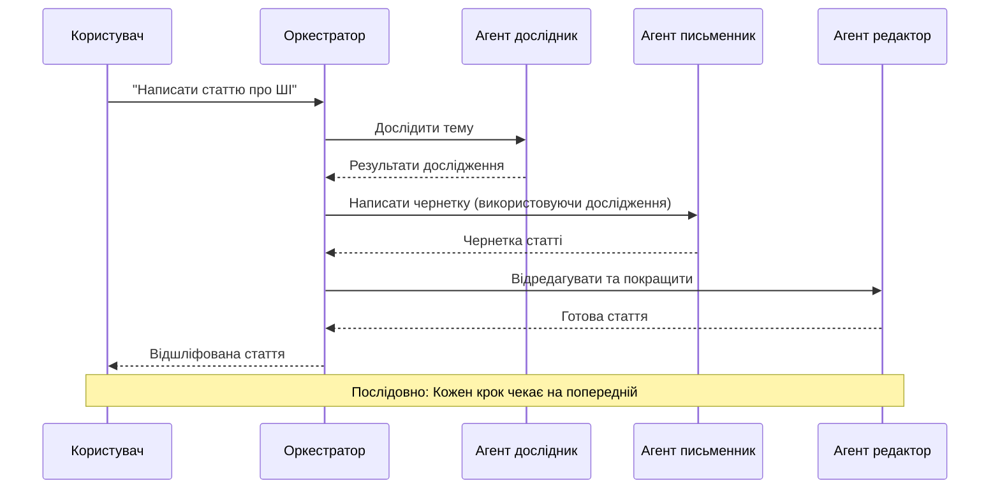
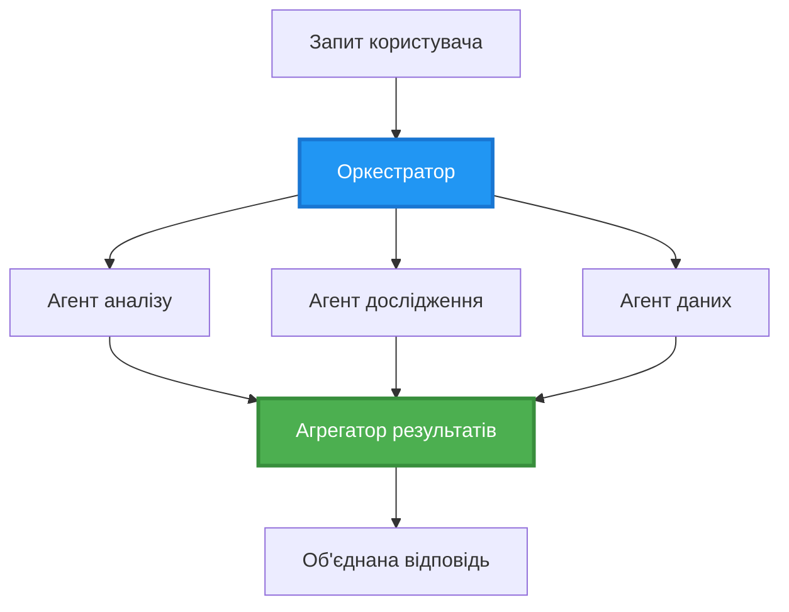
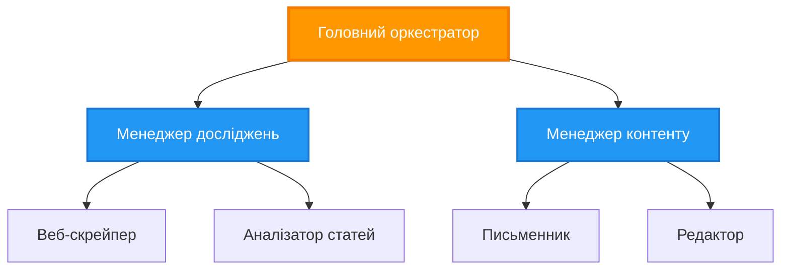
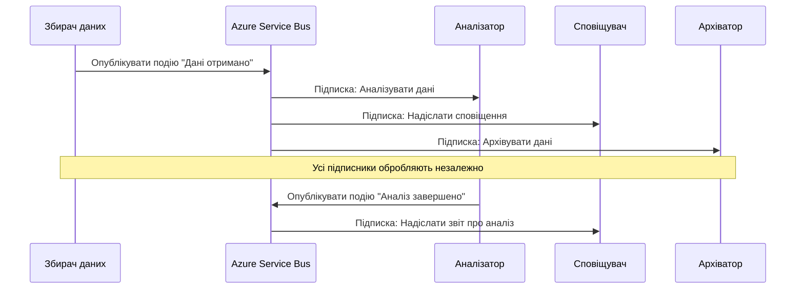
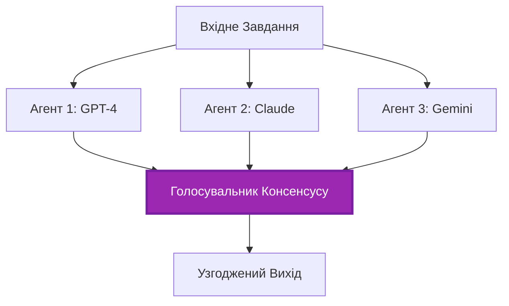
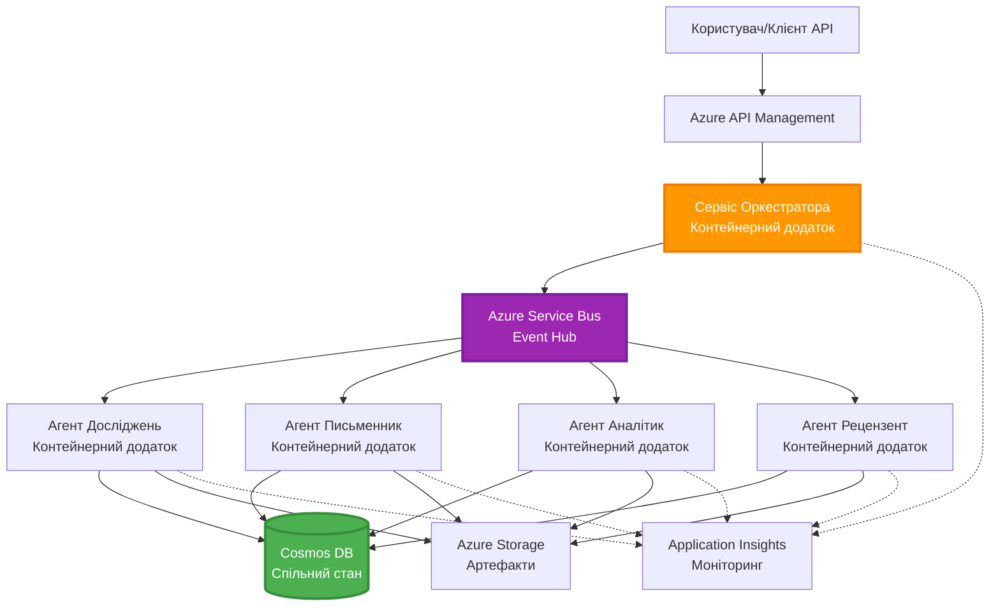

<!--
CO_OP_TRANSLATOR_METADATA:
{
  "original_hash": "bcefbd5d0107691ef3e6e33ba694d6f4",
  "translation_date": "2025-11-23T23:49:26+00:00",
  "source_file": "docs/pre-deployment/coordination-patterns.md",
  "language_code": "uk"
}
-->
# Шаблони координації багатозадачних агентів

⏱️ **Орієнтовний час**: 60-75 хвилин | 💰 **Орієнтовна вартість**: ~$100-300/місяць | ⭐ **Складність**: Висока

**📚 Навчальний шлях:**
- ← Попереднє: [Планування потужностей](capacity-planning.md) - Стратегії розміру ресурсів і масштабування
- 🎯 **Ви тут**: Шаблони координації багатозадачних агентів (Оркестрація, комунікація, управління станом)
- → Далі: [Вибір SKU](sku-selection.md) - Вибір правильних сервісів Azure
- 🏠 [Головна сторінка курсу](../../README.md)

---

## Що ви дізнаєтесь

Пройшовши цей урок, ви:
- Зрозумієте **архітектурні шаблони багатозадачних агентів** і коли їх використовувати
- Реалізуєте **шаблони оркестрації** (централізовані, децентралізовані, ієрархічні)
- Розробите стратегії **комунікації агентів** (синхронна, асинхронна, подійно-орієнтована)
- Навчитеся керувати **спільним станом** між розподіленими агентами
- Розгорнете **системи багатозадачних агентів** на Azure з AZD
- Застосуєте **шаблони координації** для реальних сценаріїв штучного інтелекту
- Навчитеся моніторити та налагоджувати розподілені системи агентів

## Чому координація багатозадачних агентів важлива

### Еволюція: Від одного агента до багатозадачних агентів

**Один агент (Простий):**
```
User → Agent → Response
```
- ✅ Легко зрозуміти та реалізувати
- ✅ Швидко для простих завдань
- ❌ Обмежений можливостями однієї моделі
- ❌ Не може паралельно виконувати складні завдання
- ❌ Відсутність спеціалізації

**Система багатозадачних агентів (Складна):**
```
           ┌─────────────┐
           │ Orchestrator│
           └──────┬──────┘
        ┌─────────┼─────────┐
        │         │         │
    ┌───▼──┐  ┌──▼───┐  ┌──▼────┐
    │Agent1│  │Agent2│  │Agent3 │
    │(Plan)│  │(Code)│  │(Review)│
    └──────┘  └──────┘  └───────┘
```
- ✅ Спеціалізовані агенти для конкретних завдань
- ✅ Паралельне виконання для швидкості
- ✅ Модульність і зручність обслуговування
- ✅ Краще підходить для складних робочих процесів
- ⚠️ Потребує логіки координації

**Аналогія**: Один агент — це як одна людина, яка виконує всі завдання. Багатозадачний агент — це як команда, де кожен член має спеціалізовані навички (дослідник, програміст, редактор, письменник), які працюють разом.

---

## Основні шаблони координації

### Шаблон 1: Послідовна координація (Ланцюг відповідальності)

**Коли використовувати**: Завдання повинні виконуватися в певному порядку, кожен агент працює на основі результатів попереднього.


**Переваги:**
- ✅ Чіткий потік даних
- ✅ Легко налагоджувати
- ✅ Передбачуваний порядок виконання

**Обмеження:**
- ❌ Повільніше (немає паралельності)
- ❌ Одна помилка блокує весь ланцюг
- ❌ Не підходить для взаємозалежних завдань

**Приклади використання:**
- Процес створення контенту (дослідження → написання → редагування → публікація)
- Генерація коду (планування → реалізація → тестування → розгортання)
- Генерація звітів (збір даних → аналіз → візуалізація → підсумок)

---

### Шаблон 2: Паралельна координація (Fan-Out/Fan-In)

**Коли використовувати**: Незалежні завдання можуть виконуватися одночасно, результати об'єднуються в кінці.


**Переваги:**
- ✅ Швидко (паралельне виконання)
- ✅ Стійкість до збоїв (прийнятні часткові результати)
- ✅ Горизонтальне масштабування

**Обмеження:**
- ⚠️ Результати можуть надходити в довільному порядку
- ⚠️ Потрібна логіка агрегації
- ⚠️ Складне управління станом

**Приклади використання:**
- Збір даних з різних джерел (API + бази даних + веб-скрапінг)
- Конкурентний аналіз (кілька моделей генерують рішення, вибирається найкраще)
- Послуги перекладу (одночасний переклад на кілька мов)

---

### Шаблон 3: Ієрархічна координація (Менеджер-Виконавець)

**Коли використовувати**: Складні робочі процеси з підзавданнями, потрібна делегація.


**Переваги:**
- ✅ Підтримка складних робочих процесів
- ✅ Модульність і зручність обслуговування
- ✅ Чіткий розподіл відповідальності

**Обмеження:**
- ⚠️ Складніша архітектура
- ⚠️ Вища затримка (кілька рівнів координації)
- ⚠️ Потребує складної оркестрації

**Приклади використання:**
- Обробка документів у великих компаніях (класифікація → маршрутизація → обробка → архівування)
- Багатоступеневі конвеєри даних (збір → очищення → трансформація → аналіз → звіт)
- Складні автоматизаційні процеси (планування → розподіл ресурсів → виконання → моніторинг)

---

### Шаблон 4: Подійно-орієнтована координація (Publish-Subscribe)

**Коли використовувати**: Агенти повинні реагувати на події, бажана слабка зв'язаність.


**Переваги:**
- ✅ Слабка зв'язаність між агентами
- ✅ Легко додавати нових агентів (просто підписатися)
- ✅ Асинхронна обробка
- ✅ Стійкість (збереження повідомлень)

**Обмеження:**
- ⚠️ Консистентність з затримкою
- ⚠️ Складне налагодження
- ⚠️ Проблеми з порядком повідомлень

**Приклади використання:**
- Системи моніторингу в реальному часі (сповіщення, панелі управління, логи)
- Багатоканальні сповіщення (електронна пошта, SMS, push, Slack)
- Конвеєри обробки даних (декілька споживачів одних і тих самих даних)

---

### Шаблон 5: Координація на основі консенсусу (Голосування/Кворум)

**Коли використовувати**: Потрібна згода кількох агентів перед продовженням.


**Переваги:**
- ✅ Вища точність (кілька думок)
- ✅ Стійкість до збоїв (прийнятні незначні збої)
- ✅ Вбудований контроль якості

**Обмеження:**
- ❌ Дорого (кілька викликів моделей)
- ❌ Повільніше (очікування всіх агентів)
- ⚠️ Потрібне вирішення конфліктів

**Приклади використання:**
- Модерація контенту (кілька моделей перевіряють контент)
- Рецензування коду (кілька аналізаторів/лінтерів)
- Медична діагностика (кілька моделей ШІ, валідація експертами)

---

## Огляд архітектури

### Повна система багатозадачних агентів на Azure


**Ключові компоненти:**

| Компонент | Призначення | Сервіс Azure |
|-----------|-------------|--------------|
| **API Gateway** | Точка входу, обмеження швидкості, автентифікація | API Management |
| **Оркестратор** | Координує робочі процеси агентів | Container Apps |
| **Черга повідомлень** | Асинхронна комунікація | Service Bus / Event Hubs |
| **Агенти** | Спеціалізовані AI-агенти | Container Apps / Functions |
| **Сховище стану** | Спільний стан, відстеження завдань | Cosmos DB |
| **Сховище артефактів** | Документи, результати, логи | Blob Storage |
| **Моніторинг** | Розподілене трасування, логи | Application Insights |

---

## Попередні вимоги

### Необхідні інструменти

```bash
# Перевірте Azure Developer CLI
azd version
# ✅ Очікувано: azd версія 1.0.0 або вище

# Перевірте Azure CLI
az --version
# ✅ Очікувано: azure-cli 2.50.0 або вище

# Перевірте Docker (для локального тестування)
docker --version
# ✅ Очікувано: Docker версія 20.10 або вище
```

### Вимоги до Azure

- Активна підписка Azure
- Дозволи на створення:
  - Container Apps
  - Простори імен Service Bus
  - Облікові записи Cosmos DB
  - Облікові записи сховища
  - Application Insights

### Необхідні знання

Ви повинні завершити:
- [Управління конфігурацією](../getting-started/configuration.md)
- [Автентифікація та безпека](../getting-started/authsecurity.md)
- [Приклад мікросервісів](../../../../examples/microservices)

---

## Посібник з реалізації

### Структура проєкту

```
multi-agent-system/
├── azure.yaml                    # AZD configuration
├── infra/
│   ├── main.bicep               # Main infrastructure
│   ├── core/
│   │   ├── servicebus.bicep     # Message queue
│   │   ├── cosmos.bicep         # State store
│   │   ├── storage.bicep        # Artifact storage
│   │   └── monitoring.bicep     # Application Insights
│   └── app/
│       ├── orchestrator.bicep   # Orchestrator service
│       └── agent.bicep          # Agent template
└── src/
    ├── orchestrator/            # Orchestration logic
    │   ├── app.py
    │   ├── workflows.py
    │   └── Dockerfile
    ├── agents/
    │   ├── research/            # Research agent
    │   ├── writer/              # Writer agent
    │   ├── analyst/             # Analyst agent
    │   └── reviewer/            # Reviewer agent
    └── shared/
        ├── state_manager.py     # Shared state logic
        └── message_handler.py   # Message handling
```

---

## Урок 1: Шаблон послідовної координації

### Реалізація: Конвеєр створення контенту

Давайте створимо послідовний конвеєр: Дослідження → Написання → Редагування → Публікація

### 1. Конфігурація AZD

**Файл: `azure.yaml`**

```yaml
name: content-pipeline
metadata:
  template: multi-agent-sequential@1.0.0

services:
  orchestrator:
    project: ./src/orchestrator
    language: python
    host: containerapp
  
  research-agent:
    project: ./src/agents/research
    language: python
    host: containerapp
  
  writer-agent:
    project: ./src/agents/writer
    language: python
    host: containerapp
  
  editor-agent:
    project: ./src/agents/editor
    language: python
    host: containerapp
```

### 2. Інфраструктура: Service Bus для координації

**Файл: `infra/core/servicebus.bicep`**

```bicep
param name string
param location string
param tags object = {}

resource serviceBusNamespace 'Microsoft.ServiceBus/namespaces@2022-10-01-preview' = {
  name: name
  location: location
  tags: tags
  sku: {
    name: 'Standard'
    tier: 'Standard'
  }
  properties: {
    minimumTlsVersion: '1.2'
  }
}

// Queue for orchestrator → research agent
resource researchQueue 'Microsoft.ServiceBus/namespaces/queues@2022-10-01-preview' = {
  parent: serviceBusNamespace
  name: 'research-tasks'
  properties: {
    maxDeliveryCount: 3
    lockDuration: 'PT5M'
    deadLetteringOnMessageExpiration: true
  }
}

// Queue for research agent → writer agent
resource writerQueue 'Microsoft.ServiceBus/namespaces/queues@2022-10-01-preview' = {
  parent: serviceBusNamespace
  name: 'writer-tasks'
  properties: {
    maxDeliveryCount: 3
    lockDuration: 'PT5M'
  }
}

// Queue for writer agent → editor agent
resource editorQueue 'Microsoft.ServiceBus/namespaces/queues@2022-10-01-preview' = {
  parent: serviceBusNamespace
  name: 'editor-tasks'
  properties: {
    maxDeliveryCount: 3
    lockDuration: 'PT5M'
  }
}

output namespace string = serviceBusNamespace.name
output connectionString string = listKeys('${serviceBusNamespace.id}/AuthorizationRules/RootManageSharedAccessKey', serviceBusNamespace.apiVersion).primaryConnectionString
```

### 3. Менеджер спільного стану

**Файл: `src/shared/state_manager.py`**

```python
from azure.cosmos import CosmosClient, PartitionKey
from datetime import datetime
import os

class StateManager:
    """Manages shared state across agents using Cosmos DB"""
    
    def __init__(self):
        endpoint = os.environ['COSMOS_ENDPOINT']
        key = os.environ['COSMOS_KEY']
        
        self.client = CosmosClient(endpoint, key)
        self.database = self.client.get_database_client('agent-state')
        self.container = self.database.get_container_client('tasks')
    
    def create_task(self, task_id: str, task_type: str, input_data: dict):
        """Create a new task"""
        task = {
            'id': task_id,
            'type': task_type,
            'status': 'pending',
            'input': input_data,
            'created_at': datetime.utcnow().isoformat(),
            'steps': []
        }
        self.container.create_item(task)
        return task
    
    def update_task_step(self, task_id: str, step_name: str, result: dict):
        """Update task with completed step"""
        task = self.container.read_item(task_id, partition_key=task_id)
        
        task['steps'].append({
            'name': step_name,
            'completed_at': datetime.utcnow().isoformat(),
            'result': result
        })
        
        self.container.replace_item(task_id, task)
        return task
    
    def complete_task(self, task_id: str, final_result: dict):
        """Mark task as complete"""
        task = self.container.read_item(task_id, partition_key=task_id)
        task['status'] = 'completed'
        task['result'] = final_result
        task['completed_at'] = datetime.utcnow().isoformat()
        self.container.replace_item(task_id, task)
        return task
    
    def get_task(self, task_id: str):
        """Retrieve task state"""
        return self.container.read_item(task_id, partition_key=task_id)
```

### 4. Сервіс оркестратора

**Файл: `src/orchestrator/app.py`**

```python
from flask import Flask, request, jsonify
from azure.servicebus import ServiceBusClient, ServiceBusMessage
import json
import uuid
import os
from shared.state_manager import StateManager

app = Flask(__name__)
state_manager = StateManager()

# Підключення до Service Bus
servicebus_connection_str = os.environ['SERVICEBUS_CONNECTION_STRING']
servicebus_client = ServiceBusClient.from_connection_string(servicebus_connection_str)

@app.route('/health', methods=['GET'])
def health():
    return jsonify({'status': 'healthy', 'service': 'orchestrator'})

@app.route('/create-content', methods=['POST'])
def create_content():
    """
    Sequential workflow: Research → Write → Edit → Publish
    """
    data = request.json
    topic = data.get('topic')
    
    if not topic:
        return jsonify({'error': 'Topic required'}), 400
    
    # Створити завдання в сховищі стану
    task_id = str(uuid.uuid4())
    task = state_manager.create_task(
        task_id=task_id,
        task_type='content_creation',
        input_data={'topic': topic}
    )
    
    # Надіслати повідомлення дослідницькому агенту (перший крок)
    sender = servicebus_client.get_queue_sender('research-tasks')
    message = ServiceBusMessage(
        body=json.dumps({
            'task_id': task_id,
            'topic': topic,
            'next_queue': 'writer-tasks'  # Куди надсилати результати
        }),
        content_type='application/json'
    )
    
    with sender:
        sender.send_messages(message)
    
    return jsonify({
        'task_id': task_id,
        'status': 'started',
        'workflow': 'sequential',
        'steps': ['research', 'write', 'edit', 'publish'],
        'message': 'Content creation pipeline initiated'
    }), 202

@app.route('/task/<task_id>', methods=['GET'])
def get_task_status(task_id):
    """Check task status"""
    try:
        task = state_manager.get_task(task_id)
        return jsonify(task)
    except Exception as e:
        return jsonify({'error': str(e)}), 404

if __name__ == '__main__':
    app.run(host='0.0.0.0', port=8080)
```

### 5. Агент дослідження

**Файл: `src/agents/research/app.py`**

```python
from azure.servicebus import ServiceBusClient, ServiceBusMessage
from openai import AzureOpenAI
import json
import os
import time
from shared.state_manager import StateManager

# Ініціалізувати клієнтів
state_manager = StateManager()
servicebus_client = ServiceBusClient.from_connection_string(
    os.environ['SERVICEBUS_CONNECTION_STRING']
)

openai_client = AzureOpenAI(
    api_key=os.environ['AZURE_OPENAI_API_KEY'],
    api_version="2024-02-01",
    azure_endpoint=os.environ['AZURE_OPENAI_ENDPOINT']
)

def process_research_task(message_data):
    """Process research request and pass to writer"""
    task_id = message_data['task_id']
    topic = message_data['topic']
    next_queue = message_data['next_queue']
    
    print(f"🔬 Researching: {topic}")
    
    # Викликати Azure OpenAI для дослідження
    response = openai_client.chat.completions.create(
        model="gpt-4",
        messages=[
            {"role": "system", "content": "You are a research assistant. Provide comprehensive research on the given topic."},
            {"role": "user", "content": f"Research this topic thoroughly: {topic}"}
        ],
        max_tokens=1500
    )
    
    research_results = response.choices[0].message.content
    
    # Оновити стан
    state_manager.update_task_step(
        task_id=task_id,
        step_name='research',
        result={'research': research_results}
    )
    
    # Надіслати наступному агенту (письменнику)
    sender = servicebus_client.get_queue_sender(next_queue)
    message = ServiceBusMessage(
        body=json.dumps({
            'task_id': task_id,
            'topic': topic,
            'research': research_results,
            'next_queue': 'editor-tasks'
        }),
        content_type='application/json'
    )
    
    with sender:
        sender.send_messages(message)
    
    print(f"✅ Research complete for task {task_id}")

def main():
    """Listen to research queue"""
    receiver = servicebus_client.get_queue_receiver('research-tasks')
    
    print("🔬 Research Agent started, listening for tasks...")
    
    with receiver:
        while True:
            messages = receiver.receive_messages(max_wait_time=5)
            for message in messages:
                try:
                    message_data = json.loads(str(message))
                    process_research_task(message_data)
                    receiver.complete_message(message)
                except Exception as e:
                    print(f"❌ Error processing message: {e}")
                    receiver.abandon_message(message)

if __name__ == '__main__':
    main()
```

### 6. Агент написання

**Файл: `src/agents/writer/app.py`**

```python
from azure.servicebus import ServiceBusClient, ServiceBusMessage
from openai import AzureOpenAI
import json
import os
from shared.state_manager import StateManager

state_manager = StateManager()
servicebus_client = ServiceBusClient.from_connection_string(
    os.environ['SERVICEBUS_CONNECTION_STRING']
)

openai_client = AzureOpenAI(
    api_key=os.environ['AZURE_OPENAI_API_KEY'],
    api_version="2024-02-01",
    azure_endpoint=os.environ['AZURE_OPENAI_ENDPOINT']
)

def process_writing_task(message_data):
    """Write article based on research"""
    task_id = message_data['task_id']
    topic = message_data['topic']
    research = message_data['research']
    next_queue = message_data['next_queue']
    
    print(f"✍️ Writing article: {topic}")
    
    # Викликати Azure OpenAI для написання статті
    response = openai_client.chat.completions.create(
        model="gpt-4",
        messages=[
            {"role": "system", "content": "You are a professional writer. Write engaging, well-structured articles."},
            {"role": "user", "content": f"Based on this research:\n\n{research}\n\nWrite a comprehensive article about: {topic}"}
        ],
        max_tokens=2000
    )
    
    article_draft = response.choices[0].message.content
    
    # Оновити стан
    state_manager.update_task_step(
        task_id=task_id,
        step_name='writing',
        result={'draft': article_draft}
    )
    
    # Надіслати редактору
    sender = servicebus_client.get_queue_sender(next_queue)
    message = ServiceBusMessage(
        body=json.dumps({
            'task_id': task_id,
            'topic': topic,
            'draft': article_draft
        }),
        content_type='application/json'
    )
    
    with sender:
        sender.send_messages(message)
    
    print(f"✅ Article draft complete for task {task_id}")

def main():
    """Listen to writer queue"""
    receiver = servicebus_client.get_queue_receiver('writer-tasks')
    
    print("✍️ Writer Agent started, listening for tasks...")
    
    with receiver:
        while True:
            messages = receiver.receive_messages(max_wait_time=5)
            for message in messages:
                try:
                    message_data = json.loads(str(message))
                    process_writing_task(message_data)
                    receiver.complete_message(message)
                except Exception as e:
                    print(f"❌ Error: {e}")
                    receiver.abandon_message(message)

if __name__ == '__main__':
    main()
```

### 7. Агент редагування

**Файл: `src/agents/editor/app.py`**

```python
from azure.servicebus import ServiceBusClient
from openai import AzureOpenAI
import json
import os
from shared.state_manager import StateManager

state_manager = StateManager()
servicebus_client = ServiceBusClient.from_connection_string(
    os.environ['SERVICEBUS_CONNECTION_STRING']
)

openai_client = AzureOpenAI(
    api_key=os.environ['AZURE_OPENAI_API_KEY'],
    api_version="2024-02-01",
    azure_endpoint=os.environ['AZURE_OPENAI_ENDPOINT']
)

def process_editing_task(message_data):
    """Edit and finalize article"""
    task_id = message_data['task_id']
    topic = message_data['topic']
    draft = message_data['draft']
    
    print(f"📝 Editing article: {topic}")
    
    # Викликати Azure OpenAI для редагування
    response = openai_client.chat.completions.create(
        model="gpt-4",
        messages=[
            {"role": "system", "content": "You are an expert editor. Improve grammar, clarity, and structure."},
            {"role": "user", "content": f"Edit and improve this article:\n\n{draft}"}
        ],
        max_tokens=2000
    )
    
    final_article = response.choices[0].message.content
    
    # Позначити завдання як виконане
    state_manager.complete_task(
        task_id=task_id,
        final_result={
            'topic': topic,
            'final_article': final_article,
            'word_count': len(final_article.split())
        }
    )
    
    print(f"✅ Article finalized for task {task_id}")

def main():
    """Listen to editor queue"""
    receiver = servicebus_client.get_queue_receiver('editor-tasks')
    
    print("📝 Editor Agent started, listening for tasks...")
    
    with receiver:
        while True:
            messages = receiver.receive_messages(max_wait_time=5)
            for message in messages:
                try:
                    message_data = json.loads(str(message))
                    process_editing_task(message_data)
                    receiver.complete_message(message)
                except Exception as e:
                    print(f"❌ Error: {e}")
                    receiver.abandon_message(message)

if __name__ == '__main__':
    main()
```

### 8. Розгортання та тестування

```bash
# Ініціалізувати та розгорнути
azd init
azd up

# Отримати URL оркестратора
ORCHESTRATOR_URL=$(azd env get-values | grep ORCHESTRATOR_URL | cut -d '=' -f2 | tr -d '"')

# Створити контент
curl -X POST $ORCHESTRATOR_URL/create-content \
  -H "Content-Type: application/json" \
  -d '{"topic": "The Future of AI in Healthcare"}'
```

**✅ Очікуваний результат:**
```json
{
  "task_id": "a1b2c3d4-e5f6-7890-abcd-ef1234567890",
  "status": "started",
  "workflow": "sequential",
  "steps": ["research", "write", "edit", "publish"],
  "message": "Content creation pipeline initiated"
}
```

**Перевірка прогресу завдання:**
```bash
TASK_ID="a1b2c3d4-e5f6-7890-abcd-ef1234567890"
curl $ORCHESTRATOR_URL/task/$TASK_ID
```

**✅ Очікуваний результат (завершено):**
```json
{
  "id": "a1b2c3d4-e5f6-7890-abcd-ef1234567890",
  "type": "content_creation",
  "status": "completed",
  "steps": [
    {
      "name": "research",
      "completed_at": "2025-11-19T10:30:00Z",
      "result": {"research": "..."}
    },
    {
      "name": "writing",
      "completed_at": "2025-11-19T10:32:00Z",
      "result": {"draft": "..."}
    }
  ],
  "result": {
    "topic": "The Future of AI in Healthcare",
    "final_article": "...",
    "word_count": 1500
  }
}
```

---

## Урок 2: Шаблон паралельної координації

### Реалізація: Агрегатор багатоджерельного дослідження

Давайте створимо паралельну систему, яка одночасно збирає інформацію з кількох джерел.

### Паралельний оркестратор

**Файл: `src/orchestrator/parallel_workflow.py`**

```python
from flask import Flask, request, jsonify
from azure.servicebus import ServiceBusClient, ServiceBusMessage
import json
import uuid
import os
from shared.state_manager import StateManager

app = Flask(__name__)
state_manager = StateManager()

servicebus_client = ServiceBusClient.from_connection_string(
    os.environ['SERVICEBUS_CONNECTION_STRING']
)

@app.route('/research-parallel', methods=['POST'])
def research_parallel():
    """
    Parallel workflow: Multiple agents work simultaneously
    """
    data = request.json
    query = data.get('query')
    
    task_id = str(uuid.uuid4())
    task = state_manager.create_task(
        task_id=task_id,
        task_type='parallel_research',
        input_data={
            'query': query,
            'agents': ['web', 'academic', 'news', 'social']
        }
    )
    
    # Розподіл: Надіслати всім агентам одночасно
    agents = [
        ('web-research-queue', 'web'),
        ('academic-research-queue', 'academic'),
        ('news-research-queue', 'news'),
        ('social-research-queue', 'social')
    ]
    
    for queue_name, agent_type in agents:
        sender = servicebus_client.get_queue_sender(queue_name)
        message = ServiceBusMessage(
            body=json.dumps({
                'task_id': task_id,
                'query': query,
                'agent_type': agent_type,
                'result_queue': 'aggregation-queue'
            }),
            content_type='application/json'
        )
        
        with sender:
            sender.send_messages(message)
    
    return jsonify({
        'task_id': task_id,
        'status': 'started',
        'workflow': 'parallel',
        'agents_dispatched': 4,
        'message': 'Parallel research initiated'
    }), 202

if __name__ == '__main__':
    app.run(host='0.0.0.0', port=8080)
```

### Логіка агрегації

**Файл: `src/agents/aggregator/app.py`**

```python
from azure.servicebus import ServiceBusClient
import json
import os
from collections import defaultdict
from shared.state_manager import StateManager

state_manager = StateManager()
servicebus_client = ServiceBusClient.from_connection_string(
    os.environ['SERVICEBUS_CONNECTION_STRING']
)

# Відстежувати результати для кожного завдання
task_results = defaultdict(list)
expected_agents = 4  # веб, академічні, новини, соціальні

def process_result(message_data):
    """Aggregate results from parallel agents"""
    task_id = message_data['task_id']
    agent_type = message_data['agent_type']
    result = message_data['result']
    
    # Зберегти результат
    task_results[task_id].append({
        'agent': agent_type,
        'data': result
    })
    
    print(f"📊 Received result from {agent_type} agent ({len(task_results[task_id])}/{expected_agents})")
    
    # Перевірити, чи всі агенти завершили (fan-in)
    if len(task_results[task_id]) == expected_agents:
        print(f"✅ All agents completed for task {task_id}. Aggregating...")
        
        # Об'єднати результати
        aggregated = {
            'query': message_data['query'],
            'sources': task_results[task_id],
            'summary': generate_summary(task_results[task_id])
        }
        
        # Позначити як завершене
        state_manager.complete_task(task_id, aggregated)
        
        # Очистити
        del task_results[task_id]
        
        print(f"✅ Aggregation complete for task {task_id}")

def generate_summary(results):
    """Generate summary from all sources"""
    summaries = [r['data'].get('summary', '') for r in results]
    return '\n\n'.join(summaries)

def main():
    """Listen to aggregation queue"""
    receiver = servicebus_client.get_queue_receiver('aggregation-queue')
    
    print("📊 Aggregator started, listening for results...")
    
    with receiver:
        while True:
            messages = receiver.receive_messages(max_wait_time=5)
            for message in messages:
                try:
                    message_data = json.loads(str(message))
                    process_result(message_data)
                    receiver.complete_message(message)
                except Exception as e:
                    print(f"❌ Error: {e}")
                    receiver.abandon_message(message)

if __name__ == '__main__':
    main()
```

**Переваги паралельного шаблону:**
- ⚡ **4 рази швидше** (агенти працюють одночасно)
- 🔄 **Стійкість до збоїв** (прийнятні часткові результати)
- 📈 **Масштабованість** (легко додати більше агентів)

---

## Практичні вправи

### Вправа 1: Додати обробку тайм-аутів ⭐⭐ (Середній рівень)

**Мета**: Реалізувати логіку тайм-ауту, щоб агрегатор не чекав нескінченно на повільних агентів.

**Кроки**:

1. **Додати відстеження тайм-ауту до агрегатора:**

```python
from datetime import datetime, timedelta

task_timeouts = {}  # task_id -> час завершення

def process_result(message_data):
    task_id = message_data['task_id']
    
    # Встановити тайм-аут на перший результат
    if task_id not in task_timeouts:
        task_timeouts[task_id] = datetime.utcnow() + timedelta(seconds=30)
    
    task_results[task_id].append({
        'agent': message_data['agent_type'],
        'data': message_data['result']
    })
    
    # Перевірити, чи завершено АБО чи сплив час
    if len(task_results[task_id]) == expected_agents or \
       datetime.utcnow() > task_timeouts[task_id]:
        
        print(f"📊 Aggregating with {len(task_results[task_id])}/{expected_agents} results")
        
        aggregated = {
            'query': message_data['query'],
            'sources': task_results[task_id],
            'completed_agents': len(task_results[task_id]),
            'timed_out': len(task_results[task_id]) < expected_agents
        }
        
        state_manager.complete_task(task_id, aggregated)
        
        # Прибирання
        del task_results[task_id]
        del task_timeouts[task_id]
```

2. **Протестувати з штучними затримками:**

```python
# В одному агенті додати затримку для імітації повільної обробки
import time
time.sleep(35)  # Перевищує тайм-аут у 30 секунд
```

3. **Розгорнути та перевірити:**

```bash
azd deploy aggregator

# Надіслати завдання
curl -X POST $ORCHESTRATOR_URL/research-parallel \
  -H "Content-Type: application/json" \
  -d '{"query": "AI safety research"}'

# Перевірте результати через 30 секунд
curl $ORCHESTRATOR_URL/task/$TASK_ID
```

**✅ Критерії успіху:**
- ✅ Завдання завершується через 30 секунд, навіть якщо агенти не завершили роботу
- ✅ Відповідь вказує на часткові результати (`"timed_out": true`)
- ✅ Повертаються доступні результати (3 з 4 агентів)

**Час**: 20-25 хвилин

---

### Вправа 2: Реалізувати логіку повторних спроб ⭐⭐⭐ (Високий рівень)

**Мета**: Автоматично повторювати завдання агентів, які зазнали невдачі, перед тим як відмовитися.

**Кроки**:

1. **Додати відстеження повторних спроб до оркестратора:**

```python
from dataclasses import dataclass
from typing import Dict

@dataclass
class RetryConfig:
    max_retries: int = 3
    backoff_seconds: int = 5

retry_counts: Dict[str, int] = {}  # message_id -> кількість_спроб

def send_with_retry(queue_name: str, message_data: dict, retry_config: RetryConfig):
    """Send message with retry metadata"""
    message_id = message_data.get('message_id', str(uuid.uuid4()))
    message_data['message_id'] = message_id
    message_data['retry_count'] = retry_counts.get(message_id, 0)
    message_data['max_retries'] = retry_config.max_retries
    
    sender = servicebus_client.get_queue_sender(queue_name)
    message = ServiceBusMessage(
        body=json.dumps(message_data),
        content_type='application/json',
        message_id=message_id
    )
    
    with sender:
        sender.send_messages(message)
```

2. **Додати обробник повторних спроб до агентів:**

```python
def process_with_retry(message, receiver, process_func):
    """Process message with automatic retry on failure"""
    try:
        message_data = json.loads(str(message))
        
        # Обробити повідомлення
        process_func(message_data)
        
        # Успіх - завершено
        receiver.complete_message(message)
        
    except Exception as e:
        message_id = message.message_id
        retry_count = message_data.get('retry_count', 0)
        max_retries = message_data.get('max_retries', 3)
        
        if retry_count < max_retries:
            # Повтор: відмовитися і поставити в чергу з збільшеним лічильником
            print(f"⚠️ Retry {retry_count + 1}/{max_retries} for message {message_id}")
            
            message_data['retry_count'] = retry_count + 1
            
            # Відправити назад до тієї ж черги з затримкою
            time.sleep(5 * (retry_count + 1))  # Експоненціальне зменшення
            send_with_retry(queue_name, message_data, RetryConfig())
            
            receiver.complete_message(message)  # Видалити оригінал
        else:
            # Перевищено максимальну кількість повторів - перемістити до черги мертвих листів
            print(f"❌ Max retries exceeded for message {message_id}")
            receiver.dead_letter_message(
                message,
                reason="MaxRetriesExceeded",
                error_description=str(e)
            )
```

3. **Моніторити чергу відхилених повідомлень:**

```python
def monitor_dead_letters():
    """Check dead letter queue for failed messages"""
    receiver = servicebus_client.get_queue_receiver(
        'research-queue',
        sub_queue='deadletter'
    )
    
    with receiver:
        messages = receiver.receive_messages(max_wait_time=5)
        for message in messages:
            print(f"☠️ Dead letter: {message.message_id}")
            print(f"Reason: {message.dead_letter_reason}")
            print(f"Description: {message.dead_letter_error_description}")
```

**✅ Критерії успіху:**
- ✅ Невдалі завдання автоматично повторюються (до 3 разів)
- ✅ Експоненційна затримка між спробами (5с, 10с, 15с)
- ✅ Після максимальної кількості спроб повідомлення потрапляють у чергу відхилених
- ✅ Черга відхилених може бути моніторена та відтворена

**Час**: 30-40 хвилин

---

### Вправа 3: Реалізувати механізм "запобіжника" ⭐⭐⭐ (Високий рівень)

**Мета**: Запобігти каскадним збоям, зупинивши запити до несправних агентів.

**Кроки**:

1. **Створити клас запобіжника:**

```python
from enum import Enum
from datetime import datetime, timedelta

class CircuitState(Enum):
    CLOSED = "closed"      # Нормальна робота
    OPEN = "open"          # Збій, відхилити запити
    HALF_OPEN = "half_open"  # Перевірка, чи відновлено

class CircuitBreaker:
    def __init__(self, failure_threshold=5, timeout_seconds=60):
        self.failure_threshold = failure_threshold
        self.timeout_seconds = timeout_seconds
        self.failure_count = 0
        self.last_failure_time = None
        self.state = CircuitState.CLOSED
    
    def call(self, func):
        """Execute function with circuit breaker protection"""
        if self.state == CircuitState.OPEN:
            # Перевірити, чи закінчився тайм-аут
            if datetime.utcnow() - self.last_failure_time > timedelta(seconds=self.timeout_seconds):
                self.state = CircuitState.HALF_OPEN
                print("🔄 Circuit breaker: HALF_OPEN (testing)")
            else:
                raise Exception(f"Circuit breaker OPEN for agent. Try again in {self.timeout_seconds}s")
        
        try:
            result = func()
            
            # Успіх
            if self.state == CircuitState.HALF_OPEN:
                self.state = CircuitState.CLOSED
                self.failure_count = 0
                print("✅ Circuit breaker: CLOSED (recovered)")
            
            return result
            
        except Exception as e:
            self.failure_count += 1
            self.last_failure_time = datetime.utcnow()
            
            if self.failure_count >= self.failure_threshold:
                self.state = CircuitState.OPEN
                print(f"🔴 Circuit breaker: OPEN (too many failures)")
            
            raise e
```

2. **Застосувати до викликів агентів:**

```python
# У оркестраторі
agent_circuits = {
    'web': CircuitBreaker(failure_threshold=5, timeout_seconds=60),
    'academic': CircuitBreaker(failure_threshold=5, timeout_seconds=60),
    'news': CircuitBreaker(failure_threshold=5, timeout_seconds=60),
    'social': CircuitBreaker(failure_threshold=5, timeout_seconds=60)
}

def send_to_agent(agent_type, message_data):
    """Send with circuit breaker protection"""
    circuit = agent_circuits[agent_type]
    
    try:
        circuit.call(lambda: send_message(agent_type, message_data))
    except Exception as e:
        print(f"⚠️ Skipping {agent_type} agent: {e}")
        # Продовжуйте з іншими агентами
```

3. **Протестувати запобіжник:**

```bash
# Симулювати повторні збої (зупинити одного агента)
az containerapp stop --name web-research-agent --resource-group rg-agents

# Надіслати кілька запитів
for i in {1..10}; do
  curl -X POST $ORCHESTRATOR_URL/research-parallel \
    -H "Content-Type: application/json" \
    -d '{"query": "test query '$i'"}'
  sleep 2
done

# Перевірити журнали - має бути видно, що схема відкривається після 5 збоїв
azd logs orchestrator --tail 50
```

**✅ Критерії успіху:**
- ✅ Після 5 збоїв запобіжник відкривається (відхиляє запити)
- ✅ Через 60 секунд запобіжник переходить у напіввідкритий стан (тестує відновлення)
- ✅ Інші агенти продовжують працювати нормально
- ✅ Запобіжник автоматично закривається, коли агент відновлюється

**Час**: 40-50 хвилин

---

## Моніторинг та налагодження

### Розподілене трасування з Application Insights

**Файл: `src/shared/tracing.py`**

```python
from opencensus.ext.azure.log_exporter import AzureLogHandler
from opencensus.ext.azure.trace_exporter import AzureExporter
from opencensus.trace import config_integration
from opencensus.trace.tracer import Tracer
from opencensus.trace.samplers import AlwaysOnSampler
import logging
import os

# Налаштувати трасування
config_integration.trace_integrations(['requests', 'logging'])

connection_string = os.environ.get('APPLICATIONINSIGHTS_CONNECTION_STRING')

# Створити трасувальник
tracer = Tracer(
    exporter=AzureExporter(connection_string=connection_string),
    sampler=AlwaysOnSampler()
)

# Налаштувати журналювання
logger = logging.getLogger(__name__)
logger.addHandler(AzureLogHandler(connection_string=connection_string))
logger.setLevel(logging.INFO)

def trace_agent_call(agent_name, task_id, operation):
    """Trace agent operations"""
    with tracer.span(name=f'{agent_name}.{operation}') as span:
        span.add_attribute('agent', agent_name)
        span.add_attribute('task_id', task_id)
        span.add_attribute('operation', operation)
        
        try:
            result = operation()
            span.add_attribute('status', 'success')
            return result
        except Exception as e:
            span.add_attribute('status', 'error')
            span.add_attribute('error', str(e))
            raise
```

### Запити до Application Insights

**Відстеження робочих процесів багатозадачних агентів:**

```kusto
// Trace complete workflow for a task
traces
| where customDimensions.task_id == "a1b2c3d4-..."
| project timestamp, message, customDimensions.agent, customDimensions.operation
| order by timestamp asc
```

**Порівняння продуктивності агентів:**

```kusto
// Compare agent execution times
dependencies
| where name contains "agent"
| summarize 
    avg_duration = avg(duration),
    p95_duration = percentile(duration, 95),
    count = count()
  by agent = tostring(customDimensions.agent)
| order by avg_duration desc
```

**Аналіз збоїв:**

```kusto
// Find which agents fail most
exceptions
| where customDimensions.agent != ""
| summarize 
    failure_count = count(),
    unique_errors = dcount(outerMessage)
  by agent = tostring(customDimensions.agent)
| order by failure_count desc
```

---

## Аналіз витрат

### Витрати на систему багатозадачних агентів (Оцінка на місяць)

| Компонент | Конфігурація | Вартість |
|-----------|--------------|----------|
| **Оркестратор** | 1 Container App (1 vCPU, 2GB) | $30-50 |
| **4 Агенти** | 4 Container Apps (0.5 vCPU, 1GB кожен) | $60-120 |
| **Service Bus** | Стандартний рівень, 10M повідомлень | $10-20 |
| **Cosmos DB** | Безсерверний, 5GB сховища, 1M RUs | $25-50 |
| **Blob Storage** | 10GB сховища, 100K операцій | $5-10 |
| **Application Insights** | 5GB індексації | $10-15 |
| **Azure OpenAI** | GPT-4, 10M токенів | $100-300 |
| **Загалом** | | **$240-565/місяць** |

### Страт
## Посібник з усунення несправностей

### Проблема: Повідомлення застрягли в черзі

**Симптоми:**
- Повідомлення накопичуються в черзі
- Агенти не обробляють
- Статус завдання застряг на "очікується"

**Діагностика:**
```bash
# Перевірити глибину черги
az servicebus queue show \
  --namespace-name mybus \
  --name research-tasks \
  --query "countDetails"

# Перевірити стан агента
azd logs research-agent --tail 50
```

**Рішення:**

1. **Збільшити кількість реплік агентів:**
   ```bash
   az containerapp update \
     --name research-agent \
     --min-replicas 3 \
     --max-replicas 10
   ```

2. **Перевірити чергу мертвих листів:**
   ```bash
   az servicebus queue show \
     --namespace-name mybus \
     --name research-tasks \
     --query "countDetails.deadLetterMessageCount"
   ```

---

### Проблема: Тайм-аут завдання/ніколи не завершується

**Симптоми:**
- Статус завдання залишається "в процесі"
- Деякі агенти завершують, інші ні
- Відсутні повідомлення про помилки

**Діагностика:**
```bash
# Перевірте стан завдання
curl $ORCHESTRATOR_URL/task/$TASK_ID

# Перевірте Application Insights
# Виконайте запит: traces | where customDimensions.task_id == "..."
```

**Рішення:**

1. **Реалізувати тайм-аут в агрегаторі (Вправа 1)**

2. **Перевірити збої агентів:**
   ```bash
   azd logs --follow | grep "ERROR\|FAIL"
   ```

3. **Переконатися, що всі агенти працюють:**
   ```bash
   az containerapp list \
     --resource-group rg-agents \
     --query "[].{name:name, status:properties.runningStatus}"
   ```

---

## Дізнатися більше

### Офіційна документація
- [Azure Service Bus](https://learn.microsoft.com/azure/service-bus-messaging/service-bus-messaging-overview)
- [Cosmos DB](https://learn.microsoft.com/azure/cosmos-db/introduction)
- [Container Apps DAPR](https://learn.microsoft.com/azure/container-apps/dapr-overview)
- [Multi-Agent Design Patterns](https://learn.microsoft.com/azure/architecture/guide/ai/multi-agent-systems)

### Наступні кроки в цьому курсі
- ← Попереднє: [Планування потужностей](capacity-planning.md)
- → Наступне: [Вибір SKU](sku-selection.md)
- 🏠 [Головна сторінка курсу](../../README.md)

### Схожі приклади
- [Приклад мікросервісів](../../../../examples/microservices) - Шаблони комунікації сервісів
- [Приклад Azure OpenAI](../../../../examples/azure-openai-chat) - Інтеграція AI

---

## Підсумок

**Ви дізналися:**
- ✅ П'ять шаблонів координації (послідовний, паралельний, ієрархічний, подієвий, консенсус)
- ✅ Архітектуру мультиагентних систем на Azure (Service Bus, Cosmos DB, Container Apps)
- ✅ Управління станом у розподілених агентах
- ✅ Обробку тайм-аутів, повторних спроб і запобіжників
- ✅ Моніторинг і налагодження розподілених систем
- ✅ Стратегії оптимізації витрат

**Основні висновки:**
1. **Вибирайте правильний шаблон** - Послідовний для впорядкованих робочих процесів, паралельний для швидкості, подієвий для гнучкості
2. **Управляйте станом ретельно** - Використовуйте Cosmos DB або подібні для спільного стану
3. **Обробляйте збої грамотно** - Тайм-аут, повторні спроби, запобіжники, черги мертвих листів
4. **Моніторьте все** - Розподілене трасування є важливим для налагодження
5. **Оптимізуйте витрати** - Масштабування до нуля, використання серверлес, впровадження кешування

**Наступні кроки:**
1. Завершіть практичні вправи
2. Побудуйте мультиагентну систему для вашого випадку використання
3. Вивчіть [Вибір SKU](sku-selection.md) для оптимізації продуктивності та витрат

---

<!-- CO-OP TRANSLATOR DISCLAIMER START -->
**Відмова від відповідальності**:  
Цей документ був перекладений за допомогою сервісу автоматичного перекладу [Co-op Translator](https://github.com/Azure/co-op-translator). Хоча ми прагнемо до точності, будь ласка, майте на увазі, що автоматичні переклади можуть містити помилки або неточності. Оригінальний документ на його рідній мові слід вважати авторитетним джерелом. Для критичної інформації рекомендується професійний людський переклад. Ми не несемо відповідальності за будь-які непорозуміння або неправильні тлумачення, що виникають внаслідок використання цього перекладу.
<!-- CO-OP TRANSLATOR DISCLAIMER END -->