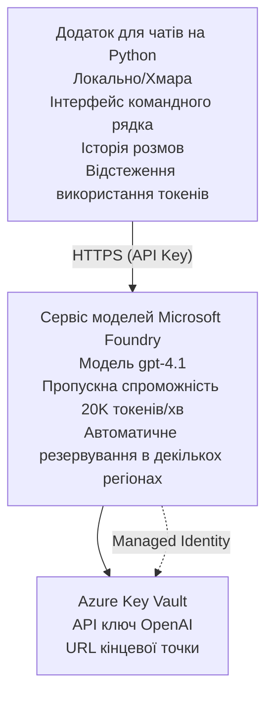

# Додаток чату Microsoft Foundry Models

**Освітній шлях:** Середній ⭐⭐ | **Час:** 35-45 хвилин | **Вартість:** $50-200/місяць

Повноцінний чат-додаток Microsoft Foundry Models, розгорнутий за допомогою Azure Developer CLI (azd). Цей приклад демонструє розгортання gpt-4.1, безпечний доступ до API та простий інтерфейс чату.

## 🎯 Чому ви навчитеся

- Розгортати сервіс Microsoft Foundry Models з моделлю gpt-4.1  
- Захищати ключі OpenAI API за допомогою Key Vault  
- Створювати простий чат-інтерфейс з Python  
- Моніторити використання токенів та витрати  
- Реалізовувати обмеження швидкості та обробку помилок  

## 📦 Що включено

✅ **Сервіс Microsoft Foundry Models** – розгортання моделі gpt-4.1  
✅ **Python Chat App** – простий інтерфейс чату в командному рядку  
✅ **Інтеграція Key Vault** – безпечне зберігання ключів API  
✅ **ARM шаблони** – повна інфраструктура як код  
✅ **Моніторинг витрат** – відстеження використання токенів  
✅ **Обмеження швидкості** – запобігання виснаженню квоти  

## Архітектура


## Необхідні умови

### Обов’язкові

- **Azure Developer CLI (azd)** - [Інструкція з встановлення](https://learn.microsoft.com/azure/developer/azure-developer-cli/install-azd)  
- **Підписка Azure** з доступом до OpenAI - [Запросити доступ](https://aka.ms/oai/access)  
- **Python 3.9+** - [Встановити Python](https://www.python.org/downloads/)  

### Перевірка необхідних умов

```bash
# Перевірте версію azd (потрібна 1.5.0 або новіша)
azd version

# Перевірте вхід в Azure
azd auth login

# Перевірте версію Python
python --version  # або python3 --version

# Перевірте доступ до OpenAI (перевірте в Azure Portal)
az cognitiveservices account list-skus \
  --kind OpenAI \
  --location eastus
```

> **⚠️ Важливо:** Для Microsoft Foundry Models потрібне схвалення додатку. Якщо не подавали заявку, відвідайте [aka.ms/oai/access](https://aka.ms/oai/access). Схвалення зазвичай займає 1-2 робочих дні.

## ⏱️ Час розгортання

| Етап | Тривалість | Що відбувається |
|-------|----------|--------------|
| Перевірка необхідних умов | 2-3 хвилини | Перевірка доступності квоти OpenAI |
| Розгортання інфраструктури | 8-12 хвилин | Створення OpenAI, Key Vault, розгортання моделі |
| Налаштування додатку | 2-3 хвилини | Налаштування середовища та залежностей |
| **Всього** | **12-18 хвилин** | Готово до чату з gpt-4.1 |

**Примітка:** Вперше розгортання OpenAI може зайняти більше часу через підготовку моделі.

## Швидкий старт

```bash
# Перейдіть до прикладу
cd examples/azure-openai-chat

# Ініціалізуйте середовище
azd env new myopenai

# Розгорніть все (інфраструктуру + конфігурацію)
azd up
# Вам буде запропоновано:
# 1. Виберіть підписку Azure
# 2. Оберіть місце з доступністю OpenAI (наприклад, eastus, eastus2, westus)
# 3. Зачекайте 12-18 хвилин для розгортання

# Встановіть залежності Python
pip install -r requirements.txt

# Починайте спілкуватися!
python chat.py
```

**Очікуваний результат:**  
```
🤖 Microsoft Foundry Models Chat Application
Connected to: gpt-4.1 (eastus)
Type your message (or 'quit' to exit)

You: Hello! Tell me about Microsoft Foundry Models.
Assistant: Microsoft Foundry Models Service provides REST API access to OpenAI's powerful language models including gpt-4.1, GPT-3.5-Turbo, and Embeddings...

[Tokens used: 145 | Estimated cost: $0.0044]
```

## ✅ Перевірка розгортання

### Крок 1: Перевірте ресурси Azure

```bash
# Переглянути розгорнуті ресурси
azd show

# Очікуваний вивід показує:
# - Служба OpenAI: (назва ресурсу)
# - Сховище ключів: (назва ресурсу)
# - Розгортання: gpt-4.1
# - Розташування: eastus (або ваш вибраний регіон)
```

### Крок 2: Тестування OpenAI API

```bash
# Отримати кінцеву точку та ключ OpenAI
OPENAI_ENDPOINT=$(azd env get-value AZURE_OPENAI_ENDPOINT)
OPENAI_KEY=$(azd env get-value AZURE_OPENAI_API_KEY)

# Перевірка виклику API
curl "$OPENAI_ENDPOINT/openai/deployments/gpt-4.1/chat/completions?api-version=2024-08-01-preview" \
  -H "Content-Type: application/json" \
  -H "api-key: $OPENAI_KEY" \
  -d '{
    "messages": [{"role": "user", "content": "Say hello!"}],
    "max_tokens": 50
  }'
```

**Очікувана відповідь:**  
```json
{
  "choices": [
    {
      "message": {
        "role": "assistant",
        "content": "Hello! How can I assist you today?"
      }
    }
  ],
  "usage": {
    "prompt_tokens": 8,
    "completion_tokens": 9,
    "total_tokens": 17
  }
}
```

### Крок 3: Перевірте доступ до Key Vault

```bash
# Перелічити секрети в Сховищі ключів
KV_NAME=$(azd env get-value AZURE_KEY_VAULT_NAME)

az keyvault secret list \
  --vault-name $KV_NAME \
  --query "[].name" \
  --output table
```

**Очікувані секрети:**  
- `openai-api-key`  
- `openai-endpoint`  

**Критерії успіху:**  
- ✅ Сервіс OpenAI розгорнутий з gpt-4.1  
- ✅ Виклик API повертає валідне завершення  
- ✅ Секрети збережені у Key Vault  
- ✅ Відстеження використання токенів працює  

## Структура проєкту

```
azure-openai-chat/
├── README.md                   ✅ This guide
├── azure.yaml                  ✅ AZD configuration
├── infra/                      ✅ Infrastructure as Code
│   ├── main.bicep             ✅ Main Bicep template
│   ├── main.parameters.json   ✅ Parameters
│   └── openai.bicep           ✅ OpenAI resource definition
├── src/                        ✅ Application code
│   ├── chat.py                ✅ Chat interface
│   ├── config.py              ✅ Configuration loader
│   └── requirements.txt       ✅ Python dependencies
└── .gitignore                  ✅ Git ignore rules
```

## Особливості додатку

### Інтерфейс чату (`chat.py`)

Додаток чату включає:

- **Історія розмови** – збереження контексту між повідомленнями  
- **Підрахунок токенів** – відстеження використання і оцінка витрат  
- **Обробка помилок** – коректна обробка обмежень швидкості та помилок API  
- **Оцінка вартості** – обчислення вартості в режимі реального часу для кожного повідомлення  
- **Підтримка потокової передачі** – опціональні потокові відповіді  

### Команди

Під час спілкування можна використовувати:  
- `quit` або `exit` – завершити сесію  
- `clear` – очистити історію розмови  
- `tokens` – показати загальне використання токенів  
- `cost` – показати приблизну загальну вартість  

### Конфігурація (`config.py`)

Завантажує конфігурацію з змінних середовища:  
```python
AZURE_OPENAI_ENDPOINT  # З Ключового Сховища
AZURE_OPENAI_API_KEY   # З Ключового Сховища
AZURE_OPENAI_MODEL     # За замовчуванням: gpt-4.1
AZURE_OPENAI_MAX_TOKENS # За замовчуванням: 800
```

## Приклади використання

### Базовий чат

```bash
python chat.py
```

### Чат з кастомною моделлю

```bash
export AZURE_OPENAI_MODEL=gpt-35-turbo
python chat.py
```

### Чат з потоковою передачею

```bash
python chat.py --stream
```

### Приклад розмови

```
You: Explain Microsoft Foundry Models Service in 3 sentences.
Assistant: Microsoft Foundry Models Service is Microsoft Azure's cloud platform offering 
that provides access to OpenAI's powerful language models. It enables developers 
to integrate capabilities like gpt-4.1 into their applications with enterprise-grade 
security and compliance. The service includes features for content filtering, 
abuse monitoring, and responsible AI practices.

[Tokens used: 89 | Estimated cost: $0.0027]

You: What models are available?
Assistant: Microsoft Foundry Models Service offers several model families including gpt-4.1 
(most capable), GPT-3.5-Turbo (faster and cost-effective), and Embeddings models 
for vector search. Each model has different capabilities, pricing, and token limits.

[Tokens used: 67 | Estimated cost: $0.0020]

Total session: 156 tokens | $0.0047
```

## Управління витратами

### Ціноутворення токенів (gpt-4.1)

| Модель | Вхідні дані (за 1К токенів) | Вихідні дані (за 1К токенів) |
|-------|----------------------|------------------------|
| gpt-4.1 | $0.03 | $0.06 |
| GPT-3.5-Turbo | $0.0015 | $0.002 |

### Оцінка місячних витрат

На основі шаблонів використання:  

| Рівень використання | Повідомлень/день | Токенів/день | Місячна вартість |
|-------------|--------------|------------|--------------|
| **Легке** | 20 повідомлень | 3,000 токенів | $3-5 |
| **Середнє** | 100 повідомлень | 15,000 токенів | $15-25 |
| **Важке** | 500 повідомлень | 75,000 токенів | $75-125 |

**Базова вартість інфраструктури:** $1-2/місяць (Key Vault + мінімальні обчислювальні ресурси)

### Поради з оптимізації витрат

```bash
# 1. Використовуйте GPT-3.5-Turbo для простіших завдань (в 20 разів дешевше)
export AZURE_OPENAI_MODEL=gpt-35-turbo

# 2. Зменшіть максимальну кількість токенів для коротших відповідей
export AZURE_OPENAI_MAX_TOKENS=400

# 3. Моніторте використання токенів
python chat.py --show-tokens

# 4. Налаштуйте сповіщення про бюджет
az consumption budget create \
  --budget-name "openai-budget" \
  --amount 50 \
  --time-grain Monthly
```

## Моніторинг

### Перегляд використання токенів

```bash
# В порталі Azure:
# Ресурс OpenAI → Метрики → Виберіть "Token Transaction"

# Або через Azure CLI:
az monitor metrics list \
  --resource $(azd env get-value AZURE_OPENAI_RESOURCE_ID) \
  --metric "TokenTransaction" \
  --start-time $(date -u -d '1 hour ago' '+%Y-%m-%dT%H:%M:%S') \
  --interval PT1M
```

### Перегляд журналів API

```bash
# Потік діагностичних журналів
az monitor diagnostic-settings create \
  --resource $(azd env get-value AZURE_OPENAI_RESOURCE_ID) \
  --name openai-logs \
  --logs '[{"category": "Audit", "enabled": true}]' \
  --workspace $(azd env get-value LOG_ANALYTICS_WORKSPACE_ID)

# Запити журналів
az monitor log-analytics query \
  --workspace $(azd env get-value LOG_ANALYTICS_WORKSPACE_ID) \
  --analytics-query "AzureDiagnostics | where Category == 'Audit' | top 10 by TimeGenerated"
```

## Виправлення неполадок

### Проблема: Помилка "Access Denied"

**Симптоми:** 403 Forbidden при виклику API  

**Рішення:**  
```bash
# 1. Перевірте, чи схвалено доступ до OpenAI
az cognitiveservices account show \
  --name $(azd env get-value AZURE_OPENAI_NAME) \
  --resource-group $(azd env get-value AZURE_RESOURCE_GROUP)

# 2. Перевірте, чи правильний ключ API
azd env get-value AZURE_OPENAI_API_KEY

# 3. Перевірте формат URL кінцевої точки
azd env get-value AZURE_OPENAI_ENDPOINT
# Має бути: https://[name].openai.azure.com/
```

### Проблема: "Перевищено ліміт швидкості"

**Симптоми:** 429 Too Many Requests  

**Рішення:**  
```bash
# 1. Перевірте поточну квоту
az cognitiveservices account deployment show \
  --name $(azd env get-value AZURE_OPENAI_NAME) \
  --resource-group $(azd env get-value AZURE_RESOURCE_GROUP) \
  --deployment-name gpt-4.1

# 2. Запитайте збільшення квоти (якщо потрібно)
# Перейдіть до Azure Portal → Ресурс OpenAI → Квоти → Запит на збільшення

# 3. Реалізуйте логіку повторних спроб (вже у chat.py)
# Застосунок автоматично повторює з експоненційним збільшенням затримки
```

### Проблема: "Модель не знайдена"

**Симптоми:** 404 помилка для розгортання  

**Рішення:**  
```bash
# 1. Перелік доступних розгортань
az cognitiveservices account deployment list \
  --name $(azd env get-value AZURE_OPENAI_NAME) \
  --resource-group $(azd env get-value AZURE_RESOURCE_GROUP)

# 2. Перевірте назву моделі в оточенні
echo $AZURE_OPENAI_MODEL

# 3. Оновіть до правильної назви розгортання
export AZURE_OPENAI_MODEL=gpt-4.1  # або gpt-35-turbo
```

### Проблема: Висока затримка

**Симптоми:** Повільні відповіді (>5 секунд)  

**Рішення:**  
```bash
# 1. Перевірте регіональну затримку
# Розгорніть у регіоні, найближчому до користувачів

# 2. Зменшіть max_tokens для швидших відповідей
export AZURE_OPENAI_MAX_TOKENS=400

# 3. Використовуйте потокову передачу для кращого UX
python chat.py --stream
```

## Кращі практики безпеки

### 1. Захист ключів API

```bash
# Ніколи не комітьте ключі в систему контролю версій
# Використовуйте Key Vault (вже налаштовано)

# Регулярно змінюйте ключі
az cognitiveservices account keys regenerate \
  --name $(azd env get-value AZURE_OPENAI_NAME) \
  --resource-group $(azd env get-value AZURE_RESOURCE_GROUP) \
  --key-name key1
```

### 2. Впровадження фільтрації контенту

```python
# Microsoft Foundry Models включає вбудоване фільтрування контенту
# Налаштування в Azure Portal:
# Ресурс OpenAI → Фільтри контенту → Створити власний фільтр

# Категорії: Ненависть, Сексуальний, Насильство, Самошкода
# Рівні: Низький, Середній, Високий рівень фільтрування
```

### 3. Використання керованої ідентичності (продакшн)

```bash
# Для виробничих розгортань використовуйте керовану ідентичність
# замість API-ключів (вимагає розміщення додатку в Azure)

# Оновіть infra/openai.bicep, щоб включити:
# identity: { type: 'SystemAssigned' }
```

## Розробка

### Запуск локально

```bash
# Встановити залежності
pip install -r src/requirements.txt

# Встановити змінні оточення
export AZURE_OPENAI_ENDPOINT="https://[name].openai.azure.com/"
export AZURE_OPENAI_API_KEY="your-api-key"
export AZURE_OPENAI_MODEL="gpt-4.1"

# Запустити додаток
python src/chat.py
```

### Запуск тестів

```bash
# Встановити тестові залежності
pip install pytest pytest-cov

# Запустити тести
pytest tests/ -v

# З покриттям
pytest tests/ --cov=src --cov-report=html
```

### Оновлення розгортання моделі

```bash
# Розгорнути різні версії моделі
az cognitiveservices account deployment create \
  --name $(azd env get-value AZURE_OPENAI_NAME) \
  --resource-group $(azd env get-value AZURE_RESOURCE_GROUP) \
  --deployment-name gpt-35-turbo \
  --model-name gpt-35-turbo \
  --model-version "0613" \
  --model-format OpenAI \
  --sku-capacity 20 \
  --sku-name "Standard"
```

## Очищення

```bash
# Видалити всі ресурси Azure
azd down --force --purge

# Це видаляє:
# - Сервіс OpenAI
# - Сховище ключів (з 90-денною м'якою деактивацією)
# - Групу ресурсів
# - Всі розгортання та конфігурації
```

## Наступні кроки

### Розширення цього прикладу

1. **Додати веб-інтерфейс** – створити фронтенд на React/Vue  
   ```bash
   # Додати фронтенд-сервіс до azure.yaml
   # Розгорнути в Azure Static Web Apps
   ```

2. **Реалізувати RAG** – додати пошук документів з Azure AI Search  
   ```python
   # Інтегрувати Azure Cognitive Search
   # Завантажити документи та створити векторний індекс
   ```

3. **Додати виклики функцій** – увімкнути використання інструментів  
   ```python
   # Визначити функції в chat.py
   # Дозволити gpt-4.1 викликати зовнішні API
   ```

4. **Підтримка кількох моделей** – розгортати кілька моделей  
   ```bash
   # Додати gpt-35-turbo, моделі embeddings
   # Реалізувати логіку маршрутизації моделей
   ```

### Пов’язані приклади

- **[Retail Multi-Agent](../retail-scenario.md)** – просунута архітектура мультиагентів  
- **[Database App](../../../../examples/database-app)** – додати постійне зберігання  
- **[Container Apps](../../../../examples/container-app)** – розгортання як контейнеризований сервіс  

### Навчальні ресурси

- 📚 [AZD For Beginners Course](../../README.md) – головний курс  
- 📚 [Документація Microsoft Foundry Models](https://learn.microsoft.com/azure/ai-services/openai/) – офіційна документація  
- 📚 [OpenAI API Reference](https://platform.openai.com/docs/api-reference) – деталі API  
- 📚 [Відповідальна Штучна Інтелігенція](https://www.microsoft.com/ai/responsible-ai) – кращі практики  

## Додаткові ресурси

### Документація  
- **[Сервіс Microsoft Foundry Models](https://learn.microsoft.com/azure/ai-services/openai/)** – повне керівництво  
- **[Моделі gpt-4.1](https://learn.microsoft.com/azure/ai-services/openai/concepts/models)** – можливості моделей  
- **[Фільтрація контенту](https://learn.microsoft.com/azure/ai-services/openai/concepts/content-filter)** – функції безпеки  
- **[Azure Developer CLI](https://learn.microsoft.com/azure/developer/azure-developer-cli/)** – довідка azd  

### Навчальні курси  
- **[OpenAI Quickstart](https://learn.microsoft.com/azure/ai-services/openai/quickstart)** – перше розгортання  
- **[Chat Completions](https://learn.microsoft.com/azure/ai-services/openai/how-to/chatgpt)** – створення чат-додатків  
- **[Function Calling](https://learn.microsoft.com/azure/ai-services/openai/how-to/function-calling)** – розширені функції  

### Інструменти  
- **[Microsoft Foundry Models Studio](https://oai.azure.com/)** – веб-платформа для тестування  
- **[Посібник з формування запитів](https://platform.openai.com/docs/guides/prompt-engineering)** – як писати кращі запити  
- **[Калькулятор токенів](https://platform.openai.com/tokenizer)** – оцінка використання токенів  

### Спільнота  
- **[Azure AI Discord](https://discord.gg/azure)** – допомога від спільноти  
- **[Обговорення на GitHub](https://github.com/Azure-Samples/openai/discussions)** – форум запитань та відповідей  
- **[Блог Azure](https://azure.microsoft.com/blog/tag/azure-openai-service/)** – останні новини  

---

**🎉 Успіх!** Ви розгорнули Microsoft Foundry Models і створили працюючий чат-додаток. Починайте досліджувати можливості gpt-4.1 та експериментувати з різними запитами та сценаріями.

**Питання?** [Відкрийте issue](https://github.com/microsoft/AZD-for-beginners/issues) або перегляньте [FAQ](../../resources/faq.md)

**Увага до витрат:** Пам’ятайте запускати `azd down` після тестування, щоб уникнути непотрібних витрат (~$50-100/місяць для активного використання).

---

<!-- CO-OP TRANSLATOR DISCLAIMER START -->
**Відмова від відповідальності**:  
Цей документ було перекладено за допомогою сервісу AI-перекладу [Co-op Translator](https://github.com/Azure/co-op-translator). Хоча ми прагнемо до точності, просимо мати на увазі, що автоматичні переклади можуть містити помилки або неточності. Оригінальний документ рідною мовою слід вважати авторитетним джерелом. Для критичної інформації рекомендовано звертатися до професійного людського перекладу. Ми не несемо відповідальності за будь-які непорозуміння або неправильні тлумачення, що виникли внаслідок використання цього перекладу.
<!-- CO-OP TRANSLATOR DISCLAIMER END -->