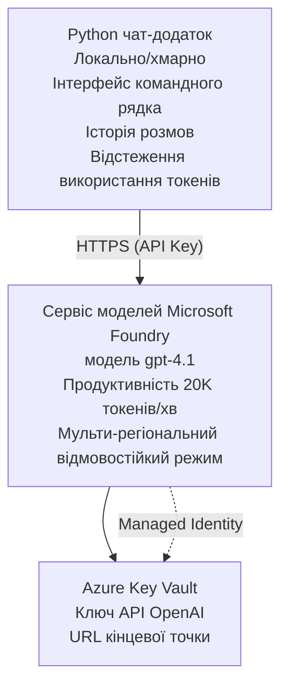

# Microsoft Foundry Models Chat Application

**Навчальний шлях:** Середній ⭐⭐ | **Час:** 35-45 хвилин | **Вартість:** $50-200/місяць

Повноцінний чат-додаток Microsoft Foundry Models, розгорнутий за допомогою Azure Developer CLI (azd). Цей приклад демонструє розгортання gpt-4.1, безпечний доступ до API та простий інтерфейс чату.

## 🎯 Чому Ви Навчитеся

- Розгортати Microsoft Foundry Models Service з моделлю gpt-4.1
- Захищати ключі OpenAI API через Key Vault
- Створювати простий чат-інтерфейс на Python
- Моніторити використання токенів і витрати
- Реалізовувати обмеження швидкості та обробку помилок

## 📦 Що Включено

✅ **Microsoft Foundry Models Service** - розгортання моделі gpt-4.1  
✅ **Python Chat App** - простий чат в командному рядку  
✅ **Інтеграція з Key Vault** - безпечне збереження ключів API  
✅ **ARM шаблони** - повна інфраструктура як код  
✅ **Моніторинг витрат** - відстеження використання токенів  
✅ **Обмеження швидкості** - запобігання вичерпанню квоти  

## Архітектура



## Необхідні умови

### Вимагається

- **Azure Developer CLI (azd)** - [Інструкція з встановлення](https://learn.microsoft.com/azure/developer/azure-developer-cli/install-azd)
- **Підписка Azure** з доступом до OpenAI - [Запросити доступ](https://aka.ms/oai/access)
- **Python 3.9+** - [Встановити Python](https://www.python.org/downloads/)

### Перевірка вимог

```bash
# Перевірте версію azd (потрібна 1.5.0 або вище)
azd version

# Перевірте вхід в Azure
azd auth login

# Перевірте версію Python
python --version  # або python3 --version

# Перевірте доступ до OpenAI (перевірте в порталі Azure)
az cognitiveservices account list-skus \
  --kind OpenAI \
  --location eastus
```

> **⚠️ Важливо:** Microsoft Foundry Models вимагає затвердження додатку. Якщо ви ще не подавали заявку, відвідайте [aka.ms/oai/access](https://aka.ms/oai/access). Затвердження зазвичай займає 1-2 робочих дні.

## ⏱️ Терміни Розгортання

| Етап | Тривалість | Що відбувається |
|-------|----------|--------------|
| Перевірка вимог | 2-3 хвилини | Перевірка доступності квоти OpenAI |
| Розгортання інфраструктури | 8-12 хвилин | Створення OpenAI, Key Vault, розгортання моделі |
| Налаштування додатку | 2-3 хвилини | Налаштування середовища та залежностей |
| **Всього** | **12-18 хвилин** | Готово до чату з gpt-4.1 |

**Примітка:** Першочергове розгортання OpenAI може зайняти більше часу через підготовку моделі.

## Швидкий Старт

```bash
# Перейдіть до прикладу
cd examples/azure-openai-chat

# Ініціалізуйте середовище
azd env new myopenai

# Розгорніть все (інфраструктуру + конфігурацію)
azd up
# Вас попросять:
# 1. Вибрати підписку Azure
# 2. Вибрати локацію з доступністю OpenAI (наприклад, eastus, eastus2, westus)
# 3. Зачекати 12-18 хвилин для розгортання

# Встановіть залежності Python
pip install -r requirements.txt

# Починайте спілкуватися!
python chat.py
```

**Очікуваний результат:**
```
🤖 Microsoft Foundry Models Chat Application
Connected to: gpt-4.1 (eastus)
Type your message (or 'quit' to exit)

You: Hello! Tell me about Microsoft Foundry Models.
Assistant: Microsoft Foundry Models Service provides REST API access to OpenAI's powerful language models including gpt-4.1, GPT-3.5-Turbo, and Embeddings...

[Tokens used: 145 | Estimated cost: $0.0044]
```

## ✅ Перевірка Розгортання

### Крок 1: Перевірка ресурсів Azure

```bash
# Переглянути розгорнуті ресурси
azd show

# Очікуваний вивід показує:
# - Сервіс OpenAI: (назва ресурсу)
# - Key Vault: (назва ресурсу)
# - Розгортання: gpt-4.1
# - Розташування: eastus (або обраний вами регіон)
```

### Крок 2: Тестування OpenAI API

```bash
# Отримати кінцеву точку OpenAI та ключ
OPENAI_ENDPOINT=$(azd env get-value AZURE_OPENAI_ENDPOINT)
OPENAI_KEY=$(azd env get-value AZURE_OPENAI_API_KEY)

# Тестовий виклик API
curl "$OPENAI_ENDPOINT/openai/deployments/gpt-4.1/chat/completions?api-version=2024-08-01-preview" \
  -H "Content-Type: application/json" \
  -H "api-key: $OPENAI_KEY" \
  -d '{
    "messages": [{"role": "user", "content": "Say hello!"}],
    "max_tokens": 50
  }'
```

**Очікувана відповідь:**
```json
{
  "choices": [
    {
      "message": {
        "role": "assistant",
        "content": "Hello! How can I assist you today?"
      }
    }
  ],
  "usage": {
    "prompt_tokens": 8,
    "completion_tokens": 9,
    "total_tokens": 17
  }
}
```

### Крок 3: Перевірка доступу до Key Vault

```bash
# Перелік секретів у Key Vault
KV_NAME=$(azd env get-value AZURE_KEY_VAULT_NAME)

az keyvault secret list \
  --vault-name $KV_NAME \
  --query "[].name" \
  --output table
```

**Очікувані секрети:**
- `openai-api-key`
- `openai-endpoint`

**Критерії успіху:**
- ✅ Сервіс OpenAI розгорнуто з gpt-4.1
- ✅ Виклик API повертає валідне завершення
- ✅ Секрети збережені у Key Vault
- ✅ Відстеження використання токенів працює

## Структура Проєкту

```
azure-openai-chat/
├── README.md                   ✅ This guide
├── azure.yaml                  ✅ AZD configuration
├── infra/                      ✅ Infrastructure as Code
│   ├── main.bicep             ✅ Main Bicep template
│   ├── main.parameters.json   ✅ Parameters
│   └── openai.bicep           ✅ OpenAI resource definition
├── src/                        ✅ Application code
│   ├── chat.py                ✅ Chat interface
│   ├── config.py              ✅ Configuration loader
│   └── requirements.txt       ✅ Python dependencies
└── .gitignore                  ✅ Git ignore rules
```

## Особливості Додатку

### Чат-інтерфейс (`chat.py`)

Чат-додаток включає:

- **Історія розмови** - підтримує контекст між повідомленнями
- **Підрахунок токенів** - відстежує використання та оцінює витрати
- **Обробка помилок** - коректна обробка обмежень швидкості та помилок API
- **Оцінка вартості** - обчислення вартості за повідомлення у реальному часі
- **Підтримка стрімінгу** - опціональні відповіді у режимі потокової передачі

### Команди

Під час чату ви можете використовувати:
- `quit` або `exit` - завершити сеанс
- `clear` - очистити історію розмови
- `tokens` - показати загальне використання токенів
- `cost` - показати приблизні загальні витрати

### Налаштування (`config.py`)

Завантажує конфігурацію із змінних оточення:
```python
AZURE_OPENAI_ENDPOINT  # Зі сховища ключів
AZURE_OPENAI_API_KEY   # Зі сховища ключів
AZURE_OPENAI_MODEL     # За замовчуванням: gpt-4.1
AZURE_OPENAI_MAX_TOKENS # За замовчуванням: 800
```

## Приклади Використання

### Базовий Чат

```bash
python chat.py
```

### Чат з Користувацькою Моделлю

```bash
export AZURE_OPENAI_MODEL=gpt-35-turbo
python chat.py
```

### Чат зі Стрімінгом

```bash
python chat.py --stream
```

### Приклад Розмови

```
You: Explain Microsoft Foundry Models Service in 3 sentences.
Assistant: Microsoft Foundry Models Service is Microsoft Azure's cloud platform offering 
that provides access to OpenAI's powerful language models. It enables developers 
to integrate capabilities like gpt-4.1 into their applications with enterprise-grade 
security and compliance. The service includes features for content filtering, 
abuse monitoring, and responsible AI practices.

[Tokens used: 89 | Estimated cost: $0.0027]

You: What models are available?
Assistant: Microsoft Foundry Models Service offers several model families including gpt-4.1 
(most capable), GPT-3.5-Turbo (faster and cost-effective), and Embeddings models 
for vector search. Each model has different capabilities, pricing, and token limits.

[Tokens used: 67 | Estimated cost: $0.0020]

Total session: 156 tokens | $0.0047
```

## Управління Витратами

### Ціни на Токени (gpt-4.1)

| Модель | Вхід (за 1К токенів) | Вихід (за 1К токенів) |
|-------|----------------------|------------------------|
| gpt-4.1 | $0.03 | $0.06 |
| GPT-3.5-Turbo | $0.0015 | $0.002 |

### Орієнтовні Місячні Витрати

В основу взято звички використання:

| Рівень Використання | Повідомлень/день | Токенів/день | Місячна Вартість |
|-------------|--------------|------------|--------------|
| **Легкий** | 20 повідомлень | 3 000 токенів | $3-5 |
| **Середній** | 100 повідомлень | 15 000 токенів | $15-25 |
| **Активний** | 500 повідомлень | 75 000 токенів | $75-125 |

**Базова вартість інфраструктури:** $1-2/місяць (Key Vault + мінімальні обчислення)

### Поради щодо Оптимізації Витрат

```bash
# 1. Використовуйте GPT-3.5-Turbo для простіших завдань (у 20 разів дешевше)
export AZURE_OPENAI_MODEL=gpt-35-turbo

# 2. Зменште максимальну кількість токенів для коротших відповідей
export AZURE_OPENAI_MAX_TOKENS=400

# 3. Слідкуйте за використанням токенів
python chat.py --show-tokens

# 4. Налаштуйте сповіщення про бюджет
az consumption budget create \
  --budget-name "openai-budget" \
  --amount 50 \
  --time-grain Monthly
```

## Моніторинг

### Перегляд Використання Токенів

```bash
# В порталі Azure:
# Ресурс OpenAI → Метрики → Виберіть "Токен-транзакції"

# Або через Azure CLI:
az monitor metrics list \
  --resource $(azd env get-value AZURE_OPENAI_RESOURCE_ID) \
  --metric "TokenTransaction" \
  --start-time $(date -u -d '1 hour ago' '+%Y-%m-%dT%H:%M:%S') \
  --interval PT1M
```

### Перегляд Логів API

```bash
# Потік діагностичних журналів
az monitor diagnostic-settings create \
  --resource $(azd env get-value AZURE_OPENAI_RESOURCE_ID) \
  --name openai-logs \
  --logs '[{"category": "Audit", "enabled": true}]' \
  --workspace $(azd env get-value LOG_ANALYTICS_WORKSPACE_ID)

# Журнали запитів
az monitor log-analytics query \
  --workspace $(azd env get-value LOG_ANALYTICS_WORKSPACE_ID) \
  --analytics-query "AzureDiagnostics | where Category == 'Audit' | top 10 by TimeGenerated"
```

## Усунення Несправностей

### Проблема: Помилка "Access Denied"

**Симптоми:** 403 Заборонено при виклику API

**Рішення:**
```bash
# 1. Перевірте, чи доступ OpenAI схвалено
az cognitiveservices account show \
  --name $(azd env get-value AZURE_OPENAI_NAME) \
  --resource-group $(azd env get-value AZURE_RESOURCE_GROUP)

# 2. Переконайтеся, що API-ключ правильний
azd env get-value AZURE_OPENAI_API_KEY

# 3. Перевірте формат URL кінцевої точки
azd env get-value AZURE_OPENAI_ENDPOINT
# Має бути: https://[name].openai.azure.com/
```

### Проблема: "Перевищено ліміт запитів"

**Симптоми:** 429 Занадто багато запитів

**Рішення:**
```bash
# 1. Перевірте поточну квоту
az cognitiveservices account deployment show \
  --name $(azd env get-value AZURE_OPENAI_NAME) \
  --resource-group $(azd env get-value AZURE_RESOURCE_GROUP) \
  --deployment-name gpt-4.1

# 2. Запит на збільшення квоти (якщо потрібно)
# Перейдіть до Azure Portal → Ресурс OpenAI → Квоти → Запит на збільшення

# 3. Реалізуйте логіку повторних спроб (вже в chat.py)
# Програма автоматично повторює спроби з експоненційним збільшенням інтервалу
```

### Проблема: "Модель не знайдена"

**Симптоми:** 404 помилка розгортання

**Рішення:**
```bash
# 1. Перелік доступних розгортань
az cognitiveservices account deployment list \
  --name $(azd env get-value AZURE_OPENAI_NAME) \
  --resource-group $(azd env get-value AZURE_RESOURCE_GROUP)

# 2. Перевірте назву моделі у середовищі
echo $AZURE_OPENAI_MODEL

# 3. Оновіть до правильної назви розгортання
export AZURE_OPENAI_MODEL=gpt-4.1  # або gpt-35-turbo
```

### Проблема: Висока затримка

**Симптоми:** Повільна відповідь (>5 секунд)

**Рішення:**
```bash
# 1. Перевірте регіональну затримку
# Розгорніть у регіоні, найближчому до користувачів

# 2. Зменшіть max_tokens для швидших відповідей
export AZURE_OPENAI_MAX_TOKENS=400

# 3. Використовуйте потокову передачу для кращого UX
python chat.py --stream
```

## Рекомендації з Безпеки

### 1. Захистити Ключі API

```bash
# Ніколи не зберігайте ключі у системі контролю версій
# Використовуйте Key Vault (вже налаштовано)

# Регулярно змінюйте ключі
az cognitiveservices account keys regenerate \
  --name $(azd env get-value AZURE_OPENAI_NAME) \
  --resource-group $(azd env get-value AZURE_RESOURCE_GROUP) \
  --key-name key1
```

### 2. Впровадити Фільтрацію Контенту

```python
# Microsoft Foundry Models включає вбудований фільтр вмісту
# Налаштування у порталі Azure:
# Ресурс OpenAI → Фільтри вмісту → Створити користувацький фільтр

# Категорії: Ненависть, Сексуальний, Насильство, Самопошкодження
# Рівні: Низький, Середній, Високий фільтр
```

### 3. Використовувати Керовану Ідентичність (для Продакшену)

```bash
# Для розгортання у продуктивному середовищі використовуйте керовану ідентичність
# замість API ключів (вимагає розміщення додатку на Azure)

# Оновіть infra/openai.bicep, щоб включити:
# identity: { type: 'SystemAssigned' }
```

## Розробка

### Локальний Запуск

```bash
# Встановити залежності
pip install -r src/requirements.txt

# Встановити змінні середовища
export AZURE_OPENAI_ENDPOINT="https://[name].openai.azure.com/"
export AZURE_OPENAI_API_KEY="your-api-key"
export AZURE_OPENAI_MODEL="gpt-4.1"

# Запустити додаток
python src/chat.py
```

### Запуск Тестів

```bash
# Встановити залежності для тестування
pip install pytest pytest-cov

# Запустити тести
pytest tests/ -v

# З покриттям
pytest tests/ --cov=src --cov-report=html
```

### Оновлення Розгортання Моделі

```bash
# Розгорнути різні версії моделі
az cognitiveservices account deployment create \
  --name $(azd env get-value AZURE_OPENAI_NAME) \
  --resource-group $(azd env get-value AZURE_RESOURCE_GROUP) \
  --deployment-name gpt-35-turbo \
  --model-name gpt-35-turbo \
  --model-version "0613" \
  --model-format OpenAI \
  --sku-capacity 20 \
  --sku-name "Standard"
```

## Очищення Ресурсів

```bash
# Видалити всі ресурси Azure
azd down --force --purge

# Це видаляє:
# - Сервіс OpenAI
# - Key Vault (із 90-денною м’якою деактивацією)
# - Групу ресурсів
# - Усі розгортання та налаштування
```

## Наступні Кроки

### Розширення Цього Прикладу

1. **Додати Веб-Інтерфейс** - створити фронтенд на React/Vue
   ```bash
   # Додайте сервіс фронтенду до azure.yaml
   # Розгорнути в Azure Static Web Apps
   ```

2. **Впровадити RAG** - додати пошук документів з Azure AI Search
   ```python
   # Інтегрувати Azure AI Search
   # Завантажте документи та створіть векторний індекс
   ```

3. **Додати Виклики Функцій** - активувати використання інструментів
   ```python
   # Визначте функції у chat.py
   # Дозвольте gpt-4.1 викликати зовнішні API
   ```

4. **Підтримка Багатьох Моделей** - розгорнути кілька моделей
   ```bash
   # Додати gpt-35-turbo, моделі ембеддингів
   # Реалізувати логіку маршрутизації моделей
   ```

### Схожі Приклади

- **[Retail Multi-Agent](../retail-scenario.md)** - складна архітектура багатьох агентів
- **[Database App](../../../../examples/database-app)** - додати постійне сховище
- **[Container Apps](../../../../examples/container-app)** - розгортання як контейнерна служба

### Навчальні Ресурси

- 📚 [Курс для Початківців AZD](../../README.md) - Головна сторінка курсу
- 📚 [Документація Microsoft Foundry Models](https://learn.microsoft.com/azure/ai-services/openai/) - Офіційна документація
- 📚 [OpenAI API Reference](https://platform.openai.com/docs/api-reference) - Докладно про API
- 📚 [Відповідальний AI](https://www.microsoft.com/ai/responsible-ai) - Найкращі практики

## Додаткові Ресурси

### Документація
- **[Microsoft Foundry Models Service](https://learn.microsoft.com/azure/ai-services/openai/)** - Повний посібник
- **[gpt-4.1 Models](https://learn.microsoft.com/azure/ai-services/openai/concepts/models)** - Можливості моделей
- **[Content Filtering](https://learn.microsoft.com/azure/ai-services/openai/concepts/content-filter)** - Функції безпеки
- **[Azure Developer CLI](https://learn.microsoft.com/azure/developer/azure-developer-cli/)** - Посібник azd

### Навчальні Курси
- **[OpenAI Quickstart](https://learn.microsoft.com/azure/ai-services/openai/quickstart)** - Перше розгортання
- **[Chat Completions](https://learn.microsoft.com/azure/ai-services/openai/how-to/chatgpt)** - Створення чат-додатків
- **[Function Calling](https://learn.microsoft.com/azure/ai-services/openai/how-to/function-calling)** - Розширені функції

### Інструменти
- **[Microsoft Foundry Models Studio](https://oai.azure.com/)** - Веб-платформа для експериментів
- **[Prompt Engineering Guide](https://platform.openai.com/docs/guides/prompt-engineering)** - Як писати кращі підказки
- **[Token Calculator](https://platform.openai.com/tokenizer)** - Оцінка використання токенів

### Спільнота
- **[Azure AI Discord](https://discord.gg/azure)** - Допомога від спільноти
- **[GitHub Discussions](https://github.com/Azure-Samples/openai/discussions)** - Форум запитань та відповідей
- **[Azure Blog](https://azure.microsoft.com/blog/tag/azure-openai-service/)** - Останні новини

---

**🎉 Успіх!** Ви розгорнули Microsoft Foundry Models і створили робочий чат-додаток. Починайте досліджувати можливості gpt-4.1 та експериментуйте з різними підказками й сценаріями використання.

**Питання?** [Відкрийте issue](https://github.com/microsoft/AZD-for-beginners/issues) або перегляньте [FAQ](../../resources/faq.md)

**Увага до витрат:** Пам'ятайте запускати `azd down` після тестування, щоб уникнути подальших нарахувань (~$50-100/місяць при активному використанні).

---

<!-- CO-OP TRANSLATOR DISCLAIMER START -->
**Відмова від відповідальності**:
Цей документ було перекладено за допомогою сервісу штучного інтелекту для перекладу [Co-op Translator](https://github.com/Azure/co-op-translator). Хоча ми прагнемо до точності, будь ласка, майте на увазі, що автоматичні переклади можуть містити помилки або неточності. Оригінальний документ рідною мовою слід вважати авторитетним джерелом. Для критично важливої інформації рекомендується професійний людський переклад. Ми не несемо відповідальності за будь-які непорозуміння або неправильні тлумачення, що виникли внаслідок використання цього перекладу.
<!-- CO-OP TRANSLATOR DISCLAIMER END -->