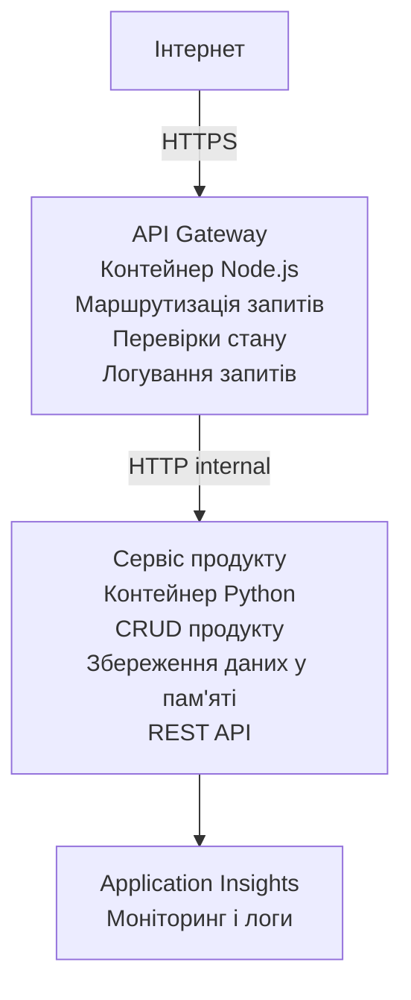

# Архітектура мікросервісів - приклад Container App

⏱️ **Приблизний час**: 25-35 хвилин | 💰 **Приблизна вартість**: ~$50-100/місяць | ⭐ **Складність**: Високий рівень

**Спрощена, але функціональна** архітектура мікросервісів, розгорнута в Azure Container Apps за допомогою AZD CLI. Цей приклад демонструє сервіс-сервісну комунікацію, оркестрацію контейнерів та моніторинг у практичній конфігурації з двома сервісами.

> **📚 Підхід до навчання**: Цей приклад починається з мінімальної архітектури з 2 сервісів (API Gateway + Backend Service), яку ви можете реально розгорнути і вивчити. Після освоєння бази ми надаємо рекомендації щодо розширення до повного мікросервісного середовища.

## Чого ви навчитесь

Після проходження цього прикладу ви зможете:
- Розгортати кілька контейнерів у Azure Container Apps
- Реалізувати сервіс-сервісну комунікацію внутрішніми мережами
- Налаштовувати масштабування та перевірку здоров'я в залежності від середовища
- Моніторити розподілені застосунки за допомогою Application Insights
- Розуміти патерни розгортання мікросервісів та найкращі практики
- Вчитися поступовому розширенню від простої до складної архітектури

## Архітектура

### Етап 1: Що ми будуємо (в цьому прикладі)


**Чому починати з простого?**
- ✅ Швидко розгортати і розуміти (25-35 хвилин)
- ✅ Вивчати основні патерни мікросервісів без складнощів
- ✅ Робочий код, який можна модифікувати і експериментувати
- ✅ Менша вартість навчання (~$50-100/місяць проти $300-1400/місяць)
- ✅ Набрати впевненість перед додаванням БД і черг повідомлень

**Аналогія**: Уявіть, що ви вчитеся водити. Спочатку порожня парковка (2 сервіси), освоюєте базу, а потім переходите до руху містом (5+ сервісів з БД).

### Етап 2: Майбутнє розширення (приклад архітектури)

Після освоєння архітектури з 2 сервісів ви можете розширити її до:

```
Full Architecture (Not Included - For Reference)
├── API Gateway (✅ Included)
├── Product Service (✅ Included)
├── Order Service (🔜 Add next)
├── User Service (🔜 Add next)
├── Notification Service (🔜 Add last)
├── Azure Service Bus (🔜 For async communication)
├── Cosmos DB (🔜 For product persistence)
├── Azure SQL (🔜 For order management)
└── Azure Storage (🔜 For file storage)
```

Дивіться розділ "Expansion Guide" у кінці для покрокових інструкцій.

## Включені можливості

✅ **Виявлення сервісів**: Автоматичне DNS-виявлення між контейнерами  
✅ **Балансування навантаження**: Вбудоване балансування між репліками  
✅ **Автоматичне масштабування**: Незалежне масштабування за кількістю HTTP-запитів  
✅ **Моніторинг здоров'я**: Проби живості і готовності для обох сервісів  
✅ **Розподілене логування**: Централізоване логування з Application Insights  
✅ **Внутрішня мережа**: Захищена комунікація між сервісами  
✅ **Оркестрація контейнерів**: Автоматичне розгортання та масштабування  
✅ **Оновлення без простоїв**: Каскадні оновлення з керуванням ревізіями  

## Необхідні умови

### Потрібні інструменти

Перед початком переконайтеся, що у вас встановлено:

1. **[Azure Developer CLI (azd)](https://learn.microsoft.com/azure/developer/azure-developer-cli/install-azd)** (версія 1.0.0 або вище)
   ```bash
   azd version
   # Очікуваний вивід: версія azd 1.0.0 або вище
   ```

2. **[Azure CLI](https://learn.microsoft.com/cli/azure/install-azure-cli)** (версія 2.50.0 або вище)
   ```bash
   az --version
   # Очікуваний результат: azure-cli 2.50.0 або вище
   ```

3. **[Docker](https://www.docker.com/get-started)** (для локальної розробки/тестування - необов’язково)
   ```bash
   docker --version
   # Очікуваний результат: версія Docker 20.10 або вище
   ```

### Вимоги Azure

- Активна **підписка Azure** ([створити безкоштовний акаунт](https://azure.microsoft.com/free/))
- Дозволи на створення ресурсів у підписці
- Роль **Contributor** у підписці або групі ресурсів

### Попередні знання

Це приклад **високого рівня складності**. Вам потрібно:
- Впевнено пройти [Simple Flask API example](../../../../../examples/container-app/simple-flask-api) 
- Мати базове розуміння архітектури мікросервісів
- Знати REST API та HTTP
- Розуміти концепції контейнерів

**Новачок у Container Apps?** Почніть спочатку з [Simple Flask API example](../../../../../examples/container-app/simple-flask-api) щоб засвоїти основи.

## Швидкий старт (крок за кроком)

### Крок 1: Клонування та перехід у каталог

```bash
git clone https://github.com/microsoft/AZD-for-beginners.git
cd AZD-for-beginners/examples/container-app/microservices
```

**✓ Перевірка успіху**: Переконайтеся, що бачите `azure.yaml`:
```bash
ls
# Очікувано: README.md, azure.yaml, infra/, src/
```

### Крок 2: Аутентифікація в Azure

```bash
azd auth login
```

Відкривається браузер для аутентифікації в Azure. Увійдіть за допомогою своїх облікових даних Azure.

**✓ Перевірка успіху**: Ви повинні побачити:
```
Logged in to Azure.
```

### Крок 3: Ініціалізація середовища

```bash
azd init
```

**Запити, які ви побачите**:
- **Ім’я середовища**: Введіть коротке ім’я (наприклад, `microservices-dev`)
- **Підписка Azure**: Виберіть вашу підписку
- **Регіон Azure**: Оберіть регіон (наприклад, `eastus`, `westeurope`)

**✓ Перевірка успіху**: Ви повинні побачити:
```
SUCCESS: New project initialized!
```

### Крок 4: Розгортання інфраструктури та сервісів

```bash
azd up
```

**Що відбувається** (триває 8-12 хвилин):
1. Створення середовища Container Apps
2. Створення Application Insights для моніторингу
3. Побудова контейнера API Gateway (Node.js)
4. Побудова контейнера Product Service (Python)
5. Розгортання обох контейнерів в Azure
6. Налаштування мережі та перевірок здоров'я
7. Налаштування моніторингу і логування

**✓ Перевірка успіху**: Ви повинні побачити:
```
SUCCESS: Your application was deployed to Azure in X minutes Y seconds.
Endpoint: https://api-gateway-<unique-id>.azurecontainerapps.io
```

**⏱️ Час**: 8-12 хвилин

### Крок 5: Тестування розгортання

```bash
# Отримати кінцеву точку шлюзу
GATEWAY_URL=$(azd env get-values | grep API_GATEWAY_URL | cut -d '=' -f2 | tr -d '"')

# Перевірити стан здоров'я API Gateway
curl $GATEWAY_URL/health

# Очікуваний вивід:
# {"status":"healthy","service":"api-gateway","timestamp":"2025-11-19T10:30:00Z"}
```

**Тест продуктового сервісу через gateway**:
```bash
# Список продуктів
curl $GATEWAY_URL/api/products

# Очікуваний результат:
# [
#   {"id":1,"name":"Ноутбук","price":999.99,"stock":50},
#   {"id":2,"name":"Миша","price":29.99,"stock":200},
#   {"id":3,"name":"Клавіатура","price":79.99,"stock":150}
# ]
```

**✓ Перевірка успіху**: Обидва кінцеві точки повертають JSON без помилок.

---

**🎉 Вітаємо!** Ви розгорнули архітектуру мікросервісів в Azure!

## Структура проєкту

Всі файли реалізації включені — це повний, робочий приклад:

```
microservices/
│
├── README.md                         # This file
├── azure.yaml                        # AZD configuration
├── .gitignore                        # Git ignore patterns
│
├── infra/                           # Infrastructure as Code (Bicep)
│   ├── main.bicep                   # Main orchestration
│   ├── abbreviations.json           # Naming conventions
│   ├── core/                        # Shared infrastructure
│   │   ├── container-apps-environment.bicep  # Container environment + registry
│   │   └── monitor.bicep            # Application Insights + Log Analytics
│   └── app/                         # Service definitions
│       ├── api-gateway.bicep        # API Gateway container app
│       └── product-service.bicep    # Product Service container app
│
└── src/                             # Application source code
    ├── api-gateway/                 # Node.js API Gateway
    │   ├── app.js                   # Express server with routing
    │   ├── package.json             # Node dependencies
    │   └── Dockerfile               # Container definition
    └── product-service/             # Python Product Service
        ├── main.py                  # Flask API with product data
        ├── requirements.txt         # Python dependencies
        └── Dockerfile               # Container definition
```

**Що робить кожен компонент:**

**Інфраструктура (infra/)**:
- `main.bicep`: Оркестрація всіх ресурсів Azure та залежностей
- `core/container-apps-environment.bicep`: Створення середовища Container Apps та Azure Container Registry
- `core/monitor.bicep`: Налаштування Application Insights для розподіленого логування
- `app/*.bicep`: Індивідуальні визначення контейнерних додатків з масштабуванням і перевірками здоров'я

**API Gateway (src/api-gateway/)**:
- Публічний сервіс, який маршрутизує запити до бекенд сервісів
- Реалізує логування, обробку помилок, пересилки запитів
- Демонструє HTTP-комунікацію між сервісами

**Product Service (src/product-service/)**:
- Внутрішній сервіс з каталогом продуктів (в пам’яті для простоти)
- REST API з перевірками здоров’я
- Приклад бекендного патерну мікросервіса

## Огляд сервісів

### API Gateway (Node.js/Express)

**Порт**: 8080  
**Доступ**: Публічний (зовнішній вхід)  
**Призначення**: Маршрутизує вхідні запити до відповідних бекенд сервісів  

**Ендпоїнти**:
- `GET /` - Інформація про сервіс
- `GET /health` - Перевірка здоров'я
- `GET /api/products` - Пересилка до product service (список усіх)
- `GET /api/products/:id` - Пересилка до product service (за ID)

**Ключові можливості**:
- Маршрутизація запитів за допомогою axios
- Централізоване логування
- Обробка помилок і таймаутів
- Виявлення сервісів через змінні середовища
- Інтеграція з Application Insights

**Кодова витримка** (`src/api-gateway/app.js`):
```javascript
// Внутрішнє обслуговування комунікацій
app.get('/api/products', async (req, res) => {
  const response = await axios.get(`${PRODUCT_SERVICE_URL}/products`);
  res.json(response.data);
});
```

### Product Service (Python/Flask)

**Порт**: 8000  
**Доступ**: Лише внутрішній (немає зовнішнього доступу)  
**Призначення**: Керує каталогом продуктів з даними в пам’яті  

**Ендпоїнти**:
- `GET /` - Інформація про сервіс
- `GET /health` - Перевірка здоров'я
- `GET /products` - Список усіх продуктів
- `GET /products/<id>` - Продукт за ID

**Ключові можливості**:
- REST API на Flask
- Зберігання продуктів в пам’яті (просто, без бази даних)
- Моніторинг здоров'я через проби
- Структуроване логування
- Інтеграція з Application Insights

**Модель даних**:
```python
{
  "id": 1,
  "name": "Laptop",
  "description": "High-performance laptop",
  "price": 999.99,
  "stock": 50
}
```

**Чому тільки внутрішній доступ?**
Продуктовий сервіс не публічний. Усі запити мають проходити через API Gateway, що надає:
- Безпеку: контрольована точка доступу
- Гнучкість: можна змінювати бекенд без впливу на клієнтів
- Моніторинг: централізоване логування запитів

## Розуміння комунікації між сервісами

### Як сервіси спілкуються один з одним

У цьому прикладі API Gateway комунікує з Product Service за допомогою **внутрішніх HTTP-запитів**:

```javascript
// Шлюз API (src/api-gateway/app.js)
const PRODUCT_SERVICE_URL = process.env.PRODUCT_SERVICE_URL;

// Виконати внутрішній HTTP-запит
const response = await axios.get(`${PRODUCT_SERVICE_URL}/products`);
```

**Основні моменти**:

1. **Виявлення через DNS**: Container Apps автоматично надає DNS для внутрішніх сервісів
   - FQDN сервісу product-service: `product-service.internal.<environment>.azurecontainerapps.io`
   - Спрощено як: `http://product-service` (Container Apps резолвить його)

2. **Немає публічного доступу**: Product Service має `external: false` у Bicep
   - Доступно лише в межах середовища Container Apps
   - Немає доступу з інтернету

3. **Змінні середовища**: URL сервісів вставляються під час розгортання
   - Bicep передає внутрішній FQDN в gateway
   - В коді немає жорстко закодованих URL

**Аналогія**: Уявіть офіс. API Gateway — це ресепшн (публічна приймальна), а Product Service — офісна кімната (внутрішня). Відвідувачі мають проходити через ресепшн, щоб потрапити до кімнат.

## Варіанти розгортання

### Повне розгортання (рекомендовано)

```bash
# Розгорнути інфраструктуру та обидва сервіси
azd up
```

Це розгортає:
1. Середовище Container Apps
2. Application Insights
3. Container Registry
4. Контейнер API Gateway
5. Контейнер Product Service

**Час**: 8-12 хвилин

### Розгортання окремого сервісу

```bash
# Розгорніть лише одну службу (після початкового azd up)
azd deploy api-gateway

# Або розгорніть службу продукту
azd deploy product-service
```

**Випадок використання**: Коли ви оновили код в одному сервісі і хочете розгорнути лише його.

### Оновлення конфігурації

```bash
# Змінити параметри масштабування
azd env set GATEWAY_MAX_REPLICAS 30

# Повторно розгорнути з новою конфігурацією
azd up
```

## Конфігурація

### Налаштування масштабування

Обидва сервіси налаштовані для автоскейлінгу за HTTP у їх bicep файлах:

**API Gateway**:
- Мінімум реплік: 2 (завжди щонайменше 2 для доступності)
- Максимум реплік: 20
- Тригер масштабування: 50 одночасних запитів на репліку

**Product Service**:
- Мінімум реплік: 1 (може масштабуватися до нуля)
- Максимум реплік: 10
- Тригер масштабування: 100 одночасних запитів на репліку

**Налаштування масштабування** (у `infra/app/*.bicep`):
```bicep
scale: {
  minReplicas: 1
  maxReplicas: 10
  rules: [
    {
      name: 'http-scale-rule'
      http: {
        metadata: {
          concurrentRequests: '100'  // Adjust this
        }
      }
    }
  ]
}
```

### Ресурси

**API Gateway**:
- CPU: 1.0 vCPU
- Пам’ять: 2 ГБ
- Причина: Обробляє весь зовнішній трафік

**Product Service**:
- CPU: 0.5 vCPU
- Пам’ять: 1 ГБ
- Причина: Легкі операції в пам’яті

### Перевірки здоров'я

Обидва сервіси включають проби живості та готовності:

```bicep
probes: [
  {
    type: 'Liveness'
    httpGet: {
      path: '/health'
      port: 8080
    }
    initialDelaySeconds: 10
    periodSeconds: 30
  }
  {
    type: 'Readiness'
    httpGet: {
      path: '/health'
      port: 8080
    }
    initialDelaySeconds: 5
    periodSeconds: 10
  }
]
```

**Що це означає**:
- **Живість**: Якщо перевірка не проходить, Container Apps перезапускає контейнер
- **Готовність**: Якщо сервіс не готовий, трафік на репліку не маршрутизується


## Моніторинг та спостережуваність

### Перегляд логів сервісів

```bash
# Переглядайте журнали за допомогою azd monitor
azd monitor --logs

# Або використовуйте Azure CLI для конкретних Container Apps:
# Потік журналів з API Gateway
az containerapp logs show --name api-gateway --resource-group $RG_NAME --follow

# Переглядайте нещодавні журнали служби продукту
az containerapp logs show --name product-service --resource-group $RG_NAME --tail 100
```

**Очікуваний вивід**:
```
[api-gateway] API Gateway listening on port 8080
[api-gateway] Product Service URL: http://product-service
[api-gateway] GET /api/products 200 - 45ms
[product-service] Retrieved 5 products
```

### Запити Application Insights

Відкрийте Application Insights у Azure Portal і виконайте ці запити:

**Знайти повільні запити**:
```kusto
requests
| where timestamp > ago(1h)
| where duration > 1000  // Requests taking >1 second
| summarize count() by name, cloud_RoleName
| order by count_ desc
```

**Відслідковувати виклики між сервісами**:
```kusto
dependencies
| where timestamp > ago(1h)
| where type == "Http"
| project timestamp, name, target, duration, success
| order by timestamp desc
```

**Рівень помилок за сервісами**:
```kusto
exceptions
| where timestamp > ago(24h)
| summarize errorCount = count() by cloud_RoleName, type
| order by errorCount desc
```

**Обсяг запитів з часом**:
```kusto
requests
| where timestamp > ago(1h)
| summarize requestCount = count() by bin(timestamp, 5m), cloud_RoleName
| render timechart
```

### Доступ до дашборду моніторингу

```bash
# Отримати деталі Application Insights
azd env get-values | grep APPLICATIONINSIGHTS

# Відкрити моніторинг у порталі Azure
az monitor app-insights component show \
  --app $(azd env get-values | grep APPLICATIONINSIGHTS_CONNECTION_STRING | cut -d '=' -f2) \
  --resource-group $(azd env get-values | grep AZURE_RESOURCE_GROUP | cut -d '=' -f2) \
  --query "appId" -o tsv
```

### Live Metrics

1. Перейдіть у Application Insights в Azure Portal
2. Клікніть на "Live Metrics"
3. Переглядайте запити, відмови і продуктивність у реальному часі
4. Протестуйте, виконавши: `curl $(azd env get-values | grep API_GATEWAY_URL | cut -d '=' -f2 | tr -d '"')/api/products`

## Практичні вправи

[Примітка: Повний перелік вправ дивіться вище у розділі "Практичні вправи" для детальних кроків включно з перевіркою розгортання, зміною даних, тестами автоскейлінгу, обробкою помилок і додаванням третього сервісу.]

## Аналіз витрат

### Оцінка місячних витрат (для цього прикладу з 2 сервісами)

| Ресурс | Конфігурація | Оцінена вартість |
|----------|--------------|----------------|
| API Gateway | 2-20 реплік, 1 vCPU, 2GB RAM | $30-150 |
| Product Service | 1-10 реплік, 0.5 vCPU, 1GB RAM | $15-75 |
| Container Registry | Базовий рівень | $5 |
| Application Insights | 1-2 ГБ/місяць | $5-10 |
| Log Analytics | 1 ГБ/місяць | $3 |
| **Всього** | | **$58-243/місяць** |

**Розподіл за навантаженням**:
- **Легкий трафік** (тестування/навчання): ~$60/місяць
- **Помірний трафік** (малий продакшен): ~$120/місяць
- **Великий трафік** (завантажені періоди): ~$240/місяць

### Поради з оптимізації витрат

1. **Масштабування до нуля в розробці**:
   ```bicep
   scale: {
     minReplicas: 0  // Save $30-40/month when not in use
     maxReplicas: 10
   }
   ```

2. **Використовувати Consumption Plan для Cosmos DB** (при додаванні):
   - Платіть лише за використане
   - Без мінімальної оплати

3. **Встановити семплінг у Application Insights**:
   ```javascript
   appInsights.defaultClient.config.samplingPercentage = 50; // Вибірка 50% запитів
   ```

4. **Зачищати ресурси, коли не потрібні**:
   ```bash
   azd down
   ```

### Варіанти безкоштовного рівня

Для навчання/тестування розгляньте:
- Використовуйте безкоштовні кредити Azure (перші 30 днів)
- Залишайте мінімум реплік
- Видаляйте після тестування (щоб уникнути постійних платежів)

---

## Очищення

Щоб уникнути постійних платежів, видаліть усі ресурси:

```bash
azd down --force --purge
```

**Підтвердження**:
```
? Total resources to delete: 6, are you sure you want to continue? (y/N)
```

Введіть `y` для підтвердження.

**Що видаляється**:
- Середовище Container Apps
- Обидва Container Apps (gateway і product service)
- Container Registry
- Application Insights
- Log Analytics Workspace
- Група ресурсів

**✓ Перевірка очищення**:
```bash
az group list --query "[?starts_with(name,'rg-microservices')]" --output table
```

Потрібно повернути порожній результат.

---

## Посібник розширення: від 2 до 5+ сервісів

Коли ви опануєте цю архітектуру з 2 сервісів, ось як розширити:

### Фаза 1: Додати збереження даних (наступний крок)

**Додайте Cosmos DB для Product Service**:

1. Створіть `infra/core/cosmos.bicep`:
   ```bicep
   resource cosmosAccount 'Microsoft.DocumentDB/databaseAccounts@2023-04-15' = {
     name: name
     location: location
     kind: 'GlobalDocumentDB'
     properties: {
       databaseAccountOfferType: 'Standard'
       locations: [{ locationName: location, failoverPriority: 0 }]
     }
   }
   ```

2. Оновіть product service для використання Cosmos DB замість даних в пам’яті

3. Орієнтовна додаткова вартість: ~25$/місяць (serverless)

### Фаза 2: Додати третій сервіс (управління замовленнями)

**Створіть Order Service**:

1. Нова папка: `src/order-service/` (Python/Node.js/C#)
2. Новий Bicep: `infra/app/order-service.bicep`
3. Оновіть API Gateway для маршруту `/api/orders`
4. Додайте Azure SQL Database для збереження замовлень

**Архітектура стає такою**:
```
API Gateway → Product Service (Cosmos DB)
           → Order Service (Azure SQL)
```

### Фаза 3: Додати асинхронну комунікацію (Service Bus)

**Реалізуйте подієву архітектуру**:

1. Додайте Azure Service Bus: `infra/core/servicebus.bicep`
2. Product Service публікує події "ProductCreated"
3. Order Service підписується на події продуктів
4. Додайте Notification Service для обробки подій

**Патерн**: Запит/Відповідь (HTTP) + Подієвий (Service Bus)

### Фаза 4: Додати автентифікацію користувачів

**Реалізуйте User Service**:

1. Створіть `src/user-service/` (Go/Node.js)
2. Додайте Azure AD B2C або власну JWT-автентифікацію
3. API Gateway перевіряє токени
4. Сервіси перевіряють дозволи користувачів

### Фаза 5: Готовність до продакшн

**Додайте ці компоненти**:
- Azure Front Door (глобальне балансування навантаження)
- Azure Key Vault (управління секретами)
- Azure Monitor Workbooks (кастомні дашборди)
- CI/CD Pipeline (GitHub Actions)
- Blue-Green Deployment
- Managed Identity для всіх сервісів

**Вартість повної продакшн-архітектури**: ~300-1400$/місяць

---

## Дізнатись більше

### Пов’язана документація
- [Документація Azure Container Apps](https://learn.microsoft.com/azure/container-apps/)
- [Посібник з архітектури мікросервісів](https://learn.microsoft.com/azure/architecture/guide/architecture-styles/microservices)
- [Application Insights для розподіленого трасування](https://learn.microsoft.com/azure/azure-monitor/app/distributed-tracing)
- [Документація Azure Developer CLI](https://learn.microsoft.com/azure/developer/azure-developer-cli/)

### Наступні кроки в цьому курсі
- ← Попередній: [Simple Flask API](../../../../../examples/container-app/simple-flask-api) - Приклад початкового одно-контейнерного додатку
- → Наступний: [Посібник інтеграції AI](../../../../../examples/docs/ai-foundry) - Додавання AI можливостей
- 🏠 [Домашня сторінка курсу](../../README.md)

### Порівняння: коли що використовувати

**Один Container App** (приклад Simple Flask API):
- ✅ Прості додатки
- ✅ Монолітна архітектура
- ✅ Швидке розгортання
- ❌ Обмежене масштабування
- **Вартість**: ~15-50$/місяць

**Мікросервіси** (цей приклад):
- ✅ Складні додатки
- ✅ Незалежне масштабування кожного сервісу
- ✅ Автономія команд (різні сервіси — різні команди)
- ❌ Складніше в управлінні
- **Вартість**: ~60-250$/місяць

**Kubernetes (AKS)**:
- ✅ Максимальний контроль і гнучкість
- ✅ Мультихмарна портативність
- ✅ Розвинене мережеве середовище
- ❌ Потребує знань Kubernetes
- **Вартість**: мінімум ~150-500$/місяць

**Рекомендація**: Починайте з Container Apps (цей приклад), переходьте на AKS лише якщо потрібні специфічні функції Kubernetes.

---

## Часті запитання

**П: Чому лише 2 сервіси замість 5+?**  
В: Навчальний прогрес. Освойте основи (комунікація сервісів, моніторинг, масштабування) на простому прикладі, перш ніж ускладнювати. Патерни, які ви тут вивчаєте, застосовні і до архітектур з 100 сервісів.

**П: Чи можу я додати більше сервісів самостійно?**  
В: Звичайно! Дотримуйтесь посібника розширення вище. Кожен новий сервіс слід створити, додати Bicep, оновити azure.yaml, розгорнути.

**П: Чи готово це до продакшн?**  
В: Це міцна база. Для продакшн додайте: managed identity, Key Vault, постійні бази даних, CI/CD, моніторинг та стратегію бекапів.

**П: Чому не використовувати Dapr або інший сервіс-меш?**  
В: Залишайте все простим для навчання. Коли зрозумієте рідне мережеве оточення Container Apps, можна додати Dapr для складніших сценаріїв.

**П: Як налагоджувати локально?**  
В: Запускайте сервіси локально через Docker:
```bash
cd src/api-gateway
docker build -t local-gateway .
docker run -p 8080:8080 -e PRODUCT_SERVICE_URL=http://localhost:8000 local-gateway
```

**П: Можу використовувати різні мови програмування?**  
В: Так! Цей приклад показує Node.js (gateway)+Python (product service). Можна змішувати будь-які мови, які працюють у контейнерах.

**П: Що якщо у мене немає кредитів Azure?**  
В: Використайте безкоштовний рівень Azure (перші 30 днів для нових акаунтів) або розгорніть для коротких тестів і одразу видаліть.

---

> **🎓 Підсумок навчального шляху**: Ви навчилися розгортати багатосервісну архітектуру з автоматичним масштабуванням, внутрішнім мережевим з’єднанням, централізованим моніторингом та патернами готовності до продакшн. Ця база готує вас до складних розподілених систем і корпоративних мікросервісних архітектур.

**📚 Навігація курсом:**
- ← Попередній: [Simple Flask API](../../../../../examples/container-app/simple-flask-api)
- → Наступний: [Приклад інтеграції бази даних](../../../../../examples/database-app)
- 🏠 [Домашня сторінка курсу](../../../README.md)
- 📖 [Кращі практики Container Apps](../../../docs/chapter-04-infrastructure/deployment-guide.md)

---

<!-- CO-OP TRANSLATOR DISCLAIMER START -->
**Відмова від відповідальності**:  
Цей документ був перекладений за допомогою сервісу автоматичного перекладу [Co-op Translator](https://github.com/Azure/co-op-translator). Хоча ми прагнемо до точності, будь ласка, майте на увазі, що автоматизовані переклади можуть містити помилки або неточності. Оригінальний документ рідною мовою слід розглядати як авторитетне джерело. Для критично важливої інформації рекомендується професійний людський переклад. Ми не несемо відповідальності за будь-які непорозуміння чи неправильні тлумачення, що виникли внаслідок використання цього перекладу.
<!-- CO-OP TRANSLATOR DISCLAIMER END -->