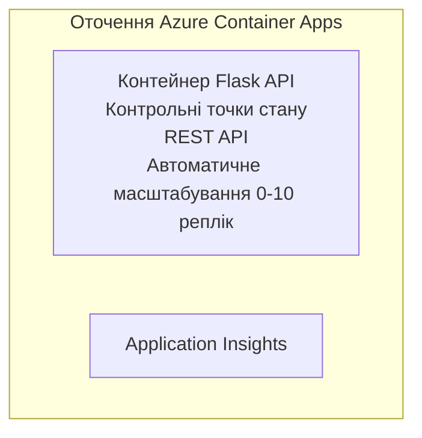

# Простий Flask API - Приклад контейнерного додатку

**Навчальний шлях:** Початківець ⭐ | **Час:** 25-35 хвилин | **Вартість:** $0-15/місяць

Повний, працездатний Python Flask REST API, розгорнутий у Azure Container Apps за допомогою Azure Developer CLI (azd). Цей приклад демонструє розгортання контейнера, автоматичне масштабування та основи моніторингу.

## 🎯 Чому ви навчитеся

- Розгортати контейнеризований додаток на Python в Azure
- Налаштовувати автоматичне масштабування зі scale-to-zero
- Реалізовувати health probes і readiness checks
- Моніторити логи додатку і метрики
- Використовувати Azure Developer CLI для швидкого розгортання

## 📦 Що включено

✅ **Flask Application** - Повний REST API з CRUD-операціями (`src/app.py`)  
✅ **Dockerfile** - Конфігурація контейнера готового до продакшна  
✅ **Bicep Infrastructure** - Середовище Container Apps та розгортання API  
✅ **AZD Configuration** - Налаштування розгортання в один крок  
✅ **Health Probes** - Налаштовані перевірки працездатності та готовності  
✅ **Auto-scaling** - 0-10 реплік залежно від HTTP навантаження  

## Архітектура


## Попередні умови

### Необхідно
- **Azure Developer CLI (azd)** - [Посібник з встановлення](https://learn.microsoft.com/azure/developer/azure-developer-cli/install-azd)
- **Підписка Azure** - [Безкоштовний акаунт](https://azure.microsoft.com/free/)
- **Docker Desktop** - [Встановити Docker](https://www.docker.com/products/docker-desktop/) (для локального тестування)

### Перевірка попередніх умов

```bash
# Перевірте версію azd (потрібна 1.5.0 або вище)
azd version

# Перевірте вхід до Azure
azd auth login

# Перевірте Docker (необов’язково, для локального тестування)
docker --version
```

## ⏱️ Час розгортання

| Етап | Тривалість | Що відбувається |
|-------|----------|--------------||
| Налаштування середовища | 30 секунд | Створення середовища azd |
| Збірка контейнера | 2-3 хвилини | Docker збірка Flask додатку |
| Підготовка інфраструктури | 3-5 хвилин | Створення Container Apps, реєстру, моніторингу |
| Розгортання додатку | 2-3 хвилини | Відправлення образу і розгортання в Container Apps |
| **Всього** | **8-12 хвилин** | Готове повне розгортання |

## Швидкий старт

```bash
# Перейдіть до прикладу
cd examples/container-app/simple-flask-api

# Ініціалізуйте середовище (виберіть унікальне ім'я)
azd env new myflaskapi

# Розгорніть усе (інфраструктуру + додаток)
azd up
# Вам буде запропоновано:
# 1. Вибрати підписку Azure
# 2. Вибрати розташування (наприклад, eastus2)
# 3. Чекати 8–12 хвилин на розгортання

# Отримайте кінцеву точку API
azd env get-values

# Протестуйте API
curl $(azd env get-value API_ENDPOINT)/health
```

**Очікуваний результат:**
```json
{
  "status": "healthy",
  "timestamp": "2025-11-19T10:30:00Z",
  "service": "simple-flask-api",
  "version": "1.0.0"
}
```

## ✅ Перевірка розгортання

### Крок 1: Перевірка стану розгортання

```bash
# Переглянути розгорнуті сервіси
azd show

# Очікуваний вивід показує:
# - Сервіс: api
# - Кінцева точка: https://ca-api-[env].xxx.azurecontainerapps.io
# - Статус: Запущено
```

### Крок 2: Тестування API ендпоінтів

```bash
# Отримати кінцеву точку API
API_URL=$(azd env get-value API_ENDPOINT)

# Перевірка стану здоров’я
curl $API_URL/health

# Перевірити кореневу кінцеву точку
curl $API_URL/

# Створити елемент
curl -X POST $API_URL/api/items \
  -H "Content-Type: application/json" \
  -d '{"name": "Test Item", "description": "My first item"}'

# Отримати всі елементи
curl $API_URL/api/items
```

**Критерії успіху:**
- ✅ Endpoint для перевірки здоров’я повертає HTTP 200
- ✅ Кореневий endpoint показує інформацію про API
- ✅ POST створює елемент і повертає HTTP 201
- ✅ GET повертає створені елементи

### Крок 3: Перегляд логів

```bash
# Потокове передавання живих журналів за допомогою azd monitor
azd monitor --logs

# Або використовуйте Azure CLI:
az containerapp logs show --name api --resource-group $RG_NAME --follow

# Ви повинні побачити:
# - Повідомлення про запуск Gunicorn
# - Журнали HTTP-запитів
# - Журнали інформації про застосунок
```

## Структура проєкту

```
simple-flask-api/
├── azure.yaml              # AZD configuration
├── infra/
│   ├── main.bicep         # Main infrastructure
│   ├── main.parameters.json
│   └── app/
│       ├── container-env.bicep
│       └── api.bicep
└── src/
    ├── app.py             # Flask application
    ├── requirements.txt
    └── Dockerfile
```

## API Ендпоінти

| Ендпоінт | Метод | Опис |
|----------|--------|-------------|
| `/health` | GET | Перевірка здоров’я |
| `/api/items` | GET | Список усіх елементів |
| `/api/items` | POST | Створення нового елемента |
| `/api/items/{id}` | GET | Отримати конкретний елемент |
| `/api/items/{id}` | PUT | Оновити елемент |
| `/api/items/{id}` | DELETE | Видалити елемент |

## Конфігурація

### Змінні оточення

```bash
# Встановити користувацькі налаштування
azd env set PORT 8000
azd env set LOG_LEVEL info
azd env set MAX_REPLICAS 20
```

### Налаштування масштабування

API автоматично масштабується залежно від HTTP трафіку:
- **Мінімальна кількість реплік**: 0 (масштабується до нуля при відсутності запитів)
- **Максимальна кількість реплік**: 10
- **Кількість одночасних запитів на репліку**: 50

## Розробка

### Запуск локально

```bash
# Встановити залежності
cd src
pip install -r requirements.txt

# Запустити додаток
python app.py

# Тестувати локально
curl http://localhost:8000/health
```

### Збірка та тестування контейнера

```bash
# Створити Docker-образ
docker build -t flask-api:local ./src

# Запустити контейнер локально
docker run -p 8000:8000 flask-api:local

# Протестувати контейнер
curl http://localhost:8000/health
```

## Розгортання

### Повне розгортання

```bash
# Розгорнути інфраструктуру та застосунок
azd up
```

### Розгортання лише коду

```bash
# Розгортати лише код застосунку (інфраструктура без змін)
azd deploy api
```

### Оновлення конфігурації

```bash
# Оновити змінні середовища
azd env set API_KEY "new-api-key"

# Пере розгорнути з новою конфігурацією
azd deploy api
```

## Моніторинг

### Перегляд логів

```bash
# Відтворення живих журналів за допомогою azd monitor
azd monitor --logs

# Або використовуйте Azure CLI для Container Apps:
az containerapp logs show --name api --resource-group $RG_NAME --follow

# Переглянути останні 100 рядків
az containerapp logs show --name api --resource-group $RG_NAME --tail 100
```

### Моніторинг метрик

```bash
# Відкрити панель моніторингу Azure
azd monitor --overview

# Переглянути конкретні метрики
az monitor metrics list \
  --resource $(azd show --output json | jq -r '.services.api.resourceId') \
  --metric "Requests,ResponseTime"
```

## Тестування

### Перевірка здоров’я

```bash
curl $(azd show --output json | jq -r '.services.api.endpoint')/health
```

Очікувана відповідь:
```json
{
  "status": "healthy",
  "timestamp": "2025-11-19T10:30:00Z"
}
```

### Створення елемента

```bash
curl -X POST $(azd show --output json | jq -r '.services.api.endpoint')/api/items \
  -H "Content-Type: application/json" \
  -d '{"name": "Test Item", "description": "A test item"}'
```

### Отримання всіх елементів

```bash
curl $(azd show --output json | jq -r '.services.api.endpoint')/api/items
```

## Оптимізація витрат

Це розгортання використовує scale-to-zero, тож ви платите лише, коли API обробляє запити:

- **Вартість у режимі очікування**: ~$0/місяць (масштабується до нуля)
- **Активна вартість**: ~$0.000024/секунду за репліку
- **Очікувані місячні витрати** (при невеликому навантаженні): $5-15

### Подальше зменшення витрат

```bash
# Зменшити максимальну кількість реплік для розробки
azd env set MAX_REPLICAS 3

# Використовувати коротший тайм-аут бездіяльності
azd env set SCALE_TO_ZERO_TIMEOUT 300  # 5 хвилин
```

## Усунення неполадок

### Контейнер не запускається

```bash
# Перевірте журнали контейнера за допомогою Azure CLI
az containerapp logs show --name api --resource-group $RG_NAME --tail 100

# Перевірте збірку Docker-образів локально
docker build -t test ./src
```

### API недоступний

```bash
# Перевірте, що вхід є зовнішнім
az containerapp show --name api --resource-group rg-simple-flask-api \
  --query properties.configuration.ingress.external
```

### Високий час відповіді

```bash
# Перевірити використання ЦП/пам'яті
az monitor metrics list \
  --resource $(azd show --output json | jq -r '.services.api.resourceId') \
  --metric "CPUPercentage,MemoryPercentage"

# Збільшити ресурси за потребою
az containerapp update --name api --resource-group rg-simple-flask-api \
  --cpu 1.0 --memory 2Gi
```

## Очищення

```bash
# Видалити всі ресурси
azd down --force --purge
```

## Наступні кроки

### Розширення цього прикладу

1. **Додати базу даних** - Інтеграція Azure Cosmos DB або SQL Database
   ```bash
   # Додати модуль Cosmos DB до infra/main.bicep
   # Оновити app.py з підключенням до бази даних
   ```

2. **Додати автентифікацію** - Впровадження Azure AD або API ключів
   ```python
   # Додайте проміжне програмне забезпечення автентифікації до app.py
   from functools import wraps
   ```

3. **Налаштувати CI/CD** - Робочий процес GitHub Actions
   ```yaml
   # Create .github/workflows/deploy.yml
   name: Deploy to Azure
   on: [push]
   ```

4. **Додати керовану ідентичність** - Безпечний доступ до сервісів Azure
   ```bicep
   # Update infra/app/api.bicep
   identity: { type: 'SystemAssigned' }
   ```

### Пов’язані приклади

- **[Database App](../../../../../examples/database-app)** - Повний приклад із SQL Database
- **[Microservices](../../../../../examples/container-app/microservices)** - Архітектура з кількома сервісами
- **[Container Apps Master Guide](../README.md)** - Усі патерни контейнерів

### Навчальні ресурси

- 📚 [Курс AZD для початківців](../../../README.md) - Головна сторінка курсу
- 📚 [Патерни Container Apps](../README.md) - Більше варіантів розгортання
- 📚 [Галерея шаблонів AZD](https://azure.github.io/awesome-azd/) - Шаблони спільноти

## Додаткові ресурси

### Документація
- **[Документація Flask](https://flask.palletsprojects.com/)** - Посібник по Flask
- **[Azure Container Apps](https://learn.microsoft.com/azure/container-apps/)** - Офіційна документація Azure
- **[Azure Developer CLI](https://learn.microsoft.com/azure/developer/azure-developer-cli/)** - Довідка по команді azd

### Навчальні курси
- **[Швидкий старт Container Apps](https://learn.microsoft.com/azure/container-apps/quickstart-portal)** - Розгорніть свій перший додаток
- **[Python в Azure](https://learn.microsoft.com/azure/developer/python/)** - Посібник з розробки на Python
- **[Мова Bicep](https://learn.microsoft.com/azure/azure-resource-manager/bicep/)** - Інфраструктура як код

### Інструменти
- **[Azure Portal](https://portal.azure.com)** - Візуальне керування ресурсами
- **[Розширення VS Code для Azure](https://marketplace.visualstudio.com/items?itemName=ms-azuretools.vscode-azurecontainerapps)** - Інтеграція IDE

---

**🎉 Вітаємо!** Ви розгорнули готовий до продакшна Flask API у Azure Container Apps з авто масштабуванням та моніторингом.

**Є запитання?** [Відкрийте issue](https://github.com/microsoft/AZD-for-beginners/issues) або подивіться [FAQ](../../../resources/faq.md)

---

<!-- CO-OP TRANSLATOR DISCLAIMER START -->
**Відмова від відповідальності**:  
Цей документ було перекладено за допомогою сервісу автоматичного перекладу [Co-op Translator](https://github.com/Azure/co-op-translator). Хоча ми прагнемо до точності, будь ласка, майте на увазі, що автоматичні переклади можуть містити помилки або неточності. Оригінальний документ рідною мовою слід вважати авторитетним джерелом. Для критичної інформації рекомендується професійний людський переклад. Ми не несемо відповідальності за будь-які непорозуміння або неправильні тлумачення, що виникли внаслідок використання цього перекладу.
<!-- CO-OP TRANSLATOR DISCLAIMER END -->