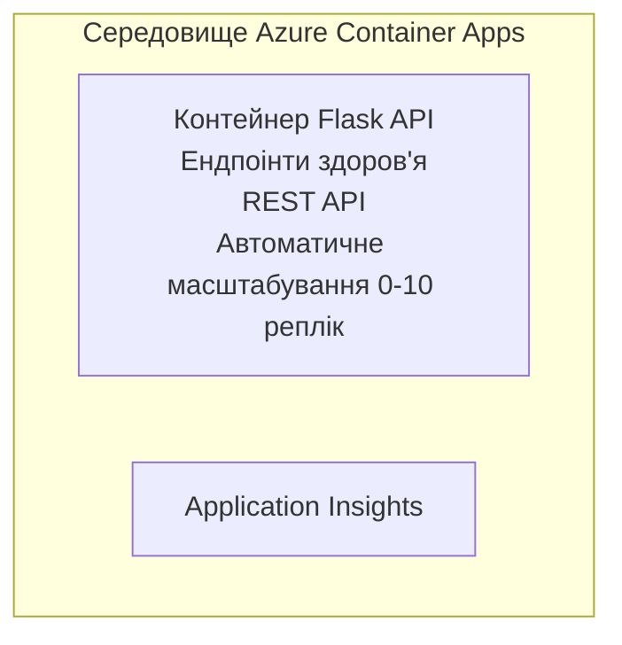

# Простий Flask API - приклад контейнерного додатку

**Навчальний шлях:** Початковий ⭐ | **Час:** 25–35 хвилин | **Вартість:** $0-15/місяць

Повноцінний, робочий Python Flask REST API, розгорнутий у Azure Container Apps з використанням Azure Developer CLI (azd). Цей приклад демонструє розгортання контейнерів, автоматичне масштабування та основи моніторингу.

## 🎯 Чого Ви Навчитеся

- Розгортати контейнеризовані Python-додатки в Azure
- Налаштовувати автоматичне масштабування зі scale-to-zero
- Реалізовувати перевірки здоров'я та готовності
- Моніторити журнали та метрики додатку
- Використовувати Azure Developer CLI для швидкого розгортання

## 📦 Що Входить до Набору

✅ **Flask додаток** — повноцінний REST API з операціями CRUD (`src/app.py`)  
✅ **Dockerfile** — готова до продакшену конфігурація контейнера  
✅ **Bicep інфраструктура** — оточення Container Apps та розгортання API  
✅ **Конфігурація AZD** — налаштування розгортання однією командою  
✅ **Перевірки здоров'я** — налаштовані liveness і readiness probes  
✅ **Автоматичне масштабування** — від 0 до 10 реплік залежно від HTTP-навантаження  

## Архітектура



## Передумови

### Необхідно
- **Azure Developer CLI (azd)** — [Інструкція з встановлення](https://learn.microsoft.com/azure/developer/azure-developer-cli/install-azd)
- **Підписка Azure** — [Безкоштовний акаунт](https://azure.microsoft.com/free/)
- **Docker Desktop** — [Встановити Docker](https://www.docker.com/products/docker-desktop/) (для локального тестування)

### Перевірка передумов

```bash
# Перевірте версію azd (потрібна 1.5.0 або вище)
azd version

# Перевірте вхід в Azure
azd auth login

# Перевірте Docker (за бажанням, для локального тестування)
docker --version
```

## ⏱️ Терміни розгортання

| Етап | Тривалість | Що відбувається |
|-------|----------|--------------||
| Налаштування оточення | 30 секунд | Створення оточення azd |
| Збірка контейнера | 2-3 хвилини | Docker збірка Flask-додатку |
| Опис інфраструктури | 3-5 хвилин | Створення Container Apps, реєстру, моніторингу |
| Розгортання додатку | 2-3 хвилини | Пуш образу і розгортання в Container Apps |
| **Всього** | **8–12 хвилин** | Готове розгортання |

## Швидкий старт

```bash
# Перейдіть до прикладу
cd examples/container-app/simple-flask-api

# Ініціалізуйте середовище (виберіть унікальне ім’я)
azd env new myflaskapi

# Розгорніть усе (інфраструктуру + додаток)
azd up
# Вам буде запропоновано:
# 1. Вибрати підписку Azure
# 2. Вибрати розташування (наприклад, eastus2)
# 3. Очікуйте 8-12 хвилин на розгортання

# Отримайте свій API endpoint
azd env get-values

# Перевірте API
curl $(azd env get-value API_ENDPOINT)/health
```

**Очікуваний результат:**
```json
{
  "status": "healthy",
  "timestamp": "2025-11-19T10:30:00Z",
  "service": "simple-flask-api",
  "version": "1.0.0"
}
```

## ✅ Перевірка розгортання

### Крок 1: Перевірте статус розгортання

```bash
# Переглянути розгорнуті сервіси
azd show

# Очікуваний вивід показує:
# - Сервіс: api
# - Кінцева точка: https://ca-api-[env].xxx.azurecontainerapps.io
# - Статус: Запущено
```

### Крок 2: Тестування API-ендпоінтів

```bash
# Отримати кінцеву точку API
API_URL=$(azd env get-value API_ENDPOINT)

# Тестування стану
curl $API_URL/health

# Тестування кореневої кінцевої точки
curl $API_URL/

# Створити елемент
curl -X POST $API_URL/api/items \
  -H "Content-Type: application/json" \
  -d '{"name": "Test Item", "description": "My first item"}'

# Отримати всі елементи
curl $API_URL/api/items
```

**Критерії успіху:**
- ✅ Ендпоінт здоров'я повертає HTTP 200
- ✅ Головна сторінка показує інформацію про API
- ✅ POST створює елемент і повертає HTTP 201
- ✅ GET повертає створені елементи

### Крок 3: Перегляньте журнали

```bash
# Транслюйте живі журнали за допомогою azd monitor
azd monitor --logs

# Або використовуйте Azure CLI:
az containerapp logs show --name api --resource-group $RG_NAME --follow

# Ви повинні побачити:
# - Повідомлення про запуск Gunicorn
# - Журнали HTTP-запитів
# - Журнали інформації про застосунок
```

## Структура проекту

```
simple-flask-api/
├── azure.yaml              # AZD configuration
├── infra/
│   ├── main.bicep         # Main infrastructure
│   ├── main.parameters.json
│   └── app/
│       ├── container-env.bicep
│       └── api.bicep
└── src/
    ├── app.py             # Flask application
    ├── requirements.txt
    └── Dockerfile
```

## API-ендпоінти

| Ендпоінт | Метод | Опис |
|----------|--------|-------------|
| `/health` | GET | Перевірка стану здоров'я |
| `/api/items` | GET | Список усіх елементів |
| `/api/items` | POST | Створити новий елемент |
| `/api/items/{id}` | GET | Отримати конкретний елемент |
| `/api/items/{id}` | PUT | Оновити елемент |
| `/api/items/{id}` | DELETE | Видалити елемент |

## Конфігурація

### Змінні оточення

```bash
# Встановити власну конфігурацію
azd env set PORT 8000
azd env set LOG_LEVEL info
azd env set MAX_REPLICAS 20
```

### Налаштування масштабування

API автоматично масштабується залежно від HTTP-трафіку:
- **Мінімальна кількість реплік**: 0 (масштабується до нуля при відсутності навантаження)
- **Максимальна кількість реплік**: 10
- **Паралельні запити на репліку**: 50

## Розробка

### Запуск локально

```bash
# Встановити залежності
cd src
pip install -r requirements.txt

# Запустити додаток
python app.py

# Тестувати локально
curl http://localhost:8000/health
```

### Збірка та тестування контейнера

```bash
# Зібрати Docker-зображення
docker build -t flask-api:local ./src

# Запустити контейнер локально
docker run -p 8000:8000 flask-api:local

# Протестувати контейнер
curl http://localhost:8000/health
```

## Розгортання

### Повне розгортання

```bash
# Розгорнути інфраструктуру та додаток
azd up
```

### Розгортання лише коду

```bash
# Розгортайте лише код застосунку (інфраструктура без змін)
azd deploy api
```

### Оновлення конфігурації

```bash
# Оновіть змінні оточення
azd env set API_KEY "new-api-key"

# Перепублікуйте з новою конфігурацією
azd deploy api
```

## Моніторинг

### Перегляд журналів

```bash
# Потокове передавання живих журналів за допомогою azd monitor
azd monitor --logs

# Або використовуйте Azure CLI для Container Apps:
az containerapp logs show --name api --resource-group $RG_NAME --follow

# Переглянути останні 100 рядків
az containerapp logs show --name api --resource-group $RG_NAME --tail 100
```

### Моніторинг метрик

```bash
# Відкрити інформаційну панель Azure Monitor
azd monitor --overview

# Переглянути конкретні показники
az monitor metrics list \
  --resource $(azd show --output json | jq -r '.services.api.resourceId') \
  --metric "Requests,ResponseTime"
```

## Тестування

### Перевірка здоров'я

```bash
curl $(azd show --output json | jq -r '.services.api.endpoint')/health
```

Очікувана відповідь:
```json
{
  "status": "healthy",
  "timestamp": "2025-11-19T10:30:00Z"
}
```

### Створення елемента

```bash
curl -X POST $(azd show --output json | jq -r '.services.api.endpoint')/api/items \
  -H "Content-Type: application/json" \
  -d '{"name": "Test Item", "description": "A test item"}'
```

### Отримання всіх елементів

```bash
curl $(azd show --output json | jq -r '.services.api.endpoint')/api/items
```

## Оптимізація вартості

Це розгортання використовує scale-to-zero, тож ви платите лише тоді, коли API обробляє запити:

- **Вартість в режимі очікування**: близько $0/місяць (масштабується до нуля)
- **Активна вартість**: близько $0.000024/секунда за репліку
- **Очікувана місячна вартість** (при помірному використанні): $5-15

### Подальше зниження витрат

```bash
# Зменшити максимальну кількість реплік для розробки
azd env set MAX_REPLICAS 3

# Використовувати коротший час бездіяльності
azd env set SCALE_TO_ZERO_TIMEOUT 300  # 5 хвилин
```

## Усунення несправностей

### Контейнер не запускається

```bash
# Перевірте журнали контейнера за допомогою Azure CLI
az containerapp logs show --name api --resource-group $RG_NAME --tail 100

# Перевірте збірки Docker-образів локально
docker build -t test ./src
```

### Немає доступу до API

```bash
# Перевірити, що вхід є зовнішнім
az containerapp show --name api --resource-group rg-simple-flask-api \
  --query properties.configuration.ingress.external
```

### Високий час відгуку

```bash
# Перевірити використання CPU/пам’яті
az monitor metrics list \
  --resource $(azd show --output json | jq -r '.services.api.resourceId') \
  --metric "CPUPercentage,MemoryPercentage"

# Масштабувати ресурси при необхідності
az containerapp update --name api --resource-group rg-simple-flask-api \
  --cpu 1.0 --memory 2Gi
```

## Очистка

```bash
# Видалити всі ресурси
azd down --force --purge
```

## Наступні кроки

### Розширення цього прикладу

1. **Додати базу даних** — інтеграція з Azure Cosmos DB або SQL Database  
   ```bash
   # Додати модуль Cosmos DB у infra/main.bicep
   # Оновити app.py з підключенням до бази даних
   ```

2. **Додати автентифікацію** — впровадження Microsoft Entra ID або API-ключів  
   ```python
   # Додати проміжне ПЗ автентифікації у app.py
   from functools import wraps
   ```

3. **Налаштувати CI/CD** — робочий процес GitHub Actions  
   ```yaml
   # Create .github/workflows/deploy.yml
   name: Deploy to Azure
   on: [push]
   ```

4. **Додати керовану ідентичність** — безпечний доступ до сервісів Azure  
   ```bicep
   # Update infra/app/api.bicep
   identity: { type: 'SystemAssigned' }
   ```

### Пов’язані приклади

- **[Database App](../../../../../examples/database-app)** — повний приклад з SQL базою даних
- **[Microservices](../../../../../examples/container-app/microservices)** — мультисервісна архітектура
- **[Container Apps Master Guide](../README.md)** — усі патерни для контейнерів

### Навчальні ресурси

- 📚 [Курс AZD для початківців](../../../README.md) — головний курс
- 📚 [Патерни Container Apps](../README.md) — більше патернів розгортання
- 📚 [Галерея шаблонів AZD](https://azure.github.io/awesome-azd/) — шаблони спільноти

## Додаткові ресурси

### Документація
- **[Документація Flask](https://flask.palletsprojects.com/)** — керівництво по Flask
- **[Azure Container Apps](https://learn.microsoft.com/azure/container-apps/)** — офіційні документи Azure
- **[Azure Developer CLI](https://learn.microsoft.com/azure/developer/azure-developer-cli/)** — довідник по azd

### Посібники
- **[Швидкий старт Container Apps](https://learn.microsoft.com/azure/container-apps/quickstart-portal)** — розгорніть свій перший додаток
- **[Python в Azure](https://learn.microsoft.com/azure/developer/python/)** — керівництво з розробки на Python
- **[Мова Bicep](https://learn.microsoft.com/azure/azure-resource-manager/bicep/)** — інфраструктура як код

### Інструменти
- **[Azure Portal](https://portal.azure.com)** — візуальне управління ресурсами
- **[Розширення VS Code Azure](https://marketplace.visualstudio.com/items?itemName=ms-azuretools.vscode-azurecontainerapps)** — інтеграція в IDE

---

**🎉 Вітаємо!** Ви розгорнули готовий до продакшену Flask API в Azure Container Apps з автоматичним масштабуванням та моніторингом.

**Питання?** [Відкрийте issue](https://github.com/microsoft/AZD-for-beginners/issues) або перегляньте [FAQ](../../../resources/faq.md)

---

<!-- CO-OP TRANSLATOR DISCLAIMER START -->
**Відмова від відповідальності**:
Цей документ було перекладено за допомогою сервісу штучного інтелекту для перекладу [Co-op Translator](https://github.com/Azure/co-op-translator). Хоча ми прагнемо до точності, будь ласка, майте на увазі, що автоматичні переклади можуть містити помилки або неточності. Оригінальний документ рідною мовою слід вважати авторитетним джерелом. Для критично важливої інформації рекомендується професійний людський переклад. Ми не несемо відповідальності за будь-які непорозуміння або неправильні тлумачення, що виникли внаслідок використання цього перекладу.
<!-- CO-OP TRANSLATOR DISCLAIMER END -->