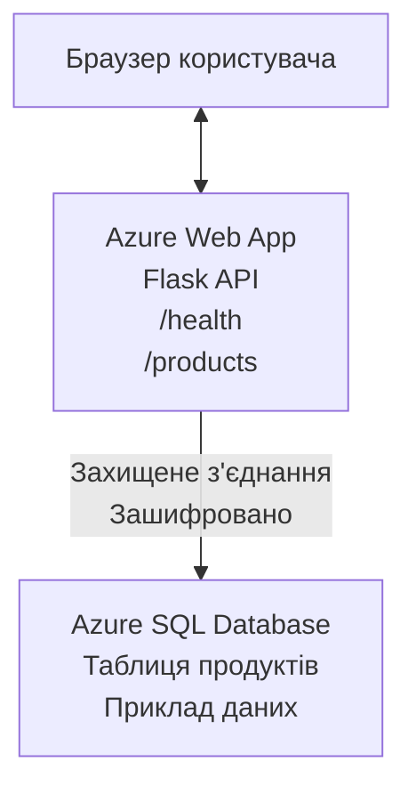

# Розгортання бази даних Microsoft SQL та веб-застосунку з AZD

⏱️ **Оцінковий час**: 20-30 хвилин | 💰 **Приблизна вартість**: ~$15-25/місяць | ⭐ **Складність**: Середній рівень

Цей **повний, робочий приклад** демонструє, як використовувати [Azure Developer CLI (azd)](https://learn.microsoft.com/azure/developer/azure-developer-cli/) для розгортання веб-застосунку Python Flask з базою даних Microsoft SQL на Azure. Усі коди включені та протестовані — зовнішні залежності не потрібні.

## Чого ви навчитеся

Виконавши цей приклад, ви зможете:
- Розгортати багаторівневий додаток (веб-застосунок + базу даних) за допомогою інфраструктури як коду
- Налаштовувати безпечні з’єднання з базою даних без жорстко закодованих секретів
- Моніторити стан застосунку за допомогою Application Insights
- Ефективно керувати ресурсами Azure з CLI AZD
- Дотримуватися найкращих практик Azure з безпеки, оптимізації вартості та спостережуваності

## Огляд сценарію
- **Веб-застосунок**: Python Flask REST API з підключенням до бази даних
- **База даних**: Azure SQL Database з прикладовими даними
- **Інфраструктура**: створена за допомогою Bicep (модульні, багаторазові шаблони)
- **Розгортання**: повністю автоматизоване командами `azd`
- **Моніторинг**: Application Insights для логів і телеметрії

## Передумови

### Необхідні інструменти

Перед початком переконайтеся, що у вас встановлені ці інструменти:

1. **[Azure CLI](https://learn.microsoft.com/cli/azure/install-azure-cli)** (версія 2.50.0 або вище)
   ```sh
   az --version
   # Очікуваний результат: azure-cli 2.50.0 або вище
   ```

2. **[Azure Developer CLI (azd)](https://learn.microsoft.com/azure/developer/azure-developer-cli/install-azd)** (версія 1.0.0 або вище)
   ```sh
   azd version
   # Очікуваний результат: версія azd 1.0.0 або вище
   ```

3. **[Python 3.8+](https://www.python.org/downloads/)** (для локальної розробки)
   ```sh
   python --version
   # Очікуваний результат: Python 3.8 або вище
   ```

4. **[Docker](https://www.docker.com/get-started)** (опціонально, для локальної розробки в контейнері)
   ```sh
   docker --version
   # Очікуваний результат: версія Docker 20.10 або вище
   ```

### Вимоги Azure

- Активна **підписка Azure** ([створіть безкоштовний акаунт](https://azure.microsoft.com/free/))
- Права на створення ресурсів у вашій підписці
- Роль **Owner** або **Contributor** у підписці або в групі ресурсів

### Необхідні знання

Це приклад **середнього рівня**. Ви повинні знати:
- Основи роботи з командним рядком
- Основні концепції хмари (ресурси, групи ресурсів)
- Базове розуміння веб-застосунків і баз даних

**Новачок в AZD?** Почніть зі [керівництва для початківців](../../docs/chapter-01-foundation/azd-basics.md).

## Архітектура

Цей приклад розгортає двошарову архітектуру з веб-застосунком і SQL-базою даних:



**Розгортання ресурсів:**
- **Група ресурсів**: контейнер для всіх ресурсів
- **App Service Plan**: Linux-хостинг ( рівень B1 для економії)
- **Веб-застосунок**: Python 3.11 з Flask-додатком
- **SQL Server**: керований сервер з мінімальним TLS 1.2
- **SQL Database**: базовий рівень (2 ГБ, підходить для розробки/тестування)
- **Application Insights**: моніторинг і логування
- **Log Analytics Workspace**: централізоване сховище логів

**Аналогія**: уявіть це як ресторан (веб-застосунок) з морозильною камерою (базою даних). Клієнти роблять замовлення з меню (API-ендпоїнти), кухня (Flask-додаток) отримує інгредієнти (дані) з морозильної камери. Керівник ресторану (Application Insights) стежить за усім, що відбувається.

## Структура папок

Усі файли включені в цей приклад — зовнішніх залежностей немає:

```
examples/database-app/
│
├── README.md                    # This file
├── azure.yaml                   # AZD configuration file
├── .env.sample                  # Sample environment variables
├── .gitignore                   # Git ignore patterns
│
├── infra/                       # Infrastructure as Code (Bicep)
│   ├── main.bicep              # Main orchestration template
│   ├── abbreviations.json      # Azure naming conventions
│   └── resources/              # Modular resource templates
│       ├── sql-server.bicep    # SQL Server configuration
│       ├── sql-database.bicep  # Database configuration
│       ├── app-service-plan.bicep  # Hosting plan
│       ├── app-insights.bicep  # Monitoring setup
│       └── web-app.bicep       # Web application
│
└── src/
    └── web/                    # Application source code
        ├── app.py              # Flask REST API
        ├── requirements.txt    # Python dependencies
        └── Dockerfile          # Container definition
```

**Призначення файлів:**
- **azure.yaml**: визначає, що і куди розгортати через AZD
- **infra/main.bicep**: координує всі ресурси Azure
- **infra/resources/*.bicep**: опис окремих ресурсів (модульні для повторного використання)
- **src/web/app.py**: Flask-додаток з логікою бази даних
- **requirements.txt**: залежності Python-пакетів
- **Dockerfile**: інструкції для контейнеризації і розгортання

## Швидкий старт (покроково)

### Крок 1: Клонування та перехід до проекту

```sh
git clone https://github.com/microsoft/AZD-for-beginners.git
cd AZD-for-beginners/examples/database-app
```

**✓ Перевірка успіху**: Переконайтеся, що ви бачите `azure.yaml` та папку `infra/`:
```sh
ls
# Очікувано: README.md, azure.yaml, infra/, src/
```

### Крок 2: Автентифікація в Azure

```sh
azd auth login
```

Відкриється браузер для аутентифікації в Azure. Увійдіть за допомогою ваших облікових даних Azure.

**✓ Перевірка успіху**: ви повинні побачити:
```
Logged in to Azure.
```

### Крок 3: Ініціалізація середовища

```sh
azd init
```

**Що відбувається**: AZD створює локальну конфігурацію для вашого розгортання.

**Вас буде запрошено ввести**:
- **Ім’я середовища**: введіть коротке ім’я (наприклад, `dev`, `myapp`)
- **Підписка Azure**: оберіть підписку зі списку
- **Регіон Azure**: виберіть регіон (наприклад, `eastus`, `westeurope`)

**✓ Перевірка успіху**: ви повинні побачити:
```
SUCCESS: New project initialized!
```

### Крок 4: Підготовка ресурсів Azure

```sh
azd provision
```

**Що відбувається**: AZD розгортає усю інфраструктуру (займає 5-8 хвилин):
1. Створює групу ресурсів
2. Створює SQL Server та базу даних
3. Створює App Service Plan
4. Створює веб-застосунок
5. Створює Application Insights
6. Налаштовує мережу та безпеку

**Вас буде запрошено ввести**:
- **Ім’я адміністратора SQL**: введіть ім’я користувача (наприклад, `sqladmin`)
- **Пароль адміністратора SQL**: введіть надійний пароль (запам’ятайте його!)

**✓ Перевірка успіху**: ви повинні побачити:
```
SUCCESS: Your application was provisioned in Azure in X minutes Y seconds.
You can view the resources created under the resource group rg-<env-name> in Azure Portal:
https://portal.azure.com/#@/resource/subscriptions/.../resourceGroups/rg-<env-name>
```

**⏱️ Час**: 5-8 хвилин

### Крок 5: Розгортання застосунку

```sh
azd deploy
```

**Що відбувається**: AZD збирає та розгортає ваш Flask-застосунок:
1. Пакує Python-застосунок
2. Створює Docker-контейнер
3. Відправляє до Azure Web App
4. Ініціалізує базу даних прикладовими даними
5. Запускає застосунок

**✓ Перевірка успіху**: ви повинні побачити:
```
SUCCESS: Your application was deployed to Azure in X minutes Y seconds.
You can view the resources created under the resource group rg-<env-name> in Azure Portal:
https://portal.azure.com/#@/resource/subscriptions/.../resourceGroups/rg-<env-name>
```

**⏱️ Час**: 3-5 хвилин

### Крок 6: Перегляд застосунку

```sh
azd browse
```

Відкриває ваш розгорнутий веб-застосунок у браузері за адресою `https://app-<unique-id>.azurewebsites.net`

**✓ Перевірка успіху**: ви повинні бачити JSON-вивід:
```json
{
  "message": "Welcome to the Database App API",
  "endpoints": {
    "/": "This help message",
    "/health": "Health check endpoint",
    "/products": "List all products",
    "/products/<id>": "Get product by ID"
  }
}
```

### Крок 7: Тестування API-ендпоїнтів

**Перевірка здоров’я** (перевірка підключення до бази):
```sh
curl https://app-<your-id>.azurewebsites.net/health
```

**Очікувана відповідь**:
```json
{
  "status": "healthy",
  "database": "connected"
}
```

**Список продуктів** (прикладові дані):
```sh
curl https://app-<your-id>.azurewebsites.net/products
```

**Очікувана відповідь**:
```json
[
  {
    "id": 1,
    "name": "Laptop",
    "description": "High-performance laptop",
    "price": 1299.99,
    "created_at": "2025-11-19T10:30:00"
  },
  ...
]
```

**Отримати один продукт**:
```sh
curl https://app-<your-id>.azurewebsites.net/products/1
```

**✓ Перевірка успіху**: Усі ендпоїнти повертають JSON без помилок.

---

**🎉 Вітаємо!** Ви успішно розгорнули веб-застосунок із базою даних на Azure за допомогою AZD.

## Детальна конфігурація

### Змінні середовища

Секрети безпечно зберігаються у конфігурації Azure App Service — **ніколи не жорстко в коді**.

**Автоматично налаштовуються AZD**:
- `SQL_CONNECTION_STRING`: рядок підключення до бази з зашифрованими даними аутентифікації
- `APPLICATIONINSIGHTS_CONNECTION_STRING`: кінцева точка телеметрії моніторингу
- `SCM_DO_BUILD_DURING_DEPLOYMENT`: дозволяє автовстановлення залежностей при розгортанні

**Де зберігаються секрети**:
1. Під час `azd provision` ви вводите SQL-креденшіали через безпечні запити
2. AZD зберігає їх у локальному файлі `.azure/<env-name>/.env` (до якого не зафіксовані в Git)
3. AZD передає їх у конфігурацію Azure App Service (шифровано на диску)
4. Застосунок зчитує їх через `os.getenv()` під час виконання

### Локальна розробка

Для локального тестування створіть .env-файл з прикладу:

```sh
cp .env.sample .env
# Відредагуйте .env з підключенням до вашої локальної бази даних
```

**Локальний робочий процес**:
```sh
# Встановити залежності
cd src/web
pip install -r requirements.txt

# Встановити змінні середовища
export SQL_CONNECTION_STRING="your-local-connection-string"

# Запустити застосунок
python app.py
```

**Тестування локально**:
```sh
curl http://localhost:8000/health
# Очікувано: {"status": "healthy", "database": "connected"}
```

### Інфраструктура як код

Усі ресурси Azure описані у **Bicep-шаблонах** в папці `infra/`:

- **Модульний дизайн**: кожен тип ресурсу - окремий файл для повторного використання
- **Параметризований**: налаштування SKU, регіонів, імен
- **Найкращі практики**: відповідає стандартам найменування та безпеки Azure
- **Контроль версій**: зміни інфраструктури відслідковуються в Git

**Приклад налаштування**:
Щоб змінити рівень бази даних, відредагуйте `infra/resources/sql-database.bicep`:
```bicep
sku: {
  name: 'Standard'  // Changed from 'Basic'
  tier: 'Standard'
  capacity: 10
}
```

## Найкращі практики безпеки

Цей приклад дотримується найкращих практик безпеки Azure:

### 1. **Без секретів у коді**
- ✅ Креденшіали зберігаються у конфігурації Azure App Service (шифровано)
- ✅ `.env` файли виключені з Git через `.gitignore`
- ✅ Секрети передаються через безпечні параметри під час підготовки

### 2. **Зашифровані з’єднання**
- ✅ TLS 1.2 або вище для SQL Server
- ✅ Примусове HTTPS для веб-застосунку
- ✅ З’єднання з базою даних використовують зашифровані канали

### 3. **Мережева безпека**
- ✅ Брандмауер SQL Server налаштований на дозвіл лише сервісів Azure
- ✅ Обмежений публічний доступ (можна додатково обмежити Private Endpoints)
- ✅ Відключено FTPS на Web App

### 4. **Аутентифікація та авторизація**
- ⚠️ **Поточна**: SQL-аутентифікація (логін/пароль)
- ✅ **Рекомендація для продакшену**: Використовувати Managed Identity Azure для безпарольної аутентифікації

**Для переходу на Managed Identity** (для продакшену):
1. Увімкніть Managed Identity у Web App
2. Надання ідентифікатору прав на SQL
3. Оновіть рядок підключення на використання Managed Identity
4. Приберіть аутентифікацію на основі пароля

### 5. **Аудит і відповідність**
- ✅ Application Insights логує всі запити та помилки
- ✅ Увімкнено аудит SQL Database (можна налаштувати для відповідності)
- ✅ Усі ресурси мають теги для управління

**Чеклист безпеки перед запуском у продакшен**:
- [ ] Увімкнути Azure Defender для SQL
- [ ] Налаштувати Private Endpoints для SQL Database
- [ ] Увімкнути Web Application Firewall (WAF)
- [ ] Використати Azure Key Vault для ротації секретів
- [ ] Налаштувати автентифікацію Microsoft Entra ID
- [ ] Увімкнути діагностичне логування для всіх ресурсів

## Оптимізація вартості

**Оцінкові місячні витрати** (станом на листопад 2025):

| Ресурс | SKU/Рівень | Приблизна вартість |
|--------|------------|--------------------|
| App Service Plan | B1 (Basic) | ~$13/місяць |
| SQL Database | Basic (2ГБ) | ~$5/місяць |
| Application Insights | Оплата за використання | ~$2/місяць (низький трафік) |
| **Всього** | | **~$20/місяць** |

**💡 Поради для економії**:

1. **Використовуйте безкоштовний рівень для навчання**:
   - App Service: рівень F1 (безкоштовний, обмежена кількість годин)
   - SQL Database: використовуйте серверлес Azure SQL Database
   - Application Insights: 5 ГБ/місяць безкоштовного збору

2. **Зупиняйте ресурси, коли не використовуєте**:
   ```sh
   # Зупинити веб-застосунок (база даних все ще стягує плату)
   az webapp stop --name <app-name> --resource-group <rg-name>
   
   # Перезапустити за потребою
   az webapp start --name <app-name> --resource-group <rg-name>
   ```

3. **Видаляйте всі ресурси після тестування**:
   ```sh
   azd down
   ```
   Це видалить ВСІ ресурси та припинить нарахування плати.

4. **SKU для розробки та продакшену**:
   - **Розробка**: базовий рівень (використовується в цьому прикладі)
   - **Продакшен**: стандартний/преміум рівень з резервуванням

**Моніторинг вартості**:
- Переглядайте витрати через [Azure Cost Management](https://portal.azure.com/#view/Microsoft_Azure_CostManagement)
- Встановлюйте оповіщення про вартість, щоб уникати несподіванок
- Тегуйте всі ресурси тегом `azd-env-name` для відстеження

**Альтернатива безкоштовного рівня**:
Для навчальних цілей змініть `infra/resources/app-service-plan.bicep`:
```bicep
sku: {
  name: 'F1'  // Free tier
  tier: 'Free'
}
```
**Примітка**: безкоштовний рівень має обмеження (60 хв CPU на день, немає always-on).

## Моніторинг та спостережуваність

### Інтеграція з Application Insights

У цьому прикладі використовується **Application Insights** для всебічного моніторингу:

**Що моніториться**:
- ✅ HTTP-запити (затримка, коди стану, ендпоїнти)
- ✅ Помилки та виключення додатку
- ✅ Користувацькі логи з Flask-застосунку
- ✅ Стан з'єднання з базою даних
- ✅ Метрики продуктивності (CPU, пам'ять)

**Як отримати доступ до Application Insights**:
1. Відкрийте [Azure Portal](https://portal.azure.com)
2. Перейдіть до групи ресурсів (`rg-<env-name>`)
3. Клацніть на ресурс Application Insights (`appi-<unique-id>`)

**Корисні запити** (Application Insights → Logs):

**Переглянути всі запити**:
```kusto
requests
| where timestamp > ago(1h)
| order by timestamp desc
| project timestamp, name, url, resultCode, duration
```

**Знайти помилки**:
```kusto
exceptions
| where timestamp > ago(24h)
| order by timestamp desc
| project timestamp, type, outerMessage, operation_Name
```

**Перевірити ендпоїнт здоров’я**:
```kusto
requests
| where name contains "health"
| summarize count() by resultCode, bin(timestamp, 1h)
```

### Аудит SQL Database

**Аудит SQL Database увімкнено** для відстеження:
- Патернів доступу до бази даних
- Невдалих спроб входу
- Змін у схемі
- Доступу до даних (для відповідності)

**Доступ до логів аудиту**:
1. Azure Portal → SQL Database → Auditing
2. Переглядайте логи у Log Analytics workspace

### Моніторинг у реальному часі

**Перегляд живих метрик**:
1. Application Insights → Live Metrics
2. Спостерігайте за запитами, відмовами та продуктивністю у реальному часі

**Налаштування сповіщень**:
Створюйте сповіщення для критичних подій:
- Помилки HTTP 500 > 5 за 5 хвилин
- Збої з'єднання з базою даних
- Високий час відповіді (>2 секунди)

**Приклад створення сповіщення**:
```sh
az monitor metrics alert create \
  --name "High-Response-Time" \
  --resource-group <rg-name> \
  --scopes <app-insights-resource-id> \
  --condition "avg requests/duration > 2000" \
  --description "Alert when response time exceeds 2 seconds"
```

## Усунення несправностей
### Звичайні проблеми та їх вирішення

#### 1. `azd provision` не вдається з помилкою "Location not available"

**Симптом**:
```
Error: The subscription is not registered for the resource type 'components' in the location 'centralus'.
```

**Рішення**:
Оберіть інший регіон Azure або зареєструйте провайдера ресурсів:
```sh
az provider register --namespace Microsoft.Insights
```

#### 2. Відмова підключення до SQL під час розгортання

**Симптом**:
```
pyodbc.OperationalError: ('08001', '[08001] [Microsoft][ODBC Driver 18 for SQL Server]TCP Provider...')
```

**Рішення**:
- Перевірте, чи брандмауер SQL Server дозволяє служби Azure (зазвичай налаштовується автоматично)
- Перевірте правильність введення пароля адміністратора SQL під час `azd provision`
- Переконайтесь, що SQL Server повністю налаштований (може зайняти 2-3 хвилини)

**Перевірка підключення**:
```sh
# У порталі Azure перейдіть до SQL Database → Query editor
# Спробуйте підключитися за допомогою своїх облікових даних
```

#### 3. Веб-додаток показує "Application Error"

**Симптом**:
Браузер показує загальну сторінку помилки.

**Рішення**:
Перевірте логи додатку:
```sh
# Переглянути останні журнали
az webapp log tail --name <app-name> --resource-group <rg-name>
```

**Поширені причини**:
- Відсутні змінні середовища (перевірте App Service → Configuration)
- Не вдалося встановити пакети Python (перевірте логи розгортання)
- Помилка ініціалізації бази даних (перевірте підключення до SQL)

#### 4. `azd deploy` не вдається з помилкою "Build Error"

**Симптом**:
```
Error: Failed to build project
```

**Рішення**:
- Переконайтеся, що в `requirements.txt` немає синтаксичних помилок
- Перевірте, що Python 3.11 вказаний у `infra/resources/web-app.bicep`
- Перевірте Dockerfile — правильна базова image

**Локальне налагодження**:
```sh
cd src/web
docker build -t test-app .
docker run -p 8000:8000 test-app
```

#### 5. "Unauthorized" при запуску команд AZD

**Симптом**:
```
ERROR: (Unauthorized) The client '<id>' with object id '<id>' does not have authorization
```

**Рішення**:
Виконайте повторну автентифікацію в Azure:
```sh
# Потрібно для робочих процесів AZD
azd auth login

# Необов’язково, якщо ви також використовуєте команди Azure CLI безпосередньо
az login
```

Перевірте, що маєте відповідні права (роль Contributor) на підписці.

#### 6. Високі витрати на базу даних

**Симптом**:
Неочікуваний рахунок Azure.

**Рішення**:
- Перевірте, чи забули запустити `azd down` після тестування
- Переконайтеся, що SQL Database використовує рівень Basic (не Premium)
- Перегляньте витрати в Azure Cost Management
- Налаштуйте оповіщення про вартість

### Отримання допомоги

**Переглянути всі змінні навколишнього середовища AZD**:
```sh
azd env get-values
```

**Перевірити статус розгортання**:
```sh
az webapp show --name <app-name> --resource-group <rg-name> --query state
```

**Отримати логи додатку**:
```sh
az webapp log download --name <app-name> --resource-group <rg-name> --log-file app-logs.zip
```

**Потрібна додаткова допомога?**
- [Керівництво з усунення неполадок AZD](../../docs/chapter-07-troubleshooting/common-issues.md)
- [Виправлення проблем Azure App Service](https://learn.microsoft.com/azure/app-service/troubleshoot-diagnostic-logs)
- [Виправлення проблем Azure SQL](https://learn.microsoft.com/azure/azure-sql/database/troubleshoot-common-errors-issues)

## Практичні вправи

### Вправа 1: Перевірте своє розгортання (Початковий рівень)

**Мета**: Підтвердити, що всі ресурси розгорнуті і додаток працює.

**Кроки**:
1. Перерахувати всі ресурси в групі ресурсів:
   ```sh
   az resource list --resource-group rg-<env-name> --output table
   ```
   **Очікувано**: 6-7 ресурсів (Web App, SQL Server, SQL Database, App Service Plan, Application Insights, Log Analytics)

2. Перевірити всі API кінцеві точки:
   ```sh
   curl https://app-<your-id>.azurewebsites.net/
   curl https://app-<your-id>.azurewebsites.net/health
   curl https://app-<your-id>.azurewebsites.net/products
   curl https://app-<your-id>.azurewebsites.net/products/1
   ```
   **Очікувано**: Усі повертають валідний JSON без помилок

3. Перевірити Application Insights:
   - Перейти до Application Insights у порталі Azure
   - Відкрити "Live Metrics"
   - Оновити сторінку веб-додатку в браузері
   **Очікувано**: Запити бачаться в реальному часі

**Критерії успіху**: Всі 6-7 ресурсів існують, усі кінцеві точки повертають дані, Live Metrics показує активність.

---

### Вправа 2: Додати нову API кінцеву точку (Середній рівень)

**Мета**: Розширити Flask-додаток новою кінцевою точкою.

**Початковий код**: Поточні кінцеві точки в `src/web/app.py`

**Кроки**:
1. Відредагувати `src/web/app.py` та додати нову кінцеву точку після функції `get_product()`:
   ```python
   @app.route('/products/search/<keyword>')
   def search_products(keyword):
       """Search products by name or description."""
       try:
           conn = get_db_connection()
           cursor = conn.cursor()
           cursor.execute(
               "SELECT id, name, description, price, created_at FROM products WHERE name LIKE ? OR description LIKE ?",
               (f'%{keyword}%', f'%{keyword}%')
           )
           
           products = []
           for row in cursor.fetchall():
               products.append({
                   'id': row[0],
                   'name': row[1],
                   'description': row[2],
                   'price': float(row[3]) if row[3] else None,
                   'created_at': row[4].isoformat() if row[4] else None
               })
           
           cursor.close()
           conn.close()
           
           logger.info(f"Search for '{keyword}' returned {len(products)} results")
           return jsonify(products), 200
           
       except Exception as e:
           logger.error(f"Error searching products: {str(e)}")
           return jsonify({'error': str(e)}), 500
   ```

2. Розгорнути оновлений додаток:
   ```sh
   azd deploy
   ```

3. Перевірити нову кінцеву точку:
   ```sh
   curl https://app-<your-id>.azurewebsites.net/products/search/laptop
   ```
   **Очікувано**: Повертає продукти, що відповідають "laptop"

**Критерії успіху**: Нова кінцева точка працює, повертає відфільтровані результати, з’являється в логах Application Insights.

---

### Вправа 3: Налаштувати моніторинг і оповіщення (Просунутий рівень)

**Мета**: Налаштувати активний моніторинг з оповіщеннями.

**Кроки**:
1. Створити оповіщення для HTTP помилок 500:
   ```sh
   # Отримати ідентифікатор ресурсу Application Insights
   AI_ID=$(az monitor app-insights component show \
     --app appi-<your-id> \
     --resource-group rg-<env-name> \
     --query id -o tsv)
   
   # Створити сповіщення
   az monitor metrics alert create \
     --name "High-Error-Rate" \
     --resource-group rg-<env-name> \
     --scopes $AI_ID \
     --condition "count requests/failed > 5" \
     --window-size 5m \
     --evaluation-frequency 1m \
     --description "Alert when >5 failed requests in 5 minutes"
   ```

2. Викликати оповіщення, спричиняючи помилки:
   ```sh
   # Запит на неіснуючий продукт
   for i in {1..10}; do curl https://app-<your-id>.azurewebsites.net/products/999; done
   ```

3. Перевірити, чи спрацювало оповіщення:
   - Azure Portal → Alerts → Alert Rules
   - Перевірити пошту (якщо налаштовано)

**Критерії успіху**: Правило оповіщення створено, спрацьовує при помилках, сповіщення надходять.

---

### Вправа 4: Зміни в схемі бази даних (Просунутий рівень)

**Мета**: Додати нову таблицю і модифікувати додаток для її використання.

**Кроки**:
1. Підключитися до SQL Database через редактор запитів Azure Portal

2. Створити нову таблицю `categories`:
   ```sql
   CREATE TABLE categories (
       id INT PRIMARY KEY IDENTITY(1,1),
       name NVARCHAR(50) NOT NULL,
       description NVARCHAR(200)
   );
   
   INSERT INTO categories (name, description) VALUES
   ('Electronics', 'Electronic devices and accessories'),
   ('Office Supplies', 'Office equipment and supplies');
   
   -- Add category to products table
   ALTER TABLE products ADD category_id INT;
   UPDATE products SET category_id = 1; -- Set all to Electronics
   ```

3. Оновити `src/web/app.py`, щоб включити інформацію про категорії у відповіді

4. Розгорнути та протестувати

**Критерії успіху**: Нова таблиця існує, продукти показують інформацію про категорії, додаток працює коректно.

---

### Вправа 5: Реалізувати кешування (Експерт)

**Мета**: Додати Azure Redis Cache для покращення продуктивності.

**Кроки**:
1. Додати Redis Cache у `infra/main.bicep`
2. Оновити `src/web/app.py` для кешування запитів продуктів
3. Виміряти покращення продуктивності через Application Insights
4. Порівняти час відгуку до та після кешування

**Критерії успіху**: Redis розгорнуто, кешування працює, час відгуку покращено більш ніж на 50%.

**Підказка**: Почніть з [документації Azure Cache for Redis](https://learn.microsoft.com/azure/azure-cache-for-redis/).

---

## Очищення

Щоб уникнути подальших витрат, видаліть усі ресурси після завершення:

```sh
azd down
```

**Підтвердження**:
```
? Total resources to delete: 7, are you sure you want to continue? (y/N)
```

Введіть `y` для підтвердження.

**✓ Перевірка успіху**: 
- Всі ресурси видалені з Azure Portal
- Відсутні поточні витрати
- Локальна папка `.azure/<env-name>` може бути видалена

**Альтернатива** (залишити інфраструктуру, видалити дані):
```sh
# Видалити лише групу ресурсів (зберегти конфігурацію AZD)
az group delete --name rg-<env-name> --yes
```
## Дізнатись більше

### Пов’язана документація
- [Документація Azure Developer CLI](https://learn.microsoft.com/azure/developer/azure-developer-cli/)
- [Документація Azure SQL Database](https://learn.microsoft.com/azure/azure-sql/database/)
- [Документація Azure App Service](https://learn.microsoft.com/azure/app-service/)
- [Документація Application Insights](https://learn.microsoft.com/azure/azure-monitor/app/app-insights-overview)
- [Посилання на мову Bicep](https://learn.microsoft.com/azure/azure-resource-manager/bicep/)

### Наступні кроки в цьому курсі
- **[Приклад Container Apps](../../../../examples/container-app)**: Розгортання мікросервісів з Azure Container Apps
- **[Керівництво з інтеграції AI](../../../../docs/ai-foundry)**: Додати AI можливості до вашого додатку
- **[Кращі практики розгортання](../../docs/chapter-04-infrastructure/deployment-guide.md)**: Шаблони продуктивного розгортання

### Поглиблені теми
- **Керована ідентичність**: Забрати паролі та використовувати автентифікацію Microsoft Entra ID
- **Приватні кінцеві точки**: Захистити підключення до бази даних у віртуальній мережі
- **Інтеграція CI/CD**: Автоматизувати розгортання за допомогою GitHub Actions або Azure DevOps
- **Багатомовне середовище**: Налаштувати dev, staging та production середовища
- **Міграції бази даних**: Використовувати Alembic або Entity Framework для керування версіями схеми

### Порівняння з іншими підходами

**AZD vs. ARM Templates**:
- ✅ AZD: Вищий рівень абстракції, простіші команди
- ⚠️ ARM: Більш детальний, контроль на гранулярному рівні

**AZD vs. Terraform**:
- ✅ AZD: Нативний Azure, інтегрований із сервісами Azure
- ⚠️ Terraform: Підтримка мультихмарних середовищ, більша екосистема

**AZD vs. Портал Azure**:
- ✅ AZD: Повторюваний, контролюваний за версіями, автоматизований
- ⚠️ Портал: Ручні кліки, важко відтворити

**Думайте про AZD як про**: Docker Compose для Azure — спрощена конфігурація для складних розгортань.

---

## Часті питання

**П: Чи можна використовувати іншу мову програмування?**  
В: Так! Замініть `src/web/` на Node.js, C#, Go або будь-яку іншу мову. Оновіть `azure.yaml` і Bicep відповідно.

**П: Як додати більше баз даних?**  
В: Додайте ще один модуль SQL Database у `infra/main.bicep` або використовуйте PostgreSQL/MySQL з сервісів Azure Database.

**П: Чи можна використати це у продакшні?**  
В: Це точка старту. Для продакшн додайте: керовану ідентичність, приватні кінцеві точки, надлишковість, стратегію бекапу, WAF та розширений моніторинг.

**П: Що якщо хочу використовувати контейнери замість розгортання коду?**  
В: Перегляньте [Приклад Container Apps](../../../../examples/container-app) — він використовує Docker контейнери повністю.

**П: Як підключитися до бази даних з локальної машини?**  
В: Додайте свій IP у брандмауер SQL Server:
```sh
az sql server firewall-rule create \
  --resource-group rg-<env-name> \
  --server sql-<unique-id> \
  --name AllowMyIP \
  --start-ip-address <your-ip> \
  --end-ip-address <your-ip>
```

**П: Чи можна використати існуючу базу замість створення нової?**  
В: Так, змініть `infra/main.bicep`, щоб посилатися на існуючий SQL Server, та оновіть параметри рядка підключення.

---

> **Примітка:** Цей приклад демонструє кращі практики розгортання веб-додатку з базою даних за допомогою AZD. Він містить робочий код, детальну документацію та практичні вправи для кращого засвоєння. Для продакшн розгортань перегляньте вимоги до безпеки, масштабування, відповідності та витрат, специфічні для вашої організації.

**📚 Навігація курсу:**
- ← Попередній: [Приклад Container Apps](../../../../examples/container-app)
- → Наступний: [Керівництво з інтеграції AI](../../../../docs/ai-foundry)
- 🏠 [Головна сторінка курсу](../../README.md)

---

<!-- CO-OP TRANSLATOR DISCLAIMER START -->
**Відмова від відповідальності**:
Цей документ було перекладено за допомогою сервісу штучного інтелекту для перекладу [Co-op Translator](https://github.com/Azure/co-op-translator). Хоча ми прагнемо до точності, будь ласка, майте на увазі, що автоматичні переклади можуть містити помилки або неточності. Оригінальний документ рідною мовою слід вважати авторитетним джерелом. Для критично важливої інформації рекомендується професійний людський переклад. Ми не несемо відповідальності за будь-які непорозуміння або неправильні тлумачення, що виникли внаслідок використання цього перекладу.
<!-- CO-OP TRANSLATOR DISCLAIMER END -->