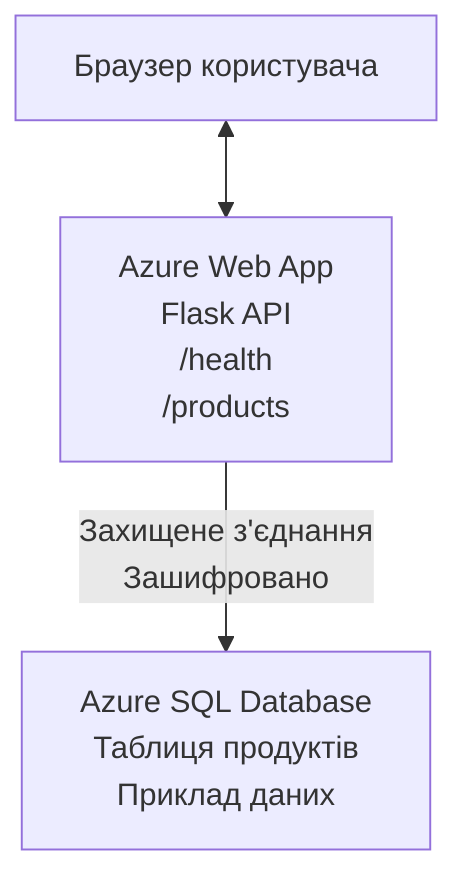

# Розгортання бази даних Microsoft SQL та веб-застосунку з AZD

⏱️ **Приблизний час**: 20-30 хвилин | 💰 **Приблизна вартість**: ~$15-25/місяць | ⭐ **Складність**: Середній рівень

Цей **повний, робочий приклад** демонструє, як використовувати [Azure Developer CLI (azd)](https://learn.microsoft.com/azure/developer/azure-developer-cli/) для розгортання веб-застосунку Python Flask із базою даних Microsoft SQL в Azure. Весь код включено і протестовано — зовнішні залежності не потрібні.

## Чого ви навчитесь

Виконавши цей приклад, ви:
- Розгортатимете багаторівневий застосунок (веб-застосунок + база даних) за допомогою інфраструктури як коду
- Налаштовуватимете безпечні з’єднання з базою даних без жорсткого кодування секретів
- Слідкуватимете за здоров’ям застосунку з Application Insights
- Ефективно керуватимете ресурсами Azure за допомогою AZD CLI
- Дотримуватиметесь найкращих практик Azure для безпеки, оптимізації витрат і моніторингу

## Огляд сценарію
- **Веб-застосунок**: Python Flask REST API з підключенням до бази даних
- **База даних**: Azure SQL Database із прикладами даних
- **Інфраструктура**: Надається за допомогою Bicep (модульні, повторно використовувані шаблони)
- **Розгортання**: Повністю автоматизоване за допомогою команд `azd`
- **Моніторинг**: Application Insights для логів і телеметрії

## Вимоги

### Встановлені інструменти

Перед початком переконайтеся, що у вас встановлені ці інструменти:

1. **[Azure CLI](https://learn.microsoft.com/cli/azure/install-azure-cli)** (версія 2.50.0 або новіша)
   ```sh
   az --version
   # Очікуваний результат: azure-cli 2.50.0 або новіша версія
   ```

2. **[Azure Developer CLI (azd)](https://learn.microsoft.com/azure/developer/azure-developer-cli/install-azd)** (версія 1.0.0 або новіша)
   ```sh
   azd version
   # Очікуваний результат: азд версія 1.0.0 або вище
   ```

3. **[Python 3.8+](https://www.python.org/downloads/)** (для локальної розробки)
   ```sh
   python --version
   # Очікуваний результат: Python 3.8 або вище
   ```

4. **[Docker](https://www.docker.com/get-started)** (за бажанням, для локальної контейнерної розробки)
   ```sh
   docker --version
   # Очікуваний результат: версія Docker 20.10 або новіша
   ```

### Вимоги Azure

- Активна **підписка Azure** ([створити безкоштовний обліковий запис](https://azure.microsoft.com/free/))
- Права на створення ресурсів у підписці
- Роль **Власник** або **Учасник** у підписці або в групі ресурсів

### Початкові знання

Цей приклад призначений для **середнього рівня**. Ви маєте знати:
- Основи роботи з командним рядком
- Основні поняття хмари (ресурси, групи ресурсів)
- Базове розуміння веб-застосунків і баз даних

**Новачок в AZD?** Почніть із [керівництва для початківців](../../docs/chapter-01-foundation/azd-basics.md).

## Архітектура

Цей приклад розгортає двошарову архітектуру з веб-застосунком і SQL базою даних:


**Розгортання ресурсів:**
- **Група ресурсів**: Контейнер для всіх ресурсів
- **App Service Plan**: Хостинг на Linux (рівень B1 для економії коштів)
- **Веб-застосунок**: Виконувальне середовище Python 3.11 з Flask-застосунком
- **SQL Server**: Керований сервер бази даних з TLS 1.2 мінімум
- **SQL Database**: Базовий рівень (2GB, для розробки/тестування)
- **Application Insights**: Моніторинг і логування
- **Log Analytics Workspace**: Централізоване сховище логів

**Аналогія**: Уявіть ресторан (веб-застосунок) з морозильною камерою (база даних). Клієнти замовляють з меню (API), а кухня (Flask-застосунок) отримує інгредієнти (дані) з морозилки. Менеджер ресторану (Application Insights) відстежує все, що відбувається.

## Структура папок

Усі файли включені в цей приклад — зовнішні залежності не потрібні:

```
examples/database-app/
│
├── README.md                    # This file
├── azure.yaml                   # AZD configuration file
├── .env.sample                  # Sample environment variables
├── .gitignore                   # Git ignore patterns
│
├── infra/                       # Infrastructure as Code (Bicep)
│   ├── main.bicep              # Main orchestration template
│   ├── abbreviations.json      # Azure naming conventions
│   └── resources/              # Modular resource templates
│       ├── sql-server.bicep    # SQL Server configuration
│       ├── sql-database.bicep  # Database configuration
│       ├── app-service-plan.bicep  # Hosting plan
│       ├── app-insights.bicep  # Monitoring setup
│       └── web-app.bicep       # Web application
│
└── src/
    └── web/                    # Application source code
        ├── app.py              # Flask REST API
        ├── requirements.txt    # Python dependencies
        └── Dockerfile          # Container definition
```

**Призначення файлів:**
- **azure.yaml**: Вказує AZD що і де розгортати
- **infra/main.bicep**: Організує всі ресурси Azure
- **infra/resources/*.bicep**: Визначення окремих ресурсів (модульні для повторного використання)
- **src/web/app.py**: Flask-застосунок з логікою бази даних
- **requirements.txt**: Залежності Python
- **Dockerfile**: Інструкції для контейнеризації і розгортання

## Швидкий старт (покроково)

### Крок 1: Клонувати та перейти

```sh
git clone https://github.com/microsoft/AZD-for-beginners.git
cd AZD-for-beginners/examples/database-app
```

**✓ Успішно**: Переконайтесь, що бачите `azure.yaml` і папку `infra/`:
```sh
ls
# Очікується: README.md, azure.yaml, infra/, src/
```

### Крок 2: Аутентифікація в Azure

```sh
azd auth login
```

Відкриється браузер для автентифікації Azure. Увійдіть під своїми обліковими даними Azure.

**✓ Успішно**: Ви побачите:
```
Logged in to Azure.
```

### Крок 3: Ініціалізація середовища

```sh
azd init
```

**Що відбувається**: AZD створює локальні налаштування для розгортання.

**Запити, які з’являться**:
- **Назва середовища**: Введіть коротке ім’я (наприклад, `dev`, `myapp`)
- **Підписка Azure**: Оберіть підписку зі списку
- **Регіон Azure**: Виберіть регіон (наприклад, `eastus`, `westeurope`)

**✓ Успішно**: Ви побачите:
```
SUCCESS: New project initialized!
```

### Крок 4: Надаємо ресурси Azure

```sh
azd provision
```

**Що відбувається**: AZD розгортає всю інфраструктуру (5-8 хвилин):
1. Створює групу ресурсів
2. Створює SQL сервер і базу даних
3. Створює план App Service
4. Створює веб-застосунок
5. Створює Application Insights
6. Налаштовує мережу та безпеку

**Вас попросять ввести**:
- **Ім’я адміністратора SQL**: Введіть ім’я користувача (наприклад, `sqladmin`)
- **Пароль адміністратора SQL**: Введіть надійний пароль (запам’ятайте!)

**✓ Успішно**: Ви маєте побачити:
```
SUCCESS: Your application was provisioned in Azure in X minutes Y seconds.
You can view the resources created under the resource group rg-<env-name> in Azure Portal:
https://portal.azure.com/#@/resource/subscriptions/.../resourceGroups/rg-<env-name>
```

**⏱️ Час**: 5-8 хвилин

### Крок 5: Розгортання застосунку

```sh
azd deploy
```

**Що відбувається**: AZD збирає і розгортає ваш Flask-застосунок:
1. Пакує Python-застосунок
2. Збирає Docker-контейнер
3. Завантажує до Azure Web App
4. Ініціалізує базу даних з прикладними даними
5. Запускає застосунок

**✓ Успішно**: Ви побачите:
```
SUCCESS: Your application was deployed to Azure in X minutes Y seconds.
You can view the resources created under the resource group rg-<env-name> in Azure Portal:
https://portal.azure.com/#@/resource/subscriptions/.../resourceGroups/rg-<env-name>
```

**⏱️ Час**: 3-5 хвилин

### Крок 6: Перегляд застосунку

```sh
azd browse
```

Відкриється ваш розгорнутий веб-застосунок у браузері за адресою `https://app-<unique-id>.azurewebsites.net`

**✓ Успішно**: Ви побачите вивід у форматі JSON:
```json
{
  "message": "Welcome to the Database App API",
  "endpoints": {
    "/": "This help message",
    "/health": "Health check endpoint",
    "/products": "List all products",
    "/products/<id>": "Get product by ID"
  }
}
```

### Крок 7: Тестування API

**Перевірка стану здоров’я** (перевірка підключення до бази):
```sh
curl https://app-<your-id>.azurewebsites.net/health
```

**Очікувана відповідь**:
```json
{
  "status": "healthy",
  "database": "connected"
}
```

**Список продуктів** (приклад даних):
```sh
curl https://app-<your-id>.azurewebsites.net/products
```

**Очікувана відповідь**:
```json
[
  {
    "id": 1,
    "name": "Laptop",
    "description": "High-performance laptop",
    "price": 1299.99,
    "created_at": "2025-11-19T10:30:00"
  },
  ...
]
```

**Отримання одного продукту**:
```sh
curl https://app-<your-id>.azurewebsites.net/products/1
```

**✓ Успішно**: Всі кінцеві точки повертають JSON без помилок.

---

**🎉 Вітаємо!** Ви успішно розгорнули веб-застосунок з базою даних в Azure за допомогою AZD.

## Глибше про конфігурацію

### Змінні середовища

Секрети безпечно зберігаються в конфігурації Azure App Service — **ніколи не закодовані в коді**.

**Автоматично налаштовується AZD**:
- `SQL_CONNECTION_STRING`: Рядок підключення до бази з зашифрованими даними
- `APPLICATIONINSIGHTS_CONNECTION_STRING`: Точка моніторингу телеметрії
- `SCM_DO_BUILD_DURING_DEPLOYMENT`: Активує автоматичне встановлення залежностей

**Де зберігаються секрети**:
1. Під час `azd provision` ви вводите облікові дані для SQL через безпечні запити
2. AZD зберігає їх у локальному файлі `.azure/<env-name>/.env` (ігнорується Git)
3. AZD додає їх у конфігурацію Azure App Service (шифруються в стані спокою)
4. Застосунок читає їх через `os.getenv()` під час виконання

### Локальна розробка

Для локального тестування створіть `.env` файл з прикладом:

```sh
cp .env.sample .env
# Відредагуйте .env з підключенням до вашої локальної бази даних
```

**Робочий процес локальної розробки**:
```sh
# Встановити залежності
cd src/web
pip install -r requirements.txt

# Встановити змінні середовища
export SQL_CONNECTION_STRING="your-local-connection-string"

# Запустити додаток
python app.py
```

**Тестування локально**:
```sh
curl http://localhost:8000/health
# Очікувано: {"status": "здоровий", "database": "підключено"}
```

### Інфраструктура як код

Всі ресурси Azure визначені у **шаблонах Bicep** (папка `infra/`):

- **Модульний дизайн**: Кожен тип ресурсу у власному файлі для повторного використання
- **Параметризований**: Легко налаштувати SKU, регіони, іменування
- **Найкращі практики**: Відповідає стандартам Azure з безпеки та іменування
- **Контроль версій**: Зміни інфраструктури відслідковуються в Git

**Приклад налаштування**:
Щоб змінити рівень бази даних, відредагуйте `infra/resources/sql-database.bicep`:
```bicep
sku: {
  name: 'Standard'  // Changed from 'Basic'
  tier: 'Standard'
  capacity: 10
}
```

## Найкращі практики безпеки

Цей приклад дотримується найкращих практик безпеки Azure:

### 1. **Без секретів у коді**
- ✅ Облікові дані зберігаються в конфігурації Azure App Service (зашифровані)
- ✅ Файли `.env` виключені з Git через `.gitignore`
- ✅ Секрети передаються через захищені параметри під час розгортання

### 2. **Зашифровані з’єднання**
- ✅ TLS 1.2 мінімум для SQL сервера
- ✅ Веб-застосунок змушений використовувати HTTPS
- ✅ Підключення до бази використовує зашифровані канали

### 3. **Безпека мережі**
- ✅ Фаєрвол SQL-сервера налаштований на дозвіл лише для сервісів Azure
- ✅ Доступ з публічної мережі обмежений (можна додатково захистити приватними кінцевими точками)
- ✅ FTPS вимкнено для Web App

### 4. **Аутентифікація та авторизація**
- ⚠️ **Поточний стан**: SQL-аутентифікація (ім’я користувача/пароль)
- ✅ **Рекомендація для продуктиву**: використовуйте Azure Managed Identity для безпарольної аутентифікації

**Щоб перейти на Managed Identity** (для продакшена):
1. Увімкніть керовану ідентичність у Web App
2. Надання прав ідентичності на SQL
3. Оновіть рядок підключення для Managed Identity
4. Видаліть парольну аутентифікацію

### 5. **Аудит і відповідність**
- ✅ Application Insights логують усі запити та помилки
- ✅ Включено аудит SQL Database (можна налаштувати для відповідності)
- ✅ Усі ресурси з тегами для керування

**Перевірка безпеки перед продуктивом**:
- [ ] Увімкнути Azure Defender для SQL
- [ ] Налаштувати Private Endpoints для SQL Database
- [ ] Включити Web Application Firewall (WAF)
- [ ] Реалізувати Azure Key Vault для ротації секретів
- [ ] Налаштувати аутентифікацію Azure AD
- [ ] Увімкнути діагностичне логування для всіх ресурсів

## Оптимізація витрат

**Орієнтовні місячні витрати** (на листопад 2025):

| Ресурс | SKU/Рівень | Орієнтовна вартість |
|----------|----------|-------------------|
| App Service Plan | B1 (Базовий) | ~$13/місяць |
| SQL Database | Basic (2GB) | ~$5/місяць |
| Application Insights | Оплата за використання | ~$2/місяць (низький трафік) |
| **Всього** | | **~$20/місяць** |

**💡 Поради щодо економії**:

1. **Використовуйте безкоштовний рівень для навчання**:
   - App Service: рівень F1 (безкоштовно, обмежена кількість годин)
   - SQL Database: використовуйте безсерверний режим Azure SQL Database
   - Application Insights: 5 ГБ безкоштовний обсяг за місяць

2. **Зупиняйте ресурси, коли не використовуєте**:
   ```sh
   # Зупинити веб-додаток (база даних все ще нараховує плату)
   az webapp stop --name <app-name> --resource-group <rg-name>
   
   # Перезапустіть за потребою
   az webapp start --name <app-name> --resource-group <rg-name>
   ```

3. **Видаляйте всі ресурси після тестування**:
   ```sh
   azd down
   ```
   Це усуне всі ресурси і припинить нарахування коштів.

4. **SKU для розробки та продуктиву**:
   - **Розробка**: Базовий рівень (як у цьому прикладі)
   - **Продуктив**: Стандартний/Преміум із резервуванням

**Моніторинг витрат**:
- Переглядайте витрати в [Azure Cost Management](https://portal.azure.com/#view/Microsoft_Azure_CostManagement)
- Налаштовуйте оповіщення про витрати, щоб уникнути несподіванок
- Тегуйте всі ресурси з `azd-env-name` для звітності

**Альтернатива безкоштовного рівня**:
Для навчання відредагуйте `infra/resources/app-service-plan.bicep`:
```bicep
sku: {
  name: 'F1'  // Free tier
  tier: 'Free'
}
```
**Примітка**: безкоштовний рівень має обмеження (60 хв/день CPU, без always-on).

## Моніторинг та спостерігання

### Інтеграція Application Insights

Цей приклад включає **Application Insights** для всебічного моніторингу:

**Що відстежується**:
- ✅ HTTP запити (затримки, коди стану, кінцеві точки)
- ✅ Помилки та винятки застосунку
- ✅ Користувацьке логування з Flask-застосунку
- ✅ Стан підключення до бази даних
- ✅ Показники продуктивності (CPU, пам’ять)

**Як отримати доступ до Application Insights**:
1. Відкрийте [Azure портал](https://portal.azure.com)
2. Перейдіть у свою групу ресурсів (`rg-<env-name>`)
3. Клікніть на ресурс Application Insights (`appi-<unique-id>`)

**Корисні запити** (Application Insights → Логи):

**Перегляд усіх запитів**:
```kusto
requests
| where timestamp > ago(1h)
| order by timestamp desc
| project timestamp, name, url, resultCode, duration
```

**Пошук помилок**:
```kusto
exceptions
| where timestamp > ago(24h)
| order by timestamp desc
| project timestamp, type, outerMessage, operation_Name
```

**Перевірка кінцевої точки здоров’я**:
```kusto
requests
| where name contains "health"
| summarize count() by resultCode, bin(timestamp, 1h)
```

### Аудит SQL Database

**Аудит SQL Database увімкнено** для відстеження:
- Патернів доступу до бази
- Невдалих спроб входу
- Змін у схемі
- Доступу до даних (для відповідності)

**Доступ до журналів аудиту**:
1. Портал Azure → SQL Database → Аудит
2. Перегляд логів у Log Analytics workspace

### Моніторинг у реальному часі

**Перегляд живих метрик**:
1. Application Insights → Live Metrics
2. Відображення запитів, помилок і продуктивності в реальному часі

**Налаштування оповіщень**:
Створюйте оповіщення про критичні події:
- HTTP 500 помилки > 5 за 5 хвилин
- Відмови з’єднання з базою даних
- Високий час відповіді (>2 секунди)

**Приклад створення оповіщення**:
```sh
az monitor metrics alert create \
  --name "High-Response-Time" \
  --resource-group <rg-name> \
  --scopes <app-insights-resource-id> \
  --condition "avg requests/duration > 2000" \
  --description "Alert when response time exceeds 2 seconds"
```

## Вирішення проблем
### Поширені проблеми та рішення

#### 1. `azd provision` не вдається через "Location not available"

**Симптом**:
```
Error: The subscription is not registered for the resource type 'components' in the location 'centralus'.
```

**Рішення**:
Виберіть інший регіон Azure або зареєструйте провайдера ресурсів:
```sh
az provider register --namespace Microsoft.Insights
```

#### 2. Помилка підключення до SQL під час розгортання

**Симптом**:
```
pyodbc.OperationalError: ('08001', '[08001] [Microsoft][ODBC Driver 18 for SQL Server]TCP Provider...')
```

**Рішення**:
- Переконайтеся, що брандмауер SQL Server дозволяє служби Azure (налаштовано автоматично)
- Перевірте, чи правильно введено пароль адміністратора SQL під час `azd provision`
- Переконайтеся, що SQL Server повністю підготовлений (процес може займати 2-3 хвилини)

**Перевірка підключення**:
```sh
# З порталу Azure перейдіть до SQL Database → Редактор запитів
# Спробуйте підключитися за допомогою ваших облікових даних
```

#### 3. Веб-додаток показує "Application Error"

**Симптом**:
У браузері відображається загальна сторінка помилки.

**Рішення**:
Перевірте журнали додатка:
```sh
# Переглянути останні журнали
az webapp log tail --name <app-name> --resource-group <rg-name>
```

**Поширені причини**:
- Відсутні змінні середовища (перевірте App Service → Configuration)
- Невдала установка пакету Python (перевірте журнали розгортання)
- Помилка ініціалізації бази даних (перевірте підключення до SQL)

#### 4. `azd deploy` не вдається через "Build Error"

**Симптом**:
```
Error: Failed to build project
```

**Рішення**:
- Переконайтеся, що у `requirements.txt` немає синтаксичних помилок
- Перевірте, що Python 3.11 вказано у `infra/resources/web-app.bicep`
- Переконайтеся, що Dockerfile містить правильний базовий образ

**Налагодження локально**:
```sh
cd src/web
docker build -t test-app .
docker run -p 8000:8000 test-app
```

#### 5. "Unauthorized" при запуску команд AZD

**Симптом**:
```
ERROR: (Unauthorized) The client '<id>' with object id '<id>' does not have authorization
```

**Рішення**:
Повторно авторизуйтеся в Azure:
```sh
azd auth login
az login
```

Перевірте, чи маєте ви відповідні дозволи (роль Contributor) у підписці.

#### 6. Високі витрати на базу даних

**Симптом**:
Неочікуваний рахунок Azure.

**Рішення**:
- Перевірте, чи не забули виконати `azd down` після тестування
- Переконайтеся, що SQL Database використовує Basic рівень (не Premium)
- Огляньте витрати в Azure Cost Management
- Налаштуйте сповіщення про витрати

### Отримання допомоги

**Переглянути всі змінні середовища AZD**:
```sh
azd env get-values
```

**Перевірити статус розгортання**:
```sh
az webapp show --name <app-name> --resource-group <rg-name> --query state
```

**Отримати доступ до журналів додатка**:
```sh
az webapp log download --name <app-name> --resource-group <rg-name> --log-file app-logs.zip
```

**Потрібна додаткова допомога?**
- [Керівництво з усунення несправностей AZD](../../docs/chapter-07-troubleshooting/common-issues.md)
- [Усунення неполадок Azure App Service](https://learn.microsoft.com/azure/app-service/troubleshoot-diagnostic-logs)
- [Усунення неполадок Azure SQL](https://learn.microsoft.com/azure/azure-sql/database/troubleshoot-common-errors-issues)

## Практичні вправи

### Вправа 1: Перевірте своє розгортання (Початковий рівень)

**Мета**: Підтвердити, що всі ресурси розгорнуті і додаток працює.

**Кроки**:
1. Виведіть список усіх ресурсів у вашій групі ресурсів:
   ```sh
   az resource list --resource-group rg-<env-name> --output table
   ```
   **Очікуване**: 6-7 ресурсів (Web App, SQL Server, SQL Database, App Service Plan, Application Insights, Log Analytics)

2. Протестуйте всі API-ендпоїнти:
   ```sh
   curl https://app-<your-id>.azurewebsites.net/
   curl https://app-<your-id>.azurewebsites.net/health
   curl https://app-<your-id>.azurewebsites.net/products
   curl https://app-<your-id>.azurewebsites.net/products/1
   ```
   **Очікуване**: Всі повертають дійсний JSON без помилок

3. Перевірте Application Insights:
   - Перейдіть у Application Insights на порталі Azure
   - Відкрийте "Live Metrics"
   - Оновіть сторінку в браузері для веб-додатку
   **Очікуване**: В реальному часі видно запити

**Критерії успіху**: Усі 6-7 ресурсів існують, усі ендпоїнти повертають дані, Live Metrics показує активність.

---

### Вправа 2: Додайте новий API-ендпоїнт (Середній рівень)

**Мета**: Розширити Flask-додаток новим ендпоїнтом.

**Початковий код**: Поточні ендпоїнти у `src/web/app.py`

**Кроки**:
1. Відредагуйте `src/web/app.py` та додайте новий ендпоїнт після функції `get_product()`:
   ```python
   @app.route('/products/search/<keyword>')
   def search_products(keyword):
       """Search products by name or description."""
       try:
           conn = get_db_connection()
           cursor = conn.cursor()
           cursor.execute(
               "SELECT id, name, description, price, created_at FROM products WHERE name LIKE ? OR description LIKE ?",
               (f'%{keyword}%', f'%{keyword}%')
           )
           
           products = []
           for row in cursor.fetchall():
               products.append({
                   'id': row[0],
                   'name': row[1],
                   'description': row[2],
                   'price': float(row[3]) if row[3] else None,
                   'created_at': row[4].isoformat() if row[4] else None
               })
           
           cursor.close()
           conn.close()
           
           logger.info(f"Search for '{keyword}' returned {len(products)} results")
           return jsonify(products), 200
           
       except Exception as e:
           logger.error(f"Error searching products: {str(e)}")
           return jsonify({'error': str(e)}), 500
   ```

2. Розгорніть оновлений додаток:
   ```sh
   azd deploy
   ```

3. Протестуйте новий ендпоїнт:
   ```sh
   curl https://app-<your-id>.azurewebsites.net/products/search/laptop
   ```
   **Очікуване**: Повертає продукти, що відповідають "laptop"

**Критерії успіху**: Новий ендпоїнт працює, повертає відфільтровані результати, відображається у журналах Application Insights.

---

### Вправа 3: Додайте моніторинг і сповіщення (Просунутий рівень)

**Мета**: Налаштувати проактивний моніторинг зі сповіщеннями.

**Кроки**:
1. Створіть сповіщення для помилок HTTP 500:
   ```sh
   # Отримати ідентифікатор ресурсу Application Insights
   AI_ID=$(az monitor app-insights component show \
     --app appi-<your-id> \
     --resource-group rg-<env-name> \
     --query id -o tsv)
   
   # Створити сповіщення
   az monitor metrics alert create \
     --name "High-Error-Rate" \
     --resource-group rg-<env-name> \
     --scopes $AI_ID \
     --condition "count requests/failed > 5" \
     --window-size 5m \
     --evaluation-frequency 1m \
     --description "Alert when >5 failed requests in 5 minutes"
   ```

2. Викличте сповіщення, спричинивши помилки:
   ```sh
   # Запит неіснуючого продукту
   for i in {1..10}; do curl https://app-<your-id>.azurewebsites.net/products/999; done
   ```

3. Перевірте, чи сповіщення було активовано:
   - Azure Portal → Alerts → Alert Rules
   - Перевірте електронну пошту (якщо налаштовано)

**Критерії успіху**: Правило сповіщення створено, воно спрацьовує при помилках, отримуються повідомлення.

---

### Вправа 4: Зміни у схемі бази даних (Просунутий рівень)

**Мета**: Додати нову таблицю і змінити додаток для її використання.

**Кроки**:
1. Підключіться до SQL Database через редактор запитів порталу Azure

2. Створіть нову таблицю `categories`:
   ```sql
   CREATE TABLE categories (
       id INT PRIMARY KEY IDENTITY(1,1),
       name NVARCHAR(50) NOT NULL,
       description NVARCHAR(200)
   );
   
   INSERT INTO categories (name, description) VALUES
   ('Electronics', 'Electronic devices and accessories'),
   ('Office Supplies', 'Office equipment and supplies');
   
   -- Add category to products table
   ALTER TABLE products ADD category_id INT;
   UPDATE products SET category_id = 1; -- Set all to Electronics
   ```

3. Оновіть `src/web/app.py`, щоб включити інформацію про категорії у відповіді

4. Розгорніть та протестуйте

**Критерії успіху**: Нова таблиця існує, продукти відображають інформацію про категорії, додаток працює.

---

### Вправа 5: Реалізуйте кешування (Експерт)

**Мета**: Додати Azure Redis Cache для покращення продуктивності.

**Кроки**:
1. Додайте Redis Cache у `infra/main.bicep`
2. Оновіть `src/web/app.py` для кешування запитів продуктів
3. Виміряйте покращення продуктивності за допомогою Application Insights
4. Порівняйте час відповіді до і після кешування

**Критерії успіху**: Redis розгорнуто, кешування працює, час відповіді покращився більш ніж на 50%.

**Підказка**: Почніть із [документації Azure Cache for Redis](https://learn.microsoft.com/azure/azure-cache-for-redis/).

---

## Очищення

Щоб уникнути подальших витрат, видаліть всі ресурси після завершення:

```sh
azd down
```

**Підтвердження**:
```
? Total resources to delete: 7, are you sure you want to continue? (y/N)
```

Введіть `y` для підтвердження.

**✓ Перевірка успіху**: 
- Усі ресурси видалені з порталу Azure
- Немає активних витрат
- Локальна папка `.azure/<env-name>` може бути видалена

**Альтернатива** (зберегти інфраструктуру, видалити дані):
```sh
# Видалити лише групу ресурсів (зберегти конфігурацію AZD)
az group delete --name rg-<env-name> --yes
```
## Дізнатися більше

### Пов’язана документація
- [Документація Azure Developer CLI](https://learn.microsoft.com/azure/developer/azure-developer-cli/)
- [Документація Azure SQL Database](https://learn.microsoft.com/azure/azure-sql/database/)
- [Документація Azure App Service](https://learn.microsoft.com/azure/app-service/)
- [Документація Application Insights](https://learn.microsoft.com/azure/azure-monitor/app/app-insights-overview)
- [Посилання на мову Bicep](https://learn.microsoft.com/azure/azure-resource-manager/bicep/)

### Наступні кроки курсу
- **[Приклад Container Apps](../../../../examples/container-app)**: Розгортання мікросервісів з Azure Container Apps
- **[Керівництво з інтеграції ШІ](../../../../docs/ai-foundry)**: Додайте можливості штучного інтелекту у ваш додаток
- **[Кращі практики розгортання](../../docs/chapter-04-infrastructure/deployment-guide.md)**: Патерни розгортання для продакшену

### Просунуті теми
- **Керована ідентичність**: Видаліть паролі та використовуйте автентифікацію Azure AD
- **Приватні кінцеві точки**: Захистіть підключення до бази даних у віртуальній мережі
- **Інтеграція CI/CD**: Автоматизуйте розгортання за допомогою GitHub Actions або Azure DevOps
- **Багатосередовищність**: Налаштуйте середовища для розробки, тестування та продакшену
- **Міграції бази даних**: Використовуйте Alembic або Entity Framework для версіонування схеми

### Порівняння з іншими підходами

**AZD vs. ARM Templates**:
- ✅ AZD: Вищий рівень абстракції, простіші команди
- ⚠️ ARM: Детальніше, більш гнучкий контроль

**AZD vs. Terraform**:
- ✅ AZD: Рідний для Azure, інтегрований зі службами Azure
- ⚠️ Terraform: Підтримка багатьох хмар, більша екосистема

**AZD vs. Портал Azure**:
- ✅ AZD: Повторюване, контроль версій, автоматизація
- ⚠️ Портал: Ручні клацання, важко відтворити

**Уявіть AZD як**: Docker Compose для Azure — спрощена конфігурація для складних розгортань.

---

## Часті запитання

**П: Чи можу я використовувати іншу мову програмування?**  
В: Так! Замініть `src/web/` на Node.js, C#, Go або будь-яку іншу мову. Оновіть `azure.yaml` і Bicep відповідно.

**П: Як додати більше баз даних?**  
В: Додайте ще один модуль SQL Database у `infra/main.bicep` або використовуйте PostgreSQL/MySQL з сервісів Azure Database.

**П: Чи можна використовувати це у продакшені?**  
В: Це стартова точка. Для продакшену додайте: керовану ідентичність, приватні кінцеві точки, надлишковість, стратегію резервного копіювання, WAF і розширений моніторинг.

**П: Що, якщо я хочу використовувати контейнери замість розгортання коду?**  
В: Ознайомтесь із [прикладом Container Apps](../../../../examples/container-app), де використані Docker-контейнери на всіх етапах.

**П: Як підключитися до бази даних з локальної машини?**  
В: Додайте свій IP у брандмауер SQL Server:
```sh
az sql server firewall-rule create \
  --resource-group rg-<env-name> \
  --server sql-<unique-id> \
  --name AllowMyIP \
  --start-ip-address <your-ip> \
  --end-ip-address <your-ip>
```

**П: Чи можу я використати існуючу базу замість створення нової?**  
В: Так, змініть `infra/main.bicep`, щоб посилатися на існуючий SQL Server і оновіть параметри рядка підключення.

---

> **Примітка:** Цей приклад демонструє найкращі практики розгортання веб-додатку з базою даних використовуючи AZD. Він включає робочий код, комплексну документацію та практичні вправи для закріплення знань. Для продакшен-розгортань перегляньте вимоги до безпеки, масштабування, відповідності та вартості, специфічні для вашої організації.

**📚 Навігація курсом:**
- ← Попередній: [Приклад Container Apps](../../../../examples/container-app)
- → Наступний: [Керівництво з інтеграції ШІ](../../../../docs/ai-foundry)
- 🏠 [Головна сторінка курсу](../../README.md)

---

<!-- CO-OP TRANSLATOR DISCLAIMER START -->
**Відмова від відповідальності**:  
Цей документ був перекладений за допомогою сервісу автоматичного перекладу [Co-op Translator](https://github.com/Azure/co-op-translator). Хоч ми докладаємо зусиль для забезпечення точності, будь ласка, майте на увазі, що автоматичні переклади можуть містити помилки або неточності. Оригінальний документ рідною мовою слід вважати авторитетним джерелом. Для критично важливої інформації рекомендується звертатися до професійного людського перекладу. Ми не несемо відповідальності за будь-які непорозуміння чи хибні тлумачення, що виникають унаслідок використання цього перекладу.
<!-- CO-OP TRANSLATOR DISCLAIMER END -->