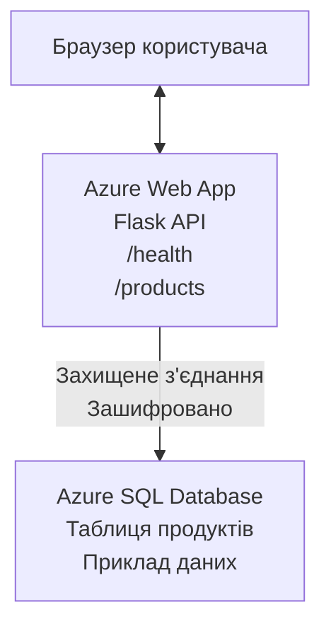

# Розгортання бази даних Microsoft SQL та веб-додатка з AZD

⏱️ **Орієнтовний час**: 20-30 хвилин | 💰 **Орієнтовна вартість**: ~$15-25/місяць | ⭐ **Складність**: Середній рівень

Цей **повний, робочий приклад** демонструє, як використовувати [Azure Developer CLI (azd)](https://learn.microsoft.com/azure/developer/azure-developer-cli/) для розгортання веб-додатка Python Flask з базою даних Microsoft SQL в Azure. Весь код включено та протестовано — зовнішні залежності не потрібні.

## Чого ви навчитеся

Виконавши цей приклад, ви:
- Розгорнете багаторівневий додаток (веб-додаток + база даних) за допомогою інфраструктури як коду
- Налаштуєте безпечні підключення до бази даних без жорсткого кодування секретів
- Моніторитимете стан додатка за допомогою Application Insights
- Керуватимете ресурсами Azure ефективно з AZD CLI
- Дотримуватиметесь найкращих практик Azure для безпеки, оптимізації витрат та спостережності

## Огляд сценарію
- **Веб-додаток**: Python Flask REST API з підключенням до бази даних
- **База даних**: Azure SQL Database з прикладними даними
- **Інфраструктура**: Забезпечується за допомогою Bicep (модульні, повторно використовувані шаблони)
- **Розгортання**: Повністю автоматизоване з командами `azd`
- **Моніторинг**: Application Insights для логів і телеметрії

## Передумови

### Необхідні інструменти

Перед початком переконайтеся, що у вас встановлені такі інструменти:

1. **[Azure CLI](https://learn.microsoft.com/cli/azure/install-azure-cli)** (версія 2.50.0 або вище)
   ```sh
   az --version
   # Очікуваний вивід: azure-cli 2.50.0 або вище
   ```

2. **[Azure Developer CLI (azd)](https://learn.microsoft.com/azure/developer/azure-developer-cli/install-azd)** (версія 1.0.0 або вище)
   ```sh
   azd version
   # Очікуваний вивід: версія azd 1.0.0 або вище
   ```

3. **[Python 3.8+](https://www.python.org/downloads/)** (для локальної розробки)
   ```sh
   python --version
   # Очікуваний результат: Python 3.8 або вище
   ```

4. **[Docker](https://www.docker.com/get-started)** (за бажанням, для локальної контейнеризації)
   ```sh
   docker --version
   # Очікуваний результат: версія Docker 20.10 або вище
   ```

### Вимоги Azure

- Активна **підписка Azure** ([створити безкоштовний акаунт](https://azure.microsoft.com/free/))
- Права для створення ресурсів у вашій підписці
- Роль **Owner** або **Contributor** на підписці або групі ресурсів

### Необхідні знання

Цей приклад — **середнього рівня**. Вам слід розуміти:
- Основні операції з командного рядка
- Основні поняття хмари (ресурси, групи ресурсів)
- Базове розуміння веб-додатків і баз даних

**Новачок у AZD?** Почніть з [керівництва для початківців](../../docs/chapter-01-foundation/azd-basics.md).

## Архітектура

Цей приклад розгортає двошарову архітектуру з веб-додатком та SQL базою даних:


**Розгортання ресурсів:**
- **Група ресурсів**: Контейнер для всіх ресурсів
- **App Service Plan**: Хостинг на базі Linux (B1 рівень для економії)
- **Веб-додаток**: Python 3.11 середовище зі застосунком Flask
- **SQL Server**: Керований сервер баз даних з TLS 1.2 або вище
- **SQL Database**: Базовий рівень (2GB, підходить для розробки/тестування)
- **Application Insights**: Моніторинг та логування
- **Log Analytics Workspace**: Централізоване сховище логів

**Аналогія**: Уявіть це як ресторан (веб-додаток) з морозильною камерою (база даних). Клієнти замовляють зі меню (API кінцеві точки), а кухня (Flask-додаток) бере інгредієнти (дані) з морозильної камери. Менеджер ресторану (Application Insights) відстежує все, що відбувається.

## Структура папок

Усі файли включені у цей приклад — зовнішні залежності не потрібні:

```
examples/database-app/
│
├── README.md                    # This file
├── azure.yaml                   # AZD configuration file
├── .env.sample                  # Sample environment variables
├── .gitignore                   # Git ignore patterns
│
├── infra/                       # Infrastructure as Code (Bicep)
│   ├── main.bicep              # Main orchestration template
│   ├── abbreviations.json      # Azure naming conventions
│   └── resources/              # Modular resource templates
│       ├── sql-server.bicep    # SQL Server configuration
│       ├── sql-database.bicep  # Database configuration
│       ├── app-service-plan.bicep  # Hosting plan
│       ├── app-insights.bicep  # Monitoring setup
│       └── web-app.bicep       # Web application
│
└── src/
    └── web/                    # Application source code
        ├── app.py              # Flask REST API
        ├── requirements.txt    # Python dependencies
        └── Dockerfile          # Container definition
```

**Функції файлів:**
- **azure.yaml**: Вказує AZD, що і куди розгортати
- **infra/main.bicep**: Координує всі ресурси Azure
- **infra/resources/*.bicep**: Опис окремих ресурсів (модульно для повторного використання)
- **src/web/app.py**: Flask-додаток із логікою роботи з базою даних
- **requirements.txt**: Python-залежності
- **Dockerfile**: Інструкції для контейнеризації і розгортання

## Швидкий старт (покроково)

### Крок 1: Клонувати та перейти у папку

```sh
git clone https://github.com/microsoft/AZD-for-beginners.git
cd AZD-for-beginners/examples/database-app
```

**✓ Перевірка успіху**: Переконайтеся, що бачите `azure.yaml` та папку `infra/`:
```sh
ls
# Очікувано: README.md, azure.yaml, infra/, src/
```

### Крок 2: Авторизуватись в Azure

```sh
azd auth login
```

Відкриється браузер для аутентифікації в Azure. Увійдіть із вашими обліковими даними Azure.

**✓ Перевірка успіху**: Ви повинні побачити:
```
Logged in to Azure.
```

### Крок 3: Ініціалізація середовища

```sh
azd init
```

**Що відбувається**: AZD створює локальну конфігурацію для розгортання.

**Підказки, які ви побачите**:
- **Назва середовища**: введіть коротку назву (напр., `dev`, `myapp`)
- **Підписка Azure**: виберіть вашу підписку зі списку
- **Регіон Azure**: оберіть регіон (напр., `eastus`, `westeurope`)

**✓ Перевірка успіху**: Ви повинні побачити:
```
SUCCESS: New project initialized!
```

### Крок 4: Забезпечення ресурсів Azure

```sh
azd provision
```

**Що відбувається**: AZD розгортає всю інфраструктуру (приблизно 5-8 хвилин):
1. Створює групу ресурсів
2. Створює SQL Server та базу даних
3. Створює App Service Plan
4. Створює веб-додаток
5. Створює Application Insights
6. Налаштовує мережу та безпеку

**Вас попросять ввести**:
- **Ім’я адміністратора SQL**: введіть ім’я користувача (наприклад, `sqladmin`)
- **Пароль адміністратора SQL**: введіть надійний пароль (збережіть його!)

**✓ Перевірка успіху**: Ви повинні побачити:
```
SUCCESS: Your application was provisioned in Azure in X minutes Y seconds.
You can view the resources created under the resource group rg-<env-name> in Azure Portal:
https://portal.azure.com/#@/resource/subscriptions/.../resourceGroups/rg-<env-name>
```

**⏱️ Час**: 5-8 хвилин

### Крок 5: Розгортання додатка

```sh
azd deploy
```

**Що відбувається**: AZD збирає та розгортає Flask-додаток:
1. Пакує Python-застосунок
2. Створює Docker-контейнер
3. Пушить у Azure Web App
4. Ініціалізує базу даних прикладними даними
5. Запускає додаток

**✓ Перевірка успіху**: Ви повинні побачити:
```
SUCCESS: Your application was deployed to Azure in X minutes Y seconds.
You can view the resources created under the resource group rg-<env-name> in Azure Portal:
https://portal.azure.com/#@/resource/subscriptions/.../resourceGroups/rg-<env-name>
```

**⏱️ Час**: 3-5 хвилин

### Крок 6: Перегляд додатка

```sh
azd browse
```

Це відкриває ваш розгорнутий веб-додаток у браузері за адресою `https://app-<unique-id>.azurewebsites.net`

**✓ Перевірка успіху**: Ви побачите JSON-вивід:
```json
{
  "message": "Welcome to the Database App API",
  "endpoints": {
    "/": "This help message",
    "/health": "Health check endpoint",
    "/products": "List all products",
    "/products/<id>": "Get product by ID"
  }
}
```

### Крок 7: Тестування API кінцевих точок

**Перевірка стану** (перевірка підключення до бази):
```sh
curl https://app-<your-id>.azurewebsites.net/health
```

**Очікувана відповідь**:
```json
{
  "status": "healthy",
  "database": "connected"
}
```

**Список продуктів** (прикладні дані):
```sh
curl https://app-<your-id>.azurewebsites.net/products
```

**Очікувана відповідь**:
```json
[
  {
    "id": 1,
    "name": "Laptop",
    "description": "High-performance laptop",
    "price": 1299.99,
    "created_at": "2025-11-19T10:30:00"
  },
  ...
]
```

**Отримати один продукт**:
```sh
curl https://app-<your-id>.azurewebsites.net/products/1
```

**✓ Перевірка успіху**: Всі кінцеві точки повертають JSON без помилок.

---

**🎉 Вітаємо!** Ви успішно розгорнули веб-додаток з базою даних в Azure за допомогою AZD.

## Детальний огляд конфігурації

### Змінні середовища

Секрети керуються безпечно через конфігурацію Azure App Service — **ніколи не кодуйте секрети у вихідному коді**.

**Автоматично налаштовуються AZD**:
- `SQL_CONNECTION_STRING`: рядок підключення до бази даних із зашифрованими обліковими даними
- `APPLICATIONINSIGHTS_CONNECTION_STRING`: кінцева точка телеметрії моніторингу
- `SCM_DO_BUILD_DURING_DEPLOYMENT`: увімкнення автоматичного встановлення залежностей

**Де зберігаються секрети**:
1. Під час `azd provision` ви вводите SQL-облікові дані через захищені підказки
2. AZD зберігає їх у вашому локальному файлі `.azure/<env-name>/.env` (ігнорується Git)
3. AZD додає їх у конфігурацію Azure App Service (зашифровано у стані спокою)
4. Додаток зчитує їх через `os.getenv()` під час виконання

### Локальна розробка

Для локального тестування створіть `.env` файл із шаблону:

```sh
cp .env.sample .env
# Відредагуйте .env зі своїм локальним підключенням до бази даних
```

**Локальний робочий процес**:
```sh
# Встановити залежності
cd src/web
pip install -r requirements.txt

# Встановити змінні середовища
export SQL_CONNECTION_STRING="your-local-connection-string"

# Запустити застосунок
python app.py
```

**Тестування локально**:
```sh
curl http://localhost:8000/health
# Очікувано: {"status": "healthy", "database": "connected"}
```

### Інфраструктура як код

Усі ресурси Azure описані в **Bicep-шаблонах** (папка `infra/`):

- **Модульний дизайн**: Кожен тип ресурсу у власному файлі для повторного використання
- **Параметризований**: Налаштуйте SKU, регіони, найменування
- **Найкращі практики**: Дотримання стандартів і налаштувань безпеки Azure
- **Керування версіями**: Зміни інфраструктури відслідковуються в Git

**Приклад кастомізації**:
Для зміни рівня бази даних відредагуйте `infra/resources/sql-database.bicep`:
```bicep
sku: {
  name: 'Standard'  // Changed from 'Basic'
  tier: 'Standard'
  capacity: 10
}
```

## Найкращі практики безпеки

Цей приклад дотримується найкращих практик безпеки Azure:

### 1. **Без секретів у вихідному коді**
- ✅ Облікові дані зберігаються у конфігурації Azure App Service (шифрування)
- ✅ Файли `.env` виключені з Git через `.gitignore`
- ✅ Секрети передаються через захищені параметри під час розгортання

### 2. **Шифровані підключення**
- ✅ TLS 1.2 мінімум для SQL Server
- ✅ Примусове HTTPS для веб-додатка
- ✅ Підключення до бази даних через зашифровані канали

### 3. **Мережна безпека**
- ✅ Брандмауер SQL Server налаштований для доступу тільки сервісів Azure
- ✅ Обмежений публічний доступ (можна додатково застосувати приватні кінцеві точки)
- ✅ FTPS вимкнено на веб-додатку

### 4. **Аутентифікація та авторизація**
- ⚠️ **Зараз**: SQL аутентифікація (користувач/пароль)
- ✅ **Рекомендація для продакшену**: Використовувати Azure Managed Identity для безпарольного доступу

**Щоб перейти на Managed Identity** (для продакшену):
1. Увімкніть захищену ідентичність на веб-додатку
2. Надішліть правам ідентичності доступ до SQL Server
3. Оновіть рядок підключення для використання Managed Identity
4. Вимкніть аутентифікацію на основі пароля

### 5. **Аудит та відповідність**
- ✅ Application Insights логуватиме всі запити та помилки
- ✅ Ввімкнено аудит SQL бази (можна налаштувати для відповідності)
- ✅ Всі ресурси промарковані для масштабного управління

**Перевірка безпеки перед продакшеном**:
- [ ] Увімкнути Azure Defender для SQL
- [ ] Налаштувати приватні кінцеві точки для SQL Database
- [ ] Увімкнути Web Application Firewall (WAF)
- [ ] Використати Azure Key Vault для ротації секретів
- [ ] Налаштувати Azure AD аутентифікацію
- [ ] Увімкнути діагностичне логування для всіх ресурсів

## Оптимізація витрат

**Орієнтовна щомісячна вартість** (на листопад 2025):

| Ресурс | SKU/Рівень | Орієнтовна вартість |
|----------|----------|----------------|
| App Service Plan | B1 (Basic) | ~$13/місяць |
| SQL Database | Basic (2GB) | ~$5/місяць |
| Application Insights | Оплата за використання | ~$2/місяць (низький трафік) |
| **Разом** | | **~$20/місяць** |

**💡 Поради для економії**:

1. **Використовуйте безкоштовний рівень для навчання**:
   - App Service: рівень F1 (безкоштовно, обмежена кількість годин)
   - SQL Database: використовувати serverless Azure SQL Database
   - Application Insights: 5GB безкоштовного об'єму передачі

2. **Зупиняйте ресурси, коли вони не використовуються**:
   ```sh
   # Зупиніть вебдодаток (база даних все ще стягує плату)
   az webapp stop --name <app-name> --resource-group <rg-name>
   
   # Перезапустіть за потреби
   az webapp start --name <app-name> --resource-group <rg-name>
   ```

3. **Видаляйте все після тестування**:
   ```sh
   azd down
   ```
   Це видалить ВСІ ресурси і припинить нарахування плати.

4. **SKU для розробки vs продакшену**:
   - **Розробка**: базовий рівень (використовується у цьому прикладі)
   - **Продакшен**: стандартний/преміум із відмовостійкістю

**Контроль витрат**:
- Переглядайте затрати у [Azure Cost Management](https://portal.azure.com/#view/Microsoft_Azure_CostManagement)
- Налаштуйте сповіщення про витрати, щоб уникнути неприємних сюрпризів
- Пам’ятайте маркувати всі ресурси тегом `azd-env-name` для відстежування

**Альтернатива безкоштовного рівня**:
Для навчальних цілей можна змінити `infra/resources/app-service-plan.bicep`:
```bicep
sku: {
  name: 'F1'  // Free tier
  tier: 'Free'
}
```
**Примітка**: Безкоштовний рівень має обмеження (60 хв/день CPU, немає завжди увімкненого режиму).

## Моніторинг та спостережність

### Інтеграція Application Insights

Цей приклад включає **Application Insights** для повноцінного моніторингу:

**Що моніториться**:
- ✅ HTTP запити (затримка, статуси, кінцеві точки)
- ✅ Помилки та виключення додатка
- ✅ Користувацьке логування з Flask-додатка
- ✅ Стан підключення до бази даних
- ✅ Метрики продуктивності (CPU, пам’ять)

**Доступ до Application Insights**:
1. Відкрийте [Azure Portal](https://portal.azure.com)
2. Перейдіть у вашу групу ресурсів (`rg-<env-name>`)
3. Клікніть на ресурс Application Insights (`appi-<unique-id>`)

**Корисні запити** (Application Insights → Логи):

**Перегляд усіх запитів**:
```kusto
requests
| where timestamp > ago(1h)
| order by timestamp desc
| project timestamp, name, url, resultCode, duration
```

**Пошук помилок**:
```kusto
exceptions
| where timestamp > ago(24h)
| order by timestamp desc
| project timestamp, type, outerMessage, operation_Name
```

**Перевірка ендпойнту стану**:
```kusto
requests
| where name contains "health"
| summarize count() by resultCode, bin(timestamp, 1h)
```

### Аудит SQL Database

**Аудит бази даних увімкнено** для відстеження:
- Патернів доступу до бази
- Невдалих спроб входу
- Змін у схемі
- Доступу до даних (для відповідності)

**Доступ до журналів аудиту**:
1. Azure Portal → SQL Database → Auditing
2. Переглядайте логи у Log Analytics workspace

### Моніторинг в реальному часі

**Перегляд метрик у реальному часі**:
1. Application Insights → Live Metrics
2. Спостерігайте за запитами, збоями і продуктивністю онлайн

**Налаштування сповіщень**:
Створіть сповіщення для критичних подій:
- HTTP 500 помилки > 5 за 5 хвилин
- Помилки підключення до бази
- Високі часи відповіді (>2 секунд)

**Приклад створення сповіщення**:
```sh
az monitor metrics alert create \
  --name "High-Response-Time" \
  --resource-group <rg-name> \
  --scopes <app-insights-resource-id> \
  --condition "avg requests/duration > 2000" \
  --description "Alert when response time exceeds 2 seconds"
```

## Усунення несправностей
### Поширені проблеми та їх вирішення

#### 1. `azd provision` не вдається через "Місцезнаходження недоступне"

**Симптом**:  
```
Error: The subscription is not registered for the resource type 'components' in the location 'centralus'.
```
  
**Рішення**:  
Оберіть інший регіон Azure або зареєструйте провайдера ресурсів:  
```sh
az provider register --namespace Microsoft.Insights
```
  
#### 2. Підключення до SQL не вдається під час розгортання

**Симптом**:  
```
pyodbc.OperationalError: ('08001', '[08001] [Microsoft][ODBC Driver 18 for SQL Server]TCP Provider...')
```
  
**Рішення**:  
- Переконайтеся, що брандмауер SQL Server дозволяє сервіси Azure (налаштовується автоматично)  
- Перевірте, чи правильно введено пароль адміністратора SQL під час `azd provision`  
- Переконайтеся, що SQL Server повністю створено (це може займати 2-3 хвилини)  

**Перевірка підключення**:  
```sh
# Увійдіть до Azure Portal, перейдіть до SQL Database → редактор запитів
# Спробуйте підключитися, використовуючи свої облікові дані
```
  
#### 3. Веб-додаток показує "Помилка застосунку"

**Симптом**:  
Браузер показує загальну сторінку з помилкою.

**Рішення**:  
Перегляньте логи додатка:  
```sh
# Переглянути останні журнали
az webapp log tail --name <app-name> --resource-group <rg-name>
```
  
**Поширені причини**:  
- Відсутні змінні середовища (перевірте App Service → Configuration)  
- Помилка встановлення Python-пакетів (перевірте логи розгортання)  
- Помилка ініціалізації бази даних (перевірте підключення до SQL)  

#### 4. `azd deploy` не вдається через "Build Error"

**Симптом**:  
```
Error: Failed to build project
```
  
**Рішення**:  
- Переконайтеся, що у `requirements.txt` немає синтаксичних помилок  
- Перевірте, що Python 3.11 вказано в `infra/resources/web-app.bicep`  
- Переконайтеся, що Dockerfile має правильний базовий образ  

**Налагодження локально**:  
```sh
cd src/web
docker build -t test-app .
docker run -p 8000:8000 test-app
```
  
#### 5. "Unauthorized" під час виконання команд AZD

**Симптом**:  
```
ERROR: (Unauthorized) The client '<id>' with object id '<id>' does not have authorization
```
  
**Рішення**:  
Авторизуйтеся повторно в Azure:  
```sh
# Необхідно для робочих процесів AZD
azd auth login

# Необов'язково, якщо ви також безпосередньо використовуєте команди Azure CLI
az login
```
  
Переконайтеся, що у вас є відповідні права (роль Contributor) в підписці.

#### 6. Високі витрати на базу даних

**Симптом**:  
Несподіваний рахунок від Azure.

**Рішення**:  
- Перевірте, чи ви не забули виконати `azd down` після тестування  
- Переконайтеся, що SQL Database використовує базовий рівень (не Premium)  
- Перегляньте витрати в Azure Cost Management  
- Налаштуйте оповіщення про витрати  

### Отримання допомоги

**Переглянути всі змінні середовища AZD**:  
```sh
azd env get-values
```
  
**Перевірити статус розгортання**:  
```sh
az webapp show --name <app-name> --resource-group <rg-name> --query state
```
  
**Отримати доступ до логів застосунку**:  
```sh
az webapp log download --name <app-name> --resource-group <rg-name> --log-file app-logs.zip
```
  
**Потрібна додаткова допомога?**  
- [Посібник з усунення неполадок AZD](../../docs/chapter-07-troubleshooting/common-issues.md)  
- [Вирішення проблем Azure App Service](https://learn.microsoft.com/azure/app-service/troubleshoot-diagnostic-logs)  
- [Вирішення проблем Azure SQL](https://learn.microsoft.com/azure/azure-sql/database/troubleshoot-common-errors-issues)  

## Практичні вправи

### Вправа 1: Перевірте своє розгортання (Початковий рівень)

**Мета**: Підтвердити, що всі ресурси розгорнуті і додаток працює.

**Кроки**:  
1. Перелічіть всі ресурси у вашій групі ресурсів:  
   ```sh
   az resource list --resource-group rg-<env-name> --output table
   ```
   **Очікувано**: 6-7 ресурсів (Web App, SQL Server, SQL Database, App Service Plan, Application Insights, Log Analytics)

2. Перевірте всі кінцеві точки API:  
   ```sh
   curl https://app-<your-id>.azurewebsites.net/
   curl https://app-<your-id>.azurewebsites.net/health
   curl https://app-<your-id>.azurewebsites.net/products
   curl https://app-<your-id>.azurewebsites.net/products/1
   ```
   **Очікувано**: всі повертають валідний JSON без помилок

3. Перевірте Application Insights:  
   - Перейдіть до Application Insights в Azure Portal  
   - Відкрийте "Live Metrics"  
   - Оновіть сторінку веб-додатку у браузері  
   **Очікувано**: бачите запити, що з’являються у реальному часі  

**Критерії успіху**: Всі 6-7 ресурсів наявні, всі кінцеві точки повертають дані, Live Metrics показує активність.

---

### Вправа 2: Додайте нову кінцеву точку API (Середній рівень)

**Мета**: Розширити Flask-додаток новою кінцевою точкою.

**Початковий код**: Поточні кінцеві точки у `src/web/app.py`

**Кроки**:  
1. Відредагуйте `src/web/app.py` і додайте нову кінцеву точку після функції `get_product()`:  
   ```python
   @app.route('/products/search/<keyword>')
   def search_products(keyword):
       """Search products by name or description."""
       try:
           conn = get_db_connection()
           cursor = conn.cursor()
           cursor.execute(
               "SELECT id, name, description, price, created_at FROM products WHERE name LIKE ? OR description LIKE ?",
               (f'%{keyword}%', f'%{keyword}%')
           )
           
           products = []
           for row in cursor.fetchall():
               products.append({
                   'id': row[0],
                   'name': row[1],
                   'description': row[2],
                   'price': float(row[3]) if row[3] else None,
                   'created_at': row[4].isoformat() if row[4] else None
               })
           
           cursor.close()
           conn.close()
           
           logger.info(f"Search for '{keyword}' returned {len(products)} results")
           return jsonify(products), 200
           
       except Exception as e:
           logger.error(f"Error searching products: {str(e)}")
           return jsonify({'error': str(e)}), 500
   ```
  
2. Розгорніть оновлений додаток:  
   ```sh
   azd deploy
   ```
  
3. Перевірте нову кінцеву точку:  
   ```sh
   curl https://app-<your-id>.azurewebsites.net/products/search/laptop
   ```
   **Очікувано**: повертає продукти, що відповідають "laptop"

**Критерії успіху**: Нова кінцева точка працює, повертає відфільтровані результати, зʼявляється у логах Application Insights.

---

### Вправа 3: Додайте моніторинг і оповіщення (Просунутий рівень)

**Мета**: Налаштувати проактивний моніторинг з оповіщеннями.

**Кроки**:  
1. Створіть оповіщення для HTTP 500 помилок:  
   ```sh
   # Отримати ідентифікатор ресурсу Application Insights
   AI_ID=$(az monitor app-insights component show \
     --app appi-<your-id> \
     --resource-group rg-<env-name> \
     --query id -o tsv)
   
   # Створити сповіщення
   az monitor metrics alert create \
     --name "High-Error-Rate" \
     --resource-group rg-<env-name> \
     --scopes $AI_ID \
     --condition "count requests/failed > 5" \
     --window-size 5m \
     --evaluation-frequency 1m \
     --description "Alert when >5 failed requests in 5 minutes"
   ```
  
2. Викличте оповіщення, спричиняючи помилки:  
   ```sh
   # Запит неіснуючого продукту
   for i in {1..10}; do curl https://app-<your-id>.azurewebsites.net/products/999; done
   ```
  
3. Перевірте, чи спрацювало оповіщення:  
   - Azure Portal → Alerts → Alert Rules  
   - Перевірте електронну пошту (якщо налаштовано)  

**Критерії успіху**: Правило оповіщення створено, воно спрацьовує при помилках, отримані повідомлення.

---

### Вправа 4: Зміни в схемі бази даних (Просунутий рівень)

**Мета**: Додати нову таблицю та змінити додаток для її використання.

**Кроки**:  
1. Підключіться до SQL Database через Query Editor в Azure Portal  

2. Створіть нову таблицю `categories`:  
   ```sql
   CREATE TABLE categories (
       id INT PRIMARY KEY IDENTITY(1,1),
       name NVARCHAR(50) NOT NULL,
       description NVARCHAR(200)
   );
   
   INSERT INTO categories (name, description) VALUES
   ('Electronics', 'Electronic devices and accessories'),
   ('Office Supplies', 'Office equipment and supplies');
   
   -- Add category to products table
   ALTER TABLE products ADD category_id INT;
   UPDATE products SET category_id = 1; -- Set all to Electronics
   ```
  
3. Оновіть `src/web/app.py`, щоб включати інформацію про категорії у відповіді  

4. Розгорніть та перевірте  

**Критерії успіху**: Нова таблиця існує, продукти показують інформацію про категорію, додаток працює.

---

### Вправа 5: Реалізуйте кешування (Експертний рівень)

**Мета**: Додати Azure Redis Cache для покращення продуктивності.

**Кроки**:  
1. Додайте Redis Cache у `infra/main.bicep`  
2. Оновіть `src/web/app.py` для кешування запитів продуктів  
3. Виміряйте покращення продуктивності за допомогою Application Insights  
4. Порівняйте час відгуку до і після кешування  

**Критерії успіху**: Redis розгорнуто, кешування працює, час відгуку покращено >50%.

**Підказка**: Почніть з [документації Azure Cache для Redis](https://learn.microsoft.com/azure/azure-cache-for-redis/).

---

## Завершення

Щоб уникнути подальших витрат, видаліть усі ресурси після завершення:

```sh
azd down
```
  
**Підтвердження**:  
```
? Total resources to delete: 7, are you sure you want to continue? (y/N)
```
  
Введіть `y` для підтвердження.

**✓ Перевірка успіху**:  
- Всі ресурси видалені з Azure Portal  
- Відсутні подальші витрати  
- Можна видалити локальну теку `.azure/<env-name>`

**Альтернатива** (залишити інфраструктуру, видалити дані):  
```sh
# Видалити лише групу ресурсів (зберегти конфігурацію AZD)
az group delete --name rg-<env-name> --yes
```
  
## Дізнатись більше

### Пов’язані документи  
- [Документація Azure Developer CLI](https://learn.microsoft.com/azure/developer/azure-developer-cli/)  
- [Документація Azure SQL Database](https://learn.microsoft.com/azure/azure-sql/database/)  
- [Документація Azure App Service](https://learn.microsoft.com/azure/app-service/)  
- [Документація Application Insights](https://learn.microsoft.com/azure/azure-monitor/app/app-insights-overview)  
- [Посилання на мову Bicep](https://learn.microsoft.com/azure/azure-resource-manager/bicep/)  

### Наступні кроки в курсі  
- **[Приклад Container Apps](../../../../examples/container-app)**: розгортання мікросервісів з Azure Container Apps  
- **[Посібник з інтеграції AI](../../../../docs/ai-foundry)**: додайте можливості штучного інтелекту у ваш додаток  
- **[Найкращі практики розгортання](../../docs/chapter-04-infrastructure/deployment-guide.md)**: шаблони розгортання у виробництво  

### Розширені теми  
- **Керована ідентичність**: прибрати паролі, використати аутентифікацію Azure AD  
- **Приватні кінцеві точки**: безпечні підключення до бази в межах віртуальної мережі  
- **Інтеграція CI/CD**: автоматизація розгортання через GitHub Actions або Azure DevOps  
- **Багато середовищ**: налаштування dev, staging, production середовищ  
- **Міграції бази даних**: використання Alembic або Entity Framework для версіювання схем  

### Порівняння з іншими підходами

**AZD vs. ARM Templates**:  
- ✅ AZD: більш високий рівень абстракції, простіші команди  
- ⚠️ ARM: більш докладні, тонкий контроль  

**AZD vs. Terraform**:  
- ✅ AZD: рідна інтеграція з Azure сервісами  
- ⚠️ Terraform: підтримка мультихмарності, більша екосистема  

**AZD vs. Azure Portal**:  
- ✅ AZD: повторюваність, контроль версій, автоматизація  
- ⚠️ Portal: ручні кліки, важко відтворювати  

**Думайте про AZD як про**: Docker Compose для Azure — спрощене конфігурування складних розгортань.

---

## Часті питання

**П: Чи можу я використовувати іншу мову програмування?**  
В: Так! Замініть `src/web/` на Node.js, C#, Go або будь-яку іншу мову. Оновіть `azure.yaml` і Bicep відповідно.

**П: Як додати більше баз даних?**  
В: Додайте ще один модуль SQL Database в `infra/main.bicep` або використовуйте PostgreSQL/MySQL з сервісів Azure Database.

**П: Чи можна це використовувати у виробництві?**  
В: Це відправна точка. Для виробництва додайте: керовану ідентичність, приватні кінцеві точки, резерви, стратегію бекапу, WAF та покращений моніторинг.

**П: Що, якщо я хочу використовувати контейнери замість коду?**  
В: Перегляньте [Приклад Container Apps](../../../../examples/container-app), де використані Docker контейнери по всій ланцюжку.

**П: Як підключитися до бази з локальної машини?**  
В: Додайте вашу IP-адресу до брандмауеру SQL Server:  
```sh
az sql server firewall-rule create \
  --resource-group rg-<env-name> \
  --server sql-<unique-id> \
  --name AllowMyIP \
  --start-ip-address <your-ip> \
  --end-ip-address <your-ip>
```
  
**П: Чи можу я використовувати існуючу базу замість створення нової?**  
В: Так, змініть `infra/main.bicep`, щоб посилатися на існуючий SQL Server, і оновіть параметри рядка підключення.

---

> **Примітка:** цей приклад демонструє найкращі практики розгортання веб-додатку з базою даних за допомогою AZD. Він включає робочий код, повну документацію та практичні вправи для закріплення знань. Для виробничих розгортань перегляньте вимоги з безпеки, масштабування, відповідності та вартості, специфічні для вашої організації.

**📚 Навігація по курсу:**  
- ← Попередній: [Приклад Container Apps](../../../../examples/container-app)  
- → Наступний: [Посібник з інтеграції AI](../../../../docs/ai-foundry)  
- 🏠 [Головна сторінка курсу](../../README.md)

---

<!-- CO-OP TRANSLATOR DISCLAIMER START -->
**Відмова від відповідальності**:  
Цей документ був перекладений за допомогою сервісу автоматичного перекладу [Co-op Translator](https://github.com/Azure/co-op-translator). Хоча ми прагнемо до точності, будь ласка, майте на увазі, що автоматичні переклади можуть містити помилки або неточності. Оригінальний документ рідною мовою слід вважати авторитетним джерелом. Для критичної інформації рекомендується професійний переклад людиною. Ми не несемо відповідальності за будь-які непорозуміння або неправильні тлумачення, що виникли внаслідок використання цього перекладу.
<!-- CO-OP TRANSLATOR DISCLAIMER END -->