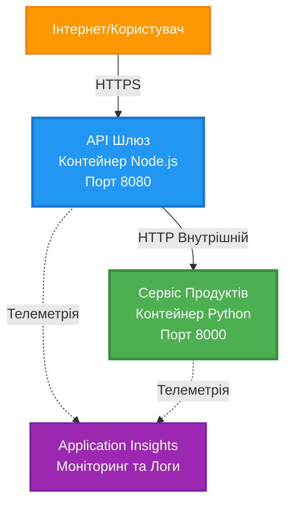
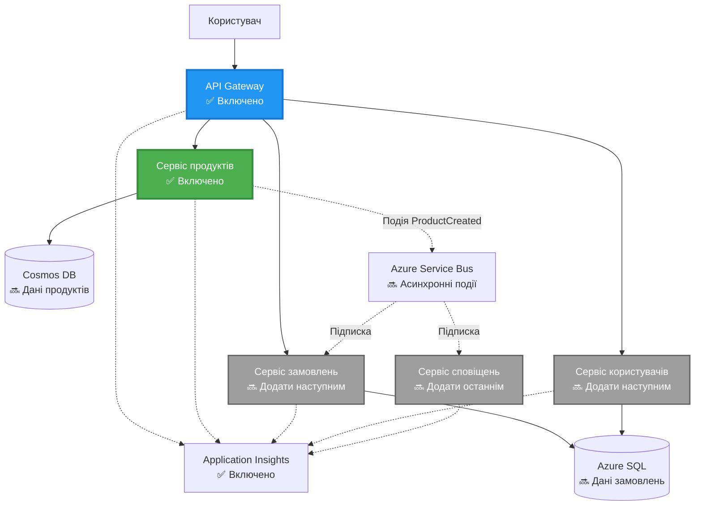
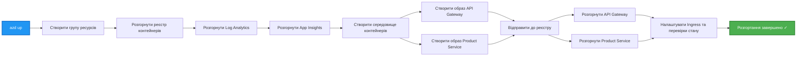
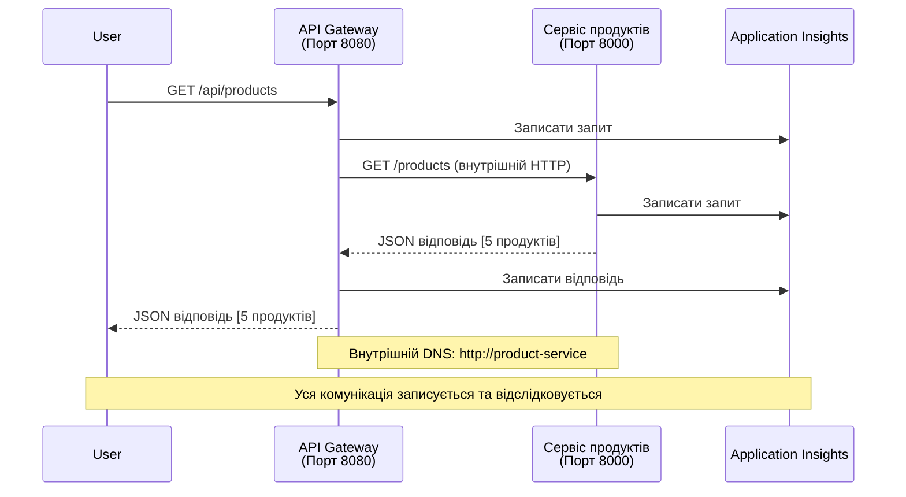

# Архітектура мікросервісів - Приклад додатку в контейнері

⏱️ **Орієнтовний час**: 25-35 хвилин | 💰 **Орієнтовна вартість**: ~$50-100/місяць | ⭐ **Складність**: Висока

**📚 Навчальний шлях:**
- ← Попереднє: [Простий Flask API](../../../../examples/container-app/simple-flask-api) - Основи одного контейнера
- 🎯 **Ви тут**: Архітектура мікросервісів (основа з 2 сервісів)
- → Далі: [Інтеграція AI](../../../../docs/ai-foundry) - Додайте інтелект до своїх сервісів
- 🏠 [Головна сторінка курсу](../../README.md)

---

**Спрощена, але функціональна** архітектура мікросервісів, розгорнута в Azure Container Apps за допомогою AZD CLI. Цей приклад демонструє взаємодію між сервісами, оркестрацію контейнерів та моніторинг із практичним налаштуванням з двох сервісів.

> **📚 Підхід до навчання**: Цей приклад починається з мінімальної архітектури з двох сервісів (API Gateway + Backend Service), яку ви можете розгорнути та вивчити. Після освоєння цієї основи ми надаємо рекомендації щодо розширення до повної екосистеми мікросервісів.

## Чого ви навчитеся

Завершивши цей приклад, ви:
- Розгорнете кілька контейнерів в Azure Container Apps
- Реалізуєте взаємодію між сервісами за допомогою внутрішньої мережі
- Налаштуєте масштабування на основі середовища та перевірки стану
- Моніторинг розподілених додатків за допомогою Application Insights
- Зрозумієте шаблони розгортання мікросервісів та найкращі практики
- Навчитеся поступово розширювати архітектуру від простої до складної

## Архітектура

### Фаза 1: Що ми будуємо (включено в цей приклад)


**Деталі компонентів:**

| Компонент | Призначення | Доступ | Ресурси |
|-----------|-------------|--------|---------|
| **API Gateway** | Направляє зовнішні запити до бекенд-сервісів | Публічний (HTTPS) | 1 vCPU, 2GB RAM, 2-20 реплік |
| **Product Service** | Управляє каталогом продуктів з використанням даних у пам'яті | Лише внутрішній | 0.5 vCPU, 1GB RAM, 1-10 реплік |
| **Application Insights** | Централізоване логування та розподілений трекінг | Azure Portal | 1-2 GB/місяць на інгестування даних |

**Чому починати з простого?**
- ✅ Швидке розгортання та розуміння (25-35 хвилин)
- ✅ Вивчення основних шаблонів мікросервісів без складності
- ✅ Робочий код, який можна змінювати та експериментувати
- ✅ Низька вартість навчання (~$50-100/місяць проти $300-1400/місяць)
- ✅ Набуття впевненості перед додаванням баз даних та черг повідомлень

**Аналогія**: Уявіть, що ви вчитеся водити. Ви починаєте з порожньої парковки (2 сервіси), освоюєте основи, а потім переходите до міського руху (5+ сервісів із базами даних).

### Фаза 2: Майбутнє розширення (референсна архітектура)

Після освоєння архітектури з 2 сервісів ви можете розширити її до:


Дивіться розділ "Посібник з розширення" в кінці для покрокових інструкцій.

## Включені функції

✅ **Виявлення сервісів**: Автоматичне виявлення DNS між контейнерами  
✅ **Балансування навантаження**: Вбудоване балансування навантаження між репліками  
✅ **Автоматичне масштабування**: Незалежне масштабування кожного сервісу на основі HTTP-запитів  
✅ **Моніторинг стану**: Перевірки життєздатності та готовності для обох сервісів  
✅ **Розподілене логування**: Централізоване логування з Application Insights  
✅ **Внутрішня мережа**: Безпечна взаємодія між сервісами  
✅ **Оркестрація контейнерів**: Автоматичне розгортання та масштабування  
✅ **Оновлення без простоїв**: Поступові оновлення з управлінням ревізіями  

## Попередні вимоги

### Необхідні інструменти

Перед початком переконайтеся, що у вас встановлені ці інструменти:

1. **[Azure Developer CLI (azd)](https://learn.microsoft.com/azure/developer/azure-developer-cli/install-azd)** (версія 1.0.0 або вище)
   ```bash
   azd version
   # Очікуваний результат: версія azd 1.0.0 або вище
   ```

2. **[Azure CLI](https://learn.microsoft.com/cli/azure/install-azure-cli)** (версія 2.50.0 або вище)
   ```bash
   az --version
   # Очікуваний результат: azure-cli 2.50.0 або вище
   ```

3. **[Docker](https://www.docker.com/get-started)** (для локальної розробки/тестування - опціонально)
   ```bash
   docker --version
   # Очікуваний результат: версія Docker 20.10 або вище
   ```

### Перевірка налаштувань

Запустіть ці команди, щоб переконатися, що все готово:

```bash
# Перевірте Azure Developer CLI
azd version
# ✅ Очікувано: azd версія 1.0.0 або вище

# Перевірте Azure CLI
az --version
# ✅ Очікувано: azure-cli 2.50.0 або вище

# Перевірте Docker (необов'язково)
docker --version
# ✅ Очікувано: Docker версія 20.10 або вище
```

**Критерії успіху**: Усі команди повертають номери версій, які відповідають або перевищують мінімальні.

### Вимоги до Azure

- Активна **підписка Azure** ([створіть безкоштовний обліковий запис](https://azure.microsoft.com/free/))
- Дозволи на створення ресурсів у вашій підписці
- Роль **Contributor** у підписці або групі ресурсів

### Необхідні знання

Це приклад **високого рівня складності**. Ви повинні:
- Завершити [приклад Простого Flask API](../../../../examples/container-app/simple-flask-api) 
- Мати базове розуміння архітектури мікросервісів
- Бути знайомими з REST API та HTTP
- Розуміти концепції контейнерів

**Новачок у Container Apps?** Почніть із [прикладу Простого Flask API](../../../../examples/container-app/simple-flask-api), щоб вивчити основи.

## Швидкий старт (покроково)

### Крок 1: Клонування та перехід

```bash
git clone https://github.com/microsoft/AZD-for-beginners.git
cd AZD-for-beginners/examples/microservices
```

**✓ Перевірка успіху**: Переконайтеся, що ви бачите `azure.yaml`:
```bash
ls
# Очікується: README.md, azure.yaml, infra/, src/
```

### Крок 2: Аутентифікація в Azure

```bash
azd auth login
```

Це відкриє ваш браузер для аутентифікації в Azure. Увійдіть за допомогою своїх облікових даних Azure.

**✓ Перевірка успіху**: Ви повинні побачити:
```
Logged in to Azure.
```

### Крок 3: Ініціалізація середовища

```bash
azd init
```

**Підказки, які ви побачите**:
- **Ім'я середовища**: Введіть коротке ім'я (наприклад, `microservices-dev`)
- **Підписка Azure**: Виберіть свою підписку
- **Розташування Azure**: Виберіть регіон (наприклад, `eastus`, `westeurope`)

**✓ Перевірка успіху**: Ви повинні побачити:
```
SUCCESS: New project initialized!
```

### Крок 4: Розгортання інфраструктури та сервісів

```bash
azd up
```

**Що відбувається** (займає 8-12 хвилин):


**✓ Перевірка успіху**: Ви повинні побачити:
```
SUCCESS: Your application was deployed to Azure in X minutes Y seconds.
Endpoint: https://api-gateway-<unique-id>.azurecontainerapps.io
```

**⏱️ Час**: 8-12 хвилин

### Крок 5: Тестування розгортання

```bash
# Отримати кінцеву точку шлюзу
GATEWAY_URL=$(azd env get-values | grep API_GATEWAY_URL | cut -d '=' -f2 | tr -d '"')

# Перевірити стан здоров'я API Gateway
curl $GATEWAY_URL/health
```

**✅ Очікуваний результат:**
```json
{
  "status": "healthy",
  "service": "api-gateway",
  "timestamp": "2025-11-19T10:30:00Z"
}
```

**Тестування сервісу продуктів через шлюз**:
```bash
# Перелічити продукти
curl $GATEWAY_URL/api/products
```

**✅ Очікуваний результат:**
```json
[
  {"id":1,"name":"Laptop","price":999.99,"stock":50},
  {"id":2,"name":"Mouse","price":29.99,"stock":200},
  {"id":3,"name":"Keyboard","price":79.99,"stock":150}
]
```

**✓ Перевірка успіху**: Обидва кінцеві точки повертають JSON-дані без помилок.

---

**🎉 Вітаємо!** Ви розгорнули архітектуру мікросервісів в Azure!

## Структура проекту

Усі файли реалізації включені — це повний, робочий приклад:

```
microservices/
│
├── README.md                         # This file
├── azure.yaml                        # AZD configuration
├── .gitignore                        # Git ignore patterns
│
├── infra/                           # Infrastructure as Code (Bicep)
│   ├── main.bicep                   # Main orchestration
│   ├── abbreviations.json           # Naming conventions
│   ├── core/                        # Shared infrastructure
│   │   ├── container-apps-environment.bicep  # Container environment + registry
│   │   └── monitor.bicep            # Application Insights + Log Analytics
│   └── app/                         # Service definitions
│       ├── api-gateway.bicep        # API Gateway container app
│       └── product-service.bicep    # Product Service container app
│
└── src/                             # Application source code
    ├── api-gateway/                 # Node.js API Gateway
    │   ├── app.js                   # Express server with routing
    │   ├── package.json             # Node dependencies
    │   └── Dockerfile               # Container definition
    └── product-service/             # Python Product Service
        ├── main.py                  # Flask API with product data
        ├── requirements.txt         # Python dependencies
        └── Dockerfile               # Container definition
```

**Що робить кожен компонент:**

**Інфраструктура (infra/)**:
- `main.bicep`: Оркеструє всі ресурси Azure та їх залежності
- `core/container-apps-environment.bicep`: Створює середовище Container Apps та Azure Container Registry
- `core/monitor.bicep`: Налаштовує Application Insights для розподіленого логування
- `app/*.bicep`: Окремі визначення контейнерних додатків із масштабуванням та перевірками стану

**API Gateway (src/api-gateway/)**:
- Сервіс, що приймає запити ззовні та перенаправляє їх до бекенд-сервісів
- Реалізує логування, обробку помилок та перенаправлення запитів
- Демонструє HTTP-взаємодію між сервісами

**Product Service (src/product-service/)**:
- Внутрішній сервіс із каталогом продуктів (у пам'яті для простоти)
- REST API з перевірками стану
- Приклад шаблону бекенд-мікросервісу

## Огляд сервісів

### API Gateway (Node.js/Express)

**Порт**: 8080  
**Доступ**: Публічний (зовнішній вхід)  
**Призначення**: Направляє вхідні запити до відповідних бекенд-сервісів  

**Кінцеві точки**:
- `GET /` - Інформація про сервіс
- `GET /health` - Кінцева точка перевірки стану
- `GET /api/products` - Перенаправлення до сервісу продуктів (список усіх)
- `GET /api/products/:id` - Перенаправлення до сервісу продуктів (отримання за ID)

**Ключові особливості**:
- Маршрутизація запитів за допомогою axios
- Централізоване логування
- Обробка помилок та управління тайм-аутами
- Виявлення сервісів через змінні середовища
- Інтеграція з Application Insights

**Основний код** (`src/api-gateway/app.js`):
```javascript
// Внутрішнє спілкування сервісів
app.get('/api/products', async (req, res) => {
  const response = await axios.get(`${PRODUCT_SERVICE_URL}/products`, {
    timeout: 5000
  });
  res.json(response.data);
});
```

### Product Service (Python/Flask)

**Порт**: 8000  
**Доступ**: Лише внутрішній (без зовнішнього входу)  
**Призначення**: Управляє каталогом продуктів із даними в пам'яті  

**Кінцеві точки**:
- `GET /` - Інформація про сервіс
- `GET /health` - Кінцева точка перевірки стану
- `GET /products` - Список усіх продуктів
- `GET /products/<id>` - Отримання продукту за ID

**Ключові особливості**:
- RESTful API з Flask
- Зберігання продуктів у пам'яті (просто, без бази даних)
- Моніторинг стану за допомогою перевірок
- Структуроване логування
- Інтеграція з Application Insights

**Модель даних**:
```python
{
  "id": 1,
  "name": "Laptop",
  "description": "High-performance laptop",
  "price": 999.99,
  "stock": 50
}
```

**Чому лише внутрішній доступ?**
Сервіс продуктів не доступний публічно. Усі запити повинні проходити через API Gateway, що забезпечує:
- Безпеку: Контрольована точка доступу
- Гнучкість: Можливість змінювати бекенд без впливу на клієнтів
- Моніторинг: Централізоване логування запитів

## Розуміння взаємодії сервісів

### Як сервіси взаємодіють один з одним


У цьому прикладі API Gateway взаємодіє з Product Service за допомогою **внутрішніх HTTP-запитів**:

```javascript
// Шлюз API (src/api-gateway/app.js)
const PRODUCT_SERVICE_URL = process.env.PRODUCT_SERVICE_URL;

// Здійснити внутрішній HTTP-запит
const response = await axios.get(`${PRODUCT_SERVICE_URL}/products`);
```

**Ключові моменти**:

1. **Виявлення на основі DNS**: Container Apps автоматично надає DNS для внутрішніх сервісів
   - FQDN сервісу продуктів: `product-service.internal.<environment>.azurecontainerapps.io`
   - Спрощено як: `http://product-service` (Container Apps це вирішує)

2. **Без публічного доступу**: Сервіс продуктів має `external: false` у Bicep
   - Доступний лише в межах середовища Container Apps
   - Недоступний з інтернету

3. **Змінні середовища**: URL сервісів додаються під час розгортання
   - Bicep передає внутрішній FQDN до шлюзу
   - Жодних жорстко закодованих URL у коді додатків

**Аналогія**: Уявіть це як офісні кімнати. API Gateway — це рецепція (публічний доступ), а Product Service — це офісна кімната (лише внутрішній доступ). Відвідувачі повинні пройти через рецепцію, щоб потрапити до будь-якої кімнати.

## Варіанти розгортання

### Повне розгортання (рекомендовано)

```bash
# Розгорнути інфраструктуру та обидва сервіси
azd up
```

Це розгортає:
1. Середовище Container Apps
2. Application Insights
3. Container Registry
4. Контейнер API Gateway
5. Контейнер Product Service

**Час**: 8-12 хвилин

### Розгортання окремого сервісу

```bash
# Розгорніть лише одну службу (після початкового azd up)
azd deploy api-gateway

# Або розгорніть службу продукту
azd deploy product-service
```

**Випадок використання**: Коли ви оновили код у одному сервісі та хочете розгорнути лише цей сервіс.

### Оновлення конфігурації

```bash
# Змінити параметри масштабування
azd env set GATEWAY_MAX_REPLICAS 30

# Перезапустити з новою конфігурацією
azd up
```

## Конфігурація

### Конфігурація масштабування

Обидва сервіси налаштовані на автоматичне масштабування на основі HTTP-запитів у їхніх Bicep-файлах:

**API Gateway**:
- Мінімум реплік: 2 (завжди щонайменше 2 для доступності)
- Максимум реплік: 20
- Тригер масштабування: 50 одночасних запитів на репліку

**Product Service**:
- Мінімум реплік: 1 (може масштабуватися до нуля, якщо потрібно)
- Максимум реплік: 10
- Тригер масштабування: 100 одночасних запитів на репліку

**Налаштування масштабування** (у `infra/app/*.bicep`):
```bicep
scale: {
  minReplicas: 1
  maxReplicas: 10
  rules: [
    {
      name: 'http-scale-rule'
      http: {
        metadata: {
          concurrentRequests: '100'  // Adjust this
        }
      }
    }
  ]
}
```

### Розподіл ресурсів

**API Gateway**:
- CPU: 1.0 vCPU
- Пам'ять: 2 GiB
- Причина: Обробляє весь зовнішній трафік

**Product Service**:
- CPU: 0.5 vCPU
- Пам'ять: 1 GiB
- Причина: Легкі операції в пам'яті

### Перевірки стану

Обидва сервіси включають перевірки життєздатності та готовності:

```bicep
probes: [
  {
    type: 'Liveness'
    httpGet: {
      path: '/health'
      port: 8080
    }
    initialDelaySeconds: 10
    periodSeconds: 30
  }
  {
    type: 'Readiness'
    httpGet: {
      path: '/health'
      port: 8080
    }
    initialDelaySeconds: 5
    periodSeconds: 10
  }
]
```

**Що це означає**:
- **Життєздатність**: Якщо перевірка стану не проходить, Container Apps перезапускає контейнер
- **Готовність**: Якщо не готовий, Container Apps припиняє направляти трафік до цієї репліки

## Моніторинг та спостереження

### Перегляд логів сервісів

```bash
# Потік журналів з API Gateway
azd logs api-gateway --follow

# Переглянути останні журнали сервісу продуктів
azd logs product-service --tail 100

# Переглянути всі журнали з обох сервісів
azd logs --follow
```

**Очікуваний результат**:
```
[api-gateway] API Gateway listening on port 8080
[api-gateway] Product Service URL: http://product-service
[api-gateway] GET /api/products 200 - 45ms
[product-service] Retrieved 5 products
```

### Запити Application Insights

Доступ до Application Insights у Azure Portal, потім виконайте ці запити:

**Знайти повільні запити**:
```kusto
requests
| where timestamp > ago(1h)
| where duration > 1000  // Requests taking >1 second
| summarize count() by name, cloud_RoleName
| order by count_ desc
```

**Відстеження викликів між сервісами**:
```kusto
dependencies
| where timestamp > ago(1h)
| where type == "Http"
| project timestamp, name, target, duration, success
| order by timestamp desc
```

**Рівень помилок за сервісом**:
```kusto
exceptions
| where timestamp > ago(24h)
| summarize errorCount = count() by cloud_RoleName, type
| order by errorCount desc
```

**Обсяг запитів з часом**:
```kusto
requests
| where timestamp > ago(1h)
| summarize requestCount = count() by bin(timestamp, 5m), cloud_RoleName
| render timechart
```

### Доступ до панелі моніторингу

```bash
# Отримати деталі Application Insights
azd env get-values | grep APPLICATIONINSIGHTS

# Відкрити моніторинг Azure Portal
az monitor app-insights component show \
  --app $(azd env get-values | grep APPLICATIONINSIGHTS_CONNECTION_STRING | cut -d '=' -f2) \
  --resource-group $(azd env get-values | grep AZURE_RESOURCE_GROUP | cut -d '=' -f2) \
  --query "appId" -o tsv
```

### Живі метрики

1. Перейдіть до Application Insights у Azure
3. Перезапустіть обидва сервіси:

```bash
azd deploy product-service
azd deploy api-gateway
```

4. Перевірте нову кінцеву точку:

```bash
GATEWAY_URL=$(azd env get-values | grep API_GATEWAY_URL | cut -d '=' -f2 | tr -d '"')

# Створити новий продукт
curl -X POST $GATEWAY_URL/api/products \
  -H "Content-Type: application/json" \
  -d '{"name":"USB Cable","price":9.99,"stock":500}'
```

**✅ Очікуваний результат:**
```json
{"id":6,"name":"USB Cable","description":"","price":9.99,"stock":500}
```

5. Переконайтеся, що вона з'являється у списку:

```bash
curl $GATEWAY_URL/api/products
# Тепер має показувати 6 продуктів, включаючи новий USB-кабель
```

**Критерії успіху**:
- ✅ Запит POST повертає HTTP 201
- ✅ Новий продукт з'являється у списку GET /api/products
- ✅ Продукт має автоматично збільшений ID

**Час**: 10-15 хвилин

---

### Вправа 2: Змінити правила автоскейлінгу ⭐⭐ (Середній рівень)

**Мета**: Змінити Product Service для більш агресивного масштабування

**Початкова точка**: `infra/app/product-service.bicep`

**Кроки**:

1. Відкрийте `infra/app/product-service.bicep` і знайдіть блок `scale` (приблизно рядок 95)

2. Змініть з:
```bicep
scale: {
  minReplicas: 1
  maxReplicas: 10
  rules: [
    {
      name: 'http-scale-rule'
      http: {
        metadata: {
          concurrentRequests: '100'  // OLD
        }
      }
    }
  ]
}
```

На:
```bicep
scale: {
  minReplicas: 2  // Always have 2 running
  maxReplicas: 20  // Allow more scaling
  rules: [
    {
      name: 'http-scale-rule'
      http: {
        metadata: {
          concurrentRequests: '20'  // Scale at lower threshold
        }
      }
    }
  ]
}
```

3. Перезапустіть інфраструктуру:

```bash
azd up
```

4. Перевірте нову конфігурацію масштабування:

```bash
az containerapp show \
  --name $(azd env get-values | grep PRODUCT_SERVICE | head -1 | cut -d '/' -f5) \
  --resource-group $(azd env get-values | grep AZURE_RESOURCE_GROUP | cut -d '=' -f2 | tr -d '"') \
  --query "properties.template.scale" -o json
```

**✅ Очікуваний результат:**
```json
{
  "minReplicas": 2,
  "maxReplicas": 20,
  "rules": [...]
}
```

5. Перевірте автоскейлінг під навантаженням:

```bash
# Генерувати одночасні запити
for i in {1..500}; do curl $GATEWAY_URL/api/products & done

# Спостерігати за масштабуванням
azd logs product-service --follow
# Шукати: події масштабування Container Apps
```

**Критерії успіху**:
- ✅ Product Service завжди працює щонайменше з 2 репліками
- ✅ Під навантаженням масштабується до більше ніж 2 реплік
- ✅ Azure Portal показує нові правила масштабування

**Час**: 15-20 хвилин

---

### Вправа 3: Додати власний запит моніторингу ⭐⭐ (Середній рівень)

**Мета**: Створити власний запит Application Insights для відстеження продуктивності API продуктів

**Кроки**:

1. Перейдіть до Application Insights в Azure Portal:
   - Зайдіть в Azure Portal
   - Знайдіть свою групу ресурсів (rg-microservices-*)
   - Натисніть на ресурс Application Insights

2. Натисніть "Logs" у лівому меню

3. Створіть цей запит:

```kusto
requests
| where timestamp > ago(1h)
| where name contains "products"
| summarize 
    RequestCount = count(),
    AvgDuration = avg(duration),
    P95Duration = percentile(duration, 95),
    SuccessRate = 100.0 * countif(success == true) / count()
  by bin(timestamp, 5m)
| render timechart
```

4. Натисніть "Run", щоб виконати запит

5. Збережіть запит:
   - Натисніть "Save"
   - Назва: "Product API Performance"
   - Категорія: "Performance"

6. Згенеруйте тестовий трафік:

```bash
for i in {1..100}; do curl $GATEWAY_URL/api/products; sleep 1; done
```

7. Оновіть запит, щоб побачити дані

**✅ Очікуваний результат:**
- Графік, що показує кількість запитів з часом
- Середня тривалість < 500 мс
- Рівень успішності = 100%
- Інтервали часу 5 хвилин

**Критерії успіху**:
- ✅ Запит показує 100+ запитів
- ✅ Рівень успішності 100%
- ✅ Середня тривалість < 500 мс
- ✅ Графік відображає інтервали часу 5 хвилин

**Результат навчання**: Розуміння моніторингу продуктивності сервісів за допомогою власних запитів

**Час**: 10-15 хвилин

---

### Вправа 4: Реалізувати логіку повторних спроб ⭐⭐⭐ (Високий рівень)

**Мета**: Додати логіку повторних спроб до API Gateway, коли Product Service тимчасово недоступний

**Початкова точка**: `src/api-gateway/app.js`

**Кроки**:

1. Встановіть бібліотеку повторних спроб:

```bash
cd src/api-gateway
npm install axios-retry --save
cd ../..
```

2. Оновіть `src/api-gateway/app.js` (додайте після імпорту axios):

```javascript
const axiosRetry = require('axios-retry');

// Налаштувати логіку повторних спроб
axiosRetry(axios, {
  retries: 3,
  retryDelay: (retryCount) => {
    return retryCount * 1000; // 1с, 2с, 3с
  },
  retryCondition: (error) => {
    // Повторити спробу при помилках мережі або відповідях 5xx
    return axiosRetry.isNetworkOrIdempotentRequestError(error) ||
           (error.response && error.response.status >= 500);
  }
});

console.log('Retry logic configured: 3 retries with exponential backoff');
```

3. Перезапустіть API Gateway:

```bash
azd deploy api-gateway
```

4. Перевірте поведінку повторних спроб, симулюючи збій сервісу:

```bash
# Масштабувати сервіс продуктів до 0 (імітувати збій)
az containerapp update \
  --name $(azd env get-values | grep PRODUCT_SERVICE | head -1 | cut -d '/' -f5) \
  --resource-group $(azd env get-values | grep AZURE_RESOURCE_GROUP | cut -d '=' -f2 | tr -d '"') \
  --min-replicas 0 \
  --max-replicas 0

# Спробувати отримати доступ до продуктів (буде повторено 3 рази)
time curl -v $GATEWAY_URL/api/products
# Спостерігати: Відповідь займає ~6 секунд (1с + 2с + 3с повтори)

# Відновити сервіс продуктів
az containerapp update \
  --name $(azd env get-values | grep PRODUCT_SERVICE | head -1 | cut -d '/' -f5) \
  --resource-group $(azd env get-values | grep AZURE_RESOURCE_GROUP | cut -d '=' -f2 | tr -d '"') \
  --min-replicas 1 \
  --max-replicas 10
```

5. Перегляньте журнали повторних спроб:

```bash
azd logs api-gateway --tail 50
# Шукайте: Повідомлення про спробу повтору
```

**✅ Очікувана поведінка:**
- Запити повторюються 3 рази перед помилкою
- Кожна спроба чекає довше (1с, 2с, 3с)
- Успішні запити після перезапуску сервісу
- Журнали показують спроби повторення

**Критерії успіху**:
- ✅ Запити повторюються 3 рази перед помилкою
- ✅ Кожна спроба чекає довше (експоненціальне збільшення часу)
- ✅ Успішні запити після перезапуску сервісу
- ✅ Журнали показують спроби повторення

**Результат навчання**: Розуміння шаблонів стійкості в мікросервісах (автоматичні повтори, таймаути, захисні механізми)

**Час**: 20-25 хвилин

---

## Контроль знань

Після завершення цього прикладу перевірте своє розуміння:

### 1. Комунікація між сервісами ✓

Перевірте свої знання:
- [ ] Чи можете ви пояснити, як API Gateway знаходить Product Service? (DNS-базоване виявлення сервісів)
- [ ] Що відбувається, якщо Product Service недоступний? (Gateway повертає помилку 503)
- [ ] Як би ви додали третій сервіс? (Створіть новий файл Bicep, додайте до main.bicep, створіть папку src)

**Практична перевірка:**
```bash
# Симулювати збій сервісу
az containerapp update --name <product-service-name> --min-replicas 0 --max-replicas 0
curl $GATEWAY_URL/api/products
# ✅ Очікувано: 503 Сервіс недоступний

# Відновити сервіс
az containerapp update --name <product-service-name> --min-replicas 1 --max-replicas 10
```

### 2. Моніторинг і спостереження ✓

Перевірте свої знання:
- [ ] Де ви бачите розподілені журнали? (Application Insights в Azure Portal)
- [ ] Як відстежувати повільні запити? (Запит Kusto: `requests | where duration > 1000`)
- [ ] Чи можете ви визначити, який сервіс спричинив помилку? (Перевірте поле `cloud_RoleName` у журналах)

**Практична перевірка:**
```bash
# Згенерувати симуляцію повільного запиту
curl "$GATEWAY_URL/api/products?delay=2000"

# Запит до Application Insights для повільних запитів
# Перейдіть до Azure Portal → Application Insights → Logs
# Виконайте: requests | where duration > 1000 | project timestamp, name, duration, cloud_RoleName
```

### 3. Масштабування і продуктивність ✓

Перевірте свої знання:
- [ ] Що запускає автоскейлінг? (Правила HTTP для одночасних запитів: 50 для gateway, 100 для product)
- [ ] Скільки реплік зараз працює? (Перевірте за допомогою `az containerapp revision list`)
- [ ] Як би ви масштабували Product Service до 5 реплік? (Оновіть minReplicas у Bicep)

**Практична перевірка:**
```bash
# Генеруйте навантаження для тестування автомасштабування
for i in {1..1000}; do curl $GATEWAY_URL/api/products & done

# Спостерігайте за збільшенням реплік
azd logs api-gateway --follow
# ✅ Очікувано: Побачити події масштабування в журналах
```

**Критерії успіху**: Ви можете відповісти на всі запитання і перевірити за допомогою практичних команд.

---

## Аналіз витрат

### Оцінка щомісячних витрат (для цього прикладу з 2 сервісами)

| Ресурс | Конфігурація | Оцінка витрат |
|--------|--------------|---------------|
| API Gateway | 2-20 реплік, 1 vCPU, 2GB RAM | $30-150 |
| Product Service | 1-10 реплік, 0.5 vCPU, 1GB RAM | $15-75 |
| Container Registry | Базовий рівень | $5 |
| Application Insights | 1-2 GB/місяць | $5-10 |
| Log Analytics | 1 GB/місяць | $3 |
| **Загалом** | | **$58-243/місяць** |

### Розподіл витрат за використанням

**Невеликий трафік** (тестування/навчання): ~$60/місяць
- API Gateway: 2 репліки × 24/7 = $30
- Product Service: 1 репліка × 24/7 = $15
- Моніторинг + реєстр = $13

**Помірний трафік** (невелике виробництво): ~$120/місяць
- API Gateway: 5 середніх реплік = $75
- Product Service: 3 середніх реплік = $45
- Моніторинг + реєстр = $13

**Високий трафік** (пікові періоди): ~$240/місяць
- API Gateway: 15 середніх реплік = $225
- Product Service: 8 середніх реплік = $120
- Моніторинг + реєстр = $13

### Поради щодо оптимізації витрат

1. **Масштабування до нуля для розробки**:
   ```bicep
   scale: {
     minReplicas: 0  // Save $30-40/month when not in use
     maxReplicas: 10
   }
   ```

2. **Використовуйте Consumption Plan для Cosmos DB** (коли ви його додасте):
   - Платіть лише за використане
   - Без мінімальної оплати

3. **Налаштуйте вибірку Application Insights**:
   ```javascript
   appInsights.defaultClient.config.samplingPercentage = 50; // Вибірка 50% запитів
   ```

4. **Очистіть ресурси, коли вони не потрібні**:
   ```bash
   azd down --force --purge
   ```

### Варіанти безкоштовного використання

Для навчання/тестування розгляньте:
- ✅ Використовуйте безкоштовні кредити Azure ($200 протягом перших 30 днів для нових акаунтів)
- ✅ Тримайте мінімальну кількість реплік (економія ~50% витрат)
- ✅ Видаляйте після тестування (без постійних витрат)
- ✅ Масштабуйте до нуля між навчальними сесіями

**Приклад**: Виконання цього прикладу протягом 2 годин/день × 30 днів = ~$5/місяць замість $60/місяць

---

## Швидкий довідник з усунення несправностей

### Проблема: `azd up` не працює з помилкою "Subscription not found"

**Рішення**:
```bash
# Увійдіть знову з явною підпискою
az account set --subscription <your-subscription-id>
azd env set AZURE_SUBSCRIPTION_ID <your-subscription-id>
azd up
```

### Проблема: API Gateway повертає 503 "Product service unavailable"

**Діагностика**:
```bash
# Перевірте журнали обслуговування продукту
azd logs product-service --tail 50

# Перевірте стан обслуговування продукту
az containerapp show \
  --name $(azd env get-values | grep PRODUCT_SERVICE | head -1 | cut -d '/' -f5) \
  --resource-group $(azd env get-values | grep AZURE_RESOURCE_GROUP | cut -d '=' -f2 | tr -d '"') \
  --query "properties.runningStatus"
```

**Поширені причини**:
1. Product service не запустився (перевірте журнали на помилки Python)
2. Перевірка стану не працює (переконайтеся, що `/health` працює)
3. Збірка контейнерного образу не вдалася (перевірте реєстр на наявність образу)

### Проблема: Автоскейлінг не працює

**Діагностика**:
```bash
# Перевірте поточну кількість реплік
az containerapp revision list \
  --name $(azd env get-values | grep API_GATEWAY | head -1 | cut -d '/' -f5) \
  --resource-group $(azd env get-values | grep AZURE_RESOURCE_GROUP | cut -d '=' -f2 | tr -d '"') \
  --query "[].properties.replicas"

# Згенеруйте навантаження для тестування
for i in {1..1000}; do curl $GATEWAY_URL/api/products & done

# Спостерігайте за подіями масштабування
azd logs api-gateway --follow | grep -i scale
```

**Поширені причини**:
1. Навантаження недостатньо високе для запуску правила масштабування (потрібно >50 одночасних запитів)
2. Досягнуто максимальну кількість реплік (перевірте конфігурацію Bicep)
3. Неправильно налаштоване правило масштабування в Bicep (перевірте значення concurrentRequests)

### Проблема: Application Insights не показує журнали

**Діагностика**:
```bash
# Перевірте, чи встановлено рядок підключення
azd env get-values | grep APPLICATIONINSIGHTS

# Перевірте, чи сервіси надсилають телеметрію
az monitor app-insights component show \
  --app $(azd env get-values | grep APPLICATIONINSIGHTS_NAME | cut -d '=' -f2 | tr -d '"') \
  --resource-group $(azd env get-values | grep AZURE_RESOURCE_GROUP | cut -d '=' -f2 | tr -d '"') \
  --query "properties.InstrumentationKey"
```

**Поширені причини**:
1. Рядок підключення не передано до контейнера (перевірте змінні середовища)
2. SDK Application Insights не налаштований (перевірте імпорти в коді)
3. Брандмауер блокує телеметрію (рідко, перевірте правила мережі)

### Проблема: Збірка Docker не працює локально

**Діагностика**:
```bash
# Тестування збірки API Gateway
cd src/api-gateway
docker build -t test-gateway .

# Тестування збірки Product Service
cd ../product-service
docker build -t test-product .
```

**Поширені причини**:
1. Відсутні залежності в package.json/requirements.txt
2. Помилки синтаксису в Dockerfile
3. Проблеми з мережею при завантаженні залежностей

**Все ще виникають проблеми?** Дивіться [Посібник з поширених проблем](../../docs/troubleshooting/common-issues.md) або [Усунення несправностей Azure Container Apps](https://learn.microsoft.com/azure/container-apps/troubleshooting)

---

## Очищення

Щоб уникнути постійних витрат, видаліть усі ресурси:

```bash
azd down --force --purge
```

**Підтвердження**:
```
? Total resources to delete: 6, are you sure you want to continue? (y/N)
```

Введіть `y`, щоб підтвердити.

**Що буде видалено**:
- Середовище Container Apps
- Обидва Container Apps (gateway і product service)
- Реєстр контейнерів
- Application Insights
- Робоче місце Log Analytics
- Група ресурсів

**✓ Перевірка очищення**:
```bash
az group list --query "[?starts_with(name,'rg-microservices')]" --output table
```

Повинно повернути порожній результат.

---

## Посібник з розширення: від 2 до 5+ сервісів

Коли ви освоїте архітектуру з 2 сервісами, ось як її розширити:

### Етап 1: Додати збереження даних у базі (наступний крок)

**Додати Cosmos DB для Product Service**:

1. Створіть `infra/core/cosmos.bicep`:
   ```bicep
   resource cosmosAccount 'Microsoft.DocumentDB/databaseAccounts@2023-04-15' = {
     name: name
     location: location
     kind: 'GlobalDocumentDB'
     properties: {
       databaseAccountOfferType: 'Standard'
       consistencyPolicy: { defaultConsistencyLevel: 'Session' }
       locations: [{ locationName: location, failoverPriority: 0 }]
     }
   }
   ```

2. Оновіть Product Service для використання Azure Cosmos DB Python SDK замість даних у пам'яті

3. Оцінка додаткових витрат: ~$25/місяць (серверлес)

### Етап 2: Додати третій сервіс (Order Management)

**Створіть Order Service**:

1. Нова папка: `src/order-service/` (Python/Node.js/C#)
2. Новий файл Bicep: `infra/app/order-service.bicep`
3. Оновіть API Gateway для маршрутизації `/api/orders`
4. Додайте Azure SQL Database для збереження замовлень

**Архітектура стає**:
```
API Gateway → Product Service (Cosmos DB)
           → Order Service (Azure SQL)
```

### Етап 3: Додати асинхронну комунікацію (Service Bus)

**Реалізуйте архітектуру, орієнтовану на події**:

1. Додайте Azure Service Bus: `infra/core/servicebus.bicep`
2. Product Service публікує події "ProductCreated"
3. Order Service підписується на події продуктів
4. Додайте Notification Service для обробки подій

**Шаблон**: Запит/відповідь (HTTP) + Орієнтованість на події (Service Bus)

### Етап 4: Додати автентифікацію користувачів

**Реалізуйте User Service**:

1. Створіть `src/user-service/` (Go/Node.js)
2. Додайте Azure AD B2C або власну автентифікацію JWT
3. API Gateway перевіряє токени перед маршрутизацією
4. Сервіси перевіряють дозволи користувачів

### Етап 5: Готовність до виробництва

**Додайте ці компоненти**:
- ✅ Azure Front Door (глобальне балансування навантаження)
- ✅ Azure Key Vault (управління секретами)
- ✅ Azure Monitor Workbooks (власні панелі моніторингу)
- ✅ CI/CD Pipeline (GitHub Actions)
- ✅ Blue-Green Deployments
- ✅ Managed Identity для всіх сервісів

**Повна архітектура для виробництва**: ~$300-1,400/місяць

---

## Дізнатися більше

### Супутня документація
- [Документація Azure Container Apps](https://learn.microsoft.com/azure/container-apps/)
- [Посібник з архітектури мікросервісів](https://learn.microsoft.com/azure/architecture/guide/architecture-styles/microservices)
- [Application Insights для розподіленого трасування](https://learn.microsoft.com/azure/azure-monitor/app/distributed-tracing)
- [Документація Azure Developer CLI](https://learn.microsoft.com/azure/developer/azure-developer-cli/)

### Наступні кроки в цьому курсі
- ← Попереднє: [Простий Flask API](../../../../examples/container-app/simple-flask-api) - Приклад для початківців з одним контейнером
- → Наступне: [Посібник з інтеграції AI](../../../../docs/ai-foundry) - Додати можливості AI
- 🏠 [Головна сторінка курсу](../../README.md)

### Порівняння: Коли використовувати що

| Функція | Один контейнер | Мікросервіси (цей) | Kubernetes (AKS) |
|---------|----------------|--------------------|------------------|
| **Випадок використання** | Прості додатки | Складні додатки | Корпоративні додатки |
| **Масштабованість** | Один сервіс | Масштабування за сервісами | Максимальна гнучкість |
| **Складність** | Низька | Середня | Висока |
| **Розмір команди** | 1-3 розробники | 3-10 розробників | 10+ розробників |
| **Вартість** | ~$15-50/місяць | ~$60-250
| **Найкраще для** | MVP, прототипи | Продуктові додатки | Мультихмарність, розширені мережі |

**Рекомендація**: Почніть з Container Apps (цей приклад), переходьте до AKS лише якщо вам потрібні специфічні функції Kubernetes.

---

## Часті запитання

**Питання: Чому лише 2 сервіси замість 5+?**  
Відповідь: Освітній прогрес. Освойте основи (комунікація між сервісами, моніторинг, масштабування) на простому прикладі перед додаванням складності. Шаблони, які ви тут вивчите, застосовуються до архітектур із 100 сервісами.

**Питання: Чи можу я додати більше сервісів самостійно?**  
Відповідь: Звісно! Дотримуйтесь інструкції з розширення вище. Кожен новий сервіс слідує тому ж шаблону: створіть папку src, створіть файл Bicep, оновіть azure.yaml, розгорніть.

**Питання: Чи готове це до використання в продакшені?**  
Відповідь: Це міцна основа. Для продакшену додайте: керовану ідентичність, Key Vault, постійні бази даних, CI/CD конвеєр, моніторинг сповіщень і стратегію резервного копіювання.

**Питання: Чому не використовувати Dapr або інші service mesh?**  
Відповідь: Зберігайте простоту для навчання. Як тільки ви зрозумієте мережеву взаємодію в Container Apps, ви можете додати Dapr для розширених сценаріїв (управління станом, pub/sub, прив'язки).

**Питання: Як налагоджувати локально?**  
Відповідь: Запустіть сервіси локально за допомогою Docker:  
```bash
cd src/api-gateway
docker build -t local-gateway .
docker run -p 8080:8080 -e PRODUCT_SERVICE_URL=http://localhost:8000 local-gateway
```


**Питання: Чи можу я використовувати різні мови програмування?**  
Відповідь: Так! У цьому прикладі показано Node.js (gateway) + Python (product service). Ви можете змішувати будь-які мови, які працюють у контейнерах: C#, Go, Java, Ruby, PHP тощо.

**Питання: Що робити, якщо у мене немає кредитів Azure?**  
Відповідь: Використовуйте безкоштовний рівень Azure (перші 30 днів для нових акаунтів дають $200 кредитів) або розгорніть для коротких тестових періодів і негайно видаліть. Цей приклад коштує приблизно $2/день.

**Питання: Чим це відрізняється від Azure Kubernetes Service (AKS)?**  
Відповідь: Container Apps простіший (не потрібні знання Kubernetes), але менш гнучкий. AKS дає повний контроль над Kubernetes, але вимагає більше експертизи. Почніть з Container Apps, переходьте до AKS за потреби.

**Питання: Чи можу я використовувати це з існуючими сервісами Azure?**  
Відповідь: Так! Ви можете підключитися до існуючих баз даних, облікових записів зберігання, Service Bus тощо. Оновіть файли Bicep, щоб посилатися на існуючі ресурси, а не створювати нові.

---

> **🎓 Резюме навчального шляху**: Ви навчилися розгортати архітектуру з кількома сервісами з автоматичним масштабуванням, внутрішньою мережею, централізованим моніторингом і шаблонами, готовими до продакшену. Ця основа готує вас до складних розподілених систем і архітектур мікросервісів для підприємств.

**📚 Навігація по курсу:**
- ← Попереднє: [Простий Flask API](../../../../examples/container-app/simple-flask-api)
- → Наступне: [Приклад інтеграції бази даних](../../../../database-app)
- 🏠 [Головна сторінка курсу](../../README.md)
- 📖 [Найкращі практики Container Apps](../../docs/deployment/deployment-guide.md)

---

**✨ Вітаємо!** Ви завершили приклад мікросервісів. Тепер ви розумієте, як створювати, розгортати та моніторити розподілені додатки на Azure Container Apps. Готові додати можливості AI? Ознайомтеся з [Посібником з інтеграції AI](../../../../docs/ai-foundry)!

---

<!-- CO-OP TRANSLATOR DISCLAIMER START -->
**Відмова від відповідальності**:  
Цей документ був перекладений за допомогою сервісу автоматичного перекладу [Co-op Translator](https://github.com/Azure/co-op-translator). Хоча ми прагнемо до точності, будь ласка, майте на увазі, що автоматичні переклади можуть містити помилки або неточності. Оригінальний документ на його рідній мові слід вважати авторитетним джерелом. Для критичної інформації рекомендується професійний людський переклад. Ми не несемо відповідальності за будь-які непорозуміння або неправильні тлумачення, що виникають внаслідок використання цього перекладу.
<!-- CO-OP TRANSLATOR DISCLAIMER END -->