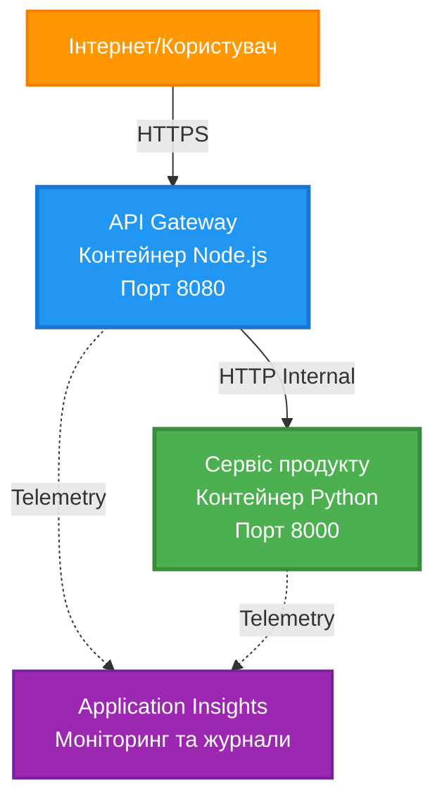
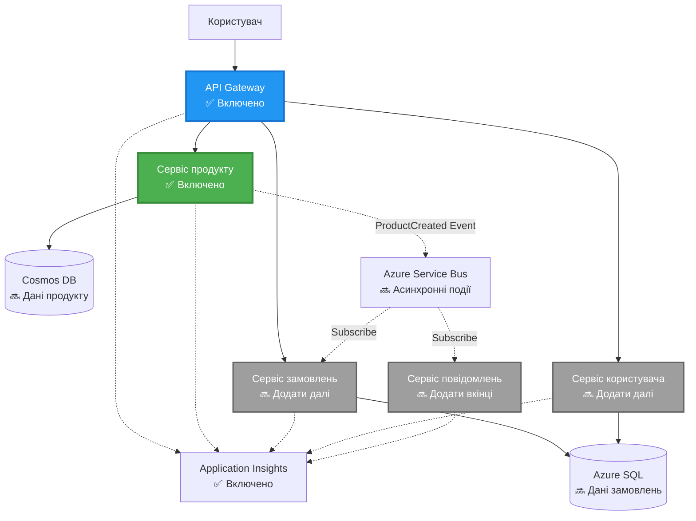
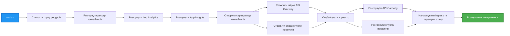
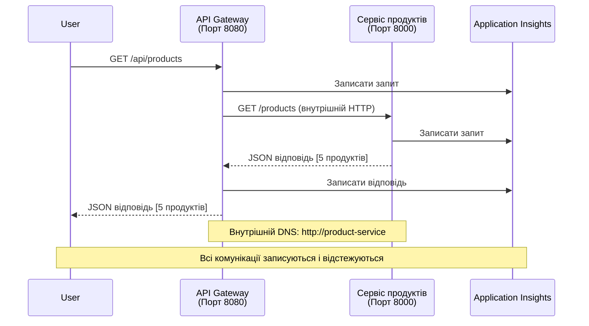

# Архітектура мікросервісів — приклад Container App

⏱️ **Орієнтовний час**: 25-35 хвилин | 💰 **Орієнтовна вартість**: ~$50-100/місяць | ⭐ **Складність**: Висока

**📚 Навчальний шлях:**  
- ← Попередній: [Простий Flask API](../../../../examples/container-app/simple-flask-api) – основи одного контейнера  
- 🎯 **Ви тут**: Архітектура мікросервісів (фундамент з 2 сервісів)  
- → Наступний: [Інтеграція ШІ](../../../../docs/ai-foundry) – Додайте інтелект до ваших сервісів  
- 🏠 [Домашня сторінка курсу](../../README.md)

---

**Спрощена, але робоча** архітектура мікросервісів, розгорнута в Azure Container Apps за допомогою AZD CLI. Цей приклад демонструє комунікацію сервісів між собою, оркестрацію контейнерів та моніторинг на практичному прикладі 2-сервісної конфігурації.

> **📚 Підхід до навчання**: Цей приклад починається з мінімальної архітектури з 2 сервісів (API Gateway + бекенд сервис), яку ви зможете розгорнути і вивчити. Після освоєння цієї бази ми надаємо рекомендації для розширення до повноцінної екосистеми мікросервісів.

## Чого Ви навчитесь

Виконавши цей приклад, ви зможете:
- Розгортати кілька контейнерів у Azure Container Apps
- Реалізовувати комунікацію між сервісами через внутрішню мережу
- Налаштовувати масштабування залежно від середовища та контроль стану здоров'я
- Моніторити розподілені додатки за допомогою Application Insights
- Розуміти патерни деплойменту мікросервісів та найкращі практики
- Вивчити поступове розширення від простої до складної архітектури

## Архітектура

### Фаза 1: Що Ми Будуємо (Включено у цей приклад)


```mermaid
graph TB
    Internet[Інтернет/Користувач]
    Gateway[API Gateway<br/>Контейнер Node.js<br/>Порт 8080]
    Product[Сервіс продукту<br/>Контейнер Python<br/>Порт 8000]
    AppInsights[Application Insights<br/>Моніторинг та журнали]
    
    Internet -->|HTTPS| Gateway
    Gateway -->|HTTP Internal| Product
    Gateway -.->|Telemetry| AppInsights
    Product -.->|Telemetry| AppInsights
    
    style Gateway fill:#2196F3,stroke:#1976D2,stroke-width:3px,color:#fff
    style Product fill:#4CAF50,stroke:#388E3C,stroke-width:3px,color:#fff
    style Internet fill:#FF9800,stroke:#F57C00,stroke-width:2px,color:#fff
    style AppInsights fill:#9C27B0,stroke:#7B1FA2,stroke-width:2px,color:#fff
```  
**Деталі компонентів:**

| Компонент | Призначення | Доступ | Ресурси |
|-----------|-------------|--------|---------|
| **API Gateway** | Роутить зовнішні запити до бекенд-сервісів | Публічний (HTTPS) | 1 vCPU, 2ГБ RAM, 2-20 реплік |
| **Product Service** | Керує каталогом продуктів із даними в пам'яті | Лише внутрішній | 0.5 vCPU, 1ГБ RAM, 1-10 реплік |
| **Application Insights** | Централізоване логування та трасування | Azure Portal | 1-2 ГБ/місяць інжестування даних |

**Чому почати з простого?**  
- ✅ Швидке розгортання та розуміння (25-35 хвилин)  
- ✅ Засвоєння базових патернів мікросервісів без складнощів  
- ✅ Робочий код, який можна модифікувати та експериментувати  
- ✅ Нижча вартість навчання (~$50-100/місяць проти $300-1400/місяць)  
- ✅ Набираєте впевненість перед додаванням баз даних і черг повідомлень  

**Аналогія**: Уявіть, що ви вчитесь водити. Починаєте з порожнього паркування (2 сервіси), опановуєте основи, потім переходите до міського трафіку (5+ сервісів з базами).

### Фаза 2: Подальше Розширення (Референсна архітектура)

Після освоєння 2-сервісної архітектури можна розширюватись:


```mermaid
graph TB
    User[Користувач]
    Gateway[API Gateway<br/>✅ Включено]
    Product[Сервіс продукту<br/>✅ Включено]
    Order[Сервіс замовлень<br/>🔜 Додати далі]
    UserSvc[Сервіс користувача<br/>🔜 Додати далі]
    Notify[Сервіс повідомлень<br/>🔜 Додати вкінці]
    
    CosmosDB[(Cosmos DB<br/>🔜 Дані продукту)]
    AzureSQL[(Azure SQL<br/>🔜 Дані замовлень)]
    ServiceBus[Azure Service Bus<br/>🔜 Асинхронні події]
    AppInsights[Application Insights<br/>✅ Включено]
    
    User --> Gateway
    Gateway --> Product
    Gateway --> Order
    Gateway --> UserSvc
    
    Product --> CosmosDB
    Order --> AzureSQL
    UserSvc --> AzureSQL
    
    Product -.->|ProductCreated Event| ServiceBus
    ServiceBus -.->|Subscribe| Notify
    ServiceBus -.->|Subscribe| Order
    
    Gateway -.-> AppInsights
    Product -.-> AppInsights
    Order -.-> AppInsights
    UserSvc -.-> AppInsights
    Notify -.-> AppInsights
    
    style Product fill:#4CAF50,stroke:#388E3C,stroke-width:3px,color:#fff
    style Gateway fill:#2196F3,stroke:#1976D2,stroke-width:3px,color:#fff
    style Order fill:#9E9E9E,stroke:#616161,stroke-width:2px,color:#fff
    style UserSvc fill:#9E9E9E,stroke:#616161,stroke-width:2px,color:#fff
    style Notify fill:#9E9E9E,stroke:#616161,stroke-width:2px,color:#fff
```  
Дивіться розділ "Посібник з розширення" наприкінці для покрокових інструкцій.

## Включені можливості

✅ **Виявлення сервісу**: Автоматичне DNS-виявлення між контейнерами  
✅ **Балансування навантаження**: Вбудоване балансування між репліками  
✅ **Автоматичне масштабування**: Незалежне масштабування кожного сервісу за HTTP-запитами  
✅ **Моніторинг здоров’я**: Проби живучості і готовності для обох сервісів  
✅ **Розподілене логування**: Централізоване логування через Application Insights  
✅ **Внутрішня мережа**: Безпечна комунікація між сервісами  
✅ **Оркестрація контейнерів**: Автоматичне розгортання і масштабування  
✅ **Оновлення без простою**: Поступові оновлення з менеджментом ревізій  

## Попередні вимоги

### Необхідні інструменти

Перед початком переконайтесь, що у вас встановлені:

1. **[Azure Developer CLI (azd)](https://learn.microsoft.com/azure/developer/azure-developer-cli/install-azd)** (версія 1.0.0 або вище)  
   ```bash
   azd version
   # Очікуваний вивід: azd версія 1.0.0 або вище
   ```
  
2. **[Azure CLI](https://learn.microsoft.com/cli/azure/install-azure-cli)** (версія 2.50.0 або вище)  
   ```bash
   az --version
   # Очікуваний вивід: azure-cli 2.50.0 або вищої версії
   ```
  
3. **[Docker](https://www.docker.com/get-started)** (для локальної розробки/тестування — необов’язково)  
   ```bash
   docker --version
   # Очікуваний результат: версія Docker 20.10 або вище
   ```
  
### Перевірка налаштувань

Запустіть ці команди, щоб підтвердити готовність:

```bash
# Перевірте Azure Developer CLI
azd version
# ✅ Очікується: версія azd 1.0.0 або вище

# Перевірте Azure CLI
az --version
# ✅ Очікується: версія azure-cli 2.50.0 або вище

# Перевірте Docker (необов’язково)
docker --version
# ✅ Очікується: версія Docker 20.10 або вище
```
  
**Критерії успіху**: Всі команди повертають версію, що дорівнює або перевищує мінімальну.

### Вимоги Azure

- Активна **підписка Azure** ([створити безкоштовний акаунт](https://azure.microsoft.com/free/))  
- Права на створення ресурсів у вашій підписці  
- Роль **Contributor** в підписці або групі ресурсів  

### Необхідні знання

Це приклад **просунутого рівня**. Вам потрібно:  
- Завершити [приклад Простого Flask API](../../../../examples/container-app/simple-flask-api)  
- Мати базове розуміння архітектури мікросервісів  
- Знати REST API та HTTP  
- Розуміти концепції контейнерів  

**Новачок у Container Apps?** Почніть з [простого Flask API](../../../../examples/container-app/simple-flask-api), щоб освоїти основи.

## Швидкий старт (покроково)

### Крок 1: Клонувати та перейти до папки

```bash
git clone https://github.com/microsoft/AZD-for-beginners.git
cd AZD-for-beginners/examples/microservices
```
  
**✓ Перевірка успіху**: Переконайтесь, що бачите `azure.yaml`:  
```bash
ls
# Очікувано: README.md, azure.yaml, infra/, src/
```
  
### Крок 2: Авторизація в Azure

```bash
azd auth login
```
  
Відкриється браузер для автентифікації в Azure. Увійдіть за допомогою облікових даних Azure.

**✓ Перевірка успіху**: Ви повинні бачити:  
```
Logged in to Azure.
```
  
### Крок 3: Ініціалізація середовища

```bash
azd init
```
  
**Запити, які з’являться**:  
- **Ім’я середовища**: Введіть коротку назву (наприклад, `microservices-dev`)  
- **Azure підписка**: Оберіть вашу підписку  
- **Регіон Azure**: Виберіть регіон (наприклад, `eastus`, `westeurope`)  

**✓ Перевірка успіху**: Ви повинні бачити:  
```
SUCCESS: New project initialized!
```
  
### Крок 4: Розгортання інфраструктури та сервісів

```bash
azd up
```
  
**Що відбувається** (триває 8-12 хвилин):  


```mermaid
graph LR
    A[azd up] --> B[Створити групу ресурсів]
    B --> C[Розгорнути реєстр контейнерів]
    C --> D[Розгорнути Log Analytics]
    D --> E[Розгорнути App Insights]
    E --> F[Створити середовище контейнерів]
    F --> G[Створити образ API Gateway]
    F --> H[Створити образ служби продуктів]
    G --> I[Опублікувати в реєстр]
    H --> I
    I --> J[Розгорнути API Gateway]
    I --> K[Розгорнути службу продуктів]
    J --> L[Налаштувати Ingress та перевірки стану]
    K --> L
    L --> M[Розгортання завершено ✓]
    
    style A fill:#2196F3,stroke:#1976D2,stroke-width:3px,color:#fff
    style M fill:#4CAF50,stroke:#388E3C,stroke-width:3px,color:#fff
```  
**✓ Перевірка успіху**: Ви повинні бачити:  
```
SUCCESS: Your application was deployed to Azure in X minutes Y seconds.
Endpoint: https://api-gateway-<unique-id>.azurecontainerapps.io
```
  
**⏱️ Час**: 8-12 хвилин

### Крок 5: Тестування розгортання

```bash
# Отримати кінцеву точку шлюзу
GATEWAY_URL=$(azd env get-values | grep API_GATEWAY_URL | cut -d '=' -f2 | tr -d '"')

# Перевірити стан здоров'я API шлюзу
curl $GATEWAY_URL/health
```
  
**✅ Очікуваний результат:**  
```json
{
  "status": "healthy",
  "service": "api-gateway",
  "timestamp": "2025-11-19T10:30:00Z"
}
```
  
**Перевірка product service через gateway**:  
```bash
# Список продуктів
curl $GATEWAY_URL/api/products
```
  
**✅ Очікуваний результат:**  
```json
[
  {"id":1,"name":"Laptop","price":999.99,"stock":50},
  {"id":2,"name":"Mouse","price":29.99,"stock":200},
  {"id":3,"name":"Keyboard","price":79.99,"stock":150}
]
```
  
**✓ Перевірка успіху**: Обидва кінцеві точки повертають JSON без помилок.

---

**🎉 Вітаємо!** Ви розгорнули архітектуру мікросервісів в Azure!

## Структура проекту

Всі файли реалізації включені — це повноцінний робочий приклад:

```
microservices/
│
├── README.md                         # This file
├── azure.yaml                        # AZD configuration
├── .gitignore                        # Git ignore patterns
│
├── infra/                           # Infrastructure as Code (Bicep)
│   ├── main.bicep                   # Main orchestration
│   ├── abbreviations.json           # Naming conventions
│   ├── core/                        # Shared infrastructure
│   │   ├── container-apps-environment.bicep  # Container environment + registry
│   │   └── monitor.bicep            # Application Insights + Log Analytics
│   └── app/                         # Service definitions
│       ├── api-gateway.bicep        # API Gateway container app
│       └── product-service.bicep    # Product Service container app
│
└── src/                             # Application source code
    ├── api-gateway/                 # Node.js API Gateway
    │   ├── app.js                   # Express server with routing
    │   ├── package.json             # Node dependencies
    │   └── Dockerfile               # Container definition
    └── product-service/             # Python Product Service
        ├── main.py                  # Flask API with product data
        ├── requirements.txt         # Python dependencies
        └── Dockerfile               # Container definition
```
  
**Що робить кожен компонент:**

**Інфраструктура (infra/):**  
- `main.bicep`: Оркеструє всі ресурси Azure та їх залежності  
- `core/container-apps-environment.bicep`: Створює середовище Container Apps і Azure Container Registry  
- `core/monitor.bicep`: Налаштовує Application Insights для розподіленого логування  
- `app/*.bicep`: Окремі визначення контейнерних додатків з масштабуванням та перевірками здоров’я  

**API Gateway (src/api-gateway/):**  
- Публічний сервіс, що маршрутизує запити до бекенд-сервісів  
- Реалізує логування, обробку помилок та перенаправлення запитів  
- Демонструє HTTP-комунікацію між сервісами  

**Product Service (src/product-service/):**  
- Внутрішній сервіс з каталогом продуктів (в пам’яті для простоти)  
- REST API з перевірками здоров’я  
- Приклад бекенд-мікросервісу  

## Огляд сервісів

### API Gateway (Node.js/Express)

**Порт**: 8080  
**Доступ**: Публічний (зовнішній інгрест)  
**Призначення**: Маршрутизація вхідних запитів до відповідних бекенд-сервісів  

**Кінцеві точки**:  
- `GET /` — Інформація про сервіс  
- `GET /health` — Перевірка стану здоров’я  
- `GET /api/products` — Перенаправлення до product service (список усіх)  
- `GET /api/products/:id` — Перенаправлення до product service (по ID)

**Ключові функції**:  
- Маршрутизація запитів за допомогою axios  
- Централізоване логування  
- Обробка помилок та таймаутів  
- Виявлення сервісів через змінні середовища  
- Інтеграція з Application Insights  

**Вирізка коду** (`src/api-gateway/app.js`):  
```javascript
// Внутрішня служба зв'язку
app.get('/api/products', async (req, res) => {
  const response = await axios.get(`${PRODUCT_SERVICE_URL}/products`, {
    timeout: 5000
  });
  res.json(response.data);
});
```
  
### Product Service (Python/Flask)

**Порт**: 8000  
**Доступ**: Лише внутрішній (немає зовнішнього інгресту)  
**Призначення**: Керує каталогом продуктів з даними в пам’яті  

**Кінцеві точки**:  
- `GET /` — Інформація про сервіс  
- `GET /health` — Перевірка стану здоров’я  
- `GET /products` — Список усіх продуктів  
- `GET /products/<id>` — Отримати продукт по ID  

**Ключові функції**:  
- REST API на Flask  
- Зберігання продуктів у пам’яті (просто, без БД)  
- Моніторинг стану здоров’я з пробами  
- Структуроване логування  
- Інтеграція з Application Insights  

**Модель даних**:  
```python
{
  "id": 1,
  "name": "Laptop",
  "description": "High-performance laptop",
  "price": 999.99,
  "stock": 50
}
```
  
**Чому лише внутрішній доступ?**  
Product Service не відкритий публічно. Всі запити проходять через API Gateway, що забезпечує:  
- Безпеку: Контрольована точка доступу  
- Гнучкість: Можна змінювати бекенд без впливу на клієнтів  
- Моніторинг: Централізоване логування запитів  

## Розуміння комунікації сервісів

### Як сервіси спілкуються між собою


```mermaid
sequenceDiagram
    participant User
    participant Gateway as API Gateway<br/>(Порт 8080)
    participant Product as Сервіс продуктів<br/>(Порт 8000)
    participant AI as Application Insights
    
    User->>Gateway: GET /api/products
    Gateway->>AI: Записати запит
    Gateway->>Product: GET /products (внутрішній HTTP)
    Product->>AI: Записати запит
    Product-->>Gateway: JSON відповідь [5 продуктів]
    Gateway->>AI: Записати відповідь
    Gateway-->>User: JSON відповідь [5 продуктів]
    
    Note over Gateway,Product: Внутрішній DNS: http://product-service
    Note over User,AI: Всі комунікації записуються і відстежуються
```  
У цьому прикладі API Gateway спілкується з Product Service через **внутрішні HTTP виклики**:

```javascript
// API Gateway (src/api-gateway/app.js)
const PRODUCT_SERVICE_URL = process.env.PRODUCT_SERVICE_URL;

// Зробити внутрішній HTTP-запит
const response = await axios.get(`${PRODUCT_SERVICE_URL}/products`);
```
  
**Ключові моменти**:

1. **DNS-виявлення**: Container Apps автоматично надає DNS для внутрішніх сервісів  
   - FQDN Product Service: `product-service.internal.<environment>.azurecontainerapps.io`  
   - Спрощено: `http://product-service` (Container Apps розв’язує)  

2. **Відсутність публічного доступу**: Product Service має `external: false` у Bicep  
   - Доступний лише у межах середовища Container Apps  
   - Недоступний з інтернету  

3. **Змінні середовища**: URL сервісів інжектуються під час деплойменту  
   - Bicep передає внутрішній FQDN до gateway  
   - В коді немає жорстко закодованих URL  

**Аналогія**: Уявіть офісні кабінети. API Gateway — це ресепшн (публічний), а Product Service — офісний кабінет (лише внутрішній). Відвідувач повинен пройти через ресепшн, щоб потрапити до будь-якого кабінету.

## Варіанти розгортання

### Повне розгортання (рекомендовано)

```bash
# Розгорнути інфраструктуру та обидва сервіси
azd up
```
  
Розгортає:  
1. Середовище Container Apps  
2. Application Insights  
3. Container Registry  
4. Контейнер API Gateway  
5. Контейнер Product Service  

**Час**: 8-12 хвилин

### Розгортання окремого сервісу

```bash
# Розгорніть лише одну службу (після початкового azd up)
azd deploy api-gateway

# Або розгорніть службу продукту
azd deploy product-service
```
  
**Випадок використання**: коли ви оновили код одного сервісу і хочете розгорнути лише його.

### Оновлення конфігурації

```bash
# Змінити параметри масштабування
azd env set GATEWAY_MAX_REPLICAS 30

# Повторно розгорнути з новою конфігурацією
azd up
```
  
## Конфігурація

### Налаштування масштабування

Обидва сервіси мають налаштоване HTTP-автоматичне масштабування у своїх Bicep файлах:

**API Gateway**:  
- Мінімум реплік: 2 (завжди мінімум 2 для доступності)  
- Максимум реплік: 20  
- Тригер масштабування: 50 одночасних запитів на репліку

**Product Service**:  
- Мінімум реплік: 1 (може масштабуватись до нуля, якщо потрібно)  
- Максимум реплік: 10  
- Тригер масштабування: 100 одночасних запитів на репліку

**Налаштування масштабування** (в `infra/app/*.bicep`):  
```bicep
scale: {
  minReplicas: 1
  maxReplicas: 10
  rules: [
    {
      name: 'http-scale-rule'
      http: {
        metadata: {
          concurrentRequests: '100'  // Adjust this
        }
      }
    }
  ]
}
```
  
### Виділення ресурсів

**API Gateway**:  
- ЦП: 1.0 vCPU  
- Пам’ять: 2 ГБ  
- Причина: Обробляє весь зовнішній трафік

**Product Service**:  
- ЦП: 0.5 vCPU  
- Пам’ять: 1 ГБ  
- Причина: Легкі операції в пам’яті

### Перевірки здоров’я

Обидва сервіси включають лівнесс та редінесс проби:

```bicep
probes: [
  {
    type: 'Liveness'
    httpGet: {
      path: '/health'
      port: 8080
    }
    initialDelaySeconds: 10
    periodSeconds: 30
  }
  {
    type: 'Readiness'
    httpGet: {
      path: '/health'
      port: 8080
    }
    initialDelaySeconds: 5
    periodSeconds: 10
  }
]
```
  
**Що це означає**:  
- **Liveness**: Якщо перевірка здоров’я не пройшла, Container Apps перезапускає контейнер  
- **Readiness**: Якщо не готовий, Container Apps не відправляє трафік до цієї репліки  

## Моніторинг і огляд

### Перегляд логів сервісів

```bash
# Переглядайте журнали за допомогою azd monitor
azd monitor --logs

# Або використовуйте Azure CLI для конкретних контейнерних додатків:
# Потокове передавання журналів з API Gateway
az containerapp logs show --name api-gateway --resource-group $RG_NAME --follow

# Переглядайте останні журнали сервісу продуктів
az containerapp logs show --name product-service --resource-group $RG_NAME --tail 100
```
  
**Очікуваний результат:**  
```
[api-gateway] API Gateway listening on port 8080
[api-gateway] Product Service URL: http://product-service
[api-gateway] GET /api/products 200 - 45ms
[product-service] Retrieved 5 products
```
  
### Запити Application Insights

Увійдіть у Application Insights в порталі Azure і запустіть такі запити:

**Знаходження повільних запитів**:  
```kusto
requests
| where timestamp > ago(1h)
| where duration > 1000  // Requests taking >1 second
| summarize count() by name, cloud_RoleName
| order by count_ desc
```
  
**Відстеження викликів між сервісами**:  
```kusto
dependencies
| where timestamp > ago(1h)
| where type == "Http"
| project timestamp, name, target, duration, success
| order by timestamp desc
```
  
**Рівень помилок по сервісах**:  
```kusto
exceptions
| where timestamp > ago(24h)
| summarize errorCount = count() by cloud_RoleName, type
| order by errorCount desc
```
  
**Обсяг запитів у часі**:  
```kusto
requests
| where timestamp > ago(1h)
| summarize requestCount = count() by bin(timestamp, 5m), cloud_RoleName
| render timechart
```
  
### Доступ до інформаційної панелі моніторингу

```bash
# Отримати деталі Application Insights
azd env get-values | grep APPLICATIONINSIGHTS

# Відкрити моніторинг Azure Portal
az monitor app-insights component show \
  --app $(azd env get-values | grep APPLICATIONINSIGHTS_CONNECTION_STRING | cut -d '=' -f2) \
  --resource-group $(azd env get-values | grep AZURE_RESOURCE_GROUP | cut -d '=' -f2) \
  --query "appId" -o tsv
```
  
### Живі метрики

1. Відкрийте Application Insights у порталі Azure  
2. Клікніть "Live Metrics"  
3. Переглядайте у реальному часі запити, помилки та продуктивність  
4. Тест: `curl $(azd env get-values | grep API_GATEWAY_URL | cut -d '=' -f2 | tr -d '"')/api/products`

## Практичні вправи

### Вправа 1: Додати нову кінцеву точку продукту ⭐ (Легко)

**Мета**: Додати POST кінцеву точку для створення нових продуктів

**Стартова точка**: `src/product-service/main.py`

**Кроки**:

1. Додайте цей endpoint після функції `get_product` у `main.py`:

```python
@app.route('/products', methods=['POST'])
def create_product():
    """Create a new product"""
    data = request.get_json()
    
    # Перевірте обов’язкові поля
    if not data or 'name' not in data or 'price' not in data:
        return jsonify({'error': 'Missing required fields: name, price'}), 400
    
    new_id = max(p['id'] for p in products) + 1
    new_product = {
        'id': new_id,
        'name': data['name'],
        'description': data.get('description', ''),
        'price': float(data['price']),
        'stock': int(data.get('stock', 0))
    }
    products.append(new_product)
    logger.info(f"Created product {new_id}")
    return jsonify(new_product), 201
```
  
2. Додайте маршрут POST до API Gateway (`src/api-gateway/app.js`):

```javascript
// Додайте це після маршруту GET /api/products
app.post('/api/products', async (req, res) => {
  try {
    console.log(`Forwarding POST request to ${PRODUCT_SERVICE_URL}/products`);
    const response = await axios.post(`${PRODUCT_SERVICE_URL}/products`, req.body, {
      timeout: 5000
    });
    res.status(201).json(response.data);
  } catch (error) {
    console.error('Error calling product service:', error.message);
    res.status(503).json({
      error: 'Product service unavailable',
      message: error.message
    });
  }
});
```

3. Повторно розгорніть обидва сервіси:

```bash
azd deploy product-service
azd deploy api-gateway
```

4. Перевірте нову кінцеву точку:

```bash
GATEWAY_URL=$(azd env get-values | grep API_GATEWAY_URL | cut -d '=' -f2 | tr -d '"')

# Створити новий продукт
curl -X POST $GATEWAY_URL/api/products \
  -H "Content-Type: application/json" \
  -d '{"name":"USB Cable","price":9.99,"stock":500}'
```

**✅ Очікуваний результат:**
```json
{"id":6,"name":"USB Cable","description":"","price":9.99,"stock":500}
```

5. Переконайтеся, що вона з’являється у списку:

```bash
curl $GATEWAY_URL/api/products
# Тепер повинно показувати 6 продуктів, включаючи новий USB-кабель
```

**Критерії успіху**:
- ✅ Запит POST повертає HTTP 201
- ✅ Новий продукт з’являється у списку GET /api/products
- ✅ Продукт має автоінкрементований ID

**Час**: 10-15 хвилин

---

### Вправа 2: Змінити правила автоскейлінгу ⭐⭐ (Середній рівень)

**Мета**: Змінити Product Service, щоб масштабування було більш агресивним

**Початкова точка**: `infra/app/product-service.bicep`

**Кроки**:

1. Відкрийте `infra/app/product-service.bicep` і знайдіть блок `scale` (приблизно на 95 рядку)

2. Змініть з:
```bicep
scale: {
  minReplicas: 1
  maxReplicas: 10
  rules: [
    {
      name: 'http-scale-rule'
      http: {
        metadata: {
          concurrentRequests: '100'  // OLD
        }
      }
    }
  ]
}
```

на:
```bicep
scale: {
  minReplicas: 2  // Always have 2 running
  maxReplicas: 20  // Allow more scaling
  rules: [
    {
      name: 'http-scale-rule'
      http: {
        metadata: {
          concurrentRequests: '20'  // Scale at lower threshold
        }
      }
    }
  ]
}
```

3. Повторно розгорніть інфраструктуру:

```bash
azd up
```

4. Перевірте нову конфігурацію масштабування:

```bash
az containerapp show \
  --name $(azd env get-values | grep PRODUCT_SERVICE | head -1 | cut -d '/' -f5) \
  --resource-group $(azd env get-values | grep AZURE_RESOURCE_GROUP | cut -d '=' -f2 | tr -d '"') \
  --query "properties.template.scale" -o json
```

**✅ Очікуваний результат:**
```json
{
  "minReplicas": 2,
  "maxReplicas": 20,
  "rules": [...]
}
```

5. Перевірте автоскейлінг під навантаженням:

```bash
# Генерувати конкурентні запити
for i in {1..500}; do curl $GATEWAY_URL/api/products & done

# Спостерігайте за масштабуванням за допомогою Azure CLI
az containerapp logs show --name product-service --resource-group $RG_NAME --follow
# Шукайте: події масштабування Container Apps
```

**Критерії успіху**:
- ✅ Product Service завжди працює щонайменше на 2 репліках
- ✅ Під навантаженням масштабується більше ніж на 2 репліки
- ✅ Azure Portal показує нові правила масштабування

**Час**: 15-20 хвилин

---

### Вправа 3: Додати користувацький запит моніторингу ⭐⭐ (Середній рівень)

**Мета**: Створити користувацький запит Application Insights для відстеження продуктивності API продукту

**Кроки**:

1. Перейдіть до Application Insights в Azure Portal:
   - Відкрийте Azure Portal
   - Знайдіть вашу групу ресурсів (rg-microservices-*)
   - Клікніть на ресурс Application Insights

2. Клікніть "Logs" у лівому меню

3. Створіть цей запит:

```kusto
requests
| where timestamp > ago(1h)
| where name contains "products"
| summarize 
    RequestCount = count(),
    AvgDuration = avg(duration),
    P95Duration = percentile(duration, 95),
    SuccessRate = 100.0 * countif(success == true) / count()
  by bin(timestamp, 5m)
| render timechart
```

4. Натисніть "Run" для виконання запиту

5. Збережіть запит:
   - Клікніть "Save"
   - Назва: "Product API Performance"
   - Категорія: "Performance"

6. Згенеруйте тестове навантаження:

```bash
for i in {1..100}; do curl $GATEWAY_URL/api/products; sleep 1; done
```

7. Оновіть запит, щоб побачити дані

**✅ Очікуваний результат:**
- Графік з кількістю запитів за часом
- Середня тривалість < 500мс
- Рівень успіху = 100%
- Інтервали часу по 5 хвилин

**Критерії успіху**:
- ✅ Запит показує 100+ запитів
- ✅ Рівень успіху 100%
- ✅ Середня тривалість < 500мс
- ✅ Графік відображає 5-хвилинні інтервали

**Результат навчання**: Розуміння моніторингу продуктивності сервісів за допомогою користувацьких запитів

**Час**: 10-15 хвилин

---

### Вправа 4: Реалізувати логіку повторних спроб ⭐⭐⭐ (Просунутий рівень)

**Мета**: Додати логіку повторних спроб до API Gateway, коли Product Service тимчасово недоступний

**Початкова точка**: `src/api-gateway/app.js`

**Кроки**:

1. Встановіть бібліотеку для повторних спроб:

```bash
cd src/api-gateway
npm install axios-retry --save
cd ../..
```

2. Оновіть `src/api-gateway/app.js` (додайте після імпорту axios):

```javascript
const axiosRetry = require('axios-retry');

// Налаштувати логіку повторних спроб
axiosRetry(axios, {
  retries: 3,
  retryDelay: (retryCount) => {
    return retryCount * 1000; // 1с, 2с, 3с
  },
  retryCondition: (error) => {
    // Повторювати при помилках мережі або відповідях 5xx
    return axiosRetry.isNetworkOrIdempotentRequestError(error) ||
           (error.response && error.response.status >= 500);
  }
});

console.log('Retry logic configured: 3 retries with exponential backoff');
```

3. Повторно розгорніть API Gateway:

```bash
azd deploy api-gateway
```

4. Перевірте поведінку повторних спроб, імітуючи збій сервісу:

```bash
# Масштабуйте сервіс продукту до 0 (симулювати збій)
az containerapp update \
  --name $(azd env get-values | grep PRODUCT_SERVICE | head -1 | cut -d '/' -f5) \
  --resource-group $(azd env get-values | grep AZURE_RESOURCE_GROUP | cut -d '=' -f2 | tr -d '"') \
  --min-replicas 0 \
  --max-replicas 0

# Спробуйте отримати доступ до продуктів (повторить спробу 3 рази)
time curl -v $GATEWAY_URL/api/products
# Спостерігайте: Відповідь займає близько 6 секунд (1с + 2с + 3с повтори)

# Відновіть сервіс продукту
az containerapp update \
  --name $(azd env get-values | grep PRODUCT_SERVICE | head -1 | cut -d '/' -f5) \
  --resource-group $(azd env get-values | grep AZURE_RESOURCE_GROUP | cut -d '=' -f2 | tr -d '"') \
  --min-replicas 1 \
  --max-replicas 10
```

5. Перегляньте логи повторних спроб:

```bash
az containerapp logs show --name api-gateway --resource-group $RG_NAME --tail 50
# Шукайте повідомлення про спроби повтору
```

**✅ Очікувана поведінка:**
- Запити повторюються 3 рази перед відмовою
- Кожна спроба чекатиме довше (1с, 2с, 3с)
- Успішні запити після перезапуску сервісу
- Логи показують спроби повторів

**Критерії успіху**:
- ✅ Запити повторюються 3 рази перед відмовою
- ✅ Кожна спроба чекатиме довше (експоненціальне збільшення затримки)
- ✅ Успішні запити після перезапуску сервісу
- ✅ Логи показують спроби повторів

**Результат навчання**: Розуміння патернів стійкості в мікросервісах (автоматичне вимикання, повторні спроби, тайм-аути)

**Час**: 20-25 хвилин

---

## Контроль знань

Після виконання цього прикладу перевірте своє розуміння:

### 1. Комунікація сервісів ✓

Перевірте свої знання:
- [ ] Чи можете пояснити, як API Gateway знаходить Product Service? (Відкриття сервісу через DNS)
- [ ] Що станеться, якщо Product Service недоступний? (Gateway повертає помилку 503)
- [ ] Як додати третій сервіс? (Створити новий Bicep-файл, додати в main.bicep, створити каталог src)

**Практична перевірка:**
```bash
# Імітувати збій служби
az containerapp update --name <product-service-name> --min-replicas 0 --max-replicas 0
curl $GATEWAY_URL/api/products
# ✅ Очікувано: 503 Сервіс недоступний

# Відновити службу
az containerapp update --name <product-service-name> --min-replicas 1 --max-replicas 10
```

### 2. Моніторинг та спостережуваність ✓

Перевірте свої знання:
- [ ] Де ви бачите розподілені логи? (Application Insights в Azure Portal)
- [ ] Як відстежити повільні запити? (Запит Kusto: `requests | where duration > 1000`)
- [ ] Як визначити, який сервіс спричинив помилку? (Перевірити поле `cloud_RoleName` у логах)

**Практична перевірка:**
```bash
# Створення імітації повільного запиту
curl "$GATEWAY_URL/api/products?delay=2000"

# Запит до Application Insights для повільних запитів
# Перейдіть у портал Azure → Application Insights → Журнали
# Виконайте: requests | where duration > 1000 | project timestamp, name, duration, cloud_RoleName
```

### 3. Масштабування та продуктивність ✓

Перевірте свої знання:
- [ ] Що запускає автоскейлінг? (Правила HTTP конкурентних запитів: 50 для gateway, 100 для product)
- [ ] Скільки реплік зараз запущено? (Перевірити командою `az containerapp revision list`)
- [ ] Як масштабувати Product Service до 5 реплік? (Оновити minReplicas у Bicep)

**Практична перевірка:**
```bash
# Генерувати навантаження для тестування автоскейлінгу
for i in {1..1000}; do curl $GATEWAY_URL/api/products & done

# Спостерігайте збільшення реплік за допомогою Azure CLI
az containerapp logs show --name api-gateway --resource-group $RG_NAME --follow
# ✅ Очікувано: бачити події масштабування у журналах
```

**Критерії успіху**: Ви можете відповісти на всі питання і підтвердити практичними командами.

---

## Аналіз вартості

### Орієнтовна щомісячна вартість (для цього прикладу з 2 сервісів)

| Ресурс | Конфігурація | Орієнтовна вартість |
|----------|--------------|----------------|
| API Gateway | 2-20 реплік, 1 vCPU, 2GB RAM | 30-150 $ |
| Product Service | 1-10 реплік, 0.5 vCPU, 1GB RAM | 15-75 $ |
| Container Registry | Базовий рівень | 5 $ |
| Application Insights | 1-2 ГБ/місяць | 5-10 $ |
| Log Analytics | 1 ГБ/місяць | 3 $ |
| **Всього** | | **58-243 $/місяць** |

### Розподіл вартості за використанням

**Низький трафік** (тестування/навчання): ~60 $/місяць
- API Gateway: 2 репліки × 24/7 = 30 $
- Product Service: 1 репліка × 24/7 = 15 $
- Моніторинг + реєстр = 13 $

**Середній трафік** (мала продуктивність): ~120 $/місяць
- API Gateway: 5 середніх реплік = 75 $
- Product Service: 3 середніх реплік = 45 $
- Моніторинг + реєстр = 13 $

**Великий трафік** (пікові періоди): ~240 $/місяць
- API Gateway: 15 середніх реплік = 225 $
- Product Service: 8 середніх реплік = 120 $
- Моніторинг + реєстр = 13 $

### Поради щодо оптимізації витрат

1. **Масштабування до нуля для розробки**:
   ```bicep
   scale: {
     minReplicas: 0  // Save $30-40/month when not in use
     maxReplicas: 10
   }
   ```

2. **Використовуйте Consumption Plan для Cosmos DB** (якщо додасте його):
   - Платіть тільки за використане
   - Без мінімальних платежів

3. **Налаштуйте sampling в Application Insights**:
   ```javascript
   appInsights.defaultClient.config.samplingPercentage = 50; // Вибрати 50% запитів
   ```

4. **Прибирайте ресурси коли не потрібні**:
   ```bash
   azd down --force --purge
   ```

### Варіанти безкоштовного рівня

Для навчання/тестування розгляньте:
- ✅ Використовуйте безкоштовні кредити Azure ($200 на перші 30 днів для нових акаунтів)
- ✅ Тримайте мінімальні репліки (зекономить близько 50% витрат)
- ✅ Видаляйте ресурси після тестування (щоб не було постійних витрат)
- ✅ Масштабуйте до нуля між сесіями навчання

**Приклад**: Запуск цього прикладу по 2 години на день × 30 днів = ~5 $/місяць замість 60 $

---

## Швидкий довідник з усунення неполадок

### Проблема: `azd up` не вдається з "Subscription not found"

**Рішення**:
```bash
# Увійдіть знову з явною підпискою
az account set --subscription <your-subscription-id>
azd env set AZURE_SUBSCRIPTION_ID <your-subscription-id>
azd up
```

### Проблема: API Gateway повертає 503 "Product service unavailable"

**Діагностика**:
```bash
# Перевірте журнали служби продукту за допомогою Azure CLI
az containerapp logs show --name product-service --resource-group $RG_NAME --tail 50

# Перевірте стан служби продукту
az containerapp show \
  --name $(azd env get-values | grep PRODUCT_SERVICE | head -1 | cut -d '/' -f5) \
  --resource-group $(azd env get-values | grep AZURE_RESOURCE_GROUP | cut -d '=' -f2 | tr -d '"') \
  --query "properties.runningStatus"
```

**Типові причини**:
1. Сервіс продукту не запустився (перевірте логи на помилки Python)
2. Перевірка здоров’я не проходить (переконайтесь, що `/health` працює)
3. Збiрка контейнера не вдалася (перевірте реєстр на наявність образу)

### Проблема: Автоскейлінг не працює

**Діагностика**:
```bash
# Перевірте поточну кількість реплік
az containerapp revision list \
  --name $(azd env get-values | grep API_GATEWAY | head -1 | cut -d '/' -f5) \
  --resource-group $(azd env get-values | grep AZURE_RESOURCE_GROUP | cut -d '=' -f2 | tr -d '"') \
  --query "[].properties.replicas"

# Згенеруйте навантаження для тестування
for i in {1..1000}; do curl $GATEWAY_URL/api/products & done

# Слідкуйте за подіями масштабування за допомогою Azure CLI
az containerapp logs show --name api-gateway --resource-group $RG_NAME --follow | grep -i scale
```

**Типові причини**:
1. Навантаження недостатнє для запуску правила масштабування (потрібно >50 конкурентних запитів)
2. Досягнуто максимум реплік (перевірте конфігурацію Bicep)
3. Неправильне налаштування правила у Bicep (перевірте значення concurrentRequests)

### Проблема: Application Insights не показує логи

**Діагностика**:
```bash
# Перевірте, чи встановлено рядок підключення
azd env get-values | grep APPLICATIONINSIGHTS

# Перевірте, чи служби надсилають телеметрію
az monitor app-insights component show \
  --app $(azd env get-values | grep APPLICATIONINSIGHTS_NAME | cut -d '=' -f2 | tr -d '"') \
  --resource-group $(azd env get-values | grep AZURE_RESOURCE_GROUP | cut -d '=' -f2 | tr -d '"') \
  --query "properties.InstrumentationKey"
```

**Типові причини**:
1. Рядок підключення не передано контейнеру (перевірте змінні середовища)
2. SDK Application Insights не налаштований (перевірте імпорти в коді)
3. Брандмауер блокує телеметрію (рідко, перевірте мережеві правила)

### Проблема: Локальна збірка Docker не вдається

**Діагностика**:
```bash
# Тестову збірку API Gateway
cd src/api-gateway
docker build -t test-gateway .

# Тестову збірку Product Service
cd ../product-service
docker build -t test-product .
```

**Типові причини**:
1. Відсутні залежності у package.json/requirements.txt
2. Помилки в синтаксисі Dockerfile
3. Проблеми з мережею при завантаженні залежностей

**Ще не можете розв’язати?** Дивіться [Common Issues Guide](../../docs/chapter-07-troubleshooting/common-issues.md) або [Azure Container Apps Troubleshooting](https://learn.microsoft.com/azure/container-apps/troubleshooting)

---

## Очищення

Щоб уникнути подальших витрат, видаліть усі ресурси:

```bash
azd down --force --purge
```

**Підтвердження**:
```
? Total resources to delete: 6, are you sure you want to continue? (y/N)
```

Введіть `y` для підтвердження.

**Що видаляється**:
- Container Apps Environment
- Обидва Container Apps (gateway і product service)
- Container Registry
- Application Insights
- Log Analytics Workspace
- Група ресурсів

**✓ Перевірка очищення**:
```bash
az group list --query "[?starts_with(name,'rg-microservices')]" --output table
```

Повинно повертати порожній результат.

---

## Керівництво з розширення: від 2 до 5+ сервісів

Після опанування архітектури з 2 сервісів, ось як розширити:

### Фаза 1: Додати збереження у базі даних (наступний крок)

**Додайте Cosmos DB для Product Service**:

1. Створіть `infra/core/cosmos.bicep`:
   ```bicep
   resource cosmosAccount 'Microsoft.DocumentDB/databaseAccounts@2023-04-15' = {
     name: name
     location: location
     kind: 'GlobalDocumentDB'
     properties: {
       databaseAccountOfferType: 'Standard'
       consistencyPolicy: { defaultConsistencyLevel: 'Session' }
       locations: [{ locationName: location, failoverPriority: 0 }]
     }
   }
   ```

2. Оновіть product service, щоб використовувати Azure Cosmos DB Python SDK замість пам’яті

3. Орієнтовна додаткова вартість: ~25 $/місяць (серверлес)

### Фаза 2: Додати третій сервіс (управління замовленнями)

**Створіть Order Service**:

1. Новий каталог: `src/order-service/` (Python/Node.js/C#)
2. Новий Bicep: `infra/app/order-service.bicep`
3. Оновіть API Gateway для маршруту `/api/orders`
4. Додайте Azure SQL Database для збереження замовлень

**Архітектура стає такою**:
```
API Gateway → Product Service (Cosmos DB)
           → Order Service (Azure SQL)
```

### Фаза 3: Додати асинхронну комунікацію (Service Bus)

**Впровадьте подієву архітектуру**:

1. Додайте Azure Service Bus: `infra/core/servicebus.bicep`
2. Product Service публікує події "ProductCreated"
3. Order Service підписується на події продукту
4. Додайте Notification Service для обробки подій

**Патерн**: Запит/Відповідь (HTTP) + подієве керування (Service Bus)

### Фаза 4: Додати автентифікацію користувачів

**Створіть User Service**:

1. Створіть `src/user-service/` (Go/Node.js)
2. Додайте Azure AD B2C або власну JWT автентифікацію
3. API Gateway перевіряє токени перед маршрутизацією
4. Сервіси перевіряють права користувачів

### Фаза 5: Готовність до продакшн

**Додайте такі компоненти**:
- ✅ Azure Front Door (глобальне балансування навантаження)
- ✅ Azure Key Vault (керування секретами)
- ✅ Azure Monitor Workbooks (користувацькі дашборди)
- ✅ CI/CD Pipeline (GitHub Actions)
- ✅ Blue-Green Deployments
- ✅ Managed Identity для всіх сервісів

**Повна вартість продакшн-архітектури**: ~300-1,400 $/місяць

---

## Дізнайтеся більше

### Пов’язана документація
- [Документація Azure Container Apps](https://learn.microsoft.com/azure/container-apps/)
- [Посібник з архітектури мікросервісів](https://learn.microsoft.com/azure/architecture/guide/architecture-styles/microservices)
- [Application Insights для розподіленого трасування](https://learn.microsoft.com/azure/azure-monitor/app/distributed-tracing)
- [Документація Azure Developer CLI](https://learn.microsoft.com/azure/developer/azure-developer-cli/)

### Наступні кроки в цьому курсі
- ← Попередній: [Простий Flask API](../../../../examples/container-app/simple-flask-api) — простий приклад з одним контейнером
- → Наступний: [Інтеграція AI](../../../../docs/ai-foundry) — додати AI функціональність
- 🏠 [Головна сторінка курсу](../../README.md)

### Порівняння: коли що використовувати

| Функція | Один контейнер | Мікросервіси (цей приклад) | Kubernetes (AKS) |
|---------|-----------------|---------------------|------------------|
| **Випадок використання** | Прості додатки | Складні додатки | Підприємницькі додатки |
| **Масштабованість** | Один сервіс | Масштабування по сервісах | Максимальна гнучкість |
| **Складність** | Низька | Середня | Висока |
| **Розмір команди** | 1-3 розробники | 3-10 розробників | 10+ розробників |
| **Вартість** | ~15-50 $/місяць | ~60-250 $/місяць | ~150-500 $/місяць |
| **Час розгортання** | 5-10 хвилин | 8-12 хвилин | 15-30 хвилин |
| **Найкраще для** | MVP, прототипи | Продуктові додатки | Мультихмарні, просунуті мережі |

**Рекомендація**: Починайте з Container Apps (цей приклад), переходьте до AKS лише якщо потрібні специфічні функції Kubernetes.

---

## Часті запитання

**П: Чому лише 2 сервіси замість 5+?**  
В: Освітня послідовність. Засвойте основи (спілкування сервісів, моніторинг, масштабування) на простому прикладі перш ніж додавати складність. Шаблони, які ви тут вивчаєте, застосовні до архітектур з 100 сервісами.

**П: Чи можу я додати більше сервісів самостійно?**  
В: Абсолютно! Слідуйте інструкції з розширення вище. Кожен новий сервіс слідує однаковому шаблону: створіть папку src, створіть Bicep файл, оновіть azure.yaml, розгорніть.

**П: Чи готово це до продакшену?**  
В: Це міцна база. Для продакшену додайте: керовану ідентичність, Key Vault, постійні бази даних, CI/CD пайплайн, сповіщення моніторингу та стратегію резервного копіювання.

**П: Чому не використовувати Dapr або інший сервісний mesh?**  
В: Тримайте все просто для навчання. Коли ви освоїте вбудоване мережеве взаємодія Container Apps, можна додати Dapr для просунутих сценаріїв (управління станом, pub/sub, bindings).

**П: Як налагоджувати локально?**  
В: Запускайте сервіси локально через Docker:  
```bash
cd src/api-gateway
docker build -t local-gateway .
docker run -p 8080:8080 -e PRODUCT_SERVICE_URL=http://localhost:8000 local-gateway
```
  
**П: Чи можу я використовувати різні мови програмування?**  
В: Так! У цьому прикладі Node.js (gateway) + Python (product service). Можна поєднувати будь-які мови, які запускаються у контейнерах: C#, Go, Java, Ruby, PHP тощо.

**П: Що робити, якщо у мене немає Azure кредитів?**  
В: Використовуйте безкоштовний рівень Azure (перші 30 днів з новими акаунтами дають $200 кредитів) або розгорніть для короткочасного тестування і видаліть одразу. Цей приклад коштує приблизно $2 на день.

**П: Чим це відрізняється від Azure Kubernetes Service (AKS)?**  
В: Container Apps простіші (не потрібні знання Kubernetes), але менш гнучкі. AKS дає повний контроль Kubernetes, але потребує більше експертизи. Починайте з Container Apps, переходьте до AKS за потребою.

**П: Чи можу я використовувати це з існуючими Azure сервісами?**  
В: Так! Ви можете підключатись до існуючих баз даних, облікових записів сховища, Service Bus тощо. Оновіть Bicep файли для посилання на існуючі ресурси замість створення нових.

---

> **🎓 Коротке резюме шляху навчання**: Ви навчилися розгортати багатосервісну архітектуру з автоматичним масштабуванням, внутрішньою мережею, централізованим моніторингом і готовими до продакшен шаблонами. Ця база готує вас до складних розподілених систем та корпоративних мікросервісних архітектур.

**📚 Навігація курсом:**  
- ← Попередній: [Simple Flask API](../../../../examples/container-app/simple-flask-api)  
- → Наступний: [Database Integration Example](../../../../database-app)  
- 🏠 [Головна сторінка курсу](../../README.md)  
- 📖 [Найкращі практики Container Apps](../../docs/chapter-04-infrastructure/deployment-guide.md)

---

**✨ Вітаємо!** Ви завершили приклад з мікросервісами. Тепер ви розумієте, як створювати, розгортати і моніторити розподілені додатки на Azure Container Apps. Готові додати можливості ШІ? Перегляньте [Посібник з інтеграції ШІ](../../../../docs/ai-foundry)!

---

<!-- CO-OP TRANSLATOR DISCLAIMER START -->
**Застереження**:  
Цей документ було перекладено за допомогою сервісу штучного інтелекту [Co-op Translator](https://github.com/Azure/co-op-translator). Хоч ми й прагнемо до точності, будь ласка, майте на увазі, що автоматичний переклад може містити помилки чи неточності. Оригінальний документ мовою оригіналу слід вважати авторитетним джерелом. Для критичної інформації рекомендується звертатись до професійного людського перекладу. Ми не несемо відповідальності за будь-які непорозуміння чи неправильне тлумачення, що виникли внаслідок використання цього перекладу.
<!-- CO-OP TRANSLATOR DISCLAIMER END -->