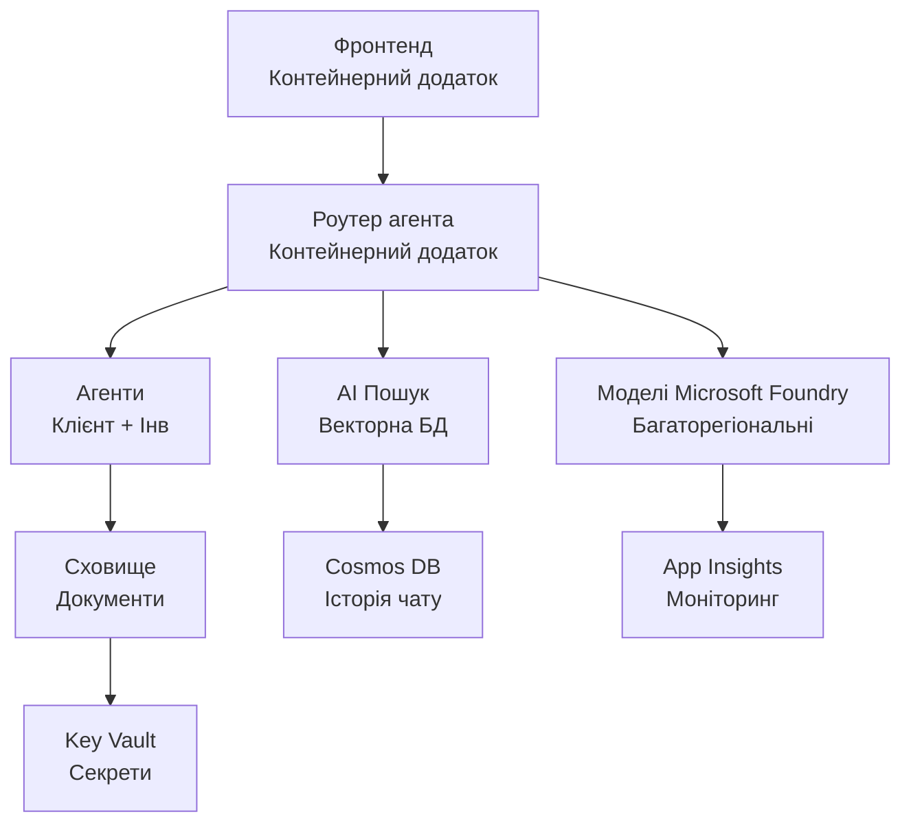

# Роздрібне мультиагентне рішення - інфраструктурний шаблон

**Розділ 5: Пакет розгортання в продуктивному середовищі**  
- **📚 Головна сторінка курсу**: [AZD для початківців](../../README.md)  
- **📖 Пов’язаний розділ**: [Розділ 5: Мультиагентні AI рішення](../../README.md#-chapter-5-multi-agent-ai-solutions-advanced)  
- **📝 Посібник по сценарію**: [Повна архітектура](../retail-scenario.md)  
- **🎯 Швидке розгортання**: [Одноклікове розгортання](#-quick-deployment)

> **⚠️ ЛИШЕ ІНФРАСТРУКТУРНИЙ ШАБЛОН**  
> Цей ARM-шаблон розгортає **ресурси Azure** для мультиагентної системи.  
>  
> **Що розгортається (15-25 хвилин):**  
> - ✅ Сервіси Microsoft Foundry Models (gpt-4.1, gpt-4.1-mini, embeddings у 3 регіонах)  
> - ✅ Сервіс AI Search (порожній, готовий до створення індексів)  
> - ✅ Container Apps (зображення-заповнювачі, готові для вашого коду)  
> - ✅ Storage, Cosmos DB, Key Vault, Application Insights  
>  
> **Що НЕ включено (потрібна розробка):**  
> - ❌ Код реалізації агентів (Customer Agent, Inventory Agent)  
> - ❌ Логіка маршрутизації та API кінцеві точки  
> - ❌ Інтерфейс чату на фронтенді  
> - ❌ Схеми індексів пошуку та канали даних  
> - ❌ **Оцінка часу розробки: 80-120 годин**  
>  
> **Використовуйте цей шаблон, якщо:**  
> - ✅ Бажаєте надати інфраструктуру Azure для мультиагентного проекту  
> - ✅ Плануєте розробляти реалізацію агентів окремо  
> - ✅ Потрібна базова інфраструктура, готова до продуктивного використання  
>  
> **Не використовуйте, якщо:**  
> - ❌ Очікуєте працюючий мультиагентний демо відразу  
> - ❌ Шукаєте повні приклади коду застосунку

## Огляд

Цей каталог містить комплексний ARM-шаблон Azure Resource Manager для розгортання **інфраструктурної основи** мультиагентної системи підтримки клієнтів. Шаблон створює всі необхідні сервіси Azure, коректно налаштовані та взаємозв’язані, готові для розробки вашого застосунку.

**Після розгортання у вас буде:** Інфраструктура Azure, готова до продуктивної експлуатації  
**Для завершення системи потрібно:** Код агентів, інтерфейс фронтенду, налаштування даних (див. [Посібник з архітектури](../retail-scenario.md))

## 🎯 Що розгортається

### Основна інфраструктура (стан після розгортання)

✅ **Сервіси Microsoft Foundry Models** (готові для викликів API)  
  - Основний регіон: розгортання gpt-4.1 (20K TPM потужність)  
  - Вторинний регіон: розгортання gpt-4.1-mini (10K TPM потужність)  
  - Третинний регіон: модель текстових embeddings (30K TPM потужність)  
  - Регіон оцінювання: модель gpt-4.1 grader (15K TPM потужність)  
  - **Статус:** Повністю функціональний – можна робити виклики API негайно

✅ **Azure AI Search** (порожній — готовий до налаштування)  
  - Підтримка векторного пошуку увімкнена  
  - Стандартний рівень з 1 розділом (partition), 1 реплікою  
  - **Статус:** Сервіс працює, потребує створення індексу  
  - **Необхідні дії:** Створіть індекс пошуку за вашою схемою

✅ **Акаунт Azure Storage** (порожній — готовий для завантажень)  
  - Контейнери блобів: `documents`, `uploads`  
  - Захищена конфігурація (тільки HTTPS, без публічного доступу)  
  - **Статус:** Готовий приймати файли  
  - **Необхідні дії:** Завантажте ваші дані про продукти та документи

⚠️ **Середовище Container Apps** (розгорнуті заповнювачі зображень)  
  - Додаток маршрутизатора агентів (nginx - стандартне зображення)  
  - Фронтенд-додаток (nginx - стандартне зображення)  
  - Конфігурація автоскейлінгу (0-10 екземплярів)  
  - **Статус:** Запущені контейнери-заповнювачі  
  - **Необхідні дії:** Створіть і розгорніть ваші агентні додатки

✅ **Azure Cosmos DB** (порожній — готовий до даних)  
  - База даних і контейнери заздалегідь налаштовані  
  - Оптимізовано для низької затримки операцій  
  - Увімкнено TTL для автоматичного очищення  
  - **Статус:** Готовий зберігати історію чатів

✅ **Azure Key Vault** (опційно – готовий для секретів)  
  - Увімкнено м’яке видалення  
  - RBAC налаштований для керованих ідентичностей  
  - **Статус:** Готовий зберігати API ключі та рядки підключень

✅ **Application Insights** (опційно – моніторинг активний)  
  - Підключено до Log Analytics workspace  
  - Налаштовані власні метрики та оповіщення  
  - **Статус:** Готовий отримувати телеметрію від ваших додатків

✅ **Document Intelligence** (готовий для викликів API)  
  - Рівень S0 для продуктивних навантажень  
  - **Статус:** Готовий обробляти завантажені документи

✅ **Bing Search API** (готовий для викликів API)  
  - Рівень S1 для пошуку в реальному часі  
  - **Статус:** Готовий до запитів веб-пошуку

### Режими розгортання

| Режим | Потужність OpenAI | Екземпляри контейнерів | Рівень пошуку | Резервність сховища | Найкраще для |
|-------|-------------------|-----------------------|---------------|---------------------|--------------|
| **Мінімальний** | 10K-20K TPM | 0-2 репліки | Базовий | LRS (локальний) | Розробка/тестування, навчання, proof-of-concept |
| **Стандартний** | 30K-60K TPM | 2-5 реплік | Стандартний | ZRS (зональний) | Продакшн, помірний трафік (<10K користувачів) |
| **Преміальний** | 80K-150K TPM | 5-10 реплік, зональна резервність  | Преміум | GRS (георезерв) | Підприємства, великий трафік (>10K користувачів), 99.99% SLA |

**Вплив на вартість:**  
- **Мінімальний → Стандартний:** приблизно у 4 рази дорожче ($100-370/місяць → $420-1,450/місяць)  
- **Стандартний → Преміальний:** приблизно у 3 рази дорожче ($420-1,450/місяць → $1,150-3,500/місяць)  
- **Вибір залежить від:** очікуваного навантаження, вимог SLA, бюджетних обмежень

**Планування потужності:**  
- **TPM (токенів за хвилину):** сумарно для всіх розгортань моделей  
- **Екземпляри контейнерів:** діапазон автоскейлінгу (мін-макс реплік)  
- **Рівень пошуку:** впливає на продуктивність запитів і ліміти розміру індексу

## 📋 Попередні умови

### Необхідні інструменти  
1. **Azure CLI** (версія 2.50.0 або вища)  
   ```bash
   az --version  # Перевірити версію
   az login      # Аутентифікуватися
   ```
  
2. **Активна підписка Azure** з правами Owner або Contributor  
   ```bash
   az account show  # Перевірте підписку
   ```
  
### Необхідні квоти Azure

Перевірте наявність достатніх квот у цільових регіонах перед розгортанням:

```bash
# Перевірте доступність моделей Microsoft Foundry у вашому регіоні
az cognitiveservices account list-skus \
  --kind OpenAI \
  --location eastus2

# Перевірте квоту OpenAI (приклад для gpt-4.1)
az cognitiveservices usage list \
  --location eastus2 \
  --query "[?name.value=='OpenAI.Standard.gpt-4.1']"

# Перевірте квоту Container Apps
az provider show \
  --namespace Microsoft.App \
  --query "resourceTypes[?resourceType=='managedEnvironments'].locations"
```
  
**Мінімально необхідні квоти:**  
- **Microsoft Foundry Models:** 3-4 розгортання моделей у різних регіонах  
  - gpt-4.1: 20K TPM (токенів за хвилину)  
  - gpt-4.1-mini: 10K TPM  
  - text-embedding-ada-002: 30K TPM  
  - **Примітка:** у деяких регіонах gpt-4.1 може бути у режимі очікування - див. [доступність моделей](https://learn.microsoft.com/azure/ai-services/openai/concepts/models)  
- **Container Apps:** кероване середовище + 2-10 екземплярів контейнерів  
- **AI Search:** стандартний рівень (базовий не підходить для векторного пошуку)  
- **Cosmos DB:** стандартна пропускна здатність

**Якщо квоти недостатні:**  
1. Відкрийте Azure Portal → Quotas → Запит збільшення квот  
2. Або використайте Azure CLI:  
   ```bash
   az support tickets create \
     --ticket-name "OpenAI-Quota-Increase" \
     --severity "minimal" \
     --description "Request quota increase for Microsoft Foundry Models gpt-4.1 in eastus2"
   ```
  
3. Розгляньте альтернативні регіони з доступністю

## 🚀 Швидке розгортання

### Варіант 1: Використання Azure CLI

```bash
# Клонувати або завантажити файли шаблону
git clone <repository-url>
cd examples/retail-multiagent-arm-template

# Зробити скрипт розгортання виконуваним
chmod +x deploy.sh

# Розгорнути з налаштуваннями за замовчуванням
./deploy.sh -g myResourceGroup

# Розгорнути для виробництва з преміум функціями
./deploy.sh -g myProdRG -e prod -m premium -l eastus2
```
  
### Варіант 2: Через портал Azure

[](https://portal.azure.com/#create/Microsoft.Template/uri/https%3A%2F%2Fraw.githubusercontent.com%2Fmicrosoft%2Fazd-for-beginners%2Fmain%2Fexamples%2Fretail-multiagent-arm-template%2Fazuredeploy.json)

### Варіант 3: Безпосереднє використання Azure CLI

```bash
# Створити групу ресурсів
az group create --name myResourceGroup --location eastus2

# Розгорнути шаблон
az deployment group create \
  --resource-group myResourceGroup \
  --template-file azuredeploy.json \
  --parameters azuredeploy.parameters.json
```
  
## ⏱️ Терміни розгортання

### Чого очікувати

| Етап | Тривалість | Що відбувається |
|-------|------------|-----------------||
| **Перевірка шаблону** | 30-60 секунд | Azure перевіряє синтаксис та параметри ARM шаблону |
| **Налаштування групи ресурсів** | 10-20 секунд | Створює групу ресурсів (за потреби) |
| **Надання ресурсів OpenAI** | 5-8 хвилин | Створює 3-4 акаунти OpenAI та розгортає моделі |
| **Container Apps** | 3-5 хвилин | Створює середовище та розгортає контейнери-заповнювачі |
| **Пошук та сховище** | 2-4 хвилини | Створює сервіс AI Search і акаунти зберігання |
| **Cosmos DB** | 2-3 хвилини | Створює базу даних і налаштовує контейнери |
| **Налаштування моніторингу** | 2-3 хвилини | Налаштовує Application Insights і Log Analytics |
| **Конфігурація RBAC** | 1-2 хвилини | Налаштовує керовані ідентичності та дозволи |
| **Загальний час розгортання** | **15-25 хвилин** | Інфраструктура повністю готова |

**Після розгортання:**  
- ✅ **Інфраструктура готова:** всі сервіси Azure створені і працюють  
- ⏱️ **Розробка застосунку:** 80-120 годин (ваша відповідальність)  
- ⏱️ **Налаштування індексу:** 15-30 хвилин (потрібна ваша схема)  
- ⏱️ **Завантаження даних:** залежить від розміру набору даних  
- ⏱️ **Тестування та валідація:** 2-4 години

---

## ✅ Перевірка успіху розгортання

### Крок 1: Перевірте надання ресурсів (2 хвилини)

```bash
# Перевірте, що всі ресурси розгорнуті успішно
az resource list \
  --resource-group myResourceGroup \
  --query "[?provisioningState!='Succeeded'].{Name:name, Status:provisioningState, Type:type}" \
  --output table
```
  
**Очікувано:** Порожня таблиця (усі ресурси мають статус "Succeeded")

### Крок 2: Перевірте розгортання Microsoft Foundry Models (3 хвилини)

```bash
# Перелічити всі облікові записи OpenAI
az cognitiveservices account list \
  --resource-group myResourceGroup \
  --query "[?kind=='OpenAI'].{Name:name, Location:location, Status:properties.provisioningState}" \
  --output table

# Перевірити розгортання моделей для основного регіону
OPENAI_NAME=$(az cognitiveservices account list \
  --resource-group myResourceGroup \
  --query "[?kind=='OpenAI'] | [0].name" -o tsv)

az cognitiveservices account deployment list \
  --name $OPENAI_NAME \
  --resource-group myResourceGroup \
  --output table
```
  
**Очікувано:**  
- 3-4 акаунти OpenAI (основний, вторинний, третинний, регіон оцінювання)  
- 1-2 розгортання моделей на акаунт (gpt-4.1, gpt-4.1-mini, text-embedding-ada-002)

### Крок 3: Перевірте роботу інфраструктурних кінцевих точок (5 хвилин)

```bash
# Отримати URL-адреси додатка контейнера
az containerapp list \
  --resource-group myResourceGroup \
  --query "[].{Name:name, URL:properties.configuration.ingress.fqdn, Status:properties.runningStatus}" \
  --output table

# Перевірити кінцеву точку маршрутизатора (відповість зображення-заповнювач)
ROUTER_URL=$(az containerapp show \
  --name retail-router \
  --resource-group myResourceGroup \
  --query "properties.configuration.ingress.fqdn" -o tsv)

echo "Testing: https://$ROUTER_URL"
curl -I https://$ROUTER_URL || echo "Container running (placeholder image - expected)"
```
  
**Очікувано:**  
- Container Apps у статусі "Running"  
- Заповнювач nginx відповідає HTTP 200 або 404 (код застосунку ще немає)

### Крок 4: Перевірте доступ до API Microsoft Foundry Models (3 хвилини)

```bash
# Отримати кінцеву точку OpenAI та ключ
OPENAI_ENDPOINT=$(az cognitiveservices account show \
  --name $OPENAI_NAME \
  --resource-group myResourceGroup \
  --query "properties.endpoint" -o tsv)

OPENAI_KEY=$(az cognitiveservices account keys list \
  --name $OPENAI_NAME \
  --resource-group myResourceGroup \
  --query "key1" -o tsv)

# Тест розгортання gpt-4.1
curl "${OPENAI_ENDPOINT}openai/deployments/gpt-4.1/chat/completions?api-version=2024-08-01-preview" \
  -H "Content-Type: application/json" \
  -H "api-key: $OPENAI_KEY" \
  -d '{
    "messages": [{"role": "user", "content": "Say hello"}],
    "max_tokens": 10
  }'
```
  
**Очікувано:** JSON-відповідь з завершенням чату (підтверджує функціонування OpenAI)

### Що працює і що ні

**✅ Працює після розгортання:**  
- Моделі Microsoft Foundry Models розгорнуті і приймають API виклики  
- Сервіс AI Search працює (порожній, індекси поки немає)  
- Container Apps працюють (зображення nginx-заповнювачів)  
- Акаунти зберігання доступні і готові до завантаження  
- Cosmos DB готовий до операцій з даними  
- Application Insights збирає телеметрію інфраструктури  
- Key Vault готовий для зберігання секретів

**❌ Поки не працює (потрібна розробка):**  
- Кінцеві точки агентів (код застосунку не розгорнуто)  
- Функціональність чату (вимагає фронтенд та бекенд)  
- Запити пошуку (індекс пошуку ще не створено)  
- Канали обробки документів (дані не завантажені)  
- Користувацька телеметрія (потрібне інструментування застосунку)

**Наступні кроки:** див. [Післярозгортальна конфігурація](#-post-deployment-next-steps) для розробки і розгортання вашого застосунку

---

## ⚙️ Варіанти конфігурації

### Параметри шаблону

| Параметр | Тип | Значення за замовчуванням | Опис |
|----------|-----|---------------------------|------|
| `projectName` | string | "retail" | Префікс для всіх імен ресурсів |
| `location` | string | Локація групи ресурсів | Основний регіон розгортання |
| `secondaryLocation` | string | "westus2" | Другорядний регіон для мульти-регіонального розгортання |
| `tertiaryLocation` | string | "francecentral" | Регіон для моделі embeddings |
| `environmentName` | string | "dev" | Позначення середовища (dev/staging/prod) |
| `deploymentMode` | string | "standard" | Конфігурація розгортання (minimal/standard/premium) |
| `enableMultiRegion` | bool | true | Увімкнути мульти-регіональне розгортання |
| `enableMonitoring` | bool | true | Увімкнути Application Insights і логування |
| `enableSecurity` | bool | true | Увімкнути Key Vault і посилену безпеку |

### Кастомізація параметрів

Редагуйте `azuredeploy.parameters.json`:

```json
{
  "$schema": "https://schema.management.azure.com/schemas/2019-04-01/deploymentParameters.json#",
  "contentVersion": "1.0.0.0",
  "parameters": {
    "projectName": {
      "value": "mycompany"
    },
    "environmentName": {
      "value": "prod"
    },
    "deploymentMode": {
      "value": "premium"
    },
    "location": {
      "value": "eastus2"
    }
  }
}
```
  
## 🏗️ Огляд архітектури


## 📖 Використання скрипта розгортання

Скрипт `deploy.sh` забезпечує інтерактивний досвід розгортання:

```bash
# Показати довідку
./deploy.sh --help

# Базове розгортання
./deploy.sh -g myResourceGroup

# Розширене розгортання з користувацькими налаштуваннями
./deploy.sh \
  -g myProductionRG \
  -p companyname \
  -e prod \
  -m premium \
  -l eastus2

# Розгортання для розробки без мультирегіональності
./deploy.sh \
  -g myDevRG \
  -e dev \
  -m minimal \
  --no-multi-region \
  --no-security
```
  
### Особливості скрипта

- ✅ **Перевірка передумов** (Azure CLI, стан входу, файли шаблону)  
- ✅ **Управління групою ресурсів** (створює, якщо відсутня)  
- ✅ **Перевірка шаблону** перед розгортанням  
- ✅ **Моніторинг прогресу** з кольоровим виводом  
- ✅ **Вивід результатів розгортання**  
- ✅ **Інструкції після розгортання**

## 📊 Моніторинг розгортання

### Перевірка стану розгортання

```bash
# Список розгортань
az deployment group list --resource-group myResourceGroup --output table

# Отримати деталі розгортання
az deployment group show \
  --resource-group myResourceGroup \
  --name retail-deployment-YYYYMMDD-HHMMSS

# Спостерігати за прогресом розгортання
az deployment group create \
  --resource-group myResourceGroup \
  --template-file azuredeploy.json \
  --parameters azuredeploy.parameters.json \
  --verbose
```
  
### Виводи розгортання

Після успішного розгортання доступні такі виводи:

- **URL фронтенду**: Публічна точка доступу веб-інтерфейсу  
- **URL маршрутизатора**: API кінцева точка для агентного маршрутизатора  
- **OpenAI Endpoints**: Основний та вторинний кінцеві точки сервісу OpenAI  
- **Сервіс пошуку**: Кінцева точка сервісу Azure AI Search  
- **Акаунт зберігання**: Ім’я акаунту для збереження документів  
- **Key Vault**: Ім’я сховища ключів (якщо увімкнено)  
- **Application Insights**: Ім’я сервісу моніторингу (якщо увімкнено)

## 🔧 Після розгортання: наступні кроки
> **📝 Важливо:** Інфраструктура розгорнута, але вам потрібно розробити та розгорнути код додатка.

### Фаза 1: Розробка агентських додатків (Ваша відповідальність)

ARM-шаблон створює **порожні Container Apps** з заповнювачами образів nginx. Вам потрібно:

**Обов’язкова розробка:**
1. **Реалізація агента** (30-40 годин)
   - Агент служби підтримки з інтеграцією gpt-4.1
   - Агент інвентаризації з інтеграцією gpt-4.1-mini
   - Логіка маршрутизації агентів

2. **Розробка фронтенду** (20-30 годин)
   - Інтерфейс чату (React/Vue/Angular)
   - Функціональність завантаження файлів
   - Відображення і форматування відповідей

3. **Бекенд-сервіси** (12-16 годин)
   - FastAPI або роутер Express 
   - Проміжне ПЗ для автентифікації
   - Інтеграція телеметрії

**Дивіться:** [Architecture Guide](../retail-scenario.md) для детальних шаблонів реалізації та прикладів коду

### Фаза 2: Налаштування індексу пошуку ШІ (15-30 хвилин)

Створіть індекс пошуку відповідно до вашої моделі даних:

```bash
# Отримати деталі сервісу пошуку
SEARCH_NAME=$(az search service list \
  --resource-group myResourceGroup \
  --query "[0].name" -o tsv)

SEARCH_KEY=$(az search admin-key show \
  --service-name $SEARCH_NAME \
  --resource-group myResourceGroup \
  --query "primaryKey" -o tsv)

# Створити індекс з вашою схемою (приклад)
curl -X POST "https://${SEARCH_NAME}.search.windows.net/indexes?api-version=2023-11-01" \
  -H "Content-Type: application/json" \
  -H "api-key: ${SEARCH_KEY}" \
  -d '{
    "name": "products",
    "fields": [
      {"name": "id", "type": "Edm.String", "key": true},
      {"name": "title", "type": "Edm.String", "searchable": true},
      {"name": "content", "type": "Edm.String", "searchable": true},
      {"name": "category", "type": "Edm.String", "filterable": true},
      {"name": "content_vector", "type": "Collection(Edm.Single)", 
       "searchable": true, "dimensions": 1536, "vectorSearchProfile": "default"}
    ],
    "vectorSearch": {
      "algorithms": [{"name": "default", "kind": "hnsw"}],
      "profiles": [{"name": "default", "algorithm": "default"}]
    }
  }'
```

**Ресурси:**
- [Проєктування схеми індексу AI Search](https://learn.microsoft.com/azure/search/search-what-is-an-index)
- [Налаштування векторного пошуку](https://learn.microsoft.com/azure/search/vector-search-how-to-create-index)

### Фаза 3: Завантаження ваших даних (Час залежить)

Після того, як у вас з’являться дані про продукти та документи:

```bash
# Отримати дані облікового запису сховища
STORAGE_NAME=$(az storage account list \
  --resource-group myResourceGroup \
  --query "[0].name" -o tsv)

STORAGE_KEY=$(az storage account keys list \
  --account-name $STORAGE_NAME \
  --resource-group myResourceGroup \
  --query "[0].value" -o tsv)

# Завантажте свої документи
az storage blob upload-batch \
  --destination documents \
  --source /path/to/your/product/docs \
  --account-name $STORAGE_NAME \
  --account-key $STORAGE_KEY

# Приклад: Завантажити один файл
az storage blob upload \
  --container-name documents \
  --name "product-manual.pdf" \
  --file /path/to/product-manual.pdf \
  --account-name $STORAGE_NAME \
  --account-key $STORAGE_KEY
```

### Фаза 4: Збірка та розгортання ваших додатків (8-12 годин)

Коли ви розробили код агента:

```bash
# 1. Створіть реєстр контейнерів Azure (за потреби)
az acr create \
  --name myregistry \
  --resource-group myResourceGroup \
  --sku Basic

# 2. Побудуйте та надішліть образ агента маршрутизатора
docker build -t myregistry.azurecr.io/agent-router:v1 /path/to/your/router/code
az acr login --name myregistry
docker push myregistry.azurecr.io/agent-router:v1

# 3. Побудуйте та надішліть образ фронтенда
docker build -t myregistry.azurecr.io/frontend:v1 /path/to/your/frontend/code
docker push myregistry.azurecr.io/frontend:v1

# 4. Оновіть контейнерні застосунки з вашими образами
az containerapp update \
  --name retail-router \
  --resource-group myResourceGroup \
  --image myregistry.azurecr.io/agent-router:v1

az containerapp update \
  --name retail-frontend \
  --resource-group myResourceGroup \
  --image myregistry.azurecr.io/frontend:v1

# 5. Налаштуйте змінні середовища
az containerapp update \
  --name retail-router \
  --resource-group myResourceGroup \
  --set-env-vars \
    OPENAI_ENDPOINT=secretref:openai-endpoint \
    OPENAI_KEY=secretref:openai-key \
    SEARCH_ENDPOINT=secretref:search-endpoint \
    SEARCH_KEY=secretref:search-key
```

### Фаза 5: Тестування вашого додатка (2-4 години)

```bash
# Отримайте URL вашої програми
ROUTER_URL=$(az containerapp show \
  --name retail-router \
  --resource-group myResourceGroup \
  --query "properties.configuration.ingress.fqdn" -o tsv)

# Кінцева точка тестового агента (після розгортання вашого коду)
curl -X POST "https://${ROUTER_URL}/chat" \
  -H "Content-Type: application/json" \
  -d '{
    "message": "Hello, I need help with my order",
    "agent": "customer"
  }'

# Перевірте журнали програми
az containerapp logs show \
  --name retail-router \
  --resource-group myResourceGroup \
  --follow
```

### Ресурси для реалізації

**Архітектура та дизайн:**
- 📖 [Повний посібник з архітектури](../retail-scenario.md) - Детальні шаблони реалізації
- 📖 [Шаблони дизайну мультиагентних систем](https://learn.microsoft.com/azure/architecture/ai-ml/guide/multi-agent-systems)

**Приклади коду:**
- 🔗 [Microsoft Foundry Models Chat Sample](https://github.com/Azure-Samples/azure-search-openai-demo) - патерн RAG
- 🔗 [Semantic Kernel](https://github.com/microsoft/semantic-kernel) - агентський фреймворк (C#)
- 🔗 [LangChain Azure](https://github.com/langchain-ai/langchain) - оркестрація агентів (Python)
- 🔗 [AutoGen](https://github.com/microsoft/autogen) - мультиагентні розмови

**Оцінка загальних зусиль:**
- Розгортання інфраструктури: 15-25 хвилин (✅ Завершено)
- Розробка додатка: 80-120 годин (🔨 Ваша робота)
- Тестування та оптимізація: 15-25 годин (🔨 Ваша робота)

## 🛠️ Усунення проблем

### Типові проблеми

#### 1. Перевищено квоту моделей Microsoft Foundry

```bash
# Перевірте поточне використання квоти
az cognitiveservices usage list --location eastus2

# Запит на збільшення квоти
az support tickets create \
  --ticket-name "OpenAI-Quota-Increase" \
  --severity "minimal" \
  --description "Request quota increase for Microsoft Foundry Models in region X"
```

#### 2. Помилка розгортання Container Apps

```bash
# Перевірити журнали контейнерного додатку
az containerapp logs show \
  --name retail-router \
  --resource-group myResourceGroup \
  --follow

# Перезапустити контейнерний додаток
az containerapp revision restart \
  --name retail-router \
  --resource-group myResourceGroup
```

#### 3. Ініціалізація служби пошуку

```bash
# Перевірити стан служби пошуку
az search service show \
  --name <search-service-name> \
  --resource-group myResourceGroup

# Тестувати підключення до служби пошуку
curl -X GET "https://<search-service-name>.search.windows.net/indexes?api-version=2023-11-01" \
  -H "api-key: <search-admin-key>"
```

### Перевірка розгортання

```bash
# Перевірити, чи створені всі ресурси
az resource list \
  --resource-group myResourceGroup \
  --output table

# Перевірити стан ресурсу
az resource list \
  --resource-group myResourceGroup \
  --query "[?provisioningState!='Succeeded'].{Name:name, Status:provisioningState, Type:type}" \
  --output table
```

## 🔐 Розгляд безпеки

### Керування ключами
- Усі секрети зберігаються в Azure Key Vault (при увімкненні)
- Container Apps використовують керовану ідентичність для автентифікації
- Облікові записи сховища мають безпечні налаштування за замовчуванням (тільки HTTPS, без публічного доступу до об’єктів)

### Безпека мережі
- Container Apps використовують внутрішню мережу, де можливо
- Служба пошуку налаштована з опцією приватних кінцевих точок
- Cosmos DB налаштовано з мінімально необхідними дозволами

### Налаштування RBAC
```bash
# Призначте необхідні ролі для керованої ідентичності
az role assignment create \
  --assignee <container-app-managed-identity> \
  --role "Cognitive Services OpenAI User" \
  --scope <openai-resource-id>
```

## 💰 Оптимізація витрат

### Оцінка вартості (щомісячно, USD)

| Режим | OpenAI | Container Apps | Search | Storage | Загальна оцінка |
|-------|--------|----------------|--------|---------|-----------------|
| Мінімальний | $50-200 | $20-50 | $25-100 | $5-20 | $100-370 |
| Стандартний | $200-800 | $100-300 | $100-300 | $20-50 | $420-1450 |
| Преміум | $500-2000 | $300-800 | $300-600 | $50-100 | $1150-3500 |

### Моніторинг витрат

```bash
# Встановити оповіщення про бюджет
az consumption budget create \
  --account-name <subscription-id> \
  --budget-name "retail-budget" \
  --amount 500 \
  --time-grain Monthly \
  --start-date 2024-01-01 \
  --end-date 2024-12-31
```

## 🔄 Оновлення та обслуговування

### Оновлення шаблонів
- Виконуйте контроль версій файлів ARM-шаблонів
- Спочатку тестуйте зміни в середовищі розробки
- Використовуйте режим інкрементального розгортання для оновлень

### Оновлення ресурсів
```bash
# Оновлення з новими параметрами
az deployment group create \
  --resource-group myResourceGroup \
  --template-file azuredeploy.json \
  --parameters azuredeploy.parameters.json \
  --mode Incremental
```

### Резервне копіювання та відновлення
- Автоматичне резервне копіювання Cosmos DB увімкнено
- Увімкнено функцію м’якого видалення Key Vault
- Зберігаються ревізії Container Apps для відкату

## 📞 Підтримка

- **Проблеми з шаблоном**: [GitHub Issues](https://github.com/microsoft/azd-for-beginners/issues)
- **Підтримка Azure**: [Azure Support Portal](https://portal.azure.com/#blade/Microsoft_Azure_Support/HelpAndSupportBlade)
- **Спільнота**: [Azure AI Discord](https://discord.gg/microsoft-azure)

---

**⚡ Готові розгорнути своє мультиагентне рішення?**

Почніть з: `./deploy.sh -g myResourceGroup`

---

<!-- CO-OP TRANSLATOR DISCLAIMER START -->
**Відмова від відповідальності**:
Цей документ було перекладено за допомогою сервісу автоматичного перекладу [Co-op Translator](https://github.com/Azure/co-op-translator). Хоча ми прагнемо до точності, будь ласка, майте на увазі, що автоматичні переклади можуть містити помилки або неточності. Оригінальний документ його рідною мовою слід вважати авторитетним джерелом. Для критично важливої інформації рекомендується професійний людський переклад. Ми не несемо відповідальності за будь-які непорозуміння або неправильні тлумачення, що виникають внаслідок використання цього перекладу.
<!-- CO-OP TRANSLATOR DISCLAIMER END -->