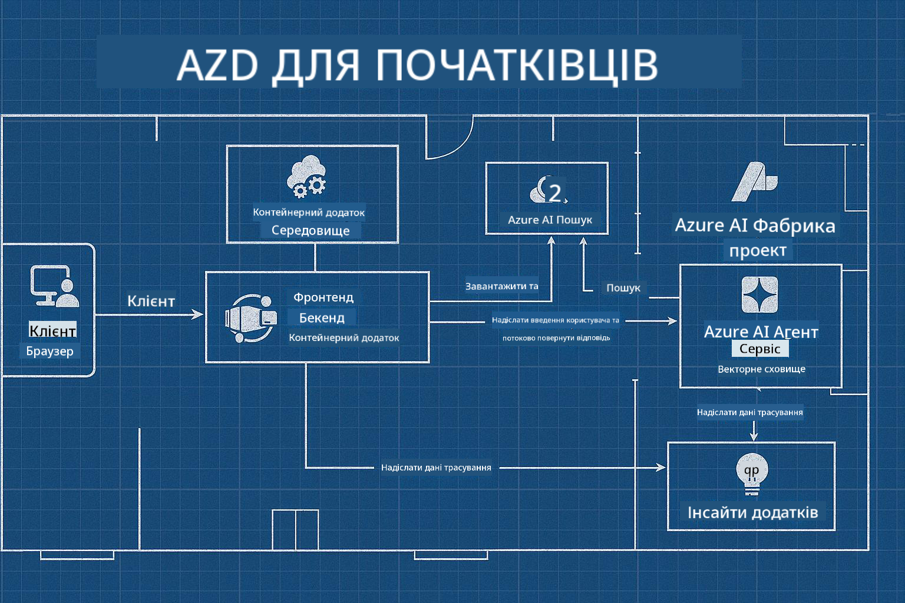

<!--
CO_OP_TRANSLATOR_METADATA:
{
  "original_hash": "245d24997bbcf2bae93bb2a503845d37",
  "translation_date": "2025-09-23T12:09:17+00:00",
  "source_file": "workshop/README.md",
  "language_code": "uk"
}
-->
# AZD для розробників AI: Воркшоп

## Шаблони AZD

Створення рішення для корпоративного AI-додатку, яке відповідає вашому конкретному сценарію, дуже схоже на будівництво власного будинку. Ви можете спроєктувати його самостійно, будувати цеглина за цеглиною і взяти на себе відповідальність за те, щоб він відповідав усім правилам управління та розробки.

**АБО ....**

Ви можете працювати з архітектором, який надасть вам _план_ для стартового будинку, а потім допоможе вам _налаштувати_ його відповідно до ваших потреб. Це дозволяє вам зосередитися на тому, що робить **ваш будинок** особливим, а основні проводки, сантехніку та інші залежності забезпечать експерти.

**Це підхід, який лежить в основі [AI App Templates](https://ai.azure.com/templates)** - серія планів для створення різних типів "будинків" AI-додатків залежно від ваших основних потреб і залежностей.

## Налаштування шаблонів

Шаблони розроблені для роботи з [Azure AI Foundry](https://ai.azure.com). Уявіть цю платформу як вашого "будівельного підрядника", який має доступ до всіх ресурсів, інструментів і експертизи, необхідних для виконання роботи!

Все, що вам потрібно, це вибрати [ваші стартові шаблони](https://learn.microsoft.com/en-us/azure/ai-foundry/how-to/develop/ai-template-get-started). Наприклад, ми зосередимося на шаблоні _Get Started with AI Agents_, щоб створити "агентний AI-будинок", який буде оснащений функціями, такими як AI Search, Red Teaming, Evaluations, Tracing, Monitoring та інше!



Все, що вам потрібно, це забронювати час з архітектором, який проведе вас через процес налаштування. [GitHub Copilot for Azure](https://learn.microsoft.com/en-us/azure/developer/github-copilot-azure/get-started) може бути вашим гідом. Просто "спілкуйтеся з ним", щоб:

- Дізнатися про функції Azure у вашому шаблоні
- Розгорнути ресурси Azure
- Отримати інформацію про ваше розгортання
- Діагностувати та вирішувати проблеми!

У цьому воркшопі ми навчимося _розбирати_ існуючий шаблон (щоб зрозуміти, що він пропонує), а потім _налаштовувати_ його (щоб відповідати нашим вимогам) - крок за кроком.

Шаблони AI **роблять це можливим** - завершивши воркшоп, ви навчитеся **робити це своїм**

----

**Навігація воркшопу**
- **📚 Домашня сторінка курсу**: [AZD для початківців](../README.md)
- **📖 Пов’язані розділи**: Охоплює [Розділ 1](../README.md#-chapter-1-foundation--quick-start), [Розділ 2](../README.md#-chapter-2-ai-first-development-recommended-for-ai-developers) та [Розділ 5](../README.md#-chapter-5-multi-agent-ai-solutions-advanced)
- **🛠️ Практичний лабораторний курс**: [AI Workshop Lab](../docs/ai-foundry/ai-workshop-lab.md)
- **🚀 Наступні кроки**: [Модулі воркшопу](../../../workshop)

Ласкаво просимо до практичного воркшопу з вивчення Azure Developer CLI (AZD) з акцентом на розгортання AI-додатків. Цей воркшоп розроблений, щоб провести вас від основ AZD до розгортання готових до виробництва AI-рішень.

## Огляд воркшопу

**Тривалість:** 2-3 години  
**Рівень:** Початковий до середнього  
**Попередні знання:** Базові знання Azure, інструментів командного рядка та концепцій AI

### Що ви навчитеся

- **Основи AZD**: Розуміння інфраструктури як коду з AZD
- 🤖 **Інтеграція AI-сервісів**: Розгортання Azure OpenAI, AI Search та інших AI-сервісів
- **Розгортання контейнерів**: Використання Azure Container Apps для AI-додатків
- **Найкращі практики безпеки**: Реалізація Managed Identity та безпечних конфігурацій
- **Моніторинг та спостереження**: Налаштування Application Insights для AI-навантажень
- **Шаблони для виробництва**: Стратегії розгортання корпоративного рівня

## Структура воркшопу

### Модуль 1: Основи AZD (30 хвилин)
- Встановлення та налаштування AZD
- Розуміння структури проєкту AZD
- Ваше перше розгортання AZD
- **Лабораторна робота**: Розгорніть простий веб-додаток

### Модуль 2: Інтеграція Azure OpenAI (45 хвилин)
- Налаштування ресурсів Azure OpenAI
- Стратегії розгортання моделей
- Налаштування доступу до API та автентифікації
- **Лабораторна робота**: Розгорніть чат-додаток з GPT-4

### Модуль 3: RAG-додатки (45 хвилин)
- Інтеграція Azure AI Search
- Обробка документів за допомогою Azure Document Intelligence
- Векторні вбудовування та семантичний пошук
- **Лабораторна робота**: Створіть систему запитань і відповідей на основі документів

### Модуль 4: Розгортання у виробництво (30 хвилин)
- Конфігурація Container Apps
- Оптимізація масштабування та продуктивності
- Моніторинг та ведення журналів
- **Лабораторна робота**: Розгортання у виробництво зі спостереженням

### Модуль 5: Розширені шаблони (15 хвилин)
- Розгортання у кількох середовищах
- Інтеграція CI/CD
- Стратегії оптимізації витрат
- **Підсумок**: Контрольний список готовності до виробництва

## Попередні вимоги

### Необхідні інструменти

Будь ласка, встановіть ці інструменти перед воркшопом:

```bash
# Azure Developer CLI
curl -fsSL https://aka.ms/install-azd.sh | bash

# Azure CLI
curl -sL https://aka.ms/InstallAzureCLIDeb | sudo bash

# Git
sudo apt-get install git

# Docker
curl -fsSL https://get.docker.com -o get-docker.sh
sudo sh get-docker.sh

# Python 3.10+
sudo apt-get install python3.10 python3.10-venv python3-pip
```

### Налаштування облікового запису Azure

1. **Підписка Azure**: [Зареєструйтесь безкоштовно](https://azure.microsoft.com/free/)
2. **Доступ до Azure OpenAI**: [Запросіть доступ](https://aka.ms/oai/access)
3. **Необхідні дозволи**:
   - Роль Contributor для підписки або групи ресурсів
   - User Access Administrator (для призначення RBAC)

### Перевірка попередніх вимог

Запустіть цей скрипт, щоб перевірити вашу конфігурацію:

```bash
#!/bin/bash
echo "Verifying workshop prerequisites..."

# Check AZD installation
if command -v azd &> /dev/null; then
    echo "✅ Azure Developer CLI: $(azd --version)"
else
    echo "❌ Azure Developer CLI not found"
fi

# Check Azure CLI
if command -v az &> /dev/null; then
    echo "✅ Azure CLI: $(az --version | head -n1)"
else
    echo "❌ Azure CLI not found"
fi

# Check Docker
if command -v docker &> /dev/null; then
    echo "✅ Docker: $(docker --version)"
else
    echo "❌ Docker not found"
fi

# Check Python
if command -v python3 &> /dev/null; then
    echo "✅ Python: $(python3 --version)"
else
    echo "❌ Python 3 not found"
fi

# Check Azure login
if az account show &> /dev/null; then
    echo "✅ Azure: Logged in as $(az account show --query user.name -o tsv)"
else
    echo "❌ Azure: Not logged in (run 'az login')"
fi

echo "Setup verification complete!"
```

## Матеріали воркшопу

### Лабораторні вправи

Кожен модуль включає практичні лабораторні роботи зі стартовим кодом і покроковими інструкціями:

- **[lab-1-azd-basics/](../../../workshop/lab-1-azd-basics)** - Ваше перше розгортання AZD
- **[lab-2-openai-chat/](../../../workshop/lab-2-openai-chat)** - Чат-додаток з Azure OpenAI
- **[lab-3-rag-search/](../../../workshop/lab-3-rag-search)** - RAG-додаток з AI Search
- **[lab-4-production/](../../../workshop/lab-4-production)** - Шаблони розгортання у виробництво
- **[lab-5-advanced/](../../../workshop/lab-5-advanced)** - Розширені сценарії розгортання

### Довідкові матеріали

- **[Посібник з інтеграції AI Foundry](../docs/ai-foundry/azure-ai-foundry-integration.md)** - Комплексні шаблони інтеграції
- **[Посібник з розгортання моделей AI](../docs/ai-foundry/ai-model-deployment.md)** - Найкращі практики розгортання моделей
- **[Практики AI для виробництва](../docs/ai-foundry/production-ai-practices.md)** - Шаблони розгортання корпоративного рівня
- **[Посібник з усунення несправностей AI](../docs/troubleshooting/ai-troubleshooting.md)** - Поширені проблеми та рішення

### Шаблони для прикладів

Швидкі стартові шаблони для поширених AI-сценаріїв:

```
workshop/templates/
├── minimal-chat/          # Basic OpenAI chat app
├── rag-application/       # RAG with AI Search
├── multi-model/          # Multiple AI services
└── production-ready/     # Enterprise template
```

## Початок роботи

### Варіант 1: GitHub Codespaces (рекомендовано)

Найшвидший спосіб розпочати воркшоп:

[](https://github.com/codespaces/new?hide_repo_select=true&ref=main&repo=YOUR_REPO_ID)

### Варіант 2: Локальна розробка

1. **Клонувати репозиторій воркшопу:**
```bash
git clone https://github.com/YOUR_ORG/AZD-for-beginners.git
cd AZD-for-beginners/workshop
```

2. **Увійти до Azure:**
```bash
az login
azd auth login
```

3. **Розпочати з Лабораторії 1:**
```bash
cd lab-1-azd-basics
cat README.md  # Follow the instructions
```

### Варіант 3: Воркшоп під керівництвом інструктора

Якщо ви берете участь у сесії під керівництвом інструктора:

- 🎥 **Запис воркшопу**: [Доступний на вимогу](https://aka.ms/azd-ai-workshop)
- 💬 **Спільнота Discord**: [Приєднуйтесь для живої підтримки](https://aka.ms/foundry/discord)
- **Зворотній зв'язок щодо воркшопу**: [Поділіться своїм досвідом](https://aka.ms/azd-workshop-feedback)

## Таймлайн воркшопу

### Самостійне навчання (3 години)

```
⏰ 00:00 - 00:30  Module 1: AZD Foundations
⏰ 00:30 - 01:15  Module 2: Azure OpenAI Integration
⏰ 01:15 - 02:00  Module 3: RAG Applications
⏰ 02:00 - 02:30  Module 4: Production Deployment
⏰ 02:30 - 02:45  Module 5: Advanced Patterns
⏰ 02:45 - 03:00  Q&A and Next Steps
```

### Сесія під керівництвом інструктора (2.5 години)

```
⏰ 00:00 - 00:15  Welcome & Prerequisites Check
⏰ 00:15 - 00:40  Module 1: Live Demo + Lab
⏰ 00:40 - 01:20  Module 2: OpenAI Integration
⏰ 01:20 - 01:30  Break
⏰ 01:30 - 02:10  Module 3: RAG Applications
⏰ 02:10 - 02:30  Module 4: Production Patterns
⏰ 02:30 - 02:45  Module 5: Advanced Topics
⏰ 02:45 - 03:00  Q&A and Resources
```

## Критерії успіху

До кінця цього воркшопу ви зможете:

✅ **Розгортати AI-додатки** за допомогою шаблонів AZD  
✅ **Налаштовувати Azure OpenAI** сервіси з належною безпекою  
✅ **Створювати RAG-додатки** з інтеграцією Azure AI Search  
✅ **Реалізовувати шаблони для виробництва** для корпоративних AI-навантажень  
✅ **Моніторити та усувати несправності** розгортання AI-додатків  
✅ **Застосовувати стратегії оптимізації витрат** для AI-навантажень  

## Спільнота та підтримка

### Під час воркшопу

- 🙋 **Запитання**: Використовуйте чат воркшопу або підніміть руку
- 🐛 **Проблеми**: Перевірте [посібник з усунення несправностей](../docs/troubleshooting/ai-troubleshooting.md)
- **Поради**: Діліться відкриттями з іншими учасниками

### Після воркшопу

- 💬 **Discord**: [Спільнота Azure AI Foundry](https://aka.ms/foundry/discord)
- **GitHub Issues**: [Повідомити про проблеми з шаблонами](https://github.com/YOUR_ORG/AZD-for-beginners/issues)
- 📧 **Зворотній зв'язок**: [Форма оцінки воркшопу](https://aka.ms/azd-workshop-feedback)

## Наступні кроки

### Продовжуйте навчання

1. **Розширені сценарії**: Досліджуйте [розгортання у кількох регіонах](../docs/ai-foundry/production-ai-practices.md#multi-region-deployment)
2. **Інтеграція CI/CD**: Налаштуйте [робочі процеси GitHub Actions](../docs/deployment/github-actions.md)
3. **Користувацькі шаблони**: Створіть власні [шаблони AZD](../docs/getting-started/custom-templates.md)

### Застосовуйте у своїх проєктах

1. **Оцінка**: Використовуйте наш [контрольний список готовності](./production-readiness-checklist.md)
2. **Шаблони**: Почніть з наших [AI-специфічних шаблонів](../../../workshop/templates)
3. **Підтримка**: Приєднуйтесь до [Discord Azure AI Foundry](https://aka.ms/foundry/discord)

### Поділіться своїм успіхом

- ⭐ **Поставте зірочку репозиторію**, якщо цей воркшоп вам допоміг
- 🐦 **Поділіться у соціальних мережах** з хештегами #AzureDeveloperCLI #AzureAI
- 📝 **Напишіть блог** про ваш шлях розгортання AI

---

## Зворотній зв'язок щодо воркшопу

Ваш зворотній зв'язок допомагає нам покращити досвід воркшопу:

| Аспект | Оцінка (1-5) | Коментарі |
|--------|--------------|----------|
| Якість контенту | ⭐⭐⭐⭐⭐ | |
| Практичні лабораторії | ⭐⭐⭐⭐⭐ | |
| Документація | ⭐⭐⭐⭐⭐ | |
| Рівень складності | ⭐⭐⭐⭐⭐ | |
| Загальний досвід | ⭐⭐⭐⭐⭐ | |

**Надіслати зворотній зв'язок**: [Форма оцінки воркшопу](https://aka.ms/azd-workshop-feedback)

---

**Попереднє:** [Посібник з усунення несправностей AI](../docs/troubleshooting/ai-troubleshooting.md) | **Наступне:** Почніть з [Лабораторії 1: Основи AZD](../../../workshop/lab-1-azd-basics)

**Готові почати створювати AI-додатки з AZD?**

[Почати Лабораторію 1: Основи AZD →](./lab-1-azd-basics/README.md)

---

