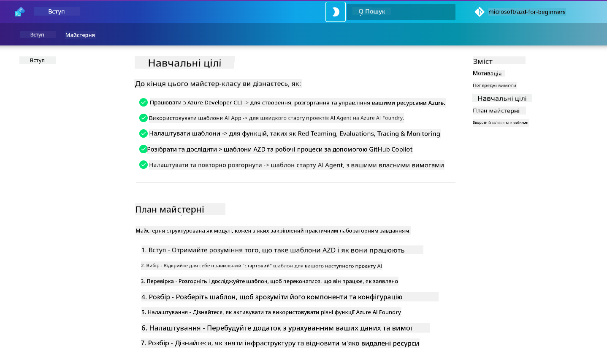

<!--
CO_OP_TRANSLATOR_METADATA:
{
  "original_hash": "9cc966416ab431c38b2ab863884b196c",
  "translation_date": "2025-09-25T01:47:29+00:00",
  "source_file": "workshop/README.md",
  "language_code": "uk"
}
-->
# AZD для розробників AI: Воркшоп

Ласкаво просимо до практичного воркшопу з вивчення Azure Developer CLI (AZD) з акцентом на розгортання AI-додатків. Цей воркшоп допоможе вам отримати практичне розуміння шаблонів AZD у трьох кроках:

1. **Ознайомлення** - знайдіть шаблон, який вам підходить.
1. **Розгортання** - розгорніть і переконайтеся, що він працює.
1. **Налаштування** - змініть і адаптуйте його під свої потреби!

Протягом воркшопу ви також ознайомитеся з основними інструментами для розробників і робочими процесами, які допоможуть вам оптимізувати ваш шлях розробки від початку до кінця.

<br/>

## Інструкція у браузері

Уроки воркшопу представлені у форматі Markdown. Ви можете переглядати їх безпосередньо на GitHub або запустити попередній перегляд у браузері, як показано на скріншоті нижче.



Щоб скористатися цією опцією, зробіть форк репозиторію у свій профіль і запустіть GitHub Codespaces. Коли термінал VS Code стане активним, введіть цю команду:

```bash title="" linenums="0"
mkdocs serve > /dev/null 2>&1 &
```

Через кілька секунд з'явиться діалогове вікно. Виберіть опцію `Open in browser`. Інструкція у веб-форматі відкриється в новій вкладці браузера. Деякі переваги цього перегляду:

1. **Вбудований пошук** - швидко знаходьте ключові слова або уроки.
1. **Іконка копіювання** - наведіть курсор на блоки коду, щоб побачити цю опцію.
1. **Перемикання теми** - змінюйте теми між темною і світлою.
1. **Отримати допомогу** - натисніть на іконку Discord у футері, щоб приєднатися!

<br/>

## Огляд воркшопу

**Тривалість:** 3-4 години  
**Рівень:** Початковий до середнього  
**Попередні знання:** Знання Azure, концепцій AI, VS Code та інструментів командного рядка.

Це практичний воркшоп, де ви навчаєтеся через виконання завдань. Після завершення вправ ми рекомендуємо переглянути курс AZD For Beginners, щоб продовжити навчання у сфері безпеки та продуктивності.

| Час | Модуль  | Ціль |
|:---|:---|:---|
| 15 хв | [Вступ](docs/instructions/0-Introduction.md) | Зрозуміти цілі воркшопу |
| 30 хв | [Вибір AI-шаблону](docs/instructions/1-Select-AI-Template.md) | Дослідити варіанти і вибрати стартовий шаблон | 
| 30 хв | [Перевірка AI-шаблону](docs/instructions/2-Validate-AI-Template.md) | Розгорнути стандартне рішення на Azure |
| 30 хв | [Розбір AI-шаблону](docs/instructions/3-Deconstruct-AI-Template.md) | Дослідити структуру і конфігурацію |
| 30 хв | [Налаштування AI-шаблону](docs/instructions/4-Configure-AI-Template.md) | Активувати і протестувати доступні функції |
| 30 хв | [Адаптація AI-шаблону](docs/instructions/5-Customize-AI-Template.md) | Змінити шаблон під свої потреби |
| 30 хв | [Видалення інфраструктури](docs/instructions/6-Teardown-Infrastructure.md) | Очистити і звільнити ресурси |
| 15 хв | [Підсумки та наступні кроки](docs/instructions/7-Wrap-up.md) | Ресурси для навчання, виклик воркшопу |

<br/>

## Що ви навчитеся

Думайте про шаблон AZD як про навчальну платформу для дослідження різних можливостей і інструментів для розробки на Azure AI Foundry. До кінця воркшопу ви повинні отримати інтуїтивне розуміння різних інструментів і концепцій у цьому контексті.

| Концепція  | Ціль |
|:---|:---|
| **Azure Developer CLI** | Зрозуміти команди та робочі процеси інструменту |
| **Шаблони AZD**| Зрозуміти структуру проекту і конфігурацію |
| **Azure AI Agent**| Розгортання проекту Azure AI Foundry |
| **Azure AI Search**| Активувати контекстну інженерію з агентами |
| **Спостережуваність**| Дослідити трасування, моніторинг і оцінки |
| **Red Teaming**| Дослідити тестування на вразливості і заходи захисту |

<br/>

## Структура воркшопу

Воркшоп побудований як подорож від пошуку шаблону до його розгортання, розбору і налаштування, використовуючи офіційний стартовий шаблон [Getting Started with AI Agents](https://github.com/Azure-Samples/get-started-with-ai-agents).

### [Модуль 1: Вибір AI-шаблону](docs/instructions/1-Select-AI-Template.md) (30 хв)

- Що таке AI-шаблони?
- Де знайти AI-шаблони?
- Як почати створювати AI-агенти?
- **Лабораторна робота**: Швидкий старт з GitHub Codespaces

### [Модуль 2: Перевірка AI-шаблону](docs/instructions/2-Validate-AI-Template.md) (30 хв)

- Що таке архітектура AI-шаблону?
- Що таке робочий процес розробки AZD?
- Як отримати допомогу з розробкою AZD?
- **Лабораторна робота**: Розгортання і перевірка шаблону AI-агентів

### [Модуль 3: Розбір AI-шаблону](docs/instructions/3-Deconstruct-AI-Template.md) (30 хв)

- Дослідження середовища у `.azure/` 
- Дослідження налаштування ресурсів у `infra/` 
- Дослідження конфігурації AZD у `azure.yaml`
- **Лабораторна робота**: Зміна змінних середовища і повторне розгортання

### [Модуль 4: Налаштування AI-шаблону](docs/instructions/4-Configure-AI-Template.md) (30 хв)
- Дослідження: Генерація з доповненням пошуку
- Дослідження: Оцінка агентів і Red Teaming
- Дослідження: Трасування і моніторинг
- **Лабораторна робота**: Дослідження AI-агента + спостережуваність 

### [Модуль 5: Адаптація AI-шаблону](docs/instructions/5-Customize-AI-Template.md) (30 хв)
- Визначення: PRD зі сценаріями вимог
- Налаштування: Змінні середовища для AZD
- Реалізація: Хуки життєвого циклу для додаткових завдань
- **Лабораторна робота**: Адаптація шаблону під мій сценарій

### [Модуль 6: Видалення інфраструктури](docs/instructions/6-Teardown-Infrastructure.md) (30 хв)
- Підсумки: Що таке шаблони AZD?
- Підсумки: Чому варто використовувати Azure Developer CLI?
- Наступні кроки: Спробуйте інший шаблон!
- **Лабораторна робота**: Видалення інфраструктури і очищення

<br/>

## Виклик воркшопу

Хочете кинути собі виклик і зробити більше? Ось кілька пропозицій проектів - або поділіться своїми ідеями з нами!

| Проект | Опис |
|:---|:---|
|1. **Розбір складного AI-шаблону** | Використовуйте робочий процес і інструменти, які ми описали, і спробуйте розгорнути, перевірити і адаптувати інший шаблон AI-рішення. _Що ви дізналися?_|
|2. **Адаптація під ваш сценарій**  | Спробуйте написати PRD (документ вимог до продукту) для іншого сценарію. Потім використовуйте GitHub Copilot у вашому репозиторії шаблонів в Agent Model - і попросіть його створити для вас робочий процес адаптації. _Що ви дізналися? Як можна покращити ці пропозиції?_|
| | |

## Є відгуки?

1. Створіть issue у цьому репозиторії - позначте його як `Workshop` для зручності.
1. Приєднуйтесь до Discord Azure AI Foundry - спілкуйтеся з колегами!


| | | 
|:---|:---|
| **📚 Головна сторінка курсу**| [AZD For Beginners](../README.md)|
| **📖 Документація** | [Початок роботи з AI-шаблонами](https://learn.microsoft.com/en-us/azure/ai-foundry/how-to/develop/ai-template-get-started)|
| **🛠️AI-шаблони** | [Шаблони Azure AI Foundry](https://ai.azure.com/templates) |
|**🚀 Наступні кроки** | [Прийміть виклик](../../../workshop) |
| | |

<br/>

---

**Попередній:** [Посібник з усунення несправностей AI](../docs/troubleshooting/ai-troubleshooting.md) | **Наступний:** Почніть з [Лабораторії 1: Основи AZD](../../../workshop/lab-1-azd-basics)

**Готові почати створювати AI-додатки з AZD?**

[Почати Лабораторію 1: Основи AZD →](./lab-1-azd-basics/README.md)

---

