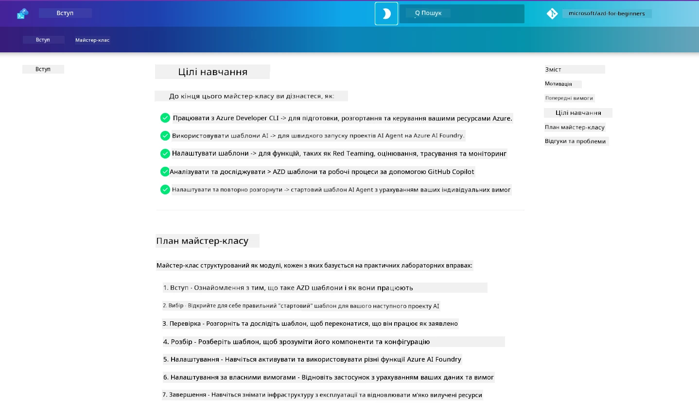

<div align="center">
  <div style="background: linear-gradient(135deg, #0078d4, #106ebe); border-radius: 10px; padding: 20px; margin: 20px 0; box-shadow: 0 4px 15px rgba(0, 120, 212, 0.3); border: 2px solid #005a9e;">
    <h2 style="color: white; margin: 0; font-size: 24px; text-shadow: 1px 1px 2px rgba(0,0,0,0.3);">
      🎯 Майстер-клас AZD для розробників штучного інтелекту
    </h2>
    <p style="color: white; margin: 10px 0 0 0; font-size: 16px; text-shadow: 1px 1px 2px rgba(0,0,0,0.3);">
      <strong>Практичний майстер-клас зі створення AI-застосунків за допомогою Azure Developer CLI.</strong><br>
      Пройдіть 7 модулів, щоб опанувати шаблони AZD та робочі процеси розгортання AI.
    </p>
    <div style="margin-top: 15px;">
      <span style="background: rgba(255,255,255,0.2); padding: 5px 10px; border-radius: 15px; color: white; font-size: 14px;">
        📅 Останнє оновлення: березень 2026
      </span>
    </div>
  </div>
</div>

# Майстер-клас AZD для розробників ШІ

Ласкаво просимо на практичний майстер-клас з вивчення Azure Developer CLI (AZD) з акцентом на розгортання AI-застосунків. Цей майстер-клас допоможе вам отримати прикладні знання про шаблони AZD у 3 кроки:

1. **Відкриття** — знайдіть шаблон, який підходить саме вам.
1. **Розгортання** — розгорніть і перевірте, що все працює.
1. **Налаштування** — змінюйте і вдосконалюйте, щоб зробити його своїм!

Протягом майстер-класу ви також ознайомитесь з основними інструментами розробника та робочими процесами, щоб оптимізувати повний цикл розробки.

<br/>

## Посібник у браузері

Уроки майстер-класу написані у форматі Markdown. Ви можете переглядати їх безпосередньо на GitHub або запустити попередній перегляд у браузері, як показано на скріншоті нижче.



Щоб скористатися цим варіантом, зробіть форк репозиторію у свій профіль і запустіть GitHub Codespaces. Після активації терміналу VS Code введіть цю команду:

Цей перегляд у браузері працює в GitHub Codespaces, dev-контейнерах або локальному клоні з встановленими Python і MkDocs.

```bash title="" linenums="0"
mkdocs serve > /dev/null 2>&1 &
```

Через кілька секунд з’явиться спливаюче діалогове вікно. Виберіть опцію `Open in browser`. Веб-гіт з гайдом тепер відкриється в новій вкладці браузера. Деякі переваги цього перегляду:

1. **Вбудований пошук** — швидко знаходьте ключові слова або уроки.
1. **Іконка копіювання** — наведіть курсор на блоки коду, щоб побачити цю опцію.
1. **Перемикач теми** — переключайтесь між темною та світлою темами.
1. **Отримати допомогу** — натисніть іконку Discord у футері, щоб приєднатися!

<br/>

## Огляд майстер-класу

**Тривалість:** 3-4 години  
**Рівень:** початковий – середній  
**Передумови:** знання Azure, основ ШІ, VS Code та робота з командним рядком.

Це практичний майстер-клас, у якому ви вчитеся, виконуючи завдання. Після виконання вправ рекомендуємо ознайомитись з курсом AZD For Beginners, щоб продовжити навчання найкращим практикам з безпеки та продуктивності.

| Час| Модуль  | Мета |
|:---|:---|:---|
| 15 хв | [Вступ](docs/instructions/0-Introduction.md) | Роз’яснити мету, зрозуміти завдання |
| 30 хв | [Вибір шаблону AI](docs/instructions/1-Select-AI-Template.md) | Дослідити варіанти і вибрати початковий |
| 30 хв | [Перевірка шаблону AI](docs/instructions/2-Validate-AI-Template.md) | Розгорнути стандартне рішення в Azure |
| 30 хв | [Аналіз шаблону AI](docs/instructions/3-Deconstruct-AI-Template.md) | Дослідити структуру і налаштування |
| 30 хв | [Налаштування шаблону AI](docs/instructions/4-Configure-AI-Template.md) | Активувати та спробувати доступні функції |
| 30 хв | [Кастомізація шаблону AI](docs/instructions/5-Customize-AI-Template.md) | Підлаштувати шаблон під свої потреби |
| 30 хв | [Згорнення інфраструктури](docs/instructions/6-Teardown-Infrastructure.md) | Очистити та звільнити ресурси |
| 15 хв | [Підсумок і наступні кроки](docs/instructions/7-Wrap-up.md) | Ресурси для навчання, виклик майстер-класу |

<br/>

## Чого ви навчитесь

Думайте про шаблон AZD як про пісочницю для вивчення різних можливостей та інструментів повного циклу розробки на Microsoft Foundry. Наприкінці майстер-класу ви маєте інтуїтивно розуміти основні інструменти та концепції в цьому контексті.

| Концепція  | Мета |
|:---|:---|
| **Azure Developer CLI** | Зрозуміти команди та робочі процеси інструменту |
| **Шаблони AZD**| Зрозуміти структуру проекту та конфігурації |
| **Azure AI Agent**| Поставити та розгорнути проект Microsoft Foundry |
| **Azure AI Search**| Забезпечити контекстну інженерію з агентами |
| **Обсервабельність**| Розглянути трасування, моніторинг та оцінки |
| **Red Teaming**| Вивчити супротивне тестування і методи протидії |

<br/>

## Структура майстер-класу

Майстер-клас побудовано так, щоб провести вас від відкриття шаблону до розгортання, аналізу та кастомізації — використовуючи офіційний стартовий шаблон [Getting Started with AI Agents](https://github.com/Azure-Samples/get-started-with-ai-agents) як основу.

### [Модуль 1: Вибір шаблону AI](docs/instructions/1-Select-AI-Template.md) (30 хв)

- Що таке шаблони AI?
- Де можна знайти шаблони AI?
- Як почати створювати AI-агентів?
- **Лабораторна робота**: швидкий старт у Codespaces або dev контейнері

### [Модуль 2: Перевірка шаблону AI](docs/instructions/2-Validate-AI-Template.md) (30 хв)

- Що таке архітектура шаблону AI?
- Що таке робочий процес розробки AZD?
- Як отримати допомогу з AZD Development?
- **Лабораторна робота**: розгортання та перевірка шаблону AI агентів

### [Модуль 3: Аналіз шаблону AI](docs/instructions/3-Deconstruct-AI-Template.md) (30 хв)

- Дослідити середовище в `.azure/`
- Вивчити налаштування ресурсів в `infra/`
- Вивчити конфігурацію AZD у `azure.yaml`
- **Лабораторна робота**: змінити змінні середовища та перепросунути

### [Модуль 4: Налаштування шаблону AI](docs/instructions/4-Configure-AI-Template.md) (30 хв)
- Ознайомлення: Retrieval Augmented Generation
- Ознайомлення: оцінка агента та Red Teaming
- Ознайомлення: трасування та моніторинг
- **Лабораторна робота**: дослідження AI агента + обсервабельності

### [Модуль 5: Кастомізація шаблону AI](docs/instructions/5-Customize-AI-Template.md) (30 хв)
- Визначення: PRD із вимогами сценарію
- Налаштування: змінні середовища для AZD
- Реалізація: Lifecycle Hooks для додаткових завдань
- **Лабораторна робота**: кастомізація шаблону під мій сценарій

### [Модуль 6: Згорнення інфраструктури](docs/instructions/6-Teardown-Infrastructure.md) (30 хв)
- Підсумок: що таке AZD шаблони?
- Підсумок: навіщо використовувати Azure Developer CLI?
- Наступні кроки: спробуйте інший шаблон!
- **Лабораторна робота**: видалити інфраструктуру та очистити

<br/>

## Виклик майстер-класу

Бажаєте взяти для себе складніше завдання? Ось кілька ідей для проектів – або поділіться своїми ідеями з нами!

| Проект | Опис |
|:---|:---|
|1. **Аналіз складного AI шаблону** | Використайте описані робочі процеси та інструменти, щоб розгорнути, перевірити та налаштувати інший AI шаблон рішення. _Що ви дізналися?_ |
|2. **Кастомізація під свій сценарій**  | Спробуйте написати PRD (документ вимог до продукту) для іншого сценарію. Потім використайте GitHub Copilot у вашому репозиторії шаблону в Agent Model — і попросіть створити для вас робочий процес кастомізації. _Що ви дізналися? Як можна покращити ці пропозиції?_ |
| | |

## Маєте відгук?

1. Створіть issue в цьому репозиторії — для зручності позначте тегом `Workshop`.
1. Приєднуйтесь до Microsoft Foundry Discord — спілкуйтеся з колегами!

| | | 
|:---|:---|
| **📚 Головна сторінка курсу**| [AZD For Beginners](../README.md)|
| **📖 Документація** | [Почніть роботу з AI шаблонами](https://learn.microsoft.com/en-us/azure/ai-foundry/how-to/develop/ai-template-get-started)|
| **🛠️ AI Шаблони** | [Microsoft Foundry Templates](https://ai.azure.com/templates) |
|**🚀 Наступні кроки** | [Почати майстер-клас](#огляд-майстер-класу) |
| | |

<br/>

---

**Навігація:** [Головний курс](../README.md) | [Вступ](docs/instructions/0-Introduction.md) | [Модуль 1: Вибір шаблону](docs/instructions/1-Select-AI-Template.md)

**Готові почати створювати AI-застосунки з AZD?**

[Почати майстер-клас: Вступ →](docs/instructions/0-Introduction.md)

---

<!-- CO-OP TRANSLATOR DISCLAIMER START -->
**Відмова від відповідальності**:
Цей документ було перекладено за допомогою сервісу автоматичного перекладу штучного інтелекту [Co-op Translator](https://github.com/Azure/co-op-translator). Хоча ми прагнемо до точності, будь ласка, майте на увазі, що автоматичні переклади можуть містити помилки або неточності. Оригінальний документ рідною мовою слід вважати авторитетним джерелом. Для критично важливої інформації рекомендується професійний переклад людиною. Ми не несемо відповідальності за будь-які непорозуміння або неправильні тлумачення, що виникли унаслідок використання цього перекладу.
<!-- CO-OP TRANSLATOR DISCLAIMER END -->