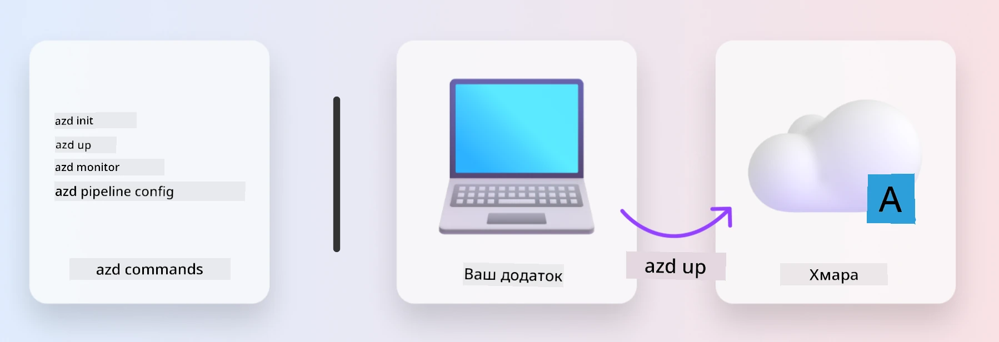
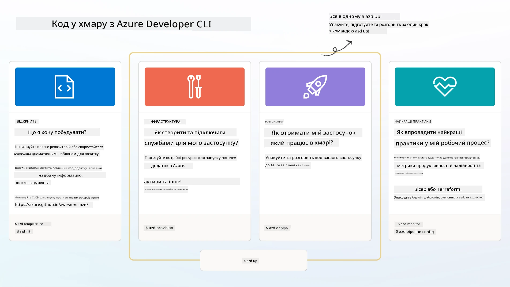

# 1. Вибір шаблона

!!! tip "НА КІНЕЦЬ ЦЬОГО МОДУЛЮ ВИ ЗМОЖЕТЕ"

    - [ ] Описати, що таке AZD шаблони
    - [ ] Знаходити та використовувати AZD шаблони для ШІ
    - [ ] Почати роботу з шаблоном AI Agents
    - [ ] **Лабораторна 1:** Швидкий старт AZD з GitHub Codespaces

---

## 1. Аналогія з будівельником

Створення сучасного корпоративного AI-додатку _з нуля_ може бути складним. Це трохи схоже на будівництво твого нового будинку самостійно, цеглина за цеглиною. Так, це можливо! Але це не найефективніший спосіб досягти бажаного кінцевого результату!

Замість цього ми часто починаємо з існуючого _проектного креслення_ і працюємо з архітектором, щоб налаштувати його відповідно до наших особистих вимог. І саме такий підхід слід застосовувати при створенні інтелектуальних додатків. Спочатку знайдіть гарну архітектуру проекту, яка підходить для вашої проблемної області. Потім працюйте з архітектором рішення, щоб налаштувати і розробити рішення для вашого конкретного сценарію.

А де ж знайти ці проєктні креслення? І як знайти архітектора, який згоден навчити нас, як налаштовувати і розгортати ці креслення самостійно? У цьому воркшопі ми відповімо на ці питання, познайомивши вас із трьома технологіями:

1. [Azure Developer CLI](https://aka.ms/azd) — інструмент з відкритим кодом, який прискорює шлях розробника від локальної розробки (build) до розгортання в хмарі (ship).
1. [Microsoft Foundry Templates](https://ai.azure.com/templates) — стандартизовані репозиторії з відкритим кодом, що містять приклади коду, інфраструктури та конфігураційних файлів для розгортання архітектури AI-рішення.
1. [GitHub Copilot Agent Mode](https://code.visualstudio.com/docs/copilot/chat/chat-agent-mode) — агент для кодування, оснований на знаннях Azure, який допоможе вам орієнтуватися у кодовій базі та вносити зміни, використовуючи природну мову.

Маючи ці інструменти під рукою, ми тепер можемо _знайти_ правильний шаблон, _розгорнути_ його для перевірки працездатності та _налаштувати_ під наші конкретні сценарії. Давайте розберемося, як це працює.

---

## 2. Azure Developer CLI

[Azure Developer CLI](https://learn.microsoft.com/en-us/azure/developer/azure-developer-cli/) (або `azd`) — це інструмент командного рядка з відкритим кодом, який може прискорити ваш шлях від коду до хмари завдяки набору дружніх для розробника команд, що послідовно працюють як у вашому IDE (розробка), так і в CI/CD (devops) середовищах.

З `azd` ваш шлях розгортання може бути таким простим:

- `azd init` — Ініціалізує новий AI-проєкт з існуючого AZD шаблона.
- `azd up` — Створює інфраструктуру та розгортає ваш додаток в одному кроці.
- `azd monitor` — Отримуйте моніторинг і діагностику в реальному часі для вашого розгорнутого додатку.
- `azd pipeline config` — Налаштовує CI/CD канали для автоматизації розгортання в Azure.

**🎯 | ВПРАВА**: <br/> Вивчіть інструмент командного рядка `azd` у вашому середовищі GitHub Codespaces. Почніть з введення цієї команди, щоб побачити, що може зробити цей інструмент:

```bash title="" linenums="0"
azd help
```



---

## 3. Шаблон AZD

Для того, щоб `azd` міг це виконати, йому потрібно знати, яку інфраструктуру створювати, які конфігураційні параметри застосовувати і який додаток розгортати. Тут і приходять на допомогу [AZD шаблони](https://learn.microsoft.com/en-us/azure/developer/azure-developer-cli/azd-templates?tabs=csharp).

AZD шаблони — це репозиторії з відкритим кодом, які об’єднують приклади коду з інфраструктурними та конфігураційними файлами, необхідними для розгортання архітектури рішення.
Використовуючи підхід _Infrastructure-as-Code_ (IaC), вони дозволяють визначення ресурсів шаблону та налаштувань конфігурації контролювати версії (так само, як і вихідний код додатку) — створюючи повторювані та послідовні робочі процеси користувачів цього проєкту.

Створюючи або повторно використовуючи AZD шаблон для _вашого_ сценарію, подумайте над цими питаннями:

1. Що ви будуєте? → Чи є шаблон з початковим кодом для цього сценарію?
1. Якою є архітектура вашого рішення? → Чи є шаблон з необхідними ресурсами?
1. Як розгортається ваше рішення? → Думайте про `azd deploy` з підключенням хук функцій передає/після обробки!
1. Як його можна оптимізувати далі? → Думайте про вбудований моніторинг та автоматичні конвеєри!

**🎯 | ВПРАВА**: <br/>
Відвідайте [Awesome AZD](https://azure.github.io/awesome-azd/) галерею та використайте фільтри для дослідження понад 250 доступних шаблонів. Подивіться, чи зможете ви знайти той, що відповідає _вашим_ вимогам сценарію.



---

## 4. AI Шаблони додатків

Для додатків з AI Microsoft надає спеціалізовані шаблони з використанням **Microsoft Foundry** та **Foundry Agents**. Ці шаблони прискорюють ваш шлях до створення інтелектуальних, готових до виробництва додатків.

### Microsoft Foundry та Foundry Agents Templates

Виберіть шаблон нижче для розгортання. Кожен шаблон доступний на [Awesome AZD](https://azure.github.io/awesome-azd/) і може бути ініціалізований однією командою.

| Шаблон | Опис | Команда розгортання |
|----------|-------------|----------------|
| **[AI Chat with RAG](https://azure.github.io/awesome-azd/?tags=ai&tags=rag)** | Чат-додаток з Retrieval Augmented Generation, використовуючи Microsoft Foundry | `azd init -t azure-samples/azure-search-openai-demo` |
| **[Foundry Agent Service Starter](https://azure.github.io/awesome-azd/?tags=ai&tags=agents)** | Створення AI агентів з Foundry Agents для автономного виконання завдань | `azd init -t azure-samples/foundry-agent-service-starter` |
| **[Multi-Agent Orchestration](https://azure.github.io/awesome-azd/?tags=ai&tags=agents)** | Координація кількох Foundry Agents для складних робочих процесів | `azd init -t azure-samples/multi-agent-orchestration` |
| **[AI Document Intelligence](https://azure.github.io/awesome-azd/?tags=ai&tags=document)** | Витягування та аналіз документів за допомогою моделей Microsoft Foundry | `azd init -t azure-samples/ai-document-processing` |
| **[Conversational AI Bot](https://azure.github.io/awesome-azd/?tags=ai&tags=bot)** | Створення інтелектуальних чатботів з інтеграцією Microsoft Foundry | `azd init -t azure-samples/ai-chat-protocol` |
| **[AI Image Generation](https://azure.github.io/awesome-azd/?tags=ai&tags=dalle)** | Генерація зображень за допомогою DALL-E через Microsoft Foundry | `azd init -t azure-samples/ai-image-generation` |
| **[Semantic Kernel Agent](https://azure.github.io/awesome-azd/?tags=ai&tags=semantic-kernel)** | AI-агенти з використанням Semantic Kernel та Foundry Agents | `azd init -t azure-samples/semantic-kernel-agent` |
| **[AutoGen Multi-Agent](https://azure.github.io/awesome-azd/?tags=ai&tags=autogen)** | Системи з кількома агентами з використанням фреймворку AutoGen | `azd init -t azure-samples/autogen-multi-agent` |

### Швидкий старт

1. **Огляньте шаблони**: Відвідайте [https://azure.github.io/awesome-azd/](https://azure.github.io/awesome-azd/) і відфільтруйте за `AI`, `Agents` або `Microsoft Foundry`
2. **Виберіть ваш шаблон**: Оберіть той, що відповідає вашому випадку використання
3. **Ініціалізуйте**: Запустіть команду `azd init` для вибраного шаблону
4. **Розгорніть**: Запустіть `azd up` для створення інфраструктури і розгортання

**🎯 | ВПРАВА**: <br/>
Виберіть один із наведених вище шаблонів відповідно до вашого сценарію:

- **Будуєте чатбота?** → Починайте з **AI Chat with RAG** або **Conversational AI Bot**
- **Потрібні автономні агенти?** → Спробуйте **Foundry Agent Service Starter** або **Multi-Agent Orchestration**
- **Обробляєте документи?** → Використовуйте **AI Document Intelligence**
- **Потрібна допомога з кодуванням за допомогою AI?** → Дослідіть **Semantic Kernel Agent** або **AutoGen Multi-Agent**

```bash title="Example: Deploy the AI Chat with RAG template" linenums="0"
azd init -t azure-samples/azure-search-openai-demo
azd up
```

!!! info "Дослідіть більше шаблонів"
    Галерея [Awesome AZD](https://azure.github.io/awesome-azd/) містить понад 250 шаблонів. Використовуйте фільтри, щоб знаходити шаблони, які відповідають вашим конкретним вимогам щодо мови, фреймворку та сервісів Azure.

---

<!-- CO-OP TRANSLATOR DISCLAIMER START -->
**Відмова від відповідальності**:  
Цей документ було перекладено за допомогою сервісу автоматичного перекладу [Co-op Translator](https://github.com/Azure/co-op-translator). Хоча ми прагнемо до точності, просимо враховувати, що автоматичні переклади можуть містити помилки чи неточності. Оригінальний документ рідною мовою слід вважати авторитетним джерелом. Для критично важливої інформації рекомендується звертатися до професійного людського перекладу. Ми не несемо відповідальності за будь-які непорозуміння або неправильні тлумачення, що виникли внаслідок використання цього перекладу.
<!-- CO-OP TRANSLATOR DISCLAIMER END -->