# 2. Перевірка шаблону

!!! tip "ПІСЛЯ ЗАВЕРШЕННЯ ЦЬОГО МОДУЛЯ ВИ ЗМОЖЕТЕ"

    - [ ] Аналізувати архітектуру AI-рішення
    - [ ] Розуміти робочий процес розгортання AZD
    - [ ] Використовувати GitHub Copilot для отримання допомоги щодо використання AZD
    - [ ] **Лабораторія 2:** Розгорнути та перевірити шаблон AI Agents

---

## 1. Вступ

[Azure Developer CLI](https://learn.microsoft.com/en-us/azure/developer/azure-developer-cli/) або `azd` — це інструмент командного рядка з відкритим кодом, який спрощує робочий процес розробника під час створення та розгортання додатків в Azure.

[Шаблони AZD](https://learn.microsoft.com/azure/developer/azure-developer-cli/azd-templates) — це стандартизовані репозиторії, які включають прикладний код додатків, активи _інфраструктури як код_ та конфігураційні файли `azd` для цілісної архітектури рішення. Створення інфраструктури стає таким простим, як команда `azd provision`, а використання `azd up` дозволяє створити інфраструктуру **та** розгорнути ваш додаток за один раз!

Таким чином, почати процес розробки вашого додатка може бути так само просто, як знайти відповідний _AZD Starter шаблон_, який найбільше відповідає вашим потребам у додатку та інфраструктурі, а потім налаштувати репозиторій відповідно до ваших вимог.

Перед тим як почати, переконайтеся, що у вас встановлений Azure Developer CLI.

1. Відкрийте термінал VS Code і введіть цю команду:

      ```bash title="" linenums="0"
      azd version
      ```

1. Ви повинні побачити щось подібне!

      ```bash title="" linenums="0"
      azd version 1.19.0 (commit b3d68cea969b2bfbaa7b7fa289424428edb93e97)
      ```

**Тепер ви готові вибрати та розгорнути шаблон за допомогою azd**

---

## 2. Вибір шаблону

Платформа Azure AI Foundry пропонує [набір рекомендованих шаблонів AZD](https://learn.microsoft.com/en-us/azure/ai-foundry/how-to/develop/ai-template-get-started), які охоплюють популярні сценарії рішень, такі як _автоматизація робочих процесів з багатьма агентами_ та _обробка мультимодального контенту_. Ви також можете знайти ці шаблони, відвідавши портал Azure AI Foundry.

1. Відвідайте [https://ai.azure.com/templates](https://ai.azure.com/templates)
1. Увійдіть до порталу Azure AI Foundry, коли буде запропоновано — ви побачите щось подібне.

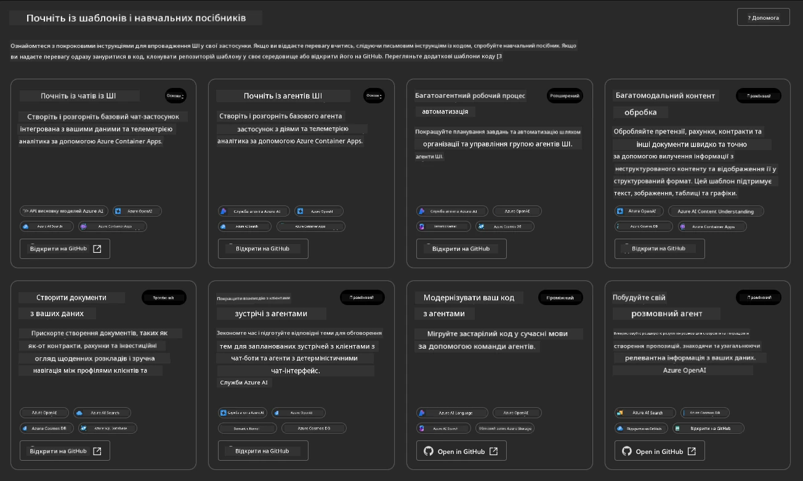

**Базові** опції — це ваші стартові шаблони:

1. [ ] [Get Started with AI Chat](https://github.com/Azure-Samples/get-started-with-ai-chat), який розгортає базовий чат-додаток _з вашими даними_ в Azure Container Apps. Використовуйте це для дослідження базового сценарію AI чат-бота.
1. [X] [Get Started with AI Agents](https://github.com/Azure-Samples/get-started-with-ai-agents), який також розгортає стандартного AI агента (з Azure AI Agent Service). Використовуйте це, щоб ознайомитися з агентними AI рішеннями, що включають інструменти та моделі.

Відвідайте друге посилання в новій вкладці браузера (або натисніть `Open in GitHub` для відповідної картки). Ви повинні побачити репозиторій для цього шаблону AZD. Приділіть хвилину для ознайомлення з README. Архітектура додатка виглядає так:


---

## 3. Активація шаблону

Спробуємо розгорнути цей шаблон і переконатися, що він дійсний. Ми будемо дотримуватися рекомендацій у розділі [Getting Started](https://github.com/Azure-Samples/get-started-with-ai-agents?tab=readme-ov-file#getting-started).

1. Натисніть [це посилання](https://github.com/codespaces/new/Azure-Samples/get-started-with-ai-agents) — підтвердьте дію за замовчуванням `Create codespace`
1. Це відкриє нову вкладку браузера — зачекайте, поки сесія GitHub Codespaces завершить завантаження
1. Відкрийте термінал VS Code у Codespaces — введіть наступну команду:

   ```bash title="" linenums="0"
   azd up
   ```

Виконайте кроки робочого процесу, які це запустить:

1. Вам буде запропоновано увійти до Azure — дотримуйтесь інструкцій для автентифікації
1. Введіть унікальне ім'я середовища для себе — наприклад, я використав `nitya-mshack-azd`
1. Це створить папку `.azure/` — ви побачите підпапку з ім'ям середовища
1. Вам буде запропоновано вибрати ім'я підписки — виберіть за замовчуванням
1. Вам буде запропоновано вибрати місце розташування — використовуйте `East US 2`

Тепер чекайте завершення створення інфраструктури. **Це займає 10-15 хвилин**

1. Коли все буде готово, ваш консоль покаже повідомлення про УСПІХ, як це:
      ```bash title="" linenums="0"
      SUCCESS: Your up workflow to provision and deploy to Azure completed in 10 minutes 17 seconds.
      ```
1. Ваш портал Azure тепер матиме створену групу ресурсів із цим ім'ям середовища:

      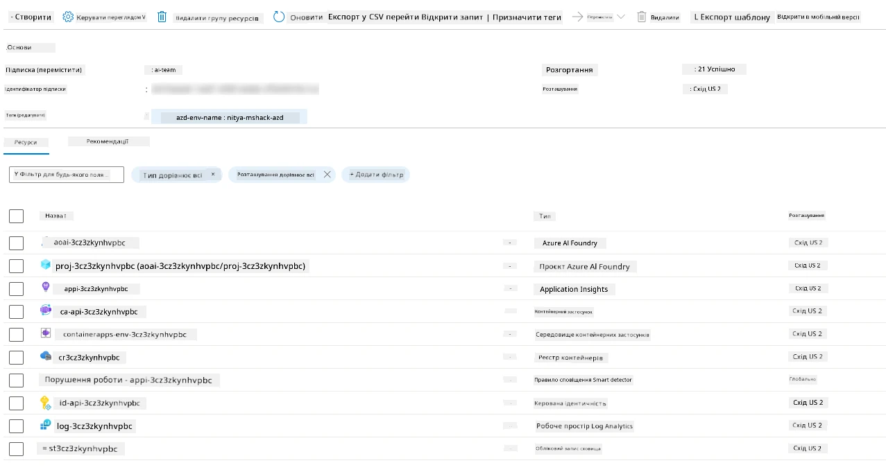

1. **Тепер ви готові перевірити розгорнуту інфраструктуру та додаток**.

---

## 4. Перевірка шаблону

1. Відвідайте сторінку [Resource Groups](https://portal.azure.com/#browse/resourcegroups) порталу Azure — увійдіть, коли буде запропоновано
1. Натисніть на RG для вашого імені середовища — ви побачите сторінку вище

      - натисніть на ресурс Azure Container Apps
      - натисніть на URL додатка в розділі _Essentials_ (у верхньому правому куті)

1. Ви повинні побачити хостований інтерфейс користувача додатка, як цей:

   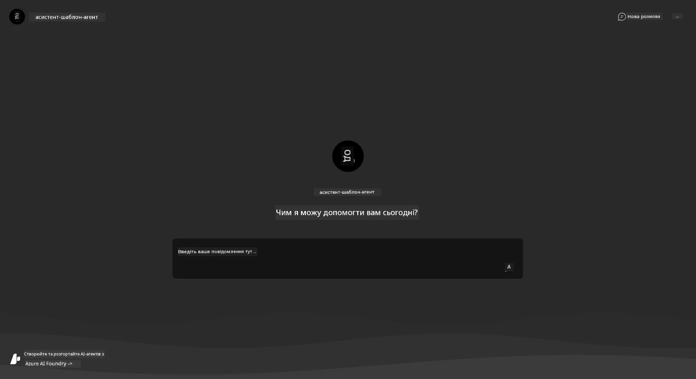

1. Спробуйте задати кілька [прикладних запитань](https://github.com/Azure-Samples/get-started-with-ai-agents/blob/main/docs/sample_questions.md)

      1. Запитайте: ```What is the capital of France?``` 
      1. Запитайте: ```What's the best tent under $200 for two people, and what features does it include?```

1. Ви повинні отримати відповіді, схожі на показані нижче. _Але як це працює?_ 

      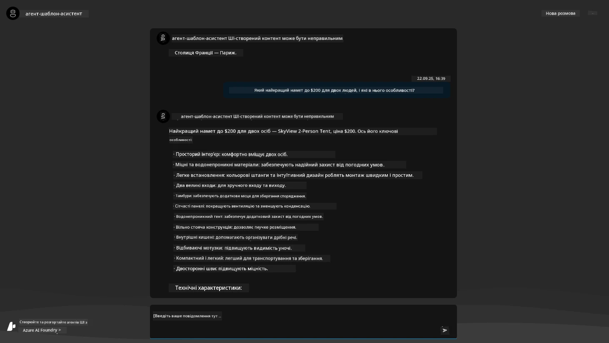

---

## 5. Перевірка агента

Azure Container App розгортає кінцеву точку, яка підключається до AI агента, створеного в проекті Azure AI Foundry для цього шаблону. Давайте подивимося, що це означає.

1. Поверніться на сторінку _Overview_ вашої групи ресурсів у порталі Azure

1. Натисніть на ресурс `Azure AI Foundry` у цьому списку

1. Ви повинні побачити це. Натисніть кнопку `Go to Azure AI Foundry Portal`. 
   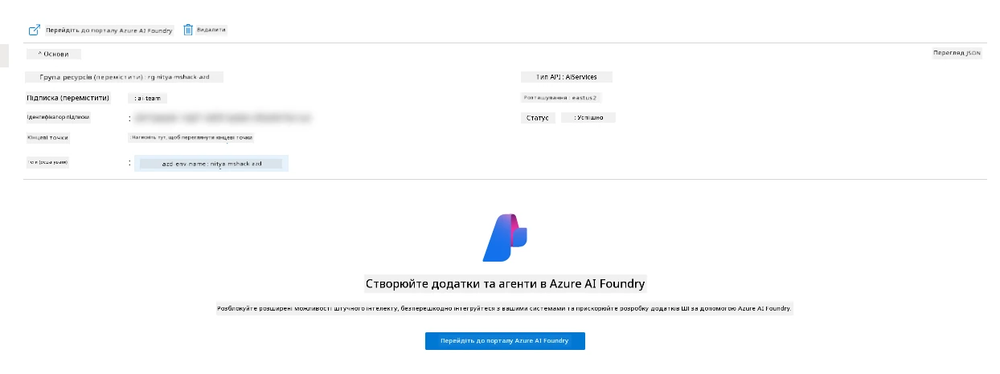

1. Ви повинні побачити сторінку проекту Foundry для вашого AI додатка
   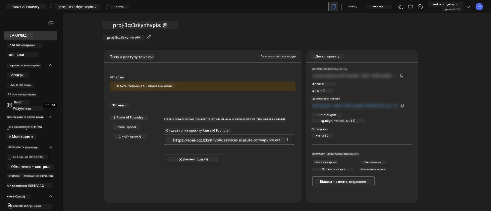

1. Натисніть на `Agents` — ви побачите стандартного агента, створеного у вашому проекті
   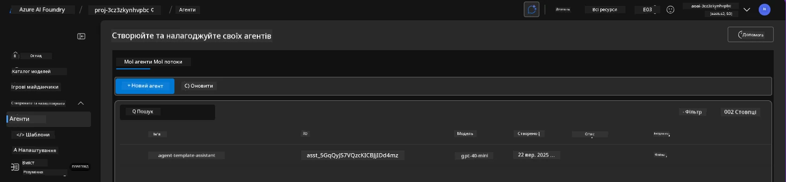

1. Виберіть його — і ви побачите деталі агента. Зверніть увагу на наступне:

      - Агент за замовчуванням використовує File Search (завжди)
      - Знання агента вказує, що завантажено 32 файли (для пошуку файлів)
      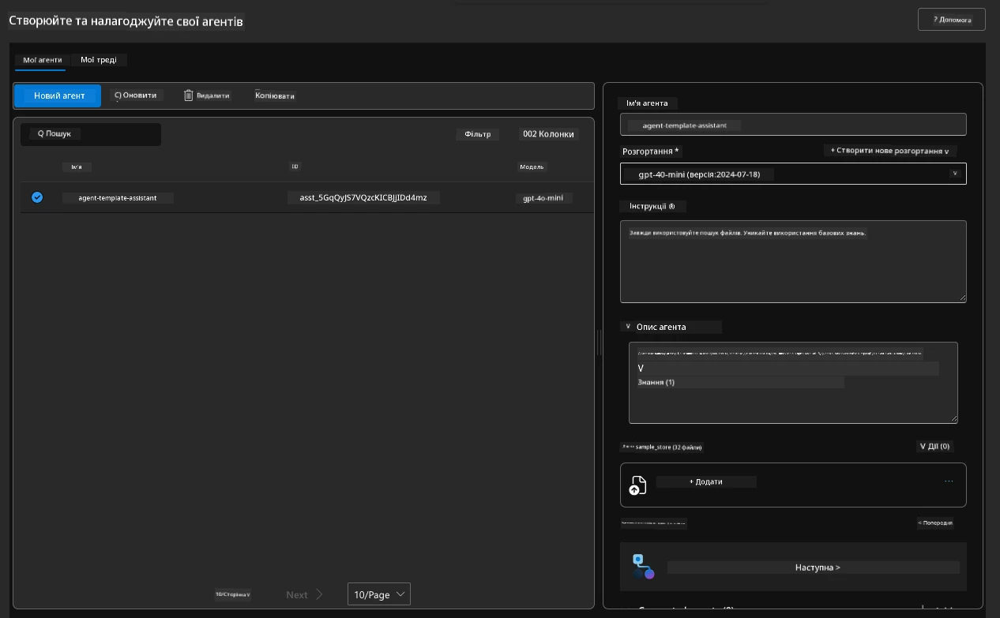

1. Знайдіть опцію `Data+indexes` у лівому меню та натисніть для деталей. 

      - Ви повинні побачити 32 завантажені файли даних для знань.
      - Вони будуть відповідати 12 файлам клієнтів і 20 файлам продуктів у папці `src/files` 
      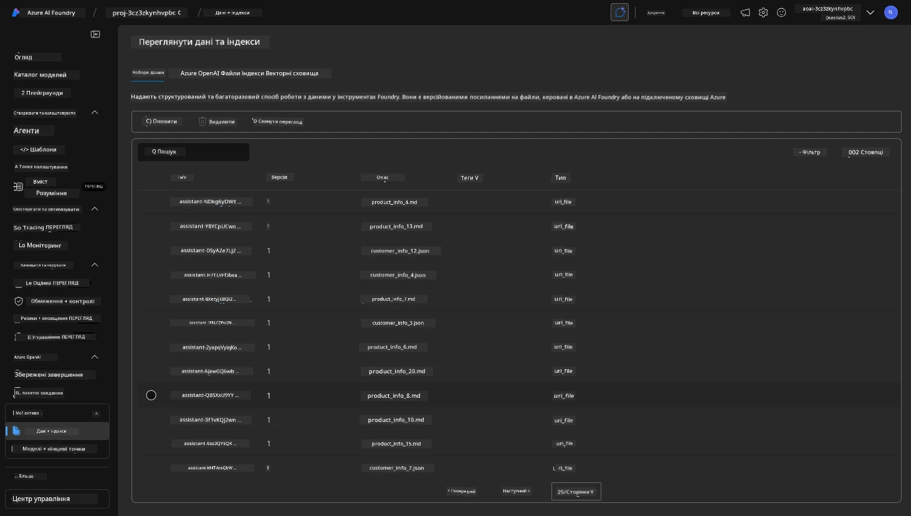

**Ви перевірили роботу агента!** 

1. Відповіді агента базуються на знаннях із цих файлів. 
1. Тепер ви можете задавати запитання, пов’язані з цими даними, і отримувати обґрунтовані відповіді.
1. Приклад: `customer_info_10.json` описує 3 покупки, зроблені "Amanda Perez"

Поверніться до вкладки браузера з кінцевою точкою Container App і запитайте: `What products does Amanda Perez own?`. Ви повинні побачити щось подібне:

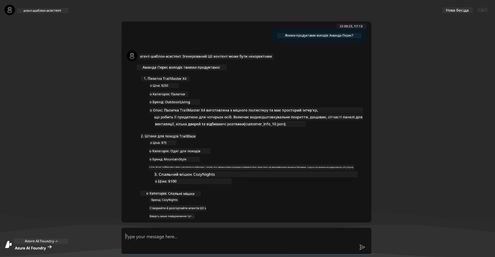

---

## 6. Ігровий майданчик агента

Давайте трохи краще зрозуміємо можливості Azure AI Foundry, протестувавши агента в Agents Playground. 

1. Поверніться на сторінку `Agents` в Azure AI Foundry — виберіть стандартного агента
1. Натисніть опцію `Try in Playground` — ви повинні отримати інтерфейс Playground, як цей
1. Задайте те саме запитання: `What products does Amanda Perez own?`

    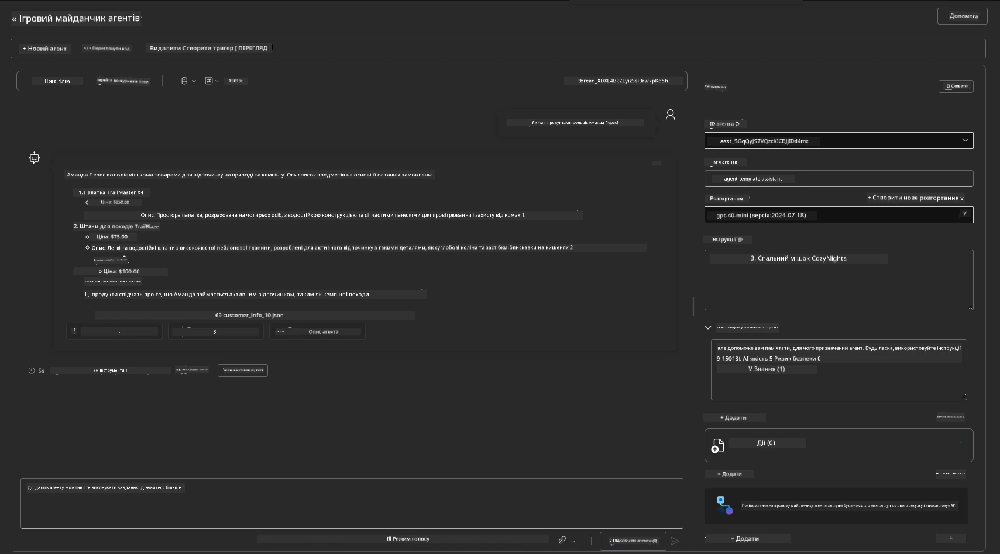

Ви отримуєте ту саму (або схожу) відповідь — але також отримуєте додаткову інформацію, яку можна використовувати для розуміння якості, вартості та продуктивності вашого агентного додатка. Наприклад:

1. Зверніть увагу, що відповідь цитує файли даних, використані для "обґрунтування" відповіді
1. Наведіть курсор на будь-яку з цих міток файлів — чи відповідають дані вашому запиту та відображеній відповіді?

Ви також бачите _рядок статистики_ під відповіддю. 

1. Наведіть курсор на будь-який показник — наприклад, Safety. Ви побачите щось подібне
1. Чи відповідає оцінка вашій інтуїції щодо рівня безпеки відповіді?

      

---x

## 7. Вбудована спостережуваність

Спостережуваність — це інструментування вашого додатка для генерації даних, які можна використовувати для розуміння, налагодження та оптимізації його роботи. Щоб отримати уявлення про це:

1. Натисніть кнопку `View Run Info` — ви повинні побачити цей вигляд. Це приклад [трасування агента](https://learn.microsoft.com/en-us/azure/ai-foundry/how-to/develop/trace-agents-sdk#view-trace-results-in-the-azure-ai-foundry-agents-playground) у дії. _Ви також можете отримати цей вигляд, натиснувши Thread Logs у верхньому меню_.

   - Отримайте уявлення про кроки виконання та інструменти, які використовує агент
   - Зрозумійте загальну кількість токенів (порівняно з використанням токенів для відповіді)
   - Зрозумійте затримку та де витрачається час на виконання

      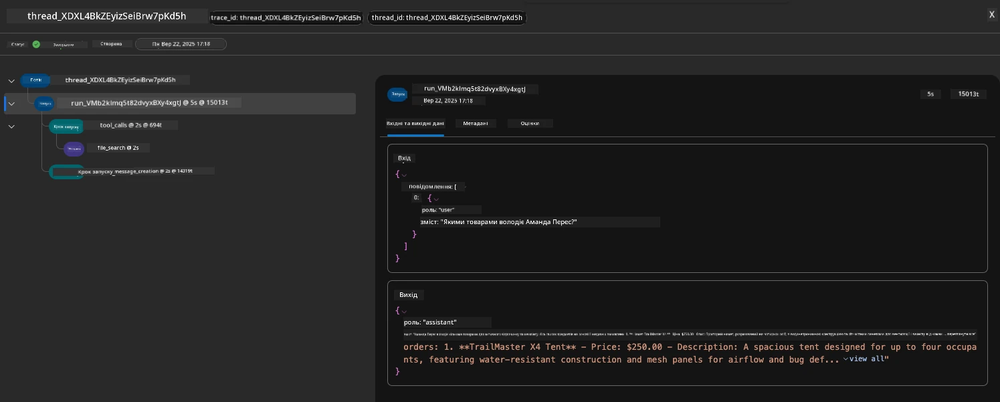

1. Натисніть вкладку `Metadata`, щоб побачити додаткові атрибути для виконання, які можуть надати корисний контекст для налагодження проблем у майбутньому.   

      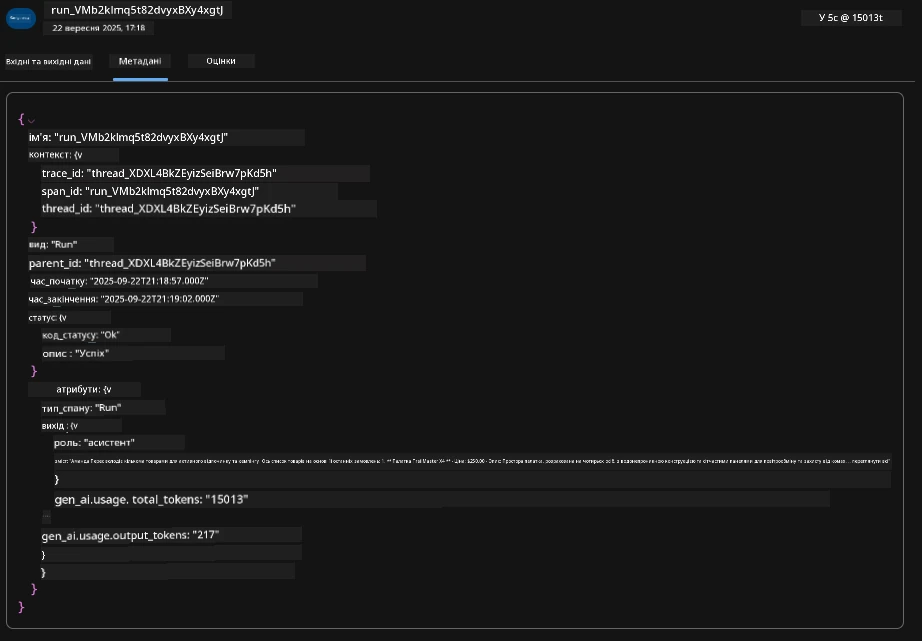

1. Натисніть вкладку `Evaluations`, щоб побачити автоматичні оцінки, зроблені щодо відповіді агента. Вони включають оцінки безпеки (наприклад, Self-harm) та специфічні для агента оцінки (наприклад, Intent resolution, Task adherence).

      

1. І нарешті, натисніть вкладку `Monitoring` у меню на бічній панелі.

      - Виберіть вкладку `Resource usage` на відображеній сторінці — і перегляньте метрики.
      - Відстежуйте використання додатка з точки зору витрат (токени) та навантаження (запити).
      - Відстежуйте затримку додатка до першого байта (обробка введення) та останнього байта (виведення).

      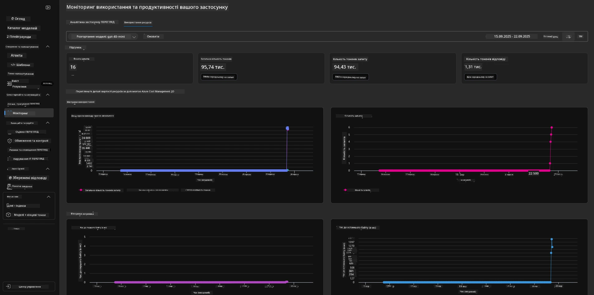

---

## 8. Змінні середовища

До цього моменту ми пройшли через розгортання в браузері — і перевірили, що наша інфраструктура створена, а додаток працює. Але щоб працювати з додатком _з кодом_, нам потрібно налаштувати наше локальне середовище розробки з відповідними змінними, необхідними для роботи з цими ресурсами. Використання `azd` робить це простим.

1. Azure Developer CLI [використовує змінні середовища](https://learn.microsoft.com/en-us/azure/developer/azure-developer-cli/manage-environment-variables?tabs=bash) для зберігання та управління налаштуваннями конфігурації для розгортання додатків.

1. Змінні середовища зберігаються в `.azure/<env-name>/.env` — це прив’язує їх до середовища `env-name`, використаного під час розгортання, і допомагає ізолювати середовища між різними цілями розгортання в одному репозиторії.

1. Змінні середовища автоматично завантажуються командою `azd` щоразу, коли вона виконує певну команду (наприклад, `azd up`). Зверніть увагу, що `azd` не автоматично читає _змінні середовища рівня ОС_ (наприклад, встановлені в оболонці) — натомість використовуйте `azd set env` і `azd get env` для передачі інформації в скриптах.

Спробуємо кілька команд:

1. Отримайте всі змінні середовища, встановлені для `azd` у цьому середовищі:

      ```bash title="" linenums="0"
      azd env get-values
      ```
      
      Ви побачите щось подібне:

      ```bash title="" linenums="0"
      AZURE_AI_AGENT_DEPLOYMENT_NAME="gpt-4o-mini"
      AZURE_AI_AGENT_NAME="agent-template-assistant"
      AZURE_AI_EMBED_DEPLOYMENT_NAME="text-embedding-3-small"
      AZURE_AI_EMBED_DIMENSIONS=100
      ...
      ```

1. Отримайте конкретне значення — наприклад, я хочу знати, чи встановили ми значення `AZURE_AI_AGENT_MODEL_NAME`

      ```bash title="" linenums="0"
      azd env get-value AZURE_AI_AGENT_MODEL_NAME 
      ```
      
      Ви побачите щось подібне — воно не було встановлено за замовчуванням!

      ```bash title="" linenums="0"
      ERROR: key 'AZURE_AI_AGENT_MODEL_NAME' not found in the environment values
      ```

1. Встановіть нову змінну середовища для `azd`. Тут ми оновлюємо ім’я моделі агента. _Примітка: будь-які зміни будуть негайно відображені у файлі `.azure/<env-name>/.env`.

      ```bash title="" linenums="0"
      azd env set AZURE_AI_AGENT_MODEL_NAME gpt-4.1
      azd env set AZURE_AI_AGENT_MODEL_VERSION 2025-04-14
      azd env set AZURE_AI_AGENT_DEPLOYMENT_CAPACITY 150
      ```

      Тепер ми повинні знайти, що значення встановлено:

      ```bash title="" linenums="0"
      azd env get-value AZURE_AI_AGENT_MODEL_NAME 
      ```

1. Зверніть увагу, що деякі ресурси є постійними (наприклад, розгортання моделей) і потребуватимуть більше, ніж просто `azd up`, щоб примусити повторне розгортання. Спробуємо знищити початкове розгортання та повторно розгорнути з зміненими змінними середовища.

1. **Оновлення** Якщо ви раніше розгортали інфраструктуру за допомогою шаблону azd — ви можете _оновити_ стан ваших локальних змінних середовища на основі поточного стану вашого розгортання Azure, використовуючи цю команду:
      ```bash title="" linenums="0"
      azd env refresh
      ```

      Це потужний спосіб _синхронізувати_ змінні середовища між двома або більше локальними середовищами розробки (наприклад, командою з кількома розробниками) — дозволяючи розгорнутій інфраструктурі бути основним джерелом правди для стану змінних середовища. Члени команди просто _оновлюють_ змінні, щоб знову синхронізуватися.

---

## 9. Вітаємо 🏆

Ви щойно завершили повний робочий процес, у якому:

- [X] Вибрали шаблон AZD, який хочете використовувати
- [X] Запустили шаблон за допомогою GitHub Codespaces
- [X] Розгорнули шаблон і перевірили його роботу

---

