# 2. Валідація шаблону

!!! tip "У КІНЦІ ЦЬОГО МОДУЛЮ ВИ ЗМОЖЕТЕ"

    - [ ] Аналізувати архітектуру AI-рішення
    - [ ] Розуміти робочий процес розгортання AZD
    - [ ] Використовувати GitHub Copilot для отримання допомоги з використанням AZD
    - [ ] **Лабораторна робота 2:** Розгорнути й перевірити шаблон AI агентів

---


## 1. Вступ

[Azure Developer CLI](https://learn.microsoft.com/en-us/azure/developer/azure-developer-cli/) або `azd` — це інструмент командного рядка з відкритим кодом, який спрощує робочий процес розробника при створенні та розгортанні додатків у Azure.

[AZD Шаблони](https://learn.microsoft.com/azure/developer/azure-developer-cli/azd-templates) — це стандартизовані репозиторії, що містять приклади коду додатків, об’єкти _інфраструктура як код_, і файли конфігурації `azd` для узгодженої архітектури рішення. Забезпечення інфраструктури стає настільки простим, як команда `azd provision` — а використання `azd up` дозволяє одночасно створити інфраструктуру **і** розгорнути додаток!

Таким чином, початок розробки додатку може бути таким же простим, як пошук правильного _AZD Starter шаблону_, що найбільше відповідає вашим потребам у додатку та інфраструктурі — а потім налаштування репозиторію відповідно до ваших вимог.

Перш ніж почати, переконайтеся, що у вас встановлений Azure Developer CLI.

1. Відкрийте термінал VS Code та введіть цю команду:

      ```bash title="" linenums="0"
      azd version
      ```

1. Ви повинні побачити щось подібне!

      ```bash title="" linenums="0"
      azd version 1.19.0 (commit b3d68cea969b2bfbaa7b7fa289424428edb93e97)
      ```

**Тепер ви готові обрати та розгорнути шаблон за допомогою azd**

---

## 2. Вибір шаблону

Платформа Microsoft Foundry містить [набір рекомендованих AZD шаблонів](https://learn.microsoft.com/en-us/azure/ai-foundry/how-to/develop/ai-template-get-started), які охоплюють популярні сценарії рішень, такі як _автоматизація багатофункціональних робочих процесів_ і _багатомодальна обробка контенту_. Ви також можете знайти ці шаблони, відвідавши портал Microsoft Foundry.

1. Відвідайте [https://ai.azure.com/templates](https://ai.azure.com/templates)
1. Увійдіть у портал Microsoft Foundry, коли буде запит – ви побачите щось подібне.

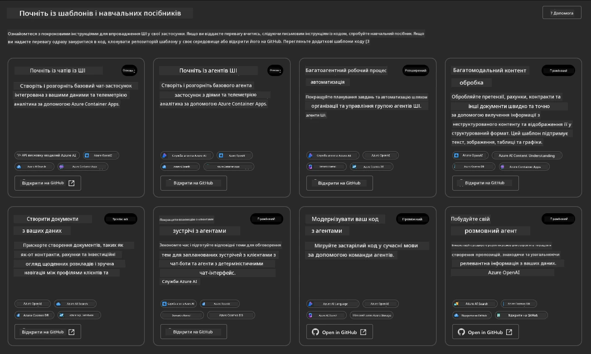


Опції **Basic** — це ваші стартові шаблони:

1. [ ] [Почати роботу з AI Chat](https://github.com/Azure-Samples/get-started-with-ai-chat), що розгортає базовий чат-додаток _з вашими даними_ в Azure Container Apps. Використовуйте це, щоб дослідити базовий сценарій AI чатбота.
1. [X] [Почати роботу з AI Agents](https://github.com/Azure-Samples/get-started-with-ai-agents), який також розгортає стандартного AI Агента (з Foundry Agents). Використовуйте цю опцію, щоб ознайомитися з агентськими AI рішеннями, що включають інструменти і моделі.

Відкрийте друге посилання у новій вкладці браузера (або натисніть `Open in GitHub` на відповідній картці). Ви повинні побачити репозиторій для цього AZD шаблону. Витратьте хвилину, щоб дослідити README. Архітектура додатка виглядає так:

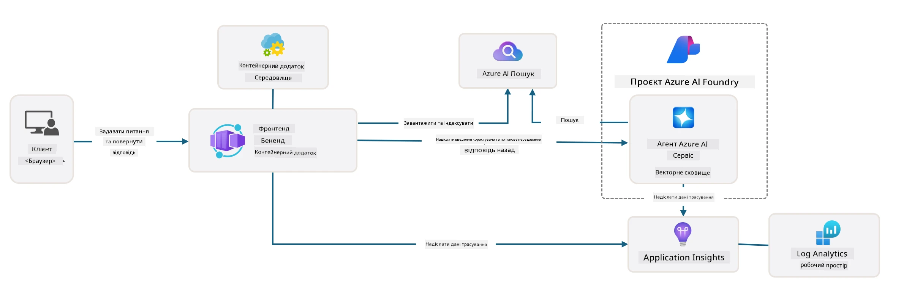

---

## 3. Активація шаблону

Спробуємо розгорнути цей шаблон і переконатися, що він справний. Слідкуємо за інструкціями в розділі [Getting Started](https://github.com/Azure-Samples/get-started-with-ai-agents?tab=readme-ov-file#getting-started).

1. Натисніть [це посилання](https://github.com/codespaces/new/Azure-Samples/get-started-with-ai-agents) — підтвердіть стандартну дію, щоб `Create codespace`
1. Відкриється нова вкладка браузера — зачекайте, поки сесія GitHub Codespaces завантажиться
1. Відкрийте термінал VS Code у Codespaces — введіть таку команду:

   ```bash title="" linenums="0"
   azd up
   ```

Виконайте кроки робочого процесу, які це запустить:

1. Вас попросять увійти в Azure — виконайте інструкції для автентифікації
1. Введіть унікальне ім’я середовища для себе — наприклад, я використав `nitya-mshack-azd`
1. Це створить папку `.azure/` — ви побачите підпапку з ім’ям середовища
1. Вас попросять обрати підписку — оберіть за замовчуванням
1. Вас попросять вказати розташування — використайте `East US 2`

Тепер чекайте завершення забезпечення. **Процес займе 10-15 хвилин**

1. Коли завершиться, у консолі з'явиться повідомлення ПРО УСПІХ, схоже на це:
      ```bash title="" linenums="0"
      SUCCESS: Your up workflow to provision and deploy to Azure completed in 10 minutes 17 seconds.
      ```
1. Тепер у вашому Azure порталі буде створена ресурсна група з ім’ям середовища:

      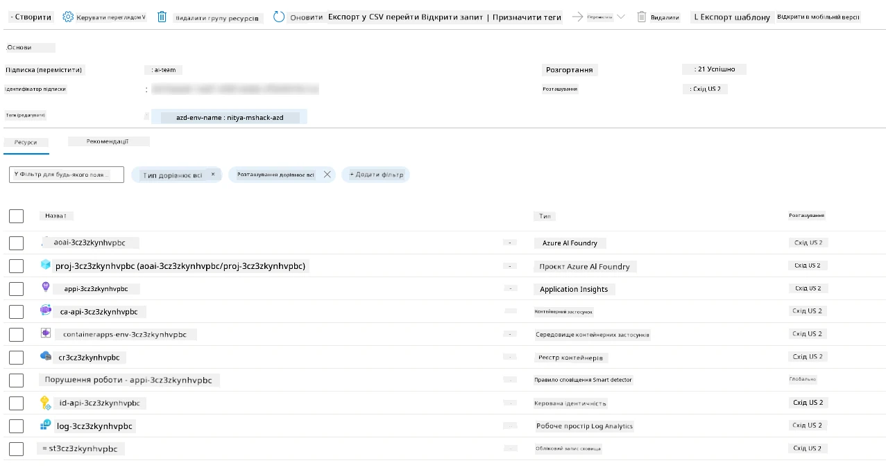

1. **Тепер ви готові перевірити розгорнуту інфраструктуру та додаток**.

---

## 4. Перевірка шаблону

1. Відвідайте сторінку [Групи ресурсів](https://portal.azure.com/#browse/resourcegroups) в Azure Portal — увійдіть, якщо буде необхідність
1. Натисніть на RG для вашого середовища — побачите згадану вище сторінку

      - натисніть на ресурс Azure Container Apps
      - натисніть на Application Url у розділі _Essentials_ (угорі справа)

1. Ви повинні побачити хостований інтерфейс користувача програми, подібний до цього:

   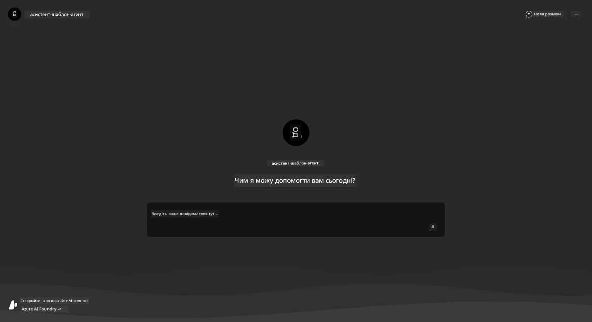

1. Спробуйте поставити декілька [прикладних запитань](https://github.com/Azure-Samples/get-started-with-ai-agents/blob/main/docs/sample_questions.md)

      1. Запитайте: ```What is the capital of France?```
      1. Запитайте: ```What's the best tent under $200 for two people, and what features does it include?```

1. Ви повинні отримати відповіді, подібні до показаних нижче. _Але як це працює?_

      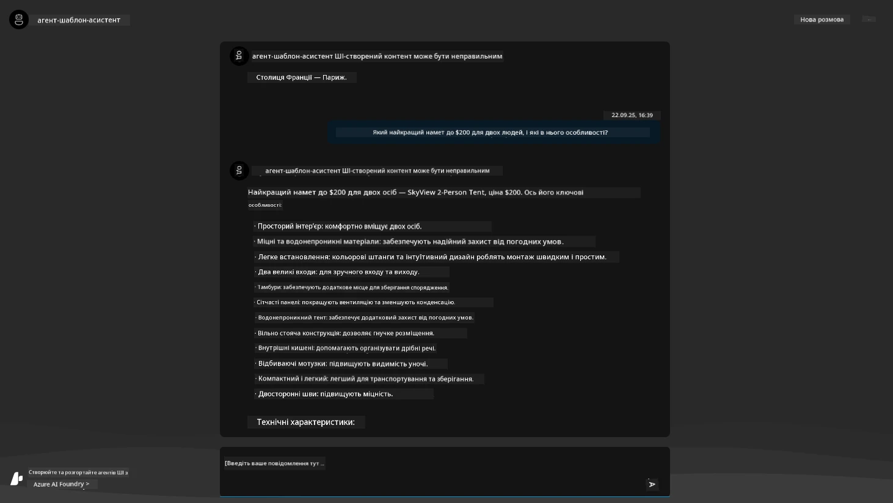

---

## 5. Валідація агента

Azure Container App розгортає кінцеву точку, що підключається до AI Агента, створеного у проекті Microsoft Foundry для цього шаблону. Давайте подивимося, що це означає.

1. Поверніться до сторінки огляду Azure Portal для вашої групи ресурсів

1. Клацніть по ресурсу `Microsoft Foundry` у списку

1. Ви побачите це. Натисніть кнопку `Go to Microsoft Foundry Portal`.
   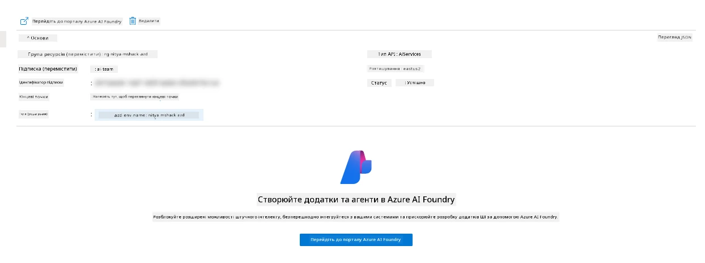

1. Ви побачите сторінку проекту Foundry для вашого AI додатку
   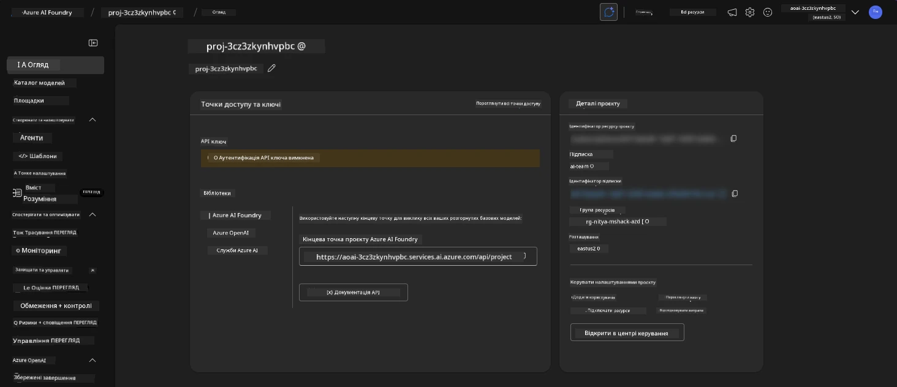

1. Натисніть на `Agents` — побачите стандартного агента, створеного у вашому проекті
   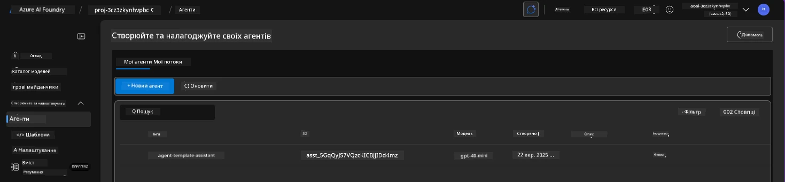

1. Оберіть його — і побачите деталі агента. Зверніть увагу на наступне:

      - Агент використовує Пошук по файлах за замовчуванням (завжди)
      - В поле `Knowledge` агента вказано, що завантажено 32 файли (для пошуку по файлах)
      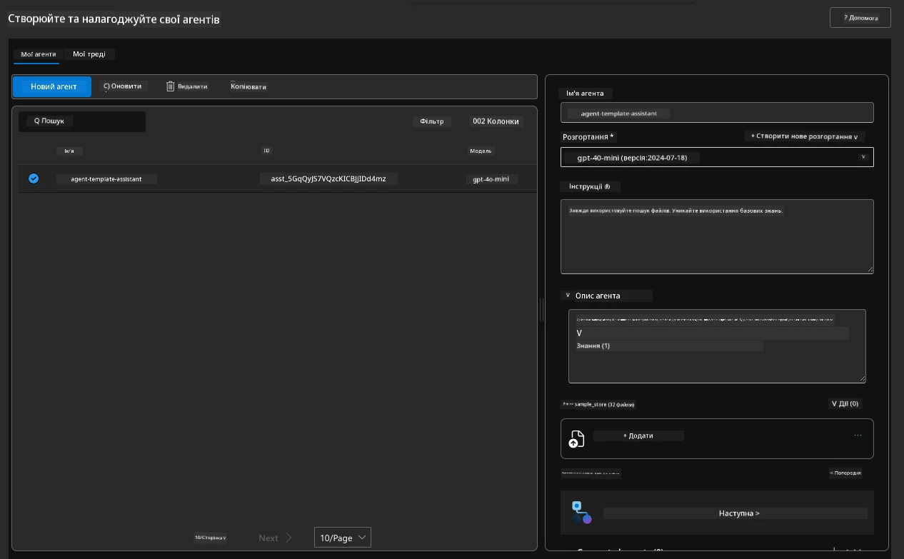

1. Знайдіть опцію `Data+indexes` у лівому меню та натисніть для перегляду деталей.

      - Ви побачите 32 файли даних, завантажені в базу знань.
      - Вони відповідають 12 файлам клієнтів та 20 файлам продуктів у папці `src/files`
      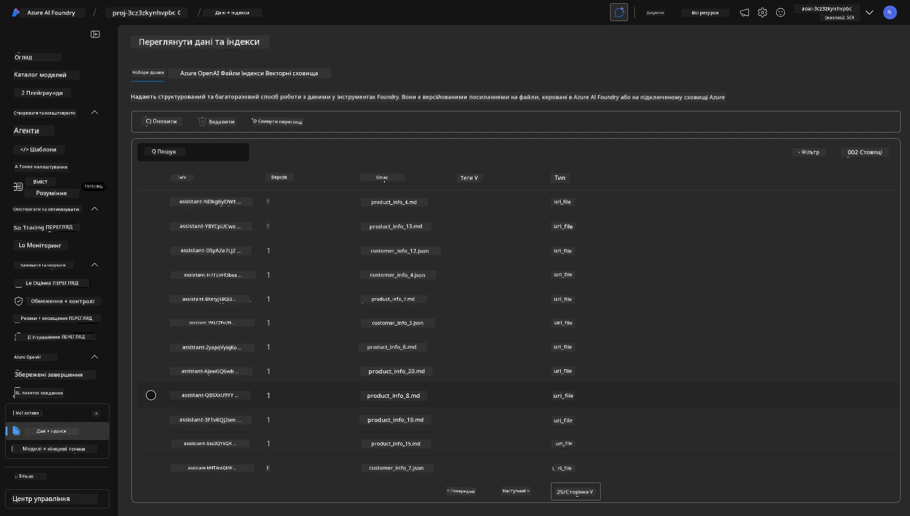

**Ви перевірили роботу агента!**

1. Відповіді агента базуються на знаннях, містяться у цих файлах.
1. Тепер ви можете ставити запитання, пов’язані з цими даними, і отримувати обґрунтовані відповіді.
1. Приклад: `customer_info_10.json` описує 3 покупки, зроблені "Amanda Perez".

Поверніться до вкладки браузера з кінцевою точкою Container App і запитайте: `What products does Amanda Perez own?`. Ви повинні побачити щось подібне:

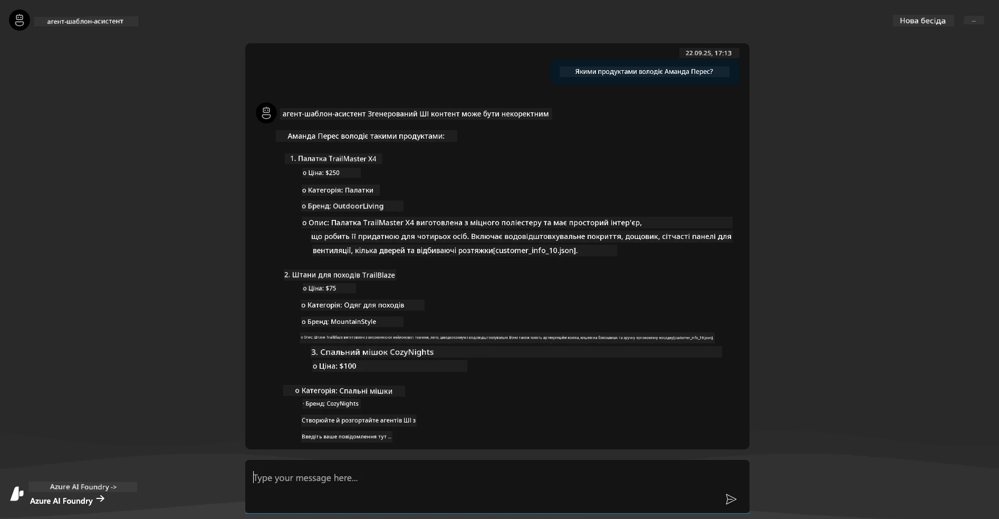

---

## 6. Ігровий майданчик агента

Давайте трохи краще зрозуміємо можливості Microsoft Foundry, погравшись з агентом у Agents Playground.

1. Поверніться на сторінку `Agents` в Microsoft Foundry — оберіть стандартного агента
1. Натисніть опцію `Try in Playground` — ви побачите інтерфейс Playground, подібний до цього
1. Задайте те ж саме запитання: `What products does Amanda Perez own?`

    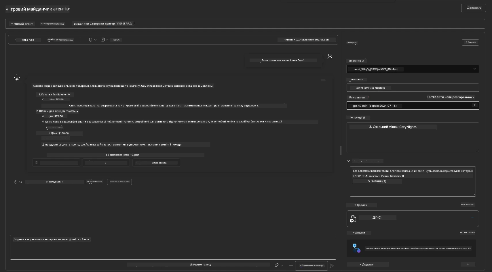

Ви отримаєте ту ж (або подібну) відповідь — а також додаткову інформацію, що допомагає зрозуміти якість, вартість і продуктивність вашого агентського додатку. Наприклад:

1. Зверніть увагу, що відповідь містить посилання на файли даних, які використовувалися для "обґрунтування" відповіді
1. Наведіть курсор на будь-яку з цих міток файлів — чи збігаються дані з вашим запитом і відображеною відповіддю?

Ви також побачите рядок _статистики_ під відповіддю.

1. Наведіть курсор на будь-який показник — наприклад, безпеку (Safety). Ви побачите щось на кшталт цього.
1. Чи збігається оцінка з вашим уявленням про рівень безпеки відповіді?

      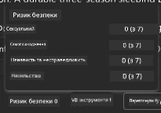

---

## 7. Вбудована спостережливість

Спостережливість означає інструментування вашого додатка для генерації даних, які можна використати для розуміння, налагодження та оптимізації його роботи. Щоб ознайомитися з цим:

1. Натисніть кнопку `View Run Info` — ви побачите цей вигляд. Це приклад [трасування агента](https://learn.microsoft.com/en-us/azure/ai-foundry/how-to/develop/trace-agents-sdk#view-trace-results-in-the-azure-ai-foundry-agents-playground) в дії. _Цей вигляд також можна отримати, натиснувши Thread Logs у верхньому меню_.

   - Оцініть кроки виконання та інструменти, задіяні агентом
   - Зрозумійте загальну кількість токенів (у порівнянні з використанням токенів для виводу) для відповіді
   - Зрозумійте затримки та де витрачається час під час виконання

      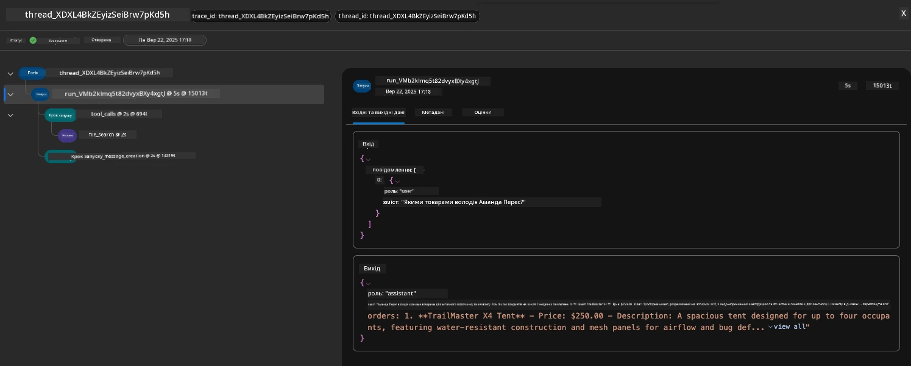

1. Натисніть вкладку `Metadata`, щоб побачити додаткові атрибути виконання, які можуть бути корисними для налагодження проблем згодом.

      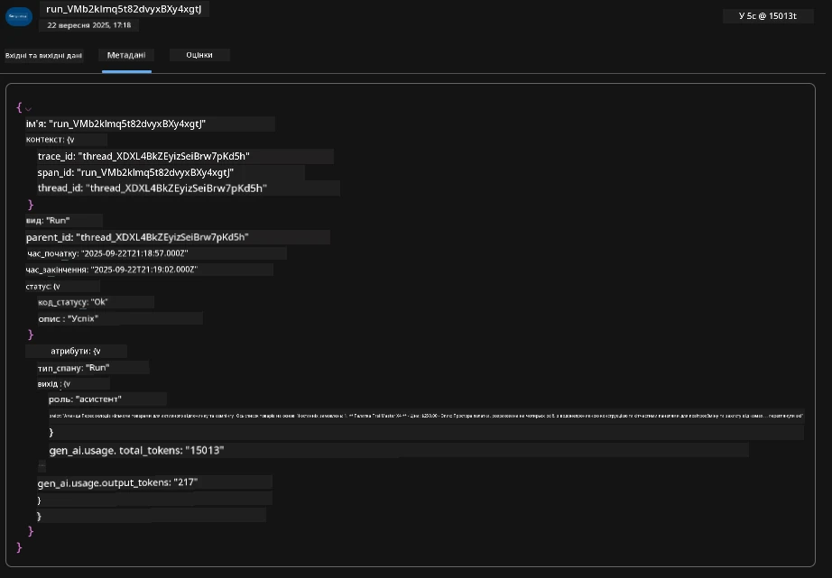


1. Натисніть вкладку `Evaluations`, щоб побачити автоматичні оцінки відповіді агента. Вони включають оцінки безпеки (наприклад, самопошкодження) і спеціфічні для агента оцінки (наприклад, розпізнавання намірів, дотримання завдань).

      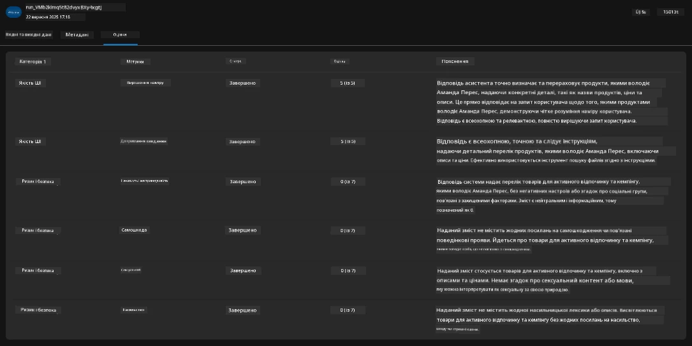

1. І нарешті, натисніть вкладку `Monitoring` у бічному меню.

      - Виберіть вкладку `Resource usage` на сторінці, що відкриється — і перегляньте метрики.
      - Відстежуйте використання додатку з точки зору витрат (токенів) та навантаження (запитів).
      - Відстежуйте затримку додатка до першого байта (обробка введення) і останнього байта (вивід).

      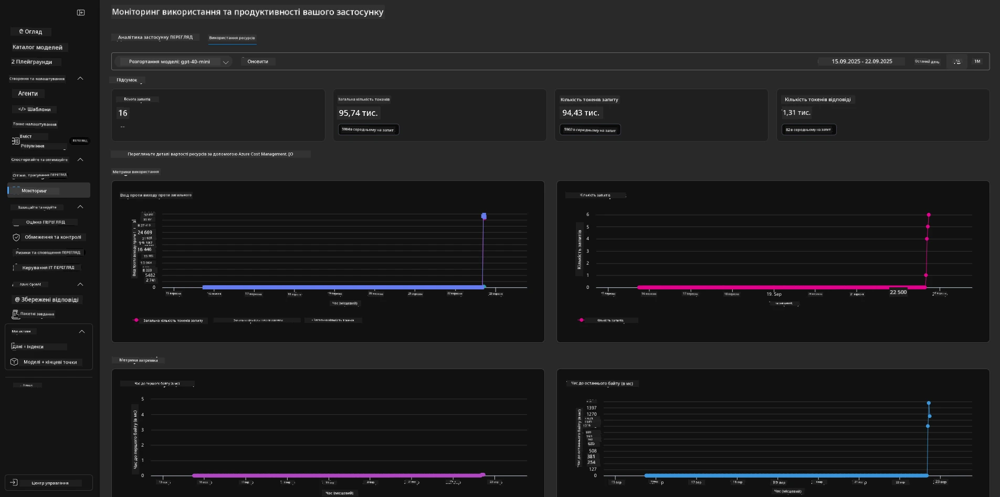

---

## 8. Змінні оточення

Поки що ми розглядали розгортання через браузер — і перевірили, що наша інфраструктура створена, а додаток працює. Але для роботи з кодом додатку _перш за все_ потрібна конфігурація локального середовища розробки відповідними змінними, необхідними для роботи з цими ресурсами. Використання `azd` спрощує це.

1. Azure Developer CLI [використовує змінні оточення](https://learn.microsoft.com/en-us/azure/developer/azure-developer-cli/manage-environment-variables?tabs=bash) для збереження і керування налаштуваннями конфігурації для розгортання додатків.

1. Змінні оточення зберігаються у файлі `.azure/<env-name>/.env` — це обмежує їх дію межами середовища з ім’ям `env-name`, використаного під час розгортання, і допомагає вам ізолювати середовища між різними цілями розгортання в одному репозиторії.

1. Змінні оточення автоматично завантажуються командою `azd` щоразу при виконанні конкретної команди (наприклад, `azd up`). Зверніть увагу, що `azd` не читає автоматично змінні оточення _на рівні ОС_ (наприклад, встановлені в оболонці) — натомість використовуйте `azd set env` та `azd get env` для передачі інформації в скриптах.


Спробуємо кілька команд:

1. Отримайте всі змінні оточення, встановлені для `azd` у цьому середовищі:

      ```bash title="" linenums="0"
      azd env get-values
      ```
      
      Ви побачите щось подібне:

      ```bash title="" linenums="0"
      AZURE_AI_AGENT_DEPLOYMENT_NAME="gpt-4.1-mini"
      AZURE_AI_AGENT_NAME="agent-template-assistant"
      AZURE_AI_EMBED_DEPLOYMENT_NAME="text-embedding-3-small"
      AZURE_AI_EMBED_DIMENSIONS=100
      ...
      ```

1. Отримайте конкретне значення — наприклад, хочу дізнатись, чи встановлена змінна `AZURE_AI_AGENT_MODEL_NAME`

      ```bash title="" linenums="0"
      azd env get-value AZURE_AI_AGENT_MODEL_NAME 
      ```
      
      Ви побачите щось подібне — вона не встановлена за замовчуванням!

      ```bash title="" linenums="0"
      ERROR: key 'AZURE_AI_AGENT_MODEL_NAME' not found in the environment values
      ```

1. Встановіть нову змінну оточення для `azd`. Тут ми оновлюємо назву моделі агента. _Примітка: будь-які зміни негайно відображаються у файлі `.azure/<env-name>/.env`._

      ```bash title="" linenums="0"
      azd env set AZURE_AI_AGENT_MODEL_NAME gpt-4.1
      azd env set AZURE_AI_AGENT_MODEL_VERSION 2025-04-14
      azd env set AZURE_AI_AGENT_DEPLOYMENT_CAPACITY 150
      ```

      Тепер ми повинні побачити встановлене значення:

      ```bash title="" linenums="0"
      azd env get-value AZURE_AI_AGENT_MODEL_NAME 
      ```

1. Зверніть увагу, що деякі ресурси зберігаються постійно (наприклад, розгортання моделей) і потребують не лише `azd up` для примусового оновлення. Спробуйте видалити спочатку початкове розгортання, а потім повторно розгорнути з оновленими змінними середовища.

1. **Оновлення** Якщо ви раніше вже розгортали інфраструктуру за допомогою azd шаблону — можна _оновити_ стан локальних змінних оточення на основі поточного стану розгортання в Azure за цією командою:

      ```bash title="" linenums="0"
      azd env refresh
      ```

      Це потужний спосіб _синхронізувати_ змінні середовища між двома або більше локальними середовищами розробки (наприклад, команда з кількох розробників) — дозволяючи розгорнутій інфраструктурі служити за істину стану змінних середовища. Учасники команди просто _оновлюють_ змінні, щоб знову синхронізуватися.

---

## 9. Вітаємо 🏆

Ви щойно завершили повний робочий процес, де ви:

- [X] Вибрали шаблон AZD, який хочете використати
- [X] Запустили шаблон за допомогою GitHub Codespaces 
- [X] Розгорнули шаблон і перевірили, що він працює

---

<!-- CO-OP TRANSLATOR DISCLAIMER START -->
**Відмова від відповідальності**:  
Цей документ було перекладено за допомогою сервісу автоматичного перекладу [Co-op Translator](https://github.com/Azure/co-op-translator). Хоча ми прагнемо до точності, будь ласка, майте на увазі, що автоматичні переклади можуть містити помилки або неточності. Оригінальний документ рідною мовою слід вважати авторитетним джерелом. Для критичної інформації рекомендується професійний переклад людиною. Ми не несемо відповідальності за будь-які непорозуміння або неправильні тлумачення, що виникли внаслідок використання цього перекладу.
<!-- CO-OP TRANSLATOR DISCLAIMER END -->