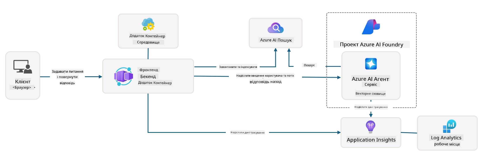

<!--
CO_OP_TRANSLATOR_METADATA:
{
  "original_hash": "4e403f041411361140d6beb88ab2a181",
  "translation_date": "2025-09-25T02:31:09+00:00",
  "source_file": "workshop/docs/instructions/3-Deconstruct-AI-Template.md",
  "language_code": "uk"
}
-->
# 3. Розбір шаблону

!!! tip "ПІСЛЯ ЗАВЕРШЕННЯ ЦЬОГО МОДУЛЯ ВИ ЗМОЖЕТЕ"

    - [ ] Пункт
    - [ ] Пункт
    - [ ] Пункт
    - [ ] **Лабораторія 3:** 

---

Завдяки шаблонам AZD та Azure Developer CLI (`azd`) ми можемо швидко розпочати розробку AI-проєктів за допомогою стандартизованих репозиторіїв, які містять прикладний код, інфраструктуру та конфігураційні файли — у вигляді готового до розгортання _стартового_ проєкту.

**Але тепер нам потрібно зрозуміти структуру проєкту та кодову базу — і навчитися налаштовувати шаблон AZD — без попереднього досвіду чи розуміння AZD!**

---

## 1. Активуйте GitHub Copilot

### 1.1 Встановіть GitHub Copilot Chat

Час дослідити [GitHub Copilot з режимом агента](https://code.visualstudio.com/docs/copilot/chat/chat-agent-mode). Тепер ми можемо використовувати природну мову для опису нашого завдання на високому рівні та отримувати допомогу у виконанні. Для цієї лабораторії ми будемо використовувати [безкоштовний план Copilot](https://github.com/github-copilot/signup), який має місячний ліміт на завершення завдань та взаємодії в чаті.

Розширення можна встановити з маркетплейсу, але воно вже має бути доступним у вашому середовищі Codespaces. _Натисніть `Open Chat` у випадаючому меню іконки Copilot — і введіть запит, наприклад, `What can you do?`_ — можливо, вам буде запропоновано увійти в систему. **GitHub Copilot Chat готовий до роботи**.

### 1.2 Встановіть MCP Servers

Для ефективної роботи в режимі агента потрібен доступ до відповідних інструментів, які допоможуть отримувати знання або виконувати дії. Тут на допомогу приходять MCP-сервери. Ми налаштуємо наступні сервери:

1. [Azure MCP Server](../../../../../workshop/docs/instructions)
1. [Microsoft Docs MCP Server](../../../../../workshop/docs/instructions)

Щоб активувати їх:

1. Створіть файл `.vscode/mcp.json`, якщо він не існує
1. Скопіюйте наступне у цей файл — і запустіть сервери!
   ```json title=".vscode/mcp.json"
   {
      "servers": {
         "Azure MCP Server": {
            "command": "npx",
            "args": [
            "-y",
            "@azure/mcp@latest",
            "server",
            "start"
            ]
         },
         "microsoft.docs.mcp": {
            "type": "http",
            "url": "https://learn.microsoft.com/api/mcp"
         }
      }
   }
   ```

??? warning "Можливо, ви отримаєте помилку, що `npx` не встановлено (натисніть, щоб розгорнути рішення)"

      Щоб виправити це, відкрийте файл `.devcontainer/devcontainer.json` і додайте цей рядок до розділу features. Потім перебудуйте контейнер. Тепер `npx` має бути встановлено.

      ```title="" linenums="0"
         "features": {
            "ghcr.io/devcontainers/features/node:1": {},
            ...
         },
      ```

---

### 1.3 Перевірте GitHub Copilot Chat

**Спочатку використовуйте `az login`, щоб автентифікуватися в Azure через командний рядок VS Code.**

Тепер ви повинні мати можливість запитувати статус вашої підписки Azure та ставити запитання про розгорнуті ресурси або конфігурацію. Спробуйте ці запити:

1. `List my Azure resource groups`
1. `#foundry list my current deployments`

Ви також можете ставити запитання про документацію Azure і отримувати відповіді, засновані на сервері Microsoft Docs MCP. Спробуйте ці запити:

1. `#microsoft_docs_search What is Azure Developer CLI?`
1. `#microsoft_docs_search Show me a Python tutorial to chat with deployed model`

Або ви можете попросити кодові фрагменти для виконання завдання. Спробуйте цей запит:

1. `Give me a Python code example that uses AAD for an interactive chat client`

У режимі `Ask` це надасть код, який ви можете скопіювати та спробувати. У режимі `Agent` це може піти далі і створити відповідні ресурси для вас — включаючи скрипти налаштування та документацію — щоб допомогти вам виконати це завдання.

**Тепер ви готові почати досліджувати репозиторій шаблонів**

---

## 2. Розбір архітектури

??? prompt "ASK: Поясніть архітектуру додатка в docs/images/architecture.png в одному абзаці"

      Цей додаток — це чат-додаток на основі штучного інтелекту, побудований на Azure, який демонструє сучасну архітектуру на основі агентів. Рішення зосереджене навколо Azure Container App, який містить основний код додатка, що обробляє введення користувача та генерує інтелектуальні відповіді через AI-агента. 
      
      Архітектура використовує Azure AI Foundry Project як основу для AI-можливостей, підключаючись до Azure AI Services, які забезпечують базові мовні моделі (наприклад, GPT-4o-mini) та функціональність агента. Взаємодії користувачів проходять через фронтенд на основі React до бекенду FastAPI, який спілкується з сервісом AI-агента для генерації контекстуальних відповідей. 
      
      Система включає можливості пошуку знань через пошук файлів або сервіс Azure AI Search, дозволяючи агенту отримувати та цитувати інформацію з завантажених документів. Для забезпечення операційної досконалості архітектура включає комплексний моніторинг через Application Insights та Log Analytics Workspace для трасування, логування та оптимізації продуктивності. 
      
      Azure Storage забезпечує блоб-сховище для даних додатка та завантажених файлів, а Managed Identity гарантує безпечний доступ між ресурсами Azure без зберігання облікових даних. Усе рішення спроєктоване для масштабованості та підтримуваності, з контейнеризованим додатком, який автоматично масштабується залежно від попиту, забезпечуючи вбудовану безпеку, моніторинг та можливості CI/CD через екосистему керованих сервісів Azure.



---

## 3. Структура репозиторію

!!! prompt "ASK: Поясніть структуру папок шаблону. Почніть з візуальної ієрархічної діаграми."

??? info "ANSWER: Візуальна ієрархічна діаграма"

      ```bash title="" 
      get-started-with-ai-agents/
      ├── 📋 Конфігурація та налаштування
      │   ├── azure.yaml                    # Конфігурація Azure Developer CLI
      │   ├── docker-compose.yaml           # Локальні контейнери розробки
      │   ├── pyproject.toml                # Конфігурація Python-проєкту
      │   ├── requirements-dev.txt          # Залежності для розробки
      │   └── .devcontainer/                # Налаштування dev-контейнера VS Code
      │
      ├── 🏗️ Інфраструктура (infra/)
      │   ├── main.bicep                    # Основний шаблон інфраструктури
      │   ├── api.bicep                     # Ресурси, специфічні для API
      │   ├── main.parameters.json          # Параметри інфраструктури
      │   └── core/                         # Модульні компоненти інфраструктури
      │       ├── ai/                       # Конфігурації AI-сервісів
      │       ├── host/                     # Інфраструктура хостингу
      │       ├── monitor/                  # Моніторинг та логування
      │       ├── search/                   # Налаштування Azure AI Search
      │       ├── security/                 # Безпека та ідентифікація
      │       └── storage/                  # Конфігурації сховища
      │
      ├── 💻 Джерело додатка (src/)
      │   ├── api/                          # Бекенд API
      │   │   ├── main.py                   # Точка входу FastAPI-додатка
      │   │   ├── routes.py                 # Визначення маршрутів API
      │   │   ├── search_index_manager.py   # Функціональність пошуку
      │   │   ├── data/                     # Обробка даних API
      │   │   ├── static/                   # Статичні веб-ресурси
      │   │   └── templates/                # HTML-шаблони
      │   ├── frontend/                     # Фронтенд на React/TypeScript
      │   │   ├── package.json              # Залежності Node.js
      │   │   ├── vite.config.ts            # Конфігурація збірки Vite
      │   │   └── src/                      # Вихідний код фронтенду
      │   ├── data/                         # Приклад файлів даних
      │   │   └── embeddings.csv            # Попередньо обчислені ембеддинги
      │   ├── files/                        # Файли бази знань
      │   │   ├── customer_info_*.json      # Приклади даних клієнтів
      │   │   └── product_info_*.md         # Документація продуктів
      │   ├── Dockerfile                    # Конфігурація контейнера
      │   └── requirements.txt              # Залежності Python
      │
      ├── 🔧 Автоматизація та скрипти (scripts/)
      │   ├── postdeploy.sh/.ps1           # Налаштування після розгортання
      │   ├── setup_credential.sh/.ps1     # Налаштування облікових даних
      │   ├── validate_env_vars.sh/.ps1    # Перевірка змінних середовища
      │   └── resolve_model_quota.sh/.ps1  # Управління квотами моделей
      │
      ├── 🧪 Тестування та оцінка
      │   ├── tests/                        # Юніт-тести та інтеграційні тести
      │   │   └── test_search_index_manager.py
      │   ├── evals/                        # Фреймворк оцінки агента
      │   │   ├── evaluate.py               # Запуск оцінки
      │   │   ├── eval-queries.json         # Тестові запити
      │   │   └── eval-action-data-path.json
      │   ├── sandbox/                      # Пісочниця для розробки
      │   │   ├── 1-quickstart.py           # Приклади для швидкого старту
      │   │   └── aad-interactive-chat.py   # Приклади автентифікації
      │   └── airedteaming/                 # Оцінка безпеки AI
      │       └── ai_redteaming.py          # Тестування червоної команди
      │
      ├── 📚 Документація (docs/)
      │   ├── deployment.md                 # Посібник з розгортання
      │   ├── local_development.md          # Інструкції з локального налаштування
      │   ├── troubleshooting.md            # Поширені проблеми та їх вирішення
      │   ├── azure_account_setup.md        # Попередні налаштування Azure
      │   └── images/                       # Ресурси документації
      │
      └── 📄 Метадані проєкту
         ├── README.md                     # Огляд проєкту
         ├── CODE_OF_CONDUCT.md           # Правила спільноти
         ├── CONTRIBUTING.md              # Посібник з внесення змін
         ├── LICENSE                      # Умови ліцензії
         └── next-steps.md                # Наступні кроки після розгортання
      ```

### 3.1 Основна архітектура додатка

Цей шаблон дотримується патерну **повноцінного веб-додатка** з:

- **Бекендом**: Python FastAPI з інтеграцією Azure AI
- **Фронтендом**: TypeScript/React з системою збірки Vite
- **Інфраструктурою**: Шаблони Azure Bicep для хмарних ресурсів
- **Контейнеризацією**: Docker для узгодженого розгортання

### 3.2 Інфраструктура як код (bicep)

Шар інфраструктури використовує **шаблони Azure Bicep**, організовані модульно:

   - **`main.bicep`**: Оркеструє всі ресурси Azure
   - **Модулі `core/`**: Повторно використовувані компоненти для різних сервісів
      - AI-сервіси (Azure OpenAI, AI Search)
      - Хостинг контейнерів (Azure Container Apps)
      - Моніторинг (Application Insights, Log Analytics)
      - Безпека (Key Vault, Managed Identity)

### 3.3 Джерело додатка (`src/`)

**Бекенд API (`src/api/`)**:

- REST API на основі FastAPI
- Інтеграція сервісу AI-агента Azure
- Управління індексом пошуку для отримання знань
- Можливості завантаження та обробки файлів

**Фронтенд (`src/frontend/`)**:

- Сучасний SPA на React/TypeScript
- Vite для швидкої розробки та оптимізованих збірок
- Інтерфейс чату для взаємодії з агентом

**База знань (`src/files/`)**:

- Приклад даних клієнтів та продуктів
- Демонструє отримання знань на основі файлів
- Приклади у форматах JSON та Markdown

### 3.4 DevOps та автоматизація

**Скрипти (`scripts/`)**:

- Кросплатформні скрипти PowerShell та Bash
- Перевірка та налаштування середовища
- Конфігурація після розгортання
- Управління квотами моделей

**Інтеграція Azure Developer CLI**:

- Конфігурація `azure.yaml` для робочих процесів `azd`
- Автоматизоване забезпечення та розгортання
- Управління змінними середовища

### 3.5 Тестування та забезпечення якості

**Фреймворк оцінки (`evals/`)**:

- Оцінка продуктивності агента
- Тестування якості запитів-відповідей
- Автоматизований конвеєр оцінки

**Безпека AI (`airedteaming/`)**:

- Тестування червоної команди для безпеки AI
- Сканування вразливостей
- Практики відповідального використання AI

---

## 4. Вітаємо 🏆

Ви успішно використали GitHub Copilot Chat з MCP-серверами для дослідження репозиторію.

- [X] Активували GitHub Copilot для Azure
- [X] Зрозуміли архітектуру додатка
- [X] Дослідили структуру шаблону AZD

Це дає вам уявлення про _інфраструктуру як код_ для цього шаблону. Далі ми розглянемо конфігураційний файл для AZD.

---

