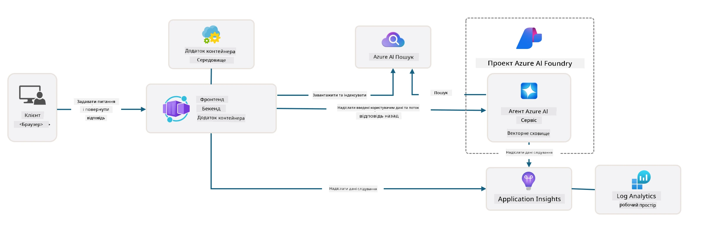

# 3. Розбір шаблону

!!! tip "НА КІНЕЦЬ ЦЬОГО МОДУЛЮ ВИ ЗМОЖЕТЕ"

    - [ ] Активувати GitHub Copilot з серверами MCP для допомоги з Azure
    - [ ] Розуміти структуру папок та компоненти шаблону AZD
    - [ ] Вивчити організаційні патерни інфраструктури як коду (Bicep)
    - [ ] **Лабораторна робота 3:** Використовувати GitHub Copilot для дослідження та розуміння архітектури репозиторію

---

За допомогою шаблонів AZD та Azure Developer CLI (`azd`) ми можемо швидко розпочати нашу подорож з розробки ШІ, використовуючи стандартизовані репозиторії, які надають прикладний код, інфраструктуру та файли конфігурації — у вигляді готового до розгортання _стартер-проєкту_.

**Але зараз нам потрібно зрозуміти структуру проєкту та кодову базу — і вміти налаштовувати шаблон AZD — без жодного попереднього досвіду або розуміння AZD!**

---

## 1. Активуйте GitHub Copilot

### 1.1 Встановіть GitHub Copilot Chat

Настав час дослідити [GitHub Copilot з режимом агента](https://code.visualstudio.com/docs/copilot/chat/chat-agent-mode). Тепер ми можемо описувати завдання природною мовою на високому рівні та отримувати допомогу у виконанні. Для цієї лабораторної роботи ми скористаємось [безкоштовним планом Copilot](https://github.com/github-copilot/signup), який має місячне обмеження на завершення команд і взаємодії в чаті.

Розширення можна встановити з маркетплейсу, але воно вже має бути доступним у вашому середовищі Codespaces. _Натисніть `Open Chat` у випадаючому меню значка Copilot — і введіть запит, наприклад, `What can you do?`_ — можливо, вас попросять увійти в систему. **GitHub Copilot Chat готовий до роботи**.

### 1.2. Встановіть сервери MCP

Для ефективної роботи режиму агента йому потрібен доступ до правильних інструментів, щоб допомагати з пошуком знань або виконанням дій. Тут можуть допомогти сервери MCP. Ми налаштуємо наступні сервери:

1. [Azure MCP Server](../../../../../workshop/docs/instructions)
1. [Microsoft Docs MCP Server](../../../../../workshop/docs/instructions)

Щоб активувати їх:

1. Створіть файл `.vscode/mcp.json`, якщо він ще не існує
1. Скопіюйте до цього файлу наступне — і запустіть сервери!
   ```json title=".vscode/mcp.json"
   {
      "servers": {
         "Azure MCP Server": {
            "command": "npx",
            "args": [
            "-y",
            "@azure/mcp@latest",
            "server",
            "start"
            ]
         },
         "microsoft.docs.mcp": {
            "type": "http",
            "url": "https://learn.microsoft.com/api/mcp"
         }
      }
   }
   ```

??? warning "Ви можете отримати помилку, що `npx` не встановлено (натисніть для розгортання інструкції)"

      Щоб виправити, відкрийте файл `.devcontainer/devcontainer.json` та додайте цей рядок до секції features. Потім перебудуйте контейнер. Тепер у вас повинен бути встановлений `npx`.

      ```title="" linenums="0"
         "features": {
            "ghcr.io/devcontainers/features/node:1": {},
            ...
         },
      ```

---

### 1.3. Перевірте GitHub Copilot Chat

**Спершу використайте `az login` для автентифікації в Azure з командного рядка VS Code.**

Тепер ви зможете запитувати стан вашої підписки Azure та ставити питання про розгорнуті ресурси чи конфігурацію. Спробуйте ці запити:

1. `List my Azure resource groups`
1. `#foundry list my current deployments`

Ви також можете ставити питання про документацію Azure та отримувати відповіді, засновані на сервері Microsoft Docs MCP. Спробуйте ці запити:

1. `#microsoft_docs_search What is Azure Developer CLI?`
1. `#microsoft_docs_search Show me a Python tutorial to chat with deployed model`

Або ви можете попросити фрагменти коду для виконання завдання. Спробуйте цей запит:

1. `Give me a Python code example that uses AAD for an interactive chat client`

У режимі `Ask` це надасть код, який ви зможете скопіювати та спробувати. У режимі `Agent` це може піти далі і створити відповідні ресурси для вас — включно зі скриптами налаштування та документацією — щоб допомогти виконати завдання.

**Тепер ви готові почати дослідження репозиторію шаблону**

---

## 2. Розбір архітектури

??? prompt "ASK: Поясніть архітектуру застосунку на зображенні docs/images/architecture.png одним абзацом"

      Цей застосунок — це чат-додаток з ШІ на базі Azure, що демонструє сучасну архітектуру з агентами. Рішення зосереджено навколо Azure Container App, який розміщує основний код застосунку, що обробляє введення користувача та генерує інтелектуальні відповіді через агента ШІ.
      
      Архітектура спирається на Microsoft Foundry Project як основу для ШІ, підключаючись до Azure AI Services, які надають мовні моделі (наприклад, gpt-4.1-mini) та агентські функції. Взаємодія з користувачем проходить через фронтенд на React до бекенду на FastAPI, який комунікує з сервісом агента ШІ для генерації контекстних відповідей.
      
      Система включає можливості пошуку знань через файли або сервіс Azure AI Search, дозволяючи агенту отримувати та цитувати інформацію з завантажених документів.
      
      Для операційної досконалості архітектура містить комплексний моніторинг через Application Insights і Log Analytics Workspace для трасування, логування та оптимізації продуктивності.
      
      Azure Storage забезпечує зберігання об’єктів для даних застосунку та завантажених файлів, а Managed Identity гарантує безпечний доступ між ресурсами Azure без зберігання облікових даних. Усе рішення спроектовано для масштабованості та підтримуваності, з автоматичним масштабуванням контейнерного застосунку залежно від попиту, забезпечуючи вбудовану безпеку, моніторинг і можливості CI/CD через екосистему керованих сервісів Azure.



---

## 3. Структура репозиторію

!!! prompt "ASK: Поясніть структуру папок шаблону. Почніть з візуальної ієрархічної діаграми."

??? info "ВІДПОВІДЬ: Візуальна ієрархічна діаграма"

      ```bash title="" 
      get-started-with-ai-agents/
      ├── 📋 Налаштування та конфігурація
      │   ├── azure.yaml                    # Конфігурація Azure Developer CLI
      │   ├── docker-compose.yaml           # Локальні контейнери для розробки
      │   ├── pyproject.toml                # Конфігурація Python-проєкту
      │   ├── requirements-dev.txt          # Залежності для розробки
      │   └── .devcontainer/                # Налаштування dev container для VS Code
      │
      ├── 🏗️ Інфраструктура (infra/)
      │   ├── main.bicep                    # Головний інфраструктурний шаблон
      │   ├── api.bicep                     # Ресурси, специфічні для API
      │   ├── main.parameters.json          # Параметри інфраструктури
      │   └── core/                         # Модульні компоненти інфраструктури
      │       ├── ai/                       # Конфігурації сервісів ШІ
      │       ├── host/                     # Хостингова інфраструктура
      │       ├── monitor/                  # Моніторинг та логування
      │       ├── search/                   # Налаштування Azure AI Search
      │       ├── security/                 # Безпека та ідентичність
      │       └── storage/                  # Конфігурації акаунту сховища
      │
      ├── 💻 Вихідний код застосунку (src/)
      │   ├── api/                          # Бекенд API
      │   │   ├── main.py                   # Точка входу FastAPI-застосунку
      │   │   ├── routes.py                 # Визначення маршрутів API
      │   │   ├── search_index_manager.py   # Функціонал пошуку
      │   │   ├── data/                     # Обробка даних API
      │   │   ├── static/                   # Статичні веб-ресурси
      │   │   └── templates/                # HTML-шаблони
      │   ├── frontend/                     # Фронтенд React/TypeScript
      │   │   ├── package.json              # Залежності Node.js
      │   │   ├── vite.config.ts            # Конфігурація збірки Vite
      │   │   └── src/                      # Вихідний код фронтенду
      │   ├── data/                         # Прикладні файли даних
      │   │   └── embeddings.csv            # Попередньо обчислені embeddings
      │   ├── files/                        # Файли бази знань
      │   │   ├── customer_info_*.json      # Зразки даних клієнтів
      │   │   └── product_info_*.md         # Документація продукту
      │   ├── Dockerfile                    # Конфігурація контейнера
      │   └── requirements.txt              # Python-залежності
      │
      ├── 🔧 Автоматизація та скрипти (scripts/)
      │   ├── postdeploy.sh/.ps1           # Налаштування після розгортання
      │   ├── setup_credential.sh/.ps1     # Конфігурація облікових даних
      │   ├── validate_env_vars.sh/.ps1    # Перевірка змінних оточення
      │   └── resolve_model_quota.sh/.ps1  # Управління квотою моделей
      │
      ├── 🧪 Тестування та оцінка
      │   ├── tests/                        # Юніт- та інтеграційні тести
      │   │   └── test_search_index_manager.py
      │   ├── evals/                        # Фреймворк оцінювання агентів
      │   │   ├── evaluate.py               # Запуск оцінювання
      │   │   ├── eval-queries.json         # Тестові запити
      │   │   └── eval-action-data-path.json
      │   ├── sandbox/                      # Пісочниця для розробки
      │   │   ├── 1-quickstart.py           # Приклади швидкого старту
      │   │   └── aad-interactive-chat.py   # Приклади автентифікації
      │   └── airedteaming/                 # Оцінка безпеки ШІ
      │       └── ai_redteaming.py          # Тестування "червоної команди"
      │
      ├── 📚 Документація (docs/)
      │   ├── deployment.md                 # Посібник розгортання
      │   ├── local_development.md          # Інструкції локальної настройки
      │   ├── troubleshooting.md            # Вирішення поширених проблем
      │   ├── azure_account_setup.md        # Передумови Azure
      │   └── images/                       # Активи для документації
      │
      └── 📄 Метадані проєкту
         ├── README.md                     # Огляд проєкту
         ├── CODE_OF_CONDUCT.md           # Правила спільноти
         ├── CONTRIBUTING.md              # Керівництво по внесках
         ├── LICENSE                      # Ліцензійні умови
         └── next-steps.md                # Настанови після розгортання
      ```

### 3.1. Основна архітектура застосунку

Цей шаблон дотримується патерну **full-stack веб-застосунку** з:

- **Бекенд**: Python FastAPI з інтеграцією Azure AI
- **Фронтенд**: TypeScript/React із системою збірки Vite
- **Інфраструктура**: шаблони Azure Bicep для хмарних ресурсів
- **Контейнеризація**: Docker для узгодженого розгортання

### 3.2 Інфраструктура як код (bicep)

Шар інфраструктури використовує **Azure Bicep** шаблони з модульною організацією:

   - **`main.bicep`**: оркестрація всіх Azure ресурсів
   - **модулі `core/`**: багаторазові компоненти для різних сервісів
      - Сервіси ШІ (Microsoft Foundry Models, AI Search)
      - Хостинг контейнерів (Azure Container Apps)
      - Моніторинг (Application Insights, Log Analytics)
      - Безпека (Key Vault, Managed Identity)

### 3.3 Вихідний код застосунку (`src/`)

**Бекенд API (`src/api/`)**:

- REST API на базі FastAPI
- Інтеграція Foundry Agents
- Управління індексами пошуку для отримання знань
- Можливості завантаження та обробки файлів

**Фронтенд (`src/frontend/`)**:

- Сучасний SPA на React/TypeScript
- Vite для швидкої розробки та оптимізованих збірок
- Інтерфейс чату для взаємодії з агентом

**База знань (`src/files/`)**:

- Приклади даних клієнтів та продуктів
- Демонструє отримання знань із файлів
- Приклади у форматах JSON та Markdown

### 3.4 DevOps і автоматизація

**Скрипти (`scripts/`)**:

- Кросплатформенні скрипти PowerShell і Bash
- Перевірка і налаштування середовища
- Пост-розгортання конфігурації
- Управління квотою моделей

**Інтеграція з Azure Developer CLI**:

- Конфігурація `azure.yaml` для робочих процесів `azd`
- Автоматизоване розгортання та налаштування
- Керування змінними оточення

### 3.5 Тестування та забезпечення якості

**Фреймворк оцінювання (`evals/`)**:

- Оцінка продуктивності агентів
- Тестування якості відповідей на запити
- Автоматизований конвеєр оцінювання

**Безпека ШІ (`airedteaming/`)**:

- Тестування червоної команди для безпеки ШІ
- Сканування вразливостей безпеки
- Відповідальні практики ШІ

---

## 4. Вітаємо 🏆

Ви успішно скористалися GitHub Copilot Chat з серверами MCP, щоб дослідити репозиторій.

- [X] Активували GitHub Copilot для Azure
- [X] Зрозуміли архітектуру застосунку
- [X] Ознайомились зі структурою шаблону AZD

Це дає вам уявлення про активи _інфраструктури як коду_ для цього шаблону. Наступним кроком ми розглянемо файл конфігурації для AZD.

---

<!-- CO-OP TRANSLATOR DISCLAIMER START -->
**Відмова від відповідальності**:  
Цей документ було перекладено за допомогою сервісу машинного перекладу [Co-op Translator](https://github.com/Azure/co-op-translator). Хоча ми прагнемо до точності, будь ласка, майте на увазі, що автоматичні переклади можуть містити помилки або неточності. Оригінальний документ рідною мовою слід вважати авторитетним джерелом. Для критично важливої інформації рекомендується звертатися до професійного людського перекладу. Ми не несемо відповідальності за будь-які непорозуміння або неправильні тлумачення, що виникли внаслідок використання цього перекладу.
<!-- CO-OP TRANSLATOR DISCLAIMER END -->