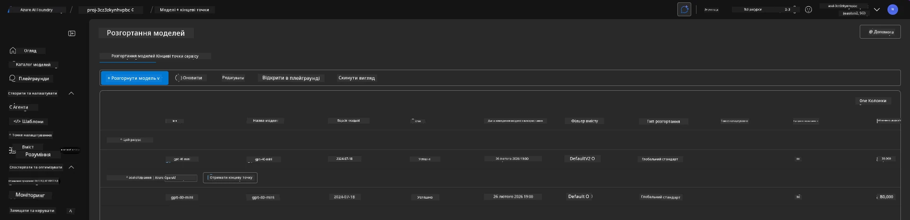
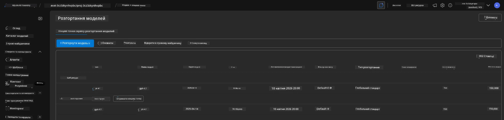

# 6. Зняття інфраструктури

!!! tip "НАПРИКІНЦІ ЦЬОГО МОДУЛЮ ВИ ЗМОЖЕТЕ"

    - [ ] Розуміти важливість очищення ресурсів та управління витратами
    - [ ] Використовувати `azd down` для безпечного зняття інфраструктури
    - [ ] Відновлювати сервіс когнітивних послуг, видалений у м’якому режимі, за потреби
    - [ ] **Лабораторна робота 6:** Очистити ресурси Azure та перевірити їх видалення

---

## Додаткові вправи

Перед тим, як зняти проект, виділіть кілька хвилин на вільне дослідження.

!!! info "Спробуйте ці ідеї для дослідження"

    **Пореготуйте з GitHub Copilot:**
    
    1. Запитайте: `Які ще шаблони AZD я можу спробувати для сценаріїв з кількома агентами?`
    2. Запитайте: `Як можна налаштувати інструкції агента для випадку використання в охороні здоров'я?`
    3. Запитайте: `Які змінні середовища контролюють оптимізацію витрат?`
    
    **Огляньте портал Azure:**
    
    1. Перегляньте метрики Application Insights для вашого розгортання
    2. Перевірте аналіз витрат для забезпечених ресурсів
    3. Ще раз дослідіть майданчик порталу Microsoft Foundry для агентів

---

## Зняття інфраструктури

1. Зняття інфраструктури — це так само просто, як:
      
      ```bash title="" linenums="0"
      azd down --purge
      ```
1. Прапорець `--purge` забезпечує також очищення ресурсів когнітивних служб, видалених у м’якому режимі, що дозволяє звільнити квоти, зайняті цими ресурсами. Після завершення ви побачите щось подібне:
      
      ```bash title="" linenums="0"
      ? Total resources to delete: 11, are you sure you want to continue? Yes
      Deleting your resources can take some time.
      (✓) Done: Deleted resource group rg-nitya-mshack-azd
      (✓) Done: Purging Cognitive Account: aoai-3cz3zkynhvpbc

      SUCCESS: Your application was removed from Azure in 11 minutes 4 seconds.
      ```

1. (За бажанням) Якщо ви зараз знову запустите `azd up`, то помітите, що модель gpt-4.1 розгортається, оскільки змінна середовища була змінена (і збережена) у локальній папці `.azure`. 

      Ось як виглядало розгортання моделей **раніше**:

      

      А ось як **після**:
      

---

<!-- CO-OP TRANSLATOR DISCLAIMER START -->
**Відмова від відповідальності**:
Цей документ було перекладено за допомогою сервісу автоматичного перекладу [Co-op Translator](https://github.com/Azure/co-op-translator). Незважаючи на наші зусилля забезпечити точність, будь ласка, майте на увазі, що автоматичні переклади можуть містити помилки або неточності. Оригінальний документ рідною мовою слід вважати авторитетним джерелом. Для критичної інформації рекомендується звертатися до професійного людського перекладу. Ми не несемо відповідальності за будь-які непорозуміння чи неправильні тлумачення, що виникли внаслідок використання цього перекладу.
<!-- CO-OP TRANSLATOR DISCLAIMER END -->