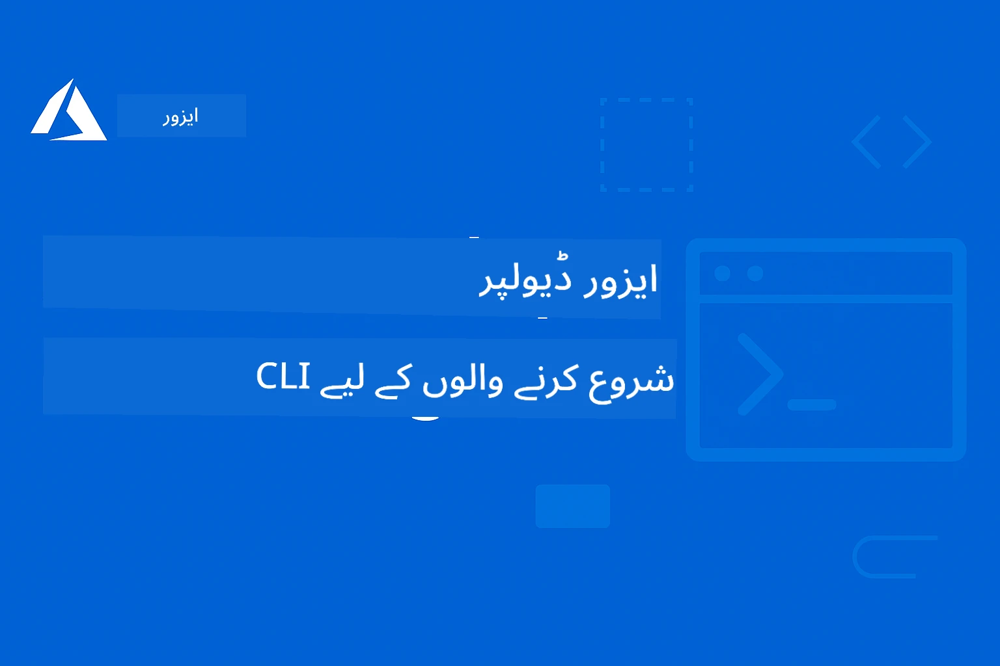

# AZD برائے شروع کرنے والوں: ایک منظم تعلیمی سفر

 

[](https://GitHub.com/microsoft/azd-for-beginners/watchers/)
[](https://GitHub.com/microsoft/azd-for-beginners/network/)
[](https://GitHub.com/microsoft/azd-for-beginners/stargazers/)

[](https://discord.gg/microsoft-azure)
[](https://discord.gg/nTYy5BXMWG)

## اس کورس کے ساتھ شروع کریں

اپنی AZD سیکھنے کی سفر شروع کرنے کے لیے یہ اقدامات کریں:

1. **ریپوزیٹری کو فورک کریں**: کلک کریں [](https://GitHub.com/microsoft/azd-for-beginners/fork)
2. **ریپوزیٹری کلون کریں**: `git clone https://github.com/microsoft/azd-for-beginners.git`
3. **کمیونٹی میں شامل ہوں**: [Azure Discord کمیونٹیز](https://discord.com/invite/ByRwuEEgH4) ماہرین کی مدد کے لیے
4. **اپنا تعلیمی راستہ منتخب کریں**: نیچے دیے گئے چپٹر میں سے اپنی تجربے کی سطح کے مطابق انتخاب کریں

### کثیر لسانی معاونت

#### خودکار تراجم (ہمیشہ تازہ ترین)

<!-- CO-OP TRANSLATOR LANGUAGES TABLE START -->
[Arabic](../ar/README.md) | [Bengali](../bn/README.md) | [Bulgarian](../bg/README.md) | [Burmese (Myanmar)](../my/README.md) | [Chinese (Simplified)](../zh-CN/README.md) | [Chinese (Traditional, Hong Kong)](../zh-HK/README.md) | [Chinese (Traditional, Macau)](../zh-MO/README.md) | [Chinese (Traditional, Taiwan)](../zh-TW/README.md) | [Croatian](../hr/README.md) | [Czech](../cs/README.md) | [Danish](../da/README.md) | [Dutch](../nl/README.md) | [Estonian](../et/README.md) | [Finnish](../fi/README.md) | [French](../fr/README.md) | [German](../de/README.md) | [Greek](../el/README.md) | [Hebrew](../he/README.md) | [Hindi](../hi/README.md) | [Hungarian](../hu/README.md) | [Indonesian](../id/README.md) | [Italian](../it/README.md) | [Japanese](../ja/README.md) | [Kannada](../kn/README.md) | [Korean](../ko/README.md) | [Lithuanian](../lt/README.md) | [Malay](../ms/README.md) | [Malayalam](../ml/README.md) | [Marathi](../mr/README.md) | [Nepali](../ne/README.md) | [Nigerian Pidgin](../pcm/README.md) | [Norwegian](../no/README.md) | [Persian (Farsi)](../fa/README.md) | [Polish](../pl/README.md) | [Portuguese (Brazil)](../pt-BR/README.md) | [Portuguese (Portugal)](../pt-PT/README.md) | [Punjabi (Gurmukhi)](../pa/README.md) | [Romanian](../ro/README.md) | [Russian](../ru/README.md) | [Serbian (Cyrillic)](../sr/README.md) | [Slovak](../sk/README.md) | [Slovenian](../sl/README.md) | [Spanish](../es/README.md) | [Swahili](../sw/README.md) | [Swedish](../sv/README.md) | [Tagalog (Filipino)](../tl/README.md) | [Tamil](../ta/README.md) | [Telugu](../te/README.md) | [Thai](../th/README.md) | [Turkish](../tr/README.md) | [Ukrainian](../uk/README.md) | [Urdu](./README.md) | [Vietnamese](../vi/README.md)

> **مقامی کلون کرنا پسند کریں؟**

> اس ریپوزیٹری میں 50+ زبانوں کے تراجم شامل ہیں جو ڈاؤن لوڈ کا حجم بہت بڑھاتے ہیں۔ بغیر تراجم کے کلون کرنے کے لیے sparse checkout استعمال کریں:
> ```bash
> git clone --filter=blob:none --sparse https://github.com/microsoft/AZD-for-beginners.git
> cd AZD-for-beginners
> git sparse-checkout set --no-cone '/*' '!translations' '!translated_images'
> ```
> اس سے آپ کو تیزی سے کورس مکمل کرنے کے لیے مطلوب سب کچھ مل جائے گا۔
<!-- CO-OP TRANSLATOR LANGUAGES TABLE END -->

## کورس کا جائزہ

Azure Developer CLI (azd) کو منظم چپٹروں کے ذریعے مکمل طریقے سے سیکھیں جو تدریجی سیکھنے کے لیے ترتیب دیے گئے ہیں۔ **خاص توجہ Microsoft Foundry انضمام کے ساتھ AI ایپلیکیشن کی تعیناتی پر۔**

### یہ کورس جدید ڈیولپرز کے لیے کیوں ضروری ہے

Microsoft Foundry Discord کمیونٹی کے مشاہدات کی بنیاد پر، **45% ڈیولپرز AI کے کاموں کے لیے AZD استعمال کرنا چاہتے ہیں** لیکن مندرجہ ذیل چیلنجز کا سامنا کرتے ہیں:
- پیچیدہ کثیر سروس AI ساختیں  
- پروڈکشن AI تعیناتی کی بہترین عملی تدابیر  
- Azure AI سروس کا انضمام اور ترتیب  
- AI کاموں کی لاگت کی بہتری  
- AI مخصوص تعیناتی کے مسائل کی تشخیص

### سیکھنے کے مقاصد

یہ منظم کورس مکمل کرنے کے بعد آپ:
- **AZD کی بنیادی باتوں میں مہارت حاصل کریں گے**: بنیادی تصورات، تنصیب، اور ترتیب
- **AI ایپلیکیشنز کی تعیناتی کریں گے**: Microsoft Foundry خدمات کے ساتھ AZD کا استعمال
- **انفراسٹرکچر بطور کوڈ نافذ کریں گے**: Bicep ٹیمپلیٹس کے ساتھ Azure وسائل کا انتظام
- **تعیناتی کے مسائل حل کریں گے**: عام مسائل کی اصلاح اور ڈی بگنگ
- **پروڈکشن کے لیے بہتر بنائیں گے**: سیکیورٹی، اسکیلنگ، مانیٹرنگ، اور لاگت کا انتظام
- **کثیر ایجنٹ AI حل بنائیں گے**: پیچیدہ AI ساختیں تعینات کریں

## 📚 تعلیمی چپٹر

*اپنی تجربے کی سطح اور اہداف کی بنیاد پر تعلیمی راستہ منتخب کریں*

### 🚀 چپٹر 1: بنیاد اور جلد آغاز
**ضروریات**: Azure سبسکرپشن، بنیادی کمانڈ لائن معلومات  
**دورانیہ**: 30-45 منٹ  
**پیچیدگی**: ⭐

#### آپ کیا سیکھیں گے
- Azure Developer CLI کی بنیادی سمجھ  
- AZD اپنے پلیٹ فارم پر انسٹال کرنا  
- آپ کی پہلی کامیاب تعیناتی

#### تعلیمی وسائل
- **🎯 یہاں سے شروع کریں**: [Azure Developer CLI کیا ہے؟](../..)
- **📖 نظریہ**: [AZD کے بنیادی اصول](docs/getting-started/azd-basics.md) - بنیادی تصورات اور اصطلاحات
- **⚙️ سیٹ اپ**: [انسٹالیشن اور سیٹ اپ](docs/getting-started/installation.md) - پلیٹ فارم مخصوص گائیڈز
- **🛠️ عملی کام**: [آپ کا پہلا پروجیکٹ](docs/getting-started/first-project.md) - مرحلہ وار رہنما
- **📋 فوری حوالے کے لیے**: [کمانڈ چیٹ شیٹ](resources/cheat-sheet.md)

#### عملی مشقیں
```bash
# فوری تنصیب کی جانچ
azd version

# اپنی پہلی ایپلیکیشن تعینات کریں
azd init --template todo-nodejs-mongo
azd up
```

**💡 چپٹر کا نتیجہ**: AZD کا استعمال کرتے ہوئے ایک سادہ ویب ایپلیکیشن Azure پر کامیابی سے تعینات کریں

**✅ کامیابی کی تصدیق:**
```bash
# باب 1 مکمل کرنے کے بعد، آپ کو قابل ہونا چاہیے:
azd version              # انسٹال شدہ ورژن دکھاتا ہے
azd init --template todo-nodejs-mongo  # پروجیکٹ کو شروع کرتا ہے
azd up                  # Azure پر تعینات کرتا ہے
azd show                # چلتی ہوئی ایپ کا یو آر ایل دکھاتا ہے
# ایپلیکیشن براؤزر میں کھلتی ہے اور کام کرتی ہے
azd down --force --purge  # وسائل کو صاف کرتا ہے
```

**📊 وقت کی سرمایہ کاری:** 30-45 منٹ  
**📈 اس کے بعد کی مہارت:** بنیادی ایپلیکیشنز خود مختارانہ طور پر تعینات کرسکتے ہیں

**✅ کامیابی کی تصدیق:**
```bash
# باب 1 مکمل کرنے کے بعد، آپ کو اہل ہونا چاہیے کہ:
azd version              # نصب شدہ ورژن دکھاتا ہے
azd init --template todo-nodejs-mongo  # پروجیکٹ کو شروع کرتا ہے
azd up                  # ایزور پر تعینات کرتا ہے
azd show                # چلنے والی ایپ کا یو آر ایل دکھاتا ہے
# ایپلیکیشن براؤزر میں کھلتی ہے اور کام کرتی ہے
azd down --force --purge  # وسائل کی صفائی کرتا ہے
```

**📊 وقت کی سرمایہ کاری:** 30-45 منٹ  
**📈 اس کے بعد کی مہارت:** بنیادی ایپلیکیشنز خود مختارانہ طور پر تعینات کرسکتے ہیں

---

### 🤖 چپٹر 2: AI-فرسٹ ڈیولپمنٹ (AI ڈیولپرز کے لیے سفارش کی گئی)
**ضروریات**: چپٹر 1 مکمل ہو  
**دورانیہ**: 1-2 گھنٹے  
**پیچیدگی**: ⭐⭐

#### آپ کیا سیکھیں گے
- Microsoft Foundry انضمام AZD کے ساتھ  
- AI سے چلنے والی ایپلیکیشنز کی تعیناتی  
- AI سروس کنفیگریشن کی سمجھ

#### تعلیمی وسائل
- **🎯 یہاں سے شروع کریں**: [Microsoft Foundry انضمام](docs/microsoft-foundry/microsoft-foundry-integration.md)
- **📖 نمونے**: [AI ماڈل تعیناتی](docs/microsoft-foundry/ai-model-deployment.md) - AI ماڈلز کی تعیناتی اور انتظام  
- **🛠️ ورکشاپ**: [AI ورکشاپ لیب](docs/microsoft-foundry/ai-workshop-lab.md) - اپنے AI حل AZD کے لیے تیار کریں  
- **🎥 تعاملی رہنما**: [ورکشاپ مواد](workshop/README.md) - MkDocs کے ساتھ براؤزر پر تعلیم * DevContainer ماحولیات
- **📋 ٹیمپلیٹس**: [Microsoft Foundry ٹیمپلیٹس](../..)
- **📝 مثالیں**: [AZD تعیناتی کی مثالیں](examples/README.md)

#### عملی مشقیں
```bash
# اپنا پہلا AI ایپلیکیشن تعینات کریں
azd init --template azure-search-openai-demo
azd up

# مزید AI ٹیمپلیٹس آزما کر دیکھیں
azd init --template openai-chat-app-quickstart
azd init --template agent-openai-python-prompty
```

**💡 چپٹر کا نتیجہ**: RAG صلاحیتوں کے ساتھ AI سے چلنے والی چیٹ ایپلیکیشن کی تعیناتی اور ترتیب

**✅ کامیابی کی تصدیق:**
```bash
# باب ۲ کے بعد، آپ کو یہ قابل ہونا چاہیے کہ:
azd init --template azure-search-openai-demo
azd up
# AI چیٹ انٹرفیس کا ٹیسٹ کریں
# سوالات پوچھیں اور ذرائع کے ساتھ AI سے چلنے والے جوابات حاصل کریں
# تصدیق کریں کہ سرچ انٹیگریشن کام کرتی ہے
azd monitor  # چیک کریں کہ Application Insights ٹیلیمیٹری دکھاتا ہے
azd down --force --purge
```

**📊 وقت کی سرمایہ کاری:** 1-2 گھنٹے  
**📈 اس کے بعد کی مہارت:** پروڈکشن-ریڈی AI ایپلیکیشنز تعینات اور ترتیب دے سکتے ہیں  
**💰 لاگت کی آگاہی:** $80-150/ماہ ڈویلپمنٹ کے اخراجات، $300-3500/ماہ پروڈکشن کے اخراجات سمجھیں

#### 💰 AI تعیناتیوں کے لیے لاگت کے پہلو

**ڈویلپمنٹ ماحول (اندازاً $80-150/ماہ):**
- Azure OpenAI (ادائیگی کے مطابق): $0-50/ماہ (ٹوکن کے استعمال پر مبنی)  
- AI Search (بنیادی سطح): $75/ماہ  
- Container Apps (کھپت): $0-20/ماہ  
- اسٹوریج (معیاری): $1-5/ماہ

**پروڈکشن ماحول (اندازاً $300-3,500+/ماہ):**
- Azure OpenAI (PTU مستقل کارکردگی کے لیے): $3,000+/ماہ یا ادائیگی کے مطابق بڑی مقدار میں  
- AI Search (معیاری سطح): $250/ماہ  
- Container Apps (مخصوص): $50-100/ماہ  
- Application Insights: $5-50/ماہ  
- اسٹوریج (پریمیم): $10-50/ماہ

**💡 لاگت کی بہتری کے مشورے:**
- سیکھنے کے لیے **مفت سطح** Azure OpenAI استعمال کریں (50,000 ٹوکنز فی ماہ شامل ہیں)  
- جب ترقی نہیں کر رہے ہوں `azd down` چلائیں تاکہ وسائل کو خارج کیا جا سکے  
- کھپت کی بنیاد پر بلنگ سے شروع کریں، پروڈکشن کے لیے صرف PTU پر اپ گریڈ کریں  
- تعیناتی سے پہلے `azd provision --preview` سے لاگت کا اندازہ لگائیں  
- خودکار پیمانے کی اجازت دیں: صرف حقیقی استعمال کے مطابق ادائیگی کریں

**لاگت کی نگرانی:**
```bash
# ماہانہ اندازے کے اخراجات چیک کریں
azd provision --preview

# Azure پورٹل میں اصل اخراجات کی نگرانی کریں
az consumption budget list --resource-group <your-rg>
```

---

### ⚙️ چپٹر 3: کنفیگریشن اور تصدیق
**ضروریات**: چپٹر 1 مکمل ہو  
**دورانیہ**: 45-60 منٹ  
**پیچیدگی**: ⭐⭐

#### آپ کیا سیکھیں گے
- ماحول کی ترتیب اور انتظام  
- تصدیق اور سیکیورٹی کی بہترین عملی طریقے  
- وسائل کے نام اور تنظیم

#### تعلیمی وسائل
- **📖 کنفیگریشن**: [کنفیگریشن گائیڈ](docs/getting-started/configuration.md) - ماحولیاتی سیٹ اپ  
- **🔐 سیکیورٹی**: [تصدیق کے نمونے اور منیجڈ شناخت](docs/getting-started/authsecurity.md) - تصدیقی نمونے  
- **📝 مثالیں**: [ڈیٹابیس ایپ کی مثال](examples/database-app/README.md) - AZD ڈیٹابیس مثالیں

#### عملی مشقیں
- متعدد ماحول (dev, staging, prod) مرتب کریں  
- منیجڈ شناخت کی تصدیق قائم کریں  
- ماحول کی مخصوص ترتیبات لاگو کریں

**💡 چپٹر کا نتیجہ**: متعدد ماحول کو مناسب تصدیق اور سیکیورٹی کے ساتھ انتظام کریں

---

### 🏗️ چپٹر 4: انفراسٹرکچر ایز کوڈ اور تعیناتی
**ضروریات**: چپٹرز 1-3 مکمل ہوں  
**دورانیہ**: 1-1.5 گھنٹے  
**پیچیدگی**: ⭐⭐⭐

#### آپ کیا سیکھیں گے
- ایڈوانس تعیناتی کے نمونے  
- Bicep کے ساتھ انفراسٹرکچر بطور کوڈ  
- وسائل کی فراہمی کی حکمت عملی

#### تعلیمی وسائل
- **📖 تعیناتی**: [تعیناتی گائیڈ](docs/deployment/deployment-guide.md) - مکمل ورک فلو  
- **🏗️ فراہمی**: [وسائل کی فراہمی](docs/deployment/provisioning.md) - Azure وسائل کا انتظام  
- **📝 مثالیں**: [کنٹینر ایپ کی مثال](../../examples/container-app) - کنٹینرائزڈ تعیناتیاں

#### عملی مشقیں
- حسب ضرورت Bicep ٹیمپلیٹس بنائیں  
- کثیر سروس ایپلیکیشنز تعینات کریں  
- بلیو-گرین تعیناتی حکمت عملی نافذ کریں

**💡 چپٹر کا نتیجہ**: حسب ضرورت انفراسٹرکچر ٹیمپلیٹس کا استعمال کرتے ہوئے پیچیدہ کثیر سروس ایپلیکیشنز تعینات کریں

---

### 🎯 چپٹر 5: کثیر ایجنٹ AI حل (ایڈوانس)
**ضروریات**: چپٹرز 1-2 مکمل ہوں  
**دورانیہ**: 2-3 گھنٹے  
**پیچیدگی**: ⭐⭐⭐⭐
#### آپ کیا سیکھیں گے
- کثیر ایجنٹ تعمیراتی نمونے
- ایجنٹ کا اہتمام اور ہم آہنگی
- پروڈکشن کے لیے تیار AI کی تعیناتی

#### تعلیمی ذرائع
- **🤖 نمایاں منصوبہ**: [ریٹیل کثیر ایجنٹ حل](examples/retail-scenario.md) - مکمل اطلاق
- **🛠️ ARM ٹیمپلیٹس**: [ARM ٹیمپلیٹ پیکیج](../../examples/retail-multiagent-arm-template) - ایک کلک تعیناتی
- **📖 فن تعمیر**: [کثیر ایجنٹ ہم آہنگی کے نمونے](/docs/pre-deployment/coordination-patterns.md) - نمونے

#### عملی مشقیں
```bash
# مکمل ریٹیل ملٹی-ایجنٹ حل کو نافظ کریں
cd examples/retail-multiagent-arm-template
./deploy.sh

# ایجنٹ کی تشکیل کو دریافت کریں
az deployment group show --resource-group <rg-name> --name <deployment-name>
```

**💡 باب کا نتیجہ**: کسٹمر اور انوینٹری ایجنٹس کے ساتھ پروڈکشن کے لیے تیار کثیر ایجنٹ AI حل کی تعیناتی اور انتظام

---

### 🔍 باب 6: پری-ڈپلائمنٹ تصدیق اور منصوبہ بندی
**پیشگی شرائط**: باب 4 مکمل ہو چکا ہو  
**دورانیہ**: 1 گھنٹہ  
**پیچیدگی**: ⭐⭐

#### آپ کیا سیکھیں گے
- صلاحیت کی منصوبہ بندی اور وسائل کی تصدیق
- SKU انتخاب کی حکمت عملیاں
- پری فلائٹ چیکس اور خودکار طریقہ کار

#### تعلیمی ذرائع
- **📊 منصوبہ بندی**: [صلاحیت کی منصوبہ بندی](docs/pre-deployment/capacity-planning.md) - وسائل کی تصدیق
- **💰 انتخاب**: [SKU انتخاب](docs/pre-deployment/sku-selection.md) - کم لاگت والے انتخاب
- **✅ تصدیق**: [پری فلائٹ چیکس](docs/pre-deployment/preflight-checks.md) - خودکار اسکرپٹس

#### عملی مشقیں
- صلاحیت کی تصدیقی اسکرپٹس چلائیں
- لاگت کے لحاظ سے SKU انتخاب کو بہتر بنائیں
- تعیناتی سے پہلے خودکار چیکس نافذ کریں

**💡 باب کا نتیجہ**: تعیناتی سے پہلے تصدیق اور اصلاح کریں

---

### 🚨 باب 7: مسئلہ حل اور ڈیبگنگ
**پیشگی شرائط**: کوئی بھی تعیناتی باب مکمل ہو چکا ہو  
**دورانیہ**: 1-1.5 گھنٹے  
**پیچیدگی**: ⭐⭐

#### آپ کیا سیکھیں گے
- منظم ڈیبگنگ کے طریقے
- عام مسائل اور حل
- AI مخصوص مسئلہ حل

#### تعلیمی ذرائع
- **🔧 عام مسائل**: [عام مسائل](docs/troubleshooting/common-issues.md) - اکثر پوچھے جانے والے سوالات اور حل
- **🕵️ ڈیبگنگ**: [ڈیبگنگ گائیڈ](docs/troubleshooting/debugging.md) - مرحلہ وار حکمت عملیاں
- **🤖 AI مسائل**: [AI مخصوص مسئلہ حل](docs/troubleshooting/ai-troubleshooting.md) - AI سروس کے مسائل

#### عملی مشقیں
- تعیناتی کی ناکامیوں کی تشخیص کریں
- تصدیقی مسائل حل کریں
- AI سروس کنیکٹیویٹی کو ڈیبگ کریں

**💡 باب کا نتیجہ**: عام تعیناتی مسائل کی آزادانہ تشخیص اور حل

---

### 🏢 باب 8: پروڈکشن اور انٹرپرائز نمونے
**پیشگی شرائط**: ابواب 1-4 مکمل  
**دورانیہ**: 2-3 گھنٹے  
**پیچیدگی**: ⭐⭐⭐⭐

#### آپ کیا سیکھیں گے
- پروڈکشن تعیناتی کی حکمت عملیاں
- انٹرپرائز سیکیورٹی کے نمونے
- نگرانی اور لاگت کی اصلاح

#### تعلیمی ذرائع
- **🏭 پروڈکشن**: [پروڈکشن AI بہترین طریقے](docs/microsoft-foundry/production-ai-practices.md) - انٹرپرائز نمونے
- **📝 مثالیں**: [مائکروسروسز کی مثال](../../examples/microservices) - پیچیدہ فن تعمیر
- **📊 نگرانی**: [ایپلیکیشن انسائٹس انٹیگریشن](docs/pre-deployment/application-insights.md) - نگرانی

#### عملی مشقیں
- انٹرپرائز سیکیورٹی نمونے نافذ کریں
- جامع نگرانی ترتیب دیں
- مناسب گورننس کے ساتھ پروڈکشن میں تعینات کریں

**💡 باب کا نتیجہ**: پروڈکشن کی مکمل صلاحیتوں کے ساتھ انٹرپرائز اطلاقات کی تعیناتی

---

## 🎓 ورکشاپ کا جائزہ: عملی سیکھنے کا تجربہ

> **⚠️ ورکشاپ کی صورتحال: فعال ترقی**  
> ورکشاپ کا مواد فی الحال تیار اور بہتر کیا جا رہا ہے۔ بنیادی ماڈیولز فعال ہیں، لیکن کچھ اعلیٰ سطح کے حصے زیر تکمیل ہیں۔ ہم مواد کو مکمل کرنے پر سرگرم عمل ہیں۔ [پیش رفت دیکھیں →](workshop/README.md)

### تعاملی ورکشاپ کے مواد
**براؤزر بیسڈ اوزار اور ہدایتی مشقوں کے ساتھ مکمل عملی سیکھنے کا تجربہ**

ہمارے ورکشاپ کے مواد سے ایک ڈھانچہ بند تعلیمی تجربہ فراہم ہوتا ہے جو اوپر دی گئی باب وار نصاب کا تکمیلی حصہ ہے۔ ورکشاپ خود رفتار سیکھنے اور انسٹرکٹر کی رہنمائی دونوں کے لیے ڈیزائن کی گئی ہے۔

#### 🛠️ ورکشاپ کی خصوصیات
- **براؤزر پر مبنی انٹرفیس**: سرچ، کاپی اور تھیم خصوصیات کے ساتھ مکمل MkDocs ورکشاپ
- **گٹ ہب کوڈ اسپیسز انٹیگریشن**: ایک کلک میں ترقیاتی ماحول کی ترتیب
- **منظم تعلیمی راستہ**: 7 مراحل کی ہدایتی مشقیں (کل 3.5 گھنٹے)
- **دریافت → تعیناتی → تخصیص**: تدریجی طریقہ کار
- **تعاملی ڈیولپمنٹ کنٹینر ماحول**: پہلے سے مرتب شدہ اوزار اور انحصارات

#### 📚 ورکشاپ کی ساخت
ورکشاپ ایک **دریافت → تعیناتی → تخصیص** طریقہ کار پر عمل کرتی ہے:

1. **دریافت کا مرحلہ** (45 منٹ)
   - مائیکروسافٹ فاؤنڈری ٹیمپلیٹس اور خدمات کا جائزہ
   - کثیر ایجنٹ فن تعمیر کے نمونوں کو سمجھنا
   - تعیناتی کی ضروریات اور پیشگی شرائط کا جائزہ

2. **تعیناتی کا مرحلہ** (2 گھنٹے)
   - AZD کے ساتھ AI ایپلیکیشنز کی عملی تعیناتی
   - Azure AI خدمات اور اینڈ پوائنٹس کی ترتیب
   - سیکیورٹی اور تصدیقی نمونوں کا نفاذ

3. **تخصیص کا مرحلہ** (45 منٹ)
   - مخصوص استعمال کے لیے ایپلیکیشنز میں ترمیم
   - پروڈکشن تعیناتی کے لیے اصلاح
   - نگرانی اور لاگت کا انتظام

#### 🚀 ورکشاپ شروع کرنے کے لیے
```bash
# اختیار 1: GitHub Codespaces (تجویز کردہ)
# مخزن میں "Code" → "Create codespace on main" پر کلک کریں

# اختیار 2: مقامی ترقی
git clone https://github.com/microsoft/azd-for-beginners.git
cd azd-for-beginners/workshop
# ورکشاپ/README.md میں سیٹ اپ ہدایات پر عمل کریں
```

#### 🎯 ورکشاپ کے سیکھنے کے نتائج
ورکشاپ مکمل کرکے شرکاء:
- **پروڈکشن AI ایپلیکیشنز کی تعیناتی**: Microsoft Foundry خدمات کے ساتھ AZD استعمال کریں
- **کثیر ایجنٹ فن تعمیر پر عبور حاصل کریں**: منسق AI ایجنٹ حل نافذ کریں
- **سیکیورٹی کی بہترین مشقیں نافذ کریں**: تصدیق اور رسائی کنٹرول ترتیب دیں
- **پیمانے کے لیے اصلاح کریں**: کم لاگت، اعلی کارکردگی والے تعیناتیاں ڈیزائن کریں
- **تعیناتی مسائل حل کریں**: عام مسائل کا خود مختار حل کریں

#### 📖 ورکشاپ کے ذرائع
- **🎥 تعاملی رہنمائی**: [ورکشاپ کے مواد](workshop/README.md) - براؤزر بیسڈ تعلیمی ماحول
- **📋 مرحلہ وار ہدایات**: [رہنمائی والی مشقیں](../../workshop/docs/instructions) - تفصیلی وضاحتیں
- **🛠️ AI ورکشاپ لیب**: [AI ورکشاپ لیب](docs/microsoft-foundry/ai-workshop-lab.md) - AI مرکوز مشقیں
- **💡 فوری آغاز**: [ورکشاپ سیٹ اپ گائیڈ](workshop/README.md#quick-start) - ماحول کی ترتیب

**بہترین ہے**: کارپوریٹ تربیت، یونیورسٹی کورسز، خود رفتار سیکھنے اور ڈویلپر بوٹ کیمپز کے لیے۔

---

## 📖 Azure Developer CLI کیا ہے؟

Azure Developer CLI (azd) ایک ڈویلپر مرکوز کمانڈ لائن انٹرفیس ہے جو Azure پر ایپلیکیشنز کی تشکیل اور تعیناتی کے عمل کو تیز کرتا ہے۔ یہ فراہم کرتا ہے:

- **ٹیمپلیٹ پر مبنی تعیناتیاں** - عام ایپلیکیشن نمونوں کے لیے پہلے سے بنائے گئے ٹیمپلیٹس کا استعمال
- **انفراسٹرکچر بطور کوڈ** - Bicep یا Terraform کا استعمال کرتے ہوئے Azure وسائل کا انتظام  
- **متناظر ورک فلو** - ایپلیکیشنز کی آسان تعیناتی، نگرانی اور فراہمی
- **ڈویلپر دوست** - ڈویلپر کی پیداواری صلاحیت اور تجربے کے لیے بہتر بنایا گیا

### **AZD + Microsoft Foundry: AI تعیناتیوں کے لیے بہترین**

**AZD کیوں AI حل کے لیے؟** AZD ان بڑے چیلنجز کو حل کرتا ہے جن کا سامنا AI ڈویلپرز کو ہوتا ہے:

- **AI کے لیے تیار ٹیمپلیٹس** - Azure OpenAI، Cognitive Services، اور ML ورک لوڈز کے لیے پہلے سے ترتیب شدہ ٹیمپلیٹس
- **محفوظ AI تعیناتیاں** - AI خدمات، API چابیاں، اور ماڈل اینڈ پوائنٹس کے لیے بلٹ ان سیکیورٹی نمونے  
- **پروڈکشن AI نمونے** - توسیع پذیر، کم لاگت والے AI ایپلیکیشن تعیناتی کے بہترین طریقے
- **اختتام سے اختتام AI ورک فلو** - ماڈل کی ترقی سے پروڈکشن تعیناتی تک نگرانی کے ساتھ
- **لاگت کی اصلاح** - AI ورک لوڈز کے لیے سمارٹ وسائل کی تقسیم اور پیمانہ بڑھانے کی حکمت عملی
- **Microsoft Foundry انٹیگریشن** - Microsoft Foundry ماڈل کیٹلاگ اور اینڈ پوائنٹس سے سیدھی کنکشن

---

## 🎯 ٹیمپلیٹس اور مثالوں کی لائبریری

### نمایاں: Microsoft Foundry ٹیمپلیٹس
**اگر آپ AI ایپلیکیشنز تعینات کر رہے ہیں تو یہاں سے شروع کریں!**

> **نوٹ:** یہ ٹیمپلیٹس مختلف AI نمونوں کی نمائندگی کرتے ہیں۔ کچھ بیرونی Azure Samples ہیں، کچھ مقامی تنفیذ۔

| ٹیمپلیٹ | باب | پیچیدگی | خدمات | قسم |
|----------|---------|------------|----------|------|
| [**AI چیٹ کے ساتھ آغاز کریں**](https://github.com/Azure-Samples/get-started-with-ai-chat) | باب 2 | ⭐⭐ | AzureOpenAI + Azure AI ماڈل انفرنس API + Azure AI سرچ + Azure کنٹینر ایپس + ایپلیکیشن انسائٹس | بیرونی |
| [**AI ایجنٹس کے ساتھ آغاز کریں**](https://github.com/Azure-Samples/get-started-with-ai-agents) | باب 2 | ⭐⭐ | Azure AI ایجنٹ سروس + AzureOpenAI + Azure AI سرچ + Azure کنٹینر ایپس + ایپلیکیشن انسائٹس| بیرونی |
| [**Azure سرچ + OpenAI ڈیمو**](https://github.com/Azure-Samples/azure-search-openai-demo) | باب 2 | ⭐⭐ | AzureOpenAI + Azure AI سرچ + ایپ سروس + اسٹوریج | بیرونی |
| [**OpenAI چیٹ ایپ کوئیک اسٹارٹ**](https://github.com/Azure-Samples/openai-chat-app-quickstart) | باب 2 | ⭐ | AzureOpenAI + کنٹینر ایپس + ایپلیکیشن انسائٹس | بیرونی |
| [**ایجنٹ OpenAI پائتھن پرومپٹی**](https://github.com/Azure-Samples/agent-openai-python-prompty) | باب 5 | ⭐⭐⭐ | AzureOpenAI + Azure فنکشنز + پرومپٹی | بیرونی |
| [**کانٹوسو چیٹ RAG**](https://github.com/Azure-Samples/contoso-chat) | باب 8 | ⭐⭐⭐⭐ | AzureOpenAI + AI سرچ + Cosmos DB + کنٹینر ایپس | بیرونی |
| [**ریٹیل کثیر ایجنٹ حل**](examples/retail-scenario.md) | باب 5 | ⭐⭐⭐⭐ | AzureOpenAI + AI سرچ + اسٹوریج + کنٹینر ایپس + Cosmos DB | **مقامی** |

### نمایاں: مکمل تعلیمی منظرنامے
**پروڈکشن کے لیے تیار ایپلیکیشن ٹیمپلیٹس، تعلیمی ابواب سے مماثل**

| ٹیمپلیٹ | تعلیمی باب | پیچیدگی | کلیدی سیکھنا |
|----------|------------------|------------|--------------|
| [**openai-chat-app-quickstart**](https://github.com/Azure-Samples/openai-chat-app-quickstart) | باب 2 | ⭐ | بنیادی AI تعیناتی نمونے |
| [**azure-search-openai-demo**](https://github.com/Azure-Samples/azure-search-openai-demo) | باب 2 | ⭐⭐ | Azure AI سرچ کے ساتھ RAG نفاذ |
| [**ai-document-processing**](https://github.com/Azure-Samples/ai-document-processing) | باب 4 | ⭐⭐ | دستاویز ذہانت انٹیگریشن |
| [**agent-openai-python-prompty**](https://github.com/Azure-Samples/agent-openai-python-prompty) | باب 5 | ⭐⭐⭐ | ایجنٹ فریم ورک اور فنکشن کالنگ |
| [**contoso-chat**](https://github.com/Azure-Samples/contoso-chat) | باب 8 | ⭐⭐⭐ | انٹرپرائز AI اہتمام |
| [**retail-multi-agent-solution**](examples/retail-scenario.md) | باب 5 | ⭐⭐⭐⭐ | کسٹمر اور انوینٹری ایجنٹس کے ساتھ کثیر ایجنٹ فن تعمیر |

### مثال کی قسم کے مطابق سیکھنا

> **📌 مقامی بمقابلہ بیرونی مثالیں:**  
> **مقامی مثالیں** (اس ریپو میں) = فوراً استعمال کے لیے تیار  
> **بیرونی مثالیں** (Azure Samples) = لنک شدہ ریپوز سے کلون کریں

#### مقامی مثالیں (فوراً استعمال کے لیے تیار)
- [**ریٹیل کثیر ایجنٹ حل**](examples/retail-scenario.md) - ARM ٹیمپلیٹس کے ساتھ مکمل پروڈکشن کے لیے تیار اطلاق
  - کثیر ایجنٹ فن تعمیر (کسٹمر + انوینٹری ایجنٹس)
  - جامع نگرانی اور جائزہ
  - ARM ٹیمپلیٹ کے ذریعے ایک کلک تعیناتی

#### مقامی مثالیں - کنٹینر ایپلیکیشنز (ابواب 2-5)
**اس ریپوز میں جامع کنٹینر تعیناتی کی مثالیں:**
- [**کنٹینر ایپ مثالیں**](examples/container-app/README.md) - کنٹینرائزڈ تعیناتی کا مکمل رہنما
  - [سادہ فلاسک API](../../examples/container-app/simple-flask-api) - سکالر ٹو زیرو کے ساتھ بنیادی REST API
  - [مائکروسروسز فن تعمیر](../../examples/container-app/microservices) - پروڈکشن کے لیے تیار کثیر سروس تعیناتی
  - کوئیک اسٹارٹ، پروڈکشن، اور ایڈوانسڈ تعیناتی نمونے
  - نگرانی، سیکیورٹی اور لاگت کی بہتر سازی کے مشورے

#### بیرونی مثالیں - سادہ ایپلیکیشنز (ابواب 1-2)
**شروع کرنے کے لیے ان Azure Samples ریپوز کو کلون کریں:**
- [سادہ ویب ایپ - Node.js + MongoDB](https://github.com/Azure-Samples/todo-nodejs-mongo) - بنیادی تعیناتی نمونے
- [اسٹیٹک ویب سائٹ - React SPA](https://github.com/Azure-Samples/todo-csharp-sql-swa-func) - اسٹیٹک مواد کی تعیناتی
- [کنٹینر ایپ - Python Flask](https://github.com/Azure-Samples/container-apps-store-api-microservice) - REST API تعیناتی

#### بیرونی مثالیں - ڈیٹا بیس انٹیگریشن (ابواب 3-4)  
- [ڈیٹا بیس ایپ - C# + SQL](https://github.com/Azure-Samples/todo-csharp-sql) - ڈیٹا بیس کنیکٹیویٹی نمونے
- [فنکشنز + Cosmos DB](https://github.com/Azure-Samples/todo-python-mongo-swa-func) - سرور لیس ڈیٹا ورک فلو

#### بیرونی مثالیں - ایڈوانسڈ نمونے (ابواب 4-8)
- [جاوا مائکروسروسز](https://github.com/Azure-Samples/java-microservices-aca-lab) - کثیر سروس فن تعمیر
- [کنٹینر ایپ جابز](https://github.com/Azure-Samples/container-apps-jobs) - پس منظر پراسیسنگ  
- [انٹرپرائز ML پائپ لائن](https://github.com/Azure-Samples/mlops-v2) - پروڈکشن کے لیے تیار ML نمونے

### بیرونی ٹیمپلیٹ مجموعے
- [**سرکاری AZD ٹیمپلیٹ گیلری**](https://azure.github.io/awesome-azd/) - سرکاری اور کمیونٹی ٹیمپلیٹس کا منتخب مجموعہ
- [**ایزور ڈیویلپر CLI ٹیمپلیٹس**](https://learn.microsoft.com/en-us/azure/developer/azure-developer-cli/azd-templates) - مائیکروسافٹ لرن ٹیمپلیٹ دستاویزات  
- [**مثالوں کا فولڈر**](examples/README.md) - تفصیلی وضاحتوں کے ساتھ مقامی سیکھنے کی مثالیں

---

## 📚 سیکھنے کے ذرائع اور حوالے

### فوری حوالے
- [**کمانڈ چیٹ شیٹ**](resources/cheat-sheet.md) - لازمی azd کمانڈز باب وار ترتیب دی گئی  
- [**اصطلاحات**](resources/glossary.md) - ایزور اور azd کی اصطلاحات  
- [**اکثر پوچھے جانے والے سوالات**](resources/faq.md) - سیکھنے کے باب وار عام سوالات  
- [**مطالعہ کا رہنما**](resources/study-guide.md) - جامع مشقیں

### عملی ورکشاپس
- [**AI ورکشاپ لیب**](docs/microsoft-foundry/ai-workshop-lab.md) - اپنی AI حل کو AZD پر تعینات کرنے کے قابل بنائیں (2-3 گھنٹے)  
- [**انٹرایکٹو ورکشاپ رہنما**](workshop/README.md) - MkDocs اور DevContainer ماحول کے ساتھ براوزر پر مبنی ورکشاپ  
- [**منظم شدہ سیکھنے کا راستہ**](../../workshop/docs/instructions) - 7 مرحلہ وار مشقیں (دریافت → تعیناتی → تخصیص)  
- [**AZD برائے ابتدائیان ورکشاپ**](workshop/README.md) - مکمل عملی ورکشاپ مواد GitHub Codespaces انضمام کے ساتھ

### بیرونی سیکھنے کے وسائل
- [ایزور ڈیویلپر CLI دستاویزات](https://learn.microsoft.com/en-us/azure/developer/azure-developer-cli/)
- [ایزور آرکیٹیکچر سینٹر](https://learn.microsoft.com/en-us/azure/architecture/)
- [ایزور قیمتوں کا کیلکولیٹر](https://azure.microsoft.com/pricing/calculator/)
- [ایزور کی حیثیت](https://status.azure.com/)

---

## 🔧 فوری مسئلہ حل کرنے کا رہنما

**ابتدائی افراد کو درپیش عام مسائل اور فوری حل:**

### ❌ "azd: command not found"

```bash
# پہلے AZD انسٹال کریں
# ونڈوز (پاور شیل):
winget install microsoft.azd

# میک او ایس:
brew tap azure/azd && brew install azd

# لینکس:
curl -fsSL https://aka.ms/install-azd.sh | bash

# تنصیب کی تصدیق کریں
azd version
```

### ❌ "کوئی سبسکرپشن نہیں ملا" یا "سبسکرپشن سیٹ نہیں ہے"

```bash
# دستیاب سبسکرپشنز کی فہرست بنائیں
az account list --output table

# ڈیفالٹ سبسکرپشن سیٹ کریں
az account set --subscription "<subscription-id-or-name>"

# AZD ماحول کے لیے سیٹ کریں
azd env set AZURE_SUBSCRIPTION_ID "<subscription-id>"

# تصدیق کریں
az account show
```

### ❌ "InsufficientQuota" یا "Quota exceeded"

```bash
# مختلف ایزور ریجن آزما لیں
azd env set AZURE_LOCATION "westus2"
azd up

# یا ترقی میں چھوٹے ایس کے یوز استعمال کریں
# infra/main.parameters.json میں ترمیم کریں:
{
  "sku": "B1"  // Instead of "P1V2"
}
```

### ❌ "azd up" آدھے راستے میں ناکام ہو گیا

```bash
# آپشن 1: صفائی کریں اور دوبارہ کوشش کریں
azd down --force --purge
azd up

# آپشن 2: صرف بنیادی ڈھانچہ درست کریں
azd provision

# آپشن 3: تفصیلی لاگز چیک کریں
azd show
azd logs
```

### ❌ "تصدیق ناکام" یا "ٹوکن کی میعاد ختم ہو گئی"

```bash
# دوبارہ توثیق کریں
az logout
az login

azd auth logout
azd auth login

# توثیق کی تصدیق کریں
az account show
```

### ❌ "وسائل پہلے سے موجود ہیں" یا نام کے تنازعے

```bash
# AZD منفرد نام بناتا ہے، لیکن اگر تصادم ہو:
azd down --force --purge

# پھر تازہ ماحول کے ساتھ دوبارہ کوشش کریں
azd env new dev-v2
azd up
```

### ❌ ٹیمپلیٹ کی تعیناتی بہت دیر لے رہی ہے

**معمول کے انتظار کے اوقات:**
- سادہ ویب ایپ: 5-10 منٹ  
- ڈیٹا بیس والی ایپ: 10-15 منٹ  
- AI ایپلیکیشنز: 15-25 منٹ (OpenAI کی فراہمی سست ہے)

```bash
# پیش رفت چیک کریں
azd show

# اگر 30 منٹ سے زیادہ پھنسے ہوئے ہیں، Azure پورٹل چیک کریں:
azd monitor
# ناکام تعیناتیوں کو دیکھیں
```

### ❌ "اجازت نہیں دی گئی" یا "ممنوع"

```bash
# اپنے ایزور کردار کی جانچ کریں
az role assignment list --assignee $(az account show --query user.name -o tsv)

# آپ کو کم از کم "کنٹریبیوٹر" کردار کی ضرورت ہے
# اپنے ایزور ایڈمن سے درخواست کریں کہ اجازت دے:
# - کنٹریبیوٹر (وسائل کے لیے)
# - یوزر ایکسس ایڈمنسٹریٹر (کردار کی تفویض کے لیے)
```

### ❌ تعینات شدہ ایپلیکیشن کا URL نہیں مل رہا

```bash
# تمام سروس اینڈ پوائنٹس دکھائیں
azd show

# یا Azure پورٹل کھولیں
azd monitor

# مخصوص سروس چیک کریں
azd env get-values
# *_URL متغیرات تلاش کریں
```

### 📚 مکمل مسئلہ حل کرنے کے وسائل

- **عام مسائل کا رہنما:** [تفصیلی حل](docs/troubleshooting/common-issues.md)  
- **AI مخصوص مسائل:** [AI مسئلہ حل](docs/troubleshooting/ai-troubleshooting.md)  
- **ڈی بگنگ گائیڈ:** [مرحلہ وار ڈی بگنگ](docs/troubleshooting/debugging.md)  
- **مدد حاصل کریں:** [ایزور ڈسکارڈ](https://discord.gg/microsoft-azure) #azure-developer-cli

---

## 🔧 فوری مسئلہ حل کرنے کا رہنما

**ابتدائی افراد کو درپیش عام مسائل اور فوری حل:**

<details>
<summary><strong>❌ "azd: command not found"</strong></summary>

```bash
# پہلے AZD انسٹال کریں
# ونڈوز (پاور شیل):
winget install microsoft.azd

# میک او ایس:
brew tap azure/azd && brew install azd

# لینکس:
curl -fsSL https://aka.ms/install-azd.sh | bash

# تنصیب کی تصدیق کریں
azd version
```
</details>

<details>
<summary><strong>❌ "کوئی سبسکرپشن نہیں ملا" یا "سبسکرپشن سیٹ نہیں ہے"</strong></summary>

```bash
# دستیاب سبسکرپشنز کی فہرست بنائیں
az account list --output table

# ڈیفالٹ سبسکرپشن سیٹ کریں
az account set --subscription "<subscription-id-or-name>"

# AZD ماحول کے لیے سیٹ کریں
azd env set AZURE_SUBSCRIPTION_ID "<subscription-id>"

# تصدیق کریں
az account show
```
</details>

<details>
<summary><strong>❌ "InsufficientQuota" یا "Quota exceeded"</strong></summary>

```bash
# مختلف Azure خطہ آزما کر دیکھیں
azd env set AZURE_LOCATION "westus2"
azd up

# یا ترقی میں چھوٹے SKUs استعمال کریں
# infra/main.parameters.json میں ترمیم کریں:
{
  "sku": "B1"  // Instead of "P1V2"
}
```
</details>

<details>
<summary><strong>❌ "azd up" آدھے راستے میں ناکام ہو گیا</strong></summary>

```bash
# آپشن 1: صاف کریں اور دوبارہ کوشش کریں
azd down --force --purge
azd up

# آپشن 2: صرف بنیادی ڈھانچہ ٹھیک کریں
azd provision

# آپشن 3: تفصیلی لاگز چیک کریں
azd show
azd logs
```
</details>

<details>
<summary><strong>❌ "تصدیق ناکام" یا "ٹوکن کی میعاد ختم ہو گئی"</strong></summary>

```bash
# دوبارہ تصدیق کریں
az logout
az login

azd auth logout
azd auth login

# توثیق کی تصدیق کریں
az account show
```
</details>

<details>
<summary><strong>❌ "وسائل پہلے سے موجود ہیں" یا نام کے تنازعے</strong></summary>

```bash
# AZD منفرد نام تیار کرتا ہے، لیکن اگر تصادم ہو:
azd down --force --purge

# پھر نئے ماحول کے ساتھ دوبارہ کوشش کریں
azd env new dev-v2
azd up
```
</details>

<details>
<summary><strong>❌ ٹیمپلیٹ کی تعیناتی بہت دیر لے رہی ہے</strong></summary>

**معمول کے انتظار کے اوقات:**
- سادہ ویب ایپ: 5-10 منٹ  
- ڈیٹا بیس والی ایپ: 10-15 منٹ  
- AI ایپلیکیشنز: 15-25 منٹ (OpenAI کی فراہمی سست ہے)

```bash
# پیش رفت کی جانچ کریں
azd show

# اگر 30 منٹ سے زیادہ پھنس گئے ہیں، تو Azure پورٹل چیک کریں:
azd monitor
# ناکام تعیناتیوں کو تلاش کریں
```
</details>

<details>
<summary><strong>❌ "اجازت نہیں دی گئی" یا "ممنوع"</strong></summary>

```bash
# اپنا Azure کردار چیک کریں
az role assignment list --assignee $(az account show --query user.name -o tsv)

# آپ کو کم از کم "Contributor" کردار درکار ہے
# اپنے Azure ایڈمن سے درخواست کریں کہ دیے:
# - Contributor (وسائل کے لیے)
# - User Access Administrator (کردار تفویضات کے لیے)
```
</details>

<details>
<summary><strong>❌ تعینات شدہ ایپلیکیشن کا URL نہیں مل رہا</strong></summary>

```bash
# تمام سروس کے اختتامی نکات دکھائیں
azd show

# یا Azure پورٹل کھولیں
azd monitor

# مخصوص سروس چیک کریں
azd env get-values
# *_URL متغیرات تلاش کریں
```
</details>

### 📚 مکمل مسئلہ حل کرنے کے وسائل

- **عام مسائل کا رہنما:** [تفصیلی حل](docs/troubleshooting/common-issues.md)  
- **AI مخصوص مسائل:** [AI مسئلہ حل](docs/troubleshooting/ai-troubleshooting.md)  
- **ڈی بگنگ گائیڈ:** [مرحلہ وار ڈی بگنگ](docs/troubleshooting/debugging.md)  
- **مدد حاصل کریں:** [ایزور ڈسکارڈ](https://discord.gg/microsoft-azure) #azure-developer-cli

---

## 🎓 کورس کی تکمیل اور سرٹیفیکیٹ

### پیش رفت کی نگرانی
ہر باب کے ذریعے اپنی سیکھنے کی پیش رفت کو ٹریک کریں:

- [ ] **باب 1**: بنیاد اور جلدی آغاز ✅  
- [ ] **باب 2**: AI اولین ترقی ✅  
- [ ] **باب 3**: ترتیب اور تصدیق ✅  
- [ ] **باب 4**: انفراسٹرکچر ایز کوڈ اور تعیناتی ✅  
- [ ] **باب 5**: کثیر ایجنٹ AI حل ✅  
- [ ] **باب 6**: پری-ڈپلائمنٹ توثیق اور منصوبہ بندی ✅  
- [ ] **باب 7**: مسئلہ حل کرنا اور ڈی بگنگ ✅  
- [ ] **باب 8**: پروڈکشن اور اینٹرپرائز پیٹرنز ✅

### سیکھنے کی تصدیق
ہر باب مکمل کرنے کے بعد اپنی معلومات کو اس طرح جانچیں:  
1. **عملی مشق**: باب کی ہینڈز آن تعیناتی مکمل کریں  
2. **علمی جانچ**: اپنے باب کے FAQ سیکشن کا جائزہ لیں  
3. **کمیونٹی گفتگو**: Azure ڈسکارڈ میں اپنا تجربہ شئیر کریں  
4. **اگلا باب**: اگلے پیچیدگی کے مرحلے پر جائیں

### کورس مکمل کرنے کے فوائد
تمام ابواب مکمل کرنے پر آپ کے پاس ہوں گے:  
- **پروڈکشن کا تجربہ**: حقیقی AI ایپلیکیشنز کو ایزور پر تعینات کیا ہوا  
- **پیشہ ورانہ مہارتیں**: انٹرپرائز کے قابل تعیناتی صلاحیتیں  
- **کمیونٹی کی شناخت**: ایزور ڈیویلپر کمیونٹی کے فعال رکن  
- **کریئر کی ترقی**: مانگ میں رہنے والا AZD اور AI تعیناتی ماہر

---

## 🤝 کمیونٹی اور سپورٹ

### مدد اور حمایت حاصل کریں
- **تکنیکی مسائل**: [بگز رپورٹ کریں اور فیچرز کی درخواست کریں](https://github.com/microsoft/azd-for-beginners/issues)  
- **سیکھنے کے سوالات**: [مائیکروسافٹ ایزور ڈسکارڈ کمیونٹی](https://discord.gg/microsoft-azure) اور [](https://discord.gg/nTYy5BXMWG)  
- **AI مخصوص مدد**: [](https://discord.gg/nTYy5BXMWG) میں شامل ہوں  
- **دستاویزات**: [سرکاری ایزور ڈیویلپر CLI دستاویزات](https://learn.microsoft.com/en-us/azure/developer/azure-developer-cli/)

### مائیکروسافٹ فاؤنڈری ڈسکارڈ سے کمیونٹی بصیرت

**#Azure چینل کے حالیہ پول کے نتائج:**  
- **45%** ڈویلپرز AI کے کاموں کے لیے AZD استعمال کرنا چاہتے ہیں  
- **اہم چیلنجز:** کثیر سروس تعیناتیاں، شناختی انتظام، پروڈکشن کی تیاری  
- **سب سے زیادہ درکار:** AI مخصوص ٹیمپلیٹس، مسئلہ حل کرنے کے رہنما، بہترین عمل

**ہماری کمیونٹی میں شامل ہوں تاکہ:**  
- اپنے AZD + AI تجربات شئیر کریں اور مدد حاصل کریں  
- نئے AI ٹیمپلیٹس کے ابتدائی ویوز تک رسائی حاصل کریں  
- AI تعیناتی کے بہترین عمل میں حصہ ڈالیں  
- مستقبل کے AI + AZD فیچرز کی ترقی پر اثر ڈالیں

### کورس میں شراکت کرنا
ہم تعاون کا خیرمقدم کرتے ہیں! براہ کرم ہمارے [شراکت کا رہنما](CONTRIBUTING.md) کو پڑھیں تاکہ درج ذیل معلومات حاصل کریں:  
- **مواد میں بہتری**: موجودہ ابواب اور مثالوں کو بہتر بنائیں  
- **نئی مثالیں**: حقیقی دنیا کے منظرنامے اور ٹیمپلیٹس شامل کریں  
- **ترجمہ**: کثیر لسانی مدد میں تعاون کریں  
- **بگ رپورٹس**: درستگی اور وضاحت کو بہتر بنائیں  
- **کمیونٹی کے معیارات**: ہماری جامع کمیونٹی ہدایات کی پیروی کریں

---

## 📄 کورس کی معلومات

### لائسنس
یہ پروجیکٹ MIT لائسنس کے تحت لائسنس یافتہ ہے - تفصیلات کے لیے [LICENSE](../../LICENSE) فائل دیکھیں۔

### متعلقہ مائیکروسافٹ لرننگ وسائل

ہماری ٹیم دیگر جامع سیکھنے کے کورسز تیار کرتی ہے:

<!-- CO-OP TRANSLATOR OTHER COURSES START -->
### LangChain
[](https://aka.ms/langchain4j-for-beginners)
[](https://aka.ms/langchainjs-for-beginners?WT.mc_id=m365-94501-dwahlin)
[](https://github.com/microsoft/langchain-for-beginners?WT.mc_id=m365-94501-dwahlin)
---

### Azure / Edge / MCP / Agents
[](https://github.com/microsoft/AZD-for-beginners?WT.mc_id=academic-105485-koreyst)
[](https://github.com/microsoft/edgeai-for-beginners?WT.mc_id=academic-105485-koreyst)
[](https://github.com/microsoft/mcp-for-beginners?WT.mc_id=academic-105485-koreyst)
[](https://github.com/microsoft/ai-agents-for-beginners?WT.mc_id=academic-105485-koreyst)

---

### جنریٹیو AI سیریز
[](https://github.com/microsoft/generative-ai-for-beginners?WT.mc_id=academic-105485-koreyst)
[-9333EA?style=for-the-badge&labelColor=E5E7EB&color=9333EA)](https://github.com/microsoft/Generative-AI-for-beginners-dotnet?WT.mc_id=academic-105485-koreyst)
[-C084FC?style=for-the-badge&labelColor=E5E7EB&color=C084FC)](https://github.com/microsoft/generative-ai-for-beginners-java?WT.mc_id=academic-105485-koreyst)
[-E879F9?style=for-the-badge&labelColor=E5E7EB&color=E879F9)](https://github.com/microsoft/generative-ai-with-javascript?WT.mc_id=academic-105485-koreyst)

---

### بنیادی سیکھنا
[](https://aka.ms/ml-beginners?WT.mc_id=academic-105485-koreyst)
[](https://aka.ms/datascience-beginners?WT.mc_id=academic-105485-koreyst)
[](https://aka.ms/ai-beginners?WT.mc_id=academic-105485-koreyst)
[](https://github.com/microsoft/Security-101?WT.mc_id=academic-96948-sayoung)
[](https://aka.ms/webdev-beginners?WT.mc_id=academic-105485-koreyst)
[](https://aka.ms/iot-beginners?WT.mc_id=academic-105485-koreyst)
[](https://github.com/microsoft/xr-development-for-beginners?WT.mc_id=academic-105485-koreyst)

---
 
### کوپائلٹ سیریز
[](https://aka.ms/GitHubCopilotAI?WT.mc_id=academic-105485-koreyst)
[](https://github.com/microsoft/mastering-github-copilot-for-dotnet-csharp-developers?WT.mc_id=academic-105485-koreyst)
[](https://github.com/microsoft/CopilotAdventures?WT.mc_id=academic-105485-koreyst)
<!-- CO-OP TRANSLATOR OTHER COURSES END -->

---

## 🗺️ نصاب کی راہنمائی

**🚀 سیکھنا شروع کرنے کے لیے تیار؟**

**ابتدائی افراد**: شروع کریں [باب 1: بنیاد اور فوری آغاز](../..)  
**اے آئی ڈویلپرز**: جائیں [باب 2: AI-First ترقی](../..)  
**تجربہ کار ڈویلپرز**: شروع کریں [باب 3: ترتیب اور توثیق](../..)

**اگلے اقدامات**: [باب 1 شروع کریں - AZD بنیادی باتیں](docs/getting-started/azd-basics.md) →

---

<!-- CO-OP TRANSLATOR DISCLAIMER START -->
**دسclaimer**:  
یہ دستاویز AI ترجمے کی خدمت [Co-op Translator](https://github.com/Azure/co-op-translator) کے ذریعے ترجمہ کی گئی ہے۔ جبکہ ہم درستگی کے لیے کوشاں ہیں، براہ کرم آگاہ رہیں کہ خودکار ترجمے میں غلطیاں یا عدم درستگیاں موجود ہو سکتی ہیں۔ اصل دستاویز اپنی مادری زبان میں مستند ماخذ سمجھی جانی چاہیے۔ اہم معلومات کے لیے پیشہ ورانہ انسانی ترجمہ تجویز کیا جاتا ہے۔ اس ترجمے کے استعمال سے پیدا ہونے والی کسی بھی غلط فہمی یا بدفہمی کے لیے ہم ذمے دار نہیں ہیں۔
<!-- CO-OP TRANSLATOR DISCLAIMER END -->