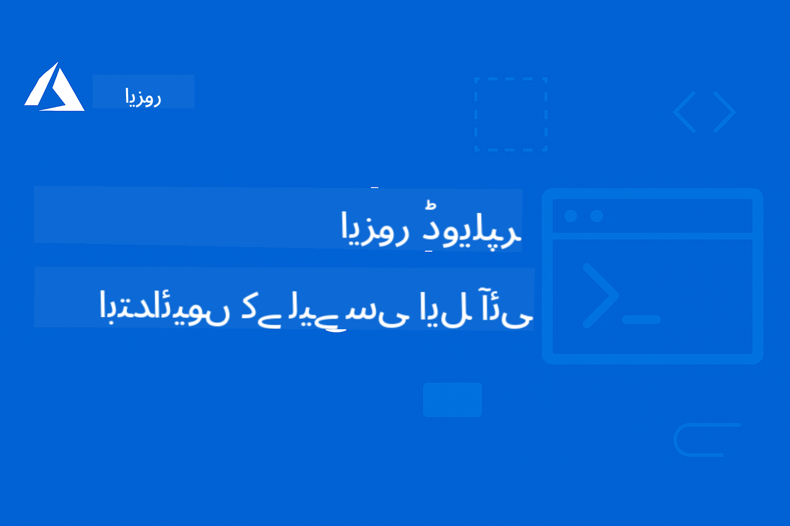

<!--
CO_OP_TRANSLATOR_METADATA:
{
  "original_hash": "c0984265b7a9357388f864c19606c80d",
  "translation_date": "2025-09-11T09:48:23+00:00",
  "source_file": "README.md",
  "language_code": "ur"
}
-->
# AZD ابتدائیوں کے لیے

 

[](https://GitHub.com/microsoft/azd-for-beginners/watchers/?WT.mc_id=academic-105485-koreyst)  
[](https://GitHub.com/microsoft/azd-for-beginners/network/?WT.mc_id=academic-105485-koreyst)  
[](https://GitHub.com/microsoft/azd-for-beginners/stargazers/?WT.mc_id=academic-105485-koreyst)  

[](https://discord.gg/microsoft-azure)  

[](https://discord.gg/kzRShWzttr)  

ان وسائل کو استعمال کرنے کے لیے درج ذیل اقدامات کریں:  
1. **ریپوزٹری کو فورک کریں**: کلک کریں [](https://GitHub.com/microsoft/azd-for-beginners/fork)  
2. **ریپوزٹری کو کلون کریں**: `git clone https://github.com/microsoft/azd-for-beginners.git`  
3. [**Azure Discord کمیونٹیز میں شامل ہوں اور ماہرین اور دیگر ڈویلپرز سے ملاقات کریں**](https://discord.com/invite/ByRwuEEgH4)  

### 🌐 کثیر لسانی معاونت

#### GitHub ایکشن کے ذریعے معاونت (خودکار اور ہمیشہ تازہ ترین)

[فرانسیسی](../fr/README.md) | [ہسپانوی](../es/README.md) | [جرمن](../de/README.md) | [روسی](../ru/README.md) | [عربی](../ar/README.md) | [فارسی](../fa/README.md) | [اردو](./README.md) | [چینی (سادہ)](../zh/README.md) | [چینی (روایتی، مکاؤ)](../mo/README.md) | [چینی (روایتی، ہانگ کانگ)](../hk/README.md) | [چینی (روایتی، تائیوان)](../tw/README.md) | [جاپانی](../ja/README.md) | [کوریائی](../ko/README.md) | [ہندی](../hi/README.md) | [بنگالی](../bn/README.md) | [مراٹھی](../mr/README.md) | [نیپالی](../ne/README.md) | [پنجابی (گرمکھی)](../pa/README.md) | [پرتگالی (پرتگال)](../pt/README.md) | [پرتگالی (برازیل)](../br/README.md) | [اطالوی](../it/README.md) | [پولش](../pl/README.md) | [ترکی](../tr/README.md) | [یونانی](../el/README.md) | [تھائی](../th/README.md) | [سویڈش](../sv/README.md) | [ڈینش](../da/README.md) | [نارویجن](../no/README.md) | [فنش](../fi/README.md) | [ڈچ](../nl/README.md) | [عبرانی](../he/README.md) | [ویتنامی](../vi/README.md) | [انڈونیشیائی](../id/README.md) | [ملائی](../ms/README.md) | [ٹیگالوگ (فلپائنی)](../tl/README.md) | [سواحلی](../sw/README.md) | [ہنگریائی](../hu/README.md) | [چیک](../cs/README.md) | [سلوواک](../sk/README.md) | [رومانیائی](../ro/README.md) | [بلغاریائی](../bg/README.md) | [سربیائی (سیریلیک)](../sr/README.md) | [کروشین](../hr/README.md) | [سلووینیائی](../sl/README.md) | [یوکرینیائی](../uk/README.md) | [برمی (میانمار)](../my/README.md)  

**اگر آپ اضافی زبانوں میں ترجمہ چاہتے ہیں تو معاون زبانوں کی فہرست [یہاں](https://github.com/Azure/co-op-translator/blob/main/getting_started/supported-languages.md) دستیاب ہے۔**

## تعارف

Azure Developer CLI (azd) کے لیے جامع گائیڈ میں خوش آمدید۔ یہ ریپوزٹری طلباء سے لے کر پیشہ ور ڈویلپرز تک ہر سطح کے ڈویلپرز کو Azure Developer CLI سیکھنے اور کلاؤڈ ڈپلائمنٹ کو مؤثر طریقے سے انجام دینے میں مدد دینے کے لیے ڈیزائن کی گئی ہے۔ یہ منظم تعلیمی وسیلہ Azure کلاؤڈ ڈپلائمنٹ، عام مسائل کے حل، اور کامیاب AZD ٹیمپلیٹ ڈپلائمنٹ کے لیے بہترین طریقوں پر عملی تجربہ فراہم کرتا ہے۔

## سیکھنے کے مقاصد

اس ریپوزٹری پر کام کرتے ہوئے، آپ:
- Azure Developer CLI کے بنیادی اصولوں اور تصورات میں مہارت حاصل کریں گے  
- انفراسٹرکچر ایز کوڈ کا استعمال کرتے ہوئے Azure وسائل کو تعینات اور فراہم کرنا سیکھیں گے  
- عام AZD ڈپلائمنٹ مسائل کے لیے مسئلہ حل کرنے کی مہارتیں تیار کریں گے  
- پری ڈپلائمنٹ ویلیڈیشن اور صلاحیت کی منصوبہ بندی کو سمجھیں گے  
- سیکیورٹی کے بہترین طریقے اور لاگت کی اصلاح کی حکمت عملیوں کو نافذ کریں گے  
- Azure پر پروڈکشن کے لیے تیار ایپلیکیشنز کو تعینات کرنے میں اعتماد پیدا کریں گے  

## سیکھنے کے نتائج

اس کورس کو مکمل کرنے کے بعد، آپ قابل ہوں گے:
- Azure Developer CLI کو کامیابی سے انسٹال، ترتیب، اور استعمال کریں  
- AZD ٹیمپلیٹس کا استعمال کرتے ہوئے ایپلیکیشنز بنائیں اور تعینات کریں  
- تصدیق، انفراسٹرکچر، اور ڈپلائمنٹ کے مسائل کو حل کریں  
- پری ڈپلائمنٹ چیکس انجام دیں، بشمول صلاحیت کی منصوبہ بندی اور SKU کا انتخاب  
- مانیٹرنگ، سیکیورٹی، اور لاگت کے انتظام کے بہترین طریقے نافذ کریں  
- AZD ورک فلو کو CI/CD پائپ لائنز میں ضم کریں  

## مواد کی فہرست

- [Azure Developer CLI کیا ہے؟](../..)  
- [جلدی شروع کریں](../..)  
- [دستاویزات](../..)  
- [مثالیں اور ٹیمپلیٹس](../..)  
- [وسائل](../..)  
- [شراکت](../..)  

## Azure Developer CLI کیا ہے؟

Azure Developer CLI (azd) ایک ڈویلپر مرکوز کمانڈ لائن انٹرفیس ہے جو Azure پر ایپلیکیشنز بنانے اور تعینات کرنے کے عمل کو تیز کرتا ہے۔ یہ فراہم کرتا ہے:

- **ٹیمپلیٹ پر مبنی ڈپلائمنٹ** - عام ایپلیکیشن پیٹرنز کے لیے پہلے سے تیار کردہ ٹیمپلیٹس کا استعمال کریں  
- **انفراسٹرکچر ایز کوڈ** - Bicep یا Terraform کا استعمال کرتے ہوئے Azure وسائل کا انتظام کریں  
- **مربوط ورک فلو** - ایپلیکیشنز کو فراہم کرنے، تعینات کرنے، اور مانیٹر کرنے کے لیے بغیر کسی رکاوٹ کے کام کریں  
- **ڈویلپر دوستانہ** - ڈویلپر کی پیداواریت اور تجربے کے لیے بہتر بنایا گیا  

## جلدی شروع کریں

### ضروریات
- Azure سبسکرپشن  
- Azure CLI انسٹال شدہ  
- Git (ٹیمپلیٹس کلون کرنے کے لیے)  

### انسٹالیشن
```bash
# Windows (PowerShell)
powershell -ex AllSigned -c "Invoke-RestMethod 'https://aka.ms/install-azd.ps1' | Invoke-Expression"

# macOS/Linux
curl -fsSL https://aka.ms/install-azd.sh | bash
```  

### آپ کی پہلی ڈپلائمنٹ
```bash
# Initialize a new project
azd init --template todo-nodejs-mongo

# Provision Azure resources and deploy
azd up
```  

## دستاویزات

### شروعات
- [**AZD بنیادی باتیں**](docs/getting-started/azd-basics.md) - بنیادی تصورات اور اصطلاحات  
- [**انسٹالیشن اور سیٹ اپ**](docs/getting-started/installation.md) - پلیٹ فارم کے لحاظ سے انسٹالیشن گائیڈز  
- [**ترتیب**](docs/getting-started/configuration.md) - ماحول کی ترتیب اور تصدیق  
- [**آپ کا پہلا پروجیکٹ**](docs/getting-started/first-project.md) - مرحلہ وار ٹیوٹوریل  

### ڈپلائمنٹ اور پروویژننگ
- [**ڈپلائمنٹ گائیڈ**](docs/deployment/deployment-guide.md) - مکمل ڈپلائمنٹ ورک فلو  
- [**وسائل کی پروویژننگ**](docs/deployment/provisioning.md) - Azure وسائل کا انتظام  

### پری ڈپلائمنٹ چیکس
- [**صلاحیت کی منصوبہ بندی**](docs/pre-deployment/capacity-planning.md) - Azure وسائل کی صلاحیت کی توثیق  
- [**SKU کا انتخاب**](docs/pre-deployment/sku-selection.md) - صحیح Azure SKUs کا انتخاب  
- [**پری فلائٹ چیکس**](docs/pre-deployment/preflight-checks.md) - خودکار توثیقی اسکرپٹس  

### مسئلہ حل کرنا
- [**عام مسائل**](docs/troubleshooting/common-issues.md) - اکثر پیش آنے والے مسائل اور ان کے حل  
- [**ڈیبگنگ گائیڈ**](docs/troubleshooting/debugging.md) - مرحلہ وار ڈیبگنگ حکمت عملی  

## مثالیں اور ٹیمپلیٹس
- [**مثالیں**](examples/README.md) - عملی مثالیں، ٹیمپلیٹس، اور حقیقی دنیا کے منظرنامے جو آپ کو Azure Developer CLI کو عملی طور پر سیکھنے میں مدد دیتے ہیں۔ ہر مثال مکمل کام کرنے والا کوڈ، انفراسٹرکچر ٹیمپلیٹس، اور مختلف ایپلیکیشن آرکیٹیکچرز اور ڈپلائمنٹ پیٹرنز کے لیے تفصیلی ہدایات فراہم کرتی ہے۔  

### عملی ورکشاپ
- [**AZD ابتدائیوں کے لیے**](workshop/README.md) - یہ ورکشاپ AI ایجنٹس AZD ٹیمپلیٹ کے ساتھ شروعات پر توجہ مرکوز کرے گی اور AZD کا استعمال کرتے ہوئے Azure AI خدمات کی تعیناتی کے لیے عملی بہترین طریقے فراہم کرے گی۔  

## وسائل

### فوری حوالہ جات
- [**کمانڈ چیٹ شیٹ**](resources/cheat-sheet.md) - اہم azd کمانڈز  
- [**اصطلاحات**](resources/glossary.md) - Azure اور azd کی اصطلاحات  
- [**عمومی سوالات**](resources/faq.md) - اکثر پوچھے جانے والے سوالات  
- [**مطالعہ گائیڈ**](resources/study-guide.md) - جامع تعلیمی مقاصد اور عملی مشقیں  

### بیرونی وسائل
- [Azure Developer CLI دستاویزات](https://learn.microsoft.com/en-us/azure/developer/azure-developer-cli/)  
- [Azure آرکیٹیکچر سینٹر](https://learn.microsoft.com/en-us/azure/architecture/)  
- [Azure قیمت کیلکولیٹر](https://azure.microsoft.com/pricing/calculator/)  
- [Azure اسٹیٹس](https://status.azure.com/)  

## تعلیمی راستہ

### طلباء اور ابتدائیوں کے لیے
1. [AZD بنیادی باتیں](docs/getting-started/azd-basics.md) سے شروع کریں  
2. [انسٹالیشن گائیڈ](docs/getting-started/installation.md) پر عمل کریں  
3. [آپ کا پہلا پروجیکٹ](docs/getting-started/first-project.md) مکمل کریں  
4. [سادہ ویب ایپ مثال](../../examples/simple-web-app) کے ساتھ مشق کریں  

### ڈویلپرز کے لیے
1. [ترتیب گائیڈ](docs/getting-started/configuration.md) کا جائزہ لیں  
2. [ڈپلائمنٹ گائیڈ](docs/deployment/deployment-guide.md) کا مطالعہ کریں  
3. [ڈیٹا بیس ایپ مثال](../../examples/database-app) پر کام کریں  
4. [کنٹینر ایپ مثال](../../examples/container-app) کو دریافت کریں  

### ڈیواپس انجینئرز کے لیے
1. [وسائل کی پروویژننگ](docs/deployment/provisioning.md) میں مہارت حاصل کریں  
2. [پری فلائٹ چیکس](docs/pre-deployment/preflight-checks.md) کو نافذ کریں  
3. [صلاحیت کی منصوبہ بندی](docs/pre-deployment/capacity-planning.md) کی مشق کریں  
4. [مائیکرو سروسز کی مثال](../../examples/microservices) کو آگے بڑھائیں  

## شراکت

ہم شراکت کا خیرمقدم کرتے ہیں! براہ کرم ہمارے [شراکت گائیڈ](CONTRIBUTING.md) کو پڑھیں تاکہ معلوم ہو:
- مسائل اور فیچر کی درخواستیں کیسے جمع کرائیں  
- کوڈ شراکت کے رہنما اصول  
- دستاویزات میں بہتری  
- کمیونٹی کے معیارات  

## معاونت

- **مسائل**: [بگز رپورٹ کریں اور فیچرز کی درخواست کریں](https://github.com/microsoft/azd-for-beginners/issues)  
- **بحث و مباحثہ**: [Microsoft Azure Discord کمیونٹی Q&A اور مباحثے](https://discord.gg/microsoft-azure)  
- **ای میل**: نجی استفسارات کے لیے  
- **Microsoft Learn**: [Azure Developer CLI کی سرکاری دستاویزات](https://learn.microsoft.com/en-us/azure/developer/azure-developer-cli/)  

## لائسنس

یہ پروجیکٹ MIT لائسنس کے تحت لائسنس یافتہ ہے - تفصیلات کے لیے [LICENSE](../../LICENSE) فائل دیکھیں۔  

## 🎒 دیگر کورسز

ہماری ٹیم دیگر کورسز بھی پیش کرتی ہے! دیکھیں:  

- [**نیا** ماڈل کانٹیکسٹ پروٹوکول (MCP) ابتدائیوں کے لیے](https://github.com/microsoft/mcp-for-beginners?WT.mc_id=academic-105485-koreyst)  
- [AI ایجنٹس ابتدائیوں کے لیے](https://github.com/microsoft/ai-agents-for-beginners?WT.mc_id=academic-105485-koreyst)  
- [جنریٹو AI ابتدائیوں کے لیے .NET کا استعمال کرتے ہوئے](https://github.com/microsoft/Generative-AI-for-beginners-dotnet?WT.mc_id=academic-105485-koreyst)  
- [جنریٹو AI ابتدائیوں کے لیے](https://github.com/microsoft/generative-ai-for-beginners?WT.mc_id=academic-105485-koreyst)  
- [جنریٹو AI ابتدائیوں کے لیے جاوا کا استعمال کرتے ہوئے](https://github.com/microsoft/generative-ai-for-beginners-java?WT.mc_id=academic-105485-koreyst)  
- [مشین لرننگ ابتدائیوں کے لیے](https://aka.ms/ml-beginners?WT.mc_id=academic-105485-koreyst)  
- [ڈیٹا سائنس ابتدائیوں کے لیے](https://aka.ms/datascience-beginners?WT.mc_id=academic-105485-koreyst)  
- [AI ابتدائیوں کے لیے](https://aka.ms/ai-beginners?WT.mc_id=academic-105485-koreyst)  
- [سائبر سیکیورٹی ابتدائیوں کے لیے](https://github.com/microsoft/Security-101??WT.mc_id=academic-96948-sayoung)  
- [ویب ڈویلپمنٹ ابتدائیوں کے لیے](https://aka.ms/webdev-beginners?WT.mc_id=academic-105485-koreyst)  
- [آئی او ٹی کے ابتدائی سیکھنے والے](https://aka.ms/iot-beginners?WT.mc_id=academic-105485-koreyst)
- [ایکس آر ڈیولپمنٹ کے ابتدائی سیکھنے والے](https://github.com/microsoft/xr-development-for-beginners?WT.mc_id=academic-105485-koreyst)
- [گیٹ ہب کوپائلٹ کے ذریعے اے آئی پیئرڈ پروگرامنگ میں مہارت حاصل کریں](https://aka.ms/GitHubCopilotAI?WT.mc_id=academic-105485-koreyst)
- [گیٹ ہب کوپائلٹ کے ذریعے سی شارپ/ڈاٹ نیٹ ڈیولپرز کے لیے مہارت حاصل کریں](https://github.com/microsoft/mastering-github-copilot-for-dotnet-csharp-developers?WT.mc_id=academic-105485-koreyst)
- [اپنی کوپائلٹ ایڈونچر کا انتخاب کریں](https://github.com/microsoft/CopilotAdventures?WT.mc_id=academic-105485-koreyst)

---

**نیویگیشن**
- **اگلا سبق**: [AZD کی بنیادی باتیں](docs/getting-started/azd-basics.md)

---

**ڈسکلیمر**:  
یہ دستاویز AI ترجمہ سروس [Co-op Translator](https://github.com/Azure/co-op-translator) کا استعمال کرتے ہوئے ترجمہ کی گئی ہے۔ ہم درستگی کے لیے کوشش کرتے ہیں، لیکن براہ کرم آگاہ رہیں کہ خودکار ترجمے میں غلطیاں یا غیر درستیاں ہو سکتی ہیں۔ اصل دستاویز کو اس کی اصل زبان میں مستند ذریعہ سمجھا جانا چاہیے۔ اہم معلومات کے لیے، پیشہ ور انسانی ترجمہ کی سفارش کی جاتی ہے۔ ہم اس ترجمے کے استعمال سے پیدا ہونے والی کسی بھی غلط فہمی یا غلط تشریح کے ذمہ دار نہیں ہیں۔