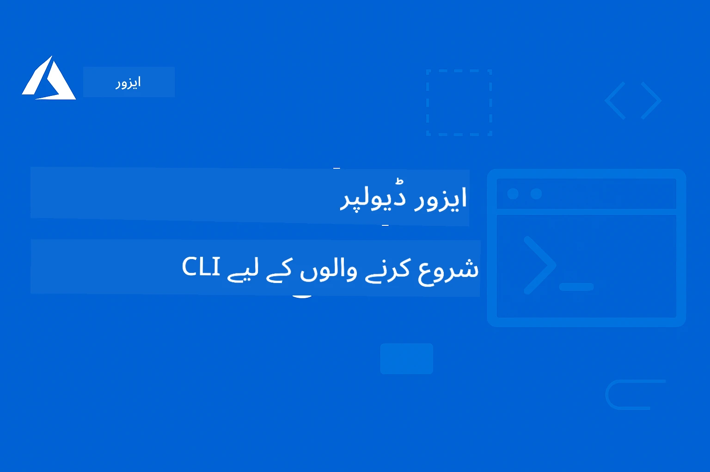

# AZD برائے ابتدائی: ایک منظم تعلیمی سفر

 

[](https://GitHub.com/microsoft/azd-for-beginners/watchers/)
[](https://GitHub.com/microsoft/azd-for-beginners/network/)
[](https://GitHub.com/microsoft/azd-for-beginners/stargazers/)

[](https://discord.com/invite/nkVh3dp)
[](https://discord.gg/nTYy5BXMWG)

---

### خودکار ترجمے (ہمیشہ تازہ ترین)

<!-- CO-OP TRANSLATOR LANGUAGES TABLE START -->
[Arabic](../ar/README.md) | [Bengali](../bn/README.md) | [Bulgarian](../bg/README.md) | [Burmese (Myanmar)](../my/README.md) | [Chinese (Simplified)](../zh-CN/README.md) | [Chinese (Traditional, Hong Kong)](../zh-HK/README.md) | [Chinese (Traditional, Macau)](../zh-MO/README.md) | [Chinese (Traditional, Taiwan)](../zh-TW/README.md) | [Croatian](../hr/README.md) | [Czech](../cs/README.md) | [Danish](../da/README.md) | [Dutch](../nl/README.md) | [Estonian](../et/README.md) | [Finnish](../fi/README.md) | [French](../fr/README.md) | [German](../de/README.md) | [Greek](../el/README.md) | [Hebrew](../he/README.md) | [Hindi](../hi/README.md) | [Hungarian](../hu/README.md) | [Indonesian](../id/README.md) | [Italian](../it/README.md) | [Japanese](../ja/README.md) | [Kannada](../kn/README.md) | [Korean](../ko/README.md) | [Lithuanian](../lt/README.md) | [Malay](../ms/README.md) | [Malayalam](../ml/README.md) | [Marathi](../mr/README.md) | [Nepali](../ne/README.md) | [Nigerian Pidgin](../pcm/README.md) | [Norwegian](../no/README.md) | [Persian (Farsi)](../fa/README.md) | [Polish](../pl/README.md) | [Portuguese (Brazil)](../pt-BR/README.md) | [Portuguese (Portugal)](../pt-PT/README.md) | [Punjabi (Gurmukhi)](../pa/README.md) | [Romanian](../ro/README.md) | [Russian](../ru/README.md) | [Serbian (Cyrillic)](../sr/README.md) | [Slovak](../sk/README.md) | [Slovenian](../sl/README.md) | [Spanish](../es/README.md) | [Swahili](../sw/README.md) | [Swedish](../sv/README.md) | [Tagalog (Filipino)](../tl/README.md) | [Tamil](../ta/README.md) | [Telugu](../te/README.md) | [Thai](../th/README.md) | [Turkish](../tr/README.md) | [Ukrainian](../uk/README.md) | [Urdu](./README.md) | [Vietnamese](../vi/README.md)

> **لوکل کلون کرنا پسند کریں؟**
>
> یہ مخزن 50+ زبانوں کے ترجمے شامل کرتا ہے جو ڈاؤن لوڈ کی سائز کو نمایاں طور پر بڑھاتے ہیں۔ ترجمے کے بغیر کلون کرنے کے لیے sparse checkout استعمال کریں:
>
> **Bash / macOS / Linux:**
> ```bash
> git clone --filter=blob:none --sparse https://github.com/microsoft/AZD-for-beginners.git
> cd AZD-for-beginners
> git sparse-checkout set --no-cone '/*' '!translations' '!translated_images'
> ```
>
> **CMD (Windows):**
> ```cmd
> git clone --filter=blob:none --sparse https://github.com/microsoft/AZD-for-beginners.git
> cd AZD-for-beginners
> git sparse-checkout set --no-cone "/*" "!translations" "!translated_images"
> ```
>
> یہ آپ کو تیز تر ڈاؤن لوڈ کے ساتھ کورس مکمل کرنے کے لئے ضروری سب کچھ فراہم کرتا ہے۔
<!-- CO-OP TRANSLATOR LANGUAGES TABLE END -->

## 🆕 آج کی azd میں کیا نیا ہے

Azure Developer CLI نے روایتی ویب ایپس اور APIs سے بڑھ کر ترقی کی ہے۔ آج، azd وہ واحد ٹول ہے جو **کسی بھی** ایپلیکیشن کو Azure پر تعینات کرتا ہے — بشمول AI سے چلنے والی ایپلیکیشنز اور ذہین ایجنٹس۔

آپ کے لیے اس کا مطلب ہے:

- **AI ایجنٹس اب پہلی کلاس کے azd ورک لوڈز ہیں۔** آپ AI ایجنٹ پروجیکٹس کو اسی `azd init` → `azd up` ورک فلو کے ذریعے شروع، تعینات، اور منظم کر سکتے ہیں جو آپ پہلے سے جانتے ہیں۔
- **Microsoft Foundry انضمام** ماڈل تعیناتی، ایجنٹ ہوسٹنگ، اور AI سروس کی تشکیل کو براہِ راست azd ٹیمپلیٹ ایکو سسٹم میں لاتا ہے۔
- **مرکزی ورک فلو تبدیل نہیں ہوا۔** چاہے آپ todo ایپ، مائیکرو سروس، یا ملٹی ایجنٹ AI حل تعینات کر رہے ہوں، کمانڈز ایک ہی ہیں۔

اگر آپ نے پہلے azd استعمال کیا ہے، تو AI کی حمایت ایک فطری توسیع ہے — کوئی الگ ٹول یا جدید راستہ نہیں۔ اگر آپ نیا آغاز کر رہے ہیں، تو آپ ایک ایسا ورک فلو سیکھیں گے جو ہر چیز کے لیے کام کرتا ہے۔

---

## 🚀 Azure Developer CLI (azd) کیا ہے؟

**Azure Developer CLI (azd)** ایک ڈیولپر دوستانہ کمانڈ لائن ٹول ہے جو Azure پر ایپلیکیشنز کو آسانی سے تعینات کرنے کے لیے بنایا گیا ہے۔ درجنوں Azure وسائل کو دستی طور پر بنانے اور جوڑنے کی بجائے، آپ پورے ایپلیکیشنز کو صرف ایک کمانڈ سے تعینات کر سکتے ہیں۔

### `azd up` کا جادو

```bash
# یہ واحد کمانڈ سب کچھ کر دیتی ہے:
# ✅ تمام Azure وسائل بناتا ہے
# ✅ نیٹ ورکنگ اور سیکیورٹی کو ترتیب دیتا ہے
# ✅ آپ کے ایپلیکیشن کے کوڈ کو تیار کرتا ہے
# ✅ Azure پر تعینات کرتا ہے
# ✅ آپ کو ایک کام کرنے والا URL دیتا ہے
azd up
```

**بس یہی ہے!** نہ Azure پورٹل پر کلک کرنا، نہ پیچیدہ ARM ٹیمپلیٹس سیکھنے کی ضرورت، نہ دستی ترتیب - بس Azure پر کام کرنے والی ایپلیکیشنز۔

---

## ❓ Azure Developer CLI اور Azure CLI میں کیا فرق ہے؟

یہ نئے آنے والوں کا سب سے عام سوال ہے۔ آسان جواب یہ ہے:

| خصوصیت | **Azure CLI (`az`)** | **Azure Developer CLI (`azd`)** |
|---------|---------------------|--------------------------------|
| **مقصد** | انفرادی Azure وسائل کا انتظام | مکمل ایپلیکیشنز کی تعیناتی |
| **توجہ** | انفراسٹرکچر پر مرکوز | ایپلیکیشن پر مرکوز |
| **مثال** | `az webapp create --name myapp...` | `azd up` |
| **سیکھنے کا منحنی خط** | Azure خدمات جاننا ضروری ہے | اپنی ایپ جاننا کافی ہے |
| **سب سے بہتر** | DevOps، انفراسٹرکچر | ڈیولپرز، پروٹو ٹائپنگ |

### آسان مثال

- **Azure CLI** ایسے ہے جیسے آپ کے پاس گھر بنانے کے تمام اوزار ہوں - ہتھوڑے، آری، کیل۔ آپ کچھ بھی بنا سکتے ہیں، لیکن آپ کو تعمیر کا علم ہونا چاہیے۔
- **Azure Developer CLI** ایسے ہے جیسے آپ ایک ٹھیکیدار کو ہائر کرتے ہیں - آپ بیان کرتے ہیں کہ آپ کیا چاہتے ہیں، اور وہ تعمیر کا کام سنبھالتا ہے۔

### کب کون سا استعمال کریں

| منظر نامہ | یہ استعمال کریں |
|----------|----------|
| "میں اپنی ویب ایپ کو جلدی تعینات کرنا چاہتا ہوں" | `azd up` |
| "مجھے صرف اسٹوریج اکاؤنٹ بنانا ہے" | `az storage account create` |
| "میں ایک مکمل AI ایپلیکیشن بنا رہا ہوں" | `azd init --template azure-search-openai-demo` |
| "مجھے ایک مخصوص Azure وسائل کی جانچ کرنی ہے" | `az resource show` |
| "میں منٹوں میں پروڈکشن کے لیے تعیناتی چاہتا ہوں" | `azd up --environment production` |

### یہ ایک ساتھ کام کرتے ہیں!

azd اندرونِ خانہ Azure CLI استعمال کرتا ہے۔ آپ دونوں استعمال کر سکتے ہیں:
```bash
# اپنی ایپ کو AZD کے ساتھ تعینات کریں
azd up

# پھر Azure CLI کے ساتھ مخصوص وسائل کو باریک بینی سے ایڈجسٹ کریں
az webapp config set --name myapp --always-on true
```

---

## 🌟 Awesome AZD میں ٹیمپلیٹس تلاش کریں

خالی جگہ سے شروع نہ کریں! **Awesome AZD** کمیونٹی کی تیار کردہ تعیناتی کے قابل ٹیمپلیٹس کا مجموعہ ہے:

| ذریعہ | تفصیل |
|----------|-------------|
| 🔗 [**Awesome AZD Gallery**](https://azure.github.io/awesome-azd/) | 200+ ٹیمپلیٹس کو ایک کلک میں تعینات کریں |
| 🔗 [**ایک ٹیمپلیٹ جمع کروائیں**](https://github.com/Azure/awesome-azd/issues) | اپنی ٹیمپلیٹ کمیونٹی کے ساتھ شئیر کریں |
| 🔗 [**GitHub مخزن**](https://github.com/Azure/awesome-azd) | اسٹار کریں اور کوڈ دریافت کریں |

### Awesome AZD سے مقبول AI ٹیمپلیٹس

```bash
# RAG چیٹ Microsoft Foundry کے ماڈلز اور مصنوعی ذہانت کی تلاش
azd init --template azure-search-openai-demo

# فوری مصنوعی ذہانت چیٹ ایپلیکیشن
azd init --template openai-chat-app-quickstart

# Foundry ایجنٹس کے ساتھ مصنوعی ذہانت کے ایجنٹس
azd init --template get-started-with-ai-agents
```

---

## 🎯 تین مراحل میں شروع کریں

### مرحلہ 1: AZD انسٹال کریں (2 منٹ)

**Windows:**
```powershell
winget install microsoft.azd
```

**macOS:**
```bash
brew tap azure/azd && brew install azd
```

**Linux:**
```bash
curl -fsSL https://aka.ms/install-azd.sh | bash
```

### مرحلہ 2: Azure میں لاگ ان کریں

```bash
azd auth login
```

### مرحلہ 3: اپنی پہلی ایپ تعینات کریں

```bash
# ٹیمپلیٹ سے شروعات کریں
azd init --template todo-nodejs-mongo

# ایزور پر تعینات کریں (سب کچھ بنا دیتا ہے!)
azd up
```

**🎉 بس ہو گیا!** آپ کی ایپ اب Azure پر فعال ہے۔

### صفائی کریں (یاد رکھیں!)

```bash
# Remove all resources when done experimenting
azd down --force --purge
```

---

## 📚 اس کورس کو کیسے استعمال کریں

یہ کورس **ترقی پسند سیکھنے** کے لیے ڈیزائن کیا گیا ہے — جہاں آپ آرام دہ ہوں وہاں سے شروع کریں اور آگے بڑھیں:

| آپ کا تجربہ | یہاں سے شروع کریں |
|-----------------|------------|
| **Azure میں بالکل نیا** | [باب 1: بنیاد](#-chapter-1-foundation--quick-start) |
| **Azure جانتے ہیں لیکن AZD نیا ہے** | [باب 1: بنیاد](#-chapter-1-foundation--quick-start) |
| **AI ایپس تعینات کرنا چاہتے ہیں** | [باب 2: AI-اولین ترقی](#-chapter-2-ai-first-development-recommended-for-ai-developers) |
| **عملی مشق کرنا چاہتے ہیں** | [🎓 انٹرایکٹو ورکشاپ](workshop/README.md) - 3-4 گھنٹے کا گائیڈڈ لیب |
| **پروڈکشن کے نمونے چاہیے** | [باب 8: پروڈکشن اور انٹرپرائز](#-chapter-8-production--enterprise-patterns) |

### فوری سیٹ اپ

1. **اس مخزن کو فورک کریں**: [](https://GitHub.com/microsoft/azd-for-beginners/fork)
2. **کلون کریں**: `git clone https://github.com/YOUR-USERNAME/azd-for-beginners.git`
3. **مدد حاصل کریں**: [Azure Discord کمیونٹی](https://discord.com/invite/ByRwuEEgH4)

> **لوکل کلون کرنا پسند کریں؟**

> یہ مخزن 50+ زبانوں کے ترجمے شامل کرتا ہے جو ڈاؤن لوڈ کی سائز کو نمایاں طور پر بڑھاتے ہیں۔ ترجمے کے بغیر کلون کرنے کے لیے sparse checkout استعمال کریں:
> ```bash
> git clone --filter=blob:none --sparse https://github.com/microsoft/AZD-for-beginners.git
> cd AZD-for-beginners
> git sparse-checkout set --no-cone '/*' '!translations' '!translated_images'
> ```
> یہ آپ کو تیز تر ڈاؤن لوڈ کے ساتھ کورس مکمل کرنے کے لئے ضروری سب کچھ فراہم کرتا ہے۔

## کورس کا جائزہ

منظم ابواب کے ذریعے Azure Developer CLI (azd) میں مہارت حاصل کریں جو ترقی پسند سیکھنے کے لیے تیار کیے گئے ہیں۔ **Microsoft Foundry انضمام کے ساتھ AI ایپلیکیشنز کی تعیناتی پر خصوصی توجہ۔**

### جدید ڈیولپرز کے لیے یہ کورس کیوں ضروری ہے

Microsoft Foundry Discord کمیونٹی کی معلومات کی بنیاد پر، **45% ڈیولپرز AI ورک لوڈز کے لیے AZD استعمال کرنا چاہتے ہیں** لیکن درج ذیل چیلنجز کا سامنا ہے:
- پیچیدہ ملٹی سروس AI آرکیٹیکچرز
- پروڈکشن AI کی تعیناتی کے بہترین عملی طریقے  
- Azure AI سروس کے انضمام اور ترتیب
- AI ورک لوڈز کے لیے لاگت کی بہتر کاری
- AI مخصوص تعیناتی کے مسائل کا حل

### سیکھنے کے مقاصد

اس منظم کورس کو مکمل کر کے آپ:
- **AZD کے بنیادی اصول سیکھیں گے**: اہم تصورات، تنصیب، اور ترتیب
- **AI ایپلیکیشنز تعینات کریں گے**: Microsoft Foundry سروسز کے ساتھ AZD استعمال کریں
- **انفراسٹرکچر از کوڈ نافذ کریں گے**: Bicep ٹیمپلیٹس کے ساتھ Azure وسائل کا انتظام
- **تعییناتی مسائل کا حل تلاش کریں گے**: عام مسائل حل کریں اور ڈیبگ کریں
- **پروڈکشن کے لیے بہتر کاری کریں گے**: سیکیورٹی، اسکیلنگ، مانیٹرنگ، اور لاگت کا انتظام
- **ملٹی ایجنٹ حل تیار کریں گے**: پیچیدہ AI آرکیٹیکچرز تعینات کریں

## 🗺️ کورس کا نقشہ: باب وار جلدی نیویگیشن

ہر باب کے ساتھ مخصوص README دستیاب ہے جس میں سیکھنے کے مقاصد، جلد آغاز، اور مشقیں شامل ہیں:

| باب | موضوع | اسباق | دورانیہ | پیچیدگی |
|---------|-------|---------|----------|------------|
| **[باب 1: بنیاد](docs/chapter-01-foundation/README.md)** | شروعات | [AZD بنیادیات](docs/chapter-01-foundation/azd-basics.md) &#124; [تنصیب](docs/chapter-01-foundation/installation.md) &#124; [پہلا پروجیکٹ](docs/chapter-01-foundation/first-project.md) | 30-45 منٹ | ⭐ |
| **[باب 2: AI کی ترقی](docs/chapter-02-ai-development/README.md)** | AI-پہلے ایپس | [Foundry انضمام](docs/chapter-02-ai-development/microsoft-foundry-integration.md) &#124; [AI ایجنٹس](docs/chapter-02-ai-development/agents.md) &#124; [ماڈل کی تعیناتی](docs/chapter-02-ai-development/ai-model-deployment.md) &#124; [ورکشاپ](docs/chapter-02-ai-development/ai-workshop-lab.md) | 1-2 گھنٹے | ⭐⭐ |
| **[باب 3: ترتیب](docs/chapter-03-configuration/README.md)** | توثیق اور سیکیورٹی | [ترتیب](docs/chapter-03-configuration/configuration.md) &#124; [توثیق اور سیکیورٹی](docs/chapter-03-configuration/authsecurity.md) | 45-60 منٹ | ⭐⭐ |
| **[باب 4: انفراسٹرکچر](docs/chapter-04-infrastructure/README.md)** | IaC اور تعیناتی | [تعیناتی گائیڈ](docs/chapter-04-infrastructure/deployment-guide.md) &#124; [فراہم کاری](docs/chapter-04-infrastructure/provisioning.md) | 1-1.5 گھنٹے | ⭐⭐⭐ |
| **[باب 5: ملٹی ایجنٹ](docs/chapter-05-multi-agent/README.md)** | AI ایجنٹ کے حل | [ریٹیل منظرنامہ](examples/retail-scenario.md) &#124; [مطابقت کے نمونے](docs/chapter-06-pre-deployment/coordination-patterns.md) | 2-3 گھنٹے | ⭐⭐⭐⭐ |
| **[باب 6: پیش از تعیناتی](docs/chapter-06-pre-deployment/README.md)** | منصوبہ بندی اور توثیق | [پری فلائٹ چیکس](docs/chapter-06-pre-deployment/preflight-checks.md) &#124; [گنجائش کی منصوبہ بندی](docs/chapter-06-pre-deployment/capacity-planning.md) &#124; [SKU کا انتخاب](docs/chapter-06-pre-deployment/sku-selection.md) &#124; [ایپ ان سائٹس](docs/chapter-06-pre-deployment/application-insights.md) | 1 گھنٹہ | ⭐⭐ |
| **[باب 7: مسائل کا حل](docs/chapter-07-troubleshooting/README.md)** | ڈیبگ اور فکس | [عام مسائل](docs/chapter-07-troubleshooting/common-issues.md) &#124; [ڈیبگنگ](docs/chapter-07-troubleshooting/debugging.md) &#124; [AI مسائل](docs/chapter-07-troubleshooting/ai-troubleshooting.md) | 1-1.5 گھنٹے | ⭐⭐ |
| **[باب 8: پیداواری مرحلہ](docs/chapter-08-production/README.md)** | انٹرپرائز کے نمونے | [پیداواری طریقے](docs/chapter-08-production/production-ai-practices.md) | 2-3 گھنٹے | ⭐⭐⭐⭐ |
| **[🎓 ورکشاپ](workshop/README.md)** | عملی لیب | [تعارف](workshop/docs/instructions/0-Introduction.md) &#124; [انتخاب](workshop/docs/instructions/1-Select-AI-Template.md) &#124; [توثیق](workshop/docs/instructions/2-Validate-AI-Template.md) &#124; [تجزیہ](workshop/docs/instructions/3-Deconstruct-AI-Template.md) &#124; [ترتیب](workshop/docs/instructions/4-Configure-AI-Template.md) &#124; [حسب ضرورت](workshop/docs/instructions/5-Customize-AI-Template.md) &#124; [تنظیم ختم کرنا](workshop/docs/instructions/6-Teardown-Infrastructure.md) &#124; [خلاصہ](workshop/docs/instructions/7-Wrap-up.md) | 3-4 گھنٹے | ⭐⭐ |

**کل کورس کی مدت:** تقریباً 10-14 گھنٹے | **ہنر کی ترقی:** مبتدی → پیداواری-تیار

---

## 📚 سیکھنے کے ابواب

*اپنے تجربے کی سطح اور مقاصد کی بنیاد پر اپنا سیکھنے کا راستہ منتخب کریں*

### 🚀 باب 1: بنیاد اور جلد آغاز  
**ضروریات:** Azure سبسکرپشن، بنیادی کمانڈ لائن کی معلومات  
**دورانیہ:** 30-45 منٹ  
**پیچیدگی:** ⭐

#### آپ کیا سیکھیں گے  
- Azure Developer CLI کے بنیادی اصول سمجھنا  
- اپنے پلیٹ فارم پر AZD نصب کرنا  
- پہلی کامیاب تعیناتی

#### سیکھنے کے وسائل  
- **🎯 یہاں شروع کریں**: [Azure Developer CLI کیا ہے؟](#what-is-azure-developer-cli)  
- **📖 نظریہ**: [AZD بنیادی معلومات](docs/chapter-01-foundation/azd-basics.md) - بنیادی تصورات اور اصطلاحات  
- **⚙️ ترتیب**: [انسٹالیشن اور سیٹ اپ](docs/chapter-01-foundation/installation.md) - پلیٹ فارم مخصوص رہنما  
- **🛠️ عملی کام**: [آپ کا پہلا پروجیکٹ](docs/chapter-01-foundation/first-project.md) - مرحلہ وار سبق  
- **📋 فوری حوالہ**: [کمانڈ چیٹ شیٹ](resources/cheat-sheet.md)

#### عملی مشقیں  
```bash
# تیز تنصیب کی جانچ
azd version

# اپنا پہلا ایپلیکیشن تعینات کریں
azd init --template todo-nodejs-mongo
azd up
```
  
**💡 باب کا نتیجہ:** AZD کا استعمال کرتے ہوئے آسان ویب ایپلیکیشن کامیابی سے تعینات کریں

**✅ کامیابی کی تصدیق:**  
```bash
# باب 1 مکمل کرنے کے بعد، آپ کو قادر ہونا چاہیے:
azd version              # انسٹال شدہ ورژن دکھاتا ہے
azd init --template todo-nodejs-mongo  # پروجیکٹ کو شروع کرتا ہے
azd up                  # Azure پر تعینات کرتا ہے
azd show                # چلنے والی ایپ کا URL دکھاتا ہے
# ایپلیکیشن براؤزر میں کھلتی ہے اور کام کرتی ہے
azd down --force --purge  # وسائل کو صاف کرتا ہے
```
  
**📊 وقت کی سرمایہ کاری:** 30-45 منٹ  
**📈 مہارت کی سطح بعد میں:** بنیادی ایپلیکیشنز کو خود مختاری سے تعینات کر سکتا ہے

---

### 🤖 باب 2: AI-پہلے کی ترقی (AI ڈویلپرز کے لیے سفارش شدہ)  
**ضروریات:** باب 1 مکمل  
**دورانیہ:** 1-2 گھنٹے  
**پیچیدگی:** ⭐⭐

#### آپ کیا سیکھیں گے  
- Microsoft Foundry کا AZD کے ساتھ انضمام  
- AI سے چلنے والی ایپلیکیشنز کی تعیناتی  
- AI سروس کی ترتیبوں کو سمجھنا

#### سیکھنے کے وسائل  
- **🎯 یہاں شروع کریں**: [Microsoft Foundry انضمام](docs/chapter-02-ai-development/microsoft-foundry-integration.md)  
- **🤖 AI ایجنٹس:** [AI ایجنٹس گائیڈ](docs/chapter-02-ai-development/agents.md) - AZD کے ساتھ ذہین ایجنٹس تعینات کریں  
- **📖 نمونے:** [AI ماڈل کی تعیناتی](docs/chapter-02-ai-development/ai-model-deployment.md) - AI ماڈلز کی تعیناتی اور انتظام  
- **🛠️ ورکشاپ:** [AI ورکشاپ لیب](docs/chapter-02-ai-development/ai-workshop-lab.md) - اپنی AI حلوں کو AZD کے لیے تیار کریں  
- **🎥 انٹرایکٹو گائیڈ:** [ورکشاپ مواد](workshop/README.md) - MkDocs * DevContainer ماحول کے ساتھ براؤزر پر مبنی سیکھنے  
- **📋 ٹیمپلیٹس:** [Microsoft Foundry ٹیمپلیٹس](#ورکشاپ-کے-وسائل)  
- **📝 مثالیں:** [AZD تعیناتی کی مثالیں](examples/README.md)

#### عملی مشقیں  
```bash
# اپنا پہلا AI ایپلیکیشن تعینات کریں
azd init --template azure-search-openai-demo
azd up

# اضافی AI ٹیمپلیٹس آزمائیں
azd init --template openai-chat-app-quickstart
azd init --template agent-openai-python-prompty
```
  
**💡 باب کا نتیجہ:** RAG صلاحیتوں کے ساتھ AI سے چلنے والی چیٹ ایپلیکیشن تعینات اور ترتیب دیں

**✅ کامیابی کی تصدیق:**  
```bash
# باب 2 کے بعد، آپ کو قادر ہونا چاہیے کہ:
azd init --template azure-search-openai-demo
azd up
# AI چیٹ انٹرفیس کا تجربہ کریں
# سوالات پوچھیں اور AI کی طاقت سے حاصل کردہ جوابات ذرائع کے ساتھ حاصل کریں
# تصدیق کریں کہ سرچ انٹیگریشن کام کر رہی ہے
azd monitor  # چیک کریں کہ ایپلیکیشن انسائٹس ٹیلی میٹری دکھاتا ہے
azd down --force --purge
```
  
**📊 وقت کی سرمایہ کاری:** 1-2 گھنٹے  
**📈 مہارت کی سطح بعد میں:** پیداواری-تیار AI ایپلیکیشنز کو تعینات اور ترتیب دے سکتا ہے  
**💰 لاگت کا ادراک:** $80-150/ماہ کی ترقیاتی لاگت، $300-3500/ماہ پیداواری لاگت کو سمجھیں

#### 💰 AI تعیناتیوں کے لیے لاگت کے پہلو

**ترقیاتی ماحول (تخمینہ $80-150/ماہ):**  
- Microsoft Foundry ماڈلز (پے ایز یو گو): $0-50/ماہ (ٹوکن کے استعمال کی بنیاد پر)  
- AI سرچ (بنیادی سطح): $75/ماہ  
- کنٹینر ایپس (کھپت): $0-20/ماہ  
- اسٹوریج (معیاری): $1-5/ماہ

**پیداواری ماحول (تخمینہ $300-3,500+/ماہ):**  
- Microsoft Foundry ماڈلز (مستقل کارکردگی کے لیے PTU): $3,000+/ماہ یا پے ایز یو گو زیادہ مقدار کے ساتھ  
- AI سرچ (معیاری سطح): $250/ماہ  
- کنٹینر ایپس (مخصوص): $50-100/ماہ  
- ایپلیکیشن ان سائٹس: $5-50/ماہ  
- اسٹوریج (پریمیم): $10-50/ماہ

**💡 لاگت کی اصلاح کے مشورے:**  
- سیکھنے کے لیے Microsoft Foundry ماڈلز کا **مفت درجے** کا استعمال کریں (Azure OpenAI 50,000 ٹوکن/ماہ شامل ہے)  
- فعال ترقی کے دوران نہ ہونے پر `azd down` چلائیں تاکہ وسائل غیر مختص ہوں  
- کھپت پر مبنی بلنگ سے شروع کریں، صرف پیداواری کے لیے PTU پر اپ گریڈ کریں  
- تعیناتی سے پہلے لاگت کا اندازہ لگانے کے لیے `azd provision --preview` استعمال کریں  
- آٹو اسکیلنگ فعال کریں: صرف حقیقی استعمال کے لیے ادائیگی کریں

**لاگت کی نگرانی:**  
```bash
# متوقع ماہانہ اخراجات چیک کریں
azd provision --preview

# Azure پورٹل میں حقیقی اخراجات کی نگرانی کریں
az consumption budget list --resource-group <your-rg>
```
  
---

### ⚙️ باب 3: ترتیب اور توثیق  
**ضروریات:** باب 1 مکمل  
**دورانیہ:** 45-60 منٹ  
**پیچیدگی:** ⭐⭐

#### آپ کیا سیکھیں گے  
- ماحول کی ترتیب اور انتظام  
- توثیق اور سیکیورٹی کی بہترین مشقیں  
- وسائل کے نام اور تنظیم

#### سیکھنے کے وسائل  
- **📖 ترتیب:** [ترتیب گائیڈ](docs/chapter-03-configuration/configuration.md) - ماحول کا سیٹ اپ  
- **🔐 سیکیورٹی:** [توثیق کے نمونے اور منیجڈ شناخت](docs/chapter-03-configuration/authsecurity.md) - توثیق کے نمونے  
- **📝 مثالیں:** [ڈیٹابیس ایپ مثال](examples/database-app/README.md) - AZD ڈیٹابیس مثالیں

#### عملی مشقیں  
- متعدد ماحول (ڈیولپمنٹ، اسٹیجنگ، پیداواری) کی ترتیب  
- منیجڈ شناخت کی توثیق قائم کرنا  
- ماحول مخصوص ترتیبوں کا نفاذ

**💡 باب کا نتیجہ:** مناسب توثیق اور سیکیورٹی کے ساتھ متعدد ماحول کا انتظام کریں

---

### 🏗️ باب 4: انفراسٹرکچر از کوڈ اور تعیناتی  
**ضروریات:** ابواب 1-3 مکمل  
**دورانیہ:** 1-1.5 گھنٹے  
**پیچیدگی:** ⭐⭐⭐

#### آپ کیا سیکھیں گے  
- جدید تعیناتی کے نمونے  
- بائسپ کے ساتھ انفراسٹرکچر از کوڈ  
- وسائل کی فراہمی کی حکمت عملی

#### سیکھنے کے وسائل  
- **📖 تعیناتی:** [تعیناتی گائیڈ](docs/chapter-04-infrastructure/deployment-guide.md) - مکمل ورک فلو  
- **🏗️ فراہم کاری:** [وسائل کی فراہمی](docs/chapter-04-infrastructure/provisioning.md) - Azure وسائل کا انتظام  
- **📝 مثالیں:** [کنٹینر ایپ مثال](../../examples/container-app) - کنٹینرائزڈ تعیناتیاں

#### عملی مشقیں  
- کسٹم بائسپ ٹیمپلیٹس بنائیں  
- کثیر سروس ایپلیکیشنز کی تعیناتی  
- بلو-گرین تعیناتی کی حکمت عملی لاگو کریں

**💡 باب کا نتیجہ:** کسٹم انفراسٹرکچر ٹیمپلیٹس استعمال کرتے ہوئے پیچیدہ کثیر سروس ایپلیکیشنز تعینات کریں

---

### 🎯 باب 5: ملٹی ایجنٹ AI حل (جدید)  
**ضروریات:** ابواب 1-2 مکمل  
**دورانیہ:** 2-3 گھنٹے  
**پیچیدگی:** ⭐⭐⭐⭐

#### آپ کیا سیکھیں گے  
- ملٹی ایجنٹ آرکیٹیکچر کے نمونے  
- ایجنٹ کی ہم آہنگی اور رابطہ کاری  
- پیداواری-تیار AI تعیناتیاں

#### سیکھنے کے وسائل  
- **🤖 نمایاں پروجیکٹ:** [ریٹیل ملٹی ایجنٹ حل](examples/retail-scenario.md) - مکمل نفاذ  
- **🛠️ ARM ٹیمپلیٹس:** [ARM ٹیمپلیٹ پیکج](../../examples/retail-multiagent-arm-template) - ایک کلک تعیناتی  
- **📖 آرکیٹیکچر:** [ملٹی ایجنٹ مطابقت کے نمونے](docs/chapter-06-pre-deployment/coordination-patterns.md) - نمونے

#### عملی مشقیں  
```bash
# مکمل ریٹیل ملٹی ایجنٹ حل کو تعینات کریں
cd examples/retail-multiagent-arm-template
./deploy.sh

# ایجنٹ کی ترتیبات کو دریافت کریں
az deployment group show --resource-group <rg-name> --name <deployment-name>
```
  
**💡 باب کا نتیجہ:** کسٹمر اور انوینٹری ایجنٹس کے ساتھ پیداواری-تیار ملٹی ایجنٹ AI حل تعینات اور منظم کریں

---

### 🔍 باب 6: پیش از تعیناتی توثیق اور منصوبہ بندی  
**ضروریات:** باب 4 مکمل  
**دورانیہ:** 1 گھنٹہ  
**پیچیدگی:** ⭐⭐

#### آپ کیا سیکھیں گے  
- گنجائش کی منصوبہ بندی اور وسائل کی توثیق  
- SKU انتخاب کی حکمت عملی  
- پری-فلائٹ چیکس اور خودکار کارروائیاں

#### سیکھنے کے وسائل  
- **📊 منصوبہ بندی:** [گنجائش کی منصوبہ بندی](docs/chapter-06-pre-deployment/capacity-planning.md) - وسائل کی توثیق  
- **💰 انتخاب:** [SKU کا انتخاب](docs/chapter-06-pre-deployment/sku-selection.md) - لاگت کے مؤثر انتخاب  
- **✅ تصدیق:** [پری فلائٹ چیکس](docs/chapter-06-pre-deployment/preflight-checks.md) - خودکار اسکرپٹس

#### عملی مشقیں  
- گنجائش کی توثیق کے اسکرپٹس چلائیں  
- لاگت کی بچت کے لیے SKU کا انتخاب بہتر بنائیں  
- خودکار پیش از تعیناتی چیکس نافذ کریں

**💡 باب کا نتیجہ:** تعیناتی سے پہلے توثیق کریں اور بہتری لائیں

---

### 🚨 باب 7: مسائل کا حل اور ڈیبگنگ  
**ضروریات:** کوئی بھی تعیناتی باب مکمل  
**دورانیہ:** 1-1.5 گھنٹے  
**پیچیدگی:** ⭐⭐

#### آپ کیا سیکھیں گے  
- منظم طریقہ کار برائے ڈیبگ  
- عام مسائل اور ان کے حل  
- AI مخصوص مسائل کا حل

#### سیکھنے کے وسائل  
- **🔧 عام مسائل:** [عام مسائل](docs/chapter-07-troubleshooting/common-issues.md) - سوالات اور حل  
- **🕵️ ڈیبگنگ:** [ڈیبگنگ گائیڈ](docs/chapter-07-troubleshooting/debugging.md) - مرحلہ وار حکمت عملی  
- **🤖 AI مسائل:** [AI مخصوص مسائل کا حل](docs/chapter-07-troubleshooting/ai-troubleshooting.md) - AI سروس مسائل

#### عملی مشقیں  
- تعیناتی کی ناکامیوں کی تشخیص کریں  
- توثیق کے مسائل کو حل کریں  
- AI سروس کی کنکشن کا مسئلہ ڈیبگ کریں

**💡 باب کا نتیجہ:** عام تعیناتی کے مسائل خود مختاری سے تشخیص اور حل کریں

---

### 🏢 باب 8: پیداواری مرحلہ اور انٹرپرائز نمونے  
**ضروریات:** ابواب 1-4 مکمل  
**دورانیہ:** 2-3 گھنٹے  
**پیچیدگی:** ⭐⭐⭐⭐

#### آپ کیا سیکھیں گے  
- پیداواری تعیناتی کی حکمت عملیاں  
- انٹرپرائز سیکیورٹی کے نمونے  
- مانیٹرنگ اور لاگت کی اصلاح

#### سیکھنے کے وسائل
- **🏭 پیداوار**: [پیداواری AI بہترین طریقے](docs/chapter-08-production/production-ai-practices.md) - ادارہ جاتی نمونے
- **📝 مثالیں**: [مائیکرو سروسز کی مثال](../../examples/microservices) - پیچیدہ ساختیں
- **📊 نگرانی**: [اپلیکیشن انسائٹس انٹیگریشن](docs/chapter-06-pre-deployment/application-insights.md) - نگرانی

#### عملی مشقیں
- ادارہ جاتی سیکیورٹی نمونے نافذ کریں  
- جامع نگرانی قائم کریں  
- مناسب حکمرانی کے ساتھ پیداوار میں تعینات کریں  

**💡 باب کا نتیجہ**: مکمل پیداواری صلاحیتوں کے ساتھ ادارہ جاتی تیار شدہ ایپلیکیشنز کی تعیناتی

---

## 🎓 ورکشاپ کا جائزہ: عملی سیکھنے کا تجربہ

> **⚠️ ورکشاپ کی صورتحال: فعال ترقی**  
> ورکشاپ کے مواد فی الوقت تیار کیے جا رہے ہیں اور بہتر بنائے جا رہے ہیں۔ بنیادی ماڈیول فعال ہیں، لیکن کچھ اعلیٰ سطح کے حصے مکمل نہیں ہیں۔ ہم مواد مکمل کرنے پر فعال کام کر رہے ہیں۔ [پیش رفت دیکھیں →](workshop/README.md)

### انٹرایکٹو ورکشاپ میٹریلز  
**مفصل عملی سیکھنے کا تجربہ براؤزر پر مبنی آلات اور رہنمائی شدہ مشقوں کے ساتھ**

ہمارے ورکشاپ کے مواد باب پر مبنی نصاب کی تکمیل کرتے ہوئے ایک منظم، انٹرایکٹو سیکھنے کا تجربہ فراہم کرتے ہیں۔ ورکشاپ خود رفتار سیکھنے اور انسٹرکٹر کی رہنمائی دونوں کے لیے ڈیزائن کی گئی ہے۔

#### 🛠️ ورکشاپ کی خصوصیات  
- **براؤزر پر مبنی انٹرفیس**: مکمل MkDocs سے چلنے والی ورکشاپ جس میں تلاش، کاپی، اور تھیم کی خصوصیات شامل ہیں  
- **GitHub Codespaces انٹیگریشن**: ایک کلک میں ترقیاتی ماحول کی سیٹ اپ  
- **منظم سیکھنے کا راستہ**: 8 ماڈیول پر مشتمل رہنمائی شدہ مشقیں (کل 3-4 گھنٹے)  
- **ترقی یافتہ طریقہ کار**: تعارف → انتخاب → تصدیق → تجزیہ → ترتیب → تخصیص → صفائی → نتیجہ  
- **انٹرایکٹو DevContainer ماحول**: پہلے سے ترتیب شدہ اوزار اور انحصار  

#### 📚 ورکشاپ ماڈیول ساخت  
ورکشاپ ایک **8 ماڈیول پر مشتمل ترقی پسند طریقہ کار** پر عمل کرتی ہے جو دریافت سے تعیناتی کی مہارت تک لے جاتی ہے:

| ماڈیول | موضوع | آپ کیا کریں گے | دورانیہ |
|--------|-------|----------------|----------|
| **0. تعارف** | ورکشاپ جائزہ | سیکھنے کے مقاصد، پیشگی ضروریات، اور ورکشاپ کا ڈھانچہ سمجھیں | 15 منٹ |
| **1. انتخاب** | ٹیمپلیٹ کی دریافت | AZD ٹیمپلیٹس کا جائزہ لیں اور اپنے منظرنامے کے لیے مناسب AI ٹیمپلیٹ منتخب کریں | 20 منٹ |
| **2. تصدیق** | تعیناتی اور تصدیق | `azd up` کے ذریعے ٹیمپلیٹ تعینات کریں اور انفراسٹرکچر کی تصدیق کریں | 30 منٹ |
| **3. تجزیہ** | ڈھانچے کو سمجھنا | GitHub Copilot کا استعمال کر کے ٹیمپلیٹ آرکیٹیکچر، بائسک فائلز، اور کوڈ کی تنظیم دیکھیں | 30 منٹ |
| **4. ترتیب** | azure.yaml کی گہری جانچ | `azure.yaml` کی ترتیب، لائف سائیکل ہکس، اور ماحول کے متغیرات میں مہارت حاصل کریں | 30 منٹ |
| **5. تخصیص** | اپنی مرضی کے مطابق بنائیں | AI سرچ، ٹریسنگ، تشخیص کو فعال کریں اور اپنے منظرنامے کے مطابق تخصیص کریں | 45 منٹ |
| **6. صفائی** | وسائل کی صفائی | `azd down --purge` کے ساتھ وسائل کو محفوظ طریقے سے ہٹائیں | 15 منٹ |
| **7. نتیجہ** | اگلے اقدامات | حاصل شدہ کامیابیوں کا جائزہ لیں، کلیدی تصورات کو سمجھیں، اور سیکھنے کا سفر جاری رکھیں | 15 منٹ |

**ورکشاپ کا بہاؤ:**  
```
Introduction → Selection → Validation → Deconstruction → Configuration → Customization → Teardown → Wrap-up
     ↓            ↓           ↓              ↓               ↓              ↓            ↓           ↓
  Overview    Find the     Deploy &      Explore        Master         Customize     Clean up    Review &
             right        verify        code &        azure.yaml      for your      resources   next steps
             template                   structure                     scenario
```
  
#### 🚀 ورکشاپ کا آغاز  
```bash
# آپشن 1: GitHub Codespaces (تجویز کردہ)
# ریپوزیٹری میں "Code" → "Create codespace on main" پر کلک کریں

# آپشن 2: لوکل ڈیویلپمنٹ
git clone https://github.com/microsoft/azd-for-beginners.git
cd azd-for-beginners/workshop
# ورکشاپ/README.md میں سیٹ اپ ہدایات پر عمل کریں
```
  
#### 🎯 ورکشاپ کے سیکھنے کے نتائج  
ورکشاپ مکمل کرنے والوں کو موقع ملے گا کہ وہ:  
- **پیداواری AI ایپلیکیشنز تعینات کریں**: Microsoft Foundry خدمات کے ساتھ AZD استعمال کریں  
- **کئی ایجنٹوں کی ساختوں پر عبور حاصل کریں**: مربوط AI ایجنٹ حل نافذ کریں  
- **سیکیورٹی بہترین طریقے نافذ کریں**: توثیق اور رسائی کنٹرول تشکیل دیں  
- **سکیل کے لیے بہتر بنائیں**: لاگت مؤثر اور موثر تعیناتی ڈیزائن کریں  
- **تعیناتی مسائل کا حل کریں**: عام مسائل کو خود حل کریں  

#### 📖 ورکشاپ کے وسائل  
- **🎥 انٹرایکٹو گائیڈ**: [ورکشاپ میٹریلز](workshop/README.md) - براؤزر پر مبنی سیکھنے کا ماحول  
- **📋 ماڈیول وار ہدایات**:  
  - [0. تعارف](workshop/docs/instructions/0-Introduction.md) - ورکشاپ کا جائزہ اور مقاصد  
  - [1. انتخاب](workshop/docs/instructions/1-Select-AI-Template.md) - AI ٹیمپلیٹس تلاش کریں اور منتخب کریں  
  - [2. تصدیق](workshop/docs/instructions/2-Validate-AI-Template.md) - ٹیمپلیٹس تعینات کریں اور تصدیق کریں  
  - [3. تجزیہ](workshop/docs/instructions/3-Deconstruct-AI-Template.md) - ٹیمپلیٹ آرکیٹیکچر دریافت کریں  
  - [4. ترتیب](workshop/docs/instructions/4-Configure-AI-Template.md) - azure.yaml پر مہارت حاصل کریں  
  - [5. تخصیص](workshop/docs/instructions/5-Customize-AI-Template.md) - اپنے منظرنامے کے مطابق حسب ضرورت بنائیں  
  - [6. صفائی](workshop/docs/instructions/6-Teardown-Infrastructure.md) - وسائل کی صفائی کریں  
  - [7. نتیجہ](workshop/docs/instructions/7-Wrap-up.md) - جائزہ اور اگلے اقدامات  
- **🛠️ AI ورکشاپ لیب**: [AI ورکشاپ لیب](docs/chapter-02-ai-development/ai-workshop-lab.md) - AI پر مبنی مشقیں  
- **💡 فوری آغاز**: [ورکشاپ سیٹ اپ گائیڈ](workshop/README.md#quick-start) - ماحول کی ترتیب  

**مثالی برائے**: کارپوریٹ تربیت، یونیورسٹی کورسز، خود رفتار سیکھنے، اور ڈویلپر بوٹ کیمپس۔

---

## 📖 گہری نظر: AZD کی صلاحیتیں

بنیادی باتوں کے علاوہ، AZD پروڈکشن تعیناتیوں کے لیے طاقتور خصوصیات دیتا ہے:

- **ٹیمپلیٹ پر مبنی تعیناتیاں** - عام اپلیکیشن نمونوں کے لیے پہلے سے تیار شدہ ٹیمپلیٹس استعمال کریں  
- **انفراسٹرکچر ایز کوڈ** - Azure وسائل کو Bicep یا Terraform کے ذریعے منظم کریں  
- **انٹیگریٹڈ ورک فلو** - آسانی سے اپلیکیشنز کی فراہمی، تعیناتی، اور نگرانی کریں  
- **ڈویلپر دوست** - ڈویلپر کی پیداواریت اور تجربہ کے لیے بہتر بنایا گیا  

### **AZD + Microsoft Foundry: AI تعیناتیوں کے لیے موزوں**

**AI حلوں کے لیے AZD کیوں؟** AZD AI ڈویلپرز کے سب سے بڑے چیلنجز کو حل کرتا ہے:

- **AI-تیار ٹیمپلیٹس** - Microsoft Foundry ماڈلز، Cognitive Services، اور ML ورک لوڈز کے لیے پہلے سے ترتیب دیے گئے ٹیمپلیٹس  
- **محفوظ AI تعیناتیاں** - AI سروسز، API کلیدوں، اور ماڈل اینڈ پوائنٹس کے لیے بلٹ ان سیکیورٹی نمونے  
- **پیداواری AI نمونے** - اسکیل ایبل، لاگت مؤثر AI اپلیکیشن تعیناتی کے بہترین طریقے  
- **انتہائی AI ورکفلو** - ماڈل کی ترقی سے لے کر مناسب نگرانی کے ساتھ پیداوار تک  
- **لاگت کی بہتری** - AI ورک لوڈز کے لیے سمارٹ وسائل کی تقسیم اور اسکیلنگ حکمت عملی  
- **Microsoft Foundry انٹیگریشن** - Microsoft Foundry ماڈل کیٹلاگ اور اینڈ پوائنٹس سے آسان کنکشن  

---

## 🎯 ٹیمپلیٹس اور مثالوں کی لائبریری

### نمایاں: Microsoft Foundry ٹیمپلیٹس  
**اگر آپ AI اپلیکیشنز کی تعیناتی کر رہے ہیں تو یہاں شروع کریں!**

> **نوٹ:** یہ ٹیمپلیٹس مختلف AI نمونوں کو ظاہر کرتے ہیں۔ کچھ بیرونی Azure نمونے ہیں، کچھ مقامی عملی اطلاقات ہیں۔

| ٹیمپلیٹ | باب | پیچیدگی | خدمات | قسم |
|----------|---------|------------|----------|------|
| [**AI چیٹ کے ساتھ شروع کریں**](https://github.com/Azure-Samples/get-started-with-ai-chat) | باب 2 | ⭐⭐ | AzureOpenAI + Azure AI Model Inference API + Azure AI Search + Azure Container Apps + Application Insights | بیرونی |
| [**AI ایجنٹس کے ساتھ شروع کریں**](https://github.com/Azure-Samples/get-started-with-ai-agents) | باب 2 | ⭐⭐ | Foundry Agents + AzureOpenAI + Azure AI Search + Azure Container Apps + Application Insights| بیرونی |
| [**Azure سرچ + OpenAI ڈیمو**](https://github.com/Azure-Samples/azure-search-openai-demo) | باب 2 | ⭐⭐ | AzureOpenAI + Azure AI Search + App Service + Storage | بیرونی |
| [**OpenAI چیٹ ایپ فوری آغاز**](https://github.com/Azure-Samples/openai-chat-app-quickstart) | باب 2 | ⭐ | AzureOpenAI + Container Apps + Application Insights | بیرونی |
| [**Agent OpenAI Python Prompty**](https://github.com/Azure-Samples/agent-openai-python-prompty) | باب 5 | ⭐⭐⭐ | AzureOpenAI + Azure Functions + Prompty | بیرونی |
| [**Contoso چیٹ RAG**](https://github.com/Azure-Samples/contoso-chat) | باب 8 | ⭐⭐⭐⭐ | AzureOpenAI + AI Search + Cosmos DB + Container Apps | بیرونی |
| [**Retail Multi-Agent حل**](examples/retail-scenario.md) | باب 5 | ⭐⭐⭐⭐ | AzureOpenAI + AI Search + Storage + Container Apps + Cosmos DB | **مقامی** |

### نمایاں: مکمل سیکھنے کے منظرنامے  
**پیداواری تیار اپلیکیشن ٹیمپلیٹس جو سیکھنے کے ابواب سے منسلک ہیں**

| ٹیمپلیٹ | سیکھنے کا باب | پیچیدگی | کلیدی سیکھنے کا نکتہ |
|----------|------------------|------------|--------------|
| [**openai-chat-app-quickstart**](https://github.com/Azure-Samples/openai-chat-app-quickstart) | باب 2 | ⭐ | بنیادی AI تعیناتی نمونے |
| [**azure-search-openai-demo**](https://github.com/Azure-Samples/azure-search-openai-demo) | باب 2 | ⭐⭐ | Azure AI سرچ کے ساتھ RAG نفاذ |
| [**ai-document-processing**](https://github.com/Azure-Samples/ai-document-processing) | باب 4 | ⭐⭐ | دستاویز ذہانت کا انضمام |
| [**agent-openai-python-prompty**](https://github.com/Azure-Samples/agent-openai-python-prompty) | باب 5 | ⭐⭐⭐ | ایجنٹ فریم ورک اور فنکشن کالنگ |
| [**contoso-chat**](https://github.com/Azure-Samples/contoso-chat) | باب 8 | ⭐⭐⭐ | ادارہ جاتی AI کے انتظام |
| [**retail-multi-agent-solution**](examples/retail-scenario.md) | باب 5 | ⭐⭐⭐⭐ | کسٹمر اور انوینٹری ایجنٹس کے ساتھ کثیر ایجنٹ ساخت |

### مثال کی قسم کے مطابق سیکھنا

> **📌 مقامی بمقابلہ بیرونی مثالیں:**  
> **مقامی مثالیں** (اس ریپو میں) = فوراً استعمال کے لیے تیار  
> **بیرونی مثالیں** (Azure Samples) = مربوط ریپوز سے کلون کریں  

#### مقامی مثالیں (فوری استعمال کے لیے تیار)  
- [**Retail Multi-Agent حل**](examples/retail-scenario.md) - ARM ٹیمپلیٹس کے ساتھ مکمل پیداواری نفاذ  
  - کثیر ایجنٹ ساخت (کسٹمر + انوینٹری ایجنٹس)  
  - جامع نگرانی اور تشخیص  
  - ARM ٹیمپلیٹ کے ذریعے ایک کلک تعیناتی  

#### مقامی مثالیں - کنٹینر ایپلیکیشنز (باب 2-5)  
**اس ریپوز میں مکمل کنٹینر تعیناتی کی مثالیں:**  
- [**کنٹینر ایپ کی مثالیں**](examples/container-app/README.md) - کنٹینرائزڈ تعیناتیوں کے لیے مکمل رہنمائی  
  - [سادہ Flask API](../../examples/container-app/simple-flask-api) - صفر تک اسکیل کے ساتھ بنیادی REST API  
  - [مائیکرو سروسز آرکیٹیکچر](../../examples/container-app/microservices) - پیداواری تیار کثیر سروس تعیناتی  
  - فوری آغاز، پیداوار، اور اعلی تعیناتی نمونے  
  - نگرانی، سیکیورٹی، اور لاگت بہتر بنانے کی ہدایات  

#### بیرونی مثالیں - سادہ ایپلیکیشنز (باب 1-2)  
**شروع کرنے کے لیے یہ Azure Samples ریپوز کلون کریں:**  
- [سادہ ویب ایپ - Node.js + MongoDB](https://github.com/Azure-Samples/todo-nodejs-mongo) - بنیادی تعیناتی نمونے  
- [اسٹیٹک ویب سائٹ - React SPA](https://github.com/Azure-Samples/todo-csharp-sql-swa-func) - جامد مواد کی تعیناتی  
- [کنٹینر ایپ - Python Flask](https://github.com/Azure-Samples/container-apps-store-api-microservice) - REST API تعیناتی  

#### بیرونی مثالیں - ڈیٹا بیس انٹیگریشن (باب 3-4)  
- [ڈیٹا بیس ایپ - C# + SQL](https://github.com/Azure-Samples/todo-csharp-sql) - ڈیٹا بیس کنیکٹیویٹی نمونے  
- [Functions + Cosmos DB](https://github.com/Azure-Samples/todo-python-mongo-swa-func) - سرور لیس ڈیٹا ورک فلو  

#### بیرونی مثالیں - اعلی نمونے (باب 4-8)  
- [جاوا مائیکرو سروسز](https://github.com/Azure-Samples/java-microservices-aca-lab) - کثیر سروس آرکیٹیکچرز  
- [کنٹینر ایپس جابز](https://github.com/Azure-Samples/container-apps-jobs) - پس منظر کی پروسیسنگ  
- [ادارہ جاتی ML پائپ لائن](https://github.com/Azure-Samples/mlops-v2) - پیداواری تیار ML نمونے  

### بیرونی ٹیمپلیٹ کلیکشنز  
- [**سرکاری AZD ٹیمپلیٹ گیلری**](https://azure.github.io/awesome-azd/) - سرکاری اور کمیونٹی ٹیمپلیٹس کا منتخب مجموعہ  
- [**Azure Developer CLI ٹیمپلیٹس**](https://learn.microsoft.com/en-us/azure/developer/azure-developer-cli/azd-templates) - Microsoft Learn ٹیمپلیٹ دستاویزات  
- [**مثالیں ڈائریکٹری**](examples/README.md) - مقامی سیکھنے کی مثالیں مفصل وضاحت کے ساتھ  

---

## 📚 سیکھنے کے وسائل اور حوالے

### فوری حوالے  
- [**کمانڈ چیٹ شیٹ**](resources/cheat-sheet.md) - لازمی azd کمانڈز باب کے حساب سے منظم  
- [**گارسرے**](resources/glossary.md) - Azure اور azd کی اصطلاحات  
- [**عمومی سوالات**](resources/faq.md) - عام سوالات سیکھنے کے ابواب کے حساب سے منظم  
- [**مطالعہ گائیڈ**](resources/study-guide.md) - مفصل عملی مشقیں  

### عملی ورکشاپس  
- [**AI ورکشاپ لیب**](docs/chapter-02-ai-development/ai-workshop-lab.md) - اپنے AI حلوں کو AZD سے تعیناتی کے قابل بنائیں (2-3 گھنٹے)  
- [**انٹرایکٹو ورکشاپ**](workshop/README.md) - MkDocs اور GitHub Codespaces کے ساتھ 8 ماڈیول کی رہنمائی شدہ مشقیں  
  - طریقہ کار: تعارف → انتخاب → تصدیق → تجزیہ → ترتیب → تخصیص → صفائی → نتیجہ  

### بیرونی سیکھنے کے وسائل
- [Azure Developer CLI کی دستاویزات](https://learn.microsoft.com/en-us/azure/developer/azure-developer-cli/)
- [Azure آرکیٹیکچر سینٹر](https://learn.microsoft.com/en-us/azure/architecture/)
- [Azure قیمت کیلکولیٹر](https://azure.microsoft.com/pricing/calculator/)
- [Azure کی موجودہ صورتحال](https://status.azure.com/)

### آپ کے ایڈیٹر کے لیے AI ایجنٹ ہنر
- [**skills.sh پر Microsoft Azure کے ہنر**](https://skills.sh/microsoft/github-copilot-for-azure) - Azure AI، Foundry، ڈیپلائمنٹ، تشخیص، لاگت کی بچت اور مزید کے لیے 37 کھلے ایجنٹ ہنر۔ انہیں GitHub Copilot، Cursor، Claude Code، یا کسی بھی معاون ایجنٹ میں انسٹال کریں:
  ```bash
  npx skills add microsoft/github-copilot-for-azure
  ```

---

## 🔧 فوری مسائل کا حل گائیڈ

**عام مسائل جو مبتدیوں کو پیش آتے ہیں اور فوری حل:**

<details>
<summary><strong>❌ "azd: کمانڈ نہیں ملی"</strong></summary>

```bash
# پہلے AZD انسٹال کریں
# ونڈوز (پاور شیل):
winget install microsoft.azd

# میک او ایس:
brew tap azure/azd && brew install azd

# لینکس:
curl -fsSL https://aka.ms/install-azd.sh | bash

# تنصیب کی تصدیق کریں
azd version
```
</details>

<details>
<summary><strong>❌ "کوئی سبسکرپشن نہیں ملی" یا "سبسکرپشن سیٹ نہیں ہے"</strong></summary>

```bash
# دستیاب سبسکرپشن کی فہرست بنائیں
az account list --output table

# ڈیفالٹ سبسکرپشن سیٹ کریں
az account set --subscription "<subscription-id-or-name>"

# AZD ماحول کے لئے سیٹ کریں
azd env set AZURE_SUBSCRIPTION_ID "<subscription-id>"

# تصدیق کریں
az account show
```
</details>

<details>
<summary><strong>❌ "InsufficientQuota" یا "quota تجاوز کر گیا"</strong></summary>

```bash
# مختلف آزور ریجن کی کوشش کریں
azd env set AZURE_LOCATION "westus2"
azd up

# یا ترقی میں چھوٹے SKUs استعمال کریں
# infra/main.parameters.json ترمیم کریں:
{
  "sku": "B1"  // Instead of "P1V2"
}
```
</details>

<details>
<summary><strong>❌ "azd up" ادھی راہ میں ناکام ہوگیا</strong></summary>

```bash
# آپشن 1: صاف کریں اور دوبارہ کوشش کریں
azd down --force --purge
azd up

# آپشن 2: صرف انفراسٹرکچر ٹھیک کریں
azd provision

# آپشن 3: تفصیلی حیثیت چیک کریں
azd show

# آپشن 4: Azure Monitor میں لاگز چیک کریں
azd monitor --logs
```
</details>

<details>
<summary><strong>❌ "Authentication failed" یا "ٹوکن کی میعاد ختم ہو گئی"</strong></summary>

```bash
# دوبارہ توثیق کریں
az logout
az login

azd auth logout
azd auth login

# تصدیق کی تصدیق کریں
az account show
```
</details>

<details>
<summary><strong>❌ "Resource پہلے سے موجود ہے" یا نام کے تصادم</strong></summary>

```bash
# AZD منفرد نام تیار کرتا ہے، لیکن اگر تصادم ہو:
azd down --force --purge

# پھر نئے ماحول کے ساتھ دوبارہ کوشش کریں
azd env new dev-v2
azd up
```
</details>

<details>
<summary><strong>❌ ٹیمپلیٹ کی ڈیپلائمنٹ بہت زیادہ وقت لے رہی ہے</strong></summary>

**عام انتظار کے اوقات:**
- سادہ ویب ایپ: 5-10 منٹ
- ڈیٹا بیس کے ساتھ ایپ: 10-15 منٹ
- AI ایپلیکیشنز: 15-25 منٹ (OpenAI کی فراہمی سست ہے)

```bash
# پیش رفت چیک کریں
azd show

# اگر 30 منٹ سے زیادہ رکے ہوئے ہیں، تو Azure پورٹل چیک کریں:
azd monitor
# ناکام تعیناتیاں تلاش کریں
```
</details>

<details>
<summary><strong>❌ "Permission denied" یا "ممنوع"</strong></summary>

```bash
# اپنا Azure کردار چیک کریں
az role assignment list --assignee $(az account show --query user.name -o tsv)

# آپ کو کم از کم "Contributor" کردار کی ضرورت ہے
# اپنے Azure ایڈمن سے درخواست کریں کہ اجازت دیں:
# - Contributor (وسائل کے لیے)
# - User Access Administrator (کردار تفویضات کے لیے)
```
</details>

<details>
<summary><strong>❌ ڈیپلائی کی گئی ایپلیکیشن کا URL نہیں مل رہا</strong></summary>

```bash
# تمام سروس کے اختتامی نقاط دکھائیں
azd show

# یا Azure پورٹل کھولیں
azd monitor

# مخصوص سروس چیک کریں
azd env get-values
# *_URL متغیرات تلاش کریں
```
</details>

### 📚 مکمل مسائل کے حل کے ذرائع

- **عام مسائل کی رہنمائی:** [تفصیلی حل](docs/chapter-07-troubleshooting/common-issues.md)
- **AI سے متعلق مسائل:** [AI کے مسائل کا حل](docs/chapter-07-troubleshooting/ai-troubleshooting.md)
- **ڈی بگنگ گائیڈ:** [مرحلہ وار ڈی بگنگ](docs/chapter-07-troubleshooting/debugging.md)
- **مدد حاصل کریں:** [Azure Discord](https://discord.gg/microsoft-azure) #azure-developer-cli

---

## 🎓 کورس مکمل کرنے اور سرٹیفیکیشن

### ترقی کا سراغ لگانا
ہر باب کے ذریعے اپنی سیکھنے کی ترقی کا سراغ لگائیں:

- [ ] **باب 1**: بنیاد اور فوری آغاز ✅
- [ ] **باب 2**: AI-فرسٹ ڈیولپمنٹ ✅  
- [ ] **باب 3**: کنفیگریشن اور تصدیق ✅
- [ ] **باب 4**: کوڈ کے طور پر بنیادی ڈھانچہ اور ڈیپلائمنٹ ✅
- [ ] **باب 5**: ملٹی-ایجنٹ AI حل ✅
- [ ] **باب 6**: قبل از ڈیپلائمنٹ تصدیق اور منصوبہ بندی ✅
- [ ] **باب 7**: مسائل کا حل اور ڈی بگنگ ✅
- [ ] **باب 8**: پروڈکشن اور انٹرپرائز پیٹرنز ✅

### سیکھنے کی تصدیق
ہر باب مکمل کرنے کے بعد اپنی معلومات کی تصدیق کریں:
1. **عملی مشق**: باب کی ہینڈز آن ڈیپلائمنٹ مکمل کریں
2. **علمی جانچ**: اپنے باب کے FAQ سیکشن کا جائزہ لیں
3. **کمیونٹی مباحثہ**: Azure Discord میں اپنا تجربہ شیئر کریں
4. **اگلا باب**: اگلے پیچیدگی کے مرحلے پر جائیں

### کورس مکمل کرنے کے فوائد
تمام ابواب مکمل کرنے پر آپ کے پاس ہوگا:
- **پروڈکشن کا تجربہ**: حقیقی AI ایپلیکیشنز کو Azure پر ڈیپلائے کیا ہوا
- **پیشہ ورانہ ہنر**: انٹرپرائز سطح کی ڈیپلائمنٹ کی صلاحیتیں  
- **کمیونٹی میں شناخت**: Azure ڈیولپر کمیونٹی کے فعال رکن
- **کیریئر کی ترقی**: طلب شدہ AZD اور AI ڈیپلائمنٹ مہارت

---

## 🤝 کمیونٹی اور مدد

### مدد اور سپورٹ حاصل کریں
- **تکنیکی مسائل:** [بگز رپورٹ کریں اور خصوصیات کی درخواست کریں](https://github.com/microsoft/azd-for-beginners/issues)
- **سیکھنے سے متعلق سوالات:** [Microsoft Azure Discord کمیونٹی](https://discord.gg/microsoft-azure) اور [](https://discord.gg/nTYy5BXMWG)
- **AI سے متعلق ہیلپ:** شامل ہوں [](https://discord.gg/nTYy5BXMWG)
- **دستاویزات:** [Azure Developer CLI کی سرکاری دستاویزات](https://learn.microsoft.com/en-us/azure/developer/azure-developer-cli/)

### Microsoft Foundry Discord سے کمیونٹی کی بصیرت

**#Azure چینل سے حالیہ پول کے نتائج:**
- **45%** ڈویلپرز AI ورک لوڈز کے لیے AZD استعمال کرنا چاہتے ہیں
- **بڑی چیلنجز:** متعدد سروسز کی ڈیپلائمنٹ، اسناد کا نظم، پروڈکشن کی تیاری  
- **سب سے زیادہ درخواست شدہ:** AI مخصوص ٹیمپلیٹس، مسائل کے حل کی رہنمائی، بہترین طریقے

**ہماری کمیونٹی میں شامل ہو کر:**
- اپنی AZD + AI تجربات شیئر کریں اور مدد حاصل کریں
- نئے AI ٹیمپلیٹس کی ابتدائی جھلکیاں دیکھیں
- AI ڈیپلائمنٹ کے بہترین طریقوں میں حصہ لیں
- مستقبل کے AI + AZD فیچر ڈویلپمنٹ پر اثر ڈالیں

### کورس میں حصہ ڈالنا
ہم تعاون کا خیر مقدم کرتے ہیں! تفصیلات کے لیے براہ کرم ہمارا [Contributing Guide](CONTRIBUTING.md) پڑھیں:
- **مواد کی بہتری:** موجودہ ابواب اور مثالوں کو بہتر بنائیں
- **نئی مثالیں:** حقیقی دنیا کے منظرنامے اور ٹیمپلیٹس شامل کریں  
- **ترجمہ:** کثیر لسانی معاونت برقرار رکھنے میں مدد کریں
- **بگ رپورٹس:** درستگی اور وضاحت میں بہتری لائیں
- **کمیونٹی اصول:** ہمارے جامع کمیونٹی رہنما اصولوں پر عمل کریں

---

## 📄 کورس کی معلومات

### لائسنس
یہ پروجیکٹ MIT لائسنس کے تحت لائسنس یافتہ ہے - تفصیلات کے لیے [LICENSE](../../LICENSE) فائل دیکھیں۔

### متعلقہ Microsoft سیکھنے کے ذرائع

ہماری ٹیم دیگر مکمل سیکھنے کے کورسز تیار کرتی ہے:

<!-- CO-OP TRANSLATOR OTHER COURSES START -->
### LangChain
[](https://aka.ms/langchain4j-for-beginners)
[](https://aka.ms/langchainjs-for-beginners?WT.mc_id=m365-94501-dwahlin)
[](https://github.com/microsoft/langchain-for-beginners?WT.mc_id=m365-94501-dwahlin)
---

### Azure / Edge / MCP / Agents
[](https://github.com/microsoft/AZD-for-beginners?WT.mc_id=academic-105485-koreyst)
[](https://github.com/microsoft/edgeai-for-beginners?WT.mc_id=academic-105485-koreyst)
[](https://github.com/microsoft/mcp-for-beginners?WT.mc_id=academic-105485-koreyst)
[](https://github.com/microsoft/ai-agents-for-beginners?WT.mc_id=academic-105485-koreyst)

---
 
### Generative AI Series
[](https://github.com/microsoft/generative-ai-for-beginners?WT.mc_id=academic-105485-koreyst)
[-9333EA?style=for-the-badge&labelColor=E5E7EB&color=9333EA)](https://github.com/microsoft/Generative-AI-for-beginners-dotnet?WT.mc_id=academic-105485-koreyst)
[-C084FC?style=for-the-badge&labelColor=E5E7EB&color=C084FC)](https://github.com/microsoft/generative-ai-for-beginners-java?WT.mc_id=academic-105485-koreyst)
[-E879F9?style=for-the-badge&labelColor=E5E7EB&color=E879F9)](https://github.com/microsoft/generative-ai-with-javascript?WT.mc_id=academic-105485-koreyst)

---
 
### بنیادی تعلیم
[](https://aka.ms/ml-beginners?WT.mc_id=academic-105485-koreyst)
[](https://aka.ms/datascience-beginners?WT.mc_id=academic-105485-koreyst)
[](https://aka.ms/ai-beginners?WT.mc_id=academic-105485-koreyst)
[](https://github.com/microsoft/Security-101?WT.mc_id=academic-96948-sayoung)
[](https://aka.ms/webdev-beginners?WT.mc_id=academic-105485-koreyst)
[](https://aka.ms/iot-beginners?WT.mc_id=academic-105485-koreyst)
[](https://github.com/microsoft/xr-development-for-beginners?WT.mc_id=academic-105485-koreyst)

---
 
### کوپائلٹ سیریز
[](https://aka.ms/GitHubCopilotAI?WT.mc_id=academic-105485-koreyst)
[](https://github.com/microsoft/mastering-github-copilot-for-dotnet-csharp-developers?WT.mc_id=academic-105485-koreyst)
[](https://github.com/microsoft/CopilotAdventures?WT.mc_id=academic-105485-koreyst)
<!-- CO-OP TRANSLATOR OTHER COURSES END -->

---

## 🗺️ کورس نیویگیشن

**🚀 سیکھنا شروع کرنے کے لیے تیار؟**

**نو آموز:** سے شروع کریں [باب 1: بنیاد اور تیز آغاز](#-chapter-1-foundation--quick-start)  
**AI ڈویلپرز:** پر جائیں [باب 2: AI-فرسٹ ڈیولپمنٹ](#-chapter-2-ai-first-development-recommended-for-ai-developers)  
**تجربہ کار ڈویلپرز:** سے آغاز کریں [باب 3: کنفیگریشن اور توثیق](#️-chapter-3-configuration--authentication)

**اگلے اقدامات**: [باب 1 شروع کریں - AZD کی بنیادی معلومات](docs/chapter-01-foundation/azd-basics.md) →

---

<!-- CO-OP TRANSLATOR DISCLAIMER START -->
**ڈسکلیمر**:  
اس دستاویز کا ترجمہ AI ترجمہ سروس [Co-op Translator](https://github.com/Azure/co-op-translator) کے ذریعے کیا گیا ہے۔ اگرچہ ہم درستگی کی کوشش کرتے ہیں، براہ کرم اس بات کا خیال رکھیں کہ خودکار ترجموں میں غلطیاں یا غیر درستیاں ہو سکتی ہیں۔ اصلی دستاویز اپنی اصل زبان میں ہی حتمی ماخذ سمجھی جانی چاہیے۔ اہم معلومات کے لیے پیشہ ورانہ انسانی ترجمہ تجویز کیا جاتا ہے۔ ہم اس ترجمے کے استعمال سے پیدا ہونے والے کسی بھی غلط فہمی یا غلط تفسیر کے لیے ذمہ دار نہیں ہیں۔
<!-- CO-OP TRANSLATOR DISCLAIMER END -->