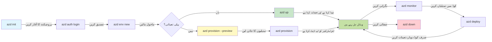
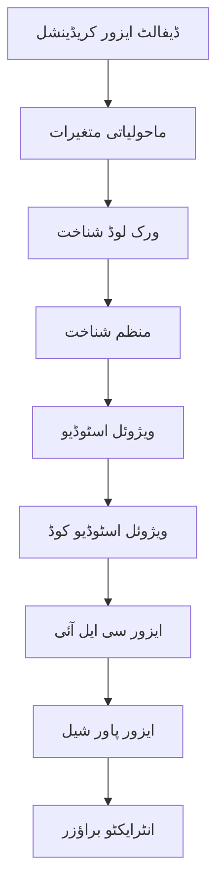

# AZD Basics - Understanding Azure Developer CLI

# AZD Basics - Core Concepts and Fundamentals

**Chapter Navigation:**
- **📚 Course Home**: [AZD For Beginners](../../README.md)
- **📖 Current Chapter**: Chapter 1 - Foundation & Quick Start
- **⬅️ Previous**: [Course Overview](../../README.md#-chapter-1-foundation--quick-start)
- **➡️ Next**: [Installation & Setup](installation.md)
- **🚀 Next Chapter**: [Chapter 2: AI-First Development](../chapter-02-ai-development/microsoft-foundry-integration.md)

## Introduction

یہ سبق آپ کو Azure Developer CLI (azd) سے روشناس کراتا ہے، جو ایک طاقتور کمانڈ لائن ٹول ہے جو آپ کے مقامی ترقی سے Azure پر تعیناتی کے سفر کو تیز کرتا ہے۔ آپ بنیادی تصورات، مرکزی خصوصیات سیکھیں گے، اور سمجھیں گے کہ azd کلاؤڈ-نیٹو ایپلی کیشن کی تعیناتی کو کیسے آسان بناتا ہے۔

## Learning Goals

اس سبق کے اختتام تک، آپ:
- سمجھ جائیں گے کہ Azure Developer CLI کیا ہے اور اس کا بنیادی مقصد کیا ہے
- ٹیمپلیٹس، اینوائرنمنٹس، اور سروسز کے بنیادی تصورات سیکھیں گے
- ٹیمپلیٹ-ڈرائیون ڈویلپمنٹ اور Infrastructure as Code سمیت کلیدی خصوصیات کا جائزہ لیں گے
- azd پروجیکٹ ساخت اور ورک فلو کو سمجھیں گے
- اپنے ترقیاتی ماحول کے لیے azd انسٹال اور کنفیگر کرنے کے لیے تیار ہوں گے

## Learning Outcomes

اس سبق کو مکمل کرنے کے بعد، آپ قابل ہوں گے کہ:
- جدید کلاؤڈ ڈویلپمنٹ ورک فلو میں azd کے کردار کی وضاحت کریں
- azd پروجیکٹ ساخت کے اجزاء کی شناخت کریں
- بیان کریں کہ ٹیمپلیٹس، اینوائرنمنٹس، اور سروسز کیسے ایک ساتھ کام کرتی ہیں
- azd کے ساتھ Infrastructure as Code کے فوائد سمجھیں
- مختلف azd کمانڈز اور ان کے مقاصد کو پہچانیں

## What is Azure Developer CLI (azd)?

Azure Developer CLI (azd) ایک کمانڈ لائن ٹول ہے جو آپ کے مقامی ترقی سے Azure پر تعیناتی کے سفر کو تیز کرنے کے لیے ڈیزائن کیا گیا ہے۔ یہ Azure پر کلاؤڈ-نیٹو ایپلی کیشنز بنانے، تعینات کرنے، اور منظم کرنے کے عمل کو آسان بناتا ہے۔

### 🎯 Why Use AZD? A Real-World Comparison

آئیے ایک سادہ ویب ایپ ڈیٹا بیس کے ساتھ تعینات کرنے کا موازنہ کریں:

#### ❌ WITHOUT AZD: Manual Azure Deployment (30+ minutes)

```bash
# مرحلہ 1: ریسورس گروپ بنائیں
az group create --name myapp-rg --location eastus

# مرحلہ 2: ایپ سروس پلان بنائیں
az appservice plan create --name myapp-plan \
  --resource-group myapp-rg \
  --sku B1 --is-linux

# مرحلہ 3: ویب ایپ بنائیں
az webapp create --name myapp-web-unique123 \
  --resource-group myapp-rg \
  --plan myapp-plan \
  --runtime "NODE:18-lts"

# مرحلہ 4: کوسموس DB اکاؤنٹ بنائیں (10-15 منٹ)
az cosmosdb create --name myapp-cosmos-unique123 \
  --resource-group myapp-rg \
  --kind MongoDB

# مرحلہ 5: ڈیٹابیس بنائیں
az cosmosdb mongodb database create \
  --account-name myapp-cosmos-unique123 \
  --resource-group myapp-rg \
  --name tododb

# مرحلہ 6: کلیکشن بنائیں
az cosmosdb mongodb collection create \
  --account-name myapp-cosmos-unique123 \
  --resource-group myapp-rg \
  --database-name tododb \
  --name todos

# مرحلہ 7: کنکشن سٹرنگ حاصل کریں
CONN_STR=$(az cosmosdb keys list \
  --name myapp-cosmos-unique123 \
  --resource-group myapp-rg \
  --type connection-strings \
  --query "connectionStrings[0].connectionString" -o tsv)

# مرحلہ 8: ایپ سیٹنگز ترتیب دیں
az webapp config appsettings set \
  --name myapp-web-unique123 \
  --resource-group myapp-rg \
  --settings MONGODB_URI="$CONN_STR"

# مرحلہ 9: لاگنگ فعال کریں
az webapp log config --name myapp-web-unique123 \
  --resource-group myapp-rg \
  --application-logging filesystem \
  --detailed-error-messages true

# مرحلہ 10: Application Insights سیٹ اپ کریں
az monitor app-insights component create \
  --app myapp-insights \
  --location eastus \
  --resource-group myapp-rg

# مرحلہ 11: App Insights کو Web App کے ساتھ منسلک کریں
INSTRUMENTATION_KEY=$(az monitor app-insights component show \
  --app myapp-insights \
  --resource-group myapp-rg \
  --query "instrumentationKey" -o tsv)

az webapp config appsettings set \
  --name myapp-web-unique123 \
  --resource-group myapp-rg \
  --settings APPINSIGHTS_INSTRUMENTATIONKEY="$INSTRUMENTATION_KEY"

# مرحلہ 12: مقامی طور پر ایپلیکیشن بنائیں
npm install
npm run build

# مرحلہ 13: ڈیپلائمنٹ پیکیج بنائیں
zip -r app.zip . -x "*.git*" "node_modules/*"

# مرحلہ 14: ایپلیکیشن کو تعینات کریں
az webapp deployment source config-zip \
  --resource-group myapp-rg \
  --name myapp-web-unique123 \
  --src app.zip

# مرحلہ 15: انتظار کریں اور دعا کریں کہ یہ کام کرے 🙏
# (کوئی خودکار توثیق نہیں، دستی جانچ درکار ہے)
```

**Problems:**
- ❌ 15+ commands to remember and execute in order
- ❌ 30-45 minutes of manual work
- ❌ Easy to make mistakes (typos, wrong parameters)
- ❌ Connection strings exposed in terminal history
- ❌ No automated rollback if something fails
- ❌ Hard to replicate for team members
- ❌ Different every time (not reproducible)

#### ✅ WITH AZD: Automated Deployment (5 commands, 10-15 minutes)

```bash
# مرحلہ 1: ٹیمپلیٹ سے شروعات کریں
azd init --template todo-nodejs-mongo

# مرحلہ 2: توثیق کریں
azd auth login

# مرحلہ 3: ماحول بنائیں
azd env new dev

# مرحلہ 4: تبدیلیوں کا پیش نظارہ (اختیاری مگر سفارش کی جاتی ہے)
azd provision --preview

# مرحلہ 5: سب کچھ تعینات کریں
azd up

# ✨ ہو گیا! سب کچھ تعینات، ترتیب دیا گیا، اور نگرانی کی جا رہی ہے
```

**Benefits:**
- ✅ **5 commands** vs. 15+ manual steps
- ✅ **10-15 minutes** total time (mostly waiting for Azure)
- ✅ **Zero errors** - automated and tested
- ✅ **Secrets managed securely** via Key Vault
- ✅ **Automatic rollback** on failures
- ✅ **Fully reproducible** - same result every time
- ✅ **Team-ready** - anyone can deploy with same commands
- ✅ **Infrastructure as Code** - version controlled Bicep templates
- ✅ **Built-in monitoring** - Application Insights configured automatically

### 📊 Time & Error Reduction

| Metric | Manual Deployment | AZD Deployment | Improvement |
|:-------|:------------------|:---------------|:------------|
| **Commands** | 15+ | 5 | 67% fewer |
| **Time** | 30-45 min | 10-15 min | 60% faster |
| **Error Rate** | ~40% | <5% | 88% reduction |
| **Consistency** | Low (manual) | 100% (automated) | Perfect |
| **Team Onboarding** | 2-4 hours | 30 minutes | 75% faster |
| **Rollback Time** | 30+ min (manual) | 2 min (automated) | 93% faster |

## Core Concepts

### Templates
ٹیمپلیٹس azd کی بنیاد ہیں۔ ان میں شامل ہیں:
- **Application code** - آپ کا سورس کوڈ اور dependencies
- **Infrastructure definitions** - Bicep یا Terraform میں تعریف کیے گئے Azure وسائل
- **Configuration files** - سیٹنگز اور ماحول کے متغیرات
- **Deployment scripts** - خودکار تعیناتی ورک فلو

### Environments
اینvironment مختلف تعیناتی اہداف کی نمائندگی کرتے ہیں:
- **Development** - ٹیسٹنگ اور ترقی کے لیے
- **Staging** - پری-پروڈکشن ماحول
- **Production** - لائیو پروڈکشن ماحول

ہر اینوائرنمنٹ اپنی مخصوص چیزیں برقرار رکھتا ہے:
- Azure resource group
- Configuration settings
- Deployment state

### Services
سروسز آپ کی ایپلیکیشن کے بنیادی اجزاء ہیں:
- **Frontend** - ویب ایپلیکیشنز، SPAs
- **Backend** - APIs، مائیکرو سروسز
- **Database** - ڈیٹا اسٹوریج حل
- **Storage** - فائل اور بلاک اسٹوریج

## Key Features

### 1. Template-Driven Development
```bash
# دستیاب ٹیمپلیٹس دیکھیں
azd template list

# ٹیمپلیٹ سے شروعات کریں
azd init --template <template-name>
```

### 2. Infrastructure as Code
- **Bicep** - Azure کا ڈومین-اسپیسفک زبان
- **Terraform** - ملٹی-کلاؤڈ infrastructure ٹول
- **ARM Templates** - Azure Resource Manager ٹیمپلیٹس

### 3. Integrated Workflows
```bash
# مکمل تعیناتی ورک فلو
azd up            # پروویژن + ڈپلائے — پہلی مرتبہ سیٹ اپ کے لیے خودکار

# 🧪 نیا: تعیناتی سے پہلے انفراسٹرکچر میں تبدیلیوں کا پیش نظارہ (محفوظ)
azd provision --preview    # بغیر کسی تبدیلی کے انفراسٹرکچر کی تعیناتی کی نقل کریں

azd provision     # اگر آپ انفراسٹرکچر کو اپ ڈیٹ کرتے ہیں تو Azure وسائل بنانے کے لیے اسے استعمال کریں
azd deploy        # اپلیکیشن کوڈ کو تعینات کریں یا اپ ڈیٹ کے بعد دوبارہ تعینات کریں
azd down          # وسائل کی صفائی کریں
```

#### 🛡️ Safe Infrastructure Planning with Preview
کمانڈ `azd provision --preview` محفوظ تعیناتیوں کے لیے بہت کارآمد ہے:
- **Dry-run analysis** - دکھاتا ہے کہ کیا بنایا، تبدیل، یا حذف کیا جائے گا
- **Zero risk** - آپ کے Azure ماحول میں کوئی حقیقی تبدیلی نہیں کی جاتی
- **Team collaboration** - تعیناتی سے پہلے پری ویو کے نتائج شیئر کریں
- **Cost estimation** - عزم کرنے سے پہلے وسائل کی لاگت سمجھیں

```bash
# مثالی پیش نظارہ ورک فلو
azd provision --preview           # دیکھیں کہ کیا بدل جائے گا
# خروجی کا جائزہ لیں، ٹیم کے ساتھ تبادلۂ خیال کریں
azd provision                     # اعتماد کے ساتھ تبدیلیاں نافذ کریں
```

### 📊 Visual: AZD Development Workflow


**Workflow Explanation:**
1. **Init** - ٹیمپلیٹ یا نیا پروجیکٹ کے ساتھ شروع کریں
2. **Auth** - Azure کے ساتھ مستند کریں
3. **Environment** - الگ تھلگ تعیناتی ماحول بنائیں
4. **Preview** - 🆕 ہمیشہ پہلے انفراسٹرکچر تبدیلیوں کا پری ویو کریں (محفوظ طریقہ)
5. **Provision** - Azure وسائل بنائیں/اپڈیٹ کریں
6. **Deploy** - اپنا ایپلیکیشن کوڈ بھیجیں
7. **Monitor** - ایپلیکیشن کی کارکردگی کا مشاہدہ کریں
8. **Iterate** - تبدیلیاں کریں اور کوڈ دوبارہ تعینات کریں
9. **Cleanup** - جب کام ختم ہو جائے تو وسائل ہٹا دیں

### 4. Environment Management
```bash
# ماحول بنائیں اور ان کا انتظام کریں
azd env new <environment-name>
azd env select <environment-name>
azd env list
```

## 📁 Project Structure

ایک عام azd پروجیکٹ ساخت:
```
my-app/
├── .azd/                    # azd configuration
│   └── config.json
├── .azure/                  # Azure deployment artifacts
├── .devcontainer/          # Development container config
├── .github/workflows/      # GitHub Actions
├── .vscode/               # VS Code settings
├── infra/                 # Infrastructure code
│   ├── main.bicep        # Main infrastructure template
│   ├── main.parameters.json
│   └── modules/          # Reusable modules
├── src/                  # Application source code
│   ├── api/             # Backend services
│   └── web/             # Frontend application
├── azure.yaml           # azd project configuration
└── README.md
```

## 🔧 Configuration Files

### azure.yaml
The main project configuration file:
```yaml
name: my-awesome-app
metadata:
  template: my-template@1.0.0

services:
  web:
    project: ./src/web
    language: js
    host: appservice
  api:
    project: ./src/api
    language: js
    host: appservice

hooks:
  preprovision:
    shell: pwsh
    run: echo "Preparing to provision..."
```

### .azure/config.json
Environment-specific configuration:
```json
{
  "version": 1,
  "defaultEnvironment": "dev",
  "environments": {
    "dev": {
      "subscriptionId": "your-subscription-id",
      "location": "eastus"
    }
  }
}
```

## 🎪 Common Workflows with Hands-On Exercises

> **💡 Learning Tip:** ان مشقوں کو ترتیب سے کریں تاکہ آپ بتدریج اپنے AZD ہنر کو بڑھا سکیں۔

### 🎯 Exercise 1: Initialize Your First Project

**Goal:** ایک AZD پروجیکٹ بنائیں اور اس کی ساخت کا جائزہ لیں

**Steps:**
```bash
# ایک آزمودہ ٹیمپلیٹ استعمال کریں
azd init --template todo-nodejs-mongo

# تخلیق شدہ فائلوں کو دریافت کریں
ls -la  # پوشیدہ فائلیں سمیت تمام فائلیں دیکھیں

# بنائی گئی کلیدی فائلیں:
# - azure.yaml (مرکزی کنفیگریشن)
# - infra/ (انفراسٹرکچر کا کوڈ)
# - src/ (ایپلیکیشن کوڈ)
```

**✅ Success:** آپ کے پاس azure.yaml، infra/، اور src/ ڈائریکٹریاں موجود ہیں

---

### 🎯 Exercise 2: Deploy to Azure

**Goal:** اختتام تا اختتام تعیناتی مکمل کریں

**Steps:**
```bash
# 1. تصدیق کریں
az login && azd auth login

# 2. ماحول بنائیں
azd env new dev
azd env set AZURE_LOCATION eastus

# 3. تبدیلیوں کا پیش نظارہ کریں (تجویز کردہ)
azd provision --preview

# 4. سب کچھ تعینات کریں
azd up

# 5. تعیناتی کی تصدیق کریں
azd show    # اپنی ایپ کا URL دیکھیں
```

**Expected Time:** 10-15 minutes  
**✅ Success:** براؤزر میں ایپلیکیشن URL کھل جاتا ہے

---

### 🎯 Exercise 3: Multiple Environments

**Goal:** dev اور staging میں تعینات کریں

**Steps:**
```bash
# پہلے سے dev موجود ہے، staging بنائیں
azd env new staging
azd env set AZURE_LOCATION westus2
azd up

# ان کے درمیان سوئچ کریں
azd env list
azd env select dev
```

**✅ Success:** Azure Portal میں دو علیحدہ resource groups نظر آتے ہیں

---

### 🛡️ Clean Slate: `azd down --force --purge`

جب آپ کو مکمل طور پر ری سیٹ کرنے کی ضرورت ہو:

```bash
azd down --force --purge
```

**What it does:**
- `--force`: No confirmation prompts
- `--purge`: Deletes all local state and Azure resources

**Use when:**
- Deployment failed mid-way
- Switching projects
- Need fresh start

---

## 🎪 Original Workflow Reference

### Starting a New Project
```bash
# طریقہ 1: موجودہ ٹیمپلیٹ استعمال کریں
azd init --template todo-nodejs-mongo

# طریقہ 2: بالکل نئے سرے سے شروع کریں
azd init

# طریقہ 3: موجودہ ڈائریکٹری استعمال کریں
azd init .
```

### Development Cycle
```bash
# ترقیاتی ماحول قائم کریں
azd auth login
azd env new dev
azd env select dev

# سب کچھ تعینات کریں
azd up

# تبدیلیاں کریں اور دوبارہ تعینات کریں
azd deploy

# کام مکمل ہونے پر صفائی کریں
azd down --force --purge # Azure Developer CLI میں یہ کمانڈ آپ کے ماحول کے لیے ایک **مکمل ری سیٹ** ہے — خاص طور پر مفید جب آپ ناکام تعیناتیوں کی خرابیوں کی جانچ کر رہے ہوں، بے کار وسائل کو صاف کر رہے ہوں، یا نئی تعیناتی کے لیے تیاریاں کر رہے ہوں۔
```

## Understanding `azd down --force --purge`
کمانڈ `azd down --force --purge` آپ کے azd ماحول اور تمام منسلک وسائل کو مکمل طور پر ختم کرنے کا ایک طاقتور طریقہ ہے۔ یہاں ہر فلیگ کا خلاصہ دیا گیا ہے:
```
--force
```
- توثیقی پرامپٹس کو چھوڑ دیتا ہے۔
- خودکاری یا اسکرپٹنگ کے لیے مفید جہاں دستی ان پٹ ممکن نہ ہو۔
- یہ یقینی بناتا ہے کہ کسی رکاوٹ کے بغیر teardown جاری رہے، چاہے CLI تضادات کی نشاندہی کرے۔

```
--purge
```
حذف کرتا ہے **تمام متعلقہ میٹاداتا**، بشمول:
Environment state
Local `.azure` folder
Cached deployment info
Prevents azd from "remembering" previous deployments, which can cause issues like mismatched resource groups or stale registry references.


### Why use both?
جب آپ `azd up` کے ساتھ کسی باقی ماندہ state یا جزوی تعیناتی کی وجہ سے پھنس جائیں، تو یہ ترکیب ایک **صاف آغاز** کو یقینی بناتی ہے۔

یہ خاص طور پر مفید ہے جب آپ نے Azure پورٹل میں دستی طور پر وسائل حذف کیے ہوں یا جب آپ ٹیمپلیٹس، اینوائرنمنٹس، یا resource group ناموں کے کنونشنز تبدیل کر رہے ہوں۔

### Managing Multiple Environments
```bash
# اسٹیجنگ ماحول بنائیں
azd env new staging
azd env select staging
azd up

# dev پر واپس جائیں
azd env select dev

# ماحولوں کا موازنہ کریں
azd env list
```

## 🔐 Authentication and Credentials

مستند کاری کو سمجھنا azd تعیناتیوں میں کامیابی کے لیے ضروری ہے۔ Azure متعدد توثیقی طریقے استعمال کرتا ہے، اور azd وہی کریڈینشل چین استعمال کرتا ہے جو دیگر Azure ٹولز استعمال کرتے ہیں۔

### Azure CLI Authentication (`az login`)

azd استعمال کرنے سے پہلے، آپ کو Azure کے ساتھ مستند ہونا ہوگا۔ سب سے عام طریقہ Azure CLI استعمال کرنا ہے:

```bash
# انٹرایکٹو لاگ ان (براؤزر کھلے گا)
az login

# مخصوص ٹیننٹ کے ساتھ لاگ ان
az login --tenant <tenant-id>

# سروس پرنسپل کے ساتھ لاگ ان
az login --service-principal -u <app-id> -p <password> --tenant <tenant-id>

# موجودہ لاگ ان کی حیثیت چیک کریں
az account show

# دستیاب سبسکرپشنز کی فہرست دکھائیں
az account list --output table

# ڈیفالٹ سبسکرپشن سیٹ کریں
az account set --subscription <subscription-id>
```

### Authentication Flow
1. **Interactive Login**: آپ کے ڈیفالٹ براؤزر کو کھول کر توثیق کرتا ہے
2. **Device Code Flow**: ایسے ماحول کے لیے جہاں براؤزر تک رسائی نہ ہو
3. **Service Principal**: خودکاری اور CI/CD منظرناموں کے لیے
4. **Managed Identity**: Azure میزبان ایپلیکیشنز کے لیے

### DefaultAzureCredential Chain

`DefaultAzureCredential` ایک ایسا کریڈینشل ٹائپ ہے جو مخصوص ترتیب میں خودکار طور پر متعدد کریڈینشل ذرائع آزما کر آسان توثیقی تجربہ فراہم کرتا ہے:

#### Credential Chain Order

#### 1. Environment Variables
```bash
# سروس پرنسپل کے لیے ماحولیاتی متغیرات مرتب کریں
export AZURE_CLIENT_ID="<app-id>"
export AZURE_CLIENT_SECRET="<password>"
export AZURE_TENANT_ID="<tenant-id>"
```

#### 2. Workload Identity (Kubernetes/GitHub Actions)
خودکار طور پر استعمال ہوتا ہے:
- Azure Kubernetes Service (AKS) with Workload Identity
- GitHub Actions with OIDC federation
- دیگر federated identity منظرنامے

#### 3. Managed Identity
ذیل کے Azure وسائل کے لیے:
- Virtual Machines
- App Service
- Azure Functions
- Container Instances

```bash
# چیک کریں کہ آیا مینیجڈ آئیڈینٹی کے ساتھ Azure وسیلہ پر چل رہا ہے
az account show --query "user.type" --output tsv
# واپس کرتا ہے: اگر مینیجڈ آئیڈینٹی استعمال ہو تو "servicePrincipal"
```

#### 4. Developer Tools Integration
- **Visual Studio**: خود بخود سائن ان اکاؤنٹ استعمال کرتا ہے
- **VS Code**: Azure Account ایکسٹینشن کے کریڈینشل استعمال کرتا ہے
- **Azure CLI**: `az login` کریڈینشل استعمال کرتا ہے (مقامی ترقی کے لیے سب سے عام)

### AZD Authentication Setup

```bash
# طریقہ 1: Azure CLI استعمال کریں (ترقی کے لیے تجویز کیا گیا)
az login
azd auth login  # موجودہ Azure CLI اسناد استعمال کرتا ہے

# طریقہ 2: azd کی براہِ راست توثیق
azd auth login --use-device-code  # ہیڈ لیس ماحول کے لیے

# طریقہ 3: توثیق کی حیثیت چیک کریں
azd auth login --check-status

# طریقہ 4: لاگ آؤٹ کریں اور دوبارہ توثیق کریں
azd auth logout
azd auth login
```

### Authentication Best Practices

#### For Local Development
```bash
# 1. Azure CLI کے ساتھ لاگ ان کریں
az login

# 2. صحیح سبسکرپشن کی تصدیق کریں
az account show
az account set --subscription "Your Subscription Name"

# 3. موجودہ اسناد کے ساتھ azd استعمال کریں
azd auth login
```

#### For CI/CD Pipelines
```yaml
# GitHub Actions example
- name: Azure Login
  uses: azure/login@v1
  with:
    creds: ${{ secrets.AZURE_CREDENTIALS }}

- name: Deploy with azd
  run: |
    azd auth login --client-id ${{ secrets.AZURE_CLIENT_ID }} \
                    --client-secret ${{ secrets.AZURE_CLIENT_SECRET }} \
                    --tenant-id ${{ secrets.AZURE_TENANT_ID }}
    azd up --no-prompt
```

#### For Production Environments
- Use **Managed Identity** when running on Azure resources
- Use **Service Principal** for automation scenarios
- Avoid storing credentials in code or configuration files
- Use **Azure Key Vault** for sensitive configuration

### Common Authentication Issues and Solutions

#### Issue: "No subscription found"
```bash
# حل: پہلے سے طے شدہ رکنیت مقرر کریں
az account list --output table
az account set --subscription "<subscription-id>"
azd env set AZURE_SUBSCRIPTION_ID "<subscription-id>"
```

#### Issue: "Insufficient permissions"
```bash
# حل: ضروری کردار چیک کریں اور تفویض کریں
az role assignment list --assignee $(az account show --query user.name --output tsv)

# عام طور پر درکار کردار:
# - شراکت کنندہ (وسائل کے انتظام کے لیے)
# - صارف رسائی منتظم (کردار تفویضات کے لیے)
```

#### Issue: "Token expired"
```bash
# حل: دوبارہ توثیق کریں
az logout
az login
azd auth logout
azd auth login
```

### Authentication in Different Scenarios

#### Local Development
```bash
# ذاتی ترقی کا اکاؤنٹ
az login
azd auth login
```

#### Team Development
```bash
# ادارے کے لیے مخصوص ٹیننٹ استعمال کریں
az login --tenant contoso.onmicrosoft.com
azd auth login
```

#### Multi-tenant Scenarios
```bash
# ٹیننٹس کے درمیان سوئچ کریں
az login --tenant tenant1.onmicrosoft.com
# ٹیننٹ 1 پر تعینات کریں
azd up

az login --tenant tenant2.onmicrosoft.com  
# ٹیننٹ 2 پر تعینات کریں
azd up
```

### Security Considerations

1. **Credential Storage**: کبھی بھی کریڈینشلز کو سورس کوڈ میں نہ رکھیں
2. **Scope Limitation**: سروس پرنسپل کے لیے کم از کم اجازتوں کا اصول اپنائیں
3. **Token Rotation**: باقاعدگی سے سروس پرنسپل سیcretات کو rotate کریں
4. **Audit Trail**: توثیق اور تعیناتی کی سرگرمیوں کی نگرانی کریں
5. **Network Security**: جہاں ممکن ہو پرائیویٹ endpoints استعمال کریں

### Troubleshooting Authentication

```bash
# تصدیقی مسائل کی خرابی تلاش کریں
azd auth login --check-status
az account show
az account get-access-token

# عام تشخیصی کمانڈز
whoami                          # موجودہ صارف کا تناظر
az ad signed-in-user show      # Azure AD صارف کی تفصیلات
az group list                  # وسائل تک رسائی کی جانچ کریں
```

## Understanding `azd down --force --purge`

### Discovery
```bash
azd template list              # ٹیمپلیٹس دیکھیں
azd template show <template>   # ٹیمپلیٹ کی تفصیلات
azd init --help               # ابتدائی اختیارات
```

### Project Management
```bash
azd show                     # منصوبے کا جائزہ
azd env show                 # موجودہ ماحول
azd config list             # تشکیلات کی ترتیبات
```

### Monitoring
```bash
azd monitor                  # Azure پورٹل کی مانیٹرنگ کھولیں
azd monitor --logs           # ایپلیکیشن کے لاگز دیکھیں
azd monitor --live           # لائیو میٹرکس دیکھیں
azd pipeline config          # CI/CD ترتیب دیں
```

## Best Practices

### 1. Use Meaningful Names
```bash
# اچھا
azd env new production-east
azd init --template web-app-secure

# اجتناب کریں
azd env new env1
azd init --template template1
```

### 2. Leverage Templates
- موجودہ ٹیمپلیٹس سے شروع کریں
- اپنی ضروریات کے لیے کسٹمائز کریں
- اپنی تنظیم کے لیے دوبارہ قابل استعمال ٹیمپلیٹس بنائیں

### 3. Environment Isolation
- dev/staging/prod کے لیے علیحدہ اینوائرنمنٹس استعمال کریں
- کبھی براہِ راست لوکل مشین سے پروڈکشن میں تعینات نہ کریں
- پروڈکشن تعیناتیوں کے لیے CI/CD پائپ لائنز استعمال کریں

### 4. Configuration Management
- حساس ڈیٹا کے لیے environment variables استعمال کریں
- کنفیگریشن کو version control میں رکھیں
- اینوائرنمنٹ مخصوص سیٹنگز کو دستاویزی شکل دیں

## Learning Progression

### Beginner (Week 1-2)
1. azd انسٹال کریں اور مستند کریں
2. ایک سادہ ٹیمپلیٹ تعینات کریں
3. پروجیکٹ ساخت سمجھیں
4. بنیادی کمانڈز سیکھیں (up, down, deploy)

### Intermediate (Week 3-4)
1. ٹیمپلیٹس کو کسٹمائز کریں
2. متعدد اینوائرنمنٹس کا انتظام کریں
3. infrastructure code کو سمجھیں
4. CI/CD پائپ لائنز ترتیب دیں

### Advanced (Week 5+)
1. کسٹم ٹیمپلیٹس بنائیں
2. جدید infrastructure پیٹرنز
3. ملٹی-ریجن تعیناتیاں
4. انٹرپرائز-گریڈ کنفیگریشنز

## Next Steps

**📖 Continue Chapter 1 Learning:**
- [انسٹالیشن اور سیٹ اپ](installation.md) - azd انسٹال اور ترتیب دیا ہوا حاصل کریں
- [آپ کا پہلا پروجیکٹ](first-project.md) - مکمل عملی ٹیوٹوریل
- [کنفیگریشن گائیڈ](configuration.md) - اعلی درجے کے کنفیگریشن اختیارات

**🎯 اگلے باب کے لیے تیار؟**
- [باب 2: AI-فرسٹ ڈیولپمنٹ](../chapter-02-ai-development/microsoft-foundry-integration.md) - مصنوعی ذہانت کی ایپلی کیشنز بنانا شروع کریں

## اضافی وسائل

- [Azure Developer CLI کا جائزہ](https://learn.microsoft.com/en-us/azure/developer/azure-developer-cli/)
- [ٹیمپلیٹ گیلری](https://azure.github.io/awesome-azd/)
- [کمیونٹی نمونے](https://github.com/Azure-Samples)

---

## 🙋 اکثر پوچھے جانے والے سوالات

### عمومی سوالات

**Q: AZD اور Azure CLI میں کیا فرق ہے؟**

A: Azure CLI (`az`) انفرادی Azure وسائل کے انتظام کے لیے ہے۔ AZD (`azd`) پورے ایپلیکیشنز کے انتظام کے لیے ہے:

```bash
# Azure CLI - کم سطحی وسائل کا انتظام
az webapp create --name myapp --resource-group rg
az sql server create --name myserver --resource-group rg
# ...اور بھی بہت سی کمانڈز درکار ہیں

# AZD - ایپلیکیشن سطح کا انتظام
azd up  # پوری ایپ کو تمام وسائل کے ساتھ تعینات کرتا ہے
```

**اس طرح سوچیں:**
- `az` = انفرادی لیگو بلاکس پر کام کرنا
- `azd` = مکمل لیگو سیٹ کے ساتھ کام کرنا

---

**Q: کیا مجھے AZD استعمال کرنے کے لیے Bicep یا Terraform جاننے کی ضرورت ہے؟**

A: نہیں! ٹیمپلیٹس کے ساتھ شروع کریں:
```bash
# موجودہ ٹیمپلیٹ استعمال کریں - IaC کا علم ضروری نہیں
azd init --template todo-nodejs-mongo
azd up
```

بعد میں آپ انفراسٹرکچر کو حسبِ ضرورت بنانے کے لیے Bicep سیکھ سکتے ہیں۔ ٹیمپلیٹس عملی مثالیں فراہم کرتے ہیں جن سے سیکھا جا سکتا ہے۔

---

**Q: AZD ٹیمپلیٹس چلانے کی لاگت کتنی ہے؟**

A: لاگت ٹیمپلیٹ کے مطابق مختلف ہوتی ہے۔ زیادہ تر ڈویلپمنٹ ٹیمپلیٹس کی قیمت $50-150/ماہ ہوتی ہے:

```bash
# ڈپلائے کرنے سے پہلے اخراجات کا جائزہ لیں
azd provision --preview

# استعمال نہ ہونے پر ہمیشہ صفائی کریں
azd down --force --purge  # تمام وسائل کو ہٹا دیتا ہے
```

**ماہر مشورہ:** جہاں ممکن ہو مفت ٹیرز استعمال کریں:
- App Service: F1 (مفت) ٹیر
- Azure OpenAI: 50,000 ٹوکنز/ماہ مفت
- Cosmos DB: 1000 RU/s مفت ٹیر

---

**Q: کیا میں موجودہ Azure وسائل کے ساتھ AZD استعمال کر سکتا ہوں؟**

A: ہاں، لیکن تازہ شروع کرنا آسان ہوتا ہے۔ AZD اس وقت بہتر کام کرتا ہے جب یہ پوری لائف سائیکل کا انتظام کرے۔ موجودہ وسائل کے لیے:
```bash
# اختیار 1: موجودہ وسائل درآمد کریں (متقدم)
azd init
# پھر infra/ کو موجودہ وسائل کا حوالہ دینے کے لیے ترمیم کریں

# اختیار 2: نئی شروعات کریں (تجویز کردہ)
azd init --template matching-your-stack
azd up  # نیا ماحول بناتا ہے
```

---

**Q: میں اپنا پروجیکٹ ٹیم کے ساتھ کس طرح شیئر کروں؟**

A: AZD پروجیکٹ کو Git میں کمیٹ کریں (لیکن .azure فولڈر کو نہیں):
```bash
# .gitignore میں پہلے سے بطور ڈیفالٹ شامل ہے
.azure/        # راز اور ماحولیاتی ڈیٹا پر مشتمل ہے
*.env          # ماحولیاتی متغیرات

# پھر ٹیم کے اراکین:
git clone <your-repo>
azd auth login
azd env new <their-name>-dev
azd up
```

ہر کسی کو ایک ہی ٹیمپلیٹس سے یکساں انفراسٹرکچر ملتا ہے۔

---

### خرابیوں کے حل کے سوالات

**Q: "azd up" آدھے راستے میں ناکام ہو گیا۔ میں کیا کروں؟**

A: ایرر چیک کریں، اسے درست کریں، پھر دوبارہ کوشش کریں:
```bash
# تفصیلی لاگز دیکھیں
azd show

# عام حل:

# 1. اگر کوٹہ تجاوز کر گیا ہو:
azd env set AZURE_LOCATION "westus2"  # مختلف خطہ آزمائیں

# 2. اگر وسائل کے نام میں تصادم ہو:
azd down --force --purge  # نیا آغاز کریں
azd up  # دوبارہ کوشش کریں

# 3. اگر توثیق کی مدت ختم ہو گئی ہو:
az login
azd auth login
azd up
```

**سب سے عام مسئلہ:** غلط Azure سبسکرپشن منتخب ہونا
```bash
az account list --output table
az account set --subscription "<correct-subscription>"
```

---

**Q: میں صرف کوڈ تبدیلیاں بغیر دوبارہ پروویژن کیے کیسے تعینات کروں؟**

A: `azd up` کی بجائے `azd deploy` استعمال کریں:
```bash
azd up          # پہلی بار: فراہمی + تعیناتی (آہستہ)

# کوڈ میں تبدیلیاں کریں...

azd deploy      # بعد ازاں: صرف تعیناتی (تیز)
```

رفتار کا موازنہ:
- `azd up`: 10-15 منٹ (انفراسٹرکچر پروویژنز کرتا ہے)
- `azd deploy`: 2-5 منٹ (صرف کوڈ)

---

**Q: کیا میں انفراسٹرکچر ٹیمپلیٹس کو حسبِ ضرورت بنا سکتا ہوں؟**

A: ہاں! `infra/` میں موجود Bicep فائلیں ایڈٹ کریں:
```bash
# azd init کے بعد
cd infra/
code main.bicep  # VS Code میں ترمیم کریں

# تبدیلیوں کا پیش نظارہ
azd provision --preview

# تبدیلیاں لاگو کریں
azd provision
```

**مشورہ:** چھوٹے سے شروع کریں - پہلے SKUs تبدیل کریں:
```bicep
// infra/main.bicep
sku: {
  name: 'B1'  // Change to 'P1V2' for production
}
```

---

**Q: میں AZD کی جانب سے بنائی گئی تمام چیزیں کیسے حذف کروں؟**

A: ایک کمانڈ تمام وسائل ہٹا دیتی ہے:
```bash
azd down --force --purge

# یہ حذف کرتا ہے:
# - تمام Azure وسائل
# - ریسورس گروپ
# - مقامی ماحول کی حالت
# - کیش شدہ تعیناتی کا ڈیٹا
```

**ہمیشہ یہ تب چلائیں جب:**
- کسی ٹیمپلیٹ کی جانچ ختم کر لی ہو
- مختلف پروجیکٹ پر سوئچ کر رہے ہوں
- تازہ آغاز کرنا چاہتے ہوں

**لاگت کی بچت:** غیر استعمال شدہ وسائل کو حذف کرنے سے چارجز صفر ہو جاتے ہیں

---

**Q: اگر میں نے غلطی سے Azure پورٹل میں وسائل حذف کر دیے تو کیا ہوگا؟**

A: AZD کی حالت غیر ہم آہنگ ہو سکتی ہے۔ نیا آغاز کرنے کا طریقہ:
```bash
# 1. مقامی حالت کو ہٹا دیں
azd down --force --purge

# 2. نئی شروعات کریں
azd up

# متبادل: AZD کو پتہ لگانے اور درست کرنے دیں
azd provision  # غیر موجود وسائل بنائے گا
```

---

### اعلیٰ درجے کے سوالات

**Q: کیا میں CI/CD پائپ لائنز میں AZD استعمال کر سکتا ہوں؟**

A: ہاں! GitHub Actions کی مثال:
```yaml
# .github/workflows/deploy.yml
name: Deploy with AZD

on:
  push:
    branches: [main]

jobs:
  deploy:
    runs-on: ubuntu-latest
    steps:
      - uses: actions/checkout@v2
      
      - name: Install azd
        run: curl -fsSL https://aka.ms/install-azd.sh | bash
      
      - name: Azure Login
        run: |
          azd auth login \
            --client-id ${{ secrets.AZURE_CLIENT_ID }} \
            --client-secret ${{ secrets.AZURE_CLIENT_SECRET }} \
            --tenant-id ${{ secrets.AZURE_TENANT_ID }}
      
      - name: Deploy
        run: azd up --no-prompt
```

---

**Q: میں خفیہ اور حساس ڈیٹا کو کیسے ہینڈل کروں؟**

A: AZD خود بخود Azure Key Vault کے ساتھ انٹیگریٹ ہو جاتا ہے:
```bash
# خفیہ معلومات Key Vault میں محفوظ کی جاتی ہیں، کوڈ میں نہیں
azd env set DATABASE_PASSWORD "$(openssl rand -base64 32)"

# AZD خودکار طور پر:
# 1. Key Vault تخلیق کرتا ہے
# 2. راز محفوظ کرتا ہے
# 3. Managed Identity کے ذریعے ایپ کو رسائی دیتا ہے
# 4. رن ٹائم کے دوران داخل کرتا ہے
```

**کبھی کمیٹ نہ کریں:**
- `.azure/` فولڈر (ماحول کا ڈیٹا ہوتا ہے)
- `.env` فائلیں (مقامی راز)
- Connection strings

---

**Q: کیا میں متعدد ریجنز میں ڈپلائے کر سکتا ہوں؟**

A: ہاں، ہر ریجن کے لیے ایک ماحول بنائیں:
```bash
# مشرقی امریکہ کا ماحول
azd env new prod-eastus
azd env set AZURE_LOCATION eastus
azd up

# مغربی یورپ کا ماحول
azd env new prod-westeurope
azd env set AZURE_LOCATION westeurope
azd up

# ہر ماحول خود مختار ہے
azd env list
```

حقیقی کثیر-ریجن ایپس کے لیے، Bicep ٹیمپلیٹس کو حسبِ ضرورت بنائیں تاکہ بیک وقت متعدد ریجنز میں تعینات کریں۔

---

**Q: اگر میں پھنس جاؤں تو مدد کہاں حاصل کر سکتا ہوں؟**

1. **AZD دستاویزات:** https://learn.microsoft.com/azure/developer/azure-developer-cli/
2. **GitHub Issues:** https://github.com/Azure/azure-dev/issues
3. **Discord:** [Azure Discord](https://discord.gg/microsoft-azure) - #azure-developer-cli چینل
4. **Stack Overflow:** Tag `azure-developer-cli`
5. **یہ کورس:** [مسائل کے حل کی رہنمائی](../chapter-07-troubleshooting/common-issues.md)

**ماہر مشورہ:** پوچھنے سے پہلے چلائیں:
```bash
azd show       # موجودہ حالت دکھاتی ہے
azd version    # آپ کا ورژن دکھاتا ہے
```
اپنے سوال میں یہ معلومات شامل کریں تاکہ مدد جلد ملے۔

---

## 🎓 آگے کیا ہے؟

آپ اب AZD کے بنیادی اصول سمجھ چکے ہیں۔ اپنا راستہ منتخب کریں:

### 🎯 ابتدائی افراد کے لیے:
1. **اگلا:** [انسٹالیشن اور سیٹ اپ](installation.md) - اپنی مشین پر AZD انسٹال کریں
2. **پھر:** [آپ کا پہلا پروجیکٹ](first-project.md) - اپنی پہلی ایپ ڈپلائے کریں
3. **مشق:** اس سبق کی تمام 3 مشقیں مکمل کریں

### 🚀 AI ڈویلپرز کے لیے:
1. **اس پر جائیں:** [باب 2: AI-فرسٹ ڈیولپمنٹ](../chapter-02-ai-development/microsoft-foundry-integration.md)
2. **تعینات کریں:** اس سے شروع کریں `azd init --template get-started-with-ai-chat`
3. **سیکھیں:** تعینات کرتے ہوئے بنائیں

### 🏗️ تجربہ کار ڈویلپرز کے لیے:
1. **جائزہ لیں:** [کنفیگریشن گائیڈ](configuration.md) - اعلیٰ ترتیبات
2. **دریافت کریں:** [انفراسٹرکچر بطور کوڈ](../chapter-04-infrastructure/provisioning.md) - Bicep کا گہرا مطالعہ
3. **بنائیں:** اپنے اسٹیک کے لیے حسبِ ضرورت ٹیمپلیٹس بنائیں

---

**باب نیویگیشن:**
- **📚 کورس ہوم**: [AZD برائے ابتدائی](../../README.md)
- **📖 موجودہ باب**: باب 1 - بنیاد اور فوری آغاز  
- **⬅️ پچھلا**: [کورس کا جائزہ](../../README.md#-chapter-1-foundation--quick-start)
- **➡️ اگلا**: [انسٹالیشن اور سیٹ اپ](installation.md)
- **🚀 اگلا باب**: [باب 2: AI-فرسٹ ڈیولپمنٹ](../chapter-02-ai-development/microsoft-foundry-integration.md)

---

<!-- CO-OP TRANSLATOR DISCLAIMER START -->
دستبرداری:
یہ دستاویز AI ترجمہ سروس (Co-op Translator: https://github.com/Azure/co-op-translator) کے ذریعے ترجمہ کی گئی ہے۔ اگرچہ ہم درستگی کی کوشش کرتے ہیں، براہِ کرم نوٹ کریں کہ خودکار تراجم میں غلطیاں یا عدمِ صحتی ہو سکتی ہے۔ اصل دستاویز اپنی مادری زبان میں معتبر ماخذ سمجھی جانی چاہیے۔ اہم معلومات کے لیے پیشہ ور انسانی ترجمعہ تجویز کیا جاتا ہے۔ اس ترجمے کے استعمال سے پیدا ہونے والی کسی بھی غلط فہمی یا غلط تعبیر کی ذمہ داری ہم پر عائد نہیں ہوتی۔
<!-- CO-OP TRANSLATOR DISCLAIMER END -->