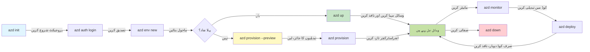
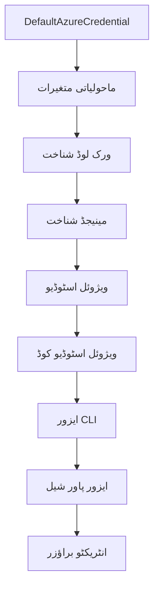

# AZD بنیادی باتیں - Azure Developer CLI کو سمجھنا

# AZD بنیادی باتیں - بنیادی تصورات اور اصول

**باب کی نیویگیشن:**
- **📚 کورس کا ہوم**: [ابتدائی افراد کے لیے AZD](../../README.md)
- **📖 موجودہ باب**: باب 1 - بنیاد اور فوری آغاز
- **⬅️ پچھلا**: [کورس کا جائزہ](../../README.md#-chapter-1-foundation--quick-start)
- **➡️ اگلا**: [انسٹالیشن اور سیٹ اپ](installation.md)
- **🚀 اگلا باب**: [باب 2: AI-فرسٹ ڈویلپمنٹ](../chapter-02-ai-development/microsoft-foundry-integration.md)

## تعارف

یہ سبق آپ کو Azure Developer CLI (azd) سے روشناس کراتا ہے، جو ایک طاقتور کمانڈ لائن ٹول ہے جو آپ کے لوکل ڈیولپمنٹ سے Azure پر تعیناتی کے سفر کو تیز کرتا ہے۔ آپ بنیادی تصورات، مرکزی خصوصیات سیکھیں گے اور سمجھیں گے کہ azd کس طرح کلاؤڈ-نیٹو ایپلیکیشن کی تعیناتی کو آسان بناتا ہے۔

## سیکھنے کے مقاصد

اس سبق کے اختتام تک، آپ:
- سمجھ سکیں گے کہ Azure Developer CLI کیا ہے اور اس کا بنیادی مقصد کیا ہے
- ٹیمپلیٹس، ماحولیاتی نظام، اور سروسز کے بنیادی تصورات سیکھیں گے
- کلیدی خصوصیات دریافت کریں گے جن میں ٹیمپلیٹ پر مبنی ترقی اور کوڈ کے طور پر انفراسٹرکچر شامل ہیں
- azd پروجیکٹ کی ساخت اور ورک فلو کو سمجھیں گے
- اپنے ترقیاتی ماحول کے لیے azd انسٹال اور کنفیگر کرنے کے لیے تیار ہوں گے

## سیکھنے کے نتائج

سبق مکمل کرنے کے بعد، آپ:
- جدید کلاؤڈ ڈیولپمنٹ ورک فلو میں azd کے کردار کی وضاحت کر سکیں گے
- azd پروجیکٹ ساخت کے اجزاء کی شناخت کر سکیں گے
- بیان کر سکیں گے کہ ٹیمپلیٹس، ماحولیاتی نظام، اور سروسز کس طرح مل کر کام کرتی ہیں
- azd کے ساتھ کوڈ کے طور پر انفراسٹرکچر کے فوائد کو سمجھ سکیں گے
- مختلف azd کمانڈز اور ان کے مقاصد کو پہچان سکیں گے

## Azure Developer CLI (azd) کیا ہے؟

Azure Developer CLI (azd) ایک کمانڈ لائن ٹول ہے جو آپ کے لوکل ڈیولپمنٹ سے Azure پر تعیناتی کے سفر کو تیز بنانے کے لیے ڈیزائن کیا گیا ہے۔ یہ Azure پر کلاؤڈ-نیٹو ایپلیکیشنز کے تعمیر، تعیناتی، اور انتظام کے عمل کو آسان بناتا ہے۔

### azd کے ساتھ آپ کیا تعینات کر سکتے ہیں؟

azd وسیع قسم کے ورکلوڈز کی حمایت کرتا ہے—اور فہرست مسلسل بڑھ رہی ہے۔ آج، آپ azd کا استعمال کر کے تعینات کر سکتے ہیں:

| ورک لوڈ کی قسم | مثالیں | ایک ہی ورک فلو؟ |
|---------------|----------|----------------|
| **روایتی ایپلیکیشنز** | ویب ایپس، REST APIs، سٹیٹک سائٹس | ✅ `azd up` |
| **سروسز اور مائیکرو سروسز** | کنٹینر ایپس، فنکشن ایپس، متعدد سروسز بیک اینڈز | ✅ `azd up` |
| **AI سے چلنے والی ایپلیکیشنز** | Microsoft Foundry ماڈلز کے ساتھ چیٹ ایپس، AI سرچ کے ساتھ RAG حل | ✅ `azd up` |
| **ذہین ایجنٹ** | Foundry ہوسٹڈ ایجنٹس، متعدد ایجنٹ آرکیسٹریشن | ✅ `azd up` |

اہم بات یہ ہے کہ **azd لائف سائیکل ایک جیسا رہتا ہے چاہے آپ کچھ بھی تعینات کر رہے ہوں**۔ آپ ایک پروجیکٹ شروع کرتے ہیں، انفراسٹرکچر فراہم کرتے ہیں، اپنا کوڈ تعینات کرتے ہیں، اپنی ایپ کی نگرانی کرتے ہیں، اور صفائی کرتے ہیں—چاہے وہ ایک سادہ ویب سائٹ ہو یا ایک پیچیدہ AI ایجنٹ۔

یہ استمرار جان بوجھ کر بنایا گیا ہے۔ azd AI صلاحیتوں کو آپ کی ایپلیکیشن کی ایک اور قسم کی سروس کے طور پر دیکھتا ہے، نہ کہ کوئی بنیادی طور پر مختلف چیز۔ Microsoft Foundry ماڈلز سے چلنے والا چیٹ اینڈپوائنٹ azd کی نظر میں بس ایک اور سروس ہے جسے ترتیب دے کر تعینات کیا جا سکتا ہے۔

### 🎯 AZD کیوں استعمال کریں؟ حقیقی دنیا کی موازنہ

آئیں ایک سادہ ویب ایپ کو ڈیٹا بیس کے ساتھ تعینات کرنے کا موازنہ کریں:

#### ❌ بغیر AZD کے: دستی Azure تعیناتی (30+ منٹ)

```bash
# مرحلہ 1: ریسورس گروپ بنائیں
az group create --name myapp-rg --location eastus

# مرحلہ 2: ایپ سروس پلان بنائیں
az appservice plan create --name myapp-plan \
  --resource-group myapp-rg \
  --sku B1 --is-linux

# مرحلہ 3: ویب ایپ بنائیں
az webapp create --name myapp-web-unique123 \
  --resource-group myapp-rg \
  --plan myapp-plan \
  --runtime "NODE:18-lts"

# مرحلہ 4: کسموس ڈی بی اکاؤنٹ بنائیں (10-15 منٹ)
az cosmosdb create --name myapp-cosmos-unique123 \
  --resource-group myapp-rg \
  --kind MongoDB

# مرحلہ 5: ڈیٹا بیس بنائیں
az cosmosdb mongodb database create \
  --account-name myapp-cosmos-unique123 \
  --resource-group myapp-rg \
  --name tododb

# مرحلہ 6: کلیکشن بنائیں
az cosmosdb mongodb collection create \
  --account-name myapp-cosmos-unique123 \
  --resource-group myapp-rg \
  --database-name tododb \
  --name todos

# مرحلہ 7: کنکشن سٹرنگ حاصل کریں
CONN_STR=$(az cosmosdb keys list \
  --name myapp-cosmos-unique123 \
  --resource-group myapp-rg \
  --type connection-strings \
  --query "connectionStrings[0].connectionString" -o tsv)

# مرحلہ 8: ایپ کی ترتیبات کنفیگر کریں
az webapp config appsettings set \
  --name myapp-web-unique123 \
  --resource-group myapp-rg \
  --settings MONGODB_URI="$CONN_STR"

# مرحلہ 9: لاگنگ فعال کریں
az webapp log config --name myapp-web-unique123 \
  --resource-group myapp-rg \
  --application-logging filesystem \
  --detailed-error-messages true

# مرحلہ 10: ایپلیکیشن انسائیٹس سیٹ اپ کریں
az monitor app-insights component create \
  --app myapp-insights \
  --location eastus \
  --resource-group myapp-rg

# مرحلہ 11: ایپ انسائیٹس کو ویب ایپ سے لنک کریں
INSTRUMENTATION_KEY=$(az monitor app-insights component show \
  --app myapp-insights \
  --resource-group myapp-rg \
  --query "instrumentationKey" -o tsv)

az webapp config appsettings set \
  --name myapp-web-unique123 \
  --resource-group myapp-rg \
  --settings APPINSIGHTS_INSTRUMENTATIONKEY="$INSTRUMENTATION_KEY"

# مرحلہ 12: مقامی طور پر ایپلیکیشن تیار کریں
npm install
npm run build

# مرحلہ 13: ڈیپلائمنٹ پیکیج بنائیں
zip -r app.zip . -x "*.git*" "node_modules/*"

# مرحلہ 14: ایپلیکیشن تعینات کریں
az webapp deployment source config-zip \
  --resource-group myapp-rg \
  --name myapp-web-unique123 \
  --src app.zip

# مرحلہ 15: انتظار کریں اور دعا کریں کہ یہ کام کرے 🙏
# (کوئی خودکار تصدیق نہیں، دستی ٹیسٹنگ ضروری ہے)
```

**مسائل:**
- ❌ 15+ کمانڈز کو یاد رکھنا اور ترتیب وار چلانا
- ❌ 30-45 منٹ دستی کام
- ❌ غلطیاں کرنا آسان (ٹائپوز، غلط پیرامیٹرز)
- ❌ کنکشن سٹرنگز ٹرمینل ہسٹری میں نمایاں
- ❌ ناکامی کی صورت میں کوئی خودکار رول بیک نہیں
- ❌ ٹیم کے دوسرے ممبران کے لیے دوہرانا مشکل
- ❌ ہر بار مختلف (دہرائے جانے کے قابل نہیں)

#### ✅ AZD کے ساتھ: خودکار تعیناتی (5 کمانڈز، 10-15 منٹ)

```bash
# مرحلہ 1: ٹیمپلیٹ سے آغاز کریں
azd init --template todo-nodejs-mongo

# مرحلہ 2: تصدیق کریں
azd auth login

# مرحلہ 3: ماحول تیار کریں
azd env new dev

# مرحلہ 4: تبدیلیوں کا پیش نظارہ کریں (اختیاری لیکن تجویز کردہ)
azd provision --preview

# مرحلہ 5: سب کچھ تعینات کریں
azd up

# ✨ مکمل! سب کچھ تعینات، ترتیب دیا گیا، اور نگرانی کی جارہی ہے
```

**فوائد:**
- ✅ **5 کمانڈز** بمقابلہ 15+ دستی مراحل
- ✅ **10-15 منٹ** کل وقت (زیادہ تر Azure کے انتظار میں)
- ✅ **کم دستی غلطیاں** - مستقل، ٹیمپلیٹ پر مبنی ورک فلو
- ✅ **محفوظ خفیہ ہینڈلنگ** - بہت سے ٹیمپلیٹس Azure کے مینیج کردہ سیکریٹ اسٹوریج استعمال کرتے ہیں
- ✅ **دہرائے جانے والی تعیناتیاں** - ہر بار ایک ہی ورک فلو 
- ✅ **مکمل طور پر دہرائے جانے والی** - ہر بار ایک جیسا نتیجہ
- ✅ **ٹیم کے لیے تیار** - کوئی بھی ایک ہی کمانڈز سے تعینات کر سکتا ہے
- ✅ **کوڈ کے طور پر انفراسٹرکچر** - ورژن کنٹرولڈ بائسپس ٹیمپلیٹس
- ✅ **بلٹ ان مانیٹرنگ** - Application Insights خودکار طریقے سے ترتیب دیا جاتا ہے

### 📊 وقت اور غلطی کی کمی

| میٹرک | دستی تعیناتی | AZD تعیناتی | بہتری |
|:-------|:------------------|:---------------|:------------|
| **کمانڈز** | 15+ | 5 | 67% کم |
| **وقت** | 30-45 منٹ | 10-15 منٹ | 60% تیز |
| **غلطی کی شرح** | ~40% | <5% | 88% کمی |
| **استقلال** | کم (دستی) | 100% (خودکار) | مکمل |
| **ٹیم آن بورڈنگ** | 2-4 گھنٹے | 30 منٹ | 75% تیز |
| **رول بیک وقت** | 30+ منٹ (دستی) | 2 منٹ (خودکار) | 93% تیز |

## بنیادی تصورات

### ٹیمپلیٹس
ٹیمپلیٹس azd کی بنیاد ہیں۔ ان میں شامل ہیں:
- **ایپلیکیشن کوڈ** - آپ کا سورس کوڈ اور انحصار
- **انفراسٹرکچر کی تعریفیں** - Azure وسائل جو بائسپس یا ٹیرافارم میں تعریف کیے گئے ہیں
- **کنفیگریشن فائلیں** - ترتیبات اور ماحولیاتی متغیرات
- **تعیناتی اسکرپٹس** - خودکار تعیناتی کے ورک فلو

### ماحولیات
ماحولیات مختلف تعیناتی کے مقامات کی نمائندگی کرتی ہیں:
- **ڈیولپمنٹ** - جانچ اور ترقی کے لیے
- **اسٹیجنگ** - پیشگی پیداوار کا ماحول
- **پروڈکشن** - لائیو پیداوار کا ماحول

ہر ماحول اپنی الگ چیزیں رکھتا ہے:
- Azure ریسورس گروپ
- کنفیگریشن کی ترتیبات
- تعیناتی کی حالت

### سروسز
سروسز آپ کی ایپلیکیشن کی تعمیری اکائیاں ہیں:
- **فرنٹ اینڈ** - ویب ایپلیکیشنز، SPAs
- **بیک اینڈ** - APIs، مائیکرو سروسز
- **ڈیٹا بیس** - ڈیٹا اسٹوریج حل
- **اسٹوریج** - فائل اور بلاب اسٹوریج

## کلیدی خصوصیات

### 1. ٹیمپلیٹ پر مبنی ترقی
```bash
# دستیاب ٹیمپلیٹس براؤز کریں
azd template list

# ٹیمپلیٹ سے آغاز کریں
azd init --template <template-name>
```

### 2. کوڈ کے طور پر انفراسٹرکچر
- **بائسپس** - Azure کی مخصوص زبان
- **ٹیرافارم** - کثیر کلاؤڈ انفراسٹرکچر ٹول
- **ARM ٹیمپلیٹس** - Azure Resource Manager ٹیمپلیٹس

### 3. مربوط ورک فلو
```bash
# مکمل تعیناتی ورک فلو
azd up            # فراہمی + تعیناتی یہ پہلی بار سیٹ اپ کے لئے بغیر ہاتھ کے ہے

# 🧪 نیا: تعیناتی سے پہلے انفراسٹرکچر میں تبدیلیوں کا پیش نظارہ کریں (محفوظ)
azd provision --preview    # بغیر تبدیلی کے انفراسٹرکچر کی تعیناتی کا سیمولیشن کریں

azd provision     # اگر آپ انفراسٹرکچر کو اپ ڈیٹ کریں تو Azure وسائل بنائیں
azd deploy        # درخواست کا کوڈ تعینات کریں یا اپ ڈیٹ کے بعد دوبارہ تعینات کریں
azd down          # وسائل کو صاف کریں
```

#### 🛡️ پریویو کے ساتھ محفوظ انفراسٹرکچر کی منصوبہ بندی
`azd provision --preview` کمانڈ محفوظ تعیناتیوں کے لیے انقلابی ہے:
- **خشک دوڑ تجزیہ** - دکھاتا ہے کیا بنایا جائے گا، تبدیل کیا جائے گا، یا حذف کیا جائے گا
- **صفر خطرہ** - آپ کے Azure ماحول میں کوئی اصل تبدیلی نہیں ہوتی
- **ٹیم تعاون** - تعیناتی سے پہلے پریویو کے نتائج شیئر کریں
- **لاگت کا اندازہ** - وعدہ کرنے سے پہلے وسائل کی لاگت سمجھیں

```bash
# مثال کا پیش نظارہ ورک فلو
azd provision --preview           # دیکھیں کیا تبدیل ہوگا
# نتیجہ کا جائزہ لیں، ٹیم سے بات کریں
azd provision                     # اعتماد کے ساتھ تبدیلیاں لاگو کریں
```

### 📊 بصری: AZD کا ترقیاتی ورک فلو


```mermaid
graph LR
    A[azd init] -->|پروجیکٹ شروع کریں| B[azd auth login]
    B -->|تصدیق کریں| C[azd env new]
    C -->|ماحول بنائیں| D{پہلا نفاذ؟}
    D -->|ہاں| E[azd up]
    D -->|نہیں| F[azd provision --preview]
    F -->|تبدیلیوں کا جائزہ لیں| G[azd provision]
    E -->|وسائل مہیا کریں اور نافذ کریں| H[وسائل چل رہے ہیں]
    G -->|انفراسٹرکچر تازہ کریں| H
    H -->|مانیٹر کریں| I[azd monitor]
    I -->|کوڈ میں تبدیلی کریں| J[azd deploy]
    J -->|صرف کوڈ دوبارہ نافذ کریں| H
    H -->|صفائی کریں| K[azd down]
    
    style A fill:#e1f5fe
    style E fill:#c8e6c9
    style F fill:#fff9c4
    style H fill:#c5e1a5
    style K fill:#ffcdd2
```

**ورک فلو کی وضاحت:**
1. **Init** - ٹیمپلیٹ یا نیا پروجیکٹ شروع کریں
2. **Auth** - Azure سے تصدیق کریں
3. **Environment** - ایک الگ تعیناتی ماحول بنائیں
4. **Preview** - 🆕 ہمیشہ انفراسٹرکچر تبدیلیوں کا پہلے جائزہ لیں (محفوظ طریقہ)
5. **Provision** - Azure وسائل بنائیں/اپ ڈیٹ کریں
6. **Deploy** - اپنی ایپلیکیشن کا کوڈ بھیجیں
7. **Monitor** - ایپ کی کارکردگی کا مشاہدہ کریں
8. **Iterate** - تبدیلیاں کریں اور کوڈ دوبارہ تعینات کریں
9. **Cleanup** - کام مکمل ہونے پر وسائل ہٹائیں

### 4. ماحولیات کا انتظام
```bash
# ماحول بنائیں اور نظم کریں
azd env new <environment-name>
azd env select <environment-name>
azd env list
```

### 5. ایکسٹینشنز اور AI کمانڈز

azd ایکسٹینشن سسٹم کا استعمال کرتا ہے تاکہ کلیدی CLI سے باہر صلاحیتیں شامل کی جا سکیں۔ یہ خاص طور پر AI ورکلوڈز کے لیے مفید ہے:

```bash
# دستیاب توسیعات کی فہرست
azd extension list

# فاؤنڈری ایجنٹس توسیع انسٹال کریں
azd extension install azure.ai.agents

# مینیفیسٹ سے AI ایجنٹ پروجیکٹ کا آغاز کریں
azd ai agent init -m agent-manifest.yaml

# تعینات ایجنٹ کا ٹیسٹ کریں (لیٹینسی اور پہلے بائٹ کے وقت کو ظاہر کرتا ہے)
azd ai agent invoke

# AI معاونت یافتہ ترقی کے لیے MCP سرور شروع کریں (الفا)
azd mcp start
```

**ایجنٹ کا لائف سائیکل، ابتدا سے انتہا تک۔** جب آپ نے `azure.ai.agents` انسٹال کر لیا، تو ایک واحد ورک فلو آپ کو خیال سے چلتے، مانیٹر شدہ ایجنٹ تک لے جاتا ہے۔ آپ کو دن اول پر یہ سب کچھ درکار نہیں—بس جان لیں کہ یہ موجود ہیں:

| مرحلہ | کمانڈ | یہ کیا کرتی ہے |
|-------|---------|--------------|
| **اسکافولڈ** | `azd ai agent init -m <manifest>` | ایک مینیفیسٹ سے ایجنٹ پروجیکٹ بنائیں |
| **ٹیسٹ** | `azd ai agent invoke` | ایجنٹ کو کال کریں اور جواب کا وقت دیکھیں |
| **پیمائش** | `azd ai agent eval generate` | ایجنٹ کے لیے ایک تشخیصی ڈیٹا سیٹ بنائیں |
| **بہتری** | `azd ai agent optimize` | اپنے ڈیٹا کے مطابق ایجنٹ کی ہدایات کو بہتر بنائیں |
| **معائنہ** | `azd ai agent endpoint show` | لائیو اینڈپوائنٹ کی ترتیب دیکھیں |
| **صفائی** | `azd ai agent delete` | ایک ہوسٹڈ ایجنٹ اور اس کے تمام ورژنز کو حذف کریں |

> ایکسٹینشنز کی تفصیل سے وضاحت [باب 2: AI-فرسٹ ڈویلپمنٹ](../chapter-02-ai-development/agents.md) اور [AZD AI CLI کمانڈز](../chapter-08-production/production-ai-practices.md#azd-ai-cli-commands-and-extensions) حوالہ میں ملتی ہے۔

## 📁 پروجیکٹ کی ساخت

ایک عام azd پروجیکٹ کی ساخت:
```
my-app/
├── .azd/                    # azd configuration
│   └── config.json
├── .azure/                  # Azure deployment artifacts
├── .devcontainer/          # Development container config
├── .github/workflows/      # GitHub Actions
├── .vscode/               # VS Code settings
├── infra/                 # Infrastructure code
│   ├── main.bicep        # Main infrastructure template
│   ├── main.parameters.json
│   └── modules/          # Reusable modules
├── src/                  # Application source code
│   ├── api/             # Backend services
│   └── web/             # Frontend application
├── azure.yaml           # azd project configuration
└── README.md
```

## 🔧 کنفیگریشن فائلز

### azure.yaml
اہم پروجیکٹ کنفیگریشن فائل:
```yaml
name: my-awesome-app
metadata:
  template: my-template@1.0.0

services:
  web:
    project: ./src/web
    language: js
    host: appservice
  api:
    project: ./src/api
    language: js
    host: appservice

hooks:
  preprovision:
    shell: pwsh
    run: echo "Preparing to provision..."
```

### .azure/config.json
ماحولیاتی مخصوص کنفیگریشن:
```json
{
  "version": 1,
  "defaultEnvironment": "dev",
  "environments": {
    "dev": {
      "subscriptionId": "your-subscription-id",
      "location": "eastus"
    }
  }
}
```

## 🎪 عام ورک فلو اور ہینڈز آن مشقیں

> **💡 سیکھنے کی ٹپ:** اپنے AZD ہنر کو مرحلہ وار بنانے کے لئے ان مشقوں کی ترتیب سے پیروی کریں۔

### 🎯 مشق 1: اپنا پہلا پروجیکٹ شروع کریں

**مقصد:** AZD پروجیکٹ بنائیں اور اس کی ساخت دریافت کریں

**مراحل:**
```bash
# ایک ثابت شدہ ٹیمپلیٹ استعمال کریں
azd init --template todo-nodejs-mongo

# جنریٹ کی گئی فائلوں کو دریافت کریں
ls -la  # تمام فائلیں دیکھیں بشمول پوشیدہ فائلیں

# اہم فائلیں تخلیق کی گئی:
# - azure.yaml (مرکزی ترتیب)
# - infra/ (انفراسٹرکچر کوڈ)
# - src/ (ایپلیکیشن کوڈ)
```

**✅ کامیابی:** آپ کے پاس azure.yaml، infra/، اور src/ ڈائریکٹریز ہیں

---

### 🎯 مشق 2: Azure پر تعینات کریں

**مقصد:** شروع سے آخر تک مکمل تعیناتی کریں

**مراحل:**
```bash
# ۱۔ تصدیق کریں
az login && azd auth login

# ۲۔ ماحول بنائیں
azd env new dev
azd env set AZURE_LOCATION eastus

# ۳۔ تبدیلیاں پیش نظارہ کریں (تجویز کی گئی)
azd provision --preview

# ۴۔ سب کچھ تعینات کریں
azd up

# ۵۔ تعیناتی کی تصدیق کریں
azd show    # اپنی ایپ کا یو آر ایل دیکھیں
```

**متوقع وقت:** 10-15 منٹ  
**✅ کامیابی:** ایپلیکیشن کا URL براؤزر میں کھل جائے

---

### 🎯 مشق 3: متعدد ماحولیات

**مقصد:** dev اور staging میں تعینات کریں

**مراحل:**
```bash
# پہلے ہی dev موجود ہے، staging بنائیں
azd env new staging
azd env set AZURE_LOCATION westus2
azd up

# ان کے درمیان سوئچ کریں
azd env list
azd env select dev
```

**✅ کامیابی:** Azure پورٹل میں دو الگ ریسورس گروپس ہوں

---

### 🛡️ صاف صفحہ: `azd down --force --purge`

جب آپ کو مکمل ری سیٹ کی ضرورت ہو:

```bash
azd down --force --purge
```

**یہ کیا کرتا ہے:**
- `--force`: کوئی تصدیقی پرامپٹ نہیں
- `--purge`: تمام مقامی حالت اور Azure وسائل حذف کرتا ہے

**استعمال کریں جب:**
- تعیناتی درمیان میں فیل ہو جائے
- پروجیکٹس تبدیل کر رہے ہوں
- تازہ شروع کی ضرورت ہو

---

## 🎪 اصل ورک فلو حوالے

### نیا پروجیکٹ شروع کرنا
```bash
# طریقہ 1: موجودہ ٹیمپلیٹ استعمال کریں
azd init --template todo-nodejs-mongo

# طریقہ 2: صفر سے شروع کریں
azd init

# طریقہ 3: موجودہ ڈائرکٹری استعمال کریں
azd init .
```

### ترقی کا سائیکل
```bash
# ترقیاتی ماحول قائم کریں
azd auth login
azd env new dev
azd env select dev

# سب کچھ تعینات کریں
azd up

# تبدیلیاں کریں اور دوبارہ تعینات کریں
azd deploy

# مکمل ہونے پر صفائی کریں
azd down --force --purge # Azure Developer CLI میں کمانڈ آپ کے ماحول کے لیے **سخت ری سیٹ** ہے—خاص طور پر اس وقت مفید جب آپ ناکام تعیناتیوں میں مسئلہ حل کر رہے ہوں، چھوڑے گئے وسائل کی صفائی کر رہے ہوں، یا نئی تعیناتی کی تیاری کر رہے ہوں۔
```

## `azd down --force --purge` کو سمجھنا
`azd down --force --purge` کمانڈ آپ کا azd ماحول اور اس سے منسلک تمام وسائل مکمل طور پر ختم کرنے کا ایک طاقتور ذریعہ ہے۔ یہاں ہر فلیگ کا خلاصہ ہے:
```
--force
```
- تصدیقی پرامپٹ کو چھوڑ دیتا ہے۔
- خودکار عمل یا اسکرپٹنگ کے لیے مفید جہاں دستی ان پٹ ممکن نہ ہو۔
- اس بات کو یقینی بناتا ہے کہ رکاوٹ کے بغیر ماحول ختم ہو جائے، چاہے CLI کو کوئی عدم مطابقت نظر آئے۔

```
--purge
```
تمام متعلقہ میٹا ڈیٹا کو حذف کرتا ہے، بشمول:
ماحولیاتی حالت
مقامی `.azure` فولڈر
محفوظ تعیناتی کی معلومات
azd کو پچھلی تعیناتیوں کو "یاد رکھنے" سے روکتا ہے، جو مسائل پیدا کر سکتا ہے جیسے وسائل کے گروپ کے تضاد یا پرانی رجسٹری حوالہ جات۔

### دونوں استعمال کرنے کی وجہ؟
جب آپ `azd up` کے ساتھ باقی ماندہ حالت یا جزوی تعیناتیوں کی وجہ سے رکاوٹ کا سامنا کرتے ہیں، تو یہ امتزاج ایک **صاف صفحہ** یقینی بناتا ہے۔

یہ خاص طور پر Azure پورٹل میں دستی وسائل حذف کرنے کے بعد یا ٹیمپلیٹس، ماحولیات، یا ریسورس گروپ کے نام کی ترتیب بدلتے وقت مددگار ہے۔

### متعدد ماحولیات کا انتظام
```bash
# اسٹيجنگ ماحول بنائیں
azd env new staging
azd env select staging
azd up

# دوبارہ ڈیولپمنٹ میں جائیں
azd env select dev

# ماحول کا موازنہ کریں
azd env list
```

## 🔐 تصدیق اور اسناد

تصدیق کو سمجھنا کامیاب azd تعیناتیوں کے لیے ضروری ہے۔ Azure متعدد تصدیقی طریقے استعمال کرتا ہے، اور azd وہی اسناد چین استعمال کرتا ہے جو دیگر Azure ٹولز استعمال کرتے ہیں۔

### Azure CLI تصدیق (`az login`)

azd استعمال کرنے سے پہلے، آپ کو Azure کے ساتھ تصدیق کرنی ہوتی ہے۔ سب سے عام طریقہ Azure CLI کا استعمال کرنا ہے:

```bash
# انٹرایکٹو لاگ ان (براؤزر کھولتا ہے)
az login

# مخصوص ٹیننٹ کے ساتھ لاگ ان کریں
az login --tenant <tenant-id>

# سروس پرنسپل کے ساتھ لاگ ان کریں
az login --service-principal -u <app-id> -p <password> --tenant <tenant-id>

# موجودہ لاگ ان کی حیثیت چیک کریں
az account show

# دستیاب سبسکرپشنز کی فہرست بنائیں
az account list --output table

# ڈیفالٹ سبسکرپشن سیٹ کریں
az account set --subscription <subscription-id>
```

### تصدیقی فلو
1. **انٹرایکٹو لاگ ان**: آپ کے ڈیفالٹ براؤزر کو تصدیق کے لیے کھولتا ہے
2. **ڈیوائس کوڈ فلو**: اُن ماحول کے لیے جہاں براؤزر دستیاب نہیں
3. **سروس پرنسپل**: خودکاری اور CI/CD کے منظرنامے کے لیے
4. **مینجڈ آئیڈینٹی**: Azure پر مبنی ایپلیکیشنز کے لیے

### DefaultAzureCredential چین

`DefaultAzureCredential` ایک قسم کی سند ہے جو خودکار طور پر متعدد اسناد کے ذرائع کو مخصوص ترتیب میں آزما کر آسان تصدیقی تجربہ فراہم کرتی ہے:

#### اسناد چین کی ترتیب

```mermaid
graph TD
    A[DefaultAzureCredential] --> B[ماحولیاتی متغیرات]
    B --> C[ورک لوڈ شناخت]
    C --> D[مینیجڈ شناخت]
    D --> E[ویژوئل اسٹوڈیو]
    E --> F[ویژوئل اسٹوڈیو کوڈ]
    F --> G[ایزور CLI]
    G --> H[ایزور پاور شیل]
    H --> I[انٹریکٹو براؤزر]
```

#### 1. ماحولیاتی متغیرات
```bash
# سہولت پرنسپل کے لیے ماحولیاتی متغیرات سیٹ کریں
export AZURE_CLIENT_ID="<app-id>"
export AZURE_CLIENT_SECRET="<password>"
export AZURE_TENANT_ID="<tenant-id>"
```

#### 2. ورکلوڈ شناخت (کبرنیٹس/ GitHub Actions)
خودکار طور پر استعمال ہوتا ہے:
- Azure Kubernetes Service (AKS) میں ورکلوڈ شناخت کے ساتھ
- GitHub Actions میں OIDC فیڈریشن کے ساتھ
- دیگر متفقہ شناخت کے منظرنامے

#### 3. مینجد شناخت
Azure وسائل کے لیے جیسے:
- ورچوئل مشینز
- App Service
- Azure Functions
- کنٹینر انسٹینسز

```bash
# چیک کریں کہ آیا ایزور کے وسائل پر منیجڈ شناخت کے ساتھ چل رہا ہے
az account show --query "user.type" --output tsv
# واپسی: "servicePrincipal" اگر منیجڈ شناخت استعمال ہو رہی ہو
```

#### 4. ڈویلپر ٹولز انٹیگریشن
- **Visual Studio**: خودکار طور پر لاگ ان کردہ اکاؤنٹ استعمال کرتا ہے
- **VS Code**: Azure Account ایکسٹینشن کی اسناد استعمال کرتا ہے
- **Azure CLI**: `az login` اسناد استعمال کرتا ہے (زیادہ تر لوکل ترقی کے لیے)

### AZD تصدیقی سیٹ اپ

```bash
# طریقہ 1: Azure CLI استعمال کریں (ترقی کے لیے تجویز کردہ)
az login
azd auth login  # موجودہ Azure CLI اسناد استعمال کرتا ہے

# طریقہ 2: براہِ راست azd تصدیق
azd auth login --use-device-code  # سر نہ رکھنے والے ماحول کے لیے

# طریقہ 3: تصدیق کی حالت چیک کریں
azd auth login --check-status

# طریقہ 4: لاگ آؤٹ کریں اور دوبارہ تصدیق کریں
azd auth logout
azd auth login
```

### تصدیق کے بہترین طریقے

#### لوکل ڈیولپمنٹ کے لیے
#### CI/CD پائپ لائنز کے لیے
#### پروڈکشن ماحول کے لیے
- ایجور وسائل پر چلانے کے دوران **Managed Identity** استعمال کریں
- خودکار اسکیناریوز کے لیے **Service Principal** استعمال کریں
- کوڈ یا کنفیگریشن فائلوں میں اسناد ذخیرہ کرنے سے گریز کریں
- حساس کنفیگریشن کے لیے **Azure Key Vault** استعمال کریں

### عام تصدیقی مسائل اور حل

#### مسئلہ: "کوئی سبسکرپشن نہیں ملی"
#### مسئلہ: "ناقص اجازتیں"
#### مسئلہ: "ٹوکن کی میعاد ختم ہو گئی"
### مختلف اسکیناریوز میں تصدیق

#### مقامی ترقی
#### ٹیم کی ترقی
#### کثیر کرایہ دار اسکیناریوز
### سیکیورٹی تجاویز

1. **اسناد ذخیرہ کرنا**: کبھی بھی اسناد کو سورس کوڈ میں نہ رکھیں
2. **حد بندی دائرہ**: سروس پرنسپلز کے لیے کم از کم مراعات کے اصول کا استعمال کریں
3. **ٹوکن کی گردش**: سروس پرنسپل کے خفیہ کلیدوں کو باقاعدگی سے تبدیل کریں
4. **آڈٹ ٹریل**: تصدیق اور تعیناتی کی سرگرمیوں کی نگرانی کریں
5. **نیٹ ورک سیکیورٹی**: جہاں ممکن ہو نجی اینڈ پوائنٹس استعمال کریں

### تصدیقی مسائل کے حل

## `azd down --force --purge` کو سمجھنا

### دریافت
### پروجیکٹ مینجمنٹ
### مانیٹرنگ
## بہترین طریقے

### 1. بامعنی نام استعمال کریں
### 2. ٹیمپلیٹس سے فائدہ اٹھائیں
- موجودہ ٹیمپلیٹس سے شروع کریں
- اپنی ضروریات کے مطابق تخصیص کریں
- اپنی تنظیم کے لیے قابل استعمال ٹیمپلیٹس بنائیں

### 3. ماحول کی الگ تھلگ کرنا
- ڈیولپمنٹ/اسٹیجنگ/پروڈ کے لیے مختلف ماحول استعمال کریں
- مقامی مشین سے براہ راست پروڈکشن میں تعیناتی کبھی نہ کریں
- پروڈکشن تعیناتیوں کے لیے CI/CD پائپ لائنز استعمال کریں

### 4. کنفیگریشن مینجمنٹ
- حساس ڈیٹا کے لیے ماحول کے متغیرات استعمال کریں
- کنفیگریشن کو ورژن کنٹرول میں رکھیں
- ماحول مخصوص ترتیبات کو دستاویزی شکل دیں

## سیکھنے کا ارتقاء

### ابتدائی (ہفتہ 1-2)
1. azd انسٹال کریں اور تصدیق کریں
2. ایک سادہ ٹیمپلیٹ تعینات کریں
3. پروجیکٹ ساخت کو سمجھیں
4. بنیادی کمانڈز سیکھیں (up, down, deploy)

### درمیانی (ہفتہ 3-4)
1. ٹیمپلیٹس کی تخصیص کریں
2. متعدد ماحول کا انتظام کریں
3. انفراسٹرکچر کوڈ کو سمجھیں
4. CI/CD پائپ لائنز ترتیب دیں

### اعلیٰ (ہفتہ 5+)
1. حسب ضرورت ٹیمپلیٹس بنائیں
2. جدید انفراسٹرکچر پیٹرنز
3. کثیر رقبہ تعیناتیاں
4. انٹرپرائز گریڈ کنفیگریشنز

## اگلے مراحل

**📖 باب 1 کی تعلیم جاری رکھیں:**
- [انسٹالیشن اور سیٹ اپ](installation.md) - azd انسٹال کریں اور ترتیب دیں
- [آپ کا پہلا پروجیکٹ](first-project.md) - مکمل ہینڈز آن ٹیوٹوریل
- [کنفیگریشن گائیڈ](configuration.md) - پیش رفتی کنفیگریشن کے اختیارات

**🎯 اگلے باب کے لیے تیار ہیں؟**
- [باب 2: AI-فرسٹ ڈیولپمنٹ](../chapter-02-ai-development/microsoft-foundry-integration.md) - AI ایپلیکیشنز بنانا شروع کریں

## اضافی وسائل

- [Azure Developer CLI کا جائزہ](https://learn.microsoft.com/en-us/azure/developer/azure-developer-cli/)
- [ٹیمپلیٹ گیلری](https://azure.github.io/awesome-azd/)
- [کمیونٹی سیمپلز](https://github.com/Azure-Samples)

---

## 🙋 اکثر پوچھے جانے والے سوالات

### عمومی سوالات

**س: AZD اور Azure CLI میں کیا فرق ہے؟**

ج: Azure CLI (`az`) انفرادی Azure وسائل کے انتظام کے لیے ہے۔ AZD (`azd`) مکمل ایپلیکیشنز کے انتظام کے لیے ہے:

**اس طرح سوچیں:**
- `az` = انفرادی لیگو اینٹوں پر کام
- `azd` = مکمل لیگو سیٹ کے ساتھ کام

---

**س: کیا AZD استعمال کرنے کے لیے مجھے Bicep یا Terraform جاننا ضروری ہے؟**

ج: نہیں! ٹیمپلیٹس سے شروع کریں:
آپ بعد میں Bicep سیکھ سکتے ہیں تاکہ انفراسٹرکچر کو حسب ضرورت بنایا جا سکے۔ ٹیمپلیٹس کام کرنے والے نمونے فراہم کرتے ہیں جن سے سیکھا جا سکتا ہے۔

---

**س: AZD ٹیمپلیٹس چلانے کی کتنی لاگت آتی ہے؟**

ج: لاگت ٹیمپلیٹ پر منحصر ہے۔ زیادہ تر ترقیاتی ٹیمپلیٹس کی لاگت $50-150 ماہانہ ہوتی ہے:

**پرو ٹِپ:** جہاں دستیاب ہو مفت ٹیرز استعمال کریں:
- ایپ سروس: F1 (مفت) ٹیر
- مائیکروسافٹ فاؤنڈری ماڈلز: Azure OpenAI 50000 ٹوکنز/ماہ مفت
- Cosmos DB: 1000 RU/s مفت ٹیر

---

**س: کیا میں موجودہ Azure وسائل کے ساتھ AZD استعمال کر سکتا ہوں؟**

ج: ہاں، لیکن نیا آغاز کرنا آسان ہے۔ AZD تب بہترین کام کرتا ہے جب یہ مکمل lifecycle کو کنٹرول کرتا ہو۔ موجودہ وسائل کے لیے:

---

**س: میں اپنا پروجیکٹ ساتھیوں کے ساتھ کیسے شئیر کروں؟**

ج: AZD پروجیکٹ کو Git میں کمٹ کریں (لیکن .azure فولڈر کو نہیں):

سب کو ایک ہی انفراسٹرکچر ملتا ہے جو ایک ہی ٹیمپلیٹس سے بنتا ہے۔

---

### مسئلہ حل کرنے کے سوالات

**س: "azd up" آدھے راستے میں ناکام ہوگیا۔ میں کیا کروں؟**

ج: غلطی چیک کریں، اسے درست کریں، پھر دوبارہ کوشش کریں:

**عام مسئلہ:** غلط Azure سبسکرپشن منتخب ہوا ہے

---

**س: میں کوڈ کی تبدیلیاں بغیر دوبارہ انفراسٹرکچر بنانے کے کیسے تعینات کروں؟**

ج: `azd up` کے بجائے `azd deploy` استعمال کریں:

رفتار کا موازنہ:
- `azd up`: 10-15 منٹ (انفراسٹرکچر ترتیب دیتا ہے)
- `azd deploy`: 2-5 منٹ (صرف کوڈ)

---

**س: کیا میں انفراسٹرکچر ٹیمپلیٹس کو حسب ضرورت بنا سکتا ہوں؟**

ج: ہاں! `infra/` میں Bicep فائلیں ایڈٹ کریں:

**ٹپ:** چھوٹے سے شروع کریں - پہلے SKUs تبدیل کریں:

---

**س: میں AZD کے بنائے ہوئے تمام وسائل کو کیسے حذف کروں؟**

ج: ایک کمانڈ سے تمام وسائل حذف ہوتے ہیں:

**ہمیشہ چلائیں جب:**
- کسی ٹیمپلیٹ کی جانچ ختم ہو جائے
- مختلف پروجیکٹ پر سوئچ کریں
- نیا آغاز کرنا ہو

**رقم کی بچت:** غیر استعمال شدہ وسائل کو حذف کرنے سے کوئی چارجز نہیں ہوتے

---

**س: اگر میں نے غلطی سے Azure پورٹل میں وسائل حذف کر دیے تو؟**

ج: AZD کا اسٹیٹ غیر ہم آہنگ ہو سکتا ہے۔ کلین سلیٹ اپروچ استعمال کریں:

---

### اعلیٰ درجے کے سوالات

**س: کیا میں CI/CD پائپ لائنز میں AZD استعمال کر سکتا ہوں؟**

ج: ہاں! GitHub Actions کی مثال:

---

**س: میں سیکرٹس اور حساس ڈیٹا کو کیسے ہینڈل کروں؟**

ج: AZD خود بخود Azure Key Vault کے ساتھ انٹیگریٹ ہوتا ہے:

**کبھی بھی کمٹ نہ کریں:**
- `.azure/` فولڈر (ماحول کا ڈیٹا ہوتا ہے)
- `.env` فائلیں (مقامی سیکرٹس)
- کنکشن سٹرنگز

---

**س: کیا میں متعدد خطے میں تعینات کر سکتا ہوں؟**

ج: ہاں، ہر خطے کے لیے ماحول بنائیں:

اصل مَلتِی-ریجن ایپلیکیشنز کے لیے، Bicep ٹیمپلیٹس کو بیک وقت متعدد خطوں میں تعینات کرنے کے لیے حسب ضرورت بنائیں۔

---

**س: اگر پھنس جاؤں تو مدد کہاں سے حاصل کروں؟**

1. **AZD دستاویزات:** https://learn.microsoft.com/azure/developer/azure-developer-cli/
2. **GitHub ایشوز:** https://github.com/Azure/azure-dev/issues
3. **Discord:** [Azure Discord](https://discord.gg/microsoft-azure) - #azure-developer-cli چینل
4. **Stack Overflow:** ٹیگ `azure-developer-cli`
5. **یہ کورس:** [مسائل حل کرنے کی رہنمائی](../chapter-07-troubleshooting/common-issues.md)

**پرو ٹپ:** پوچھنے سے پہلے چلائیں:
اپنی سوال میں یہ معلومات شامل کریں تاکہ مدد جلد ملے۔

---

## 🎓 آگے کیا ہے؟

اب آپ AZD کے بنیادی اصول سمجھ چکے ہیں۔ اپنی راہ منتخب کریں:

### 🎯 ابتدائیوں کے لیے:
1. **اگلا:** [انسٹالیشن اور سیٹ اپ](installation.md) - AZD اپنے مشین پر انسٹال کریں
2. **پھر:** [آپ کا پہلا پروجیکٹ](first-project.md) - پہلا ایپ تعینات کریں
3. **مشقی کریں:** اس سبق کی تمام 3 مشقیں مکمل کریں

### 🚀 AI ڈویلپرز کے لیے:
1. **چھلانگ لگائیں:** [باب 2: AI-فرسٹ ڈیولپمنٹ](../chapter-02-ai-development/microsoft-foundry-integration.md)
2. **تعینات کریں:** `azd init --template get-started-with-ai-chat` سے شروع کریں
3. **سیکھیں:** جب آپ تعینات کر رہے ہوں تب تعمیر کریں

### 🏗️ تجربہ کار ڈویلپرز کے لیے:
1. **نظر ثانی کریں:** [کنفیگریشن گائیڈ](configuration.md) - پیش رفتی ترتیبات
2. **دریافت کریں:** [انفراسٹرکچر ایز کوڈ](../chapter-04-infrastructure/provisioning.md) - Bicep کی گہرائی میں
3. **بنائیں:** اپنے اسٹیک کے لیے حسب ضرورت ٹیمپلیٹس بنائیں

---

**باب کی نیویگیشن:**
- **📚 کورس کا گھر:** [ابتدائیوں کے لیے AZD](../../README.md)
- **📖 موجودہ باب:** باب 1 - بنیاد اور فوری آغاز
- **⬅️ پچھلا:** [کورس کا جائزہ](../../README.md#-chapter-1-foundation--quick-start)
- **➡️ اگلا:** [انسٹالیشن اور سیٹ اپ](installation.md)
- **🚀 اگلا باب:** [باب 2: AI-فرسٹ ڈیولپمنٹ](../chapter-02-ai-development/microsoft-foundry-integration.md)

---

<!-- CO-OP TRANSLATOR DISCLAIMER START -->
**ڈس کلیمر**:
یہ دستاویز AI ترجمہ سروس [Co-op Translator](https://github.com/Azure/co-op-translator) کے ذریعے ترجمہ کی گئی ہے۔ جبکہ ہم درستگی کے لیے کوشاں ہیں، براہ کرم اس بات سے آگاہ رہیں کہ خودکار ترجمے میں غلطیاں یا عدم درستیاں ہو سکتی ہیں۔ اصل دستاویز اپنے مادری زبان میں مستند ماخذ سمجھی جائے گی۔ حساس معلومات کے لیے پیشہ ور انسانی ترجمہ کی سفارش کی جاتی ہے۔ اس ترجمے کے استعمال سے پیدا ہونے والی کسی بھی غلط فہمی یا غلط تشریح کی ذمہ داری ہم قبول نہیں کرتے۔
<!-- CO-OP TRANSLATOR DISCLAIMER END -->