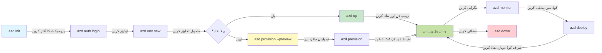
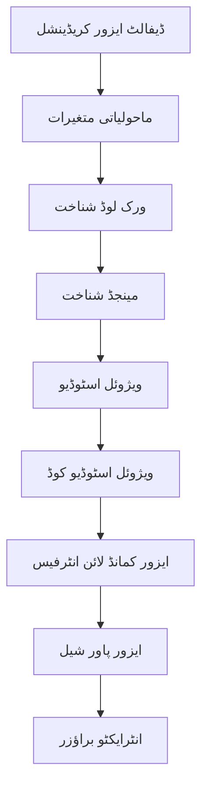

# AZD بنیادیات - Azure Developer CLI کو سمجھنا

# AZD بنیادیات - بنیادی تصورات اور اصول

**ابواب کی نیویگیشن:**
- **📚 کورس ہوم**: [ابتدائیوں کے لئے AZD](../../README.md)
- **📖 موجودہ باب**: باب 1 - بنیاد اور فوری آغاز
- **⬅️ پچھلا**: [کورس کا جائزہ](../../README.md#-chapter-1-foundation--quick-start)
- **➡️ اگلا**: [تنصیب اور ترتیب](installation.md)
- **🚀 اگلا باب**: [باب 2: AI-فرسٹ ڈویلپمنٹ](../chapter-02-ai-development/microsoft-foundry-integration.md)

## تعارف

یہ سبق آپ کو Azure Developer CLI (azd) سے متعارف کراتا ہے، جو ایک طاقتور کمانڈ لائن ٹول ہے جو آپ کے مقامی ترقی سے Azure تعیناتی کے سفر کو تیز کرتا ہے۔ آپ بنیادی تصورات، اہم خصوصیات سیکھیں گے اور سمجھیں گے کہ azd کلاؤڈ-نیٹو ایپلیکیشن کی تعیناتی کو کیسے آسان بناتا ہے۔

## سیکھنے کے اہداف

اس سبق کے آخر تک، آپ:
- سمجھیں گے کہ Azure Developer CLI کیا ہے اور اس کا بنیادی مقصد کیا ہے
- ٹمپلٹس، ماحولیات، اور خدمات کے بنیادی تصورات سیکھیں گے
- اہم خصوصیات جیسے ٹمپلٹ پر مبنی ترقی اور Infrastructure as Code دریافت کریں گے
- azd پروجیکٹ کی ساخت اور ورک فلو کو سمجھیں گے
- اپنے ترقیاتی ماحول کے لئے azd کی تنصیب اور ترتیب کے لئے تیار ہوں گے

## سیکھنے کے نتائج

اس سبق کو مکمل کرنے کے بعد، آپ قابل ہوں گے:
- جدید کلاؤڈ ترقیاتی ورک فلو میں azd کے کردار کی وضاحت کریں
- azd پروجیکٹ کی ساخت کے اجزاء کی شناخت کریں
- یہ بیان کریں کہ ٹمپلٹس، ماحولیات، اور خدمات کس طرح مل کر کام کرتی ہیں
- azd کے ساتھ Infrastructure as Code کے فوائد کو سمجھیں
- azd کے مختلف کمانڈز اور ان کے مقاصد کو پہچانیں

## Azure Developer CLI (azd) کیا ہے؟

Azure Developer CLI (azd) ایک کمانڈ لائن ٹول ہے جو آپ کے مقامی ترقی سے Azure تعیناتی کے سفر کو تیز کرنے کے لیے ڈیزائن کیا گیا ہے۔ یہ Azure پر کلاؤڈ-نیٹو ایپلیکیشنز بنانے، تعینات کرنے اور مینیج کرنے کے عمل کو آسان بناتا ہے۔

### azd کے ذریعے آپ کیا تعینات کر سکتے ہیں؟

azd بہت سی ورک لوڈز کو سپورٹ کرتا ہے—اور فہرست بڑھتی ہی رہتی ہے۔ آج، آپ azd استعمال کرتے ہوئے تعینات کر سکتے ہیں:

| ورک لوڈ کی قسم | مثالیں | کیا ایک ہی ورک فلو ہے؟ |
|---------------|----------|----------------|
| **روایتی ایپلیکیشنز** | ویب ایپس، REST APIs، سٹیٹک سائٹس | ✅ `azd up` |
| **خدمات اور مائیکروسروسز** | کنٹینر ایپس، فنکشن ایپس، ملٹی-سروس بیک اینڈز | ✅ `azd up` |
| **AI سے چلنے والی ایپلیکیشنز** | Microsoft Foundry ماڈلز کے ساتھ چیٹ ایپس، AI سرچ کے ساتھ RAG حل | ✅ `azd up` |
| **ذہین ایجنٹس** | Foundry-میزبان شدہ ایجنٹس، ملٹی ایجنٹ آرکیسٹریشن | ✅ `azd up` |

اہم بات یہ ہے کہ **azd کی لائف سائیکل آپ جو بھی تعینات کر رہے ہیں، اس کی پرواہ کیے بغیر ایک جیسی رہتی ہے**۔ آپ ایک پروجیکٹ شروع کرتے ہیں، انفراسٹرکچر پرووزن کرتے ہیں، کوڈ تعینات کرتے ہیں، اپنی ایپ مانیٹر کرتے ہیں، اور صفائی کرتے ہیں—چاہے وہ ایک سادہ ویب سائٹ ہو یا ایک پیچیدہ AI ایجنٹ۔

یہ تسلسل جان بوجھ کر ڈیزائن کیا گیا ہے۔ azd AI صلاحیتوں کو ایک اور قسم کی خدمت کے طور پر دیکھتا ہے جسے آپ کی ایپلیکیشن استعمال کر سکتی ہے، بلکہ اسے کوئی بنیادی فرق نہیں سمجھتا۔ Microsoft Foundry ماڈلز سے بیک اپ والا چیٹ اینڈ پوائنٹ azd کی نظر میں صرف ایک اور سروس ہے جسے کنفیگر اور تعینات کرنا ہے۔

### 🎯 AZD کیوں استعمال کریں؟ ایک عملی موازنہ

آئیے ایک سادہ ویب ایپ کو ڈیٹا بیس کے ساتھ تعینات کرنے کا موازنہ کرتے ہیں:

#### ❌ بغیر AZD کے: دستی Azure تعیناتی (30+ منٹ)

```bash
# مرحلہ 1: ریسورس گروپ بنائیں
az group create --name myapp-rg --location eastus

# مرحلہ 2: ایپ سروس پلان بنائیں
az appservice plan create --name myapp-plan \
  --resource-group myapp-rg \
  --sku B1 --is-linux

# مرحلہ 3: ویب ایپ بنائیں
az webapp create --name myapp-web-unique123 \
  --resource-group myapp-rg \
  --plan myapp-plan \
  --runtime "NODE:18-lts"

# مرحلہ 4: کوسموس ڈی بی اکاؤنٹ بنائیں (10-15 منٹ)
az cosmosdb create --name myapp-cosmos-unique123 \
  --resource-group myapp-rg \
  --kind MongoDB

# مرحلہ 5: ڈیٹا بیس بنائیں
az cosmosdb mongodb database create \
  --account-name myapp-cosmos-unique123 \
  --resource-group myapp-rg \
  --name tododb

# مرحلہ 6: کلیکشن بنائیں
az cosmosdb mongodb collection create \
  --account-name myapp-cosmos-unique123 \
  --resource-group myapp-rg \
  --database-name tododb \
  --name todos

# مرحلہ 7: کنکشن سٹرنگ حاصل کریں
CONN_STR=$(az cosmosdb keys list \
  --name myapp-cosmos-unique123 \
  --resource-group myapp-rg \
  --type connection-strings \
  --query "connectionStrings[0].connectionString" -o tsv)

# مرحلہ 8: ایپ سیٹنگز ترتیب دیں
az webapp config appsettings set \
  --name myapp-web-unique123 \
  --resource-group myapp-rg \
  --settings MONGODB_URI="$CONN_STR"

# مرحلہ 9: لاگنگ فعال کریں
az webapp log config --name myapp-web-unique123 \
  --resource-group myapp-rg \
  --application-logging filesystem \
  --detailed-error-messages true

# مرحلہ 10: اپلیکیشن انسائٹس سیٹ اپ کریں
az monitor app-insights component create \
  --app myapp-insights \
  --location eastus \
  --resource-group myapp-rg

# مرحلہ 11: ایپ انسائٹس کو ویب ایپ سے منسلک کریں
INSTRUMENTATION_KEY=$(az monitor app-insights component show \
  --app myapp-insights \
  --resource-group myapp-rg \
  --query "instrumentationKey" -o tsv)

az webapp config appsettings set \
  --name myapp-web-unique123 \
  --resource-group myapp-rg \
  --settings APPINSIGHTS_INSTRUMENTATIONKEY="$INSTRUMENTATION_KEY"

# مرحلہ 12: لوکل ایپلیکیشن بنائیں
npm install
npm run build

# مرحلہ 13: ڈیپلائمنٹ پیکج بنائیں
zip -r app.zip . -x "*.git*" "node_modules/*"

# مرحلہ 14: ایپلیکیشن کو تعینات کریں
az webapp deployment source config-zip \
  --resource-group myapp-rg \
  --name myapp-web-unique123 \
  --src app.zip

# مرحلہ 15: انتظار کریں اور دعا کریں کہ یہ کام کرے 🙏
# (کوئی خودکار تصدیق نہیں، دستی ٹیسٹنگ درکار)
```

**مسائل:**
- ❌ 15+ کمانڈز کو یاد رکھنا اور ترتیب سے چلانا
- ❌ 30-45 منٹ کا دستی کام
- ❌ غلطیاں کرنا آسان (ٹائپنگ کی غلطیاں، غلط پیرا میٹر)
- ❌ کنکشن سٹرنگز ٹرمینل ہسٹری میں ظاہر ہوتی ہیں
- ❌ ناکامی کی صورت میں خودکار رول بیک نہیں
- ❌ ٹیم ممبرز کیلئے نقل کرنا مشکل
- ❌ ہر بار مختلف (دوبارہ پیدا نہ کرنے والا)

#### ✅ AZD کے ساتھ: خودکار تعیناتی (5 کمانڈز، 10-15 منٹ)

```bash
# قدم 1: ٹیمپلیٹ سے ابتدائیہ کرنا
azd init --template todo-nodejs-mongo

# قدم 2: تصدیق کریں
azd auth login

# قدم 3: ماحول بنائیں
azd env new dev

# قدم 4: تبدیلیوں کا پیش نظارہ کریں (اختیاری لیکن تجویز کردہ)
azd provision --preview

# قدم 5: سب کچھ تعینات کریں
azd up

# ✨ مکمل! سب کچھ تعینات، ترتیب دیا گیا، اور نگرانی کی جا رہی ہے
```

**فائدے:**
- ✅ **5 کمانڈز** بمقابلہ 15+ دستی مراحل
- ✅ **کل وقت 10-15 منٹ** (زیادہ تر Azure کے انتظار میں)
- ✅ **کم دستی غلطیاں** - مستقل، ٹیمپلیٹ پر مبنی ورک فلو
- ✅ **محفوظ راز کی ہینڈلنگ** - کئی ٹیمپلیٹس Azure کی طرف سے منظم سیکرٹ اسٹوریج استعمال کرتے ہیں
- ✅ **دہرائے جانے والے تعینات** - ہر بار ایک ہی ورک فلو
- ✅ **مکمل طور پر قابلِ تکرار** - ہر بار ایک جیسا نتیجہ
- ✅ **ٹیم کے لئے تیار** - کوئی بھی ایک ہی کمانڈز سے تعینات کر سکتا ہے
- ✅ **انفراسٹرکچر از کوڈ** - Bicep ٹیمپلیٹس کا ورژن کنٹرول
- ✅ **بلٹ ان مانیٹرنگ** - Application Insights خود بخود کنفیگر

### 📊 وقت اور غلطی میں کمی

| پیمانہ | دستی تعیناتی | AZD تعیناتی | بہتری |
|:-------|:------------------|:---------------|:------------|
| **کمانڈز** | 15+ | 5 | 67% کم |
| **وقت** | 30-45 منٹ | 10-15 منٹ | 60% تیز |
| **غلطی کی شرح** | ~40% | <5% | 88% کمی |
| **تسلسل** | کم (دستی) | 100% (خودکار) | کامل |
| **ٹیم انبورڈنگ** | 2-4 گھنٹے | 30 منٹ | 75% تیز |
| **رول بیک وقت** | 30+ منٹ (دستی) | 2 منٹ (خودکار) | 93% تیز |

## بنیادی تصورات

### ٹیمپلیٹس  
ٹیمپلیٹس azd کی بنیاد ہیں۔ ان میں شامل ہیں:
- **ایپلیکیشن کوڈ** - آپ کا سورس کوڈ اور dependencies
- **انفراسٹرکچر کی تعریفیں** - Azure وسائل جو Bicep یا Terraform میں متعین کیے گئے ہیں
- **کنفیگریشن فائلز** - سیٹنگز اور ماحول کی متغیرات
- **تعیناتی اسکرپٹس** - خودکار تعیناتی ورک فلو

### ماحولیات  
ماحولیات مختلف تعیناتی کے اہداف کی نمائندگی کرتے ہیں:
- **توسیع** - ٹیسٹنگ اور ترقی کے لئے
- **اسٹیجنگ** - قبل از پیداوار ماحول
- **پیداوار** - لائیو پیداوار ماحول

ہر ماحول اپنا:
- Azure ریسورس گروپ
- کنفیگریشن سیٹنگز
- تعیناتی کی حالت

کباحت رکھتا ہے۔

### خدمات  
خدمات آپ کی ایپلیکیشن کے اہم اجزاء ہیں:
- **فرنٹ اینڈ** - ویب ایپلیکیشنز، SPAs
- **بیک اینڈ** - APIs، مائیکروسروسز
- **ڈیٹا بیس** - ڈیٹا اسٹوریج حل
- **اسٹوریج** - فائل اور بلاک اسٹوریج

## کلیدی خصوصیات

### 1. ٹیمپلیٹ پر مبنی ترقی
```bash
# دستیاب ٹیمپلیٹس براؤز کریں
azd template list

# ٹیمپلیٹ سے شروع کریں
azd init --template <template-name>
```

### 2. Infrastructure as Code
- **Bicep** - Azure کا ڈومین مخصوص زبان
- **Terraform** - کثیر کلاؤڈ انفراسٹرکچر ٹول
- **ARM ٹیمپلیٹس** - Azure Resource Manager ٹیمپلیٹس

### 3. مربوط ورک فلو
```bash
# مکمل تعیناتی کا ورک فلو
azd up            # پروویژن + تعینات، یہ پہلی بار سیٹ اپ کے لیے خودکار ہے

# 🧪 نیا: تعیناتی سے پہلے انفراسٹرکچر کی تبدیلیوں کا پیش نظارہ (محفوظ)
azd provision --preview    # تبدیلی کیے بغیر انفراسٹرکچر کی تعیناتی کی نقل

azd provision     # اگر آپ انفراسٹرکچر کو اپ ڈیٹ کرتے ہیں تو Azure وسائل بنائیں
azd deploy        # درخواست کا کوڈ تعینات کریں یا اپ ڈیٹ کے بعد دوبارہ تعینات کریں
azd down          # وسائل کو صاف کریں
```

#### 🛡️ پیش نظارہ کے ساتھ محفوظ انفراسٹرکچر پلاننگ  
`azd provision --preview` کمانڈ محفوظ تعینات کے لیے ایک اہم تبدیلی ہے:
- **Dry-run تجزیہ** - دکھاتا ہے کیا تخلیق، ترمیم، یا حذف کیا جائے گا
- **صفر خطرہ** - آپ کے Azure ماحول میں کوئی حقیقی تبدیلی نہیں کی جاتی
- **ٹیمی تعاون** - تعیناتی سے پہلے پیش نظارہ کے نتائج شیئر کریں
- **لاگت کی تخمینہ** - وابستہ وسائل کی لاگت سمجھیں قبل از کمٹمنٹ

```bash
# مثال پیش نظارہ ورک فلو
azd provision --preview           # دیکھیں کیا بدلے گا
# نتیجہ کا جائزہ لیں، ٹیم کے ساتھ تبادلہ خیال کریں
azd provision                     # اعتماد کے ساتھ تبدیلیاں لاگو کریں
```

### 📊 تصویری خاکہ: AZD ترقیاتی ورک فلو


```mermaid
graph LR
    A[azd init] -->|پروجیکٹ کا آغاز کریں| B[azd auth login]
    B -->|توثیق کریں| C[azd env new]
    C -->|ماحول تخلیق کریں| D{پہلا نفاذ؟}
    D -->|ہاں| E[azd up]
    D -->|نہیں| F[azd provision --preview]
    F -->|تبدیلیاں جائزہ لیں| G[azd provision]
    E -->|ترتیب دے اور نفاذ کریں| H[وسائل چل رہے ہیں]
    G -->|انفراسٹرکچر اپ ڈیٹ کرتا ہے| H
    H -->|نگرانی کریں| I[azd monitor]
    I -->|کوڈ میں تبدیلی کریں| J[azd deploy]
    J -->|صرف کوڈ دوبارہ نفاذ کریں| H
    H -->|صفائی کریں| K[azd down]
    
    style A fill:#e1f5fe
    style E fill:#c8e6c9
    style F fill:#fff9c4
    style H fill:#c5e1a5
    style K fill:#ffcdd2
```
**ورک فلو کی وضاحت:**
1. **Init** - ٹیمپلیٹ یا نیا پروجیکٹ شروع کریں
2. **Auth** - Azure کے ساتھ تصدیق کریں
3. **Environment** - الگ تھلگ تعیناتی ماحول بنائیں
4. **Preview** - 🆕 ہمیشہ انفراسٹرکچر تبدیلیوں کا پیش نظارہ کریں (محفوظ عمل)
5. **Provision** - Azure وسائل بنائیں/اپ ڈیٹ کریں
6. **Deploy** - اپنی ایپلیکیشن کوڈ دھکیلیں
7. **Monitor** - ایپلیکیشن کی کارکردگی کا مشاہدہ کریں
8. **Iterate** - تبدیلیاں کریں اور کوڈ دوبارہ تعینات کریں
9. **Cleanup** - کام ختم ہونے پر وسائل ہٹائیں

### 4. ماحولیات کا انتظام
```bash
# ماحول بنائیں اور ان کا انتظام کریں
azd env new <environment-name>
azd env select <environment-name>
azd env list
```

### 5. ایکسٹینشنز اور AI کمانڈز

azd ایکسٹینشن سسٹم استعمال کرتا ہے تاکہ بنیادی CLI سے آگے صلاحیتیں شامل کی جائیں۔ یہ خاص طور پر AI ورک لوڈز کے لیے مفید ہے:

```bash
# دستیاب توسعات کی فہرست بنائیں
azd extension list

# فاؤنڈری ایجنٹس ایکسٹینشن انسٹال کریں
azd extension install azure.ai.agents

# مینفسٹ سے AI ایجنٹ پروجیکٹ شروع کریں
azd ai agent init -m agent-manifest.yaml

# AI معاونت یافتہ ترقی کے لیے MCP سرور شروع کریں (الفا)
azd mcp start
```

> ایکسٹینشنز تفصیل سے [باب 2: AI-فرسٹ ڈویلپمنٹ](../chapter-02-ai-development/agents.md) اور [AZD AI CLI کمانڈز](../chapter-08-production/production-ai-practices.md#azd-ai-cli-commands-and-extensions) حوالہ میں بیان کی گئی ہیں۔

## 📁 پروجیکٹ کی ساخت

ایک عام azd پروجیکٹ کی ساخت:
```
my-app/
├── .azd/                    # azd configuration
│   └── config.json
├── .azure/                  # Azure deployment artifacts
├── .devcontainer/          # Development container config
├── .github/workflows/      # GitHub Actions
├── .vscode/               # VS Code settings
├── infra/                 # Infrastructure code
│   ├── main.bicep        # Main infrastructure template
│   ├── main.parameters.json
│   └── modules/          # Reusable modules
├── src/                  # Application source code
│   ├── api/             # Backend services
│   └── web/             # Frontend application
├── azure.yaml           # azd project configuration
└── README.md
```

## 🔧 کنفیگریشن فائلز

### azure.yaml  
اہم پروجیکٹ کنفیگریشن فائل:
```yaml
name: my-awesome-app
metadata:
  template: my-template@1.0.0

services:
  web:
    project: ./src/web
    language: js
    host: appservice
  api:
    project: ./src/api
    language: js
    host: appservice

hooks:
  preprovision:
    shell: pwsh
    run: echo "Preparing to provision..."
```

### .azure/config.json  
ماحول سے متعلق کنفیگریشن:
```json
{
  "version": 1,
  "defaultEnvironment": "dev",
  "environments": {
    "dev": {
      "subscriptionId": "your-subscription-id",
      "location": "eastus"
    }
  }
}
```

## 🎪 عام ورک فلو اور عملی مشقیں

> **💡 سیکھنے کا مشورہ:** اپنی AZD مہارتوں کی تدریجی ترقی کے لیے ان مشقوں کو ترتیب سے کریں۔

### 🎯 مشق 1: اپنا پہلا پروجیکٹ شروع کریں

**مقصد:** AZD پروجیکٹ بنائیں اور اس کی ساخت تلاش کریں

**اقدامات:**
```bash
# ایک ثابت شدہ ٹیمپلیٹ استعمال کریں
azd init --template todo-nodejs-mongo

# پیدا ہونے والی فائلوں کو دریافت کریں
ls -la  # تمام فائلیں بشمول پوشیدہ دیکھیں

# اہم فائلیں بنائی گئیں:
# - azure.yaml (مین کنفیگریشن)
# - infra/ (انفراسٹرکچر کوڈ)
# - src/ (ایپلیکیشن کوڈ)
```

**✅ کامیابی:** آپ کے پاس azure.yaml، infra/، اور src/ ڈائریکٹریز ہیں

---

### 🎯 مشق 2: Azure پر تعینات کریں

**مقصد:** اختتام سے اختتام تک تعیناتی مکمل کریں

**اقدامات:**
```bash
# 1. تصدیق کریں
az login && azd auth login

# 2. ماحول بنائیں
azd env new dev
azd env set AZURE_LOCATION eastus

# 3. تبدیلیوں کا جائزہ لیں (تجویز کردہ)
azd provision --preview

# 4. سب کچھ تعینات کریں
azd up

# 5. تعیناتی کی تصدیق کریں
azd show    # اپنی ایپ کا یو آر ایل دیکھیں
```

**متوقع وقت:** 10-15 منٹ  
**✅ کامیابی:** ایپلیکیشن URL براؤزر میں کھل جائے

---

### 🎯 مشق 3: متعدد ماحولیات

**مقصد:** dev اور staging پر تعینات کریں

**اقدامات:**
```bash
# پہلے سے dev موجود ہے، staging بنائیں
azd env new staging
azd env set AZURE_LOCATION westus2
azd up

# ان کے درمیان سوئچ کریں
azd env list
azd env select dev
```

**✅ کامیابی:** Azure پورٹل میں دو الگ ریسورس گروپس

---

### 🛡️ کلین اسلیٹ: `azd down --force --purge`

جب آپ کو مکمل ری سیٹ کی ضرورت ہو:

```bash
azd down --force --purge
```

**یہ کیا کرتا ہے:**
- `--force`: کوئی تصدیقی پرامپٹس نہیں
- `--purge`: تمام مقامی حالت اور Azure وسائل حذف کرتا ہے

**استعمال کریں جب:**
- تعیناتی ادھوری رہ جائے
- پروجیکٹس بدل رہے ہوں
- تازہ آغاز کی ضرورت ہو

---

## 🎪 اصل ورک فلو حوالہ

### نیا پروجیکٹ شروع کرنا
```bash
# طریقہ 1: موجودہ ٹیمپلیٹ استعمال کریں
azd init --template todo-nodejs-mongo

# طریقہ 2: شروع سے آغاز کریں
azd init

# طریقہ 3: موجودہ ڈائریکٹری استعمال کریں
azd init .
```

### ترقیاتی چکر
```bash
# ترقیاتی ماحول مرتب کریں
azd auth login
azd env new dev
azd env select dev

# سب کچھ تعینات کریں
azd up

# تبدیلیاں کریں اور دوبارہ تعینات کریں
azd deploy

# مکمل ہونے پر صفائی کریں
azd down --force --purge # Azure Developer CLI میں کمانڈ آپ کے ماحول کے لیے **سخت ری سیٹ** ہے—خاص طور پر اس وقت مفید جب آپ ناکام تعیناتیاں ٹھیک کر رہے ہوں، بے کار وسائل کو صفایا کر رہے ہوں، یا تازہ تعیناتی کی تیاری کر رہے ہوں۔
```

## `azd down --force --purge` کو سمجھنا  
`azd down --force --purge` کمانڈ آپ کے azd ماحول اور تمام متعلقہ وسائل کو مکمل طور پر ختم کرنے کا ایک طاقتور طریقہ ہے۔ یہاں ہر فلیگ کا تجزیہ ہے:
```
--force
```
- تصدیقی پرامپٹس کو چھوڑ دیتا ہے۔
- آٹومیشن یا اسکرپٹنگ میں مفید جہاں دستی ان پٹ ممکن نہ ہو۔
- اس بات کو یقینی بناتا ہے کہ آپریشن رکاوٹ کے بغیر مکمل ہو، چاہے CLI میں تضادات نظر آئیں۔

```
--purge
```
تمام متعلقہ میٹا ڈیٹا کو حذف کرتا ہے، بشمول:  
ماحول کی حالت  
مقامی `.azure` فولڈر  
کیچ شدہ تعیناتی کی معلومات  
یہ azd کو سابقہ تعیناتیوں کو "یاد رکھنے" سے روکتا ہے، جو مسائل جیسے نام میل نہ کھانے والے ریسورس گروپس یا پرانی رجسٹری حوالوں کا سبب بن سکتے ہیں۔

### دونوں کا استعمال کیوں کریں؟  
جب آپ `azd up` کے دوران جاری حالت یا جزوی تعیناتیوں کی وجہ سے مشکلات کا سامنا کرتے ہیں تو یہ امتزاج ایک **صاف آغاز** کو یقینی بناتا ہے۔  

یہ خاص طور پر Azure پورٹل میں دستی وسائل کو حذف کرنے کے بعد یا ٹیمپلیٹس، ماحولیات، یا ریسورس گروپ کے نام کی تبدیلیاں کرتے وقت مددگار ہے۔

### متعدد ماحولیات کا انتظام  
```bash
# اسٹیجنگ ماحول بنائیں
azd env new staging
azd env select staging
azd up

# دوبارہ ڈیولپمنٹ پر جائیں
azd env select dev

# ماحول کا موازنہ کریں
azd env list
```

## 🔐 توثیق اور اسناد

توثیق کو سمجھنا کامیاب azd تعیناتی کے لیے ضروری ہے۔ Azure متعدد توثیقی طریقے استعمال کرتا ہے، اور azd وہی اسناد چین استعمال کرتا ہے جو دوسرے Azure ٹولز لیتے ہیں۔

### Azure CLI توثیق (`az login`)

azd استعمال کرنے سے پہلے، آپ کو Azure کے ساتھ توثیق کرنا ہوگی۔ سب سے عام طریقہ Azure CLI کا استعمال ہے:

```bash
# انٹرایکٹو لاگ ان (براؤزر کھولتا ہے)
az login

# مخصوص کرایہ دار کے ساتھ لاگ ان کریں
az login --tenant <tenant-id>

# سروس پرنسپل کے ساتھ لاگ ان کریں
az login --service-principal -u <app-id> -p <password> --tenant <tenant-id>

# موجودہ لاگ ان کی حالت چیک کریں
az account show

# دستیاب سبسکرپشنز کی فہرست بنائیں
az account list --output table

# ڈیفالٹ سبسکرپشن سیٹ کریں
az account set --subscription <subscription-id>
```

### توثیقی بہاؤ  
1. **انٹرایکٹو لاگ ان**: آپ کے ڈیفالٹ براؤزر کو توثیق کے لیے کھولتا ہے  
2. **ڈیوائس کوڈ فلو**: ان ماحولیات کے لیے جہاں براؤزر تک رسائی نہیں  
3. **سروس پرنسپل**: آٹومیشن اور CI/CD کے منظرناموں کے لیے  
4. **مینجڈ شناخت**: Azure میزبان شدہ ایپلیکیشنز کے لیے  

### DefaultAzureCredential چین  

`DefaultAzureCredential` ایک اسناد کی قسم ہے جو ایک آسان توثیقی تجربہ فراہم کرتی ہے، خودکار طور پر متعدد اسناد ذرائع کو ایک مخصوص ترتیب میں آزما کر:

#### اسناد چین کی ترتیب  

```mermaid
graph TD
    A[ڈیفالٹ ایزور کریڈینشل] --> B[ماحولیاتی متغیرات]
    B --> C[ورک لوڈ شناخت]
    C --> D[مینجڈ شناخت]
    D --> E[ویژوئل اسٹوڈیو]
    E --> F[ویژوئل اسٹوڈیو کوڈ]
    F --> G[ایزور کمانڈ لائن انٹرفیس]
    G --> H[ایزور پاور شیل]
    H --> I[انٹرایکٹو براؤزر]
```
#### 1. ماحول کے متغیرات  
```bash
# سروس پرنسپل کے لیے ماحول کے متغیرات سیٹ کریں
export AZURE_CLIENT_ID="<app-id>"
export AZURE_CLIENT_SECRET="<password>"
export AZURE_TENANT_ID="<tenant-id>"
```

#### 2. ورک لوڈ شناخت (Kubernetes/GitHub Actions)  
خودکار استعمال میں:  
- Azure Kubernetes Service (AKS) ورک لوڈ شناخت کے ساتھ  
- GitHub Actions OIDC فیڈریشن کے ساتھ  
- دیگر متحدہ شناختی منظرنامے  

#### 3. مینجد شناخت  
Azure وسائل کے لئے جیسے:  
- ورچوئل مشینیں  
- ایپ سروس  
- Azure Functions  
- کنٹینر انسٹینسز  

```bash
# دیکھیں کہ کیا یہ Azure وسائل پر مینیجڈ شناخت کے ساتھ چل رہا ہے
az account show --query "user.type" --output tsv
# واپس کرتا ہے: "servicePrincipal" اگر مینیجڈ شناخت استعمال ہو رہی ہو
```

#### 4. ڈویلپر ٹولز انٹیگریشن  
- **Visual Studio**: خود بخود سائن ان اکاؤنٹ استعمال کرتا ہے  
- **VS Code**: Azure Account ایکسٹینشن کی اسناد استعمال کرتا ہے  
- **Azure CLI**: `az login` اسناد استعمال کرتا ہے (مقامی ترقی کے لئے سب سے عام)  

### AZD توثیق کی ترتیب

```bash
# طریقہ 1: Azure CLI استعمال کریں (ترقی کے لیے سفارش کی گئی)
az login
azd auth login  # موجودہ Azure CLI سندوں کا استعمال کرتا ہے

# طریقہ 2: براہ راست azd توثیق
azd auth login --use-device-code  # بغیر سر والے ماحول کے لیے

# طریقہ 3: توثیق کی حالت چیک کریں
azd auth login --check-status

# طریقہ 4: لاگ آؤٹ کریں اور دوبارہ توثیق کریں
azd auth logout
azd auth login
```

### توثیق کی بہترین مشقیں

#### مقامی ترقی کے لیے  
```bash
# 1. Azure CLI کے ساتھ لاگ ان کریں
az login

# 2. درست سبسکرپشن کی تصدیق کریں
az account show
az account set --subscription "Your Subscription Name"

# 3. موجودہ اسناد کے ساتھ azd استعمال کریں
azd auth login
```

#### CI/CD پائپ لائنز کے لیے  
```yaml
# GitHub Actions example
- name: Azure Login
  uses: azure/login@v1
  with:
    creds: ${{ secrets.AZURE_CREDENTIALS }}

- name: Deploy with azd
  run: |
    azd auth login --client-id ${{ secrets.AZURE_CLIENT_ID }} \
                    --client-secret ${{ secrets.AZURE_CLIENT_SECRET }} \
                    --tenant-id ${{ secrets.AZURE_TENANT_ID }}
    azd up --no-prompt
```

#### پیداوار کے ماحول کے لیے  
- جب Azure وسائل پر چل رہے ہوں تو **مینجڈ شناخت** استعمال کریں  
- آٹومیشن منظرناموں کے لیے **سروس پرنسپل** استعمال کریں  
- کوڈ یا کنفیگریشن فائلوں میں اسناد محفوظ نہ کریں  
- حساس کنفیگریشن کے لیے **Azure Key Vault** استعمال کریں  

### عام توثیقی مسائل اور حل

#### مسئلہ: "کوئی سبسکرپشن نہیں ملی"  
```bash
# حل: ڈیفالٹ سبسکرپشن سیٹ کریں
az account list --output table
az account set --subscription "<subscription-id>"
azd env set AZURE_SUBSCRIPTION_ID "<subscription-id>"
```

#### مسئلہ: "ناکافی اجازتیں"  
```bash
# حل: چیک کریں اور مطلوبہ کردار تفویض کریں
az role assignment list --assignee $(az account show --query user.name --output tsv)

# عام مطلوبہ کردار:
# - کنٹریبیوٹر (وسائل کے انتظام کے لیے)
# - یوزر ایکسیس ایڈمنسٹریٹر (کردار تفویض کرنے کے لیے)
```

#### مسئلہ: "ٹوکن کی میعاد ختم"  
```bash
# حل: دوبارہ توثیق کریں
az logout
az login
azd auth logout
azd auth login
```

### مختلف منظرناموں میں توثیق

#### مقامی ترقی  
```bash
# ذاتی ترقی کا کھاتہ
az login
azd auth login
```

#### ٹیم کی ترقی  
```bash
# تنظیم کے لیے مخصوص کرایہ دار استعمال کریں
az login --tenant contoso.onmicrosoft.com
azd auth login
```

#### کثیر کرایہ دار منظرنامے  
```bash
# کرایہ داروں کے درمیان سوئچ کریں
az login --tenant tenant1.onmicrosoft.com
# کرایہ دار 1 پر تعینات کریں
azd up

az login --tenant tenant2.onmicrosoft.com  
# کرایہ دار 2 پر تعینات کریں
azd up
```

### سیکیورٹی کے نکات
1. **کریڈینشل ذخیرہ کرنا**: کبھی بھی کریڈینشلز کو سورس کوڈ میں محفوظ نہ کریں  
2. **دائرہ کار کی حد بندی**: سروس پرنسپلز کے لیے کم از کم اختیار کا اصول استعمال کریں  
3. **ٹوکن روٹیشن**: باقاعدگی سے سروس پرنسپل سیکریٹس کو تبدیل کریں  
4. **آڈٹ ٹریل**: تصدیق اور تعیناتی کی سرگرمیوں کی نگرانی کریں  
5. **نیٹ ورک سیکیورٹی**: جہاں ممکن ہو نجی اینڈپوائنٹس استعمال کریں  

### تصدیق کے مسائل کو حل کرنا  

```bash
# توثیق کے مسائل کو ڈیبگ کریں
azd auth login --check-status
az account show
az account get-access-token

# عام تشخیصی کمانڈز
whoami                          # موجودہ صارف کا سیاق و سباق
az ad signed-in-user show      # ایزور اے ڈی صارف کی تفصیلات
az group list                  # وسائل تک رسائی کا آزمائشی جائزہ لیں
```
  
## `azd down --force --purge` کو سمجھنا  

### دریافت  
```bash
azd template list              # ٹیمپلیٹس براؤز کریں
azd template show <template>   # ٹیمپلیٹ کی تفصیلات
azd init --help               # ابتدائیہ کے اختیارات
```
  
### پروجیکٹ مینجمنٹ  
```bash
azd show                     # پروجیکٹ کا جائزہ
azd env list                # دستیاب ماحولیات اور منتخب شدہ ڈیفالٹ
azd config show            # ترتیب کی ترتیبات
```
  
### مانیٹرنگ  
```bash
azd monitor                  # کھولیں ایژر پورٹل مانیٹرنگ
azd monitor --logs           # دیکھیں درخواست کے لاگز
azd monitor --live           # دیکھیں لائیو میٹرکس
azd pipeline config          # سیٹ اپ کریں CI/CD
```
  
## بہترین طریقے  

### 1. معنی خیز نام استعمال کریں  
```bash
# اچھا
azd env new production-east
azd init --template web-app-secure

# گریز کریں
azd env new env1
azd init --template template1
```
  
### 2. ٹیمپلیٹس کا فائدہ اٹھائیں  
- موجودہ ٹیمپلیٹس سے شروع کریں  
- اپنی ضروریات کے مطابق تخصیص کریں  
- اپنی تنظیم کے لیے قابل دوبارہ استعمال ٹیمپلیٹس بنائیں  

### 3. ماحولیاتی تنہائی  
- ڈیولپمنٹ/اسٹیجنگ/پروڈ کے لیے الگ ماحول استعمال کریں  
- مقامی مشین سے براہ راست پروڈکشن میں کبھی تعیناتی نہ کریں  
- پروڈکشن تعیناتیوں کے لیے CI/CD پائپ لائنز استعمال کریں  

### 4. کنفیگریشن مینجمنٹ  
- حساس ڈیٹا کے لیے ماحول کی متغیرات استعمال کریں  
- کنفیگریشن کو ورژن کنٹرول میں رکھیں  
- ماحول مخصوص ترتیبات کو دستاویزی شکل میں لائیں  

## سیکھنے کی ترقی  

### ابتدائی (ہفتہ 1-2)  
1. azd انسٹال کریں اور خود کو تصدیق کریں  
2. ایک سادہ ٹیمپلیٹ تعینات کریں  
3. پروجیکٹ کی ساخت کو سمجھیں  
4. بنیادی کمانڈز سیکھیں (up, down, deploy)  

### متوسط (ہفتہ 3-4)  
1. ٹیمپلیٹس کو تخصیص کریں  
2. متعدد ماحول کا انتظام کریں  
3. انفراسٹرکچر کوڈ کو سمجھیں  
4. CI/CD پائپ لائنز سیٹ اپ کریں  

### اعلیٰ (ہفتہ 5+)  
1. کسٹم ٹیمپلیٹس بنائیں  
2. اعلیٰ انفراسٹرکچر پیٹرنز  
3. ملٹی ریجن تعیناتیاں  
4. انٹرپرائز گریڈ کنفیگریشنز  

## اگلے اقدامات  

**📖 باب 1 کی تعلیم جاری رکھیں:**  
- [انسٹالیشن اور سیٹ اپ](installation.md) - azd انسٹال اور کنفیگر کریں  
- [آپ کا پہلا پروجیکٹ](first-project.md) - مکمل ہینڈز آن ٹیوٹوریل  
- [کنفیگریشن گائیڈ](configuration.md) - اعلیٰ درجے کے کنفیگریشن آپشنز  

**🎯 اگلے باب کے لیے تیار ہیں؟**  
- [باب 2: AI-فرسٹ ڈیولپمنٹ](../chapter-02-ai-development/microsoft-foundry-integration.md) - AI ایپلیکیشنز بنانا شروع کریں  

## اضافی وسائل  

- [Azure Developer CLI کا جائزہ](https://learn.microsoft.com/en-us/azure/developer/azure-developer-cli/)  
- [ٹیمپلیٹ گیلری](https://azure.github.io/awesome-azd/)  
- [کمیونٹی کے نمونے](https://github.com/Azure-Samples)  

---

## 🙋 اکثر پوچھے جانے والے سوالات  

### عمومی سوالات  

**س: AZD اور Azure CLI میں کیا فرق ہے؟**  

ج: Azure CLI (`az`) انفرادی Azure وسائل کا انتظام کرنے کے لیے ہے۔ AZD (`azd`) پورے ایپلیکیشنز کا انتظام کرنے کے لیے ہے:  

```bash
# Azure CLI - کم سطح وسائل کا انتظام
az webapp create --name myapp --resource-group rg
az sql server create --name myserver --resource-group rg
# ...مزید بہت سے کمانڈز کی ضرورت ہے

# AZD - درخواست کی سطح کا انتظام
azd up  # تمام وسائل کے ساتھ مکمل ایپ کو تعینات کرتا ہے
```
  
**اس طرح سوچیں:**  
- `az` = انفرادی لیگو بلاکس پر کام کرنا  
- `azd` = مکمل لیگو سیٹس کے ساتھ کام کرنا  

---

**س: کیا AZD استعمال کرنے کے لیے مجھے Bicep یا Terraform معلوم ہونا ضروری ہے؟**  

ج: نہیں! ٹیمپلیٹس کے ساتھ شروع کریں:  
```bash
# موجودہ ٹیمپلیٹ استعمال کریں - IaC کا علم ضروری نہیں
azd init --template todo-nodejs-mongo
azd up
```
  
آپ بعد میں Bicep سیکھ سکتے ہیں تاکہ انفراسٹرکچر کو تخصیص کریں۔ ٹیمپلیٹس کام کرنے والے نمونے فراہم کرتے ہیں تاکہ آپ سیکھ سکیں۔  

---

**س: AZD ٹیمپلیٹس چلانے کی قیمت کتنی ہے؟**  

ج: قیمتیں ٹیمپلیٹ کے مطابق مختلف ہوتی ہیں۔ زیادہ تر ڈیولپمنٹ ٹیمپلیٹس کی قیمت $50-150/ماہ ہوتی ہے:  

```bash
# تعیناتی سے پہلے لاگت کا پیش نظارہ کریں
azd provision --preview

# استعمال نہ کرنے پر ہمیشہ صفائی کریں
azd down --force --purge  # تمام وسائل کو ہٹا دیتا ہے
```
  
**پرو ٹپ:** جہاں دستیاب ہوں مفت ٹائرز استعمال کریں:  
- ایپ سروس: F1 (مفت) ٹائر  
- مائیکروسافٹ فاؤنڈری ماڈل: Azure OpenAI 50,000 ٹوکنز/ماہ مفت  
- Cosmos DB: 1000 RU/s مفت ٹائر  

---

**س: کیا میں موجودہ Azure وسائل کے ساتھ AZD استعمال کر سکتا ہوں؟**  

ج: ہاں، لیکن نئے سرے سے شروع کرنا آسان ہے۔ AZD بہترین کام کرتا ہے جب یہ پورے لائف سائیکل کا انتظام کرتا ہے۔ موجودہ وسائل کے لیے:  

```bash
# آپشن 1: موجودہ وسائل درآمد کریں (اعلی درجے)
azd init
# پھر infra/ کو موجودہ وسائل کی طرف حوالہ دینے کے لیے ترمیم کریں

# آپشن 2: نیا آغاز کریں (تجویز کردہ)
azd init --template matching-your-stack
azd up  # نیا ماحول بناتا ہے
```
  
---

**س: میں اپنی پروجیکٹ ٹیم کے ساتھ کیسے شیئر کروں؟**  

ج: AZD پروجیکٹ کو Git میں کمٹ کریں (لیکن .azure فولڈر کو نہیں):  

```bash
# پہلے سے ہی .gitignore میں بطور ڈیفالٹ شامل
.azure/        # راز اور ماحولیاتی ڈیٹا شامل ہیں
*.env          # ماحولیاتی متغیرات

# ٹیم کے ارکان پھر:
git clone <your-repo>
azd auth login
azd env new <their-name>-dev
azd up
```
  
ہر کوئی ایک جیسے انفراسٹرکچر کو ایک ہی ٹیمپلیٹس سے حاصل کرتا ہے۔  

---

### مسائل کے حل کے سوالات  

**س: "azd up" آدھے راستے پر فیل ہو گیا۔ اب کیا کروں؟**  

ج: ایرر چیک کریں، درست کریں، پھر دوبارہ کوشش کریں:  

```bash
# تفصیلی لاگز دیکھیں
azd show

# عام اصلاحات:

# 1. اگر کوٹا تجاوز ہو گیا ہے:
azd env set AZURE_LOCATION "westus2"  # مختلف علاقے کی کوشش کریں

# 2. اگر وسائل کے نام میں تضاد ہو:
azd down --force --purge  # صاف ستھرا آغاز
azd up  # دوبارہ کوشش کریں

# 3. اگر توثیق کی میعاد ختم ہو گئی ہو:
az login
azd auth login
azd up
```
  
**سب سے زیادہ عام مسئلہ:** غلط Azure سبسکرپشن منتخب کرنا  
```bash
az account list --output table
az account set --subscription "<correct-subscription>"
```
  
---

**س: میں کوڈ میں تبدیلیاں صرف کیسے تعینات کروں بغیر دوبارہ پروویژننگ کے؟**  

ج: `azd up` کی بجائے `azd deploy` استعمال کریں:  

```bash
azd up          # پہلی بار: فراہم کرنا + تعینات کرنا (آہستہ)

# کوڈ میں تبدیلیاں کریں...

azd deploy      # آگلے اوقات: صرف تعینات کرنا (تیز)
```
  
رفتار کا موازنہ:  
- `azd up`: 10-15 منٹ (انفراسٹرکچر پروویژن کرتا ہے)  
- `azd deploy`: 2-5 منٹ (صرف کوڈ)  

---

**س: کیا میں انفراسٹرکچر ٹیمپلیٹس کو تخصیص کر سکتا ہوں؟**  

ج: ہاں! `infra/` فولڈر میں Bicep فائلیں ایڈٹ کریں:  

```bash
# ازڈ انٹ کے بعد
cd infra/
code main.bicep  # وی ایس کوڈ میں ترمیم کریں

# تبدیلیوں کا پیش نظارہ
azd provision --preview

# تبدیلیوں کو نافذ کریں
azd provision
```
  
**ٹپ:** چھوٹے سے شروع کریں - پہلے SKUs تبدیل کریں:  
```bicep
// infra/main.bicep
sku: {
  name: 'B1'  // Change to 'P1V2' for production
}
```
  
---

**س: میں AZD کے ذریعہ بنائے گئے تمام وسائل کیسے حذف کروں؟**  

ج: ایک کمانڈ سے تمام وسائل ہٹا دیے جاتے ہیں:  

```bash
azd down --force --purge

# یہ حذف کرتا ہے:
# - تمام ایزور وسائل
# - وسائل کا گروپ
# - مقامی ماحول کی حالت
# - محفوظ شدہ نفاذ کا ڈیٹا
```
  
**ہمیشہ یہ اس وقت چلائیں جب:**  
- ٹیمپلیٹ کے ٹیسٹ مکمل ہوں  
- کسی مختلف پروجیکٹ پر جائیں  
- نیا آغاز کرنا ہو  

**لاگت کی بچت:** غیر استعمال شدہ وسائل کو حذف کرنے سے $0 چارجز  

---

**س: اگر میں نے غلطی سے Azure پورٹل میں وسائل حذف کر دیے تو کیا کریں؟**  

ج: AZD کی حالت غیر ہم آہنگ ہو سکتی ہے۔ صاف ستھرا آغاز کرنے کا طریقہ:  

```bash
# 1۔ مقامی حالت ہٹا دیں
azd down --force --purge

# 2۔ نیا آغاز کریں
azd up

# متبادل: AZD کو پتہ لگانے اور درست کرنے دیں
azd provision  # گمشدہ وسائل بنائے گا
```
  
---

### اعلیٰ درجے کے سوالات  

**س: کیا میں AZD کو CI/CD پائپ لائنز میں استعمال کر سکتا ہوں؟**  

ج: ہاں! GitHub Actions کی مثال:  

```yaml
# .github/workflows/deploy.yml
name: Deploy with AZD

on:
  push:
    branches: [main]

jobs:
  deploy:
    runs-on: ubuntu-latest
    steps:
      - uses: actions/checkout@v2
      
      - name: Install azd
        run: curl -fsSL https://aka.ms/install-azd.sh | bash
      
      - name: Azure Login
        run: |
          azd auth login \
            --client-id ${{ secrets.AZURE_CLIENT_ID }} \
            --client-secret ${{ secrets.AZURE_CLIENT_SECRET }} \
            --tenant-id ${{ secrets.AZURE_TENANT_ID }}
      
      - name: Deploy
        run: azd up --no-prompt
```
  
---

**س: میں سیکریٹس اور حساس ڈیٹا کو کیسے ہینڈل کروں؟**  

ج: AZD خود بخود Azure Key Vault کے ساتھ انٹگریٹ ہوتا ہے:  

```bash
# خفیہ معلومات کوڈ میں نہیں بلکہ کی واؤلٹ میں محفوظ کی جاتی ہیں
azd env set DATABASE_PASSWORD "$(openssl rand -base64 32)"

# AZD خود بخود:
# 1. کی واؤلٹ بناتا ہے
# 2. خفیہ معلومات محفوظ کرتا ہے
# 3. مینیجڈ آئیڈینٹیٹی کے ذریعے ایپ کو رسائی دیتا ہے
# 4. رن ٹائم پر شامل کرتا ہے
```
  
**کبھی کمٹ نہ کریں:**  
- `.azure/` فولڈر (ماحول کا ڈیٹا ہوتا ہے)  
- `.env` فائلز (مقامی سیکریٹس)  
- کنکشن سٹرنگز  

---

**س: کیا میں متعدد ریجنز پر تعیناتی کر سکتا ہوں؟**  

ج: ہاں، ہر ریجن کے لیے الگ ماحول بنائیں:  

```bash
# مشرقی امریکہ کا ماحول
azd env new prod-eastus
azd env set AZURE_LOCATION eastus
azd up

# مغربی یورپ کا ماحول
azd env new prod-westeurope
azd env set AZURE_LOCATION westeurope
azd up

# ہر ماحول خودمختار ہوتا ہے
azd env list
```
  
اصل ملٹی ریجن ایپس کے لیے، Bicep ٹیمپلیٹس کو تخصیص کر کے مختلف ریجنز میں ایک ساتھ تعینات کریں۔  

---

**س: اگر میں پھنس جاؤں تو مدد کہاں حاصل کر سکتا ہوں؟**  

1. **AZD دستاویزات:** https://learn.microsoft.com/azure/developer/azure-developer-cli/  
2. **GitHub Issues:** https://github.com/Azure/azure-dev/issues  
3. **ڈسکارڈ:** [Azure Discord](https://discord.gg/microsoft-azure) - #azure-developer-cli چینل  
4. **Stack Overflow:** ٹیگ `azure-developer-cli`  
5. **یہ کورس:** [مسائل کے حل کی گائیڈ](../chapter-07-troubleshooting/common-issues.md)  

**پرو ٹپ:** سوال پوچھنے سے پہلے یہ چلائیں:  
```bash
azd show       # موجودہ حالت دکھاتا ہے
azd version    # آپ کا ورژن دکھاتا ہے
```
  
تیز تر مدد کے لیے یہ معلومات اپنے سوال میں شامل کریں۔  

---

## 🎓 اگلا کیا ہے؟  

اب آپ AZD کے بنیادی اصول سمجھ چکے ہیں۔ اپنی راہ منتخب کریں:  

### 🎯 ابتدائیوں کے لیے:  
1. **اگلا:** [انسٹالیشن اور سیٹ اپ](installation.md) - اپنے کمپیوٹر پر AZD انسٹال کریں  
2. **پھر:** [آپ کا پہلا پروجیکٹ](first-project.md) - اپنی پہلی ایپ تعینات کریں  
3. **مشکل کریں:** اس سبق کی تمام 3 مشقیں مکمل کریں  

### 🚀 AI ڈویلپرز کے لیے:  
1. **چھلانگ لگائیں:** [باب 2: AI-فرسٹ ڈیولپمنٹ](../chapter-02-ai-development/microsoft-foundry-integration.md)  
2. **تعینات کریں:** `azd init --template get-started-with-ai-chat` سے شروع کریں  
3. **سیکھیں:** تعیناتی کے دوران تعمیر کریں  

### 🏗️ تجربہ کار ڈویلپرز کے لیے:  
1. **جائزہ لیں:** [کنفیگریشن گائیڈ](configuration.md) - اعلیٰ ترتیبات  
2. **کھوج کریں:** [انفراسٹرکچر ایز کوڈ](../chapter-04-infrastructure/provisioning.md) - Bicep کی گہری سمجھ  
3. **بنائیں:** اپنی اسٹیک کے لیے کسٹم ٹیمپلیٹس تیار کریں  

---

**باب نیویگیشن:**  
- **📚 کورس ہوم**: [AZD برائے ابتدائی](../../README.md)  
- **📖 موجودہ باب**: باب 1 - بنیاد اور جلد آغاز  
- **⬅️ پچھلا**: [کورس جائزہ](../../README.md#-chapter-1-foundation--quick-start)  
- **➡️ اگلا**: [انسٹالیشن اور سیٹ اپ](installation.md)  
- **🚀 اگلا باب**: [باب 2: AI-فرسٹ ڈیولپمنٹ](../chapter-02-ai-development/microsoft-foundry-integration.md)

---

<!-- CO-OP TRANSLATOR DISCLAIMER START -->
**ڈس کلیمر**:  
یہ دستاویز AI ترجمہ سروس [Co-op Translator](https://github.com/Azure/co-op-translator) کا استعمال کرتے ہوئے ترجمہ کی گئی ہے۔ اگرچہ ہم درستگی کے لیے کوشاں ہیں، براہ کرم آگاہ رہیں کہ خودکار ترجمے میں غلطیاں یا عدم درستیاں ہوسکتی ہیں۔ اصل دستاویز اپنی مادری زبان میں ہی معتبر ماخذ سمجھی جانی چاہیے۔ اہم معلومات کے لیے پیشہ ور انسانی ترجمہ کی سفارش کی جاتی ہے۔ ہم اس ترجمہ کے استعمال سے پیدا ہونے والی کسی بھی غلط فہمی یا غلط تشریح کے لیے ذمہ دار نہیں ہیں۔
<!-- CO-OP TRANSLATOR DISCLAIMER END -->