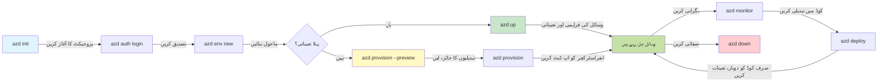
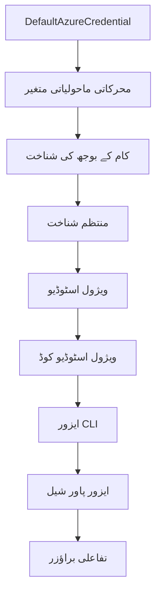

# AZD بنیادیات - Azure Developer CLI کو سمجھنا

# AZD بنیادیات - بنیادی تصورات اور اصول

**باب کی نیویگیشن:**
- **📚 کورس ہوم**: [نئے شروع کرنے والوں کے لئے AZD](../../README.md)
- **📖 موجودہ باب**: باب 1 - بنیاد اور فوری آغاز
- **⬅️ پچھلا**: [کورس کا جائزہ](../../README.md#-chapter-1-foundation--quick-start)
- **➡️ اگلا**: [انسٹالیشن اور سیٹ اپ](installation.md)
- **🚀 اگلا باب**: [باب 2: AI-First Development](../chapter-02-ai-development/microsoft-foundry-integration.md)

## تعارف

اس سبق میں آپ کو Azure Developer CLI (azd) سے تعارف کروایا جائے گا، جو ایک طاقتور کمانڈ لائن ٹول ہے جو آپ کی مقامی ترقی سے Azure پر تعیناتی کے سفر کو تیز کرتا ہے۔ آپ بنیادی تصورات، مرکزی خصوصیات سیکھیں گے اور سمجھیں گے کہ azd کس طرح کلاؤڈ نیٹو ایپلیکیشن کی تعیناتی کو آسان بناتا ہے۔

## سیکھنے کے مقاصد

اس سبق کے اختتام پر، آپ:
- جان سکیں گے کہ Azure Developer CLI کیا ہے اور اس کا بنیادی مقصد کیا ہے
- ٹیمپلیٹس، ماحول، اور خدمات کے بنیادی تصورات سیکھیں گے
- اہم خصوصیات جیسے ٹیمپلیٹ پر مبنی ترقی اور Infrastruktur بطور کوڈ دریافت کریں گے
- azd پروجیکٹ کی ساخت اور ورک فلو کو سمجھیں گے
- اپنے ترقیاتی ماحول کے لیے azd انسٹال اور ترتیب دینے کے لیے تیار ہوں گے

## سیکھنے کے نتائج

سبق مکمل کرنے کے بعد، آپ قابل ہوں گے کہ:
- جدید کلاؤڈ ڈیویلپمنٹ ورک فلو میں azd کے کردار کی وضاحت کریں
- azd پروجیکٹ ساخت کے اجزاء کی شناخت کریں
- سمجھائیں کہ ٹیمپلیٹس، ماحول، اور خدمات کس طرح مل کر کام کرتی ہیں
- azd کے ساتھ Infrastruktur بطور کوڈ کے فوائد جانیں
- مختلف azd کمانڈز اور ان کے مقاصد کو پہچانیں

## Azure Developer CLI (azd) کیا ہے؟

Azure Developer CLI (azd) ایک کمانڈ لائن ٹول ہے جو آپ کے مقامی ترقی سے Azure پر تعیناتی کے سفر کو تیز کرنے کے لیے ڈیزائن کیا گیا ہے۔ یہ Azure پر کلاؤڈ نیٹو ایپلیکیشن بنانے، تعینات کرنے، اور مینج کرنے کے عمل کو آسان بناتا ہے۔

### آپ azd کے ساتھ کیا تعینات کر سکتے ہیں؟

azd مختلف قسم کے ورک لوڈز کی حمایت کرتا ہے—اور یہ فہرست بڑھتی جا رہی ہے۔ آج آپ azd کو استعمال کرکے تعینات کر سکتے ہیں:

| ورک لوڈ کی قسم | مثالیں | کیا ایک جیسا ورک فلو ہے؟ |
|---------------|----------|----------------|
| **روایتی ایپلیکیشنز** | ویب ایپس، REST APIs، جامد سائٹس | ✅ `azd up` |
| **خدمات اور مائیکروسروسز** | کنٹینر ایپس، فنکشن ایپس، ملٹی سروس بیک اینڈ | ✅ `azd up` |
| **AI سے چلنے والی ایپلیکیشنز** | Microsoft Foundry ماڈلز کے ساتھ چیٹ ایپس، AI سرچ کے ساتھ RAG حل | ✅ `azd up` |
| **ذہین ایجنٹس** | Foundry-میزبان ایجنٹس، ملٹی ایجنٹ آرکیسٹریشنز | ✅ `azd up` |

اہم نکتہ یہ ہے کہ **azd کا لائف سائیکل آپ جو بھی تعینات کر رہے ہوں، یکساں رہتا ہے**۔ آپ ایک پروجیکٹ شروع کرتے ہیں، انفراسٹرکچر فراہم کرتے ہیں، اپنا کوڈ تعینات کرتے ہیں، ایپ کی نگرانی کرتے ہیں، اور صفائی کرتے ہیں—چاہے وہ سادہ ویب سائٹ ہو یا پیچیدہ AI ایجنٹ۔

یہ تسلسل ڈیزائن کے تحت ہے۔ azd AI صلاحیتوں کو آپ کے ایپلیکیشن کی ایک اور قسم کی سروس کے طور پر سمجھتا ہے، نہ کہ کچھ بنیادی طور پر مختلف کے طور پر۔ Microsoft Foundry ماڈلز سے چلنے والا چیٹ اینڈپوائنٹ، azd کی نظر میں، بس جو ایک اور سروس ہے جس کی ترتیب اور تعیناتی کی جاتی ہے۔

### 🎯 AZD کیوں استعمال کریں؟ ایک حقیقی دنیا کا موازنہ

آئیے ایک سادہ ویب ایپ جس میں ڈیٹا بیس ہے، کی تعیناتی کا موازنہ کرتے ہیں:

#### ❌ بغیر AZD کے: دستی Azure تعیناتی (30+ منٹ)

```bash
# مرحلہ 1: ریسورس گروپ بنائیں
az group create --name myapp-rg --location eastus

# مرحلہ 2: ایپ سروس پلان بنائیں
az appservice plan create --name myapp-plan \
  --resource-group myapp-rg \
  --sku B1 --is-linux

# مرحلہ 3: ویب ایپ بنائیں
az webapp create --name myapp-web-unique123 \
  --resource-group myapp-rg \
  --plan myapp-plan \
  --runtime "NODE:18-lts"

# مرحلہ 4: کازموس ڈی بی اکاؤنٹ بنائیں (10-15 منٹ)
az cosmosdb create --name myapp-cosmos-unique123 \
  --resource-group myapp-rg \
  --kind MongoDB

# مرحلہ 5: ڈیٹا بیس بنائیں
az cosmosdb mongodb database create \
  --account-name myapp-cosmos-unique123 \
  --resource-group myapp-rg \
  --name tododb

# مرحلہ 6: کلیکشن بنائیں
az cosmosdb mongodb collection create \
  --account-name myapp-cosmos-unique123 \
  --resource-group myapp-rg \
  --database-name tododb \
  --name todos

# مرحلہ 7: کنکشن سٹرنگ حاصل کریں
CONN_STR=$(az cosmosdb keys list \
  --name myapp-cosmos-unique123 \
  --resource-group myapp-rg \
  --type connection-strings \
  --query "connectionStrings[0].connectionString" -o tsv)

# مرحلہ 8: ایپ سیٹنگز مرتب کریں
az webapp config appsettings set \
  --name myapp-web-unique123 \
  --resource-group myapp-rg \
  --settings MONGODB_URI="$CONN_STR"

# مرحلہ 9: لاگنگ کو فعال کریں
az webapp log config --name myapp-web-unique123 \
  --resource-group myapp-rg \
  --application-logging filesystem \
  --detailed-error-messages true

# مرحلہ 10: اپلیکیشن انسائٹس سیٹ اپ کریں
az monitor app-insights component create \
  --app myapp-insights \
  --location eastus \
  --resource-group myapp-rg

# مرحلہ 11: ایپ انسائٹس کو ویب ایپ سے لنک کریں
INSTRUMENTATION_KEY=$(az monitor app-insights component show \
  --app myapp-insights \
  --resource-group myapp-rg \
  --query "instrumentationKey" -o tsv)

az webapp config appsettings set \
  --name myapp-web-unique123 \
  --resource-group myapp-rg \
  --settings APPINSIGHTS_INSTRUMENTATIONKEY="$INSTRUMENTATION_KEY"

# مرحلہ 12: مقامی طور پر ایپلیکیشن بنائیں
npm install
npm run build

# مرحلہ 13: ڈپلائمنٹ پیکیج بنائیں
zip -r app.zip . -x "*.git*" "node_modules/*"

# مرحلہ 14: ایپلیکیشن کو ڈپلائے کریں
az webapp deployment source config-zip \
  --resource-group myapp-rg \
  --name myapp-web-unique123 \
  --src app.zip

# مرحلہ 15: انتظار کریں اور دعا کریں کہ یہ کام کرے 🙏
# (کوئی خودکار تصدیق نہیں، دستی جانچ ضروری ہے)
```

**مسائل:**
- ❌ یاد رکھنے اور ترتیب میں چلانے کے لیے 15+ کمانڈز
- ❌ 30-45 منٹ کا دستی کام
- ❌ غلطیاں آسان ہیں (ٹائپنگ کی غلطیاں، غلط پیرامیٹرز)
- ❌ کنکشن اسٹرنگز ٹرمینل کی ہسٹری میں ظاہر ہو جاتی ہیں
- ❌ اگر کچھ غلط ہو تو خودکار رول بیک نہیں ہوتا
- ❌ ٹیم ممبرز کے لیے نقالی مشکل
- ❌ ہر بار مختلف (دوبارہ قابل تکرار نہیں)

#### ✅ AZD کے ساتھ: خودکار تعیناتی (5 کمانڈز، 10-15 منٹ)

```bash
# مرحلہ 1: ٹیمپلیٹ سے شروعات کریں
azd init --template todo-nodejs-mongo

# مرحلہ 2: تصدیق کریں
azd auth login

# مرحلہ 3: ماحول بنائیں
azd env new dev

# مرحلہ 4: تبدیلیوں کا پیش نظارہ کریں (اختیاری لیکن تجویز کردہ)
azd provision --preview

# مرحلہ 5: سب کچھ تعینات کریں
azd up

# ✨ مکمل! سب کچھ تعینات، تشکیل شدہ، اور نگرانی شدہ ہے
```

**فوائد:**
- ✅ **5 کمانڈز** بمقابلہ 15+ دستی مراحل
- ✅ **10-15 منٹ** کل وقت (زیادہ تر Azure کے انتظار کا)
- ✅ **کم دستی غلطیاں** - مستقل، ٹیمپلیٹ پر مبنی ورک فلو
- ✅ **محفوظ خفیہ کاری** - بہت سے ٹیمپلیٹس Azure-مدیریت شدہ راز ذخیرہ استعمال کرتے ہیں
- ✅ **دہرائے جانے والی تعیناتیاں** - ہر بار ایک جیسا ورک فلو
- ✅ **مکمل طور پر دوبارہ قابل تکرار** - ہر بار ایک جیسا نتیجہ
- ✅ **ٹیم کے لیے تیار** - کوئی بھی ایک جیسے کمانڈز کے ساتھ تعینات کر سکتا ہے
- ✅ **انفراسٹرکچر بطور کوڈ** - ورژن کنٹرول کیے گئے بائسِپ ٹیمپلیٹس
- ✅ **اندرونی مانیٹرنگ** - ایپلیکیشن انسائٹس خود بخود ترتیب دی جاتی ہے

### 📊 وقت اور غلطی میں کمی

| میٹرک | دستی تعیناتی | AZD تعیناتی | بہتری |
|:-------|:------------------|:---------------|:------------|
| **کمانڈز** | 15+ | 5 | 67% کم |
| **وقت** | 30-45 منٹ | 10-15 منٹ | 60% تیز |
| **غلطی کی شرح** | ~40% | <5% | 88% کمی |
| **تسلسل** | کم (دستی) | 100% (خودکار) | بہترین |
| **ٹیم آن بورڈنگ** | 2-4 گھنٹے | 30 منٹ | 75% تیز |
| **رول بیک کا وقت** | 30+ منٹ (دستی) | 2 منٹ (خودکار) | 93% تیز |

## بنیادی تصورات

### ٹیمپلیٹس
ٹیمپلیٹس azd کی بنیاد ہیں۔ ان میں شامل ہوتے ہیں:
- **ایپلیکیشن کوڈ** - آپ کا سورس کوڈ اور انحصار
- **انفراسٹرکچر کی تعریفیں** - Azure وسائل جو بائسِپ یا ٹیررا فارم میں متعین ہیں
- **کنفیگریشن فائلز** - سیٹنگز اور ماحول کے متغیرات
- **تعیناتی اسکرپٹس** - خودکار تعیناتی کے ورک فلو

### ماحول
ماحول مختلف تعیناتی اہداف کی نمائندگی کرتے ہیں:
- **ڈیولپمنٹ** - جانچ اور ترقی کے لیے
- **اسٹیجنگ** - قبل از پیداواری ماحول
- **پیداواری** - لائیو پیداوار ماحول

ہر ماحول اپنی خاص:
- Azure ریسورس گروپ
- کنفیگریشن سیٹنگز
- تعیناتی کی حالت

### خدمات
خدمات آپ کی ایپلیکیشن کی بلڈنگ بلاکس ہیں:
- **فرنٹ اینڈ** - ویب ایپلیکیشنز، SPAs
- **بیک اینڈ** - APIs، مائیکروسروسز
- **ڈیٹا بیس** - ڈیٹا اسٹوریج حل
- **اسٹوریج** - فائل اور بلاپ اسٹوریج

## اہم خصوصیات

### 1. ٹیمپلیٹ پر مبنی ترقی
```bash
# دستیاب ٹیمپلیٹس کو براؤز کریں
azd template list

# ٹیمپلیٹ سے شروعات کریں
azd init --template <template-name>
```

### 2. Infrastructure بطور کوڈ
- **بائسِپ** - Azure کی ڈومین مخصوص زبان
- **ٹیررا فارم** - کثیر کلاؤڈ انفراسٹرکچر ٹول
- **ARM ٹیمپلیٹس** - Azure ریسورس مینیجر ٹیمپلیٹس

### 3. مربوط ورک فلو
```bash
# مکمل تعیناتی ورک فلو
azd up            # دستیاب + تعینات یہ پہلی بار کی ترتیب کے لیے بغیر ہاتھ کے ہے

# 🧪 نیا: تعیناتی سے پہلے انفراسٹرکچر کی تبدیلیوں کا پیش منظر (محفوظ)
azd provision --preview    # تبدیلی کیے بغیر انفراسٹرکچر تعیناتی کا مشابہہ

azd provision     # اگر آپ انفراسٹرکچر کو اپ ڈیٹ کریں تو Azure وسائل بنائیں
azd deploy        # ایپلیکیشن کوڈ تعینات کریں یا اپ ڈیٹ کے بعد دوبارہ تعینات کریں
azd down          # وسائل کی صفائی کریں
```

#### 🛡️ پیش نظارہ کے ساتھ محفوظ Infrastructure کی منصوبہ بندی
`azd provision --preview` کمانڈ محفوظ تعیناتیوں کے لیے ایک گیم چینجر ہے:
- **ڈرائی رن تجزیہ** - دکھاتا ہے کہ کیا بنایا، تبدیل، یا حذف کیا جائے گا
- **صفر خطرہ** - آپ کے Azure ماحول میں کوئی حقیقی تبدیلی نہیں کی جاتی
- **ٹیم تعاون** - تعیناتی سے پہلے پیش نظارہ کے نتائج شیئر کریں
- **لاگت کا تخمینہ** - وعدہ کرنے سے پہلے وسائل کی قیمت سمجھیں

```bash
# مثال کا جائزہ ورک فلو
azd provision --preview           # دیکھیں کیا بدل جائے گا
# نتیجہ کا جائزہ لیں، ٹیم کے ساتھ بات کریں
azd provision                     # اعتماد کے ساتھ تبدیلیاں نافذ کریں
```

### 📊 بصری: AZD ترقیاتی ورک فلو


```mermaid
graph LR
    A[azd init] -->|پروجیکٹ کا آغاز کریں| B[azd auth login]
    B -->|تصدیق کریں| C[azd env new]
    C -->|ماحول بنائیں| D{پہلا تعیناتی؟}
    D -->|ہاں| E[azd up]
    D -->|نہیں| F[azd provision --preview]
    F -->|تبدیلیوں کا جائزہ لیں| G[azd provision]
    E -->|وسائل کی فراہمی اور تعیناتی| H[وسائل چل رہے ہیں]
    G -->|انفراسٹرکچر کو اپ ڈیٹ کریں| H
    H -->|نگرانی کریں| I[azd monitor]
    I -->|کوڈ میں تبدیلی کریں| J[azd deploy]
    J -->|صرف کوڈ کو دوبارہ تعینات کریں| H
    H -->|صفائی کریں| K[azd down]
    
    style A fill:#e1f5fe
    style E fill:#c8e6c9
    style F fill:#fff9c4
    style H fill:#c5e1a5
    style K fill:#ffcdd2
```

**ورک فلو کی وضاحت:**
1. **Init** - ٹیمپلیٹ یا نیا پروجیکٹ شروع کریں
2. **Auth** - Azure کے ساتھ تصدیق کریں
3. **Environment** - ایک علیحدہ تعیناتی ماحول بنائیں
4. **Preview** - 🆕 ہمیشہ پہلے infrastructure تبدیلیوں کا پیش نظارہ کریں (محفوظ عمل)
5. **Provision** - Azure وسائل بنائیں/اپ ڈیٹ کریں
6. **Deploy** - اپنا ایپلیکیشن کوڈ بھیجیں
7. **Monitor** - ایپلیکیشن کی کارکردگی ملاحظہ کریں
8. **Iterate** - تبدیلیاں کریں اور کوڈ دوبارہ تعینات کریں
9. **Cleanup** - ختم ہونے پر وسائل کو ہٹائیں

### 4. ماحول کا انتظام
```bash
# ماحول بنائیں اور ان کا انتظام کریں
azd env new <environment-name>
azd env select <environment-name>
azd env list
```

### 5. ایکسٹینشنز اور AI کمانڈز

azd ایکسٹینشن سسٹم استعمال کرتا ہے تاکہ بنیادی CLI سے مزید صلاحیتیں شامل کی جا سکیں۔ یہ خاص طور پر AI ورک لوڈز کے لیے مفید ہے:

```bash
# دستیاب توسیعات کی فہرست بنائیں
azd extension list

# فاؤنڈری ایجنٹ توسیع انسٹال کریں
azd extension install azure.ai.agents

# مینفیسٹ سے ایک AI ایجنٹ منصوبہ initialize کریں
azd ai agent init -m agent-manifest.yaml

# ایک تعینات ایجنٹ کا معائنہ کریں (تاخیر اور وقت-برائے-پہلا-بائٹ دکھائیں)
azd ai agent invoke

# AI معاونت یافتہ ترقی کے لیے MCP سرور شروع کریں (الفا)
azd mcp start
```

**ایجنٹ لائف سائیکل، ابتدا سے انتہا تک۔** جب آپ نے `azure.ai.agents` انسٹال کر لیا، تو ایک واحد ورک فلو آپ کو خیال سے چلنے والے، نگرانی شدہ ایجنٹ تک لے جاتا ہے۔ آپ کو دن ایک پر یہ سب کچھ نہیں چاہیئے—بس جان لیں کہ یہ موجود ہیں:

| مرحلہ | کمانڈ | یہ کیا کرتی ہے |
|-------|---------|--------------|
| **اسکیفولڈ** | `azd ai agent init -m <manifest>` | مینی فیسٹ سے ایجنٹ پروجیکٹ جنریٹ کریں |
| **ٹیسٹ** | `azd ai agent invoke` | ایجنٹ کو کال کریں اور جواب کی مدت دیکھیں |
| **ناپ تول** | `azd ai agent eval generate` | ایجنٹ کے لیے تشخیصی ڈیٹاسیٹ بنائیں |
| **بہتری** | `azd ai agent optimize` | اپنے ڈیٹا کے خلاف ایجنٹ کے ہدایات بہتر بنائیں |
| **معائنہ** | `azd ai agent endpoint show` | لائیو اینڈپوائنٹ کی ترتیب دیکھیں |
| **صفائی** | `azd ai agent delete` | میزبان ایجنٹ اور اس کے تمام ورژنز کو حذف کریں |

> ایکسٹینشنز کی تفصیل [باب 2: AI-First Development](../chapter-02-ai-development/agents.md) اور [AZD AI CLI کمانڈز](../chapter-08-production/production-ai-practices.md#azd-ai-cli-commands-and-extensions) حوالہ میں دی گئی ہے۔

## 📁 پروجیکٹ کی ساخت

ایک عمومی azd پروجیکٹ کی ساخت:
```
my-app/
├── .azd/                    # azd configuration
│   └── config.json
├── .azure/                  # Azure deployment artifacts
├── .devcontainer/          # Development container config
├── .github/workflows/      # GitHub Actions
├── .vscode/               # VS Code settings
├── infra/                 # Infrastructure code
│   ├── main.bicep        # Main infrastructure template
│   ├── main.parameters.json
│   └── modules/          # Reusable modules
├── src/                  # Application source code
│   ├── api/             # Backend services
│   └── web/             # Frontend application
├── azure.yaml           # azd project configuration
└── README.md
```

## 🔧 کنفیگریشن فائلز

### azure.yaml
مرکزی پروجیکٹ کنفیگریشن فائل:
```yaml
name: my-awesome-app
metadata:
  template: my-template@1.0.0

services:
  web:
    project: ./src/web
    language: js
    host: appservice
  api:
    project: ./src/api
    language: js
    host: appservice

hooks:
  preprovision:
    shell: pwsh
    run: echo "Preparing to provision..."
```

### .azure/config.json
ماحول مخصوص کنفیگریشن:
```json
{
  "version": 1,
  "defaultEnvironment": "dev",
  "environments": {
    "dev": {
      "subscriptionId": "your-subscription-id",
      "location": "eastus"
    }
  }
}
```

## 🎪 عام ورک فلو اور عملی مشقیں

> **💡 سیکھنے کی ٹپ:** اپنی AZD مہارتوں کو بتدریج بنانے کے لیے ان مشقوں کو ترتیب سے کریں۔

### 🎯 مشق 1: اپنے پہلے پروجیکٹ کی شروعات کریں

**مقصد:** ایک AZD پروجیکٹ بنائیں اور اس کی ساخت دریافت کریں

**اقدامات:**
```bash
# ایک ثابت شدہ ٹیمپلیٹ استعمال کریں
azd init --template todo-nodejs-mongo

# بنائے گئے فائلز کو دریافت کریں
ls -la  # تمام فائلز دیکھیں بشمول پوشیدہ فائلز

# بنائی گئی اہم فائلز:
# - azure.yaml (مین کنفیگریشن)
# - infra/ (انفراسٹرکچر کوڈ)
# - src/ (ایپلیکیشن کوڈ)
```

**✅ کامیابی:** آپ کے پاس azure.yaml، infra/، اور src/ ڈائریکٹریز ہیں

---

### 🎯 مشق 2: Azure پر تعینات کریں

**مقصد:** ابتدا سے آخر تک تعیناتی مکمل کریں

**اقدامات:**
```bash
# 1. توثیق کریں
az login && azd auth login

# 2. ماحول بنائیں
azd env new dev
azd env set AZURE_LOCATION eastus

# 3. تبدیلیوں کا پیش نظارہ کریں (تجویز کردہ)
azd provision --preview

# 4. سب کچھ تعینات کریں
azd up

# 5. تعیناتی کی تصدیق کریں
azd show    # اپنے ایپ کا URL دیکھیں
```

**متوقع وقت:** 10-15 منٹ  
**✅ کامیابی:** ایپلیکیشن کا URL براؤزر میں کھلتا ہے

---

### 🎯 مشق 3: متعدد ماحول

**مقصد:** dev اور staging پر تعینات کریں

**اقدامات:**
```bash
# پہلے سے ڈیو ہے، اسٹیجنگ بنائیں
azd env new staging
azd env set AZURE_LOCATION westus2
azd up

# ان کے درمیان سوئچ کریں
azd env list
azd env select dev
```

**✅ کامیابی:** Azure پورٹل میں دو الگ ریسورس گروپس

---

### 🛡️ صفائی: `azd down --force --purge`

جب آپ کو مکمل طور پر شروع سے شروع کرنا ہو:

```bash
azd down --force --purge
```

**یہ کیا کرتا ہے:**
- `--force`: کوئی تصدیقی پرامپٹس نہیں
- `--purge`: تمام مقامی حالت اور Azure وسائل حذف کر دیتا ہے

**استعمال کریں جب:**
- تعیناتی درمیان میں ناکام ہو جائے
- پروجیکٹس تبدیل کرنا ہو
- تازہ آغاز کی ضرورت ہو

---

## 🎪 اصل ورک فلو حوالہ

### نیا پروجیکٹ شروع کرنا
```bash
# طریقہ 1: موجودہ ٹیمپلیٹ استعمال کریں
azd init --template todo-nodejs-mongo

# طریقہ 2: صفر سے شروع کریں
azd init

# طریقہ 3: موجودہ ڈائریکٹری استعمال کریں
azd init .
```

### ترقیاتی سائیکل
```bash
# ترقیاتی ماحول قائم کریں
azd auth login
azd env new dev
azd env select dev

# سب کچھ تعینات کریں
azd up

# تبدیلیاں کریں اور دوبارہ تعینات کریں
azd deploy

# کام مکمل ہونے پر صفائی کریں
azd down --force --purge # Azure Developer CLI میں کمانڈ آپ کے ماحول کے لیے **سخت ری سیٹ** ہے — خاص طور پر اس وقت مفید جب آپ ناکام تعیناتیوں کو حل کر رہے ہوں، بے کار وسائل کی صفائی کر رہے ہوں، یا تازہ تعیناتی کے لیے تیاری کر رہے ہوں۔
```

## `azd down --force --purge` کو سمجھنا
`azd down --force --purge` کمانڈ آپ کے azd ماحول اور تمام منسلک وسائل کو مکمل طور پر ختم کرنے کا طاقتور طریقہ ہے۔ یہاں ہر فلیگ کا خلاصہ ہے:
```
--force
```
- تصدیقی پرامپٹس کو چھوڑ دیتا ہے۔
- خود کاری یا اسکرپٹنگ کے لیے مفید جہاں دستی ان پٹ ممکن نہیں۔
- یقینی بناتا ہے کہ بغیر کسی رکاوٹ کے ماحول ختم کیا جائے، چاہے CLI تضادات کا پتہ لگائے۔

```
--purge
```
تمام متعلقہ میٹا ڈیٹا کو حذف کر دیتا ہے، بشمول:
ماحول کی حالت
مقامی `.azure` فولڈر
کیچ شدہ تعیناتی کی معلومات
azd کو پچھلی تعیناتیوں کو "یاد" کرنے سے روکتا ہے، جو وسائل کے گروپس میں عدم تطابق یا پرانے رجسٹری حوالوں جیسے مسائل کا باعث بن سکتا ہے۔

### دونوں کا استعمال کیوں کریں؟
جب آپ `azd up` میں موجودہ حالت یا جزوی تعیناتیوں کی وجہ سے مشکلات کا سامنا کرتے ہیں، تو یہ امتزاج ایک **صاف صفحہ** یقینی بناتا ہے۔

یہ خاص طور پر Azure پورٹل میں دستی وسائل کے حذف کرنے کے بعد یا ٹیمپلیٹس، ماحول، یا ریسورس گروپ کے نام رکھنے کی روایات تبدیل کرتے وقت مددگار ہے۔

### متعدد ماحول کا انتظام
```bash
# اسٹیجنگ ماحول بنائیں
azd env new staging
azd env select staging
azd up

# واپس ڈیولپمنٹ پر جائیں
azd env select dev

# ماحول کا موازنہ کریں
azd env list
```

## 🔐 توثیق اور اسناد

توثیق کو سمجھنا کامیاب azd تعیناتیوں کے لیے ضروری ہے۔ Azure کئی توثیقی طریقے استعمال کرتا ہے، اور azd وہی اسناد چین استعمال کرتا ہے جو دوسرے Azure ٹولز استعمال کرتے ہیں۔

### Azure CLI کی توثیق (`az login`)

azd استعمال کرنے سے پہلے، آپ کو Azure کے ساتھ توثیق کرنی ہوتی ہے۔ سب سے عام طریقہ Azure CLI استعمال کرنا ہے:

```bash
# متعامل لاگ ان (براؤزر کھولتا ہے)
az login

# مخصوص کرایہ دار کے ساتھ لاگ ان کریں
az login --tenant <tenant-id>

# سروس پرنسپل کے ساتھ لاگ ان کریں
az login --service-principal -u <app-id> -p <password> --tenant <tenant-id>

# موجودہ لاگ ان کی حالت چیک کریں
az account show

# دستیاب سبسکرپشنز کی فہرست
az account list --output table

# ڈیفالٹ سبسکرپشن سیٹ کریں
az account set --subscription <subscription-id>
```

### توثیقی فلو
1. **انٹرایکٹو لاگ ان**: آپ کا ڈیفالٹ براؤزر کھولتا ہے توثیق کے لیے
2. **ڈوائس کوڈ فلو**: ایسے ماحول کے لیے جہاں براؤزر کی رسائی نہیں
3. **سروس پرنسپل**: خودکاری اور CI/CD منظرناموں کے لیے
4. **مینجڈ شناخت**: Azure میزبان ایپلیکیشنز کے لیے

### DefaultAzureCredential چین

`DefaultAzureCredential` ایک اسناد کی قسم ہے جو خود بخود متعدد اسناد ذرائع کو ایک مخصوص ترتیب میں آزما کر آسان توثیق کا تجربہ فراہم کرتی ہے:

#### اسناد چین کی ترتیب

```mermaid
graph TD
    A[DefaultAzureCredential] --> B[محرکاتی ماحولیاتی متغیر]
    B --> C[کام کے بوجھ کی شناخت]
    C --> D[منتظم شناخت]
    D --> E[ویژول اسٹوڈیو]
    E --> F[ویژول اسٹوڈیو کوڈ]
    F --> G[ایزور CLI]
    G --> H[ایزور پاور شیل]
    H --> I[تفاعلی براؤزر]
```

#### 1. ماحولیاتی متغیرات
```bash
# سروس پرنسپل کے لئے ماحول کے متغیرات مقرر کریں
export AZURE_CLIENT_ID="<app-id>"
export AZURE_CLIENT_SECRET="<password>"
export AZURE_TENANT_ID="<tenant-id>"
```

#### 2. ورک لوڈ شناخت (Kubernetes/GitHub Actions)
خود بخود استعمال ہوتی ہے:
- Azure Kubernetes Service (AKS) کے ساتھ ورک لوڈ شناخت
- GitHub Actions میں OIDC فیڈریشن کے ساتھ
- دیگر فیڈریٹیڈ شناخت کے منظرنامے

#### 3. مینجد شناخت
Azure وسائل کے لیے جیسے:
- ورچوئل مشینیں
- ایپ سروس
- Azure فنکشنز
- کنٹینر انسٹینسز

```bash
# چیک کریں کہ آیا Azure کے وسائل پر مینجڈ آئیڈینٹیٹی کے ساتھ چل رہا ہے
az account show --query "user.type" --output tsv
# واپس کرتا ہے: "servicePrincipal" اگر مینجڈ آئیڈینٹی استعمال ہو رہی ہو
```

#### 4. ڈویلپر ٹولز انٹیگریشن
- **Visual Studio**: خود بخود سائن ان کھاتے کا استعمال کرتا ہے
- **VS Code**: Azure اکاؤنٹ ایکسٹینشن کی اسناد استعمال کرتا ہے
- **Azure CLI**: `az login` اسناد استعمال کرتا ہے (مقامی ترقی کے لیے سب سے عام)

### AZD توثیق کی ترتیب

```bash
# طریقہ 1: Azure CLI استعمال کریں (ترقی کے لیے تجویز کردہ)
az login
azd auth login  # موجودہ Azure CLI اسناد استعمال کرتا ہے

# طریقہ 2: براہ راست azd تصدیق
azd auth login --use-device-code  # ہیڈ لیس ماحول کے لیے

# طریقہ 3: تصدیق کی حیثیت چیک کریں
azd auth login --check-status

# طریقہ 4: لاگ آؤٹ کریں اور دوبارہ تصدیق کریں
azd auth logout
azd auth login
```

### توثیق کی بہترین عادات

#### مقامی ترقی کے لیے
```bash
# 1. Azure CLI کے ساتھ لاگ ان کریں
az login

# 2. درست سبسکریپشن کی تصدیق کریں
az account show
az account set --subscription "Your Subscription Name"

# 3. موجودہ اسناد کے ساتھ azd استعمال کریں
azd auth login
```

#### CI/CD پائپ لائنز کے لیے
```yaml
# GitHub Actions example
- name: Azure Login
  uses: azure/login@v1
  with:
    creds: ${{ secrets.AZURE_CREDENTIALS }}

- name: Deploy with azd
  run: |
    azd auth login --client-id ${{ secrets.AZURE_CLIENT_ID }} \
                    --client-secret ${{ secrets.AZURE_CLIENT_SECRET }} \
                    --tenant-id ${{ secrets.AZURE_TENANT_ID }}
    azd up --no-prompt
```

#### پروڈکشن ماحول کے لیے
- Azure وسائل پر چلانے کے لیے **Managed Identity** استعمال کریں
- خودکار کاری کے منظرناموں کے لیے **Service Principal** استعمال کریں
- کوڈ یا کنفیگریشن فائلوں میں اسناد محفوظ کرنے سے گریز کریں
- حساس کنفیگریشن کے لیے **Azure Key Vault** استعمال کریں

### عام توثیق کے مسائل اور حل

#### مسئلہ: "کوئی سبسکرپشن نہیں ملی"
```bash
# حل: ڈیفالٹ سبسکرپشن سیٹ کریں
az account list --output table
az account set --subscription "<subscription-id>"
azd env set AZURE_SUBSCRIPTION_ID "<subscription-id>"
```

#### مسئلہ: "ناکافی اجازتیں"
```bash
# حل: مطلوبہ کردار چیک کریں اور تفویض کریں
az role assignment list --assignee $(az account show --query user.name --output tsv)

# عام مطلوبہ کردار:
# - تعاون کنندہ (وسائل کے انتظام کے لیے)
# - صارف رسائی ایڈمنسٹریٹر (کردار تفویض کے لیے)
```

#### مسئلہ: "ٹوکن ختم ہو گیا"
```bash
# حل: دوبارہ تصدیق کریں
az logout
az login
azd auth logout
azd auth login
```

### مختلف منظرناموں میں توثیق

#### مقامی ترقی
```bash
# ذاتی ترقی کا کھاتہ
az login
azd auth login
```

#### ٹیم کی ترقی
```bash
# تنظیم کے لیے مخصوص کرایہ دار استعمال کریں
az login --tenant contoso.onmicrosoft.com
azd auth login
```

#### متعدد کرایہ دار منظرنامے
```bash
# کرایہ داروں کے درمیان سوئچ کریں
az login --tenant tenant1.onmicrosoft.com
# کرایہ دار 1 پر تعینات کریں
azd up

az login --tenant tenant2.onmicrosoft.com  
# کرایہ دار 2 پر تعینات کریں
azd up
```

### سیکیورٹی کے تحفظات

1. **اسناد ذخیرہ کرنا**: اسناد کو سورس کوڈ میں کبھی نہ رکھیں
2. **حد بندی**: سروس پرنسپل کے لیے کم از کم اجازتوں کا اصول استعمال کریں
3. **ٹوکن کی تبدیلی**: سروس پرنسپل کے سیکرٹس کو باقاعدگی سے تبدیل کریں
4. **آڈٹ ٹریل**: توثیق اور تعیناتی کی سرگرمیوں کی نگرانی کریں
5. **نیٹ ورک سیکیورٹی**: ممکن ہو تو پرائیویٹ اینڈ پوائنٹس استعمال کریں

### توثیق کے مسائل کا حل

```bash
# توثیق کے مسائل کو ڈیبگ کریں
azd auth login --check-status
az account show
az account get-access-token

# عام تشخیصی کمانڈز
whoami                          # موجودہ صارف کا سیاق و سباق
az ad signed-in-user show      # مائیکروسافٹ اینٹرا آئی ڈی صارف کی تفصیلات
az group list                  # وسائل کی رسائی کا امتحان کریں
```

## `azd down --force --purge` کو سمجھنا

### دریافت
```bash
azd template list              # ٹیمپلیٹس براؤز کریں
azd template show <template>   # ٹیمپلیٹ کی تفصیلات
azd init --help               # ابتدائی اختیارات
```

### پروجیکٹ مینجمنٹ
```bash
azd show                     # پروجیکٹ کا جائزہ
azd env list                # دستیاب ماحولیات اور منتخب شدہ ڈیفالٹ
azd config show            # ترتیب کی ترتیبات
```

### نگرانی
```bash
azd monitor                  # آزور پورٹل کی نگرانی کھولیں
azd monitor --logs           # درخواست کے لاگز دیکھیں
azd monitor --live           # لائیو میٹرکس دیکھیں
azd pipeline config          # سی آئی/سی ڈی سیٹ اپ کریں
```

## بہترین طریقے

### 1. معنی خیز نام استعمال کریں
```bash
# اچھا
azd env new production-east
azd init --template web-app-secure

# اجتناب کریں
azd env new env1
azd init --template template1
```

### 2. ٹیمپلیٹس سے فائدہ اٹھائیں
- موجودہ ٹیمپلیٹس سے شروع کریں
- اپنی ضروریات کے مطابق حسبِ ضرورت بنائیں
- اپنی تنظیم کے لیے دوبارہ استعمال ہونے والے ٹیمپلیٹس بنائیں

### 3. ماحول کی علیحدگی
- dev/staging/prod کے لیے الگ ماحول استعمال کریں
- مقامی مشین سے براہ راست پروڈکشن میں تعیناتی نہ کریں
- پروڈکشن کی تعیناتی کے لیے CI/CD پائپ لائنز استعمال کریں

### 4. کنفیگریشن کا انتظام
- حساس ڈیٹا کے لیے ماحولیاتی متغیرات استعمال کریں
- کنفیگریشن کو ورژن کنٹرول میں رکھیں
- ماحول specific سیٹنگز کی دستاویزات بنائیں

## سیکھنے کی پیش رفت

### آغاز کنندہ (ہفتہ 1-2)
1. azd انسٹال کریں اور توثیق کریں
2. ایک سادہ ٹیمپلیٹ تعینات کریں
3. پروجیکٹ کی ساخت کو سمجھیں
4. بنیادی کمانڈز سیکھیں (up, down, deploy)

### درمیانی (ہفتہ 3-4)
1. ٹیمپلیٹس کو حسب ضرورت بنائیں
2. متعدد ماحول کا انتظام کریں
3. انفراسٹرکچر کوڈ کو سمجھیں
4. CI/CD پائپ لائنز سیٹ اپ کریں

### اعلی (ہفتہ 5 سے آگے)
1. حسب ضرورت ٹیمپلیٹس بنائیں
2. ہوشیار انفراسٹرکچر پیٹرنز
3. ملٹی ریجن تعیناتیاں
4. انٹرپرائز گریڈ کنفیگریشنز

## اگلے اقدامات

**📖 باب 1 کی تعلیم جاری رکھیں:**
- [تنصیب اور سیٹ اپ](installation.md) - azd انسٹال اور کنفیگر کریں
- [آپ کا پہلا پروجیکٹ](first-project.md) - ہینڈز آن ٹیوٹوریل مکمل کریں
- [کنفیگریشن گائیڈ](configuration.md) - ایڈوانس کنفیگریشن کے اختیارات

**🎯 اگلے باب کے لیے تیار؟**
- [باب 2: AI-فرسٹ ڈیولپمنٹ](../chapter-02-ai-development/microsoft-foundry-integration.md) - AI اپلیکیشنز بنانا شروع کریں

## اضافی وسائل

- [Azure Developer CLI کا جائزہ](https://learn.microsoft.com/en-us/azure/developer/azure-developer-cli/)
- [ٹیمپلیٹ گیلری](https://azure.github.io/awesome-azd/)
- [کمیونٹی سیمپلز](https://github.com/Azure-Samples)

---

## 🙋 اکثر پوچھے جانے والے سوالات

### عمومی سوالات

**س: AZD اور Azure CLI میں کیا فرق ہے؟**

ج: Azure CLI (`az`) فرد Azure وسائل کے انتظام کے لیے ہے۔ AZD (`azd`) پورے ایپلی کیشنز کے انتظام کے لیے ہے:

```bash
# ایزور سی ایل آئی - کم سطح کا وسائل کا انتظام
az webapp create --name myapp --resource-group rg
az sql server create --name myserver --resource-group rg
# ...مزید کئی کمانڈز کی ضرورت ہے

# اے زی ڈی - درخواست کی سطح کا انتظام
azd up  # تمام وسائل کے ساتھ مکمل ایپ کو تعینات کرتا ہے
```

**اس طرح سوچیں:**
- `az` = الگ الگ Lego اینٹوں پر کام کرنا
- `azd` = مکمل Lego سیٹ کے ساتھ کام کرنا

---

**س: کیا AZD استعمال کرنے کے لیے مجھے Bicep یا Terraform جاننا ضروری ہے؟**

ج: نہیں! ٹیمپلیٹس کے ساتھ شروع کریں:
```bash
# موجودہ سانچہ استعمال کریں - کسی IaC علم کی ضرورت نہیں
azd init --template todo-nodejs-mongo
azd up
```

آپ Bicep بعد میں سیکھ سکتے ہیں تاکہ انفراسٹرکچر کو حسب ضرورت بنائیں۔ ٹیمپلیٹس کام کرنے والے نمونے فراہم کرتے ہیں جن سے سیکھا جا سکتا ہے۔

---

**س: AZD ٹیمپلیٹس چلانے کی کیا لاگت ہے؟**

ج: لاگت ٹیمپلیٹ کے حساب سے مختلف ہوتی ہے۔ زیادہ تر ترقیاتی ٹیمپلیٹس کی قیمت $50-150/ماہ ہے:

```bash
# تعیناتی سے پہلے اخراجات کا پیش نظارہ کریں
azd provision --preview

# استعمال نہ کرنے پر ہمیشہ صفائی کریں
azd down --force --purge  # تمام وسائل کو ختم کرتا ہے
```

**پروف تکنیک:** جہاں دستیاب ہو مفت طبقات استعمال کریں:
- ایپ سروس: F1 (مفت) طبقه
- Microsoft Foundry ماڈلز: Azure OpenAI 50,000 ٹوکنز/ماہ مفت
- Cosmos DB: 1000 RU/s مفت طبقه

---

**س: کیا میں موجودہ Azure وسائل کے ساتھ AZD استعمال کر سکتا ہوں؟**

ج: ہاں، لیکن تازہ آغاز کرنا آسان ہے۔ AZD اس وقت بہترین کام کرتا ہے جب وہ پورے لائف سائیکل کا انتظام کرتا ہے۔ موجودہ وسائل کے لیے:

```bash
# اختیار 1: موجودہ وسائل درآمد کریں (ایڈوانسڈ)
azd init
# اس کے بعد infra/ میں ترمیم کریں تاکہ موجودہ وسائل کی طرف اشارہ ہو

# اختیار 2: نیا آغاز کریں (تجویز کردہ)
azd init --template matching-your-stack
azd up  # نیا ماحول بناتا ہے
```

---

**س: میں اپنے پروجیکٹ کو ٹیم ممبران کے ساتھ کیسے شیئر کر سکتا ہوں؟**

ج: AZD پروجیکٹ کو Git میں کمٹ کریں (لیکن .azure فولڈر کو نہیں):

```bash
# پہلے سے ہی .gitignore میں ڈیفالٹ کے طور پر
.azure/        # راز اور ماحولیاتی ڈیٹا پر مشتمل ہے
*.env          # ماحولیاتی متغیرات

# ٹیم کے اراکین پھر:
git clone <your-repo>
azd auth login
azd env new <their-name>-dev
azd up
```

ہر کوئی ایک جیسے انفراسٹرکچر کو ایک ہی ٹیمپلیٹس سے حاصل کرتا ہے۔

---

### مسئلہ حل کرنے والے سوالات

**س: "azd up" آدھے راستے میں ناکام ہو گیا۔ میں کیا کروں؟**

ج: غلطی چیک کریں، اسے درست کریں، پھر دوبارہ کوشش کریں:

```bash
# تفصیلی لاگز دیکھیں
azd show

# عام حل:

# 1۔ اگر کوٹہ تجاوز ہو گیا:
azd env set AZURE_LOCATION "westus2"  # مختلف علاقے کی کوشش کریں

# 2۔ اگر وسائل کے نام میں تصادم ہو:
azd down --force --purge  # صاف ستھرا آغاز کریں
azd up  # دوبارہ کوشش کریں

# 3۔ اگر تصدیق کی مدت ختم ہو گئی:
az login
azd auth login
azd up
```

**سب سے عام مسئلہ:** غلط Azure سبسکرپشن منتخب ہونا
```bash
az account list --output table
az account set --subscription "<correct-subscription>"
```

---

**س: کیا میں بغیر دوبارہ تعیناتی کے صرف کوڈ کی تبدیلیاں تعینات کر سکتا ہوں؟**

ج: `azd up` کے بجائے `azd deploy` استعمال کریں:

```bash
azd up          # پہلی بار: تیاری + تعیناتی (دیر سے)

# کوڈ میں تبدیلیاں کریں...

azd deploy      # بعد کے اوقات: صرف تعیناتی (تیز)
```

رفتار کا موازنہ:
- `azd up`: 10-15 منٹ (انفراسٹرکچر مہیا کرتا ہے)
- `azd deploy`: 2-5 منٹ (صرف کوڈ)

---

**س: کیا میں انفراسٹرکچر ٹیمپلیٹس کو حسب ضرورت بنا سکتا ہوں؟**

ج: جی ہاں! `infra/` میں Bicep فائلوں کو ایڈٹ کریں:

```bash
# آزڈ انِٹ کے بعد
cd infra/
code main.bicep  # وی ایس کوڈ میں ترمیم کریں

# تبدیلیوں کا پیش نظارہ کریں
azd provision --preview

# تبدیلیاں لاگو کریں
azd provision
```

**مشورہ:** چھوٹے سے شروع کریں — پہلے SKUs تبدیل کریں:
```bicep
// infra/main.bicep
sku: {
  name: 'B1'  // Change to 'P1V2' for production
}
```

---

**س: میں AZD کی بنائی ہوئی تمام چیزیں کیسے حذف کروں؟**

ج: ایک کمانڈ سے تمام وسائل ہٹا دیں:

```bash
azd down --force --purge

# یہ حذف کرتا ہے:
# - تمام Azure وسائل
# - وسیلہ گروپ
# - مقامی ماحول کی حالت
# - کیش شدہ تعیناتی کا ڈیٹا
```

**ہمیشہ یہ کربھی جب:**
- ٹیمپلیٹ کا ٹیسٹ ختم ہو گیا ہو
- مختلف پروجیکٹ پر سوئچ کر رہے ہوں
- نیا آغاز کرنا چاہتے ہوں

**لاگت کی بچت:** غیر استعمال شدہ وسائل کو حذف کرنا = $0 چارجز

---

**س: اگر میں غلطی سے Azure Portal میں وسائل حذف کر دوں تو کیا ہوتا ہے؟**

ج: AZD کی حالت ہم آہنگی سے باہر ہو سکتی ہے۔ کلین سلیٹ اپروچ:

```bash
# 1۔ مقامی حالت کو ہٹائیں
azd down --force --purge

# 2۔ نیا آغاز کریں
azd up

# متبادل: AZD کو پتہ لگانے اور صحیح کرنے دیں
azd provision  # غائب وسائل بنائیں گے
```

---

### اعلی سوالات

**س: کیا میں CI/CD پائپ لائنز میں AZD استعمال کر سکتا ہوں؟**

ج: ہاں! GitHub Actions کی مثال:

```yaml
# .github/workflows/deploy.yml
name: Deploy with AZD

on:
  push:
    branches: [main]

jobs:
  deploy:
    runs-on: ubuntu-latest
    steps:
      - uses: actions/checkout@v2
      
      - name: Install azd
        run: curl -fsSL https://aka.ms/install-azd.sh | bash
      
      - name: Azure Login
        run: |
          azd auth login \
            --client-id ${{ secrets.AZURE_CLIENT_ID }} \
            --client-secret ${{ secrets.AZURE_CLIENT_SECRET }} \
            --tenant-id ${{ secrets.AZURE_TENANT_ID }}
      
      - name: Deploy
        run: azd up --no-prompt
```

---

**س: میں راز اور حساس ڈیٹا کو کیسے سنبھالوں؟**

ج: AZD خود بخود Azure Key Vault سے مربوط ہوتا ہے:

```bash
# راز کوڈ میں نہیں بلکہ کی والٹ میں محفوظ کیے جاتے ہیں
azd env set DATABASE_PASSWORD "$(openssl rand -base64 32)"

# AZD خود بخود:
# 1. کی والٹ بناتا ہے
# 2. راز محفوظ کرتا ہے
# 3. منیجڈ شناخت کے ذریعے ایپ تک رسائی دیتا ہے
# 4. رن ٹائم پر شامل کرتا ہے
```

**کبھی کمٹ نہ کریں:**
- `.azure/` فولڈر (ماحول کا ڈیٹا ہوتا ہے)
- `.env` فائلیں (مقامی راز)
- کنکشن اسٹرنگز

---

**س: کیا میں متعدد خطوں میں تعینات کر سکتا ہوں؟**

ج: ہاں، ہر خطے کے لیے ایک ماحول بنائیں:

```bash
# مشرقی امریکہ کا ماحول
azd env new prod-eastus
azd env set AZURE_LOCATION eastus
azd up

# مغربی یورپ کا ماحول
azd env new prod-westeurope
azd env set AZURE_LOCATION westeurope
azd up

# ہر ماحول آزاد ہے
azd env list
```

سچائی میں ملٹی-ریجن ایپس کے لیے، Bicep ٹیمپلیٹس کو حسب ضرورت بنائیں تاکہ بیک وقت متعدد خطوں میں تعیناتی ہو سکے۔

---

**س: اگر میں پھنس جاؤں تو مدد کہاں حاصل کروں؟**

1. **AZD ڈاکیومنٹیشن:** https://learn.microsoft.com/azure/developer/azure-developer-cli/
2. **GitHub Issues:** https://github.com/Azure/azure-dev/issues
3. **Discord:** [Azure Discord](https://discord.gg/microsoft-azure) - #azure-developer-cli چینل
4. **Stack Overflow:** ٹیگ `azure-developer-cli`
5. **یہ کورس:** [Troubleshooting Guide](../chapter-07-troubleshooting/common-issues.md)

**پروف ٹپ:** سوال پوچھنے سے پہلے یہ چلائیں:
```bash
azd show       # موجودہ حالت دکھاتا ہے
azd version    # آپ کا ورژن دکھاتا ہے
```
فوراً مدد کے لیے اس معلومات کو اپنے سوال میں شامل کریں۔

---

## 🎓 اگلا کیا؟

اب آپ AZD کے بنیادی اصول سمجھ گئے ہیں۔ اپنا راستہ منتخب کریں:

### 🎯 ابتدائیوں کے لیے:
1. **اگلا:** [تنصیب اور سیٹ اپ](installation.md) - اپنی مشین پر AZD انسٹال کریں
2. **اس کے بعد:** [آپ کا پہلا پروجیکٹ](first-project.md) - اپنی پہلی ایپ تعینات کریں
3. **مشکل:** اس سبق میں تمام 3 مشقیں مکمل کریں

### 🚀 AI ڈیولپرز کے لیے:
1. **چھلانگ لگائیں:** [باب 2: AI-فرسٹ ڈیولپمنٹ](../chapter-02-ai-development/microsoft-foundry-integration.md)
2. **تعینات کریں:** `azd init --template get-started-with-ai-chat` سے شروع کریں
3. **سیکھیں:** تعیناتی کے دوران بنائیں

### 🏗️ تجربہ کار ڈیولپرز کے لیے:
1. **دیکھیں:** [کنفیگریشن گائیڈ](configuration.md) - ایڈوانس سیٹنگز
2. **دریافت کریں:** [انفراسٹرکچر ایز کوڈ](../chapter-04-infrastructure/provisioning.md) - Bicep کی گہری تفصیل
3. **بنائیں:** اپنی اسٹیک کے لیے حسب ضرورت ٹیمپلیٹس

---

**باب کی نیویگیشن:**
- **📚 کورس ہوم**: [AZD برائے ابتدائی](../../README.md)
- **📖 موجودہ باب**: باب 1 - بنیاد اور فوری آغاز  
- **⬅️ پچھلا**: [کورس کا جائزہ](../../README.md#-chapter-1-foundation--quick-start)
- **➡️ اگلا**: [تنصیب اور سیٹ اپ](installation.md)
- **🚀 اگلا باب**: [باب 2: AI-فرسٹ ڈیولپمنٹ](../chapter-02-ai-development/microsoft-foundry-integration.md)

---

<!-- CO-OP TRANSLATOR DISCLAIMER START -->
**ڈس کلیمر**:
یہ دستاویز AI ترجمہ سروس [Co-op Translator](https://github.com/Azure/co-op-translator) کے ذریعے ترجمہ کی گئی ہے۔ جبکہ ہم درستگی کے لیے کوشاں ہیں، براہ کرم اس بات سے آگاہ رہیں کہ خودکار ترجمے میں غلطیاں یا عدم درستیاں ہو سکتی ہیں۔ اصل دستاویز اپنے مادری زبان میں مستند ماخذ سمجھی جائے گی۔ حساس معلومات کے لیے پیشہ ور انسانی ترجمہ کی سفارش کی جاتی ہے۔ اس ترجمے کے استعمال سے پیدا ہونے والی کسی بھی غلط فہمی یا غلط تشریح کی ذمہ داری ہم قبول نہیں کرتے۔
<!-- CO-OP TRANSLATOR DISCLAIMER END -->