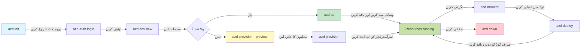
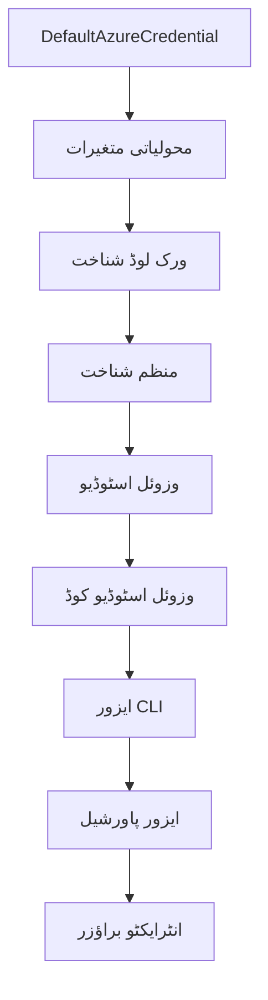

# AZD بنیادی معلومات - Azure Developer CLI کی سمجھ

# AZD بنیادی معلومات - بنیادی تصورات اور اصول

**باب کی نیویگیشن:**
- **📚 کورس ہوم**: [ابتدائیوں کے لیے AZD](../../README.md)
- **📖 موجودہ باب**: باب 1 - بنیاد اور فوری آغاز
- **⬅️ پچھلا**: [کورس کا جائزہ](../../README.md#-chapter-1-foundation--quick-start)
- **➡️ اگلا**: [انسٹالیشن اور سیٹ اپ](installation.md)
- **🚀 اگلا باب**: [باب 2: AI-فرسٹ ڈیولپمنٹ](../chapter-02-ai-development/microsoft-foundry-integration.md)

## تعارف

یہ سبق آپ کو Azure Developer CLI (azd) سے روشناس کراتا ہے، جو ایک طاقتور کمانڈ لائن ٹول ہے جو آپ کے لوکل ڈیولپمنٹ سے Azure پر تعیناتی کے سفر کو تیز کرتا ہے۔ آپ بنیادی تصورات، اہم خصوصیات سیکھیں گے اور سمجھیں گے کہ azd کس طرح کلاؤڈ نیٹیو ایپلیکیشن تعیناتی کو آسان بناتا ہے۔

## سیکھنے کے مقاصد

اس سبق کے آخر تک، آپ:
- سمجھ سکیں گے کہ Azure Developer CLI کیا ہے اور اس کا بنیادی مقصد کیا ہے
- ٹیمپلیٹس، ماحولیات، اور خدمات کے بنیادی تصورات سیکھیں گے
- اہم خصوصیات جیسے ٹیمپلیٹ سے چلنے والی ترقی اور انفراسٹرکچر از کوڈ کو جانچیں گے
- azd پروجیکٹ کے ڈھانچے اور ورک فلو کو سمجھیں گے
- azd کو آپ کے ترقیاتی ماحول کے لیے انسٹال اور کنفیگر کرنے کے لیے تیار ہوں گے

## سیکھنے کے نتائج

اس سبق کو مکمل کرنے کے بعد، آپ قابل ہوں گے:
- جدید کلاؤڈ ڈیولپمنٹ ورک فلو میں azd کے کردار کی وضاحت کرنا
- azd پروجیکٹ کے ساخت کے اجزاء کی شناخت کرنا
- وضاحت کرنا کہ ٹیمپلیٹس، ماحولیات، اور خدمات کس طرح ایک ساتھ کام کرتی ہیں
- azd کے ذریعے انفراسٹرکچر از کوڈ کے فوائد کو سمجھنا
- مختلف azd کمانڈز اور ان کے مقاصد کو پہچاننا

## Azure Developer CLI (azd) کیا ہے؟

Azure Developer CLI (azd) ایک کمانڈ لائن ٹول ہے جو آپ کے لوکل ڈیولپمنٹ سے Azure پر تعیناتی کے سفر کو تیز کرنے کے لیے ڈیزائن کیا گیا ہے۔ یہ Azure پر کلاؤڈ نیٹیو ایپلیکیشنز کی تعمیر، تعیناتی، اور انتظام کے عمل کو آسان بناتا ہے۔

### آپ azd کے ساتھ کیا تعینات کر سکتے ہیں؟

azd بہت سے کام کے بوجھ کی حمایت کرتا ہے—اور فہرست بڑھتی رہتی ہے۔ آج آپ azd کا استعمال کر کے تعینات کر سکتے ہیں:

| کام کا بوجھ کی قسم | مثالیں | ایک جیسا ورک فلو؟ |
|-------------------|---------|------------------|
| **روایتی ایپلیکیشنز** | ویب ایپس، REST APIs، جامد سائٹس | ✅ `azd up` |
| **خدمات اور مائیکرو سروسز** | کنٹینر ایپس، فنکشن ایپس، کثیرالخدمتی بیک اینڈز | ✅ `azd up` |
| **AI سے چلنے والی ایپلیکیشنز** | Microsoft Foundry ماڈلز کے ساتھ چیٹ ایپس، AI سرچ کے ساتھ RAG حل | ✅ `azd up` |
| **ذہین ایجنٹس** | Foundry ہوسٹ کردہ ایجنٹس، کثیر ایجنٹ آرکیسٹریشنز | ✅ `azd up` |

اہم بات یہ ہے کہ **azd لائف سائیکل اس سے قطع نظر ایک جیسا رہتا ہے کہ آپ کیا تعینات کر رہے ہیں**۔ آپ پروجیکٹ کو انیشئیلائز کرتے ہیں، انفراسٹرکچر پروویژن کرتے ہیں، اپنا کوڈ تعینات کرتے ہیں، ایپ کی نگرانی کرتے ہیں، اور صفائی کرتے ہیں—چاہے یہ ایک سادہ ویب سائٹ ہو یا ایک پیچیدہ AI ایجنٹ۔

یہ تسلسل ارادے کے مطابق ہے۔ azd AI صلاحیتوں کو آپ کی ایپلیکیشن کے استعمال کے لیے ایک اور قسم کی سروس کے طور پر دیکھتا ہے، نہ کہ کچھ بنیادی طور پر مختلف۔ Microsoft Foundry Models سے سپورٹ شدہ چیٹ اینڈپوائنٹ، azd کے نقطہ نظر سے، صرف ایک اور سروس ہے جسے کنفیگر اور تعینات کیا جانا ہے۔

### 🎯 کیوں AZD استعمال کریں؟ ایک عملی موازنہ

آئیں ایک سادہ ویب ایپ کے ڈیٹا بیس کے ساتھ تعیناتی کا موازنہ کریں:

#### ❌ بغیر AZD: دستی Azure تعیناتی (30+ منٹ)

```bash
# مرحلہ 1: ریسورس گروپ بنائیں
az group create --name myapp-rg --location eastus

# مرحلہ 2: ایپ سروس پلان بنائیں
az appservice plan create --name myapp-plan \
  --resource-group myapp-rg \
  --sku B1 --is-linux

# مرحلہ 3: ویب ایپ بنائیں
az webapp create --name myapp-web-unique123 \
  --resource-group myapp-rg \
  --plan myapp-plan \
  --runtime "NODE:18-lts"

# مرحلہ 4: کاسموس ڈی بی اکاؤنٹ بنائیں (10-15 منٹ)
az cosmosdb create --name myapp-cosmos-unique123 \
  --resource-group myapp-rg \
  --kind MongoDB

# مرحلہ 5: ڈیٹا بیس بنائیں
az cosmosdb mongodb database create \
  --account-name myapp-cosmos-unique123 \
  --resource-group myapp-rg \
  --name tododb

# مرحلہ 6: کلیکشن بنائیں
az cosmosdb mongodb collection create \
  --account-name myapp-cosmos-unique123 \
  --resource-group myapp-rg \
  --database-name tododb \
  --name todos

# مرحلہ 7: کنکشن اسٹرنگ حاصل کریں
CONN_STR=$(az cosmosdb keys list \
  --name myapp-cosmos-unique123 \
  --resource-group myapp-rg \
  --type connection-strings \
  --query "connectionStrings[0].connectionString" -o tsv)

# مرحلہ 8: ایپ سیٹنگز ترتیب دیں
az webapp config appsettings set \
  --name myapp-web-unique123 \
  --resource-group myapp-rg \
  --settings MONGODB_URI="$CONN_STR"

# مرحلہ 9: لاگنگ فعال کریں
az webapp log config --name myapp-web-unique123 \
  --resource-group myapp-rg \
  --application-logging filesystem \
  --detailed-error-messages true

# مرحلہ 10: اپلیکیشن انسائٹس سیٹ اپ کریں
az monitor app-insights component create \
  --app myapp-insights \
  --location eastus \
  --resource-group myapp-rg

# مرحلہ 11: ایپ انسائٹس کو ویب ایپ سے منسلک کریں
INSTRUMENTATION_KEY=$(az monitor app-insights component show \
  --app myapp-insights \
  --resource-group myapp-rg \
  --query "instrumentationKey" -o tsv)

az webapp config appsettings set \
  --name myapp-web-unique123 \
  --resource-group myapp-rg \
  --settings APPINSIGHTS_INSTRUMENTATIONKEY="$INSTRUMENTATION_KEY"

# مرحلہ 12: لوکل طور پر ایپلیکیشن تیار کریں
npm install
npm run build

# مرحلہ 13: ڈپلائمنٹ پیکیج بنائیں
zip -r app.zip . -x "*.git*" "node_modules/*"

# مرحلہ 14: ایپلیکیشن تعینات کریں
az webapp deployment source config-zip \
  --resource-group myapp-rg \
  --name myapp-web-unique123 \
  --src app.zip

# مرحلہ 15: انتظار کریں اور دعا کریں کہ یہ کام کرے 🙏
# (کوئی خودکار تصدیق نہیں، دستی جانچ کی ضرورت ہے)
```

**مسائل:**
- ❌ یاد رکھنے اور ترتیب میں چلانے کے لیے 15+ کمانڈز
- ❌ 30-45 منٹ کا دستی کام
- ❌ غلطیاں کرنے میں آسانی (ٹائپوز، غلط پیرامیٹرز)
- ❌ کنکشن سٹرنگز ٹرمینل ہسٹری میں ظاہر ہوتی ہیں
- ❌ ناکامی کی صورت میں خودکار رول بیک نہیں
- ❌ ٹیم کے دیگر اراکین کے لیے نقل کرنا مشکل
- ❌ ہر بار مختلف (نقل نہیں کیا جا سکتا)

#### ✅ AZD کے ساتھ: خودکار تعیناتی (5 کمانڈز، 10-15 منٹ)

```bash
# مرحلہ 1: سانچہ سے آغاز کریں
azd init --template todo-nodejs-mongo

# مرحلہ 2: تصدیق کریں
azd auth login

# مرحلہ 3: ماحول بنائیں
azd env new dev

# مرحلہ 4: تبدیلیوں کا جائزہ لیں (اختیاری لیکن تجویز کردہ)
azd provision --preview

# مرحلہ 5: سب کچھ تعینات کریں
azd up

# ✨ مکمل! سب کچھ تعینات، تشکیل شدہ، اور نگرانی کی گئی ہے
```

**فوائد:**
- ✅ **5 کمانڈز** بمقابلہ 15+ دستی مراحل
- ✅ **10-15 منٹ** کل وقت (زیادہ تر Azure کے انتظار میں)
- ✅ **صفر غلطیاں** - خودکار اور جانچی گئی
- ✅ **راز محفوظ طریقے سے منظم** شدہ کلید والٹ کے ذریعے
- ✅ **ناکامیوں پر خودکار رول بیک**
- ✅ **مکمل طور پر قابل باز پیدا** - ہر بار ایک جیسا نتیجہ
- ✅ **ٹیم کے لیے تیار** - کوئی بھی ایک جیسے کمانڈز سے تعینات کر سکتا ہے
- ✅ **انفراسٹرکچر از کوڈ** - ورژن کنٹرولڈ بائسک ٹیمپلیٹس
- ✅ **بلٹ ان مانیٹرنگ** - ایپلیکیشن انسائٹس خودکار طریقے سے کنفیگر

### 📊 وقت اور غلطی کی کمی

| پیمائش | دستی تعیناتی | AZD تعیناتی | بہتری |
|:-------|:-------------|:------------|:-------|
| **کمانڈز** | 15+ | 5 | 67% کم |
| **وقت** | 30-45 منٹ | 10-15 منٹ | 60% تیز |
| **غلطی کی شرح** | تقریباً 40% | <5% | 88% کمی |
| **مطابقت** | کم (دستی) | 100% (خودکار) | مکمل |
| **ٹیم آن بورڈنگ** | 2-4 گھنٹے | 30 منٹ | 75% تیز |
| **رول بیک وقت** | 30+ منٹ (دستی) | 2 منٹ (خودکار) | 93% تیز |

## بنیادی تصورات

### ٹیمپلیٹس
ٹیمپلیٹس azd کی بنیاد ہیں۔ ان میں شامل ہیں:
- **ایپلیکیشن کوڈ** - آپ کا سورس کوڈ اور انحصار
- **انفراسٹرکچر کی تعریفیں** - Azure ریسورسز جو بائسک یا Terraform میں متعین ہیں
- **کنفیگریشن فائلز** - ترتیبات اور ماحولاتی متغیرات
- **تعیناتی اسکرپٹس** - خودکار تعیناتی ورک فلو

### ماحولیات
ماحولیات مختلف تعیناتی کے ٹارگٹس کی نمائندگی کرتے ہیں:
- **ڈیولپمنٹ** - جانچ اور ترقی کے لیے
- **اسٹیجنگ** - پری پروڈکشن ماحول
- **پروڈکشن** - زندہ پروڈکشن ماحول

ہر ماحولیاتی کا اپنا ہوتا ہے:
- Azure ریسورس گروپ
- کنفیگریشن کی ترتیبات
- تعیناتی کی حالت

### خدمات
خدمات آپ کی ایپلیکیشن کے بنیادی اجزاء ہیں:
- **فرنٹ اینڈ** - ویب ایپلیکیشنز، SPAs
- **بیک اینڈ** - APIs، مائیکرو سروسز
- **ڈیٹا بیس** - ڈیٹا اسٹوریج حل
- **اسٹوریج** - فائل اور بلاک اسٹوریج

## اہم خصوصیات

### 1. ٹیمپلیٹ سے چلنے والی ترقی
```bash
# دستیاب ٹیمپلیٹس کو براؤز کریں
azd template list

# ایک ٹیمپلیٹ سے شروع کریں
azd init --template <template-name>
```

### 2. انفراسٹرکچر از کوڈ
- **بائسک** - Azure کا مخصوص زبان
- **Terraform** - ملٹی کلاؤڈ انفراسٹرکچر ٹول
- **ARM ٹیمپلیٹس** - Azure ریسورس مینیجر ٹیمپلیٹس

### 3. مربوط ورک فلو
```bash
# مکمل تعیناتی کا ورک فلو
azd up            # پروویژن + تعیناتی، پہلی بار سیٹ اپ کے لیے بغیر کسی ہاتھ کے

# 🧪 نیا: تعیناتی سے پہلے انفراسٹرکچر کی تبدیلیوں کا پیش نظارہ (محفوظ)
azd provision --preview    # تبدیلی کیے بغیر انفراسٹرکچر کی تعیناتی کی نقل کریں

azd provision     # اگر آپ انفراسٹرکچر کو اپ ڈیٹ کریں تو Azure وسائل بنائیں
azd deploy        # ایپلیکیشن کوڈ کو تعینات کریں یا اپ ڈیٹ کے بعد دوبارہ تعینات کریں
azd down          # وسائل کی صفائی کریں
```

#### 🛡️ سیف انفراسٹرکچر پلاننگ پریویو کے ساتھ
`azd provision --preview` کمانڈ محفوظ تعیناتیوں کے لیے ایک کھیل بدلنے والا ہے:
- **ڈرائی رن تجزیہ** - دکھاتا ہے کہ کیا بنایا جائے گا، ترمیم کی جائے گی، یا حذف کیا جائے گا
- **زیرو رسک** - آپ کے Azure ماحول میں کوئی اصل تبدیلی نہیں ہوتی
- **ٹیم تعاون** - تعیناتی سے پہلے پریویو نتائج شیئر کریں
- **لاگت کا اندازہ** - التزام سے پہلے وسائل کی لاگت سمجھیں

```bash
# پیش نظارہ کام کا بہاؤ کی مثال
azd provision --preview           # دیکھیں کیا بدلے گا
# نتیجہ کا جائزہ لیں، ٹیم سے بات کریں
azd provision                     # تبدیلیاں اعتماد کے ساتھ لاگو کریں
```

### 📊 بصری: AZD ڈیولپمنٹ ورک فلو


```mermaid
graph LR
    A[azd init] -->|پروجیکٹ شروع کریں| B[azd auth login]
    B -->|توثیق کریں| C[azd env new]
    C -->|محیط بنائیں| D{پہلا نفاذ؟}
    D -->|ہاں| E[azd up]
    D -->|نہیں| F[azd provision --preview]
    F -->|تبدیلیوں کا جائزہ لیں| G[azd provision]
    E -->|وسائل مہیا کریں اور نافذ کریں| H[Resources running]
    G -->|انفراسٹرکچر کو اپ ڈیٹ کریں| H
    H -->|نگرانی کریں| I[azd monitor]
    I -->|کوڈ میں تبدیلی کریں| J[azd deploy]
    J -->|صرف کوڈ کو دوبارہ نافذ کریں| H
    H -->|صفائی کریں| K[azd down]
    
    style A fill:#e1f5fe
    style E fill:#c8e6c9
    style F fill:#fff9c4
    style H fill:#c5e1a5
    style K fill:#ffcdd2
```
**ورک فلو کی وضاحت:**
1. **Init** - ٹیمپلیٹ یا نیا پروجیکٹ شروع کریں
2. **Auth** - Azure کے ساتھ تصدیق کریں
3. **Environment** - علیحدہ تعیناتی ماحولیاتی تخلیق کریں
4. **Preview** - 🆕 انفراسٹرکچر تبدیلیوں کا ہمیشہ پہلے جائزہ لیں (محفوظ عمل)
5. **Provision** - Azure وسائل بنائیں/اپ ڈیٹ کریں
6. **Deploy** - اپنی ایپلیکیشن کوڈ کو پش کریں
7. **Monitor** - ایپلیکیشن کی کارکردگی کا مشاہدہ کریں
8. **Iterate** - تبدیلیاں کریں اور کوڈ دوبارہ تعینات کریں
9. **Cleanup** - استعمال کے بعد وسائل کو ہٹائیں

### 4. ماحولیات کا انتظام
```bash
# ماحول تخلیق کریں اور ان کا انتظام کریں
azd env new <environment-name>
azd env select <environment-name>
azd env list
```

### 5. ایکسٹینشنز اور AI کمانڈز

azd ایکسٹینشن سسٹم استعمال کرتا ہے تاکہ بنیادی CLI سے آگے صلاحیتیں شامل کی جا سکیں۔ یہ خاص طور پر AI کام کے بوجھ کے لیے مفید ہے:

```bash
# دستیاب ایکسٹینشنز کی فہرست بنائیں
azd extension list

# فاؤنڈری ایجنٹس ایکسٹینشن انسٹال کریں
azd extension install azure.ai.agents

# ایک مینیفیسٹ سے AI ایجنٹ پراجیکٹ شروع کریں
azd ai agent init -m agent-manifest.yaml

# AI معاونت یافتہ ترقی کے لیے MCP سرور شروع کریں (الفا)
azd mcp start
```

> ایکسٹینشنز کی تفصیل [باب 2: AI-فرسٹ ڈیولپمنٹ](../chapter-02-ai-development/agents.md) اور [AZD AI CLI کمانڈز](../chapter-08-production/production-ai-practices.md#azd-ai-cli-commands-and-extensions) ریفرنس میں دی گئی ہے۔

## 📁 پروجیکٹ کی ساخت

ایک عام azd پروجیکٹ کی ساخت:
```
my-app/
├── .azd/                    # azd configuration
│   └── config.json
├── .azure/                  # Azure deployment artifacts
├── .devcontainer/          # Development container config
├── .github/workflows/      # GitHub Actions
├── .vscode/               # VS Code settings
├── infra/                 # Infrastructure code
│   ├── main.bicep        # Main infrastructure template
│   ├── main.parameters.json
│   └── modules/          # Reusable modules
├── src/                  # Application source code
│   ├── api/             # Backend services
│   └── web/             # Frontend application
├── azure.yaml           # azd project configuration
└── README.md
```

## 🔧 کنفیگریشن فائلز

### azure.yaml
مرکزی پروجیکٹ کنفیگریشن فائل:
```yaml
name: my-awesome-app
metadata:
  template: my-template@1.0.0

services:
  web:
    project: ./src/web
    language: js
    host: appservice
  api:
    project: ./src/api
    language: js
    host: appservice

hooks:
  preprovision:
    shell: pwsh
    run: echo "Preparing to provision..."
```

### .azure/config.json
ماحول مخصوص کنفیگریشن:
```json
{
  "version": 1,
  "defaultEnvironment": "dev",
  "environments": {
    "dev": {
      "subscriptionId": "your-subscription-id",
      "location": "eastus"
    }
  }
}
```

## 🎪 عام ورک فلو ہاتھ سے کرنے کی مشقیں

> **💡 سیکھنے کا مشورہ:** اپنے AZD کی مہارتوں کو بتدریج بنانے کے لیے ان مشقوں کو ترتیب سے کریں۔

### 🎯 مشق 1: اپنا پہلا پروجیکٹ انیشئیلائز کریں

**مقصد:** ایک AZD پروجیکٹ بنائیں اور اس کی ساخت کو دریافت کریں

**مراحل:**
```bash
# ایک ثابت شدہ ٹیمپلیٹ استعمال کریں
azd init --template todo-nodejs-mongo

# تیار شدہ فائلوں کو دریافت کریں
ls -la  # تمام فائلیں بشمول پوشیدہ فائلیں دیکھیں

# اہم فائلیں تخلیق کی گئیں:
# - azure.yaml (مرکزی ترتیب)
# - infra/ (انفراسٹرکچر کوڈ)
# - src/ (ایپلیکیشن کوڈ)
```

**✅ کامیابی:** آپ کے پاس azure.yaml، infra/، اور src/ ڈائریکٹریاں ہیں

---

### 🎯 مشق 2: Azure پر تعینات کریں

**مقصد:** ابتدا تا انتہا تعیناتی مکمل کریں

**مراحل:**
```bash
# 1۔ تصدیق کریں
az login && azd auth login

# 2۔ ماحول بنائیں
azd env new dev
azd env set AZURE_LOCATION eastus

# 3۔ تبدیلیاں دیکھیں (تجویز کردہ)
azd provision --preview

# 4۔ سب کچھ تعینات کریں
azd up

# 5۔ تعیناتی کی تصدیق کریں
azd show    # اپنا ایپ URL دیکھیں
```

**متوقع وقت:** 10-15 منٹ  
**✅ کامیابی:** ایپلیکیشن کا URL براؤزر میں کھلتا ہے

---

### 🎯 مشق 3: متعدد ماحولیات

**مقصد:** dev اور staging میں تعینات کریں

**مراحل:**
```bash
# پہلے سے dev موجود ہے، staging بنائیں
azd env new staging
azd env set AZURE_LOCATION westus2
azd up

# ان دونوں کے درمیان سوئچ کریں
azd env list
azd env select dev
```

**✅ کامیابی:** Azure پورٹل میں دو علیحدہ ریسورس گروپس

---

### 🛡️ صاف صفحہ: `azd down --force --purge`

جب آپ کو مکمل طور پر دوبارہ شروع کرنا ہو:

```bash
azd down --force --purge
```

**یہ کیا کرتا ہے:**
- `--force`: کوئی تصدیقی پیغامات نہیں
- `--purge`: تمام مقامی حالت اور Azure وسائل حذف کر دیتا ہے

**استعمال کریں جب:**
- تعیناتی درمیان میں ناکام ہو گئی ہو
- پروجیکٹ تبدیل کر رہے ہوں
- نیا آغاز چاہیے

---

## 🎪 اصل ورک فلو ریفرنس

### نیا پروجیکٹ شروع کرنا
```bash
# طریقہ 1: موجودہ ٹیمپلیٹ استعمال کریں
azd init --template todo-nodejs-mongo

# طریقہ 2: صفر سے شروع کریں
azd init

# طریقہ 3: موجودہ ڈائریکٹری استعمال کریں
azd init .
```

### ترقیاتی سائیکل
```bash
# ترقیاتی ماحول قائم کریں
azd auth login
azd env new dev
azd env select dev

# سب کچھ تعینات کریں
azd up

# تبدیلیاں کریں اور دوبارہ تعینات کریں
azd deploy

# کام مکمل ہونے پر صفائی کریں
azd down --force --purge # Azure Developer CLI میں کمانڈ آپ کے ماحول کے لیے **سخت ری سیٹ** ہے—خاص طور پر تب مفید جب آپ ناکام تعیناتیاں ٹھیک کر رہے ہوں، چھوڑ دیے گئے وسائل کی صفائی کر رہے ہوں، یا دوبارہ تعیناتی کے لیے تیار ہو رہے ہوں۔
```

## `azd down --force --purge` کی سمجھ

`azd down --force --purge` کمانڈ آپ کے azd ماحول اور اس سے منسلک تمام وسائل کو مکمل طور پر ختم کرنے کا طاقتور طریقہ ہے۔ ہر فلیگ کیا کرتا ہے اس کی تفصیل درج ذیل ہے:

```
--force
```
- تصدیقی پیغامات کو نظر انداز کرتا ہے۔  
- خودکاری یا اسکرپٹنگ کے لیے مفید جہاں دستی اندراج ممکن نہ ہو۔  
- یقینی بناتا ہے کہ اگر CLI تضادات پہچانے بھی تو رکاوٹ کے بغیر ختم کرے۔

```
--purge
```
تمام متعلقہ میٹا ڈیٹا حذف کر دیتا ہے، بشمول:  
ماحولیاتی حالت  
مقامی `.azure` فولڈر  
کیچ شدہ تعیناتی معلومات  
azd کو پچھلی تعیناتیاں "یاد رکھنے" سے روکتا ہے، جو وسائل گروپس کے عدم مطابقت یا پرانے رجسٹری حوالہ جات جیسے مسائل پیدا کر سکتی ہیں۔

### دونوں کیوں استعمال کریں؟

جب `azd up` کے ساتھ ناپسندیدہ حالت یا جزوی تعیناتیوں کی وجہ سے رکاوٹ پیش آئے، تو یہ امتزاج ایک **صاف صفحہ** کو یقینی بناتا ہے۔

یہ خاص طور پر Azure پورٹل میں دستی وسائل کو حذف کرنے کے بعد یا ٹیمپلیٹس، ماحولیات، یا ریسورس گروپ ناموں کی تبدیلی کے وقت مفید ہے۔

### متعدد ماحولیات کا انتظام
```bash
# اسٹیجنگ ماحول بنائیں
azd env new staging
azd env select staging
azd up

# دوبارہ ڈیولپمنٹ میں جائیں
azd env select dev

# ماحول کا موازنہ کریں
azd env list
```

## 🔐 تصدیق کاری اور اسناد

تصدیق کی سمجھ azd تعیناتیوں میں کامیابی کے لیے بہت ضروری ہے۔ Azure متعدد تصدیقی طریقے استعمال کرتا ہے، اور azd وہی اسناد چین استعمال کرتا ہے جو دوسرے Azure ٹولز استعمال کرتے ہیں۔

### Azure CLI تصدیق (`az login`)

azd استعمال کرنے سے پہلے، آپ کو Azure کے ساتھ تصدیق کرنی ہوگی۔ سب سے عام طریقہ Azure CLI کا استعمال ہے:

```bash
# انٹرایکٹو لاگ ان (براؤزر کھولتا ہے)
az login

# مخصوص کرایہ دار کے ساتھ لاگ ان کریں
az login --tenant <tenant-id>

# سروس پرنسپل کے ساتھ لاگ ان کریں
az login --service-principal -u <app-id> -p <password> --tenant <tenant-id>

# موجودہ لاگ ان کی حالت چیک کریں
az account show

# دستیاب سبسکرپشنز کی فہرست بنائیں
az account list --output table

# ڈیفالٹ سبسکرپشن سیٹ کریں
az account set --subscription <subscription-id>
```

### تصدیقی فلو
1. **انٹریکٹو لاگ ان**: آپ کے ڈیفالٹ براؤزر کو کھول کر تصدیق
2. **ڈیوائس کوڈ فلو**: ان ماحول کے لیے جن میں براؤزر تک رسائی نہیں
3. **سروس پرنسپل**: خودکاری اور CI/CD میں استعمال کے لیے
4. **مینجڈ آئیڈینٹٹی**: Azure پر میزبانی شدہ ایپلیکیشنز کے لیے

### DefaultAzureCredential چین

`DefaultAzureCredential` ایک ایسا قسم کا کرڈینشل ہے جو ایک سادہ تصدیقی تجربہ فراہم کرتا ہے اور خود بخود متعدد کرڈینشل ذرائع کو مخصوص ترتیب میں آزما جاتا ہے:

#### کرڈینشل چین کی ترتیب

```mermaid
graph TD
    A[DefaultAzureCredential] --> B[محولیاتی متغیرات]
    B --> C[ورک لوڈ شناخت]
    C --> D[منظم شناخت]
    D --> E[وزوئل اسٹوڈیو]
    E --> F[وزوئل اسٹوڈیو کوڈ]
    F --> G[ایزور CLI]
    G --> H[ایزور پاورشیل]
    H --> I[انٹرایکٹو براؤزر]
```
#### 1. ماحول کے متغیرات
```bash
# سروس پرنسپل کے لیے ماحول کے متغیرات سیٹ کریں
export AZURE_CLIENT_ID="<app-id>"
export AZURE_CLIENT_SECRET="<password>"
export AZURE_TENANT_ID="<tenant-id>"
```

#### 2. ورکلوڈ آئیڈینٹٹی (Kubernetes/GitHub Actions)
خودکار طریقے سے استعمال ہوتا ہے:  
- Azure Kubernetes Service (AKS) میں ورکلوڈ آئیڈینٹٹی کے ساتھ  
- GitHub Actions میں OIDC فیڈریشن کے ساتھ  
- دیگر وفاقی شناخت کے مناظر

#### 3. مینجد آئیڈینٹٹی
Azure وسائل کے لیے جیسے:  
- ورچوئل مشینز  
- ایپ سروس  
- Azure فنکشنز  
- کنٹینر انسٹینسز

```bash
# چیک کریں کہ آیا Azure وسائل پر منیجڈ شناخت کے ساتھ چل رہا ہے
az account show --query "user.type" --output tsv
# واپس کرتا ہے: "servicePrincipal" اگر منیجڈ شناخت استعمال کی جا رہی ہو
```

#### 4. ڈیولپر ٹولز انٹیگریشن
- **Visual Studio**: خودکار طریقے سے سائن ان اکاؤنٹ استعمال کرتا ہے  
- **VS Code**: Azure اکاؤنٹ ایکسٹینشن کی اسناد استعمال کرتا ہے  
- **Azure CLI**: `az login` اسناد استعمال کرتا ہے (لوکل ترقی کے لیے سب سے عام)

### AZD تصدیقی سیٹ اپ

```bash
# طریقہ 1: Azure CLI استعمال کریں (ترقی کے لیے سفارش کی جاتی ہے)
az login
azd auth login  # موجودہ Azure CLI اسناد استعمال کرتا ہے

# طریقہ 2: براہ راست azd توثیق
azd auth login --use-device-code  # ہیڈ لیس ماحول کے لیے

# طریقہ 3: توثیق کی حیثیت چیک کریں
azd auth login --check-status

# طریقہ 4: لاگ آؤٹ کریں اور دوبارہ توثیق کریں
azd auth logout
azd auth login
```

### تصدیق کے بہترین طریقے

#### لوکل ڈیولپمنٹ کے لیے
```bash
# 1. Azure CLI کے ساتھ لاگ ان کریں
az login

# 2. صحیح سبسکرپشن کی تصدیق کریں
az account show
az account set --subscription "Your Subscription Name"

# 3. موجودہ اسناد کے ساتھ azd استعمال کریں
azd auth login
```

#### CI/CD پائپ لائنز کے لیے
```yaml
# GitHub Actions example
- name: Azure Login
  uses: azure/login@v1
  with:
    creds: ${{ secrets.AZURE_CREDENTIALS }}

- name: Deploy with azd
  run: |
    azd auth login --client-id ${{ secrets.AZURE_CLIENT_ID }} \
                    --client-secret ${{ secrets.AZURE_CLIENT_SECRET }} \
                    --tenant-id ${{ secrets.AZURE_TENANT_ID }}
    azd up --no-prompt
```

#### پروڈکشن ماحول کے لیے
- **مینجڈ آئیڈینٹٹی** استعمال کریں جب Azure وسائل پر چل رہے ہوں  
- خودکاری کے مناظر کے لیے **سروس پرنسپل** استعمال کریں  
- کوڈ یا کنفیگریشن فائلوں میں اسناد محفوظ نہ کریں  
- حساس کنفیگریشن کے لیے **Azure Key Vault** استعمال کریں

### عام تصدیقی مسائل اور حل

#### مسئلہ: "کوئی سبسکرپشن نہیں ملی"
```bash
# حل: ڈیفالٹ سبسکرپشن سیٹ کریں
az account list --output table
az account set --subscription "<subscription-id>"
azd env set AZURE_SUBSCRIPTION_ID "<subscription-id>"
```

#### مسئلہ: "ناکافی اجازتیں"
```bash
# حل: مطلوب کردار چیک کریں اور تفویض کریں
az role assignment list --assignee $(az account show --query user.name --output tsv)

# عام مطلوبہ کردار:
# - کنٹریبیوٹر (وسائل کے انتظام کے لیے)
# - یوزر ایکسیس ایڈمنسٹریٹر (کردار تفویض کے لیے)
```

#### مسئلہ: "ٹوکن کی مدت ختم"
```bash
# حل: دوبارہ توثیق کریں
az logout
az login
azd auth logout
azd auth login
```

### مختلف مناظر میں تصدیق

#### لوکل ڈیولپمنٹ
```bash
# ذاتی ترقیاتی اکاؤنٹ
az login
azd auth login
```

#### ٹیم ڈیولپمنٹ
```bash
# تنظیم کے لیے مخصوص کرایہ دار استعمال کریں
az login --tenant contoso.onmicrosoft.com
azd auth login
```

#### ملٹی ٹیننٹ مناظر
```bash
# کرایہ داروں کے درمیان سوئچ کریں
az login --tenant tenant1.onmicrosoft.com
# کرایہ دار 1 پر تعینات کریں
azd up

az login --tenant tenant2.onmicrosoft.com  
# کرایہ دار 2 پر تعینات کریں
azd up
```

### سیکیورٹی کے پہلوؤں
1. **کریدنشل اسٹوریج**: کدی کریدنشلز کو سورس کوڈ میں محفوظ نہ کریں  
2. **سکوپ کی محدودیت**: سروس پرنسپلز کے لیے سب سے کم مراعات کا اصول استعمال کریں  
3. **ٹوکن کی گردش**: سروس پرنسپل کے سیکریٹس کو باقاعدگی سے تبدیل کریں  
4. **آڈٹ ٹریل**: تصدیق اور تعیناتی کی سرگرمیوں کی نگرانی کریں  
5. **نیٹ ورک سیکیورٹی**: جہاں ممکن ہو، پرائیویٹ اینڈپوائنٹس استعمال کریں

### تصدیق کے مسائل کو حل کرنا

```bash
# توثیق کے مسائل کی جانچ کریں
azd auth login --check-status
az account show
az account get-access-token

# عام تشخیصی کمانڈز
whoami                          # موجودہ صارف کا سیاق و سباق
az ad signed-in-user show      # Azure AD صارف کی تفصیلات
az group list                  # ریسورس تک رسائی کا ٹیسٹ کریں
```
  
## `azd down --force --purge` کو سمجھنا

### دریافت  
```bash
azd template list              # ٹیمپلیٹس براؤز کریں
azd template show <template>   # ٹیمپلیٹ کی تفصیلات
azd init --help               # آغاز کے اختیارات
```
  
### پروجیکٹ مینجمنٹ  
```bash
azd show                     # پروجیکٹ کا جائزہ
azd env show                 # موجودہ ماحول
azd config list             # ترتبیاتی ترتیبات
```
  
### مانیٹرنگ  
```bash
azd monitor                  # آزور پورٹل کی مانیٹرنگ کھولیں
azd monitor --logs           # ایپلیکیشن لاگز دیکھیں
azd monitor --live           # لائیو میٹرکس دیکھیں
azd pipeline config          # CI/CD سیٹ اپ کریں
```
  
## بہترین طریقے

### 1. معنی خیز نام استعمال کریں  
```bash
# اچھا
azd env new production-east
azd init --template web-app-secure

# اجتناب کریں
azd env new env1
azd init --template template1
```
  
### 2. ٹیمپلیٹس کا فائدہ اٹھائیں  
- موجودہ ٹیمپلیٹس سے شروع کریں  
- اپنی ضرورت کے مطابق حسبِ ضرورت ترتیب دیں  
- اپنی تنظیم کے لیے قابلِ استعمال ٹیمپلیٹس بنائیں

### 3. ماحول کی علیحدگی  
- ڈیولپمنٹ/اسٹیجنگ/پروڈکشن کے لیے الگ ماحول استعمال کریں  
- مقامی مشین سے براہِ راست پروڈکشن میں تعیناتی کبھی نہ کریں  
- پروڈکشن کی تعیناتی کے لیے CI/CD پائپ لائنز استعمال کریں

### 4. کنفیگریشن مینجمنٹ  
- حساس ڈیٹا کے لیے ماحول کے متغیرات استعمال کریں  
- کنفیگریشن کو ورژن کنٹرول میں رکھیں  
- ماحول مخصوص ترتیبات کی دستاویزات بنائیں

## سیکھنے کی پیش رفت

### مبتدی (ہفتہ 1-2)  
1. azd انسٹال کریں اور توثیق کریں  
2. ایک سادہ ٹیمپلیٹ تعینات کریں  
3. پروجیکٹ کے ڈھانچے کو سمجھیں  
4. بنیادی کمانڈز سیکھیں (up, down, deploy)

### درمیانہ سطح (ہفتہ 3-4)  
1. ٹیمپلیٹس کو حسبِ ضرورت بنائیں  
2. متعدد ماحول کا انتظام کریں  
3. انفراسٹرکچر کوڈ سمجھیں  
4. CI/CD پائپ لائنز ترتیب دیں

### اعلیٰ سطح (ہفتہ 5+)  
1. حسبِ ضرورت ٹیمپلیٹس بنائیں  
2. اعلیٰ درجے کے انفراسٹرکچر پیٹرنز  
3. ملٹی ریجن کی تعیناتیاں  
4. انٹرپرائز سطح کی کنفیگریشنز

## اگلے اقدامات

**📖 چپٹر 1 کی تعلیم جاری رکھیں:**  
- [انسٹالیشن اور سیٹ اپ](installation.md) - azd انسٹال کریں اور ترتیب دیں  
- [آپ کا پہلا پروجیکٹ](first-project.md) - عملی سبق مکمل کریں  
- [کنفیگریشن گائیڈ](configuration.md) - اعلیٰ سطح کے کنفیگریشن آپشنز

**🎯 اگلے چپٹر کے لیے تیار ہیں؟**  
- [چپٹر 2: AI-فرسٹ ڈیولپمنٹ](../chapter-02-ai-development/microsoft-foundry-integration.md) - AI ایپلیکیشنز بنانا شروع کریں

## اضافی وسائل

- [Azure Developer CLI کا جائزہ](https://learn.microsoft.com/en-us/azure/developer/azure-developer-cli/)  
- [ٹیپلیٹ گیلری](https://azure.github.io/awesome-azd/)  
- [کمیونٹی سیمپلز](https://github.com/Azure-Samples)

---

## 🙋 اکثر پوچھے جانے والے سوالات

### عمومی سوالات

**س: AZD اور Azure CLI میں کیا فرق ہے؟**

ج: Azure CLI (`az`) انفرادی Azure وسائل کو مینج کرنے کے لیے ہے۔ AZD (`azd`) پورے ایپلیکیشنز کو مینج کرنے کے لیے ہے:  

```bash
# آزور CLI - کم سطح کا وسائل کا انتظام
az webapp create --name myapp --resource-group rg
az sql server create --name myserver --resource-group rg
# ...مزید بہت سے احکامات کی ضرورت ہے

# AZD - ایپلیکیشن سطح کا انتظام
azd up  # تمام وسائل کے ساتھ پوری ایپ کو تعینات کرتا ہے
```
  
**اسے یوں سوچیں:**  
- `az` = انفرادی لیگو بلاکس پر کام کرنا  
- `azd` = مکمل لیگو سیٹ کے ساتھ کام کرنا

---

**س: کیا AZD استعمال کرنے کے لیے مجھے Bicep یا Terraform آنا چاہیے؟**

ج: نہیں! ٹیمپلیٹس سے شروع کریں:  
```bash
# موجودہ ٹیمپلیٹ استعمال کریں - IaC کا کوئی علم درکار نہیں
azd init --template todo-nodejs-mongo
azd up
```
  
آپ بعد میں Bicep سیکھ کر انفراسٹرکچر کو اپنی مرضی کے مطابق بنا سکتے ہیں۔ ٹیمپلیٹس کام کرنے والے نمونے فراہم کرتے ہیں جن سے سیکھا جا سکتا ہے۔

---

**س: AZD ٹیمپلیٹس چلانے کی کتنی لاگت آتی ہے؟**

ج: لاگت ٹیمپلیٹ کے مطابق مختلف ہوتی ہے۔ زیادہ تر ترقی کے ٹیمپلیٹس $50-150/ماه خرچ آتے ہیں:  

```bash
# تعیناتی سے پہلے اخراجات کا پیش نظارہ کریں
azd provision --preview

# ہمیشہ استعمال نہ کرنے پر صفائی کریں
azd down --force --purge  # تمام وسائل کو ہٹا دیتا ہے
```
  
**پرو ٹپ:** جہاں ممکن ہو مفت درجات استعمال کریں:  
- ایپ سروس: F1 (مفت) ٹئیر  
- Microsoft Foundry ماڈلز: Azure OpenAI 50,000 ٹوکنز/ماه مفت  
- Cosmos DB: 1000 RU/s مفت ٹئیر

---

**س: کیا میں AZD کو موجودہ Azure وسائل کے ساتھ استعمال کر سکتا ہوں؟**

ج: ہاں، لیکن تازہ شروع کرنا زیادہ آسان ہے۔ AZD بہترین کام کرتا ہے جب وہ پوری لائف سائیکل کو مینج کرے۔ موجودہ وسائل کے لیے:  

```bash
# اختیار 1: موجودہ وسائل درآمد کریں (اعلی درجے کا)
azd init
# پھر infra/ کو موجودہ وسائل کی طرف حوالہ دینے کے لیے تبدیل کریں

# اختیار 2: نیا آغاز کریں (تجویز کردہ)
azd init --template matching-your-stack
azd up  # نیا ماحول بناتا ہے
```
  
---

**س: میں اپنا پروجیکٹ ساتھیوں کے ساتھ کیسے شیئر کروں؟**

ج: AZD پروجیکٹ کو Git میں کمیٹ کریں (لیکن `.azure` فولڈر نہیں):  

```bash
# پہلے سے ہی .gitignore میں بطور ڈیفالٹ شامل ہے
.azure/        # راز اور ماحول کے ڈیٹا پر مشتمل ہے
*.env          # ماحول کے متغیرات

# ٹیم کے ارکان پھر:
git clone <your-repo>
azd auth login
azd env new <their-name>-dev
azd up
```
  
ہر کوئی ایک ہی انفراسٹرکچر حاصل کرتا ہے جو ایک جیسے ٹیمپلیٹس سے بنتا ہے۔

---

### مسئلہ حل کرنے کے سوالات

**س: "azd up" آدھے راستے میں ناکام ہو گیا، میں کیا کروں؟**

ج: ایرر دیکھیں، اسے درست کریں، پھر دوبارہ کوشش کریں:  

```bash
# تفصیلی لاگز دیکھیں
azd show

# عام اصلاحات:

# 1. اگر کوٹا ختم ہو گیا ہو:
azd env set AZURE_LOCATION "westus2"  # مختلف خطہ آزماؤ

# 2. اگر وسائل کے نام میں تصادم ہو:
azd down --force --purge  # صاف آغاز
azd up  # دوبارہ کوشش کریں

# 3. اگر توثیق کی میعاد ختم ہو گئی ہو:
az login
azd auth login
azd up
```
  
**سب سے عام مسئلہ:** غلط Azure سبسکرپشن منتخب ہونا  
```bash
az account list --output table
az account set --subscription "<correct-subscription>"
```
  
---

**س: کیا میں کوڈ کی تبدیلیاں صرف deploy کر سکتا ہوں بغیر infrastructure کو دوبارہ بنانے کے؟**

ج: `azd up` کی بجائے `azd deploy` استعمال کریں:  

```bash
azd up          # پہلی بار: فراہمی + تعیناتی (سست)

# کوڈ میں تبدیلیاں کریں...

azd deploy      # بعد کے اوقات: صرف تعیناتی (تیز)
```
  
رفتار کا موازنہ:  
- `azd up`: 10-15 منٹ (انفراسٹرکچر تیار کرتا ہے)  
- `azd deploy`: 2-5 منٹ (صرف کوڈ)

---

**س: کیا میں انفراسٹرکچر ٹیمپلیٹس کو حسبِ ضرورت بنا سکتا ہوں؟**

ج: ہاں! `infra/` میں Bicep فائلوں کو ایڈٹ کریں:  

```bash
# ازد انِٹ کے بعد
cd infra/
code main.bicep  # وی ایس کوڈ میں ترمیم کریں

# تبدیلیوں کو پیش نظارہ کریں
azd provision --preview

# تبدیلیاں نافذ کریں
azd provision
```
  
**ٹپ:** چھوٹے چھوٹے شروع کریں - پہلے SKUs تبدیل کریں:  
```bicep
// infra/main.bicep
sku: {
  name: 'B1'  // Change to 'P1V2' for production
}
```
  
---

**س: میں AZD کے ذریعے بنائے گئے تمام وسائل کیسے حذف کروں؟**

ج: ایک کمانڈ سے تمام وسائل حذف ہو جاتے ہیں:  

```bash
azd down --force --purge

# یہ حذف کرتا ہے:
# - تمام آژور وسائل
# - وسائل کا گروپ
# - مقامی ماحولیاتی حالت
# - کیشڈ تعیناتی کا ڈیٹا
```
  
**ہمیشہ چلائیں جب:**  
- ٹیمپلیٹ کی جانچ مکمل ہو جائے  
- مختلف پروجیکٹ پر شفٹ ہونا ہو  
- نیا آغاز کرنا ہو

**لاگت کی بچت:** غیر ضروری وسائل کو حذف کرنے سے $0 چارجز لگتے ہیں

---

**س: اگر میں نے غلطی سے Azure پورٹل میں وسائل حذف کر دیے تو کیا کروں؟**

ج: AZD کی حالت ہم آہنگی سے باہر ہو سکتی ہے۔ صاف آغاز کا طریقہ:  

```bash
# 1. مقامی حالت کو ہٹائیں
azd down --force --purge

# 2. نیا آغاز کریں
azd up

# متبادل: AZD کو شناخت اور درستگی کرنے دیں
azd provision  # غائب وسائل تخلیق کرے گا
```
  
---

### اعلیٰ سطح کے سوالات

**س: کیا میں AZD کو CI/CD پائپ لائنز میں استعمال کر سکتا ہوں؟**

ج: ہاں! GitHub Actions کی مثال:  

```yaml
# .github/workflows/deploy.yml
name: Deploy with AZD

on:
  push:
    branches: [main]

jobs:
  deploy:
    runs-on: ubuntu-latest
    steps:
      - uses: actions/checkout@v2
      
      - name: Install azd
        run: curl -fsSL https://aka.ms/install-azd.sh | bash
      
      - name: Azure Login
        run: |
          azd auth login \
            --client-id ${{ secrets.AZURE_CLIENT_ID }} \
            --client-secret ${{ secrets.AZURE_CLIENT_SECRET }} \
            --tenant-id ${{ secrets.AZURE_TENANT_ID }}
      
      - name: Deploy
        run: azd up --no-prompt
```
  
---

**س: میں سیکریٹس اور حساس ڈیٹا کو کیسے ہینڈل کروں؟**

ج: AZD خود بخود Azure Key Vault کے ساتھ انضمام کرتا ہے:  

```bash
# راز کوڈ میں نہیں بلکہ کی والٹ میں محفوظ کیے جاتے ہیں
azd env set DATABASE_PASSWORD "$(openssl rand -base64 32)"

# AZD خودکار طور پر:
# 1. کی والٹ بناتا ہے
# 2. راز محفوظ کرتا ہے
# 3. ایپ کو مینیجڈ آئیڈینٹیٹی کے ذریعے رسائی دیتا ہے
# 4. رن ٹائم پر انجیکٹ کرتا ہے
```
  
**کبھی کمیٹ نہ کریں:**  
- `.azure/` فولڈر (ماحول کا ڈیٹا)  
- `.env` فائلیں (مقامی سیکریٹس)  
- کنکشن سٹرنگز

---

**س: کیا میں متعدد خطوں میں تعینات کر سکتا ہوں؟**

ج: ہاں، ہر خطے کے لیے الگ ماحول بنائیں:  

```bash
# مشرقی امریکہ کا ماحول
azd env new prod-eastus
azd env set AZURE_LOCATION eastus
azd up

# مغربی یورپ کا ماحول
azd env new prod-westeurope
azd env set AZURE_LOCATION westeurope
azd up

# ہر ماحول خودمختار ہے
azd env list
```
  
حقیقی ملٹی ریجن ایپس کے لیے، Bicep ٹیمپلیٹس کو ایک ساتھ کئی خطوں میں تعینات کرنے کے لیے حسبِ ضرورت بنائیں۔

---

**س: اگر پھنس جاؤں تو مجھ سے مدد کہاں مل سکتی ہے؟**

1. **AZD دستاویزات:** https://learn.microsoft.com/azure/developer/azure-developer-cli/  
2. **GitHub مسائل:** https://github.com/Azure/azure-dev/issues  
3. **ڈسکارڈ:** [Azure Discord](https://discord.gg/microsoft-azure) - #azure-developer-cli چینل  
4. **اسٹیک اوور فلو:** ٹیگ `azure-developer-cli`  
5. **یہ کورس:** [مسائل حل کرنے کی رہنمائی](../chapter-07-troubleshooting/common-issues.md)

**پرو ٹپ:** سوال کرنے سے پہلے یہ چلائیں:  
```bash
azd show       # موجودہ حالت دکھاتا ہے
azd version    # آپ کا ورژن دکھاتا ہے
```
  
اپنے سوال میں یہ معلومات شامل کریں تاکہ مدد تیز ملے۔

---

## 🎓 اگلا کیا ہے؟

اب آپ AZD کی بنیادی باتیں سمجھ گئے ہیں۔ اپنی راہ منتخب کریں:

### 🎯 مبتدیوں کے لیے:  
1. **اگلا:** [انسٹالیشن اور سیٹ اپ](installation.md) - اپنے مشین پر AZD انسٹال کریں  
2. **پھر:** [آپ کا پہلا پروجیکٹ](first-project.md) - اپنی پہلی ایپ تعینات کریں  
3. **عملی مشق:** اس سبق کی تمام 3 مشقیں مکمل کریں

### 🚀 AI ڈویلپرز کے لیے:  
1. **چھلانگ لگائیں:** [چپٹر 2: AI-فرسٹ ڈیولپمنٹ](../chapter-02-ai-development/microsoft-foundry-integration.md)  
2. **تعینات کریں:** `azd init --template get-started-with-ai-chat` سے شروع کریں  
3. **سیکھیں:** تعیناتی کے دوران تعمیر کریں

### 🏗️ تجربہ کار ڈویلپرز کے لیے:  
1. **جائزہ لیں:** [کنفیگریشن گائیڈ](configuration.md) - اعلیٰ سطح کی ترتیبات  
2. **کھوج کریں:** [انفراسٹرکچر ایز کوڈ](../chapter-04-infrastructure/provisioning.md) - Bicep کی تفصیل  
3. **تعمیر کریں:** اپنی اسٹیک کے لیے حسبِ ضرورت ٹیمپلیٹس بنائیں

---

**چپٹر نیویگیشن:**  
- **📚 کورس ہوم**: [مبتدیوں کے لیے AZD](../../README.md)  
- **📖 موجودہ چپٹر**: چپٹر 1 - بنیاد اور فوری آغاز  
- **⬅️ پچھلا:** [کورس کا جائزہ](../../README.md#-chapter-1-foundation--quick-start)  
- **➡️ اگلا:** [انسٹالیشن اور سیٹ اپ](installation.md)  
- **🚀 اگلا چپٹر:** [چپٹر 2: AI-فرسٹ ڈیولپمنٹ](../chapter-02-ai-development/microsoft-foundry-integration.md)

---

<!-- CO-OP TRANSLATOR DISCLAIMER START -->
**انکارِ ذمہ داری**:  
اس دستاویز کا ترجمہ AI ترجمانی سروس [Co-op Translator](https://github.com/Azure/co-op-translator) کے ذریعے کیا گیا ہے۔ اگرچہ ہم درستگی کے لیے کوشاں ہیں، براہ کرم اس بات سے آگاہ رہیں کہ خودکار تراجم میں غلطیاں یا بے ضابطگیاں ہو سکتی ہیں۔ اصل دستاویز اپنی مادری زبان میں معتبر ماخذ سمجھی جائے گی۔ اہم معلومات کے لیے، پیشہ ور انسانی ترجمہ کی سفارش کی جاتی ہے۔ اس ترجمے کے استعمال سے پیدا ہونے والی کسی بھی غلط فہمی یا غلط تشریح کے لیے ہم ذمہ دار نہیں ہیں۔
<!-- CO-OP TRANSLATOR DISCLAIMER END -->