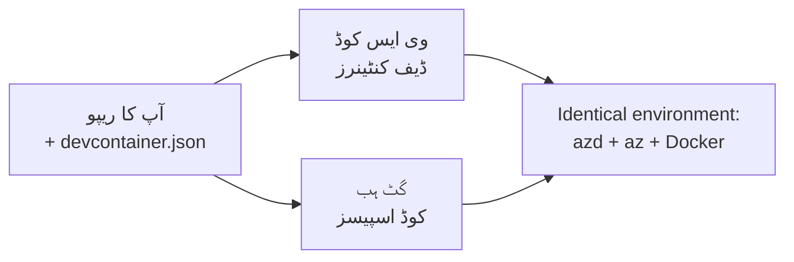

# ڈیولپمنٹ کنٹینرز اور گیٹ ہب کوڈ اسپیسز برائے azd

**بابی نیویگیشن:**
- **📚 کورس ہوم**: [نئے لوگوں کے لیے AZD](../../README.md)
- **📖 موجودہ باب**: باب 1 - بنیاد اور جلدی آغاز
- **⬅️ پچھلا**: [اپنی ایپ خود لائیں](bring-your-own-app.md)
- **🚀 اگلا باب**: [باب 2: AI-فرسٹ ڈیولپمنٹ](../chapter-02-ai-development/README.md)

> جولائی 2026 میں `azd 1.27.1` کے مطابق تصدیق شدہ۔

## تعارف

ہر مشین پر azd، مناسب زبان رن ٹائم، ڈاکر، اور Azure CLI انسٹال کرنا ایک مشکل کام ہے—اور یہی سب سے بڑا سبب ہے کہ ایک ٹیوٹوریل جو "میری مشین پر کام کرتا ہے" کسی اور کے لیے ناکام ہو جاتا ہے۔ ایک **ڈیولپمنٹ کنٹینر** اس مسئلے کو حل کرتا ہے کیونکہ یہ آپ کے پورے ٹول چین کو ایک فائل میں بیان کرتا ہے۔ جو بھی پروجیکٹ کو VS Code یا GitHub Codespaces میں کھولتا ہے، اسے بالکل وہی ماحول ملتا ہے، جس میں پہلے سے azd انسٹال ہوتا ہے۔ یہ سبق آپ کو دکھائے گا کہ اسے کیسے شامل کریں۔

## سیکھنے کے اہداف

اس سبق کے آخر تک، آپ:
- سمجھ جائیں گے کہ ڈیولپمنٹ کنٹینر کیا ہے اور azd کے ساتھ کیسے مدد دیتا ہے
- ایک معمولی `.devcontainer/devcontainer.json` پروجیکٹ میں شامل کریں گے
- Dev Container *features* کے ذریعے azd، Azure CLI، اور Docker شامل کریں گے
- پروجیکٹ کو GitHub Codespaces یا VS Code میں کھولیں گے

## سیکھنے کے نتائج

اس سبق کے مکمل ہونے کے بعد، آپ قابل ہوں گے:
- azd پروجیکٹ کے لیے `devcontainer.json` لکھیں
- azd اور Azure کے ٹولز بغیر دستی تنصیبات کے شامل کریں
- کنٹینر یا Codespace کے اندر سے `azd up` چلائیں

---

## ڈیولپمنٹ کنٹینر کیا ہے؟

ایک ڈیولپمنٹ کنٹینر آپ کے ریپوزٹری میں `.devcontainer/devcontainer.json` فائل کے ذریعے Docker پر مبنی ترقیاتی ماحول ہوتا ہے۔ جب آپ پروجیکٹ کھولتے ہیں:

- **VS Code** (Dev Containers ایکسٹینشن کے ساتھ) کنٹینر بناتا اور منسلک ہوتا ہے۔
- **GitHub Codespaces** اسی کنٹینر کو کلاؤڈ میں بناتا ہے اور آپ کو براؤزر پر مبنی ایڈیٹر دیتا ہے۔

دونوں صورتوں میں، ہر شراکت دار کو یکساں ٹولز ملتے ہیں—کوئی "کیا آپ نے azd انسٹال کیا؟" والی پریشانی نہیں ہوتی۔



---

## قدم 1: devcontainer فائل بنائیں

اپنے پروجیکٹ کی روٹ میں `.devcontainer/devcontainer.json` بنائیں:

```json
{
  "name": "azd-project",
  "image": "mcr.microsoft.com/devcontainers/base:bookworm",
  "features": {
    "ghcr.io/devcontainers/features/azure-cli:1": {},
    "ghcr.io/azure/azure-dev/azd:latest": {},
    "ghcr.io/devcontainers/features/docker-in-docker:2": {},
    "ghcr.io/devcontainers/features/node:1": {}
  },
  "customizations": {
    "vscode": {
      "extensions": [
        "ms-azuretools.azure-dev",
        "ms-azuretools.vscode-bicep"
      ]
    }
  },
  "forwardPorts": [3000],
  "postCreateCommand": "azd version"
}
```

ہر حصہ کا مقصد:

| کلید | مقصد |
|-----|---------|
| `image` | کنٹینر کے لیے بنیادی آپریٹنگ سسٹم |
| `features` | پہلے سے بنے ہوئے انسٹالرز — یہاں: Azure CLI، **azd**، Docker، اور Node.js |
| `customizations.vscode.extensions` | azd اور Bicep VS Code ایکسٹینشنز کو خودکار تنصیب دیتا ہے |
| `forwardPorts` | آپ کی ایپ کا پورٹ براؤزر کو ظاہر کرتا ہے |
| `postCreateCommand` | کنٹینر کے بننے کے بعد ایک بار چلتا ہے (یہاں، صحت کی جانچ) |

> `ghcr.io/azure/azure-dev/azd:latest` فیچر کنٹینر میں azd حاصل کرنے کا سرکاری طریقہ ہے۔ اگر آپ کو قابلیت کی تکرار چاہیے تو مخصوص ورژن (مثلاً `azd:1.27.1`) بھی لگائیں۔

---

## قدم 2: فیچر کو اپنی ایپ کی زبان سے میل کھائیں

`node` فیچر کو اپنی ایپ کی زبان سے بدلیں:

```jsonc
// Python project
"ghcr.io/devcontainers/features/python:1": {},

// .NET project
"ghcr.io/devcontainers/features/dotnet:2": {},

// Java project
"ghcr.io/devcontainers/features/java:1": {},

// Go project
"ghcr.io/devcontainers/features/go:1": {}
```

اگر آپ کا `host` `containerapp`، `aks`، یا کوئی ایسا ہے جو کنٹینر امیج بناتا ہے، تو `docker-in-docker` رکھیں — azd کو امیج بنانے اور دھکیلنے کے لیے Docker کی ضرورت ہے۔

---

## قدم 3: اسے کھولیں

**VS Code میں:**
1. **Dev Containers** ایکسٹینشن انسٹال کریں۔
2. پروجیکٹ فولڈر کھولیں۔
3. پرامپٹ پر **Reopen in Container** پر کلک کریں (یا *Dev Containers: Reopen in Container* چلائیں)۔

**GitHub Codespaces میں:**
1. ریپو کو GitHub پر دھکیلیں۔
2. **Code → Codespaces → Create codespace on main** پر کلک کریں۔
3. کنٹینر کے بننے کا انتظار کریں—azd ٹرمینل میں تیار ہے۔

---

## قدم 4: کنٹینر کے اندر سے تعینات کریں

کنٹینر میں azd پہلے سے نصب ہے، لہٰذا معمول کا ورک فلو سیدھا کام کرتا ہے:

```bash
azd auth login --use-device-code   # ڈیوائس کوڈ Codespaces کے اندر بہت کام کا ہے
azd up
```

> **`--use-device-code` کیوں؟** ریموٹ کنٹینر یا Codespace میں کوئی مقامی براؤزر ری ڈائریکٹ کے لیے نہیں ہوتا، اس لیے ڈیوائس-کوڈ لاگ ان قابل اعتماد راستہ ہے۔ آپ سائن ان مکمل کرنے کے لیے کوڈ کو براؤزر ٹیب میں چسپاں کریں گے۔

---

## عام مسائل

| مسئلہ | حل |
|---------|-----|
| `azd up` امیج نہیں بنا پاتا | `docker-in-docker` فیچر شامل کریں |
| Codespaces میں براؤزر لاگ ان رکتا ہے | `azd auth login --use-device-code` استعمال کریں |
| ٹیم کے ممبروں کے ٹولز مختلف ہیں | فیچر ورژنز پن کریں (مثلاً `azd:1.27.1`) |
| ایپ براؤزر میں قابل رسائی نہیں | پورٹ کو `forwardPorts` میں شامل کریں |

---

## خلاصہ

- ایک ڈیولپمنٹ کنٹینر آپ کے azd ٹول چین کو سب کے لیے قابل تکرار بناتا ہے۔
- Dev Container *features* کے ذریعے azd، Azure CLI، اور Docker شامل کریں۔
- اپنی ایپ کے لیے زبان کا فیچر ملائیں اور کنٹینر میزبانوں کے لیے `docker-in-docker` رکھیں۔
- Codespaces میں چلانے کے دوران ڈیوائس-کوڈ لاگ ان استعمال کریں۔

---

## 🔗 نیویگیشن

| سمت | وسائل |
|-----------|----------|
| **پچھلا** | [اپنی ایپ خود لائیں](bring-your-own-app.md) |
| **باب ہوم** | [باب 1: بنیاد اور جلدی آغاز](README.md) |
| **اگلا باب** | [باب 2: AI-فرسٹ ڈیولپمنٹ](../chapter-02-ai-development/README.md) |

## 📖 متعلقہ وسائل

- [انسٹالیشن اور سیٹ اپ](installation.md)
- [کمانڈ چیٹ شیٹ](../../resources/cheat-sheet.md)
- [سرکاری ڈیولپمنٹ کنٹینرز وضاحت](https://containers.dev/)
- [azd Dev Container فیچر](https://github.com/Azure/azure-dev/tree/main/ext/devcontainer)

---

<!-- CO-OP TRANSLATOR DISCLAIMER START -->
**ڈس کلیمر**:
یہ دستاویز AI ترجمہ سروس [Co-op Translator](https://github.com/Azure/co-op-translator) کے ذریعے ترجمہ کی گئی ہے۔ جبکہ ہم درستگی کے لیے کوشاں ہیں، براہ کرم اس بات سے آگاہ رہیں کہ خودکار ترجمے میں غلطیاں یا عدم درستیاں ہو سکتی ہیں۔ اصل دستاویز اپنے مادری زبان میں مستند ماخذ سمجھی جائے گی۔ حساس معلومات کے لیے پیشہ ور انسانی ترجمہ کی سفارش کی جاتی ہے۔ اس ترجمے کے استعمال سے پیدا ہونے والی کسی بھی غلط فہمی یا غلط تشریح کی ذمہ داری ہم قبول نہیں کرتے۔
<!-- CO-OP TRANSLATOR DISCLAIMER END -->