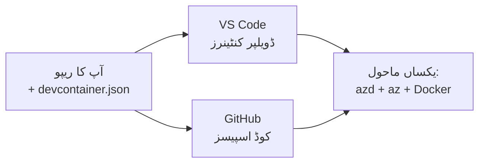

# ڈیولپر کنٹینرز اور GitHub Codespaces برائے azd

**باب کی نیویگیشن:**
- **📚 Course Home**: [AZD برائے مبتدی](../../README.md)
- **📖 موجودہ باب**: باب 1 - بنیاد اور فوری آغاز
- **⬅️ پچھلا**: [اپنی ایپ لائیں](bring-your-own-app.md)
- **🚀 اگلا باب**: [باب 2: AI-فرسٹ ڈیویلپمنٹ](../chapter-02-ai-development/README.md)

> `azd 1.25.6` کے ساتھ جون 2026 میں تصدیق شدہ۔

## تعارف

ہر مشین پر azd، مناسب زبان رن ٹائم، Docker، اور Azure CLI انسٹال کرنا ایک محنت طلب کام ہے—اور یہی سب سے بڑا سبب ہے کہ "میرے مشین پر کام کرتا ہے" والا سبق کسی اور کے لیے ناکام رہتا ہے۔ ایک **ڈیولپر کنٹینر** اس مسئلے کو حل کرتا ہے کیونکہ یہ آپ کے پورے ٹول چین کو ایک فائل میں بیان کرتا ہے۔ جو بھی پروجیکٹ VS Code یا GitHub Codespaces میں کھولے گا، اسے بالکل وہی ماحول ملتا ہے، جس میں azd پہلے سے انسٹال ہوتا ہے۔ یہ سبق آپ کو بتاتا ہے کہ اسے کیسے شامل کریں۔

## سیکھنے کے مقاصد

سبق کے اختتام تک، آپ:
- سمجھیں گے کہ ایک ڈیولپر کنٹینر کیا ہے اور یہ azd میں کیسے مدد کرتا ہے
- اپنے پروجیکٹ میں ایک مختصر `.devcontainer/devcontainer.json` شامل کریں گے
- Dev Container *features* کے ذریعے azd، Azure CLI، اور Docker شامل کریں گے
- پروجیکٹ کو GitHub Codespaces یا VS Code میں کھولیں گے

## سیکھنے کے نتائج

یہ سبق مکمل کرنے کے بعد، آپ قابل ہوں گے:
- azd پروجیکٹ کے لیے `devcontainer.json` لکھ سکیں گے
- azd اور Azure کے ٹولز بغیر دستی انسٹال کے شامل کریں گے
- کنٹینر یا Codespace کے اندر سے `azd up` چلائیں گے

---

## ڈیولپر کنٹینر کیا ہے؟

ایک ڈیولپر کنٹینر ایک Docker پر مبنی ڈویلپمنٹ ماحول ہے جو آپ کے ریپوزٹری میں موجود `.devcontainer/devcontainer.json` فائل میں بیان ہوتا ہے۔ جب آپ پروجیکٹ کھولتے ہیں:

- **VS Code** (Dev Containers ایکسٹینشن کے ساتھ) کنٹینر بناتا ہے اور اس سے منسلک ہوجاتا ہے۔
- **GitHub Codespaces** اسی کنٹینر کو کلاؤڈ میں بناتا ہے اور آپ کو براؤزر پر مبنی ایڈیٹر دیتا ہے۔

کسی بھی صورت میں، ہر تعاون کنندہ کو ایک جیسی ٹولز ملتی ہیں—کوئی "کیا تم نے azd انسٹال کیا؟" والی خرابی نہیں۔



---

## مرحلہ 1: devcontainer فائل بنائیں

اپنے پروجیکٹ کے روٹ میں `.devcontainer/devcontainer.json` بنائیں:

```json
{
  "name": "azd-project",
  "image": "mcr.microsoft.com/devcontainers/base:bookworm",
  "features": {
    "ghcr.io/devcontainers/features/azure-cli:1": {},
    "ghcr.io/azure/azure-dev/azd:latest": {},
    "ghcr.io/devcontainers/features/docker-in-docker:2": {},
    "ghcr.io/devcontainers/features/node:1": {}
  },
  "customizations": {
    "vscode": {
      "extensions": [
        "ms-azuretools.azure-dev",
        "ms-azuretools.vscode-bicep"
      ]
    }
  },
  "forwardPorts": [3000],
  "postCreateCommand": "azd version"
}
```

What each part does:

| Key | Purpose |
|-----|---------|
| `image` | کنٹینر کے لیے بنیادی آپریٹنگ سسٹم |
| `features` | پہلے سے بنے ہوئے انسٹالرز—یہاں: Azure CLI، **azd**، Docker، اور Node.js |
| `customizations.vscode.extensions` | azd اور Bicep کے VS Code ایکسٹینشنز خودبخود انسٹال کرتا ہے |
| `forwardPorts` | آپ کی ایپ کے پورٹس کو براؤزر کے لیے ایکسپوز کرتا ہے |
| `postCreateCommand` | کنٹینر بننے کے بعد ایک بار چلتا ہے (یہاں، ایک صحت چیک) |

> `ghcr.io/azure/azure-dev/azd:latest` فیچر azd کو کنٹینر میں حاصل کرنے کا رسمی طریقہ ہے۔ اگر آپ کو دوبارہ پیدا ہونے والی حالت چاہیے تو ایک مخصوص ورژن کو پن کریں (مثال کے طور پر `azd:1.25.6`)۔

---

## مرحلہ 2: فیچر کو اپنی ایپ کی زبان سے میل کھلوائیں

`node` فیچر کو اس چیز سے بدلیں جو آپ کی ایپ استعمال کرتی ہے:

```jsonc
// Python project
"ghcr.io/devcontainers/features/python:1": {},

// .NET project
"ghcr.io/devcontainers/features/dotnet:2": {},

// Java project
"ghcr.io/devcontainers/features/java:1": {},

// Go project
"ghcr.io/devcontainers/features/go:1": {}
```

اگر آپ کا `host` `containerapp`، `aks`، یا کوئی بھی چیز ہے جو کنٹینر امیج بناتی ہے تو `docker-in-docker` رکھیں—azd کو امیجز بنانے اور پش کرنے کے لیے Docker کی ضرورت ہوتی ہے۔

---

## مرحلہ 3: اسے کھولیں

**VS Code میں:**
1. **Dev Containers** ایکسٹینشن انسٹال کریں۔
2. پروجیکٹ فولڈر کھولیں۔
3. جب پرامپٹ آئے تو **Reopen in Container** پر کلک کریں (یا *Dev Containers: Reopen in Container* چلائیں)۔

**GitHub Codespaces میں:**
1. ریپو کو GitHub پر بھیجیں۔
2. پر کلک کریں **Code → Codespaces → Create codespace on main**۔
3. کنٹینر کے بننے کا انتظار کریں—azd ٹرمینل میں تیار ہوگا۔

---

## مرحلہ 4: کنٹینر کے اندر سے ڈیپلائے کریں

کنٹینر میں azd پہلے سے انسٹال ہوتا ہے، اس لیے معمول کا ورک فلو بس کام کرتا ہے:

```bash
azd auth login --use-device-code   # ڈیوائس کوڈ Codespaces کے اندر مفید ہے
azd up
```

> **کیوں `--use-device-code`؟** ریموٹ کنٹینر یا Codespace میں ری ڈائریکٹ کرنے کے لیے کوئی لوکل براؤزر نہیں ہوتا، اس لیے device-code لاگ ان قابلِ اعتماد راستہ ہے۔ آپ سائن ان مکمل کرنے کے لیے ایک کوڈ براؤزر ٹیب میں پیسٹ کریں گے۔

---

## عام مشکلات

| مسئلہ | حل |
|---------|-----|
| `azd up` ایک امیج بنا نہیں سکتا | `docker-in-docker` فیچر شامل کریں |
| Codespaces میں براؤزر لاگ ان پھنس جاتا ہے | `azd auth login --use-device-code` استعمال کریں |
| ٹیم کے ارکان کے درمیان ٹولز مختلف ہوتے ہیں | فیچر ورژنز کو پن کریں (مثلاً `azd:1.25.6`) |
| ایپ براؤزر میں پہنچنے کے قابل نہیں | پورٹ کو `forwardPorts` میں شامل کریں |

---

## خلاصہ

- ایک ڈیولپر کنٹینر آپ کے azd ٹول چین کو ہر ایک کے لیے دوبارہ پیدا کرنے کے قابل بناتا ہے۔
- Dev Container *features* کے ذریعے azd، Azure CLI، اور Docker شامل کریں۔
- زبان فیچر کو اپنی ایپ کے مطابق کریں اور کنٹینر ہوسٹس کے لیے `docker-in-docker` رکھیں۔
- Codespaces کے اندر چلتے وقت device-code لاگ ان استعمال کریں۔

---

## 🔗 نیویگیشن

| سمت | وسائل |
|-----------|----------|
| **پچھلا** | [اپنی ایپ لائیں](bring-your-own-app.md) |
| **باب کا مرکزی صفحہ** | [باب 1: بنیاد اور فوری آغاز](README.md) |
| **اگلا باب** | [باب 2: AI-فرسٹ ڈیویلپمنٹ](../chapter-02-ai-development/README.md) |

## 📖 متعلقہ وسائل

- [انسٹالیشن اور سیٹ اپ](installation.md)
- [کمانڈ چیٹ شیٹ](../../resources/cheat-sheet.md)
- [Dev Containers کی سرکاری تفصیل](https://containers.dev/)
- [azd Dev Container فیچر](https://github.com/Azure/azure-dev/tree/main/ext/devcontainer)

---

<!-- CO-OP TRANSLATOR DISCLAIMER START -->
**ڈس کلیمر**:
یہ دستاویز AI ترجمہ سروس [Co-op Translator](https://github.com/Azure/co-op-translator) کے ذریعے ترجمہ کی گئی ہے۔ جبکہ ہم درستگی کے لیے کوشاں ہیں، براہ کرم اس بات سے آگاہ رہیں کہ خودکار ترجمے میں غلطیاں یا عدم درستیاں ہو سکتی ہیں۔ اصل دستاویز اپنے مادری زبان میں مستند ماخذ سمجھی جائے گی۔ حساس معلومات کے لیے پیشہ ور انسانی ترجمہ کی سفارش کی جاتی ہے۔ اس ترجمے کے استعمال سے پیدا ہونے والی کسی بھی غلط فہمی یا غلط تشریح کی ذمہ داری ہم قبول نہیں کرتے۔
<!-- CO-OP TRANSLATOR DISCLAIMER END -->