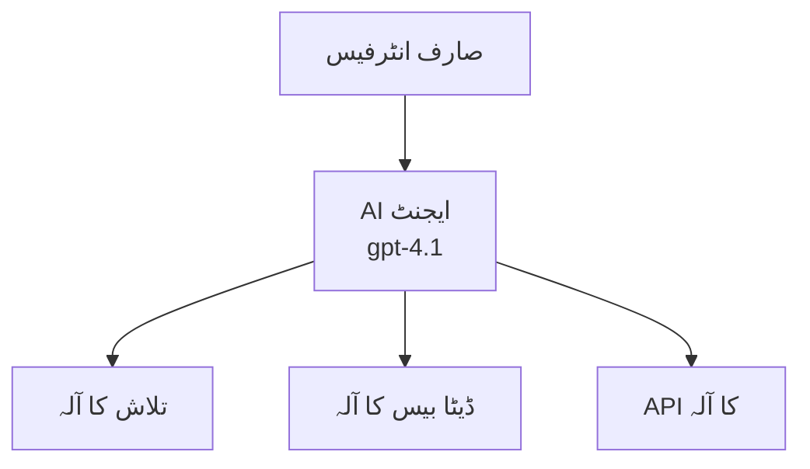
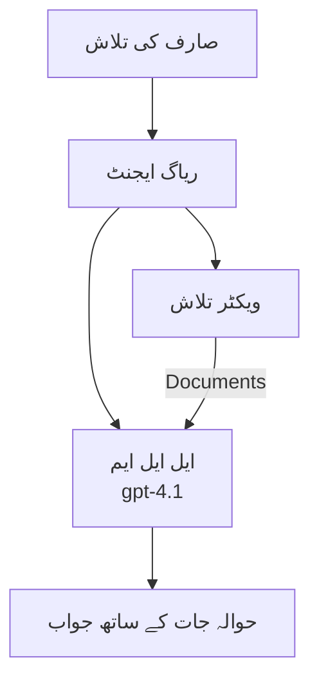
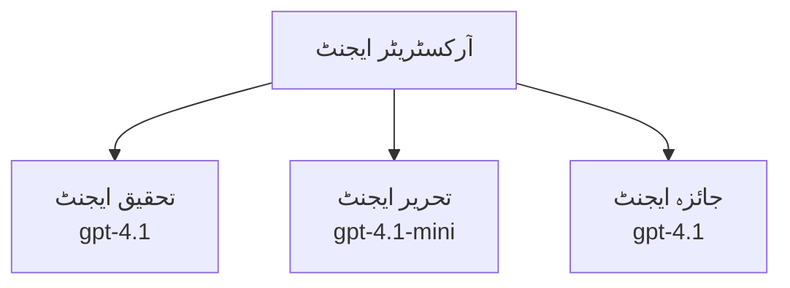

# Azure Developer CLI کے ساتھ AI ایجنٹس

**باب نیویگیشن:**
- **📚 کورس ہوم**: [AZD برائے مبتدیان](../../README.md)
- **📖 موجودہ باب**: باب 2 - AI-فرسٹ ڈیولپمنٹ
- **⬅️ پچھلا**: [Microsoft Foundry انٹیگریشن](microsoft-foundry-integration.md)
- **➡️ اگلا**: [AI ماڈل کی تعیناتی](ai-model-deployment.md)
- **🚀 ایڈوانسڈ**: [کثیر ایجنٹ حل](../../examples/retail-scenario.md)

---

## تعارف

AI ایجنٹس خود مختار پروگرام ہوتے ہیں جو اپنے ماحول کو محسوس کر سکتے ہیں، فیصلے کر سکتے ہیں، اور مخصوص مقاصد کے حصول کے لیے کارروائی کرتے ہیں۔ سادہ چیٹ بوٹس کے برعکس جو صرف پرامپٹس کا جواب دیتے ہیں، ایجنٹس کر سکتے ہیں:

- **اوزار استعمال کریں** - APIs کو کال کریں، ڈیٹا بیس میں تلاش کریں، کوڈ چلائیں
- **منصوبہ بندی اور استدلال کریں** - پیچیدہ کاموں کو مراحل میں تقسیم کریں
- **سیاق و سباق سے سیکھیں** - یادداشت کو برقرار رکھیں اور رویے کو ایڈجسٹ کریں
- **اشتراک کریں** - دوسرے ایجنٹس کے ساتھ کام کریں (کثیر ایجنٹ نظام)

یہ رہنمائی آپ کو دکھاتی ہے کہ Azure Developer CLI (azd) استعمال کرتے ہوئے AI ایجنٹس کو Azure پر کیسے تعینات کیا جائے۔

> **تصدیقی نوٹ (2026-07-13):** اس گائیڈ کا جائزہ `azd` `1.27.1` اور `azure.ai.agents` `1.0.0-beta.5` کے خلاف لیا گیا۔ `azd ai` کا تجربہ ابھی بھی پریویو پر مبنی ہے، لہٰذا اگر آپ کے انسٹال کردہ فلیگز مختلف ہیں تو توسیع کی مدد چیک کریں۔

## سیکھنے کے اہداف

اس گائیڈ کو مکمل کرنے سے آپ:
- سمجھ سکیں گے کہ AI ایجنٹس کیا ہیں اور وہ چیٹ بوٹس سے کیسے مختلف ہیں
- AZD کا استعمال کرتے ہوئے پہلے سے بنائے گئے AI ایجنٹ ٹیمپلیٹس تعینات کریں گے
- کسٹم ایجنٹس کے لیے Foundry Agents کو ترتیب دیں گے
- بنیادی ایجنٹ پیٹرنز نافذ کریں گے (اوزار کا استعمال، RAG، کثیر ایجنٹ)
- تعینات کردہ ایجنٹس کی مانیٹرنگ اور ڈیبگ کریں گے

## سیکھنے کے نتائج

مکمل کرنے پر آپ قابل ہوں گے:
- ایک کمانڈ سے AI ایجنٹ ایپلیکیشنز کو Azure پر تعینات کرنا
- ایجنٹ کے اوزار اور صلاحیتوں کو ترتیب دینا
- ایجنٹس کے ساتھ ریٹریول-آگمنٹڈ جنریشن (RAG) نافذ کرنا
- پیچیدہ ورک فلو کے لیے کثیر ایجنٹ آرکیٹیکچرز ڈیزائن کرنا
- عام ایجنٹ تعیناتی مسائل کو حل کرنا

---

## 🤖 ایک ایجنٹ کو چیٹ بوٹ سے مختلف کیا بناتا ہے؟

| خصوصیت | چیٹ بوٹ | AI ایجنٹ |
|---------|---------|----------|
| **رویہ** | پرامپٹس کا جواب دیتا ہے | خود مختار کارروائیاں کرتا ہے |
| **اوزار** | کوئی نہیں | APIs کال کر سکتا ہے، تلاش کر سکتا ہے، کوڈ چلا سکتا ہے |
| **یادداشت** | صرف سیشن پر مبنی | سیشنز میں مستقل یادداشت |
| **منصوبہ بندی** | واحد جواب | متعدد مراحل کا استدلال |
| **اشتراک** | واحد ہستی | دوسرے ایجنٹس کے ساتھ کام کر سکتا ہے |

### آسان تشبیہ

- **چیٹ بوٹ** = معلوماتی ڈیسک پر سوالات کے جواب دینے والا مددگار شخص
- **AI ایجنٹ** = ذاتی معاون جو کال کر سکتا ہے، اپائنٹمنٹس بُک کر سکتا ہے، اور کام مکمل کر سکتا ہے

---

## 🚀 فوری آغاز: اپنا پہلا ایجنٹ تعینات کریں

### آپشن 1: Foundry Agents ٹیمپلیٹ (تجویز کردہ)

```bash
# AI ایجنٹس کے ٹیمپلیٹ کو شروع کریں
azd init --template get-started-with-ai-agents

# Azure میں تعینات کریں
azd up
```

**کیا تعینات کیا جاتا ہے:**
- ✅ Foundry Agents
- ✅ Microsoft Foundry ماڈلز (gpt-4.1)
- ✅ Azure AI سرچ (RAG کے لیے)
- ✅ Azure Container Apps (ویب انٹرفیس)
- ✅ Application Insights (مانیٹرنگ)

**وقت:** تقریباً 15-20 منٹ
**لاگت:** ترقی کے لیے ماہانہ تقریباً $100-150

### آپشن 2: OpenAI ایجنٹ Prompty کے ساتھ

```bash
# پروپٹی پر مبنی ایجنٹ ٹیمپلیٹ کو شروع کریں
azd init --template agent-openai-python-prompty

# ایزور پر تعینات کریں
azd up
```

**کیا تعینات کیا جاتا ہے:**
- ✅ Azure Functions (سرور لیس ایجنٹ اجرا)
- ✅ Microsoft Foundry ماڈلز
- ✅ Prompty کنفیگریشن فائلز
- ✅ ایجنٹ کی مثال نفاذ

**وقت:** تقریباً 10-15 منٹ
**لاگت:** ترقی کے لیے ماہانہ تقریباً $50-100

### آپشن 3: RAG چیٹ ایجنٹ

```bash
# RAG چیٹ ٹیمپلیٹ کو شروع کریں
azd init --template azure-search-openai-demo

# Azure پر تعینات کریں
azd up
```

**کیا تعینات کیا جاتا ہے:**
- ✅ Microsoft Foundry ماڈلز
- ✅ Azure AI سرچ سیمپل ڈیٹا کے ساتھ
- ✅ دستاویزات پراسیسنگ پائپ لائن
- ✅ حوالہ جات کے ساتھ چیٹ انٹرفیس

**وقت:** تقریباً 15-25 منٹ
**لاگت:** ترقی کے لیے ماہانہ تقریباً $80-150

### آپشن 4: AZD AI ایجنٹ انٹ (مینفیسٹ یا ٹیمپلیٹ پر مبنی پریویو)

اگر آپ کے پاس ایجنٹ مینفیسٹ فائل ہے تو آپ `azd ai` کمانڈ کا استعمال کرتے ہوئے براہ راست Foundry Agent Service پروجیکٹ کی اسکافولڈنگ کر سکتے ہیں۔ حالیہ پریویو ریلیزز نے ٹیمپلیٹ-بیسڈ انیشیئلائزیشن سپورٹ بھی شامل کی ہے، لہٰذا آپ کے انسٹال کردہ ایکسٹینشن ورژن کے مطابق پرامپٹ کا عمل تھوڑا مختلف ہو سکتا ہے۔

```bash
# اے آئی ایجنٹس کی توسیع انسٹال کریں
azd extension install azure.ai.agents

# اختیاری: نصب شدہ پریویو ورژن کی تصدیق کریں
azd extension show azure.ai.agents

# ایجنٹ مینیفیسٹ سے ابتدائیہ کریں
azd ai agent init -m agent-manifest.yaml

# ایزور پر تعینات کریں
azd up

# تعینات کردہ ایجنٹ کا ٹیسٹ کریں (لیٹینسی + پہلے بائٹ تک وقت دکھاتا ہے)
azd ai agent invoke
```

**`azd ai agent init` استعمال کرنے کے بالمقابل `azd init --template` کب استعمال کریں:**

| طریقہ کار | بہترین برائے | کیسے کام کرتا ہے |
|----------|-------------|--------------|
| `azd init --template` | ایک کام کرنے والی سیمپل ایپ سے شروع کرنا | کوڈ اور انفراسٹرکچر کے ساتھ مکمل ٹیمپلیٹ ریپو کلون کرتا ہے |
| `azd ai agent init -m` | اپنے ایجنٹ مینفیسٹ سے بنا کر | آپ کی ایجنٹ تعریف سے پروجیکٹ اسٹرکچر اسکافولڈ کرتا ہے |

> **ٹپ:** سیکھتے ہوئے (آپشنز 1-3 اوپر) `azd init --template` استعمال کریں۔ پروڈکشن ایجنٹس بنانے کے لیے اپنے مینفسٹس کے ساتھ `azd ai agent init` استعمال کریں۔

`azd up` کے بعد، یہی ایکسٹینشن آپ کو ایجنٹ کے باقی لائف سائیکل سے گزارتا ہے: `azd ai agent invoke` کے ذریعے ٹیسٹ کریں، `azd ai agent eval generate` اور `azd ai agent optimize` کے ذریعے معیار کو ناپیں اور بہتر کریں، اور `azd ai agent delete` کے ذریعے صفائی کریں۔ مکمل حوالہ کے لیے دیکھیں [AZD AI CLI Commands](../chapter-08-production/production-ai-practices.md#azd-ai-cli-commands-and-extensions)۔

---

## 🏗️ ایجنٹ آرکیٹیکچر پیٹرنز

### پیٹرن 1: اوزار کے ساتھ واحد ایجنٹ

سب سے آسان ایجنٹ پیٹرن - ایک ایجنٹ جو متعدد اوزار استعمال کر سکتا ہے۔



**بہترین برائے:**
- کسٹمر سپورٹ بوٹس
- تحقیقاتی معاونین
- ڈیٹا تجزیہ ایجنٹس

**AZD ٹیمپلیٹ:** `azure-search-openai-demo`

### پیٹرن 2: RAG ایجنٹ (ریٹریول-آگمنٹڈ جنریشن)

ایک ایسا ایجنٹ جو جواب دینے سے پہلے متعلقہ دستاویزات نکالتا ہے۔



**بہترین برائے:**
- انٹرپرائز نالج بیسز
- دستاویزات پر سوال و جواب کے نظام
- تعمیل اور قانونی تحقیق

**AZD ٹیمپلیٹ:** `azure-search-openai-demo`

### پیٹرن 3: کثیر ایجنٹ نظام

متعدد ماہر ایجنٹس جو پیچیدہ کاموں پر مل کر کام کرتے ہیں۔



**بہترین برائے:**
- پیچیدہ مواد کی تخلیق
- متعدد مراحل کے ورک فلو
- مختلف مہارتوں والے کام

**مزید جانیں:** [کثیر ایجنٹ کوآرڈینیشن پیٹرنز](../chapter-06-pre-deployment/coordination-patterns.md)

---

## ⚙️ ایجنٹ کے اوزار کی ترتیب

ایجنٹس اس وقت طاقتور ہوتے ہیں جب وہ اوزار استعمال کر سکیں۔ یہاں عام اوزار کی ترتیب ہے:

### Foundry Agents میں اوزار کی ترتیب

```python
# agent_config.py
from azure.ai.projects import AIProjectClient
from azure.ai.projects.models import FunctionTool, CodeInterpreterTool

# کسٹم ٹولز کی تعریف کریں
search_tool = FunctionTool(
    name="search_knowledge_base",
    description="Search the company knowledge base for relevant documents",
    parameters={
        "type": "object",
        "properties": {
            "query": {
                "type": "string",
                "description": "The search query"
            }
        },
        "required": ["query"]
    }
)

# ٹولز کے ساتھ ایجنٹ بنائیں
agent = project_client.agents.create_agent(
    model="gpt-4.1",
    name="Support Agent",
    instructions="You are a helpful support agent. Use the search tool to find relevant information.",
    tools=[search_tool, CodeInterpreterTool()]
)
```

### ماحول کی ترتیب

```bash
# ایجنٹ مخصوص ماحولیاتی متغیرات مرتب کریں
azd env set AZURE_OPENAI_MODEL "gpt-4.1"
azd env set AGENT_INSTRUCTIONS "You are a helpful assistant..."
azd env set ENABLE_CODE_INTERPRETER "true"
azd env set ENABLE_FILE_SEARCH "true"

# تازہ کاری شدہ ترتیب کے ساتھ تعینات کریں
azd deploy
```

---

## 📊 ایجنٹس کی مانیٹرنگ

### Application Insights انٹیگریشن

تمام AZD ایجنٹ ٹیمپلیٹس مانیٹرنگ کے لیے Application Insights شامل کرتے ہیں:

```bash
# کھلا مانیٹرنگ ڈیش بورڈ
azd monitor --overview

# لائیو لاگز دیکھیں
azd monitor --logs

# لائیو میٹرکس دیکھیں
azd monitor --live
```

### اہم میٹرکس ٹریک کرنے کے لیے

| میٹرک | تفصیل | ہدف |
|--------|----------|-------|
| ردعمل کی تاخیر | جواب تیار کرنے کا وقت | < 5 سیکنڈ |
| ٹوکن استعمال | ہر درخواست کے ٹوکنز | لاگت کے لیے مانیٹر کریں |
| اوزار کال کامیابی کی شرح | کامیاب اوزار اجرا کی % | > 95% |
| خرابی کی شرح | ناکام ایجنٹ درخواستیں | < 1% |
| صارف کی اطمینان | تاثرات کے اسکور | > 4.0/5.0 |

### ایجنٹس کے لیے کسٹم لاگنگ

```python
import os
from azure.monitor.opentelemetry import configure_azure_monitor
from opentelemetry import trace

# Azure Monitor کو OpenTelemetry کے ساتھ ترتیب دیں
configure_azure_monitor(
    connection_string=os.environ["APPLICATIONINSIGHTS_CONNECTION_STRING"]
)

tracer = trace.get_tracer(__name__)

def log_agent_interaction(user_query, agent_response, tools_used, latency_ms):
    with tracer.start_as_current_span("agent_interaction") as span:
        span.set_attributes({
            "user_query": user_query,
            "response_length": len(agent_response),
            "tools_used": tools_used,
            "latency_ms": latency_ms
        })
```

> **نوٹ:** مطلوبہ پیکجز انسٹال کریں: `pip install azure-monitor-opentelemetry opentelemetry`

---

## 💰 لاگت کے ملاحظات

### ہر پیٹرن کے لیے اندازاً ماہانہ لاگت

| پیٹرن | ڈویلپمنٹ ماحول | پروڈکشن |
|---------|-----------------|------------|
| واحد ایجنٹ | $50-100 | $200-500 |
| RAG ایجنٹ | $80-150 | $300-800 |
| کثیر ایجنٹ (2-3 ایجنٹس) | $150-300 | $500-1,500 |
| انٹرپرائز کثیر ایجنٹ | $300-500 | $1,500-5,000+ |

### لاگت کی بہتری کے مشورے

1. **سادہ کاموں کے لیے gpt-4.1-mini استعمال کریں**
   ```bash
   azd env set AZURE_OPENAI_MODEL "gpt-4.1-mini"
   ```

2. **دہرائے جانے والے سوالات کے لیے کیشنگ نافذ کریں**
   ```python
   from functools import lru_cache
   
   @lru_cache(maxsize=1000)
   def get_cached_response(query_hash):
       return agent.run(query_hash)
   ```

3. **ہر رن کے لیے ٹوکن کی حد مقرر کریں**
   ```python
   # ایجنٹ چلانے کے دوران زیادہ سے زیادہ مکمل ٹوکن سیٹ کریں، تخلیق کے وقت نہیں
   run = project_client.agents.create_run(
       thread_id=thread.id,
       agent_id=agent.id,
       max_completion_tokens=1000  # جواب کی لمبائی محدود کریں
   )
   ```

4. **استعمال میں نہ ہونے پر صفر تک اسکیل کریں**
   ```bash
   # کنٹینر ایپس خود بخود صفر تک اسکیل ہو جاتی ہیں
   azd env set MIN_REPLICAS "0"
   ```

---

## 🔧 ایجنٹس کی خرابیوں کا ازالہ

### عام مسائل اور حل

<details>
<summary><strong>❌ ایجنٹ اوزار کالز کا جواب نہیں دے رہا</strong></summary>

```bash
# چیک کریں کہ ٹولز صحیح طریقے سے رجسٹر ہو گئے ہیں
azd show

# اوپن اے آئی کی تعیناتی کی تصدیق کریں
az cognitiveservices account deployment list \
  --name $AZURE_OPENAI_NAME \
  --resource-group $RG_NAME

# ایجنٹ کے لاگز چیک کریں
azd monitor --logs
```

**عام وجوہات:**
- اوزار فنکشن دستخط میں مماثلت نہیں
- ضروری اجازتیں غائب ہیں
- API اینڈ پوائنٹ قابل رسائی نہیں ہے
</details>

<details>
<summary><strong>❌ ایجنٹ کے جواب میں زیادہ تاخیر</strong></summary>

```bash
# ایپلیکیشن انسائٹس میں رکاوٹوں کی جانچ کریں
azd monitor --live

# تیز تر ماڈل استعمال کرنے پر غور کریں
azd env set AZURE_OPENAI_MODEL "gpt-4.1-mini"
azd deploy
```

**بہتری کے نکات:**
- سٹریمینگ جوابات استعمال کریں
- جواب کیشنگ نافذ کریں
- سیاق و سباق کی ونڈو کا سائز کم کریں
</details>

<details>
<summary><strong>❌ ایجنٹ غلط یا خیالی معلومات لے کر آ رہا ہے</strong></summary>

```python
# بہتر نظام کے اشارے کے ساتھ بہتری لائیں
instructions = """
You are a helpful assistant. IMPORTANT:
- Only answer based on provided context
- If you don't know, say "I don't know"
- Always cite your sources
- Never make up information
"""

# بنیاد رکھنے کے لیے بازیافت شامل کریں
agent = project_client.agents.create_agent(
    model="gpt-4.1",
    instructions=instructions,
    tools=[FileSearchTool()]  # جوابات کو دستاویزات میں بنیاد دیں
)
```
</details>

<details>
<summary><strong>❌ ٹوکن کی حد سے تجاوز کی خرابی</strong></summary>

```python
# میکانزم کنٹیکسٹ ونڈو کا نفاذ کریں
def truncate_context(messages, max_tokens=8000, model="gpt-4.1"):
    """Keep only recent messages within token limit."""
    import tiktoken
    encoding = tiktoken.encoding_for_model(model)
    total_tokens = 0
    truncated = []
    
    for msg in reversed(messages):
        msg_tokens = len(encoding.encode(msg.content))
        if total_tokens + msg_tokens > max_tokens:
            break
        truncated.insert(0, msg)
        total_tokens += msg_tokens
    
    return truncated
```
</details>

---

## 🎓 عملی مشقیں

### مشق 1: ایک بنیادی ایجنٹ تعینات کریں (20 منٹ)

**مقصد:** AZD استعمال کرتے ہوئے اپنا پہلا AI ایجنٹ تعینات کریں

```bash
# مرحلہ 1: ٹیمپلیٹ کا آغاز کریں
azd init --template get-started-with-ai-agents

# مرحلہ 2: Azure میں لاگ ان کریں
azd auth login
# اگر آپ مختلف کرایہ داروں پر کام کرتے ہیں تو، --tenant-id <tenant-id> شامل کریں

# مرحلہ 3: تعینات کریں
azd up

# مرحلہ 4: ایجنٹ کا ٹیسٹ کریں
# تعیناتی کے بعد متوقع نتیجہ:
#   تعیناتی مکمل ہو گئی!
#   اینڈ پوائنٹ: https://<app-name>.<region>.azurecontainerapps.io
# آؤٹ پٹ میں دکھائی گئی URL کھولیں اور سوال پوچھنے کی کوشش کریں

# مرحلہ 5: نگرانی دیکھیں
azd monitor --overview

# مرحلہ 6: صفائی کریں
azd down --force --purge
```

**کامیابی کا معیار:**
- [ ] ایجنٹ سوالات کا جواب دیتا ہے
- [ ] `azd monitor` کے ذریعے مانیٹرنگ ڈیش بورڈ تک رسائی ممکن ہے
- [ ] وسائل کامیابی سے صاف کیے گئے ہیں

### مشق 2: ایک کسٹم ٹول شامل کریں (30 منٹ)

**مقصد:** ایجنٹ کو کسٹم ٹول کے ساتھ بڑھائیں

1. ایجنٹ ٹیمپلیٹ تعینات کریں:
   ```bash
   azd init --template get-started-with-ai-agents
   azd up
   ```
2. اپنے ایجنٹ کوڈ میں نیا ٹول فنکشن بنائیں:
   ```python
   def get_weather(location: str) -> str:
       """Get current weather for a location."""
       # موسم کی خدمت کے لیے API کال
       return f"Weather in {location}: Sunny, 72°F"
   ```
3. ٹول کو ایجنٹ کے ساتھ رجسٹر کریں:
   ```python
   from azure.ai.projects.models import FunctionTool

   weather_tool = FunctionTool(
       name="get_weather",
       description="Get current weather for a location",
       parameters={
           "type": "object",
           "properties": {
               "location": {"type": "string", "description": "City name"}
           },
           "required": ["location"]
       }
   )

   agent = project_client.agents.create_agent(
       model="gpt-4.1",
       name="Weather Agent",
       tools=[weather_tool]
   )
   ```
4. دوبارہ تعینات کریں اور ٹیسٹ کریں:
   ```bash
   azd deploy
   # پوچھیں: "سیئٹل میں موسم کیسا ہے؟"
   # توقع کی جاتی ہے: ایجنٹ get_weather("Seattle") کو کال کرتا ہے اور موسم کی معلومات واپس کرتا ہے
   ```

**کامیابی کا معیار:**
- [ ] ایجنٹ موسم سے متعلق سوالات کو پہچانتا ہے
- [ ] ٹول درست طریقے سے کال ہوتا ہے
- [ ] ردعمل میں موسم کی معلومات شامل ہے

### مشق 3: RAG ایجنٹ بنائیں (45 منٹ)

**مقصد:** ایک ایسا ایجنٹ بنائیں جو آپ کی دستاویزات سے سوالات کا جواب دے

```bash
# مرحلہ 1: RAG ٹیمپلیٹ کو تعینات کریں
azd init --template azure-search-openai-demo
azd up

# مرحلہ 2: اپنے دستاویزات اپ لوڈ کریں
# PDF/TXT فائلز کو data/ ڈائریکٹری میں رکھیں، پھر چلائیں:
python scripts/prepdocs.py

# مرحلہ 3: مخصوص شعبہ کے سوالات کے ساتھ ٹیسٹ کریں
# azd up آؤٹ پٹ سے ویب ایپ URL کھولیں
# اپنے اپ لوڈ کردہ دستاویزات کے بارے میں سوالات پوچھیں
# جوابات میں حوالہ جات شامل ہونے چاہئیں جیسے [doc.pdf]
```

**کامیابی کا معیار:**
- [ ] ایجنٹ اپ لوڈ کی گئی دستاویزات سے جواب دیتا ہے
- [ ] جوابات میں حوالہ جات شامل ہیں
- [ ] دائرہ کار سے باہر سوالات پر کوئی قیاس آرائی نہیں ہوتی

---

## 📚 اگلے مراحل

اب جب کہ آپ AI ایجنٹس کو سمجھ گئے ہیں، ان ایڈوانسڈ موضوعات کو دریافت کریں:

| موضوع | وضاحت | لنک |
|-------|--------|-------|
| **کثیر ایجنٹ نظام** | کئی اشتراک کرنے والے ایجنٹس کے ساتھ نظام بنائیں | [ریٹیل کثیر ایجنٹ مثال](../../examples/retail-scenario.md) |
| **کوارڈینیشن پیٹرنز** | آرکیسٹریشن اور رابطہ پیٹرنز سیکھیں | [کوارڈینیشن پیٹرنز](../chapter-06-pre-deployment/coordination-patterns.md) |
| **پروڈکشن تعیناتی** | انٹرپرائز کے لیے تیار ایجنٹ تعینات کریں | [پروڈکشن AI کے طریقے](../chapter-08-production/production-ai-practices.md) |
| **ایجنٹ جائزہ** | ایجنٹ کی کارکردگی کا جائزہ لیں اور ٹیسٹ کریں | [AI خرابیوں کا ازالہ](../chapter-07-troubleshooting/ai-troubleshooting.md) |
| **AI ورکشاپ لیب** | ہاتھوں سے کریں: اپنے AI حل کو AZD کے لیے تیار کریں | [AI ورکشاپ لیب](ai-workshop-lab.md) |

---

## 📖 اضافی وسائل

### سرکاری دستاویزات
- [Microsoft Foundry Agent Service](https://learn.microsoft.com/azure/ai-services/agents/)
- [Microsoft Foundry Agent Service Quickstart](https://learn.microsoft.com/azure/ai-services/agents/quickstart)
- [Semantic Kernel Agent Framework](https://learn.microsoft.com/semantic-kernel/)

### AI ایجنٹس کے لیے AZD ٹیمپلیٹس
- [AI ایجنٹس کے ساتھ شروع کریں](https://github.com/Azure-Samples/get-started-with-ai-agents)
- [Agent OpenAI Python Prompty](https://github.com/Azure-Samples/agent-openai-python-prompty)
- [Azure Search OpenAI Demo](https://github.com/Azure-Samples/azure-search-openai-demo)

### کمیونٹی وسائل
- [Awesome AZD - ایجنٹ ٹیمپلیٹس](https://azure.github.io/awesome-azd/?tags=ai-agents)
- [Azure AI Discord](https://discord.gg/microsoft-azure)
- [Microsoft Foundry Discord](https://discord.gg/nTYy5BXMWG)

### آپ کے ایڈیٹر کے لیے ایجنٹ مہارتیں
- [**Microsoft Azure Agent Skills**](https://skills.sh/microsoft/github-copilot-for-azure) - Azure ڈیولپمنٹ کے لیے قابل دوبارہ استعمال AI ایجنٹ مہارتیں GitHub Copilot، Cursor، یا کسی بھی معاون ایجنٹ میں انسٹال کریں۔ اس میں شامل ہیں: [Azure AI](https://skills.sh/microsoft/github-copilot-for-azure/azure-ai)، [Microsoft Foundry](https://skills.sh/microsoft/github-copilot-for-azure/microsoft-foundry)، [تعیناتی](https://skills.sh/microsoft/github-copilot-for-azure/azure-deploy)، اور [تشخیص](https://skills.sh/microsoft/github-copilot-for-azure/azure-diagnostics) کی مہارتیں:
  ```bash
  npx skills add microsoft/github-copilot-for-azure
  ```

---

**نیویگیشن**
- **پچھلا سبق**: [Microsoft Foundry انٹیگریشن](microsoft-foundry-integration.md)
- **اگلا سبق**: [AI ماڈل کی تعیناتی](ai-model-deployment.md)

---

<!-- CO-OP TRANSLATOR DISCLAIMER START -->
**ڈس کلیمر**:
یہ دستاویز AI ترجمہ سروس [Co-op Translator](https://github.com/Azure/co-op-translator) کے ذریعے ترجمہ کی گئی ہے۔ جبکہ ہم درستگی کے لیے کوشاں ہیں، براہ کرم اس بات سے آگاہ رہیں کہ خودکار ترجمے میں غلطیاں یا عدم درستیاں ہو سکتی ہیں۔ اصل دستاویز اپنے مادری زبان میں مستند ماخذ سمجھی جائے گی۔ حساس معلومات کے لیے پیشہ ور انسانی ترجمہ کی سفارش کی جاتی ہے۔ اس ترجمے کے استعمال سے پیدا ہونے والی کسی بھی غلط فہمی یا غلط تشریح کی ذمہ داری ہم قبول نہیں کرتے۔
<!-- CO-OP TRANSLATOR DISCLAIMER END -->