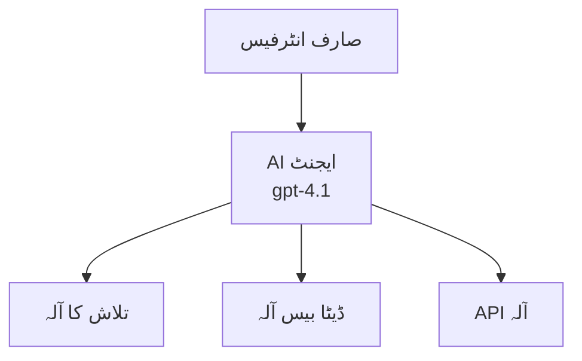

# Azure Developer CLI کے ساتھ AI ایجنٹس

**باب کی نیویگیشن:**
- **📚 کورس ہوم**: [AZD For Beginners](../../README.md)
- **📖 موجودہ باب**: باب 2 - AI-فرسٹ ڈیولپمنٹ
- **⬅️ پچھلا**: [Microsoft Foundry Integration](microsoft-foundry-integration.md)
- **➡️ اگلا**: [AI Model Deployment](ai-model-deployment.md)
- **🚀 ایڈوانسڈ**: [ملٹی ایجنٹ حل](../../examples/retail-scenario.md)

---

## تعارف

AI ایجنٹس خود مختار پروگرام ہوتے ہیں جو اپنے ماحول کو سمجھ سکتے ہیں، فیصلے لے سکتے ہیں، اور مخصوص اہداف حاصل کرنے کے لیے اقدامات کر سکتے ہیں۔ سادہ چیٹ بوٹس جو صرف پرامپٹس کا جواب دیتے ہیں کے برخلاف، ایجنٹس یہ کر سکتے ہیں:

- **ٹولز استعمال کرنا** - APIs کال کرنا، ڈیٹا بیس تلاش کرنا، کوڈ چلانا
- **منصوبہ بندی اور استدلال** - پیچیدہ کاموں کو مراحل میں تقسیم کرنا
- **سیاق و سباق سے سیکھنا** - یادداشت برقرار رکھنا اور رویے کو ایڈجسٹ کرنا
- **اشتراک کرنا** - دوسرے ایجنٹس کے ساتھ کام کرنا (ملٹی ایجنٹ سسٹمز)

یہ گائیڈ آپ کو دکھاتا ہے کہ Azure Developer CLI (azd) کے ذریعے AI ایجنٹس کو Azure پر کیسے تعینات کیا جائے۔

## سیکھنے کے مقاصد

اس گائیڈ کو مکمل کرنے کے بعد، آپ:
- سمجھ جائیں گے کہ AI ایجنٹس کیا ہیں اور وہ چیٹ بوٹس سے کیسے مختلف ہیں
- پہلے سے تیار شدہ AI ایجنٹ ٹیمپلیٹس کو AZD کے ذریعے تعینات کریں گے
- کسٹم ایجنٹس کے لیے Foundry Agents کو کنفیگر کریں گے
- بنیادی ایجنٹ پیٹرنز (ٹول استعمال، RAG، ملٹی ایجنٹ) کو نافذ کریں گے
- تعینات شدہ ایجنٹس کی نگرانی اور ڈیبگ کریں گے

## سیکھنے کے نتائج

مکمل کرنے کے بعد، آپ قابل ہوں گے کہ:
- Azure پر AI ایجنٹ ایپلیکیشنز کو ایک کمانڈ سے تعینات کریں
- ایجنٹ ٹولز اور صلاحیتوں کو کنفیگر کریں
- ایجنٹس کے ساتھ retrieval-augmented generation (RAG) نافذ کریں
- پیچیدہ ورک فلو کے لیے ملٹی ایجنٹ آرکیٹیکچرز ڈیزائن کریں
- عام ایجنٹ تعیناتی مسائل کو حل کریں

---

## 🤖 چیٹ بوٹ کے مقابلے ایک ایجنٹ کیا مختلف بناتا ہے؟

| خصوصیت | چیٹ بوٹ | AI ایجنٹ |
|---------|---------|----------|
| **رویہ** | پرامپٹس کا جواب دیتا ہے | خود مختار کارروائیاں کرتا ہے |
| **ٹولز** | نہیں | APIs کال کر سکتا ہے، تلاش، کوڈ چلا سکتا ہے |
| **یادداشت** | صرف سیشن کی بنیاد پر | سیشنز کے درمیان مستقل یادداشت |
| **منصوبہ بندی** | ایک جواب | متعدد اقدامات پر مشتمل استدلال |
| **اشتراک کاری** | واحد وجود | دوسرے ایجنٹس کے ساتھ کام کر سکتا ہے |

### سادہ مثال

- **چیٹ بوٹ** = ایک مددگار شخص جو معلوماتی ڈیسک پر سوالات کا جواب دیتا ہے
- **AI ایجنٹ** = ایک ذاتی معاون جو کالز کر سکتا ہے، ملاقاتیں طے کر سکتا ہے، اور آپ کے لیے کام مکمل کر سکتا ہے

---

## 🚀 فوری آغاز: اپنا پہلا ایجنٹ تعینات کریں

### آپشن 1: Foundry Agents ٹیمپلیٹ (تجویز کردہ)

```bash
# AI ایجنٹس ٹیمپلیٹ کو ابتدائی شکل دیں
azd init --template get-started-with-ai-agents

# Azure پر تعینات کریں
azd up
```

**کیا تعینات ہوتا ہے:**
- ✅ Foundry Agents
- ✅ Microsoft Foundry Models (gpt-4.1)
- ✅ Azure AI Search (RAG کے لیے)
- ✅ Azure Container Apps (ویب انٹرفیس)
- ✅ Application Insights (نگرانی)

**وقت:** ~15-20 منٹ
**لاگت:** ~$100-150/ماہ (ڈیولپمنٹ)

### آپشن 2: OpenAI ایجنٹ Prompty کے ساتھ

```bash
# پرامپٹی-بنیاد ایجنٹ ٹیمپلیٹ کو شروع کریں
azd init --template agent-openai-python-prompty

# Azure پر تعینات کریں
azd up
```

**کیا تعینات ہوتا ہے:**
- ✅ Azure Functions (سرور لیس ایجنٹ ایگزیکیوشن)
- ✅ Microsoft Foundry Models
- ✅ Prompty کنفیگریشن فائلز
- ✅ سیمپل ایجنٹ امپلیمنٹیشن

**وقت:** ~10-15 منٹ
**لاگت:** ~$50-100/ماہ (ڈیولپمنٹ)

### آپشن 3: RAG چیٹ ایجنٹ

```bash
# RAG چیٹ ٹیمپلیٹ کو شروع کریں
azd init --template azure-search-openai-demo

# Azure پر تعینات کریں
azd up
```

**کیا تعینات ہوتا ہے:**
- ✅ Microsoft Foundry Models
- ✅ Azure AI Search کے ساتھ سیمپل ڈیٹا
- ✅ دستاویزات پراسیسنگ پائپ لائن
- ✅ حوالہ جات کے ساتھ چیٹ انٹرفیس

**وقت:** ~15-25 منٹ
**لاگت:** ~$80-150/ماہ (ڈیولپمنٹ)

### آپشن 4: AZD AI Agent Init (مانیفیسٹ پر مبنی)

اگر آپ کے پاس ایجنٹ مانیفیسٹ فائل ہے، تو آپ `azd ai` کمانڈ استعمال کرتے ہوئے براہ راست Foundry Agent Service پروجیکٹ تیار کر سکتے ہیں:

```bash
# AI ایجنٹس ایکسٹینشن انسٹال کریں
azd extension install azure.ai.agents

# ایک ایجنٹ مینیفیسٹ سے شروع کریں
azd ai agent init -m agent-manifest.yaml

# Azure پر تعینات کریں
azd up
```

**`azd ai agent init` اور `azd init --template` میں کب کیا استعمال کریں:**

| طریقہ | بہترین مقصد | طریقہ کار |
|----------|----------|------|
| `azd init --template` | ایک کام کرنے والی سیمپل ایپ سے شروع کرنا | کوڈ + انفراسٹرکچر والے مکمل ٹیمپلیٹ ریپو کو کلون کرنا |
| `azd ai agent init -m` | اپنا ایجنٹ مانیفیسٹ استعمال کرتے ہوئے تعمیری | آپ کے ایجنٹ تعریف سے پروجیکٹ کا ڈھانچہ تیار کرنا |

> **ٹپ:** سیکھنے کے لیے `azd init --template` استعمال کریں (اوپر آپشن 1-3)۔ اپنی مانیفیسٹ کے ساتھ پیداواری ایجنٹس بنانے کے لیے `azd ai agent init` استعمال کریں۔ مکمل حوالہ کے لیے دیکھیں [AZD AI CLI Commands](../chapter-08-production/production-ai-practices.md#azd-ai-cli-commands-and-extensions)۔

---

## 🏗️ ایجنٹ آرکیٹیکچر پیٹرنز

### پیٹرن 1: ایک ایجنٹ اور ٹولز کے ساتھ

سب سے سادہ ایجنٹ پیٹرن - ایک ایجنٹ جو متعدد ٹولز استعمال کر سکتا ہے۔


**بہترین استعمال:**
- کسٹمر سپورٹ بوٹس
- تحقیقاتی معاونین
- ڈیٹا اینالیسز ایجنٹس

**AZD ٹیمپلیٹ:** `azure-search-openai-demo`

### پیٹرن 2: RAG ایجنٹ (retrieval-augmented generation)

ایجنٹ جو ردعمل دینے سے پہلے متعلقہ دستاویزات حاصل کرتا ہے۔


**بہترین استعمال:**
- انٹرپرائز نالج بیسز
- دستاویزات سوال و جواب کے نظام
- تعمیل اور قانونی تحقیق

**AZD ٹیمپلیٹ:** `azure-search-openai-demo`

### پیٹرن 3: ملٹی ایجنٹ سسٹم

متعدد ماہر ایجنٹ جو پیچیدہ کاموں پر مل کر کام کرتے ہیں۔


**بہترین استعمال:**
- پیچیدہ مواد تیار کرنا
- کثیر مرحلوں والے ورک فلو
- متفرق مہارتوں کی ضرورت والے کام

**مزید معلومات:** [ملٹی ایجنٹ کوآرڈینیشن پیٹرنز](../chapter-06-pre-deployment/coordination-patterns.md)

---

## ⚙️ ایجنٹ ٹولز کو کنفیگر کرنا

ایجنٹس طاقتور ہوتے ہیں جب وہ ٹولز استعمال کر سکیں۔ یہاں عام ٹولز کو کنفیگر کرنے کا طریقہ ہے:

### Foundry Agents میں ٹول کنفیگریشن

```python
# ایجنٹ_کنفیگ.py
from azure.ai.projects import AIProjectClient
from azure.ai.projects.models import FunctionTool, CodeInterpreterTool

# کسٹم آلات کی تعریف کریں
search_tool = FunctionTool(
    name="search_knowledge_base",
    description="Search the company knowledge base for relevant documents",
    parameters={
        "type": "object",
        "properties": {
            "query": {
                "type": "string",
                "description": "The search query"
            }
        },
        "required": ["query"]
    }
)

# آلات کے ساتھ ایجنٹ بنائیں
agent = project_client.agents.create_agent(
    model="gpt-4.1",
    name="Support Agent",
    instructions="You are a helpful support agent. Use the search tool to find relevant information.",
    tools=[search_tool, CodeInterpreterTool()]
)
```

### ماحولیاتی سیٹنگز

```bash
# ایجنٹ مخصوص ماحول کے متغیرات مرتب کریں
azd env set AZURE_OPENAI_MODEL "gpt-4.1"
azd env set AGENT_INSTRUCTIONS "You are a helpful assistant..."
azd env set ENABLE_CODE_INTERPRETER "true"
azd env set ENABLE_FILE_SEARCH "true"

# تازہ ترین ترتیب کے ساتھ تعینات کریں
azd deploy
```

---

## 📊 ایجنٹس کی نگرانی

### Application Insights انضمام

تمام AZD ایجنٹ ٹیمپلیٹس میں نگرانی کے لیے Application Insights شامل ہے:

```bash
# مانیٹرنگ ڈیش بورڈ کھولیں
azd monitor --overview

# لائیو لاگز دیکھیں
azd monitor --logs

# لائیو میٹرکس دیکھیں
azd monitor --live
```

### کلیدی میٹرکس جو ٹریک کریں

| میٹرک | وضاحت | ہدف |
|--------|-------------|--------|
| جواب دینے کی تاخیر | جواب تیار کرنے میں وقت | < 5 سیکنڈ |
| ٹوکن استعمال | ہر درخواست میں ٹوکنز | لاگت کے لیے مانیٹر کریں |
| ٹول کال کامیابی کی شرح | کامیاب ٹول ایگزیکیوشنز کا % | > 95% |
| غلطی کی شرح | ناکام ایجنٹ درخواستیں | < 1% |
| صارف کی اطمینان | فیڈبیک اسکورز | > 4.0/5.0 |

### ایجنٹس کے لیے کسٹم لاگنگ

```python
import os
from azure.monitor.opentelemetry import configure_azure_monitor
from opentelemetry import trace

# ایزور مانیٹر کو اوپن ٹیلی میٹری کے ساتھ ترتیب دیں
configure_azure_monitor(
    connection_string=os.environ["APPLICATIONINSIGHTS_CONNECTION_STRING"]
)

tracer = trace.get_tracer(__name__)

def log_agent_interaction(user_query, agent_response, tools_used, latency_ms):
    with tracer.start_as_current_span("agent_interaction") as span:
        span.set_attributes({
            "user_query": user_query,
            "response_length": len(agent_response),
            "tools_used": tools_used,
            "latency_ms": latency_ms
        })
```

> **نوٹ:** درکار پیکجز انسٹال کریں: `pip install azure-monitor-opentelemetry opentelemetry`

---

## 💰 لاگت کے امور

### پیٹرن کے مطابق ماہانہ تخمینی لاگت

| پیٹرن | ڈیولپمنٹ ماحول | پیداوار |
|---------|-----------------|------------|
| سنگل ایجنٹ | $50-100 | $200-500 |
| RAG ایجنٹ | $80-150 | $300-800 |
| ملٹی ایجنٹ (2-3 ایجنٹس) | $150-300 | $500-1,500 |
| انٹرپرائز ملٹی ایجنٹ | $300-500 | $1,500-5,000+ |

### لاگت کی بچت کے مشورے

1. **سادہ کاموں کے لیے gpt-4.1-mini استعمال کریں**
   ```bash
   azd env set AZURE_OPENAI_MODEL "gpt-4.1-mini"
   ```

2. **دہرانے والے سوالات کے لیے کیشنگ نافذ کریں**
   ```python
   from functools import lru_cache
   
   @lru_cache(maxsize=1000)
   def get_cached_response(query_hash):
       return agent.run(query_hash)
   ```

3. **ہر رن پر ٹوکن کی حد مقرر کریں**
   ```python
   # ایجنٹ چلانے کے وقت زیادہ سے زیادہ مکمل شدہ ٹوکنز سیٹ کریں، تخلیق کے دوران نہیں
   run = project_client.agents.create_run(
       thread_id=thread.id,
       agent_id=agent.id,
       max_completion_tokens=1000  # جواب کی لمبائی محدود کریں
   )
   ```

4. **جب استعمال نہ ہو تو صفر پر اسکیل کریں**
   ```bash
   # کنٹینر ایپس خود بخود صفر تک بڑھ جاتی ہیں
   azd env set MIN_REPLICAS "0"
   ```

---

## 🔧 ایجنٹس کی خرابیوں کا ازالہ

### عام مسائل اور حل

<details>
<summary><strong>❌ ایجنٹ ٹول کالز کا جواب نہیں دے رہا</strong></summary>

```bash
# چیک کریں کہ ٹولز صحیح طریقے سے رجسٹرڈ ہیں
azd show

# اوپن اے آئی کی تعیناتی کی تصدیق کریں
az cognitiveservices account deployment list \
  --name $AZURE_OPENAI_NAME \
  --resource-group $RG_NAME

# ایجنٹ کے لاگز چیک کریں
azd monitor --logs
```

**عام وجوہات:**
- ٹول فنکشن سگنیچر کا میل نہ ہونا
- مطلوبہ اجازتیں غائب ہونا
- API اینڈ پوائنٹ تک رسائی نہیں ہونا
</details>

<details>
<summary><strong>❌ ایجنٹ جوابی تاخیر بہت زیادہ ہے</strong></summary>

```bash
# ٹریفک کی رکاوٹوں کے لیے ایپلیکیشن ان سائٹس چیک کریں
azd monitor --live

# تیز ماڈل استعمال کرنے پر غور کریں
azd env set AZURE_OPENAI_MODEL "gpt-4.1-mini"
azd deploy
```

**بہتری کے مشورے:**
- اسٹریمنگ جوابات استعمال کریں
- جواب کیشنگ نافذ کریں
- سیاق و سباق کی ونڈو کا سائز کم کریں
</details>

<details>
<summary><strong>❌ ایجنٹ غلط یا ہیلوسینیٹڈ معلومات دے رہا ہے</strong></summary>

```python
# بہتر نظام پرامپٹس کے ساتھ بہتری لائیں
instructions = """
You are a helpful assistant. IMPORTANT:
- Only answer based on provided context
- If you don't know, say "I don't know"
- Always cite your sources
- Never make up information
"""

# گراؤنڈنگ کے لیے بازیابی شامل کریں
agent = project_client.agents.create_agent(
    model="gpt-4.1",
    instructions=instructions,
    tools=[FileSearchTool()]  # جوابات کو دستاویزات میں گراؤنڈ کریں
)
```
</details>

<details>
<summary><strong>❌ ٹوکن کی حد سے تجاوز کی غلطیاں</strong></summary>

```python
# سیاق و سباق ونڈو مینجمنٹ کو نافذ کریں
def truncate_context(messages, max_tokens=8000, model="gpt-4.1"):
    """Keep only recent messages within token limit."""
    import tiktoken
    encoding = tiktoken.encoding_for_model(model)
    total_tokens = 0
    truncated = []
    
    for msg in reversed(messages):
        msg_tokens = len(encoding.encode(msg.content))
        if total_tokens + msg_tokens > max_tokens:
            break
        truncated.insert(0, msg)
        total_tokens += msg_tokens
    
    return truncated
```
</details>

---

## 🎓 عملی مشقیں

### مشق 1: ایک بنیادی ایجنٹ تعینات کریں (20 منٹ)

**مقصد:** اپنا پہلا AI ایجنٹ AZD استعمال کرتے ہوئے تعینات کریں

```bash
# قدم 1: ٹیمپلیٹ شروع کریں
azd init --template get-started-with-ai-agents

# قدم 2: Azure میں لاگ ان کریں
azd auth login

# قدم 3: تعینات کریں
azd up

# قدم 4: ایجنٹ کا ٹیسٹ کریں
# تعیناتی کے بعد متوقع نتیجہ:
#   تعیناتی مکمل ہو گئی!
#   اینڈ پوائنٹ: https://<app-name>.<region>.azurecontainerapps.io
# آؤٹ پٹ میں دکھائی گئی URL کھولیں اور سوال کرنے کی کوشش کریں

# قدم 5: نگرانی دیکھیں
azd monitor --overview

# قدم 6: صفائی کریں
azd down --force --purge
```

**کامیابی کے معیارات:**
- [ ] ایجنٹ سوالات کا جواب دے
- [ ] `azd monitor` کے ذریعے نگرانی ڈیش بورڈ تک رسائی ہو
- [ ] وسائل کامیابی سے صاف کیے جائیں

### مشق 2: ایک کسٹم ٹول شامل کریں (30 منٹ)

**مقصد:** ایک ایجنٹ میں کسٹم ٹول شامل کریں

1. ایجنٹ ٹیمپلیٹ تعینات کریں:
   ```bash
   azd init --template get-started-with-ai-agents
   azd up
   ```
2. اپنے ایجنٹ کوڈ میں نیا ٹول فنکشن بنائیں:
   ```python
   def get_weather(location: str) -> str:
       """Get current weather for a location."""
       # موسم کی سروس کو API کال
       return f"Weather in {location}: Sunny, 72°F"
   ```
3. ٹول کو ایجنٹ کے ساتھ رجسٹر کریں:
   ```python
   from azure.ai.projects.models import FunctionTool

   weather_tool = FunctionTool(
       name="get_weather",
       description="Get current weather for a location",
       parameters={
           "type": "object",
           "properties": {
               "location": {"type": "string", "description": "City name"}
           },
           "required": ["location"]
       }
   )

   agent = project_client.agents.create_agent(
       model="gpt-4.1",
       name="Weather Agent",
       tools=[weather_tool]
   )
   ```
4. دوبارہ تعینات کریں اور جانچ کریں:
   ```bash
   azd deploy
   # پوچھیں: "سیئٹل میں موسم کیسا ہے؟"
   # متوقع: ایجنٹ get_weather("Seattle") کو کال کرتا ہے اور موسم کی معلومات واپس کرتا ہے
   ```

**کامیابی کے معیارات:**
- [ ] ایجنٹ موسم کی متعلقہ سوالات کو پہچانے
- [ ] ٹول صحیح طریقے سے کال ہو
- [ ] جواب میں موسم کی معلومات شامل ہو

### مشق 3: RAG ایجنٹ بنائیں (45 منٹ)

**مقصد:** ایک ایجنٹ بنائیں جو آپ کے دستاویزات سے سوالات کے جواب دے

```bash
# مرحلہ 1: RAG ٹیمپلیٹ تعینات کریں
azd init --template azure-search-openai-demo
azd up

# مرحلہ 2: اپنے دستاویزات اپ لوڈ کریں
# PDF/TXT فائلیں data/ ڈائریکٹری میں رکھیں، پھر چلائیں:
python scripts/prepdocs.py

# مرحلہ 3: مخصوص مضمون سے متعلق سوالات کے ساتھ جانچ کریں
# azd up کے نتیجہ سے ویب ایپ کا URL کھولیں
# اپنے اپ لوڈ کردہ دستاویزات کے بارے میں سوالات پوچھیں
# جوابات میں حوالہ جات شامل ہونے چاہئیں جیسے [doc.pdf]
```

**کامیابی کے معیارات:**
- [ ] ایجنٹ اپ لوڈ شدہ دستاویزات سے جواب دے
- [ ] جوابات میں حوالہ جات شامل ہوں
- [ ] حدود سے باہر سوالات پر ہیلوسینیشن نہ ہو

---

## 📚 اگلے اقدامات

اب جب آپ AI ایجنٹس کو سمجھ گئے ہیں، تو ان ایڈوانسڈ موضوعات کا مطالعہ کریں:

| موضوع | وضاحت | لنک |
|-------|-------------|------|
| **ملٹی ایجنٹ سسٹمز** | متعدد ایجنٹس پر مشتمل نظام بنائیں | [ریٹیل ملٹی ایجنٹ مثال](../../examples/retail-scenario.md) |
| **کوآرڈینیشن پیٹرنز** | آرکسٹریشن اور کمیونیکیشن پیٹرنز سیکھیں | [کوآرڈینیشن پیٹرنز](../chapter-06-pre-deployment/coordination-patterns.md) |
| **پیداوار کی تعیناتی** | انٹرپرائز کے قابل ایجنٹ کی تعیناتی | [پیداوار AI پریکٹسز](../chapter-08-production/production-ai-practices.md) |
| **ایجنٹ کی تشخیص** | ایجنٹ کی کارکردگی کی جانچ اور تشخیص | [AI خرابیوں کا ازالہ](../chapter-07-troubleshooting/ai-troubleshooting.md) |
| **AI ورکشاپ لیب** | عملی: اپنا AI حل AZD کے لیے تیار کریں | [AI ورکشاپ لیب](ai-workshop-lab.md) |

---

## 📖 اضافی وسائل

### سرکاری دستاویزات
- [Azure AI Agent Service](https://learn.microsoft.com/azure/ai-services/agents/)
- [Azure AI Foundry Agent Service Quickstart](https://learn.microsoft.com/azure/ai-services/agents/quickstart)
- [Semantic Kernel Agent Framework](https://learn.microsoft.com/semantic-kernel/)

### AI ایجنٹس کے لیے AZD ٹیمپلیٹس
- [AI ایجنٹس کے ساتھ شروع کریں](https://github.com/Azure-Samples/get-started-with-ai-agents)
- [ایجنٹ OpenAI Python Prompty](https://github.com/Azure-Samples/agent-openai-python-prompty)
- [Azure Search OpenAI Demo](https://github.com/Azure-Samples/azure-search-openai-demo)

### کمیونٹی وسائل
- [Awesome AZD - ایجنٹ ٹیمپلیٹس](https://azure.github.io/awesome-azd/?tags=ai-agents)
- [Azure AI Discord](https://discord.gg/microsoft-azure)
- [Microsoft Foundry Discord](https://discord.gg/nTYy5BXMWG)

### آپ کے ایڈیٹر کے لیے ایجنٹ اسکلز
- [**Microsoft Azure Agent Skills**](https://skills.sh/microsoft/github-copilot-for-azure) - Azure ڈیولپمنٹ کے لیے GitHub Copilot، Cursor، یا کسی بھی معاون ایجنٹ میں دوبارہ استعمال کے قابل AI ایجنٹ اسکلز انسٹال کریں۔ اس میں شامل ہیں [Azure AI](https://skills.sh/microsoft/github-copilot-for-azure/azure-ai)، [Microsoft Foundry](https://skills.sh/microsoft/github-copilot-for-azure/microsoft-foundry)، [تعیناتی](https://skills.sh/microsoft/github-copilot-for-azure/azure-deploy)، اور [تشخیص](https://skills.sh/microsoft/github-copilot-for-azure/azure-diagnostics):
  ```bash
  npx skills add microsoft/github-copilot-for-azure
  ```

---

**نیویگیشن**
- **پچھلا سبق**: [Microsoft Foundry Integration](microsoft-foundry-integration.md)
- **اگلا سبق**: [AI Model Deployment](ai-model-deployment.md)

---

<!-- CO-OP TRANSLATOR DISCLAIMER START -->
**ذمہ داری سے انکار**:  
یہ دستاویز AI ترجمے کی سروس [Co-op Translator](https://github.com/Azure/co-op-translator) کا استعمال کرتے ہوئے ترجمہ کی گئی ہے۔ اگرچہ ہم درستگی کے لیے کوشاں ہیں، براہ کرم اس بات سے آگاہ رہیں کہ خودکار ترجموں میں غلطیاں یا غیر یقینی معلومات ہو سکتی ہیں۔ اصل دستاویز اپنی مادری زبان میں authoritative ذریعہ سمجھا جانا چاہیے۔ اہم معلومات کے لیے، پیشہ ور انسانی ترجمہ کی سفارش کی جاتی ہے۔ اس ترجمے کے استعمال سے ہونے والی کسی بھی غلط فہمی یا غلط تشریح کی ذمہ داری ہم پر عائد نہیں ہوتی۔
<!-- CO-OP TRANSLATOR DISCLAIMER END -->