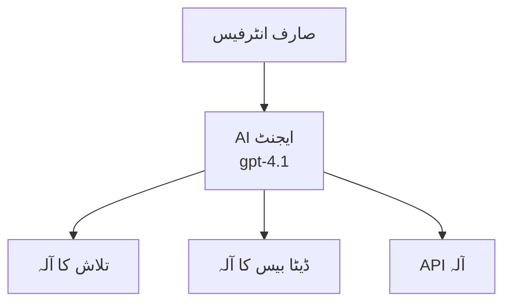
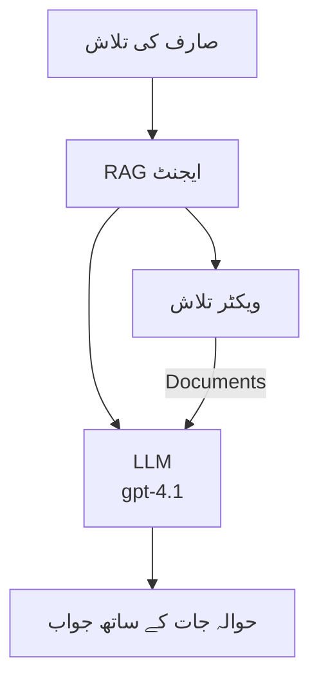
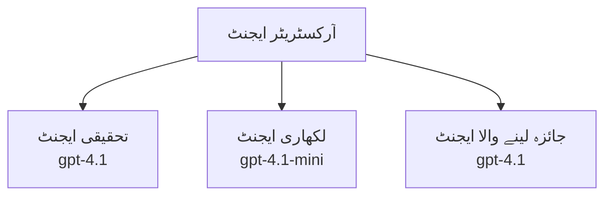

# Azure Developer CLI کے ساتھ AI ایجنٹس

**باب کی نیویگیشن:**
- **📚 کورس ہوم**: [نئی شروعات کرنے والوں کے لیے AZD](../../README.md)
- **📖 موجودہ باب**: باب 2 - AI-فرسٹ ڈیولپمنٹ
- **⬅️ پچھلا**: [Microsoft Foundry انٹیگریشن](microsoft-foundry-integration.md)
- **➡️ اگلا**: [AI ماڈل کی تعیناتی](ai-model-deployment.md)
- **🚀 پیش رفت**: [ملٹی ایجنٹ حل](../../examples/retail-scenario.md)

---

## تعارف

AI ایجنٹس خود مختار پروگرام ہوتے ہیں جو اپنے ماحول کو محسوس کر سکتے ہیں، فیصلے کر سکتے ہیں، اور مخصوص اہداف حاصل کرنے کے لیے اقدامات کر سکتے ہیں۔ سادہ چیٹ بوٹس جو پرامپٹس کا جواب دیتے ہیں، کے برخلاف، ایجنٹس یہ کر سکتے ہیں:

- **آلات استعمال کرنا** - APIs کال کرنا، ڈیٹا بیس تلاش کرنا، کوڈ چلانا
- **منصوبہ بندی اور استدلال** - پیچیدہ کاموں کو مراحل میں تقسیم کرنا
- **سیاق و سباق سے سیکھنا** - یادداشت برقرار رکھنا اور رویے کو ڈھالنا
- **تعاون کرنا** - دوسرے ایجنٹس کے ساتھ کام کرنا (ملٹی ایجنٹ سسٹمز)

یہ گائیڈ آپ کو دکھاتی ہے کہ کیسے AI ایجنٹس کو Azure پر Azure Developer CLI (azd) کے ذریعے تعینات کیا جائے۔

> **تصدیقی نوٹ (2026-03-25):** اس گائیڈ کا جائزہ `azd` `1.23.12` اور `azure.ai.agents` `0.1.18-preview` کے خلاف لیا گیا۔ `azd ai` کا تجربہ ابھی بھی پریویو پر مبنی ہے، لہٰذا اگر آپ کے نصب شدہ فلیگز مختلف ہیں تو ایکسٹینشن کی مدد چیک کریں۔

## تعلیمی مقاصد

اس گائیڈ کو مکمل کرنے سے آپ:
- سمجھ پائیں گے کہ AI ایجنٹس کیا ہیں اور وہ چیٹ بوٹس سے کیسے مختلف ہیں
- AZD استعمال کرتے ہوئے پہلے سے بنائے گئے AI ایجنٹ ٹیمپلیٹس کو تعینات کریں گے
- کسٹم ایجنٹس کے لیے Foundry Agents کو ترتیب دیں گے
- بنیادی ایجنٹ پیٹرنز (آلات کا استعمال، RAG، ملٹی ایجنٹ) نافذ کریں گے
- تعینات شدہ ایجنٹس کی نگرانی اور غلطیوں کا پتہ لگائیں گے

## تعلیمی نتائج

مکمل کرنے کے بعد، آپ قابل ہوں گے:
- ایک کمانڈ کے ذریعے Azure پر AI ایجنٹ ایپلیکیشنز تعینات کرنا
- ایجنٹ کے آلات اور صلاحیتوں کو ترتیب دینا
- ایجنٹس کے ساتھ رٹریول-آگمینٹڈ جنریشن (RAG) نافذ کرنا
- پیچیدہ ورک فلو کے لیے ملٹی ایجنٹ آرکیٹیکچرز ڈیزائن کرنا
- عام ایجنٹ تعیناتی مسائل کو حل کرنا

---

## 🤖 ایک ایجنٹ کو چیٹ بوٹ سے کیا فرق بناتا ہے؟

| خصوصیت | چیٹ بوٹ | AI ایجنٹ |
|---------|---------|----------|
| **رویہ** | پرامپٹس کا جواب دیتا ہے | خود مختار اقدامات کرتا ہے |
| **آلات** | کوئی نہیں | APIs کال کر سکتا ہے، تلاش کر سکتا ہے، کوڈ چلا سکتا ہے |
| **یادداشت** | صرف سیشن بیسڈ | سیشنز کے دوران مستقل یادداشت رکھتا ہے |
| **منصوبہ بندی** | واحد جواب | متعدد مراحل کا استدلال |
| **تعاون** | واحد اکائی | دوسرے ایجنٹس کے ساتھ کام کر سکتا ہے |

### آسان مثال

- **چیٹ بوٹ** = ایک مددگار شخص جو اطلاع ڈیسک پر سوالات کے جواب دیتا ہے
- **AI ایجنٹ** = ذاتی معاون جو کالز کر سکتا ہے، ملاقاتیں بک کر سکتا ہے، اور آپ کے لیے کام مکمل کر سکتا ہے

---

## 🚀 فوری آغاز: اپنا پہلا ایجنٹ تعینات کریں

### آپشن 1: Foundry Agents ٹیمپلیٹ (تجویز کردہ)

```bash
# AI ایجنٹس کے سانچے کو شروع کریں
azd init --template get-started-with-ai-agents

# Azure پر تعینات کریں
azd up
```

**جو تعینات ہوتا ہے:**
- ✅ Foundry Agents
- ✅ Microsoft Foundry Models (gpt-4.1)
- ✅ Azure AI Search (RAG کے لیے)
- ✅ Azure Container Apps (ویب انٹرفیس)
- ✅ Application Insights (مانیٹرنگ)

**وقت:** تقریباً 15-20 منٹ  
**لاگت:** تقریباً $100-150/ماہ (ڈیولپمنٹ)

### آپشن 2: OpenAI ایجنٹ with Prompty

```bash
# پرومیپٹی پر مبنی ایجنٹ سانچہ کو شروع کریں
azd init --template agent-openai-python-prompty

# ایزور پر تعینات کریں
azd up
```

**جو تعینات ہوتا ہے:**
- ✅ Azure Functions (سرور لیس ایجنٹ اگزیکیوشن)
- ✅ Microsoft Foundry Models
- ✅ Prompty کنفیگریشن فائلز
- ✅ نمونہ ایجنٹ کی عملدرآمد

**وقت:** تقریباً 10-15 منٹ  
**لاگت:** تقریباً $50-100/ماہ (ڈیولپمنٹ)

### آپشن 3: RAG چیٹ ایجنٹ

```bash
# RAG چیٹ ٹیمپلیٹ کو ابتدائی شکل دیں
azd init --template azure-search-openai-demo

# Azure پر تعینات کریں
azd up
```

**جو تعینات ہوتا ہے:**
- ✅ Microsoft Foundry Models
- ✅ Azure AI Search نمونہ ڈیٹا کے ساتھ
- ✅ دستاویزات پراسیسنگ پائپ لائن
- ✅ حوالہ جات کے ساتھ چیٹ انٹرفیس

**وقت:** تقریباً 15-25 منٹ  
**لاگت:** تقریباً $80-150/ماہ (ڈیولپمنٹ)

### آپشن 4: AZD AI Agent Init (Manifest- یا Template-بیسڈ پریویو)

اگر آپ کے پاس ایجنٹ مینیفیسٹ فائل ہے، تو آپ `azd ai` کمانڈ کے ذریعے براہ راست Foundry Agent Service پروجیکٹ کا اسکیفولڈ کر سکتے ہیں۔ حالیہ پریویو ریلیزز نے ٹیمپلیٹ-بیسڈ انیشیالائزیشن کی حمایت بھی شامل کی ہے، اس لیے آپ کا پرامپٹ بہاؤ آپ کے نصب شدہ ایکسٹینشن ورژن کے مطابق تھوڑا مختلف ہو سکتا ہے۔

```bash
# اے آئی ایجنٹس ایکسٹینشن انسٹال کریں
azd extension install azure.ai.agents

# اختیاری: نصب شدہ پریویو ورژن کی تصدیق کریں
azd extension show azure.ai.agents

# ایجنٹ مینی فیسٹ سے آغاز کریں
azd ai agent init -m agent-manifest.yaml

# Azure پر تعینات کریں
azd up

# تعینات کردہ ایجنٹ کا تجربہ کریں (لیٹنسی + پہلے بائٹ تک وقت دکھاتا ہے)
azd ai agent invoke
```

**`azd ai agent init` بمقابلہ `azd init --template` کب استعمال کریں:**

| طریقہ | بہترین ہے | طریقہ کار |
|----------|----------|-----------|
| `azd init --template` | کام کرنے والے نمونہ ایپ سے شروع کرنا | مکمل ٹیمپلیٹ ریپو کوڈ + انفراسٹرکچر کے ساتھ کلون کرتا ہے |
| `azd ai agent init -m` | اپنے ایجنٹ مینیفیسٹ سے تعمیر کرنا | آپ کی ایجنٹ وضاحت سے پروجیکٹ ڈھانچہ تیار کرتا ہے |

> **ٹپ:** سیکھنے کے لیے `azd init --template` استعمال کریں (اوپر آپشن 1-3)۔ پیداوار کے ایجنٹس بنانے کے لیے اپنی مینیفیسٹس کے ساتھ `azd ai agent init` استعمال کریں۔

`azd up` کے بعد، ایکسٹینشن آپ کو ایجنٹ کے باقی لائف سائیکل سے گزارے گا: `azd ai agent invoke` سے ٹیسٹ کریں، `azd ai agent eval generate` اور `azd ai agent optimize` سے معیار ناپیں اور بہتر کریں، اور `azd ai agent delete` سے صفائی کریں۔ مکمل حوالہ کے لیے دیکھیں [AZD AI CLI Commands](../chapter-08-production/production-ai-practices.md#azd-ai-cli-commands-and-extensions)۔

---

## 🏗️ ایجنٹ آرکیٹیکچر پیٹرنز

### پیٹرن 1: آلات کے ساتھ واحد ایجنٹ

سب سے آسان ایجنٹ پیٹرن - ایک ایجنٹ جو متعدد آلات استعمال کر سکتا ہے۔



**بہترین ہے:**
- کسٹمر سپورٹ بوٹس
- تحقیقی معاونین
- ڈیٹا تجزیہ ایجنٹس

**AZD ٹیمپلیٹ:** `azure-search-openai-demo`

### پیٹرن 2: RAG ایجنٹ (ریٹریول-آگمینٹڈ جنریشن)

ایک ایجنٹ جو جوابات بنانے سے پہلے متعلقہ دستاویزات حاصل کرتا ہے۔



**بہترین ہے:**
- انٹرپرائز نالج بیسز
- دستاویزات سوال و جواب کے نظام
- تعمیل اور قانونی تحقیق

**AZD ٹیمپلیٹ:** `azure-search-openai-demo`

### پیٹرن 3: ملٹی ایجنٹ سسٹم

متعدد خصوصی ایجنٹس جو مل کر پیچیدہ کام کرتے ہیں۔



**بہترین ہے:**
- پیچیدہ مواد کی تخلیق
- کثیر مرحلہ وار ورک فلو
- مختلف مہارتوں والے کام

**مزید معلومات:** [ملٹی ایجنٹ کوآرڈینیشن پیٹرنز](../chapter-06-pre-deployment/coordination-patterns.md)

---

## ⚙️ ایجنٹ آلات کی ترتیب

ایجنٹس طاقتور ہوتے ہیں جب وہ آلات استعمال کر سکیں۔ یہاں عام آلات کو ترتیب دینے کا طریقہ ہے:

### Foundry Agents میں آلہ کنفیگریشن

```python
# ایجنٹ_کنفیگ.py
from azure.ai.projects import AIProjectClient
from azure.ai.projects.models import FunctionTool, CodeInterpreterTool

# ذاتی اوزار کی تعریف کریں
search_tool = FunctionTool(
    name="search_knowledge_base",
    description="Search the company knowledge base for relevant documents",
    parameters={
        "type": "object",
        "properties": {
            "query": {
                "type": "string",
                "description": "The search query"
            }
        },
        "required": ["query"]
    }
)

# اوزار کے ساتھ ایجنٹ بنائیں
agent = project_client.agents.create_agent(
    model="gpt-4.1",
    name="Support Agent",
    instructions="You are a helpful support agent. Use the search tool to find relevant information.",
    tools=[search_tool, CodeInterpreterTool()]
)
```

### ماحول کی ترتیب

```bash
# ایجنٹ مخصوص ماحول کی متغیرات سیٹ کریں
azd env set AZURE_OPENAI_MODEL "gpt-4.1"
azd env set AGENT_INSTRUCTIONS "You are a helpful assistant..."
azd env set ENABLE_CODE_INTERPRETER "true"
azd env set ENABLE_FILE_SEARCH "true"

# تازہ ترین ترتیب کے ساتھ ڈیپلائے کریں
azd deploy
```

---

## 📊 ایجنٹس کی نگرانی

### ایپلیکیشن انسائٹس انٹیگریشن

تمام AZD ایجنٹ ٹیمپلیٹس نگرانی کے لیے Application Insights شامل کرتے ہیں:

```bash
# مانیٹرنگ ڈیش بورڈ کھولیں
azd monitor --overview

# لائیو لاگز دیکھیں
azd monitor --logs

# لائیو میٹرکس دیکھیں
azd monitor --live
```

### کلیدی میٹرکس ٹریک کریں

| میٹرک | وضاحت | ہدف |
|--------|-------------|--------|
| جواب دینے میں تاخیر | جواب پیدا کرنے کا وقت | < 5 سیکنڈ |
| ٹوکن کا استعمال | ہر درخواست کے ٹوکن | لاگت کے لیے مانیٹر کریں |
| آلہ کال کی کامیابی کی شرح | کامیاب آلہ عملدرآمد کا فیصد | > 95% |
| ایرر کی شرح | ناکام ایجنٹ درخواستیں | < 1% |
| صارف کی اطمینان | تاثرات کے اسکورز | > 4.0/5.0 |

### ایجنٹس کے لیے کسٹم لاگنگ

```python
import os
from azure.monitor.opentelemetry import configure_azure_monitor
from opentelemetry import trace

# ایزور مانیٹر کو اوپن ٹیلی میٹری کے ساتھ ترتیب دیں
configure_azure_monitor(
    connection_string=os.environ["APPLICATIONINSIGHTS_CONNECTION_STRING"]
)

tracer = trace.get_tracer(__name__)

def log_agent_interaction(user_query, agent_response, tools_used, latency_ms):
    with tracer.start_as_current_span("agent_interaction") as span:
        span.set_attributes({
            "user_query": user_query,
            "response_length": len(agent_response),
            "tools_used": tools_used,
            "latency_ms": latency_ms
        })
```

> **نوٹ:** مطلوبہ پیکجز انسٹال کریں: `pip install azure-monitor-opentelemetry opentelemetry`

---

## 💰 لاگت کے حوالے سے غوروفکر

### پیٹرن کے لحاظ سے اندازہ شدہ ماہانہ لاگت

| پیٹرن | ڈیولپمنٹ ماحول | پیداوار |
|---------|-----------------|------------|
| واحد ایجنٹ | $50-100 | $200-500 |
| RAG ایجنٹ | $80-150 | $300-800 |
| ملٹی ایجنٹ (2-3 ایجنٹس) | $150-300 | $500-1,500 |
| انٹرپرائز ملٹی ایجنٹ | $300-500 | $1,500-5,000+ |

### لاگت کو بہتر بنانے کے لیے تجاویز

1. **سادہ کاموں کے لیے gpt-4.1-mini استعمال کریں**
   ```bash
   azd env set AZURE_OPENAI_MODEL "gpt-4.1-mini"
   ```

2. **دہرائے جانے والے سوالات کے لیے کیشنگ نافذ کریں**
   ```python
   from functools import lru_cache
   
   @lru_cache(maxsize=1000)
   def get_cached_response(query_hash):
       return agent.run(query_hash)
   ```

3. **چلانے پر ٹوکن کی حد مقرر کریں**
   ```python
   # ایجنٹ کو چلانے کے وقت زیادہ سے زیادہ مکمل کرنے والے ٹوکن مقرر کریں، تخلیق کے دوران نہیں
   run = project_client.agents.create_run(
       thread_id=thread.id,
       agent_id=agent.id,
       max_completion_tokens=1000  # ردعمل کی لمبائی کو محدود کریں
   )
   ```

4. **استعمال نہ ہونے پر صفر تک اسکیل کریں**
   ```bash
   # کنٹینر ایپس خود بخود صفر پر اسکیل ہو جاتی ہیں
   azd env set MIN_REPLICAS "0"
   ```

---

## 🔧 ایجنٹس کا مسائل حل کرنا

### عام مسائل اور ان کے حل

<details>
<summary><strong>❌ ایجنٹ آلہ کالز کا جواب نہیں دے رہا</strong></summary>

```bash
# چیک کریں کہ ٹولز صحیح طریقے سے رجسٹرڈ ہیں
azd show

# اوپن اے آئی ڈپلائمنٹ کی تصدیق کریں
az cognitiveservices account deployment list \
  --name $AZURE_OPENAI_NAME \
  --resource-group $RG_NAME

# ایجنٹ کے لاگز چیک کریں
azd monitor --logs
```

**عام وجوہات:**
- آلہ فنکشن سائنچر میں تفاوت
- مطلوبہ اجازتیں غائب ہونا
- API اینڈپوائنٹ تک رسائی نہیں
</details>

<details>
<summary><strong>❌ ایجنٹ جوابات میں زیادہ تاخیر</strong></summary>

```bash
# بوتل نیک کے لیے ایپلیکیشن انسائٹس چیک کریں
azd monitor --live

# تیز تر ماڈل استعمال کرنے پر غور کریں
azd env set AZURE_OPENAI_MODEL "gpt-4.1-mini"
azd deploy
```

**بہتری کی تجاویز:**
- اسٹریمنگ جوابات استعمال کریں
- جوابات کیش کریں
- سیاق و سباق کی ونڈو کا سائز کم کریں
</details>

<details>
<summary><strong>❌ ایجنٹ غلط یا ہیلوسینیٹڈ معلومات دے رہا ہے</strong></summary>

```python
# نظام کی بہتر ہدایات کے ساتھ بہتری لائیں
instructions = """
You are a helpful assistant. IMPORTANT:
- Only answer based on provided context
- If you don't know, say "I don't know"
- Always cite your sources
- Never make up information
"""

# گراؤنڈنگ کے لیے بازیافت کو شامل کریں
agent = project_client.agents.create_agent(
    model="gpt-4.1",
    instructions=instructions,
    tools=[FileSearchTool()]  # جوابات کو دستاویزات میں بنیاد دیں
)
```
</details>

<details>
<summary><strong>❌ ٹوکن حد سے تجاوز کی غلطیاں</strong></summary>

```python
# کنٹیکسٹ ونڈو مینجمنٹ کو نافذ کریں
def truncate_context(messages, max_tokens=8000, model="gpt-4.1"):
    """Keep only recent messages within token limit."""
    import tiktoken
    encoding = tiktoken.encoding_for_model(model)
    total_tokens = 0
    truncated = []
    
    for msg in reversed(messages):
        msg_tokens = len(encoding.encode(msg.content))
        if total_tokens + msg_tokens > max_tokens:
            break
        truncated.insert(0, msg)
        total_tokens += msg_tokens
    
    return truncated
```
</details>

---

## 🎓 عملی مشقیں

### مشق 1: ایک بنیادی ایجنٹ تعینات کریں (20 منٹ)

**مقصد:** AZD کے ذریعے اپنا پہلا AI ایجنٹ تعینات کریں

```bash
# مرحلہ 1: ٹیمپلیٹ کو initialize کریں
azd init --template get-started-with-ai-agents

# مرحلہ 2: Azure میں لاگ ان کریں
azd auth login
# اگر آپ مختلف ٹیننٹس پر کام کرتے ہیں، تو --tenant-id <tenant-id> شامل کریں

# مرحلہ 3: تعینات کریں
azd up

# مرحلہ 4: ایجنٹ کا ٹیسٹ کریں
# تعیناتی کے بعد متوقع نتیجہ:
#   تعیناتی مکمل ہوئی!
#   اینڈپوائنٹ: https://<app-name>.<region>.azurecontainerapps.io
# نتائج میں دکھائی گئی URL کھولیں اور کوئی سوال پوچھنے کی کوشش کریں

# مرحلہ 5: مانیٹرنگ دیکھیں
azd monitor --overview

# مرحلہ 6: صفائی کریں
azd down --force --purge
```

**کامیابی کے معیار:**
- [ ] ایجنٹ سوالات کا جواب دیتا ہے
- [ ] `azd monitor` کے ذریعے مانیٹرنگ ڈیش بورڈ تک رسائی
- [ ] وسائل کو کامیابی سے کلین اپ کیا گیا

### مشق 2: ایک کسٹم آلہ شامل کریں (30 منٹ)

**مقصد:** ایجنٹ کو کسٹم آلہ کے ساتھ بڑھائیں

1. ایجنٹ ٹیمپلیٹ تعینات کریں:  
   ```bash
   azd init --template get-started-with-ai-agents
   azd up
   ```
  
2. ایجنٹ کے کوڈ میں نیا آلہ فنکشن بنائیں:  
   ```python
   def get_weather(location: str) -> str:
       """Get current weather for a location."""
       # موسم کی سروس کے لئے API کال
       return f"Weather in {location}: Sunny, 72°F"
   ```
  
3. آلہ کو ایجنٹ کے ساتھ رجسٹر کریں:  
   ```python
   from azure.ai.projects.models import FunctionTool

   weather_tool = FunctionTool(
       name="get_weather",
       description="Get current weather for a location",
       parameters={
           "type": "object",
           "properties": {
               "location": {"type": "string", "description": "City name"}
           },
           "required": ["location"]
       }
   )

   agent = project_client.agents.create_agent(
       model="gpt-4.1",
       name="Weather Agent",
       tools=[weather_tool]
   )
   ```
  
4. دوبارہ تعینات کریں اور ٹیسٹ کریں:  
   ```bash
   azd deploy
   # پوچھیں: "سیئیٹل میں موسم کیسا ہے؟"
   # متوقع: ایجنٹ get_weather("Seattle") کو کال کرتا ہے اور موسم کی معلومات لوٹاتا ہے
   ```
  
**کامیابی کے معیار:**
- [ ] ایجنٹ موسم سے متعلق سوالات کو پہچانے
- [ ] آلہ صحیح کال ہو رہا ہے
- [ ] جواب میں موسم کی معلومات شامل ہے

### مشق 3: RAG ایجنٹ بنائیں (45 منٹ)

**مقصد:** ایک ایسا ایجنٹ بنائیں جو آپ کی دستاویزات سے سوالات کے جواب دے

```bash
# مرحلہ 1: RAG ٹیمپلیٹ کو تعینات کریں
azd init --template azure-search-openai-demo
azd up

# مرحلہ 2: اپنے دستاویزات اپ لوڈ کریں
# پی ڈی ایف/ٹی ایکس ٹی فائلیں data/ ڈائریکٹری میں رکھیں، پھر چلائیں:
python scripts/prepdocs.py

# مرحلہ 3: مخصوص دائرہ کار کے سوالات کے ساتھ ٹیسٹ کریں
# azd up آؤٹ پٹ سے ویب ایپ کا URL کھولیں
# اپنے اپ لوڈ کردہ دستاویزات کے بارے میں سوالات پوچھیں
# جوابات میں حوالہ جات شامل ہونے چاہئیں جیسے [doc.pdf]
```

**کامیابی کے معیار:**
- [ ] ایجنٹ اپ لوڈ شدہ دستاویزات سے جواب دیتا ہے
- [ ] جوابات میں حوالہ جات شامل ہیں
- [ ] دائرہ کار سے باہر سوالات پر ہیلوسینیشن نہیں

---

## 📚 اگلے اقدامات

اب جب کہ آپ AI ایجنٹس کو سمجھ چکے ہیں، ان پیش رفتی موضوعات کا مطالعہ کریں:

| موضوع | وضاحت | لنک |
|-------|-------------|------|
| **ملٹی ایجنٹ سسٹمز** | متعدد تعاون کرنے والے ایجنٹس کے ساتھ سسٹمز بنائیں | [ریٹیل ملٹی ایجنٹ مثال](../../examples/retail-scenario.md) |
| **کوآرڈینیشن پیٹرنز** | آرکیسٹریشن اور مواصلاتی پیٹرنز سیکھیں | [کوآرڈینیشن پیٹرنز](../chapter-06-pre-deployment/coordination-patterns.md) |
| **پیداوار تعیناتی** | انٹرپرائز کے قابل ایجنٹ تعیناتی | [پیداوار AI طریقہ کار](../chapter-08-production/production-ai-practices.md) |
| **ایجنٹ کی جانچ** | ایجنٹ کی کارکردگی کا ٹیسٹ اور جائزہ | [AI مسائل کی جانچ](../chapter-07-troubleshooting/ai-troubleshooting.md) |
| **AI ورکشاپ لیب** | عملی: اپنا AI حل AZD-ریڈی بنائیں | [AI ورکشاپ لیب](ai-workshop-lab.md) |

---

## 📖 اضافی وسائل

### سرکاری دستاویزات
- [Microsoft Foundry Agent Service](https://learn.microsoft.com/azure/ai-services/agents/)
- [Microsoft Foundry Agent Service Quickstart](https://learn.microsoft.com/azure/ai-services/agents/quickstart)
- [Semantic Kernel Agent Framework](https://learn.microsoft.com/semantic-kernel/)

### AZD ایجنٹ ٹیمپلیٹس
- [AI ایجنٹس کے ساتھ شروعات کریں](https://github.com/Azure-Samples/get-started-with-ai-agents)
- [Agent OpenAI Python Prompty](https://github.com/Azure-Samples/agent-openai-python-prompty)
- [Azure Search OpenAI Demo](https://github.com/Azure-Samples/azure-search-openai-demo)

### کمیونٹی وسائل
- [Awesome AZD - ایجنٹ ٹیمپلیٹس](https://azure.github.io/awesome-azd/?tags=ai-agents)
- [Azure AI Discord](https://discord.gg/microsoft-azure)
- [Microsoft Foundry Discord](https://discord.gg/nTYy5BXMWG)

### آپ کے ایڈیٹر کے لیے ایجنٹ اسکلز
- [**Microsoft Azure Agent Skills**](https://skills.sh/microsoft/github-copilot-for-azure) - GitHub Copilot، Cursor، یا کسی بھی سپورٹڈ ایجنٹ میں Azure ڈیولپمنٹ کے لیے قابل استعمال AI ایجنٹ اسکلز انسٹال کریں۔ اس میں [Azure AI](https://skills.sh/microsoft/github-copilot-for-azure/azure-ai)، [Microsoft Foundry](https://skills.sh/microsoft/github-copilot-for-azure/microsoft-foundry)، [تعیناتی](https://skills.sh/microsoft/github-copilot-for-azure/azure-deploy)، اور [تشخیص](https://skills.sh/microsoft/github-copilot-for-azure/azure-diagnostics) کی اسکلز شامل ہیں:  
  ```bash
  npx skills add microsoft/github-copilot-for-azure
  ```

---

**نیویگیشن**
- **پچھلا سبق**: [Microsoft Foundry انٹیگریشن](microsoft-foundry-integration.md)
- **اگلا سبق**: [AI ماڈل کی تعیناتی](ai-model-deployment.md)

---

<!-- CO-OP TRANSLATOR DISCLAIMER START -->
**ڈس کلیمر**:
یہ دستاویز AI ترجمہ سروس [Co-op Translator](https://github.com/Azure/co-op-translator) کے ذریعے ترجمہ کی گئی ہے۔ جبکہ ہم درستگی کے لیے کوشاں ہیں، براہ کرم اس بات سے آگاہ رہیں کہ خودکار ترجمے میں غلطیاں یا عدم درستیاں ہو سکتی ہیں۔ اصل دستاویز اپنے مادری زبان میں مستند ماخذ سمجھی جائے گی۔ حساس معلومات کے لیے پیشہ ور انسانی ترجمہ کی سفارش کی جاتی ہے۔ اس ترجمے کے استعمال سے پیدا ہونے والی کسی بھی غلط فہمی یا غلط تشریح کی ذمہ داری ہم قبول نہیں کرتے۔
<!-- CO-OP TRANSLATOR DISCLAIMER END -->