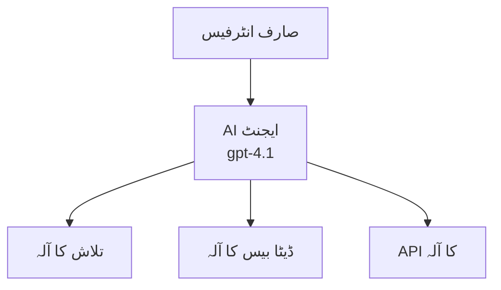
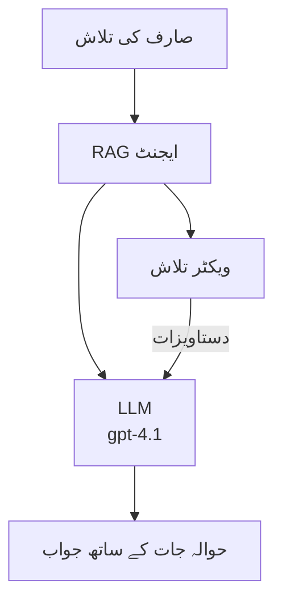

# Azure Developer CLI کے ساتھ AI ایجنٹس

**چیپٹر نیویگیشن:**
- **📚 کورس ہوم**: [AZD برائے ابتدائی صارفین](../../README.md)
- **📖 موجودہ چیپٹر**: چیپٹر 2 - AI-فرسٹ ڈویلپمنٹ
- **⬅️ پچھلا**: [Microsoft Foundry انٹیگریشن](microsoft-foundry-integration.md)
- **➡️ اگلا**: [AI ماڈل ڈیپلائمنٹ](ai-model-deployment.md)
- **🚀 ایڈوانسڈ**: [ملٹی-ایجنٹ حل](../../examples/retail-scenario.md)

---

## تعارف

AI ایجنٹس خود مختار پروگرام ہیں جو اپنے ماحول کا ادراک کر سکتے ہیں، فیصلے کر سکتے ہیں، اور مخصوص أهداف حاصل کرنے کے لیے اقدامات کر سکتے ہیں۔ سادہ چیٹ بوٹس کے برعکس جو کہ صرف جوابات دیتے ہیں، ایجنٹس یہ کر سکتے ہیں:

- **ٹولز کا استعمال** - APIs کال کرنا، ڈیٹا بیس تلاش کرنا، کوڈ چلانا  
- **منصوبہ بندی اور استدلال** - پیچیدہ کاموں کو مرحلوں میں بانٹنا  
- **سیاق و سباق سے سیکھنا** - یادداشت برقرار رکھنا اور رویہ ڈھالنا  
- **اشتراک کرنا** - دوسرے ایجنٹس کے ساتھ کام کرنا (ملٹی-ایجنٹ سسٹمز)

یہ رہنما آپ کو دکھاتا ہے کہ Azure Developer CLI (azd) کے ذریعے AI ایجنٹس کو Azure پر کیسے ڈیپلائے کیا جائے۔

> **تصدیقی نوٹ (2026-03-25):** اس گائیڈ کا جائزہ `azd` `1.23.12` اور `azure.ai.agents` `0.1.18-preview` کے مطابق لیا گیا۔ `azd ai` کا تجربہ اب بھی پریویو میں ہے، لہٰذا اگر آپ کے انسٹال کیے گئے فلیگز مختلف ہوں تو ایکسٹینشن کی مدد چیک کریں۔

## سیکھنے کے اہداف

اس رہنما کو مکمل کرنے پر آپ:
- سمجھ پائیں گے کہ AI ایجنٹس کیا ہیں اور وہ چیٹ بوٹس سے کیسے مختلف ہیں  
- AZD استعمال کرتے ہوئے پہلے سے تیار شدہ AI ایجنٹ ٹیمپلیٹس کو ڈیپلائے کر سکیں گے  
- فاؤنڈری ایجنٹس کو حسب ضرورت ایجنٹس کے لیے ترتیب دے سکیں گے  
- بنیادی ایجنٹ پیٹرنز (ٹول کا استعمال، RAG، ملٹی-ایجنٹ) کو نافذ کر سکیں گے  
- ڈیپلائے کیے گئے ایجنٹس کی نگرانی اور ڈیبگ کر سکیں گے  

## سیکھنے کے نتائج

مکمل کرنے پر آپ قابل ہو جائیں گے کہ:
- ایک کمانڈ سے Azure پر AI ایجنٹ ایپلیکیشنز کو ڈیپلائے کریں  
- ایجنٹ کے ٹولز اور صلاحیتوں کو ترتیب دیں  
- RAG (retrieval-augmented generation) ایجنٹس کے ساتھ نافذ کریں  
- پیچیدہ ورک فلو کے لیے ملٹی-ایجنٹ آرکیٹیکچرز ڈیزائن کریں  
- عام ڈیپلائمنٹ مسائل کی نشاندہی اور حل کریں  

---

## 🤖 ایجنٹ کو چیٹ بوٹ سے مختلف کیا بناتا ہے؟

| خصوصیت | چیٹ بوٹ | AI ایجنٹ |
|---------|---------|-----------|
| **رویّه** | کمانڈز پر جواب دیتا ہے | خود مختار کارروائیاں انجام دیتا ہے |
| **ٹولز** | کوئی نہیں | API کال کر سکتا ہے، تلاش کر سکتا ہے، کوڈ چلا سکتا ہے |
| **یادداشت** | صرف سیشن کی بنیاد پر | سیشنز کے درمیان مستقل یادداشت |
| **منصوبہ بندی** | واحد جواب | کثیر مرحلہ استدلال |
| **اشتراک** | واحد ہستی | دوسرے ایجنٹس کے ساتھ کام کر سکتا ہے |

### آسان تشبیہ

- **چیٹ بوٹ** = معلوماتی ڈیسک پر سوالوں کا جواب دینے والا مددگار شخص  
- **AI ایجنٹ** = ذاتی معاون جو کالز کر سکتا ہے، ملاقاتیں بُک کر سکتا ہے، اور آپ کے لیے کام مکمل کر سکتا ہے  

---

## 🚀 فوری آغاز: اپنا پہلا ایجنٹ ڈیپلائے کریں

### اختیار 1: فاؤنڈری ایجنٹس ٹیمپلیٹ (تجویز کردہ)

```bash
# اے آئی ایجنٹس ٹیمپلیٹ کو شروع کریں
azd init --template get-started-with-ai-agents

# ایزور پر تعینات کریں
azd up
```
  
**کیا ڈیپلائے ہوتا ہے:**  
- ✅ فاؤنڈری ایجنٹس  
- ✅ Microsoft Foundry ماڈلز (gpt-4.1)  
- ✅ Azure AI سرچ (RAG کے لیے)  
- ✅ Azure کنٹینر ایپس (ویب انٹرفیس)  
- ✅ ایپلیکیشن انسائٹس (نگرانی)  

**وقت:** تقریباً 15-20 منٹ  
**لاگت:** تقریباً $100-150/مہینہ (ترقیاتی)  

### اختیار 2: OpenAI ایجنٹ Prompty کے ساتھ

```bash
# پرومپٹی پر مبنی ایجنٹ ٹیمپلیٹ کو شروع کریں
azd init --template agent-openai-python-prompty

# ایزور پر تعینات کریں
azd up
```
  
**کیا ڈیپلائے ہوتا ہے:**  
- ✅ Azure فنکشنز (سرور لیس ایجنٹ عمل درآمد)  
- ✅ Microsoft Foundry ماڈلز  
- ✅ Prompty کنفیگریشن فائلز  
- ✅ سیمپل ایجنٹ امپلیمنٹیشن  

**وقت:** تقریباً 10-15 منٹ  
**لاگت:** تقریباً $50-100/مہینہ (ترقیاتی)  

### اختیار 3: RAG چیٹ ایجنٹ

```bash
# RAG چیٹ ٹیمپلیٹ کو شروع کریں
azd init --template azure-search-openai-demo

# Azure پر تعینات کریں
azd up
```
  
**کیا ڈیپلائے ہوتا ہے:**  
- ✅ Microsoft Foundry ماڈلز  
- ✅ Azure AI سرچ نمونے کے ڈیٹا کے ساتھ  
- ✅ ڈاکومنٹ پروسیسنگ پائپ لائن  
- ✅ حوالہ جات کے ساتھ چیٹ انٹرفیس  

**وقت:** تقریباً 15-25 منٹ  
**لاگت:** تقریباً $80-150/مہینہ (ترقیاتی)  

### اختیار 4: AZD AI Agent Init (مانیفیسٹ یا ٹیمپلیٹ پر مبنی پریویو)

اگر آپ کے پاس ایجنٹ مانیفیسٹ فائل ہے، تو آپ `azd ai` کمانڈ استعمال کر کے براہ راست فاؤنڈری ایجنٹ سروس پروجیکٹ اسکافولڈ کر سکتے ہیں۔ حالیہ پریویو ریلیزز نے ٹیمپلیٹ پر مبنی ابتدائی سپورٹ بھی شامل کی ہے، لہٰذا آپ کے نصب شدہ ایکسٹینشن ورژن کے مطابق پرومپٹ فلو میں معمولی فرق ہو سکتا ہے۔

```bash
# AI ایجنٹس ایکسٹینشن انسٹال کریں
azd extension install azure.ai.agents

# اختیاری: انسٹال شدہ پری ویو ورژن کی تصدیق کریں
azd extension show azure.ai.agents

# ایجنٹ مینفیسٹ سے آغاز کریں
azd ai agent init -m agent-manifest.yaml

# Azure پر تعینات کریں
azd up
```
  
**`azd ai agent init` اور `azd init --template` کے استعمال کے درمیان فرق:**  

| طریقہ کار | بہترین استعمال | کام کرنے کا طریقہ |
|----------|----------|-----------------|
| `azd init --template` | کسی کام کرنے والی سیمپل ایپ سے آغاز | کوڈ اور انفراسٹرکچر کے ساتھ ٹیمپلیٹ ریپو کلون کرتا ہے |
| `azd ai agent init -m` | اپنے ایجنٹ مانیفیسٹ سے پروجیکٹ بنانا | آپ کی ایجنٹ تعریف سے پروجیکٹ کی ساخت تیار کرتا ہے |

> **مشورہ:** سیکھتے وقت `azd init --template` استعمال کریں (اوپر دیے گئے اختیارات 1-3)۔ اپنے مانیفیسٹس کے ساتھ پروڈکشن ایجنٹس بنانے کے لیے `azd ai agent init` استعمال کریں۔ مکمل حوالہ کے لیے دیکھیں [AZD AI CLI Commands](../chapter-08-production/production-ai-practices.md#azd-ai-cli-commands-and-extensions)۔

---

## 🏗️ ایجنٹ آرکیٹیکچر کے پیٹرنز

### پیٹرن 1: ایک واحد ایجنٹ ٹولز کے ساتھ

سب سے آسان ایجنٹ پیٹرن - ایک ایجنٹ جو کئی ٹولز استعمال کر سکتا ہے۔


**بہترین استعمال کے لیے:**  
- کسٹمر سپورٹ بوٹس  
- تحقیقاتی معاونین  
- ڈیٹا تجزیہ کے ایجنٹس  

**AZD ٹیمپلیٹ:** `azure-search-openai-demo`  

### پیٹرن 2: RAG ایجنٹ (retrieval-augmented generation)

ایسا ایجنٹ جو جواب دینے سے پہلے متعلقہ دستاویزات حاصل کرتا ہے۔


**بہترین استعمال کے لیے:**  
- انٹرپرائز نالج بیسز  
- دستاویزی سوال و جواب کے نظام  
- تعمیل اور قانونی تحقیق  

**AZD ٹیمپلیٹ:** `azure-search-openai-demo`  

### پیٹرن 3: ملٹی-ایجنٹ سسٹم

متعدد ماہر ایجنٹس جو پیچیدہ کاموں پر اکٹھے کام کرتے ہیں۔


**بہترین استعمال کے لیے:**  
- پیچیدہ مواد تیار کرنا  
- کثیر مرحلہ ورک فلو  
- مختلف مہارتیں درکار کام  

**مزید جانیں:** [ملٹی-ایجنٹ کوآرڈینیشن پیٹرنز](../chapter-06-pre-deployment/coordination-patterns.md)  

---

## ⚙️ ایجنٹ ٹولز کی ترتیب

ایجنٹس طاقتور ہوتے ہیں جب وہ ٹولز استعمال کر سکیں۔ یہاں عام ٹولز کو ترتیب دینے کا طریقہ ہے:

### فاؤنڈری ایجنٹس میں ٹول کنفیگریشن

```python
# agent_config.py
from azure.ai.projects import AIProjectClient
from azure.ai.projects.models import FunctionTool, CodeInterpreterTool

# حسب ضرورت اوزار متعین کریں
search_tool = FunctionTool(
    name="search_knowledge_base",
    description="Search the company knowledge base for relevant documents",
    parameters={
        "type": "object",
        "properties": {
            "query": {
                "type": "string",
                "description": "The search query"
            }
        },
        "required": ["query"]
    }
)

# اوزاروں کے ساتھ ایجنٹ بنائیں
agent = project_client.agents.create_agent(
    model="gpt-4.1",
    name="Support Agent",
    instructions="You are a helpful support agent. Use the search tool to find relevant information.",
    tools=[search_tool, CodeInterpreterTool()]
)
```
  
### ماحول کی ترتیب

```bash
# ایجنٹ مخصوص ماحول کے متغیرات سیٹ کریں
azd env set AZURE_OPENAI_MODEL "gpt-4.1"
azd env set AGENT_INSTRUCTIONS "You are a helpful assistant..."
azd env set ENABLE_CODE_INTERPRETER "true"
azd env set ENABLE_FILE_SEARCH "true"

# تازہ کاری شدہ ترتیب کے ساتھ تعینات کریں
azd deploy
```
  
---

## 📊 ایجنٹس کی نگرانی

### ایپلیکیشن انسائٹس انٹیگریشن

تمام AZD ایجنٹ ٹیمپلیٹس میں نگرانی کے لیے ایپلیکیشن انسائٹس شامل ہے:

```bash
# مانیٹرنگ ڈیش بورڈ کھولیں
azd monitor --overview

# لائیو لاگز دیکھیں
azd monitor --logs

# لائیو میٹرکس دیکھیں
azd monitor --live
```
  
### قابلِ ٹریک اہم میٹرکس

| میٹرک | وضاحت | ہدف |
|--------|----------|-------|
| ریسپانس لیٹینسی | جواب تیار کرنے کا وقت | < 5 سیکنڈ |
| ٹوکن استعمال | فی درخواست ٹوکنز | قیمت پر نظر رکھیں |
| ٹول کال کی کامیابی کی شرح | کامیاب ٹول ایکزیکیوشنز کا % | > 95% |
| ایرر ریٹ | ناکام ایجنٹ درخواستیں | < 1% |
| یوزر سیٹسفیکشن | فیڈبیک اسکورز | > 4.0/5.0 |

### ایجنٹس کے لیے کسٹم لاگنگ

```python
import os
from azure.monitor.opentelemetry import configure_azure_monitor
from opentelemetry import trace

# Azure Monitor کو OpenTelemetry کے ساتھ ترتیب دیں
configure_azure_monitor(
    connection_string=os.environ["APPLICATIONINSIGHTS_CONNECTION_STRING"]
)

tracer = trace.get_tracer(__name__)

def log_agent_interaction(user_query, agent_response, tools_used, latency_ms):
    with tracer.start_as_current_span("agent_interaction") as span:
        span.set_attributes({
            "user_query": user_query,
            "response_length": len(agent_response),
            "tools_used": tools_used,
            "latency_ms": latency_ms
        })
```
  
> **نوٹ:** مطلوبہ پیکیجز انسٹال کریں: `pip install azure-monitor-opentelemetry opentelemetry`  

---

## 💰 لاگت کے پہلو

### پیٹرن کے مطابق اندازاً ماہانہ لاگت

| پیٹرن | ڈیولپمنٹ ماحول | پروڈکشن |
|---------|-----------------|----------|
| ایک واحد ایجنٹ | $50-100 | $200-500 |
| RAG ایجنٹ | $80-150 | $300-800 |
| ملٹی-ایجنٹ (2-3 ایجنٹس) | $150-300 | $500-1,500 |
| انٹرپرائز ملٹی-ایجنٹ | $300-500 | $1,500-5,000+ |

### لاگت کی بچت کے مشورے

1. **سادہ کاموں کے لیے gpt-4.1-mini استعمال کریں**  
   ```bash
   azd env set AZURE_OPENAI_MODEL "gpt-4.1-mini"
   ```
  
2. **دہرائے جانے والے سوالات کے لیے کیشنگ کریں**  
   ```python
   from functools import lru_cache
   
   @lru_cache(maxsize=1000)
   def get_cached_response(query_hash):
       return agent.run(query_hash)
   ```
  
3. **ہر رن کے لیے ٹوکن کی حد مقرر کریں**  
   ```python
   # جب ایجنٹ چلا رہے ہوں تو زیادہ سے زیادہ مکمل ٹوکنز سیٹ کریں، تخلیق کے دوران نہیں
   run = project_client.agents.create_run(
       thread_id=thread.id,
       agent_id=agent.id,
       max_completion_tokens=1000  # جواب کی لمبائی محدود کریں
   )
   ```
  
4. **جب استعمال میں نہ ہو تو صفر تک اسکیل کریں**  
   ```bash
   # کنٹینر ایپس خود بخود صفر تک اسکیل ہو جاتی ہیں
   azd env set MIN_REPLICAS "0"
   ```
  
---

## 🔧 ایجنٹس کی خرابیوں کا ازالہ

### عام مسائل اور ان کے حل

<details>  
<summary><strong>❌ ایجنٹ ٹول کالز کا جواب نہیں دے رہا</strong></summary>  

```bash
# چیک کریں کہ ٹولز صحیح طریقے سے رجسٹرڈ ہیں
azd show

# اوپن اے آئی ڈیپلائمنٹ کی تصدیق کریں
az cognitiveservices account deployment list \
  --name $AZURE_OPENAI_NAME \
  --resource-group $RG_NAME

# ایجنٹ کے لاگز چیک کریں
azd monitor --logs
```
  
**عام وجوہات:**  
- ٹول فنکشن دستخط میں فرق  
- مطلوبہ اجازتوں کی کمی  
- API اینڈ پوائنٹ تک رسائی نہیں  
</details>  

<details>  
<summary><strong>❌ ایجنٹ کے جوابات میں تاخیر بہت زیادہ</strong></summary>  

```bash
# ایپلیکیشن انسائٹس میں رکاوٹوں کی جانچ کریں
azd monitor --live

# تیز ماڈل استعمال کرنے پر غور کریں
azd env set AZURE_OPENAI_MODEL "gpt-4.1-mini"
azd deploy
```
  
**بہتری کے مشورے:**  
- اسٹریمنگ جوابات استعمال کریں  
- جواب کی کیشنگ نافذ کریں  
- کانٹیکسٹ ونڈو کی سائز کم کریں  
</details>  

<details>  
<summary><strong>❌ ایجنٹ غلط یا باقی ماندہ معلومات دے رہا ہے</strong></summary>  

```python
# بہتر نظام کے اشاروں کے ساتھ بہتری کریں
instructions = """
You are a helpful assistant. IMPORTANT:
- Only answer based on provided context
- If you don't know, say "I don't know"
- Always cite your sources
- Never make up information
"""

# گراؤنڈنگ کے لیے بازیافت شامل کریں
agent = project_client.agents.create_agent(
    model="gpt-4.1",
    instructions=instructions,
    tools=[FileSearchTool()]  # جوابات کو دستاویزات میں گراؤنڈ کریں
)
```
  
</details>  

<details>  
<summary><strong>❌ ٹوکن کی حد سے زیادہ ہونے کی غلطیاں</strong></summary>  

```python
# سیاق و سباق کھڑکی کے انتظام کو نافذ کریں
def truncate_context(messages, max_tokens=8000, model="gpt-4.1"):
    """Keep only recent messages within token limit."""
    import tiktoken
    encoding = tiktoken.encoding_for_model(model)
    total_tokens = 0
    truncated = []
    
    for msg in reversed(messages):
        msg_tokens = len(encoding.encode(msg.content))
        if total_tokens + msg_tokens > max_tokens:
            break
        truncated.insert(0, msg)
        total_tokens += msg_tokens
    
    return truncated
```
  
</details>  

---

## 🎓 عملی مشقیں

### مشق 1: ایک بنیادی ایجنٹ ڈیپلائے کریں (20 منٹ)

**مقصد:** AZD استعمال کرتے ہوئے اپنا پہلا AI ایجنٹ ڈیپلائے کریں

```bash
# مرحلہ 1: ٹیمپلیٹ کو شروع کریں
azd init --template get-started-with-ai-agents

# مرحلہ 2: Azure میں لاگ ان کریں
azd auth login
# اگر آپ مختلف ٹیننٹس پر کام کر رہے ہیں، تو --tenant-id <tenant-id> شامل کریں

# مرحلہ 3: تعین کریں
azd up

# مرحلہ 4: ایجنٹ کا ٹیسٹ کریں
# تعیناتی کے بعد متوقع آؤٹ پٹ:
#   تعیناتی مکمل!
#   اینڈ پوائنٹ: https://<app-name>.<region>.azurecontainerapps.io
# آؤٹ پٹ میں دکھائی گئی URL کو کھولیں اور سوال کرنے کی کوشش کریں

# مرحلہ 5: مانیٹرنگ دیکھیں
azd monitor --overview

# مرحلہ 6: صفائی کریں
azd down --force --purge
```
  
**کامیابی کے معیارات:**  
- [ ] ایجنٹ سوالات کے جواب دے  
- [ ] `azd monitor` کے ذریعے نگرانی ڈیش بورڈ تک رسائی ہو  
- [ ] وسائل کامیابی سے صفایا ہو گئے ہوں  

### مشق 2: ایک کسٹم ٹول شامل کریں (30 منٹ)

**مقصد:** ایک ایجنٹ کو کسٹم ٹول کے ساتھ بڑھائیں

1. ایجنٹ ٹیمپلیٹ ڈیپلائے کریں:  
   ```bash
   azd init --template get-started-with-ai-agents
   azd up
   ```
2. ایجنٹ کوڈ میں نیا ٹول فنکشن بنائیں:  
   ```python
   def get_weather(location: str) -> str:
       """Get current weather for a location."""
       # موسم کی سروس کے لیے API کال
       return f"Weather in {location}: Sunny, 72°F"
   ```
3. ایجنٹ کے ساتھ ٹول رجسٹر کریں:  
   ```python
   from azure.ai.projects.models import FunctionTool

   weather_tool = FunctionTool(
       name="get_weather",
       description="Get current weather for a location",
       parameters={
           "type": "object",
           "properties": {
               "location": {"type": "string", "description": "City name"}
           },
           "required": ["location"]
       }
   )

   agent = project_client.agents.create_agent(
       model="gpt-4.1",
       name="Weather Agent",
       tools=[weather_tool]
   )
   ```
4. دوبارہ ڈیپلائے کریں اور ٹیسٹ کریں:  
   ```bash
   azd deploy
   # پوچھیں: "سیئٹل میں موسم کیسا ہے؟"
   # توقع ہے: ایجنٹ get_weather("Seattle") کال کرتا ہے اور موسم کی معلومات واپس دیتا ہے
   ```
  
**کامیابی کے معیارات:**  
- [ ] ایجنٹ موسمی حالات سے متعلق سوالات کو پہچانے  
- [ ] ٹول کو درست طریقے سے کال کیا جائے  
- [ ] جواب میں موسم کی معلومات شامل ہو  

### مشق 3: ایک RAG ایجنٹ بنائیں (45 منٹ)

**مقصد:** ایک ایسا ایجنٹ بنائیں جو آپ کے دستاویزات سے سوالات کے جواب دے

```bash
# مرحلہ 1: RAG ٹیمپلیٹ کو تعینات کریں
azd init --template azure-search-openai-demo
azd up

# مرحلہ 2: اپنے دستاویزات اپ لوڈ کریں
# PDF/TXT فائلوں کو data/ ڈائریکٹو میں رکھیں، پھر یہ چلائیں:
python scripts/prepdocs.py

# مرحلہ 3: مخصوص دائرہ کار کے سوالات کے ساتھ جانچ کریں
# azd up کے آؤٹ پٹ سے ویب ایپ URL کھولیں
# اپنے اپ لوڈ شدہ دستاویزات کے بارے میں سوالات پوچھیں
# جوابات میں حوالہ جات شامل ہونے چاہئیں جیسے [doc.pdf]
```
  
**کامیابی کے معیارات:**  
- [ ] ایجنٹ اپ لوڈ کیے گئے دستاویزات سے جواب دے  
- [ ] جوابات میں حوالہ جات شامل ہوں  
- [ ] دائرہ کار سے باہر سوالات پر ہیلوسینیشن نہ ہو  

---

## 📚 اگلے مراحل

اب جب کہ آپ AI ایجنٹس کو سمجھ چکے ہیں، ان ایڈوانسڈ موضوعات کو دریافت کریں:

| موضوع | وضاحت | لنک |
|-------|---------|-----|
| **ملٹی-ایجنٹ سسٹمز** | ایک سے زیادہ تعاون کرنے والے ایجنٹس کے سسٹمز بنائیں | [ریٹیل ملٹی-ایجنٹ مثال](../../examples/retail-scenario.md) |
| **کوآرڈینیشن پیٹرنز** | تنظیم کاری اور کمیونیکیشن پیٹرنز سیکھیں | [کوآرڈینیشن پیٹرنز](../chapter-06-pre-deployment/coordination-patterns.md) |
| **پروڈکشن ڈیپلائمنٹ** | انٹرپرائز ریڈی ایجنٹس کی تعیناتی | [پروڈکشن AI مشقیں](../chapter-08-production/production-ai-practices.md) |
| **ایجنٹ ایویلیوایشن** | ایجنٹ کی کارکردگی کا ٹیسٹ اور جائزہ | [AI خرابیوں کا حل](../chapter-07-troubleshooting/ai-troubleshooting.md) |
| **AI ورکشاپ لیب** | عملی: اپنا AI حل AZD-ریڈی بنائیں | [AI ورکشاپ لیب](ai-workshop-lab.md) |

---

## 📖 اضافی وسائل

### سرکاری دستاویزات  
- [Azure AI Agent Service](https://learn.microsoft.com/azure/ai-services/agents/)  
- [Azure AI Foundry Agent Service Quickstart](https://learn.microsoft.com/azure/ai-services/agents/quickstart)  
- [Semantic Kernel Agent Framework](https://learn.microsoft.com/semantic-kernel/)  

### AZD ایجنٹس کے لیے ٹیمپلیٹس  
- [AI ایجنٹس کے ساتھ آغاز کریں](https://github.com/Azure-Samples/get-started-with-ai-agents)  
- [Agent OpenAI Python Prompty](https://github.com/Azure-Samples/agent-openai-python-prompty)  
- [Azure Search OpenAI Demo](https://github.com/Azure-Samples/azure-search-openai-demo)  

### کمیونٹی وسائل  
- [Awesome AZD - ایجنٹ ٹیمپلیٹس](https://azure.github.io/awesome-azd/?tags=ai-agents)  
- [Azure AI ڈسکارڈ](https://discord.gg/microsoft-azure)  
- [Microsoft Foundry ڈسکارڈ](https://discord.gg/nTYy5BXMWG)  

### آپ کے ایڈیٹر کے لیے ایجنٹ اسکلز  
- [**Microsoft Azure Agent Skills**](https://skills.sh/microsoft/github-copilot-for-azure) - GitHub Copilot، Cursor، یا کسی بھی سپورٹڈ ایجنٹ میں Azure ڈویلپمنٹ کے لیے قابل استعمال AI ایجنٹ مہارتیں انسٹال کریں۔ اس میں [Azure AI](https://skills.sh/microsoft/github-copilot-for-azure/azure-ai)، [Microsoft Foundry](https://skills.sh/microsoft/github-copilot-for-azure/microsoft-foundry)، [ڈیپلائمنٹ](https://skills.sh/microsoft/github-copilot-for-azure/azure-deploy)، اور [تشخیصات](https://skills.sh/microsoft/github-copilot-for-azure/azure-diagnostics) کے اسکلز شامل ہیں:  
  ```bash
  npx skills add microsoft/github-copilot-for-azure
  ```
  
---

**نیویگیشن**  
- **پچھلا سبق**: [Microsoft Foundry انٹیگریشن](microsoft-foundry-integration.md)  
- **اگلا سبق**: [AI ماڈل ڈیپلائمنٹ](ai-model-deployment.md)

---

<!-- CO-OP TRANSLATOR DISCLAIMER START -->
**ڈس کلیمر**:  
اس دستاویز کا ترجمہ AI ترجمہ سروس [Co-op Translator](https://github.com/Azure/co-op-translator) کے ذریعے کیا گیا ہے۔ اگرچہ ہم درستگی کے لیے کوشاں ہیں، براہ کرم اس بات سے آگاہ رہیں کہ خودکار ترجموں میں غلطیاں یا بے یقینی ہو سکتی ہے۔ اصل دستاویز اپنی مادری زبان میں ہی مستند ماخذ تصور کی جانی چاہیے۔ اہم معلومات کے لیے پیشہ ور انسانی ترجمہ کی سفارش کی جاتی ہے۔ اس ترجمے کے استعمال سے پیدا ہونے والی کسی بھی غلط فہمی یا تشریح کی ذمہ داری ہم پر نہیں ہوگی۔
<!-- CO-OP TRANSLATOR DISCLAIMER END -->