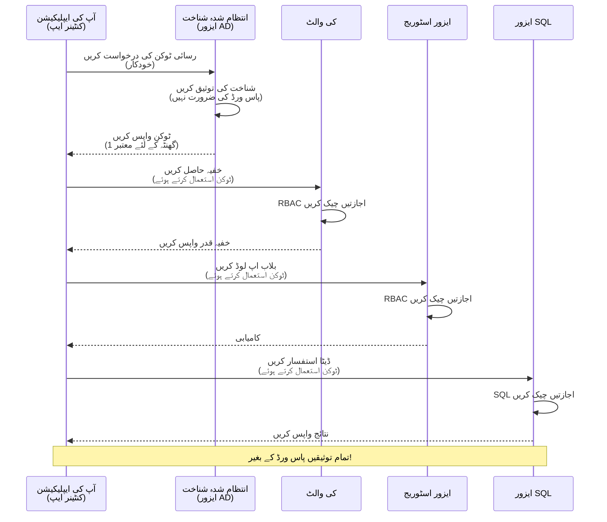
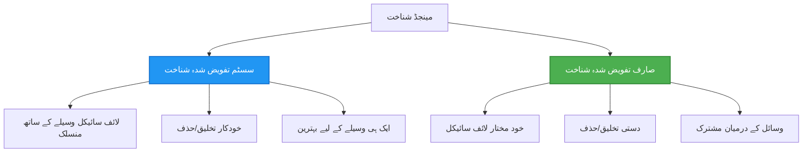

# تصدیقی پیٹرنز اور Managed Identity

⏱️ **تخمینی وقت**: 45-60 منٹ | 💰 **اخراجات پر اثر**: مفت (کوئی اضافی چارجز نہیں) | ⭐ **پیچیدگی**: درمیانہ

**📚 لرننگ پاتھ:**
- ← پچھلا: [Configuration Management](configuration.md) - ماحولیات کے متغیرات اور رازوں کا انتظام
- 🎯 **آپ یہاں ہیں**: Authentication & Security (Managed Identity, Key Vault, محفوظ پیٹرنز)
- → اگلا: [First Project](first-project.md) - اپنا پہلا AZD ایپلیکیشن بنائیں
- 🏠 [Course Home](../../README.md)

---

## آپ کیا سیکھیں گے

اس سبق کو مکمل کر کے آپ:
- Azure تصدیقی پیٹرنز کو سمجھیں گے (keys, connection strings, managed identity)
- پاس ورڈ لیس تصدیق کے لیے **Managed Identity** نافذ کریں گے
- **Azure Key Vault** انضمام کے ذریعے راز محفوظ کریں گے
- AZD ڈپلائمنٹس کے لیے **role-based access control (RBAC)** کو کنفیگر کریں گے
- Container Apps اور Azure خدمات میں سیکیورٹی بہترین طریقے اپنائیں گے
- key-based سے identity-based تصدیق میں منتقلی کریں گے

## Managed Identity کی اہمیت کیوں ہے

### مسئلہ: روایتی تصدیق

**Managed Identity سے پہلے:**
```javascript
// ❌ سیکیورٹی خطرہ: کوڈ میں ہارڈ کوڈ کیے گئے راز
const connectionString = "Server=mydb.database.windows.net;User=admin;Password=P@ssw0rd123";
const storageKey = "xK7mN9pQ2wR5tY8uI0oP3aS6dF1gH4jK...";
const cosmosKey = "C2x7B9n4M1p8Q5w3E6r0T2y5U8i1O4p7...";
```

**مسائل:**
- 🔴 **کوڈ، کنفیگ فائلز، ماحولیات متغیرات میں راز دکھائی دینا**
- 🔴 **کریڈنشل روٹیشن** کے لیے کوڈ میں تبدیلی اور دوبارہ ڈپلائمنٹ کی ضرورت
- 🔴 **آڈٹ کے مسائل** - کس نے کب کیا رسائی کی؟
- 🔴 **پھیلاؤ** - راز مختلف سسٹمز میں منتشر
- 🔴 **مطابقت کے خطرات** - سیکیورٹی آڈٹس میں ناکامی

### حل: Managed Identity

**Managed Identity کے بعد:**
```javascript
// ✅ محفوظ: کوڈ میں کوئی راز نہیں
const credential = new DefaultAzureCredential();
const client = new BlobServiceClient(
  "https://mystorageaccount.blob.core.windows.net",
  credential  // Azure خود بخود تصدیق کو سنبھالتا ہے
);
```

**فائدے:**
- ✅ **کوڈ یا کنفیگ میں صفر راز**
- ✅ **خودکار روٹیشن** - Azure یہ سنبھالتا ہے
- ✅ **Azure AD لاگز میں مکمل آڈٹ ٹریل**
- ✅ **مرکزی سیکیورٹی** - Azure پورٹل میں منظم کریں
- ✅ **مطابقت کے لیے تیار** - سیکیورٹی معیار پورے ہوتے ہیں

**تشبیہ**: روایتی تصدیق مختلف دروازوں کے لیے کئی فزیکل چابیوں کو ساتھ لے جانے جیسی ہے۔ Managed Identity ایک سیکیورٹی بیج جیسا ہے جو خود بخود آپ کی شناخت کی بنیاد پر رسائی دیتا ہے — کوئی چابیاں کھونے، نقل کرنے، یا گھمانے کی ضرورت نہیں۔

---

## فنِ تعمیر کا جائزہ

### Managed Identity کے ساتھ تصدیقی فلو


### Managed Identities کی اقسام


| فیچر | سسٹم-اسائنڈ | یوزر-اسائنڈ |
|---------|----------------|---------------|
| **لائف سائیکل** | ریسورس کے ساتھ منسلک | آزاد |
| **تخلیق** | ریسورس کے ساتھ خودکار | دستی تخلیق |
| **حذف** | ریسورس کے ساتھ حذف ہو جاتی ہے | ریسورس حذف کے بعد برقرار رہتی ہے |
| **شیئرنگ** | صرف ایک ریسورس تک | متعدد ریسورسز |
| **استعمال کا منظر** | سادہ حالات | پیچیدہ ملٹی-ریسورس حالات |
| **AZD ڈیفالٹ** | ✅ سفارش شدہ | اختیاری |

---

## درکار چیزیں

### ضروری ٹولز

آپ نے پہلے کے اسباق سے یہ انسٹال کیے ہونے چاہئیں:

```bash
# Azure Developer CLI کی تصدیق کریں
azd version
# ✅ متوقع: azd version 1.0.0 یا اس سے زیادہ

# Azure CLI کی تصدیق کریں
az --version
# ✅ متوقع: azure-cli 2.50.0 یا اس سے زیادہ
```

### Azure ضروریات

- فعال Azure سبسکرپشن
- اجازتیں:
  - managed identities بنانے کی
  - RBAC رولز اسائن کرنے کی
  - Key Vault وسائل بنانے کی
  - Container Apps ڈپلائے کرنے کی

### علمی پری ری کوائزٹس

آپ نے مکمل کیا ہونا چاہیے:
- [Installation Guide](installation.md) - AZD سیٹ اپ
- [AZD Basics](azd-basics.md) - بنیادی تصورات
- [Configuration Management](configuration.md) - ماحولیات کے متغیرات

---

## سبق 1: تصدیقی پیٹرنز کو سمجھنا

### پیٹرن 1: Connection Strings (قدیم - گریز کریں)

**یہ کیسے کام کرتا ہے:**
```bash
# کنکشن سٹرنگ میں اسناد شامل ہیں
STORAGE_CONNECTION_STRING="DefaultEndpointsProtocol=https;AccountName=myaccount;AccountKey=xK7mN9pQ2wR5..."
COSMOS_CONNECTION_STRING="AccountEndpoint=https://myaccount.documents.azure.com:443/;AccountKey=C2x7..."
SQL_CONNECTION_STRING="Server=myserver.database.windows.net;User=admin;Password=P@ssw0rd..."
```

**مسائل:**
- ❌ Secrets ماحولیات کے متغیرات میں نظر آتے ہیں
- ❌ ڈپلائمنٹ سسٹمز میں لاگ ہوتے ہیں
- ❌ روٹیشن مشکل ہے
- ❌ رسائی کا آڈٹ ٹریل موجود نہیں

**استعمال کا وقت:** صرف لوکل ڈویلپمنٹ کے لیے، پروڈکشن میں کبھی نہیں۔

---

### پیٹرن 2: Key Vault حوالہ جات (بہتر)

**یہ کیسے کام کرتا ہے:**
```bicep
// Store secret in Key Vault
resource keyVault 'Microsoft.KeyVault/vaults@2023-02-01' = {
  name: 'mykv'
  properties: {
    enableRbacAuthorization: true
  }
}

// Reference in Container App
env: [
  {
    name: 'STORAGE_KEY'
    secretRef: 'storage-key'  // References Key Vault
  }
]
```

**فائدے:**
- ✅ راز محفوظ طریقے سے Key Vault میں ذخیرہ ہوتے ہیں
- ✅ مرکزی راز مینجمنٹ
- ✅ کوڈ تبدیل کیے بغیر روٹیشن

**حدود:**
- ⚠️ پھر بھی keys/passwords استعمال ہو رہے ہیں
- ⚠️ Key Vault تک رسائی کا انتظام درکار

**استعمال کا وقت:** connection strings سے managed identity کی طرف منتقلی کا مرحلہ۔

---

### پیٹرن 3: Managed Identity (بہترین طریقہ)

**یہ کیسے کام کرتا ہے:**
```bicep
// Enable managed identity
resource containerApp 'Microsoft.App/containerApps@2023-05-01' = {
  name: 'myapp'
  identity: {
    type: 'SystemAssigned'  // Automatically creates identity
  }
}

// Grant permissions
resource roleAssignment 'Microsoft.Authorization/roleAssignments@2022-04-01' = {
  scope: storageAccount
  properties: {
    roleDefinitionId: storageBlobDataContributorRole
    principalId: containerApp.identity.principalId
  }
}
```

**ایپلیکیشن کوڈ:**
```javascript
// کوئی راز درکار نہیں!
const { DefaultAzureCredential } = require('@azure/identity');
const { BlobServiceClient } = require('@azure/storage-blob');

const credential = new DefaultAzureCredential();
const blobServiceClient = new BlobServiceClient(
  'https://mystorageaccount.blob.core.windows.net',
  credential
);
```

**فائدے:**
- ✅ کوڈ/کنفیگ میں صفر راز
- ✅ کریڈنشل کی خودکار روٹیشن
- ✅ مکمل آڈٹ ٹریل
- ✅ RBAC کی بنیاد پر اجازتیں
- ✅ مطابقت کے لیے تیار

**استعمال کا وقت:** ہمیشہ، پروڈکشن ایپلیکیشنز کے لیے۔

---

## سبق 2: AZD کے ساتھ Managed Identity نافذ کرنا

### قدم بہ قدم نفاذ

آئیے ایک محفوظ Container App بنائیں جو Azure Storage اور Key Vault تک رسائی کے لیے managed identity استعمال کرے۔

### پروجیکٹ ساخت

```
secure-app/
├── azure.yaml                 # AZD configuration
├── infra/
│   ├── main.bicep            # Main infrastructure
│   ├── core/
│   │   ├── identity.bicep    # Managed identity setup
│   │   ├── keyvault.bicep    # Key Vault configuration
│   │   └── storage.bicep     # Storage with RBAC
│   └── app/
│       └── container-app.bicep
└── src/
    ├── app.js                # Application code
    ├── package.json
    └── Dockerfile
```

### 1. AZD کنفیگر کریں (azure.yaml)

```yaml
name: secure-app
metadata:
  template: secure-app@1.0.0

services:
  api:
    project: ./src
    language: js
    host: containerapp

# Enable managed identity (AZD handles this automatically)
```

### 2. انفراسٹرکچر: Managed Identity فعال کریں

**فائل: `infra/main.bicep`**

```bicep
targetScope = 'subscription'

param environmentName string
param location string = 'eastus'

var tags = { 'azd-env-name': environmentName }

// Resource group
resource rg 'Microsoft.Resources/resourceGroups@2021-04-01' = {
  name: 'rg-${environmentName}'
  location: location
  tags: tags
}

// Storage Account
module storage './core/storage.bicep' = {
  name: 'storage'
  scope: rg
  params: {
    name: 'st${uniqueString(rg.id)}'
    location: location
    tags: tags
  }
}

// Key Vault
module keyVault './core/keyvault.bicep' = {
  name: 'keyvault'
  scope: rg
  params: {
    name: 'kv-${uniqueString(rg.id)}'
    location: location
    tags: tags
  }
}

// Container App with Managed Identity
module containerApp './app/container-app.bicep' = {
  name: 'container-app'
  scope: rg
  params: {
    name: 'ca-${environmentName}'
    location: location
    tags: tags
    storageAccountName: storage.outputs.name
    keyVaultName: keyVault.outputs.name
  }
}

// Grant Container App access to Storage
module storageRoleAssignment './core/role-assignment.bicep' = {
  name: 'storage-role'
  scope: rg
  params: {
    principalId: containerApp.outputs.identityPrincipalId
    roleDefinitionId: 'ba92f5b4-2d11-453d-a403-e96b0029c9fe'  // Storage Blob Data Contributor
    targetResourceId: storage.outputs.id
  }
}

// Grant Container App access to Key Vault
module kvRoleAssignment './core/role-assignment.bicep' = {
  name: 'kv-role'
  scope: rg
  params: {
    principalId: containerApp.outputs.identityPrincipalId
    roleDefinitionId: '4633458b-17de-408a-b874-0445c86b69e6'  // Key Vault Secrets User
    targetResourceId: keyVault.outputs.id
  }
}

// Outputs
output AZURE_STORAGE_ACCOUNT_NAME string = storage.outputs.name
output AZURE_KEY_VAULT_NAME string = keyVault.outputs.name
output APP_URL string = containerApp.outputs.url
```

### 3. Container App جس میں System-Assigned Identity ہو

**فائل: `infra/app/container-app.bicep`**

```bicep
param name string
param location string
param tags object = {}
param storageAccountName string
param keyVaultName string

resource containerApp 'Microsoft.App/containerApps@2023-05-01' = {
  name: name
  location: location
  tags: tags
  identity: {
    type: 'SystemAssigned'  // 🔑 Enable managed identity
  }
  properties: {
    configuration: {
      ingress: {
        external: true
        targetPort: 3000
      }
    }
    template: {
      containers: [
        {
          name: 'api'
          image: 'myregistry.azurecr.io/api:latest'
          resources: {
            cpu: json('0.5')
            memory: '1Gi'
          }
          env: [
            {
              name: 'AZURE_STORAGE_ACCOUNT_NAME'
              value: storageAccountName
            }
            {
              name: 'AZURE_KEY_VAULT_NAME'
              value: keyVaultName
            }
            // 🔑 No secrets - managed identity handles authentication!
          ]
        }
      ]
    }
  }
}

// Output the identity for RBAC assignments
output identityPrincipalId string = containerApp.identity.principalId
output id string = containerApp.id
output url string = 'https://${containerApp.properties.configuration.ingress.fqdn}'
```

### 4. RBAC رول اسائنمنٹ ماڈیول

**فائل: `infra/core/role-assignment.bicep`**

```bicep
param principalId string
param roleDefinitionId string  // Azure built-in role ID
param targetResourceId string

resource roleAssignment 'Microsoft.Authorization/roleAssignments@2022-04-01' = {
  name: guid(principalId, roleDefinitionId, targetResourceId)
  scope: resourceId('Microsoft.Resources/resourceGroups', resourceGroup().name)
  properties: {
    roleDefinitionId: subscriptionResourceId('Microsoft.Authorization/roleDefinitions', roleDefinitionId)
    principalId: principalId
    principalType: 'ServicePrincipal'
  }
}

output id string = roleAssignment.id
```

### 5. Managed Identity کے ساتھ ایپلیکیشن کوڈ

**فائل: `src/app.js`**

```javascript
const express = require('express');
const { DefaultAzureCredential } = require('@azure/identity');
const { BlobServiceClient } = require('@azure/storage-blob');
const { SecretClient } = require('@azure/keyvault-secrets');

const app = express();
const PORT = process.env.PORT || 3000;

// 🔑 اسناد کو مرتب کریں (مینجڈ آئیڈینٹی کے ساتھ خودکار طور پر کام کرتا ہے)
const credential = new DefaultAzureCredential();

// Azure اسٹوریج کی ترتیب
const storageAccountName = process.env.AZURE_STORAGE_ACCOUNT_NAME;
const blobServiceClient = new BlobServiceClient(
  `https://${storageAccountName}.blob.core.windows.net`,
  credential  // کوئی کلیدیں درکار نہیں!
);

// Key Vault کی ترتیب
const keyVaultName = process.env.AZURE_KEY_VAULT_NAME;
const secretClient = new SecretClient(
  `https://${keyVaultName}.vault.azure.net`,
  credential  // کوئی کلیدیں درکار نہیں!
);

// صحت کی جانچ
app.get('/health', (req, res) => {
  res.json({ status: 'healthy', authentication: 'managed-identity' });
});

// فائل کو Blob اسٹوریج میں اپ لوڈ کریں
app.post('/upload', async (req, res) => {
  try {
    const containerClient = blobServiceClient.getContainerClient('uploads');
    await containerClient.createIfNotExists();
    
    const blobName = `file-${Date.now()}.txt`;
    const blockBlobClient = containerClient.getBlockBlobClient(blobName);
    
    await blockBlobClient.upload('Hello from managed identity!', 30);
    
    res.json({
      success: true,
      blobName: blobName,
      message: 'File uploaded using managed identity!'
    });
  } catch (error) {
    console.error('Upload error:', error);
    res.status(500).json({ error: error.message });
  }
});

// Key Vault سے خفیہ حاصل کریں
app.get('/secret/:name', async (req, res) => {
  try {
    const secretName = req.params.name;
    const secret = await secretClient.getSecret(secretName);
    
    res.json({
      name: secretName,
      value: secret.value,
      message: 'Secret retrieved using managed identity!'
    });
  } catch (error) {
    console.error('Secret error:', error);
    res.status(500).json({ error: error.message });
  }
});

// Blob کنٹینرز کی فہرست (پڑھنے کی رسائی دکھاتی ہے)
app.get('/containers', async (req, res) => {
  try {
    const containers = [];
    for await (const container of blobServiceClient.listContainers()) {
      containers.push(container.name);
    }
    
    res.json({
      containers: containers,
      count: containers.length,
      message: 'Containers listed using managed identity!'
    });
  } catch (error) {
    console.error('List error:', error);
    res.status(500).json({ error: error.message });
  }
});

app.listen(PORT, () => {
  console.log(`Secure API listening on port ${PORT}`);
  console.log('Authentication: Managed Identity (passwordless)');
});
```

**فائل: `src/package.json`**

```json
{
  "name": "secure-app",
  "version": "1.0.0",
  "dependencies": {
    "express": "^4.18.2",
    "@azure/identity": "^4.0.0",
    "@azure/storage-blob": "^12.17.0",
    "@azure/keyvault-secrets": "^4.7.0"
  },
  "scripts": {
    "start": "node app.js"
  }
}
```

### 6. ڈپلائے اور ٹیسٹ کریں

```bash
# AZD ماحول کو شروع کریں
azd init

# انفراسٹرکچر اور ایپلیکیشن کو تعینات کریں
azd up

# ایپ کا URL حاصل کریں
APP_URL=$(azd env get-values | grep APP_URL | cut -d '=' -f2 | tr -d '"')

# ہیلتھ چیک کی جانچ کریں
curl $APP_URL/health
```

**✅ متوقع آؤٹ پٹ:**
```json
{
  "status": "healthy",
  "authentication": "managed-identity"
}
```

**بلاب اپ لوڈ ٹیسٹ:**
```bash
curl -X POST $APP_URL/upload
```

**✅ متوقع آؤٹ پٹ:**
```json
{
  "success": true,
  "blobName": "file-1700404800000.txt",
  "message": "File uploaded using managed identity!"
}
```

**کنٹینر لسٹنگ ٹیسٹ:**
```bash
curl $APP_URL/containers
```

**✅ متوقع آؤٹ پٹ:**
```json
{
  "containers": ["uploads"],
  "count": 1,
  "message": "Containers listed using managed identity!"
}
```

---

## عام Azure RBAC رولز

### Managed Identity کے لیے بلٹ ان رول آئی ڈیز

| سروس | رول کا نام | رول ID | اجازتیں |
|---------|-----------|---------|-------------|
| **Storage** | Storage Blob Data Reader | `2a2b9908-6b94-4a3d-8e5a-a7d8f8cc8a12` | بلابز اور کنٹینرز کو پڑھیں |
| **Storage** | Storage Blob Data Contributor | `ba92f5b4-2d11-453d-a403-e96b0029c9fe` | بلابز کو پڑھیں، لکھیں، حذف کریں |
| **Storage** | Storage Queue Data Contributor | `974c5e8b-45b9-4653-ba55-5f855dd0fb88` | قطار کے پیغامات پڑھیں، لکھیں، حذف کریں |
| **Key Vault** | Key Vault Secrets User | `4633458b-17de-408a-b874-0445c86b69e6` | راز پڑھنا |
| **Key Vault** | Key Vault Secrets Officer | `b86a8fe4-44ce-4948-aee5-eccb2c155cd7` | راز پڑھیں، لکھیں، حذف کریں |
| **Cosmos DB** | Cosmos DB Built-in Data Reader | `00000000-0000-0000-0000-000000000001` | Cosmos DB ڈیٹا پڑھیں |
| **Cosmos DB** | Cosmos DB Built-in Data Contributor | `00000000-0000-0000-0000-000000000002` | Cosmos DB ڈیٹا پڑھیں، لکھیں |
| **SQL Database** | SQL DB Contributor | `9b7fa17d-e63e-47b0-bb0a-15c516ac86ec` | SQL ڈیٹا بیسز کا انتظام کریں |
| **Service Bus** | Azure Service Bus Data Owner | `090c5cfd-751d-490a-894a-3ce6f1109419` | پیغامات بھیجیں، وصول کریں، منیج کریں |

### رول IDs کیسے تلاش کریں

```bash
# تمام بلٹ اِن کرداروں کی فہرست
az role definition list --query "[].{Name:roleName, ID:name}" --output table

# مخصوص کردار تلاش کریں
az role definition list --query "[?contains(roleName, 'Storage Blob')].{Name:roleName, ID:name}" --output table

# کردار کی تفصیلات حاصل کریں
az role definition list --name "Storage Blob Data Contributor"
```

---

## عملی مشقیں

### مشق 1: موجودہ ایپ کے لیے Managed Identity فعال کریں ⭐⭐ (درمیانہ)

**مقصد**: موجودہ Container App ڈپلائمنٹ میں managed identity شامل کریں

**منظرنامہ**: آپ کے پاس ایک Container App ہے جو connection strings استعمال کر رہا ہے۔ اسے managed identity میں تبدیل کریں۔

**شروعاتی نقطہ**: اس کنفیگریشن والا Container App:

```bicep
// ❌ Current: Using connection string
env: [
  {
    name: 'STORAGE_CONNECTION_STRING'
    secretRef: 'storage-connection'
  }
]
```

**اقدامات**:

1. **Bicep میں managed identity فعال کریں:**

```bicep
resource containerApp 'Microsoft.App/containerApps@2023-05-01' = {
  name: 'myapp'
  identity: {
    type: 'SystemAssigned'  // Add this
  }
  // ... rest of configuration
}
```

2. **Storage تک رسائی دیں:**

```bicep
// Get storage account reference
resource storageAccount 'Microsoft.Storage/storageAccounts@2023-01-01' existing = {
  name: storageAccountName
}

// Assign role
resource roleAssignment 'Microsoft.Authorization/roleAssignments@2022-04-01' = {
  name: guid(containerApp.id, 'ba92f5b4-2d11-453d-a403-e96b0029c9fe', storageAccount.id)
  scope: storageAccount
  properties: {
    roleDefinitionId: subscriptionResourceId('Microsoft.Authorization/roleDefinitions', 'ba92f5b4-2d11-453d-a403-e96b0029c9fe')
    principalId: containerApp.identity.principalId
    principalType: 'ServicePrincipal'
  }
}
```

3. **ایپلیکیشن کوڈ اپڈیٹ کریں:**

**پہلے (connection string):**
```javascript
const { BlobServiceClient } = require('@azure/storage-blob');

const blobServiceClient = BlobServiceClient.fromConnectionString(
  process.env.STORAGE_CONNECTION_STRING
);
```

**بعد (managed identity):**
```javascript
const { DefaultAzureCredential } = require('@azure/identity');
const { BlobServiceClient } = require('@azure/storage-blob');

const credential = new DefaultAzureCredential();
const blobServiceClient = new BlobServiceClient(
  `https://${process.env.STORAGE_ACCOUNT_NAME}.blob.core.windows.net`,
  credential
);
```

4. **ماحولیات کے متغیرات اپڈیٹ کریں:**

```bicep
env: [
  {
    name: 'STORAGE_ACCOUNT_NAME'
    value: storageAccountName  // Just the name, no secrets!
  }
  // Remove STORAGE_CONNECTION_STRING
]
```

5. **ڈپلائے اور ٹیسٹ کریں:**

```bash
# دوبارہ تعینات کریں
azd up

# جانچ کریں کہ یہ اب بھی کام کرتا ہے
curl https://myapp.azurecontainerapps.io/upload
```

**✅ کامیابی کے معیار:**
- ✅ ایپلیکیشن بغیر غلطیوں کے ڈپلائے ہوتی ہے
- ✅ Storage آپریشنز کام کرتے ہیں (اپ لوڈ، لسٹ، ڈاؤن لوڈ)
- ✅ ماحولیات کے متغیرات میں کوئی connection strings نہیں ہیں
- ✅ Azure پورٹل میں "Identity" بلیڈ کے تحت identity دکھائی دیتی ہے

**تصدیق:**

```bash
# چیک کریں کہ مینیجڈ شناخت فعال ہے
az containerapp show \
  --name myapp \
  --resource-group rg-myapp \
  --query "identity.type"
# ✅ متوقع: "SystemAssigned"

# رول کی تفویض چیک کریں
az role assignment list \
  --assignee $(az containerapp show --name myapp --resource-group rg-myapp --query "identity.principalId" -o tsv) \
  --scope /subscriptions/{sub-id}/resourceGroups/rg-myapp/providers/Microsoft.Storage/storageAccounts/mystorageaccount
# ✅ متوقع: "Storage Blob Data Contributor" رول دکھاتا ہے
```

**وقت**: 20-30 منٹ

---

### مشق 2: یوزر-اسائنڈ identity کے ساتھ ملٹی سروس رسائی ⭐⭐⭐ (اعلیٰ)

**مقصد**: ایک user-assigned identity بنائیں جو متعدد Container Apps میں شئیر ہو

**منظرنامہ**: آپ کے پاس 3 مائیکرو سروسز ہیں جنہیں ایک ہی Storage اکاؤنٹ اور Key Vault تک رسائی کی ضرورت ہے۔

**اقدامات**:

1. **user-assigned identity بنائیں:**

**فائل: `infra/core/identity.bicep`**

```bicep
param name string
param location string
param tags object = {}

resource userAssignedIdentity 'Microsoft.ManagedIdentity/userAssignedIdentities@2023-01-31' = {
  name: name
  location: location
  tags: tags
}

output id string = userAssignedIdentity.id
output principalId string = userAssignedIdentity.properties.principalId
output clientId string = userAssignedIdentity.properties.clientId
```

2. **user-assigned identity کو رولز اسائن کریں:**

```bicep
// In main.bicep
module userIdentity './core/identity.bicep' = {
  name: 'user-identity'
  scope: rg
  params: {
    name: 'id-${environmentName}'
    location: location
    tags: tags
  }
}

// Grant Storage access
resource storageRoleAssignment 'Microsoft.Authorization/roleAssignments@2022-04-01' = {
  name: guid(userIdentity.outputs.principalId, 'storage-contributor')
  scope: storageAccount
  properties: {
    roleDefinitionId: subscriptionResourceId('Microsoft.Authorization/roleDefinitions', 'ba92f5b4-2d11-453d-a403-e96b0029c9fe')
    principalId: userIdentity.outputs.principalId
    principalType: 'ServicePrincipal'
  }
}

// Grant Key Vault access
resource kvRoleAssignment 'Microsoft.Authorization/roleAssignments@2022-04-01' = {
  name: guid(userIdentity.outputs.principalId, 'kv-secrets-user')
  scope: keyVault
  properties: {
    roleDefinitionId: subscriptionResourceId('Microsoft.Authorization/roleDefinitions', '4633458b-17de-408a-b874-0445c86b69e6')
    principalId: userIdentity.outputs.principalId
    principalType: 'ServicePrincipal'
  }
}
```

3. **کئی Container Apps کو identity اسائن کریں:**

```bicep
resource apiGateway 'Microsoft.App/containerApps@2023-05-01' = {
  name: 'api-gateway'
  identity: {
    type: 'UserAssigned'
    userAssignedIdentities: {
      '${userIdentity.outputs.id}': {}
    }
  }
  // ... rest of config
}

resource productService 'Microsoft.App/containerApps@2023-05-01' = {
  name: 'product-service'
  identity: {
    type: 'UserAssigned'
    userAssignedIdentities: {
      '${userIdentity.outputs.id}': {}
    }
  }
  // ... rest of config
}

resource orderService 'Microsoft.App/containerApps@2023-05-01' = {
  name: 'order-service'
  identity: {
    type: 'UserAssigned'
    userAssignedIdentities: {
      '${userIdentity.outputs.id}': {}
    }
  }
  // ... rest of config
}
```

4. **ایپلیکیشن کوڈ (تمام سروسز ایک ہی پیٹرن استعمال کرتی ہیں):**

```javascript
const { DefaultAzureCredential, ManagedIdentityCredential } = require('@azure/identity');

// صارف کو تفویض کردہ شناخت کے لیے کلائنٹ آئی ڈی بتائیں
const credential = new ManagedIdentityCredential(
  process.env.AZURE_CLIENT_ID  // صارف کو تفویض کردہ شناخت کا کلائنٹ آئی ڈی
);

// یا DefaultAzureCredential استعمال کریں (خود بخود پتہ لگا لیتا ہے)
const credential = new DefaultAzureCredential();

const blobServiceClient = new BlobServiceClient(
  `https://${process.env.STORAGE_ACCOUNT_NAME}.blob.core.windows.net`,
  credential
);
```

5. **ڈپلائے اور تصدیق کریں:**

```bash
azd up

# یہ جانچیں کہ تمام سروسز اسٹوریج تک رسائی حاصل کر سکتی ہیں
curl https://api-gateway.azurecontainerapps.io/upload
curl https://product-service.azurecontainerapps.io/upload
curl https://order-service.azurecontainerapps.io/upload
```

**✅ کامیابی کے معیار:**
- ✅ ایک identity تین سروسز میں شئیر ہو رہی ہے
- ✅ تمام سروسز Storage اور Key Vault تک رسائی حاصل کر سکتی ہیں
- ✅ اگر آپ ایک سروس حذف کریں تو identity برقرار رہتی ہے
- ✅ اجازتوں کا مرکزی انتظام

یوزر-اسائنڈ identity کے فوائد:
- ایک شناخت کو منظم کرنا آسان
- سروسز میں یکساں اجازتیں
- سروس حذف ہونے پر بھی برقرار رہتی ہے
- پیچیدہ آرکیٹیکچرز کے لیے بہتر

**وقت**: 30-40 منٹ

---

### مشق 3: Key Vault رازوں کی روٹیشن نافذ کریں ⭐⭐⭐ (اعلیٰ)

**مقصد**: تیسری پارٹی کے API keys کو Key Vault میں اسٹور کریں اور managed identity کے ذریعے انہیں حاصل کریں

**منظرنامہ**: آپ کی ایپ کو ایک بیرونی API (OpenAI, Stripe, SendGrid) کال کرنے کے لیے API keys درکار ہیں۔

**اقدامات**:

1. **RBAC کے ساتھ Key Vault بنائیں:**

**فائل: `infra/core/keyvault.bicep`**

```bicep
param name string
param location string
param tags object = {}

resource keyVault 'Microsoft.KeyVault/vaults@2023-02-01' = {
  name: name
  location: location
  tags: tags
  properties: {
    enableRbacAuthorization: true  // Use RBAC instead of access policies
    sku: {
      family: 'A'
      name: 'standard'
    }
    tenantId: subscription().tenantId
    enableSoftDelete: true
    softDeleteRetentionInDays: 90
  }
}

// Allow Container App to read secrets
output id string = keyVault.id
output name string = keyVault.name
output uri string = keyVault.properties.vaultUri
```

2. **Key Vault میں راز ذخیرہ کریں:**

```bash
# Key Vault کا نام حاصل کریں
KV_NAME=$(azd env get-values | grep AZURE_KEY_VAULT_NAME | cut -d '=' -f2 | tr -d '"')

# تیسری پارٹی کے API کلیدیں محفوظ کریں
az keyvault secret set \
  --vault-name $KV_NAME \
  --name "OpenAI-ApiKey" \
  --value "sk-proj-xxxxxxxxxxxxx"

az keyvault secret set \
  --vault-name $KV_NAME \
  --name "Stripe-ApiKey" \
  --value "sk_live_xxxxxxxxxxxxx"

az keyvault secret set \
  --vault-name $KV_NAME \
  --name "SendGrid-ApiKey" \
  --value "SG.xxxxxxxxxxxxx"
```

3. **راز حاصل کرنے کے لیے ایپلیکیشن کوڈ:**

**فائل: `src/config.js`**

```javascript
const { DefaultAzureCredential } = require('@azure/identity');
const { SecretClient } = require('@azure/keyvault-secrets');

class Config {
  constructor() {
    this.credential = new DefaultAzureCredential();
    this.secretClient = new SecretClient(
      `https://${process.env.AZURE_KEY_VAULT_NAME}.vault.azure.net`,
      this.credential
    );
    this.cache = {};
  }

  async getSecret(secretName) {
    // پہلے کیش چیک کریں
    if (this.cache[secretName]) {
      return this.cache[secretName];
    }

    try {
      const secret = await this.secretClient.getSecret(secretName);
      this.cache[secretName] = secret.value;
      console.log(`✅ Retrieved secret: ${secretName}`);
      return secret.value;
    } catch (error) {
      console.error(`❌ Failed to get secret ${secretName}:`, error.message);
      throw error;
    }
  }

  async getOpenAIKey() {
    return this.getSecret('OpenAI-ApiKey');
  }

  async getStripeKey() {
    return this.getSecret('Stripe-ApiKey');
  }

  async getSendGridKey() {
    return this.getSecret('SendGrid-ApiKey');
  }
}

module.exports = new Config();
```

4. **ایپلیکیشن میں راز استعمال کریں:**

**فائل: `src/app.js`**

```javascript
const express = require('express');
const config = require('./config');
const { OpenAI } = require('openai');

const app = express();

// Key Vault سے حاصل کردہ کلید کے ساتھ OpenAI کو ابتدائی ترتیب دیں
let openaiClient;

async function initializeServices() {
  const openaiKey = await config.getOpenAIKey();
  openaiClient = new OpenAI({ apiKey: openaiKey });
  console.log('✅ Services initialized with secrets from Key Vault');
}

// شروع ہونے پر کال کریں
initializeServices().catch(console.error);

app.post('/chat', async (req, res) => {
  try {
    const completion = await openaiClient.chat.completions.create({
      model: 'gpt-4',
      messages: [{ role: 'user', content: 'Hello!' }]
    });
    
    res.json({
      response: completion.choices[0].message.content,
      authentication: 'Key from Key Vault via Managed Identity'
    });
  } catch (error) {
    res.status(500).json({ error: error.message });
  }
});

app.listen(3000, () => {
  console.log('Secure API with Key Vault integration running');
});
```

5. **ڈپلائے اور ٹیسٹ کریں:**

```bash
azd up

# جانچیں کہ API کلیدیں کام کرتی ہیں
curl -X POST https://myapp.azurecontainerapps.io/chat \
  -H "Content-Type: application/json" \
  -d '{"message":"Hello AI"}'
```

**✅ کامیابی کے معیار:**
- ✅ کوڈ یا ماحولیات کے متغیرات میں کوئی API keys نہیں ہیں
- ✅ ایپلیکیشن Key Vault سے keys حاصل کرتی ہے
- ✅ تیسری پارٹی کے APIs درست طریقے سے کام کرتے ہیں
- ✅ کوڈ میں تبدیلی کیے بغیر keys کو روٹیٹ کیا جا سکتا ہے

راز گھمائیں (Rotate a secret):

```bash
# Key Vault میں خفیہ قدر کو اپ ڈیٹ کریں
az keyvault secret set \
  --vault-name $KV_NAME \
  --name "OpenAI-ApiKey" \
  --value "sk-proj-NEW_KEY_HERE"

# ایپ کو نئی کلید حاصل کرنے کے لیے دوبارہ شروع کریں
az containerapp revision restart \
  --name myapp \
  --resource-group rg-myapp
```

**وقت**: 25-35 منٹ

---

## علمی جانچ پوائنٹ

### 1. تصدیقی پیٹرنز ✓

اپنی سمجھ کو ٹیسٹ کریں:

- [ ] **Q1**: تین بنیادی تصدیقی پیٹرنز کون سے ہیں؟ 
  - **A**: Connection strings (قدیم)، Key Vault حوالہ جات (منتقلی)، Managed Identity (بہترین)

- [ ] **Q2**: Managed identity کیوں connection strings سے بہتر ہے؟
  - **A**: کوڈ میں کوئی راز نہیں، خودکار روٹیشن، مکمل آڈٹ ٹریل، RBAC اجازتیں

- [ ] **Q3**: کب آپ system-assigned کی بجائے user-assigned identity استعمال کریں گے؟
  - **A**: جب شناخت کو متعدد ریسورسز میں شیئر کرنا ہو یا شناخت کا لائف سائیکل ریسورس کے لائف سائیکل سے آزاد ہو

**ہینڈز آن تصدیق:**
```bash
# چیک کریں کہ آپ کی ایپ کس قسم کی شناخت استعمال کرتی ہے
az containerapp show \
  --name myapp \
  --resource-group rg-myapp \
  --query "identity.type"

# اس شناخت کے لیے تمام کردار تفویضات کی فہرست بنائیں
az role assignment list \
  --assignee $(az containerapp show --name myapp --resource-group rg-myapp --query "identity.principalId" -o tsv)
```

---

### 2. RBAC اور اجازتیں ✓

اپنی سمجھ کو ٹیسٹ کریں:

- [ ] **Q1**: "Storage Blob Data Contributor" کا رول ID کیا ہے؟
  - **A**: `ba92f5b4-2d11-453d-a403-e96b0029c9fe`

- [ ] **Q2**: "Key Vault Secrets User" کیا اجازتیں دیتا ہے؟
  - **A**: رازوں تک صرف پڑھنے کی رسائی (تخلیق، اپڈیٹ، یا حذف نہیں کر سکتا)

- [ ] **Q3**: آپ ایک Container App کو Azure SQL تک رسائی کیسے دیتے ہیں؟
  - **A**: "SQL DB Contributor" رول اسائن کریں یا SQL کے لیے Azure AD تصدیق کو کنفیگر کریں

**ہینڈز آن تصدیق:**
```bash
# مخصوص کردار تلاش کریں
az role definition list --name "Storage Blob Data Contributor"

# یہ جانچیں کہ آپ کی شناخت کو کون سے کردار تفویض کیے گئے ہیں
PRINCIPAL_ID=$(az containerapp show --name myapp --resource-group rg-myapp --query "identity.principalId" -o tsv)
az role assignment list --assignee $PRINCIPAL_ID --output table
```

---

### 3. Key Vault انضمام ✓
‏- [ ] **Q1**: آپ Key Vault کے لیے access policies کے بجائے RBAC کیسے فعال کرتے ہیں؟
  - **A**: Set `enableRbacAuthorization: true` in Bicep

- [ ] **Q2**: کون سی Azure SDK لائبریری managed identity کی تصدیق کو ہینڈل کرتی ہے؟
  - **A**: `@azure/identity` with `DefaultAzureCredential` class

- [ ] **Q3**: Key Vault کے سیکریٹس کتنی دیر cache میں رہتے ہیں؟
  - **A**: Application-dependent; implement your own caching strategy

**Hands-On Verification:**
```bash
# Key Vault تک رسائی کی جانچ
az keyvault secret show \
  --vault-name $KV_NAME \
  --name "OpenAI-ApiKey" \
  --query "value"

# تصدیق کریں کہ RBAC فعال ہے
az keyvault show \
  --name $KV_NAME \
  --query "properties.enableRbacAuthorization"
# ✅ متوقع: درست
```

---

## سیکیورٹی کے بہترین طریقے

### ✅ کریں:

1. **پروڈکشن میں ہمیشہ managed identity استعمال کریں**
   ```bicep
   identity: {
     type: 'SystemAssigned'
   }
   ```

2. **کم از کم مراعات والے RBAC رول استعمال کریں**
   - جہاں ممکن ہو "Reader" رول استعمال کریں
   - جب تک ضروری نہ ہو "Owner" یا "Contributor" سے گریز کریں

3. **تیسری پارٹی کی چابیاں Key Vault میں محفوظ کریں**
   ```javascript
   const apiKey = await secretClient.getSecret('ThirdPartyApiKey');
   ```

4. **آڈٹ لاگنگ کو فعال کریں**
   ```bicep
   diagnosticSettings: {
     logs: [{ category: 'AuditEvent', enabled: true }]
   }
   ```

5. **ڈویلپمنٹ/اسٹیجنگ/پروڈ کے لیے مختلف شناختیں استعمال کریں**
   ```bash
   azd env new dev
   azd env new staging
   azd env new prod
   ```

6. **سیکریٹس کو باقاعدگی سے تبدیل کریں**
   - Key Vault سیکریٹس پر میعاد ختم ہونے کی تاریخ مقرر کریں
   - Azure Functions کے ساتھ rotation کو خودکار بنائیں

### ❌ مت کریں:

1. **کبھی سیکریٹس کو ہارڈ کوڈ نہ کریں**
   ```javascript
   // برا ❌
   const apiKey = "sk-proj-xxxxxxxxxxxxx";
   ```

2. **پروڈکشن میں connection strings استعمال نہ کریں**
   ```javascript
   // ❌ برا
   BlobServiceClient.fromConnectionString(process.env.STORAGE_CONNECTION_STRING)
   ```

3. **زائد از حد اجازتیں نہ دیں**
   ```bicep
   // ❌ BAD - too much access
   roleDefinitionId: 'Owner'
   
   // ✅ GOOD - least privilege
   roleDefinitionId: 'Storage Blob Data Reader'
   ```

4. **سیکریٹس کو لاگ نہ کریں**
   ```javascript
   // خراب ❌
   console.log('API Key:', apiKey);
   
   // اچھا ✅
   console.log('API Key retrieved successfully');
   ```

5. **پروڈکشن شناختیں ماحولوں میں شیئر نہ کریں**
   ```bicep
   // ❌ BAD - same identity for dev and prod
   // ✅ GOOD - separate identities per environment
   ```

---

## خرابیوں کے حل کا رہنما

### مسئلہ: "Unauthorized" جب Azure Storage تک رسائی کی جائے

**علامات:**
```
Error: Unauthorized (403)
AuthorizationPermissionMismatch: This request is not authorized to perform this operation
```

**تجزیہ:**

```bash
# چیک کریں کہ مینیجڈ شناخت فعال ہے یا نہیں
az containerapp show \
  --name myapp \
  --resource-group rg-myapp \
  --query "identity.type"
# ✅ متوقع: "SystemAssigned" یا "UserAssigned"

# کردار کی تفویضات چیک کریں
PRINCIPAL_ID=$(az containerapp show --name myapp --resource-group rg-myapp --query "identity.principalId" -o tsv)
az role assignment list --assignee $PRINCIPAL_ID

# متوقع: آپ کو "Storage Blob Data Contributor" یا اسی طرح کا رول نظر آنا چاہیے
```

**حل:**

1. **درست RBAC رول تفویض کریں:**
```bash
STORAGE_ID=$(az storage account show --name mystorageaccount --resource-group rg-myapp --query "id" -o tsv)
az role assignment create \
  --assignee $PRINCIPAL_ID \
  --role "Storage Blob Data Contributor" \
  --scope $STORAGE_ID
```

2. **پراپیگیشن کے لیے انتظار کریں (5-10 منٹ لگ سکتے ہیں):**
```bash
# اسائن کیے گئے رول کی حیثیت چیک کریں
az role assignment list --assignee $PRINCIPAL_ID --scope $STORAGE_ID
```

3. **تصدیق کریں کہ ایپلیکیشن کوڈ درست credential استعمال کر رہا ہے:**
```javascript
// یقین کریں کہ آپ DefaultAzureCredential استعمال کر رہے ہیں
const credential = new DefaultAzureCredential();
```

---

### مسئلہ: Key Vault تک رسائی مسترد

**علامات:**
```
Error: Forbidden (403)
The user, group or application does not have secrets get permission
```

**تجزیہ:**

```bash
# چیک کریں کہ Key Vault RBAC فعال ہے
az keyvault show \
  --name $KV_NAME \
  --query "properties.enableRbacAuthorization"
# ✅ متوقع: درست

# رول تفویضات چیک کریں
az role assignment list \
  --assignee $PRINCIPAL_ID \
  --scope /subscriptions/{sub-id}/resourceGroups/rg-myapp/providers/Microsoft.KeyVault/vaults/$KV_NAME
```

**حل:**

1. **Key Vault پر RBAC کو فعال کریں:**
```bash
az keyvault update \
  --name $KV_NAME \
  --enable-rbac-authorization true
```

2. **Key Vault Secrets User رول تفویض کریں:**
```bash
KV_ID=$(az keyvault show --name $KV_NAME --query "id" -o tsv)
az role assignment create \
  --assignee $PRINCIPAL_ID \
  --role "Key Vault Secrets User" \
  --scope $KV_ID
```

---

### مسئلہ: DefaultAzureCredential لوکل طور پر ناکام ہو رہا ہے

**علامات:**
```
Error: DefaultAzureCredential failed to retrieve a token
CredentialUnavailableError: No credential available
```

**تجزیہ:**

```bash
# چیک کریں کہ آیا آپ لاگ ان ہیں یا نہیں
az account show

# Azure CLI کی توثیق چیک کریں
az ad signed-in-user show
```

**حل:**

1. **Azure CLI میں لاگ ان کریں:**
```bash
az login
```

2. **Azure سبسکرپشن سیٹ کریں:**
```bash
az account set --subscription "Your Subscription Name"
```

3. **لوکل ڈیویلپمنٹ کے لیے environment variables استعمال کریں:**
```bash
export AZURE_TENANT_ID="your-tenant-id"
export AZURE_CLIENT_ID="your-client-id"
export AZURE_CLIENT_SECRET="your-client-secret"
```

4. **یا لوکل طور پر مختلف credential استعمال کریں:**
```javascript
const { DefaultAzureCredential, AzureCliCredential } = require('@azure/identity');

// مقامی ڈویلپمنٹ کے لیے AzureCliCredential استعمال کریں
const credential = process.env.NODE_ENV === 'production' 
  ? new DefaultAzureCredential()
  : new AzureCliCredential();
```

---

### مسئلہ: رول اسائنمنٹ کے پھیلنے میں زیادہ وقت لگ رہا ہے

**علامات:**
- رول کامیابی سے تفویض ہوا
- ابھی بھی 403 ایررز موصول ہو رہے ہیں
- متقطع رسائی (کبھی کام کرتا ہے، کبھی نہیں)

**وضاحت:**
Azure RBAC میں تبدیلیاں عالمی سطح پر پھیلنے میں 5-10 منٹ لگا سکتی ہیں۔

**حل:**

```bash
# انتظار کریں اور دوبارہ کوشش کریں
echo "Waiting for RBAC propagation..."
sleep 300  # پانچ منٹ انتظار کریں

# رسائی کی جانچ کریں
curl https://myapp.azurecontainerapps.io/upload

# اگر پھر بھی ناکام ہو تو ایپ کو دوبارہ شروع کریں
az containerapp revision restart \
  --name myapp \
  --resource-group rg-myapp
```

---

## لاگت کے پہلو

### Managed Identity کی لاگت

| وسائل | لاگت |
|----------|------|
| **Managed Identity** | 🆓 **مفت** - کوئی چارج نہیں |
| **RBAC Role Assignments** | 🆓 **مفت** - کوئی چارج نہیں |
| **Azure AD Token Requests** | 🆓 **مفت** - شامل ہے |
| **Key Vault Operations** | $0.03 فی 10,000 آپریشنز |
| **Key Vault Storage** | $0.024 فی سیکریٹ فی مہینہ |

**Managed identity پیسے بچاتا ہے:**
- ✅ سروس ٹو سروس توثیق کے لیے Key Vault آپریشنز کو ختم کرنا
- ✅ سیکیورٹی واقعات میں کمی (کوئی لیک شدہ کریڈینشل نہیں)
- ✅ عملیاتی اوور ہیڈ میں کمی (کوئی دستی rotation نہیں)

**مثالی لاگت موازنہ (ماہانہ):**

| منظرنامہ | Connection Strings | Managed Identity | بچت |
|----------|-------------------|-----------------|---------|
| Small app (1M requests) | ~$50 (Key Vault + اپریشنز) | ~$0 | $50/ماہ |
| Medium app (10M requests) | ~$200 | ~$0 | $200/ماہ |
| Large app (100M requests) | ~$1,500 | ~$0 | $1,500/ماہ |

---

## مزید جانیں

### سرکاری دستاویزات
- [Azure Managed Identity](https://learn.microsoft.com/entra/identity/managed-identities-azure-resources/overview)
- [Azure RBAC](https://learn.microsoft.com/azure/role-based-access-control/overview)
- [Azure Key Vault](https://learn.microsoft.com/azure/key-vault/general/overview)
- [DefaultAzureCredential](https://learn.microsoft.com/dotnet/api/azure.identity.defaultazurecredential)

### SDK دستاویزات
- [@azure/identity (Node.js)](https://www.npmjs.com/package/@azure/identity)
- [Azure.Identity (C#)](https://www.nuget.org/packages/Azure.Identity/)
- [azure-identity (Python)](https://pypi.org/project/azure-identity/)

### اس کورس میں اگلے اقدامات
- ← پچھلا: [کنفیگریشن مینجمنٹ](configuration.md)
- → اگلا: [پہلا پروجیکٹ](first-project.md)
- 🏠 [کورس ہوم](../../README.md)

### متعلقہ مثالیں
- [Azure OpenAI Chat Example](../../../../examples/azure-openai-chat) - Azure OpenAI کے لیے managed identity استعمال کرتا ہے
- [Microservices Example](../../../../examples/microservices) - ملٹی سروس توثیقی پیٹرنز

---

## خلاصہ

**آپ نے سیکھا:**
- ✅ تین توثیقی پیٹرنز (connection strings، Key Vault، managed identity)
- ✅ AZD میں managed identity کو فعال اور ترتیب دینا
- ✅ Azure سروسز کے لیے RBAC رول اسائنمنٹس
- ✅ تیسری پارٹی کے سیکریٹس کے لیے Key Vault انٹیگریشن
- ✅ User-assigned بمقابلہ system-assigned شناختیں
- ✅ سیکیورٹی بہترین طریقے اور مسئلے حل کرنا

**اہم نکات:**
1. **پروڈکشن میں ہمیشہ managed identity استعمال کریں** - زیرو سیکریٹس، خودکار rotation
2. **کم از کم مراعات والے RBAC رول استعمال کریں** - صرف ضروری اجازتیں دیں
3. **تیسری پارٹی کی چابیاں Key Vault میں محفوظ کریں** - مرکزی سیکریٹ مینجمنٹ
4. **ماحول کے لحاظ سے شناختیں الگ رکھیں** - ڈویلپ، اسٹیج، پروڈ الگ کرنا
5. **آڈٹ لاگنگ کو فعال کریں** - معلوم ہو کہ کس نے کیا ایکسیس کیا

**اگلے اقدامات:**
1. اوپر دیے عملی مشقیں مکمل کریں
2. موجودہ ایپ کو connection strings سے managed identity میں منتقل کریں
3. دن اول سے سیکیورٹی کے ساتھ اپنا پہلا AZD پروجیکٹ بنائیں: [پہلا پروجیکٹ](first-project.md)

---

<!-- CO-OP TRANSLATOR DISCLAIMER START -->
ذمہ داری سے انکار:
یہ دستاویز AI ترجمہ سروس Co-op Translator (https://github.com/Azure/co-op-translator) کے ذریعے ترجمہ کی گئی ہے۔ ہم درستگی کے لیے کوشش کرتے ہیں، تاہم براہِ مہربانی نوٹ کریں کہ خودکار تراجم میں غلطیاں یا عدم درستیاں ہو سکتی ہیں۔ اصل دستاویز اسے اپنی مادری زبان میں مستند ماخذ سمجھا جانا چاہیے۔ اہم یا حساس معلومات کے لیے پیشہ ور انسانی ترجمانی کی سفارش کی جاتی ہے۔ اس ترجمے کے استعمال سے پیدا ہونے والی کسی بھی غلط فہمی یا غلط تشریح کے لیے ہم ذمہ دار نہیں ہیں۔
<!-- CO-OP TRANSLATOR DISCLAIMER END -->