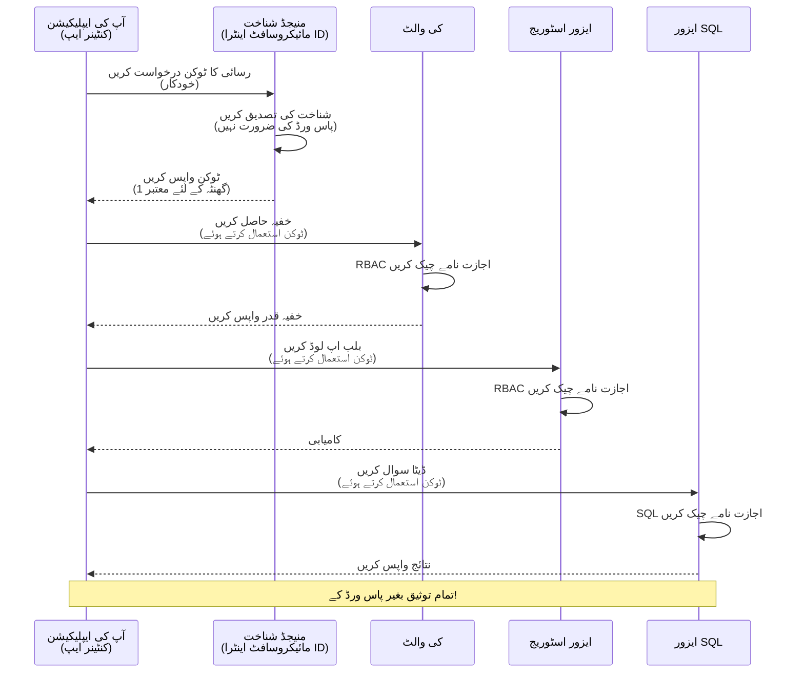
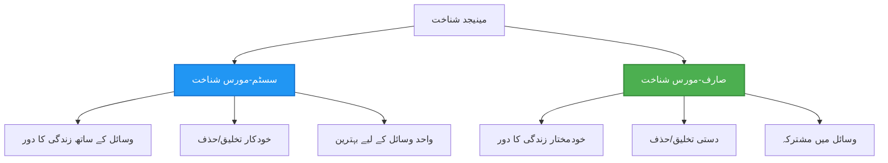

# توثیق کے نمونے اور منظم شناخت

⏱️ **متوقع وقت**: 45-60 منٹ | 💰 **لاگت کا اثر**: مفت (کوئی اضافی فیس نہیں) | ⭐ **پیچیدگی**: درمیانہ

**📚 تعلیمی راستہ:**
- ← پچھلا: [کنفیگریشن مینجمنٹ](configuration.md) - ماحول کے متغیرات اور رازوں کا انتظام
- 🎯 **آپ یہاں ہیں**: توثیق اور سیکیورٹی (منظم شناخت، کی والو، محفوظ نمونے)
- → اگلا: [پہلا پروجیکٹ](first-project.md) - اپنا پہلا AZD ایپلیکیشن بنائیں
- 🏠 [کورس ہوم](../../README.md)

---

## آپ کیا سیکھیں گے

اس لیکچر کو مکمل کرنے کے بعد، آپ:
- آزور کی توثیقی نمونوں کو سمجھیں گے (چابیاں، کنکشن اسٹرنگ، منظم شناخت)
- **Managed Identity** کو بغیر پاس ورڈ کے تصدیق کے لیے نافذ کریں گے
- **Azure Key Vault** انٹیگریشن کے ساتھ رازوں کو محفوظ بنائیں گے
- AZD کی تعیناتیوں کے لیے **رول بیسڈ ایکسیس کنٹرول (RBAC)** ترتیب دیں گے
- کنٹینر ایپس اور آزور سروسز میں سیکیورٹی کی بہترین عملی اقدامات اپنائیں گے
- کنکشن اسٹرنگ سے شناخت پر مبنی تصدیق کی طرف مائیگریٹ کریں گے

## منظم شناخت کی اہمیت

### مسئلہ: روایتی توثیق

**Managed Identity سے پہلے:**
```javascript
// ❌ سیکیورٹی کا خطرہ: کوڈ میں ہارڈکوڈڈ راز
const connectionString = "Server=mydb.database.windows.net;User=admin;Password=P@ssw0rd123";
const storageKey = "xK7mN9pQ2wR5tY8uI0oP3aS6dF1gH4jK...";
const cosmosKey = "C2x7B9n4M1p8Q5w3E6r0T2y5U8i1O4p7...";
```

**مسائل:**
- 🔴 کوڈ، کنفیگریشن فائلوں، اور ماحول کے متغیرات میں افشاء شدہ راز
- 🔴 اسناد کی گردش کے لیے کوڈ میں تبدیلی اور دوبارہ تعیناتی ضروری
- 🔴 آڈٹ کا مسئلہ — کس نے کب کیا رسائی حاصل کی؟
- 🔴 تفریق — راز متعدد سسٹمز میں پھیل گئے
- 🔴 تعمیل کے خطرات — سیکورٹی آڈٹس میں ناکامی

### حل: منظم شناخت

**Managed Identity کے بعد:**
```javascript
// ✅ محفوظ: کوڈ میں کوئی راز نہیں
const credential = new DefaultAzureCredential();
const client = new BlobServiceClient(
  "https://mystorageaccount.blob.core.windows.net",
  credential  // Azure خودکار طریقے سے تصدیق سنبھالتا ہے
);
```

**فوائد:**
- ✅ کوڈ یا کنفیگریشن میں بالکل کوئی راز نہیں
- ✅ خودکار گردش — آزور اسے سنبھالتا ہے
- ✅ مائیکروسافٹ اینٹرا ID لاگز میں مکمل آڈٹ ٹریل
- ✅ مرکزیت والی سیکورٹی — آزور پورٹل میں انتظام
- ✅ تعمیل کے معیار پر پورا اترنا

**تشبیہ**: روایتی توثیق مختلف دروازوں کی کئی چابیاں لے کر چلنے کے مترادف ہے۔ منظم شناخت ایک حفاظتی بیج کی طرح ہے جو خودکار طریقے سے آپ کی پہچان کی بنیاد پر رسائی دیتا ہے—کوئی چابیاں کھونے، نقل کرنے یا گھمانے کی ضرورت نہیں۔

---

## فن تعمیر کا جائزہ

### Managed Identity کے ساتھ توثیقی فلو


```mermaid
sequenceDiagram
    participant App as آپ کی ایپلیکیشن<br/>(کنٹینر ایپ)
    participant MI as منیجڈ شناخت<br/>(مائیکروسافٹ اینٹرا ID)
    participant KV as کی والٹ
    participant Storage as ایزور اسٹوریج
    participant DB as ایزور SQL
    
    App->>MI: رسائی کا ٹوکن درخواست کریں<br/>(خودکار)
    MI->>MI: شناخت کی تصدیق کریں<br/>(پاس ورڈ کی ضرورت نہیں)
    MI-->>App: ٹوکن واپس کریں<br/>(1 گھنٹہ کے لئے معتبر)
    
    App->>KV: خفیہ حاصل کریں<br/>(ٹوکن استعمال کرتے ہوئے)
    KV->>KV: RBAC اجازت نامے چیک کریں
    KV-->>App: خفیہ قدر واپس کریں
    
    App->>Storage: بلب اپ لوڈ کریں<br/>(ٹوکن استعمال کرتے ہوئے)
    Storage->>Storage: RBAC اجازت نامے چیک کریں
    Storage-->>App: کامیابی
    
    App->>DB: ڈیٹا سوال کریں<br/>(ٹوکن استعمال کرتے ہوئے)
    DB->>DB: SQL اجازت نامے چیک کریں
    DB-->>App: نتائج واپس کریں
    
    Note over App,DB: تمام توثیق بغیر پاس ورڈ کے!
```

### منظم شناخت کی اقسام


```mermaid
graph TB
    MI[مینیجد شناخت]
    SystemAssigned[سسٹم-مورس شناخت]
    UserAssigned[صارف-مورس شناخت]
    
    MI --> SystemAssigned
    MI --> UserAssigned
    
    SystemAssigned --> SA1[وسائل کے ساتھ زندگی کا دور]
    SystemAssigned --> SA2[خودکار تخلیق/حذف]
    SystemAssigned --> SA3[واحد وسائل کے لیے بہترین]
    
    UserAssigned --> UA1[خودمختار زندگی کا دور]
    UserAssigned --> UA2[دستی تخلیق/حذف]
    UserAssigned --> UA3[وسائل میں مشترکہ]
    
    style SystemAssigned fill:#2196F3,stroke:#1976D2,stroke-width:2px,color:#fff
    style UserAssigned fill:#4CAF50,stroke:#388E3C,stroke-width:2px,color:#fff
```

| خصوصیت | سسٹم مختص شدہ | صارف مختص شدہ |
|---------|----------------|---------------|
| **زندگی کا چکر** | ذریعہ سے منسلک | خود مختار |
| **تخلیق** | وسائل کے ساتھ خودکار | دستی تخلیق |
| **حذف کرنا** | وسائل کے ساتھ حذف | وسائل کے حذف ہونے کے بعد بھی باقی رہتا ہے |
| **شیئرنگ** | صرف ایک وسیلہ | متعدد وسائل |
| **استعمال کا کیس** | آسان منظرنامے | پیچیدہ کثیر وسائل والے منظرنامے |
| **AZD ڈیفالٹ** | ✅ تجویز کردہ | اختیاری |

---

## ضروریات

### مطلوبہ ٹولز

آپ کے پاس پہلے کے لیکچرز سے یہ ٹولز انسٹال ہونے چاہئیں:

```bash
# ایزور ڈویلپر CLI کی تصدیق کریں
azd version
# ✅ متوقع: azd ورژن 1.0.0 یا اس سے زیادہ

# ایزور CLI کی تصدیق کریں
az --version
# ✅ متوقع: azure-cli ورژن 2.50.0 یا اس سے زیادہ
```

### آزور کی ضروریات

- فعال آزور سبسکرپشن
- اجازتیں:
  - منظم شناختیں تخلیق کرنے کی
  - RBAC رول تفویض کرنے کی
  - کی والو وسائل بنانے کی
  - کنٹینر ایپس تعینات کرنے کی

### علمی شرائط

آپ نے مکمل کر لیا ہونا چاہیے:
- [انسٹالیشن گائیڈ](installation.md) - AZD کی سیٹ اپ
- [AZD بنیادیات](azd-basics.md) - بنیادی تصورات
- [کنفیگریشن مینجمنٹ](configuration.md) - ماحول کے متغیرات

---

## درس 1: توثیقی نمونوں کو سمجھنا

### نمونہ 1: کنکشن اسٹرنگز (پرانی طرز - اجتناب کریں)

**کام کرنے کا طریقہ:**
```bash
# کنکشن سٹرنگ میں اسناد شامل ہیں
STORAGE_CONNECTION_STRING="DefaultEndpointsProtocol=https;AccountName=myaccount;AccountKey=xK7mN9pQ2wR5..."
COSMOS_CONNECTION_STRING="AccountEndpoint=https://myaccount.documents.azure.com:443/;AccountKey=C2x7..."
SQL_CONNECTION_STRING="Server=myserver.database.windows.net;User=admin;Password=P@ssw0rd..."
```

**مسائل:**
- ❌ ماحول کے متغیرات میں رازاں دکھائی دیتے ہیں
- ❌ تعیناتی سسٹمز میں لاگ ہوتے ہیں
- ❌ گھماؤ مشکل
- ❌ رسائی کا کوئی آڈٹ ٹریل نہیں

**استعمال کب کریں:** صرف مقامی ترقی کے لیے، کبھی پیداوار میں نہ۔

---

### نمونہ 2: کی والو حوالہ جات (بہتر)

**کام کرنے کا طریقہ:**
```bicep
// Store secret in Key Vault
resource keyVault 'Microsoft.KeyVault/vaults@2023-02-01' = {
  name: 'mykv'
  properties: {
    enableRbacAuthorization: true
  }
}

// Reference in Container App
env: [
  {
    name: 'STORAGE_KEY'
    secretRef: 'storage-key'  // References Key Vault
  }
]
```

**فوائد:**
- ✅ رازوں کو کی والو میں محفوظ طریقے سے ذخیرہ کیا جاتا ہے
- ✅ راز کا مرکزیت والی مینجمنٹ
- ✅ کوڈ میں تبدیلی کے بغیر گردش

**حدود:**
- ⚠️ اب بھی چابیاں/پاس ورڈز کا استعمال
- ⚠️ کی والو رسائی کا انتظام ضروری

**استعمال کب کریں:** کنکشن اسٹرنگ سے منظم شناخت کی جانب منتقلی کا مرحلہ۔

---

### نمونہ 3: منظم شناخت (بہترین عمل)

**کام کرنے کا طریقہ:**
```bicep
// Enable managed identity
resource containerApp 'Microsoft.App/containerApps@2023-05-01' = {
  name: 'myapp'
  identity: {
    type: 'SystemAssigned'  // Automatically creates identity
  }
}

// Grant permissions
resource roleAssignment 'Microsoft.Authorization/roleAssignments@2022-04-01' = {
  scope: storageAccount
  properties: {
    roleDefinitionId: storageBlobDataContributorRole
    principalId: containerApp.identity.principalId
  }
}
```

**ایپلیکیشن کوڈ:**
```javascript
// کوئی راز کی ضرورت نہیں!
const { DefaultAzureCredential } = require('@azure/identity');
const { BlobServiceClient } = require('@azure/storage-blob');

const credential = new DefaultAzureCredential();
const blobServiceClient = new BlobServiceClient(
  'https://mystorageaccount.blob.core.windows.net',
  credential
);
```

**فوائد:**
- ✅ کوڈ/کنفیگریشن میں ایک بھی راز نہیں
- ✅ خودکار اسناد کی گردش
- ✅ مکمل آڈٹ ٹریل
- ✅ RBAC-بنیاد پر اجازتیں
- ✅ تعمیل کے لئے تیار

**استعمال کب کریں:** ہمیشہ، پیداوری ایپلیکیشنز کے لئے۔

---

### نمونہ 4: سروس پرنسپلز (CI/CD اور خودکاری)

منظم شناخت آزور کے اندر چلنے والے وسائل کے لیے سونے کا معیار ہے۔ لیکن آزور کے باہر چلنے والی اشیاء کے بارے میں کیا؟ جیسا کہ بلڈ ایجنٹ پر چلنے والا CI/CD پائپ لائن، یا آپ کے لیپ ٹاپ پر ایک اسکرپٹ جو آپ کے انٹرایکٹو لاگ ان استعمال نہیں کر سکتا؟ یہاں ایک **سروس پرنسپل** آتا ہے: ایک غیر انسانی شناخت اپنی اسناد کے ساتھ جسے خودکار عمل سائن ان کر سکتا ہے۔

**کام کرنے کا طریقہ:**

کم از کم درجہ کی اجازت کے ساتھ ایک ریسورس گروپ کے لیے سروس پرنسپل بنائیں:

```bash
az ad sp create-for-rbac \
  --name "myapp-cicd" \
  --role contributor \
  --scopes /subscriptions/<sub-id>/resourceGroups/<rg-name>
```

یہ کلائنٹ ID، کلائنٹ سیکرٹ، اور ٹیننٹ ID پرنٹ کرے گا۔ azd ان کے ساتھ بغیر انٹرایکشن کے سائن ان کر سکتا ہے:

```bash
azd auth login \
  --client-id "<appId>" \
  --client-secret "<password>" \
  --tenant-id "<tenant>"
```

**رازوں کی بجائے فیڈریٹڈ اسناد (OIDC) کو ترجیح دیں۔** طویل المدت کلائنٹ سیکرٹ کی بجائے، فیڈریٹڈ اسناد ترتیب دیں تاکہ پائپ لائن مختصر عرصے کے ٹوکن کا تبادلہ کرے—کوئی راز افشاء یا گردش نہیں:

```bash
azd auth login \
  --client-id "<appId>" \
  --federated-credential-provider "github" \
  --tenant-id "<tenant>"
```

> `azd pipeline config` آپ کے لئے خودکار طور پر یہ ترتیب دیتا ہے۔ [باب 8](../chapter-08-production/production-ai-practices.md) میں CI/CD واک تھروز کو دیکھیں۔

**فوائد:**
- ✅ آزور سے باہر کام کرتا ہے (بلڈ ایجنٹس، آن پرائم، دیگر کلاؤڈز)
- ✅ ایک رول کے ساتھ ایک ریسورس گروپ تک محدود کیا جا سکتا ہے
- ✅ فیڈریٹڈ (OIDC) ورژن میں کوئی ذخیرہ شدہ راز نہیں

**نقصانات:**
- ⚠️ راز پر مبنی ورژن کو محفوظ ذخیرہ اور گردش کی ضرورت ہے
- ⚠️ افشاء شدہ راز کے ساتھ SP جو کچھ کر سکتا ہے وہ کر سکتا ہے—اسکوپس کو محدود رکھیں

**استعمال کب کریں:** CI/CD پائپ لائنز اور خودکاری جو منظم شناخت استعمال نہیں کر سکتی۔ ہمیشہ **فیڈریٹڈ/OIDC** ورژن کو کلائنٹ سیکرٹ پر ترجیح دیں، اور جب بھی کام آزور میں چلے تو منظم شناخت کو ترجیح دیں۔

**اسناد کو محفوظ طریقے سے ذخیرہ کرنا:**
- راز کبھی کمٹ نہ کریں—اپنے پائپ لائن کے راز اسٹور (GitHub Actions secrets، Azure DevOps ویری ایبل گروپس / کی والو) استعمال کریں۔
- SP کو سب سے چھوٹے رول اور ریسورس گروپ تک محدود کریں جو اسے چاہیے۔
- ایک معیاد مقرر کریں اور گردش کریں، یا OIDC کے ذریعے راز کو مکمل طور پر ختم کر دیں۔

---

## درس 2: AZD کے ساتھ منظم شناخت کا نفاذ

### قدم بہ قدم نفاذ

آئیے ایک محفوظ کنٹینر ایپ بنائیں جو آزور سٹوریج اور کی والو تک رسائی کے لئے منظم شناخت استعمال کرے۔

### پروجیکٹ کی ساخت

```
secure-app/
├── azure.yaml                 # AZD configuration
├── infra/
│   ├── main.bicep            # Main infrastructure
│   ├── core/
│   │   ├── identity.bicep    # Managed identity setup
│   │   ├── keyvault.bicep    # Key Vault configuration
│   │   └── storage.bicep     # Storage with RBAC
│   └── app/
│       └── container-app.bicep
└── src/
    ├── app.js                # Application code
    ├── package.json
    └── Dockerfile
```

### 1. AZD کو ترتیب دیں (azure.yaml)

```yaml
name: secure-app
metadata:
  template: secure-app@1.0.0

services:
  api:
    project: ./src
    language: js
    host: containerapp

# Enable managed identity (AZD handles this automatically)
```

### 2. انفراسٹرکچر: منظم شناخت کو فعال کریں

**فائل: `infra/main.bicep`**

```bicep
targetScope = 'subscription'

param environmentName string
param location string = 'eastus'

var tags = { 'azd-env-name': environmentName }

// Resource group
resource rg 'Microsoft.Resources/resourceGroups@2021-04-01' = {
  name: 'rg-${environmentName}'
  location: location
  tags: tags
}

// Storage Account
module storage './core/storage.bicep' = {
  name: 'storage'
  scope: rg
  params: {
    name: 'st${uniqueString(rg.id)}'
    location: location
    tags: tags
  }
}

// Key Vault
module keyVault './core/keyvault.bicep' = {
  name: 'keyvault'
  scope: rg
  params: {
    name: 'kv-${uniqueString(rg.id)}'
    location: location
    tags: tags
  }
}

// Container App with Managed Identity
module containerApp './app/container-app.bicep' = {
  name: 'container-app'
  scope: rg
  params: {
    name: 'ca-${environmentName}'
    location: location
    tags: tags
    storageAccountName: storage.outputs.name
    keyVaultName: keyVault.outputs.name
  }
}

// Grant Container App access to Storage
module storageRoleAssignment './core/role-assignment.bicep' = {
  name: 'storage-role'
  scope: rg
  params: {
    principalId: containerApp.outputs.identityPrincipalId
    roleDefinitionId: 'ba92f5b4-2d11-453d-a403-e96b0029c9fe'  // Storage Blob Data Contributor
    targetResourceId: storage.outputs.id
  }
}

// Grant Container App access to Key Vault
module kvRoleAssignment './core/role-assignment.bicep' = {
  name: 'kv-role'
  scope: rg
  params: {
    principalId: containerApp.outputs.identityPrincipalId
    roleDefinitionId: '4633458b-17de-408a-b874-0445c86b69e6'  // Key Vault Secrets User
    targetResourceId: keyVault.outputs.id
  }
}

// Outputs
output AZURE_STORAGE_ACCOUNT_NAME string = storage.outputs.name
output AZURE_KEY_VAULT_NAME string = keyVault.outputs.name
output APP_URL string = containerApp.outputs.url
```

### 3. سسٹم مختص شدہ شناخت کے ساتھ کنٹینر ایپ

**فائل: `infra/app/container-app.bicep`**

```bicep
param name string
param location string
param tags object = {}
param storageAccountName string
param keyVaultName string

resource containerApp 'Microsoft.App/containerApps@2023-05-01' = {
  name: name
  location: location
  tags: tags
  identity: {
    type: 'SystemAssigned'  // 🔑 Enable managed identity
  }
  properties: {
    configuration: {
      ingress: {
        external: true
        targetPort: 3000
      }
    }
    template: {
      containers: [
        {
          name: 'api'
          image: 'myregistry.azurecr.io/api:latest'
          resources: {
            cpu: json('0.5')
            memory: '1Gi'
          }
          env: [
            {
              name: 'AZURE_STORAGE_ACCOUNT_NAME'
              value: storageAccountName
            }
            {
              name: 'AZURE_KEY_VAULT_NAME'
              value: keyVaultName
            }
            // 🔑 No secrets - managed identity handles authentication!
          ]
        }
      ]
    }
  }
}

// Output the identity for RBAC assignments
output identityPrincipalId string = containerApp.identity.principalId
output id string = containerApp.id
output url string = 'https://${containerApp.properties.configuration.ingress.fqdn}'
```

### 4. RBAC رول اسائنمنٹ ماڈیول

**فائل: `infra/core/role-assignment.bicep`**

```bicep
param principalId string
param roleDefinitionId string  // Azure built-in role ID
param targetResourceId string

resource roleAssignment 'Microsoft.Authorization/roleAssignments@2022-04-01' = {
  name: guid(principalId, roleDefinitionId, targetResourceId)
  scope: resourceId('Microsoft.Resources/resourceGroups', resourceGroup().name)
  properties: {
    roleDefinitionId: subscriptionResourceId('Microsoft.Authorization/roleDefinitions', roleDefinitionId)
    principalId: principalId
    principalType: 'ServicePrincipal'
  }
}

output id string = roleAssignment.id
```

### 5. منظم شناخت کے ساتھ ایپلیکیشن کوڈ

**فائل: `src/app.js`**

```javascript
const express = require('express');
const { DefaultAzureCredential } = require('@azure/identity');
const { BlobServiceClient } = require('@azure/storage-blob');
const { SecretClient } = require('@azure/keyvault-secrets');

const app = express();
const PORT = process.env.PORT || 3000;

// 🔑 اسناد کو شروع کریں (مینیجڈ شناخت کے ساتھ خود بخود کام کرتا ہے)
const credential = new DefaultAzureCredential();

// ایزور اسٹوریج کی ترتیب
const storageAccountName = process.env.AZURE_STORAGE_ACCOUNT_NAME;
const blobServiceClient = new BlobServiceClient(
  `https://${storageAccountName}.blob.core.windows.net`,
  credential  // کوئی چابیاں درکار نہیں!
);

// کی واؤلٹ کی ترتیب
const keyVaultName = process.env.AZURE_KEY_VAULT_NAME;
const secretClient = new SecretClient(
  `https://${keyVaultName}.vault.azure.net`,
  credential  // کوئی چابیاں درکار نہیں!
);

// صحت کی جانچ
app.get('/health', (req, res) => {
  res.json({ status: 'healthy', authentication: 'managed-identity' });
});

// فائل کو بلا ب اسٹوریج میں اپ لوڈ کریں
app.post('/upload', async (req, res) => {
  try {
    const containerClient = blobServiceClient.getContainerClient('uploads');
    await containerClient.createIfNotExists();
    
    const blobName = `file-${Date.now()}.txt`;
    const blockBlobClient = containerClient.getBlockBlobClient(blobName);
    
    await blockBlobClient.upload('Hello from managed identity!', 30);
    
    res.json({
      success: true,
      blobName: blobName,
      message: 'File uploaded using managed identity!'
    });
  } catch (error) {
    console.error('Upload error:', error);
    res.status(500).json({ error: error.message });
  }
});

// کی واؤلٹ سے راز حاصل کریں
app.get('/secret/:name', async (req, res) => {
  try {
    const secretName = req.params.name;
    const secret = await secretClient.getSecret(secretName);
    
    res.json({
      name: secretName,
      value: secret.value,
      message: 'Secret retrieved using managed identity!'
    });
  } catch (error) {
    console.error('Secret error:', error);
    res.status(500).json({ error: error.message });
  }
});

// بلا ب کنٹینرز کی فہرست بنائیں (مطالعہ کی رسائی کا مظاہرہ کرتا ہے)
app.get('/containers', async (req, res) => {
  try {
    const containers = [];
    for await (const container of blobServiceClient.listContainers()) {
      containers.push(container.name);
    }
    
    res.json({
      containers: containers,
      count: containers.length,
      message: 'Containers listed using managed identity!'
    });
  } catch (error) {
    console.error('List error:', error);
    res.status(500).json({ error: error.message });
  }
});

app.listen(PORT, () => {
  console.log(`Secure API listening on port ${PORT}`);
  console.log('Authentication: Managed Identity (passwordless)');
});
```

**فائل: `src/package.json`**

```json
{
  "name": "secure-app",
  "version": "1.0.0",
  "dependencies": {
    "express": "^4.18.2",
    "@azure/identity": "^4.0.0",
    "@azure/storage-blob": "^12.17.0",
    "@azure/keyvault-secrets": "^4.7.0"
  },
  "scripts": {
    "start": "node app.js"
  }
}
```

### 6. تعیناتی اور ٹیسٹ

```bash
# AZD ماحول کو شروع کریں
azd init

# انفراسٹرکچر اور ایپلیکیشن کو تعینات کریں
azd up

# ایپ کا URL حاصل کریں
APP_URL=$(azd env get-values | grep APP_URL | cut -d '=' -f2 | tr -d '"')

# صحت کی جانچ کریں
curl $APP_URL/health
```

**✅ متوقع نتیجہ:**
```json
{
  "status": "healthy",
  "authentication": "managed-identity"
}
```

**بلب اپلوڈ ٹیسٹ:**
```bash
curl -X POST $APP_URL/upload
```

**✅ متوقع نتیجہ:**
```json
{
  "success": true,
  "blobName": "file-1700404800000.txt",
  "message": "File uploaded using managed identity!"
}
```

**کنٹینر فہرست ٹیسٹ:**
```bash
curl $APP_URL/containers
```

**✅ متوقع نتیجہ:**
```json
{
  "containers": ["uploads"],
  "count": 1,
  "message": "Containers listed using managed identity!"
}
```

---

## عام آزور RBAC رولز

### منظم شناخت کے لیے بلٹ ان رول آئی ڈیز

| سروس | رول کا نام | رول ID | اجازتیں |
|---------|-----------|---------|-------------|
| **سٹوریج** | Storage Blob Data Reader | `2a2b9908-6b94-4a3d-8e5a-a7d8f8cc8a12` | بلب اور کنٹینرز پڑھیں |
| **سٹوریج** | Storage Blob Data Contributor | `ba92f5b4-2d11-453d-a403-e96b0029c9fe` | بلب لکھیں، پڑھیں، حذف کریں |
| **سٹوریج** | Storage Queue Data Contributor | `974c5e8b-45b9-4653-ba55-5f855dd0fb88` | قطار کے پیغامات پڑھیں، لکھیں، حذف کریں |
| **کی والو** | Key Vault Secrets User | `4633458b-17de-408a-b874-0445c86b69e6` | راز پڑھیں |
| **کی والو** | Key Vault Secrets Officer | `b86a8fe4-44ce-4948-aee5-eccb2c155cd7` | راز لکھیں، پڑھیں، حذف کریں |
| **کوزموس DB** | Cosmos DB Built-in Data Reader | `00000000-0000-0000-0000-000000000001` | کوزموس ڈیٹا پڑھیں |
| **کوزموس DB** | Cosmos DB Built-in Data Contributor | `00000000-0000-0000-0000-000000000002` | کوزموس ڈیٹا لکھیں، پڑھیں |
| **SQL ڈیٹا بیس** | SQL DB Contributor | `9b7fa17d-e63e-47b0-bb0a-15c516ac86ec` | SQL ڈیٹا بیس کا انتظام |
| **سروس بس** | Azure Service Bus Data Owner | `090c5cfd-751d-490a-894a-3ce6f1109419` | پیغامات بھیجیں، وصول کریں، انتظام کریں |

### رول آئی ڈی کیسے تلاش کریں

```bash
# تمام بلٹ ان کرداروں کی فہرست بنائیں
az role definition list --query "[].{Name:roleName, ID:name}" --output table

# مخصوص کردار تلاش کریں
az role definition list --query "[?contains(roleName, 'Storage Blob')].{Name:roleName, ID:name}" --output table

# کردار کی تفصیلات حاصل کریں
az role definition list --name "Storage Blob Data Contributor"
```

---

## عملی مشقیں

### مشق 1: موجودہ ایپ کے لیے منظم شناخت فعال کریں ⭐⭐ (درمیانہ)

**مقصد**: موجودہ کنٹینر ایپ کی تعیناتی میں منظم شناخت شامل کریں

**منظر نامہ**: آپ کے پاس کنکشن اسٹرنگ والا کنٹینر ایپ ہے۔ اسے منظم شناخت میں تبدیل کریں۔

**آغاز نقطہ**: کنٹینر ایپ کے ساتھ یہ کنفیگریشن:

```bicep
// ❌ Current: Using connection string
env: [
  {
    name: 'STORAGE_CONNECTION_STRING'
    secretRef: 'storage-connection'
  }
]
```

**اقدامات**:

1. **بِسِپ میں منظم شناخت فعال کریں:**

```bicep
resource containerApp 'Microsoft.App/containerApps@2023-05-01' = {
  name: 'myapp'
  identity: {
    type: 'SystemAssigned'  // Add this
  }
  // ... rest of configuration
}
```

2. **سٹوریج تک رسائی کی اجازت دیں:**

```bicep
// Get storage account reference
resource storageAccount 'Microsoft.Storage/storageAccounts@2023-01-01' existing = {
  name: storageAccountName
}

// Assign role
resource roleAssignment 'Microsoft.Authorization/roleAssignments@2022-04-01' = {
  name: guid(containerApp.id, 'ba92f5b4-2d11-453d-a403-e96b0029c9fe', storageAccount.id)
  scope: storageAccount
  properties: {
    roleDefinitionId: subscriptionResourceId('Microsoft.Authorization/roleDefinitions', 'ba92f5b4-2d11-453d-a403-e96b0029c9fe')
    principalId: containerApp.identity.principalId
    principalType: 'ServicePrincipal'
  }
}
```

3. **ایپلیکیشن کوڈ اپ ڈیٹ کریں:**

**پہلے (کنکشن اسٹرنگ):**
```javascript
const { BlobServiceClient } = require('@azure/storage-blob');

const blobServiceClient = BlobServiceClient.fromConnectionString(
  process.env.STORAGE_CONNECTION_STRING
);
```

**بعد میں (منظم شناخت):**
```javascript
const { DefaultAzureCredential } = require('@azure/identity');
const { BlobServiceClient } = require('@azure/storage-blob');

const credential = new DefaultAzureCredential();
const blobServiceClient = new BlobServiceClient(
  `https://${process.env.STORAGE_ACCOUNT_NAME}.blob.core.windows.net`,
  credential
);
```

4. **ماحول کے متغیرات کو اپ ڈیٹ کریں:**

```bicep
env: [
  {
    name: 'STORAGE_ACCOUNT_NAME'
    value: storageAccountName  // Just the name, no secrets!
  }
  // Remove STORAGE_CONNECTION_STRING
]
```

5. **تعیناتی اور ٹیسٹ:**

```bash
# دوبارہ تعینات کریں
azd up

# ٹیسٹ کریں کہ یہ ابھی بھی کام کرتا ہے
curl https://myapp.azurecontainerapps.io/upload
```

**✅ کامیابی کے معیار:**
- ✅ ایپلیکیشن بلا کسی غلطی کے تعینات ہو
- ✅ سٹوریج کے آپریشن کام کریں (اپلوڈ، فہرست، ڈاؤن لوڈ)
- ✅ ماحول کے متغیرات میں کوئی کنکشن اسٹرنگ نہ ہو
- ✅ آزور پورٹل میں "Identity" بلیڈ کے تحت شناخت نظر آئے

**تصدیق:**

```bash
# چیک کریں کہ منظم شناخت فعال ہے
az containerapp show \
  --name myapp \
  --resource-group rg-myapp \
  --query "identity.type"
# ✅ متوقع: "SystemAssigned"

# کردار کی تفویض چیک کریں
az role assignment list \
  --assignee $(az containerapp show --name myapp --resource-group rg-myapp --query "identity.principalId" -o tsv) \
  --scope /subscriptions/{sub-id}/resourceGroups/rg-myapp/providers/Microsoft.Storage/storageAccounts/mystorageaccount
# ✅ متوقع: "Storage Blob Data Contributor" کردار دکھاتا ہے
```

**وقت**: 20-30 منٹ

---

### مشق 2: صارف مختص شناخت کے ساتھ متعدد سروسز تک رسائی ⭐⭐⭐ (اعلی)

**مقصد**: ایک صارف مختص شناخت بنائیں جو متعدد کنٹینر ایپس میں شیئر ہو

**منظر نامہ**: آپ کے پاس 3 مائیکروسروسز ہیں جنہیں ایک ہی سٹوریج اکاؤنٹ اور کی والو تک رسائی چاہیے۔

**اقدامات**:

1. **صارف مختص شناخت بنائیں:**

**فائل: `infra/core/identity.bicep`**

```bicep
param name string
param location string
param tags object = {}

resource userAssignedIdentity 'Microsoft.ManagedIdentity/userAssignedIdentities@2023-01-31' = {
  name: name
  location: location
  tags: tags
}

output id string = userAssignedIdentity.id
output principalId string = userAssignedIdentity.properties.principalId
output clientId string = userAssignedIdentity.properties.clientId
```

2. **صارف مختص شناخت کو رول تفویض کریں:**

```bicep
// In main.bicep
module userIdentity './core/identity.bicep' = {
  name: 'user-identity'
  scope: rg
  params: {
    name: 'id-${environmentName}'
    location: location
    tags: tags
  }
}

// Grant Storage access
resource storageRoleAssignment 'Microsoft.Authorization/roleAssignments@2022-04-01' = {
  name: guid(userIdentity.outputs.principalId, 'storage-contributor')
  scope: storageAccount
  properties: {
    roleDefinitionId: subscriptionResourceId('Microsoft.Authorization/roleDefinitions', 'ba92f5b4-2d11-453d-a403-e96b0029c9fe')
    principalId: userIdentity.outputs.principalId
    principalType: 'ServicePrincipal'
  }
}

// Grant Key Vault access
resource kvRoleAssignment 'Microsoft.Authorization/roleAssignments@2022-04-01' = {
  name: guid(userIdentity.outputs.principalId, 'kv-secrets-user')
  scope: keyVault
  properties: {
    roleDefinitionId: subscriptionResourceId('Microsoft.Authorization/roleDefinitions', '4633458b-17de-408a-b874-0445c86b69e6')
    principalId: userIdentity.outputs.principalId
    principalType: 'ServicePrincipal'
  }
}
```

3. **متعدد کنٹینر ایپس کو شناخت تفویض کریں:**

```bicep
resource apiGateway 'Microsoft.App/containerApps@2023-05-01' = {
  name: 'api-gateway'
  identity: {
    type: 'UserAssigned'
    userAssignedIdentities: {
      '${userIdentity.outputs.id}': {}
    }
  }
  // ... rest of config
}

resource productService 'Microsoft.App/containerApps@2023-05-01' = {
  name: 'product-service'
  identity: {
    type: 'UserAssigned'
    userAssignedIdentities: {
      '${userIdentity.outputs.id}': {}
    }
  }
  // ... rest of config
}

resource orderService 'Microsoft.App/containerApps@2023-05-01' = {
  name: 'order-service'
  identity: {
    type: 'UserAssigned'
    userAssignedIdentities: {
      '${userIdentity.outputs.id}': {}
    }
  }
  // ... rest of config
}
```

4. **ایپلیکیشن کوڈ (تمام سروسز ایک ہی نمونہ استعمال کرتی ہیں):**

```javascript
const { DefaultAzureCredential, ManagedIdentityCredential } = require('@azure/identity');

// صارف کی تفویض کردہ شناخت کے لیے، کلائنٹ ID کی وضاحت کریں
const credential = new ManagedIdentityCredential(
  process.env.AZURE_CLIENT_ID  // صارف کی تفویض کردہ شناخت کلائنٹ ID
);

// یا DefaultAzureCredential استعمال کریں (خودکار پتہ لگاتا ہے)
const credential = new DefaultAzureCredential();

const blobServiceClient = new BlobServiceClient(
  `https://${process.env.STORAGE_ACCOUNT_NAME}.blob.core.windows.net`,
  credential
);
```

5. **تعیناتی اور تصدیق:**

```bash
azd up

# جانچ کریں کہ تمام خدمات اسٹوریج تک رسائی حاصل کر سکتی ہیں
curl https://api-gateway.azurecontainerapps.io/upload
curl https://product-service.azurecontainerapps.io/upload
curl https://order-service.azurecontainerapps.io/upload
```

**✅ کامیابی کے معیار:**
- ✅ ایک شناخت جو 3 سروسز میں مشترک ہو
- ✅ تمام سروسز سٹوریج اور کی والو تک رسائی حاصل کر سکیں
- ✅ اگر آپ ایک سروس حذف کریں تو شناخت برقرار رہے
- ✅ مرکزیت والی اجازت مینجمنٹ

**صارف مختص شناخت کے فوائد:**
- ایک شناخت کا انتظام کریں
- سروسز میں یکساں اجازتیں
- سروس حذف کرنے پر بھی برقرار رہے
- پیچیدہ معماریات کے لیے بہتر

**وقت**: 30-40 منٹ

---

### مشق 3: کی والو راز کی گردش کا نفاذ کریں ⭐⭐⭐ (اعلی)

**مقصد**: تھرڈ پارٹی API کلیدیں کی والو میں ذخیرہ کریں اور منظم شناخت کے ساتھ انہیں حاصل کریں

**منظر نامہ**: آپ کی ایپ کو کسی بیرونی API (OpenAI، Stripe، SendGrid) کو کال کرنا ہے جسے API کلیدوں کی ضرورت ہے۔

**اقدامات**:

1. **RBAC کے ساتھ کی والو بنائیں:**

**فائل: `infra/core/keyvault.bicep`**

```bicep
param name string
param location string
param tags object = {}

resource keyVault 'Microsoft.KeyVault/vaults@2023-02-01' = {
  name: name
  location: location
  tags: tags
  properties: {
    enableRbacAuthorization: true  // Use RBAC instead of access policies
    sku: {
      family: 'A'
      name: 'standard'
    }
    tenantId: subscription().tenantId
    enableSoftDelete: true
    softDeleteRetentionInDays: 90
  }
}

// Allow Container App to read secrets
output id string = keyVault.id
output name string = keyVault.name
output uri string = keyVault.properties.vaultUri
```

2. **کی والو میں راز ذخیرہ کریں:**

```bash
# کلید والٹ کا نام حاصل کریں
KV_NAME=$(azd env get-values | grep AZURE_KEY_VAULT_NAME | cut -d '=' -f2 | tr -d '"')

# تیسری پارٹی کے API کلیدیں محفوظ کریں
az keyvault secret set \
  --vault-name $KV_NAME \
  --name "OpenAI-ApiKey" \
  --value "sk-proj-xxxxxxxxxxxxx"

az keyvault secret set \
  --vault-name $KV_NAME \
  --name "Stripe-ApiKey" \
  --value "sk_live_xxxxxxxxxxxxx"

az keyvault secret set \
  --vault-name $KV_NAME \
  --name "SendGrid-ApiKey" \
  --value "SG.xxxxxxxxxxxxx"
```

3. **راز حاصل کرنے کے لیے ایپلیکیشن کوڈ:**

**فائل: `src/config.js`**

```javascript
const { DefaultAzureCredential } = require('@azure/identity');
const { SecretClient } = require('@azure/keyvault-secrets');

class Config {
  constructor() {
    this.credential = new DefaultAzureCredential();
    this.secretClient = new SecretClient(
      `https://${process.env.AZURE_KEY_VAULT_NAME}.vault.azure.net`,
      this.credential
    );
    this.cache = {};
  }

  async getSecret(secretName) {
    // پہلے کیشے کو چیک کریں
    if (this.cache[secretName]) {
      return this.cache[secretName];
    }

    try {
      const secret = await this.secretClient.getSecret(secretName);
      this.cache[secretName] = secret.value;
      console.log(`✅ Retrieved secret: ${secretName}`);
      return secret.value;
    } catch (error) {
      console.error(`❌ Failed to get secret ${secretName}:`, error.message);
      throw error;
    }
  }

  async getOpenAIKey() {
    return this.getSecret('OpenAI-ApiKey');
  }

  async getStripeKey() {
    return this.getSecret('Stripe-ApiKey');
  }

  async getSendGridKey() {
    return this.getSecret('SendGrid-ApiKey');
  }
}

module.exports = new Config();
```

4. **ایپلیکیشن میں راز استعمال کریں:**

**فائل: `src/app.js`**

```javascript
const express = require('express');
const config = require('./config');
const { OpenAI } = require('openai');

const app = express();

// کی واؤلٹ سے حاصل کردہ کلید کے ساتھ OpenAI کو شروع کریں
let openaiClient;

async function initializeServices() {
  const openaiKey = await config.getOpenAIKey();
  openaiClient = new OpenAI({ apiKey: openaiKey });
  console.log('✅ Services initialized with secrets from Key Vault');
}

// آغاز پر کال کریں
initializeServices().catch(console.error);

app.post('/chat', async (req, res) => {
  try {
    const completion = await openaiClient.chat.completions.create({
      model: 'gpt-4.1',
      messages: [{ role: 'user', content: 'Hello!' }]
    });
    
    res.json({
      response: completion.choices[0].message.content,
      authentication: 'Key from Key Vault via Managed Identity'
    });
  } catch (error) {
    res.status(500).json({ error: error.message });
  }
});

app.listen(3000, () => {
  console.log('Secure API with Key Vault integration running');
});
```

5. **تعیناتی اور ٹیسٹ:**

```bash
azd up

# ٹیسٹ کریں کہ API کیز کام کر رہی ہیں
curl -X POST https://myapp.azurecontainerapps.io/chat \
  -H "Content-Type: application/json" \
  -d '{"message":"Hello AI"}'
```

**✅ کامیابی کے معیار:**

- ✅ کوڈ یا ماحول کے متغیرات میں کوئی API کیز نہیں
- ✅ ایپلیکیشن کیز کو Key Vault سے حاصل کرتی ہے
- ✅ تھرڈ پارٹی APIs صحیح طریقے سے کام کرتی ہیں
- ✅ کیز کو بغیر کوڈ میں تبدیلی کے گھمایا جا سکتا ہے

**راز گھمائیں:**

```bash
# سیکرٹ کو کی ویولت میں اپ ڈیٹ کریں
az keyvault secret set \
  --vault-name $KV_NAME \
  --name "OpenAI-ApiKey" \
  --value "sk-proj-NEW_KEY_HERE"

# نئی چابی لینے کے لیے ایپ کو دوبارہ شروع کریں
az containerapp revision restart \
  --name myapp \
  --resource-group rg-myapp
```

**وقت**: 25-35 منٹ

---

## علمی جائزہ

### 1. تصدیقی پیٹرنز ✓

اپنی سمجھ کا امتحان لیں:

- [ ] **سوال 1**: تین بنیادی تصدیقی پیٹرنز کیا ہیں؟
  - **جواب**: کنکشن اسٹرنگز (وراثتی)، کی ویولت حوالہ جات (منتقلی)، منیجڈ آئیڈینٹیٹی (بہترین)

- [ ] **سوال 2**: منیجڈ آئیڈینٹی کنکشن اسٹرنگز سے بہتر کیوں ہے؟
  - **جواب**: کوڈ میں کوئی راز نہیں، خودکار گھماؤ، مکمل آڈٹ ٹریل، RBAC اجازتیں

- [ ] **سوال 3**: کب یوزر-اسائینڈ آئیڈینٹی کا استعمال کریں بجائے سسٹم-اسائینڈ آئیڈینٹی کے؟
  - **جواب**: جب متعدد وسائل میں شناخت شیئر کرنی ہو یا شناخت کی زندگی وسائل کی زندگی سے آزاد ہو

**عملی تصدیق:**
```bash
# چیک کریں کہ آپ کی ایپ کونسی قسم کی شناخت استعمال کرتی ہے
az containerapp show \
  --name myapp \
  --resource-group rg-myapp \
  --query "identity.type"

# شناخت کے لئے تمام کردار کے اسائنمنٹس کی فہرست بنائیں
az role assignment list \
  --assignee $(az containerapp show --name myapp --resource-group rg-myapp --query "identity.principalId" -o tsv)
```

---

### 2. RBAC اور اجازتیں ✓

اپنی سمجھ کا امتحان لیں:

- [ ] **سوال 1**: "Storage Blob Data Contributor" کا رول ID کیا ہے؟
  - **جواب**: `ba92f5b4-2d11-453d-a403-e96b0029c9fe`

- [ ] **سوال 2**: "Key Vault Secrets User" کون سی اجازتیں دیتا ہے؟
  - **جواب**: رازوں کو صرف پڑھنے کی اجازت (نہ تخلیق کر سکتا ہے، نہ اپڈیٹ، نہ حذف)

- [ ] **سوال 3**: کسی Container App کو Azure SQL تک رسائی کیسے دیں؟
  - **جواب**: "SQL DB Contributor" رول تفویض کریں یا SQL کے لیے Microsoft Entra ID تصدیق کی ترتیب دیں

**عملی تصدیق:**
```bash
# مخصوص کردار تلاش کریں
az role definition list --name "Storage Blob Data Contributor"

# چیک کریں کہ آپ کی شناخت کو کون سے کردار تفویض کیے گئے ہیں
PRINCIPAL_ID=$(az containerapp show --name myapp --resource-group rg-myapp --query "identity.principalId" -o tsv)
az role assignment list --assignee $PRINCIPAL_ID --output table
```

---

### 3. Key Vault انضمام ✓

اپنی سمجھ کا امتحان لیں:

- [ ] **سوال 1**: Key Vault کے لیے RBAC کو Access Policies کے بجائے کیسے فعال کرتے ہیں؟
  - **جواب**: Bicep میں `enableRbacAuthorization: true` سیٹ کریں

- [ ] **سوال 2**: Azure SDK کی کون سی لائبریری منیجڈ آئیڈینٹی کی تصدیق کو سنبھالتی ہے؟
  - **جواب**: `@azure/identity` جس میں `DefaultAzureCredential` کلاس ہے

- [ ] **سوال 3**: Key Vault کے راز کیش میں کتنی دیر رہتے ہیں؟
  - **جواب**: ایپلیکیشن پر منحصر؛ اپنی کیشنگ حکمت عملی نافذ کریں

**عملی تصدیق:**
```bash
# کلید والٹ تک رسائی کی جانچ کریں
az keyvault secret show \
  --vault-name $KV_NAME \
  --name "OpenAI-ApiKey" \
  --query "value"

# چیک کریں کہ آر بی اے سی فعال ہے
az keyvault show \
  --name $KV_NAME \
  --query "properties.enableRbacAuthorization"
# ✅ متوقع: درست
```

---

## سیکیورٹی بہترین طریقے

### ✅ کریں:

1. **ہمیشہ پروڈکشن میں منیجڈ آئیڈینٹی کا استعمال کریں**
   ```bicep
   identity: {
     type: 'SystemAssigned'
   }
   ```

2. **کم از کم اختیارات والے RBAC رولز استعمال کریں**
   - ممکن ہو تو "Reader" رول استعمال کریں
   - جب ضروری نہ ہو تو "Owner" یا "Contributor" سے بچیں

3. **تھرڈ پارٹی کیز کو Key Vault میں رکھیں**
   ```javascript
   const apiKey = await secretClient.getSecret('ThirdPartyApiKey');
   ```

4. **آڈٹ لاگنگ فعال کریں**
   ```bicep
   diagnosticSettings: {
     logs: [{ category: 'AuditEvent', enabled: true }]
   }
   ```

5. **ڈیولپمنٹ/اسٹیجنگ/پروڈ کے لیے مختلف شناختیں استعمال کریں**
   ```bash
   azd env new dev
   azd env new staging
   azd env new prod
   ```

6. **رازوں کو باقاعدگی سے گھمائیں**
   - Key Vault کے رازوں پر ایکسپائری کی تاریخ لگائیں
   - Azure Functions کے ذریعے گھماؤ خودکار بنائیں

### ❌ نہ کریں:

1. **راز کبھی ہارڈ کوڈ نہ کریں**
   ```javascript
   // ❌ خراب
   const apiKey = "sk-proj-xxxxxxxxxxxxx";
   ```

2. **پروڈکشن میں کنکشن اسٹرنگز استعمال نہ کریں**
   ```javascript
   // ❌ خراب
   BlobServiceClient.fromConnectionString(process.env.STORAGE_CONNECTION_STRING)
   ```

3. **بے جا اجازتیں نہ دیں**
   ```bicep
   // ❌ BAD - too much access
   roleDefinitionId: 'Owner'
   
   // ✅ GOOD - least privilege
   roleDefinitionId: 'Storage Blob Data Reader'
   ```

4. **رازوں کو لاگ نہ کریں**
   ```javascript
   // ❌ خراب
   console.log('API Key:', apiKey);
   
   // ✅ اچھا
   console.log('API Key retrieved successfully');
   ```

5. **پروڈکشن کی شناختیں مختلف ماحول کے ساتھ شیئر نہ کریں**
   ```bicep
   // ❌ BAD - same identity for dev and prod
   // ✅ GOOD - separate identities per environment
   ```

---

## مسئلہ حل کرنے کی رہنمائی

### مسئلہ: Azure Storage تک رسائی پر "Unauthorized" آ رہا ہے

**علامات:**
```
Error: Unauthorized (403)
AuthorizationPermissionMismatch: This request is not authorized to perform this operation
```

**تشخیص:**

```bash
# چیک کریں کہ مینیجڈ شناخت فعال ہے یا نہیں
az containerapp show \
  --name myapp \
  --resource-group rg-myapp \
  --query "identity.type"
# ✅ متوقع: "SystemAssigned" یا "UserAssigned"

# رول اسائنمنٹس چیک کریں
PRINCIPAL_ID=$(az containerapp show --name myapp --resource-group rg-myapp --query "identity.principalId" -o tsv)
az role assignment list --assignee $PRINCIPAL_ID

# متوقع: آپ کو "Storage Blob Data Contributor" یا اسی طرح کا رول دیکھنا چاہیے
```

**حل:**

1. **درست RBAC رول دیں:**
```bash
STORAGE_ID=$(az storage account show --name mystorageaccount --resource-group rg-myapp --query "id" -o tsv)
az role assignment create \
  --assignee $PRINCIPAL_ID \
  --role "Storage Blob Data Contributor" \
  --scope $STORAGE_ID
```

2. **توسیع کے لیے انتظار کریں (5-10 منٹ لگ سکتے ہیں):**
```bash
# حیثیت تفویض کردار کی جانچ کریں
az role assignment list --assignee $PRINCIPAL_ID --scope $STORAGE_ID
```

3. **یقینی بنائیں کہ ایپلیکیشن کوڈ درست کریڈینشل استعمال کر رہا ہے:**
```javascript
// اس بات کو یقینی بنائیں کہ آپ DefaultAzureCredential استعمال کر رہے ہیں
const credential = new DefaultAzureCredential();
```

---

### مسئلہ: Key Vault تک رسائی سے انکار

**علامات:**
```
Error: Forbidden (403)
The user, group or application does not have secrets get permission
```

**تشخیص:**

```bash
# چیک کریں کہ کی ویالٹ RBAC فعال ہے
az keyvault show \
  --name $KV_NAME \
  --query "properties.enableRbacAuthorization"
# ✅ متوقع: درست

# رول اسائنمنٹز چیک کریں
az role assignment list \
  --assignee $PRINCIPAL_ID \
  --scope /subscriptions/{sub-id}/resourceGroups/rg-myapp/providers/Microsoft.KeyVault/vaults/$KV_NAME
```

**حل:**

1. **Key Vault پر RBAC فعال کریں:**
```bash
az keyvault update \
  --name $KV_NAME \
  --enable-rbac-authorization true
```

2. **Key Vault Secrets User رول تفویض کریں:**
```bash
KV_ID=$(az keyvault show --name $KV_NAME --query "id" -o tsv)
az role assignment create \
  --assignee $PRINCIPAL_ID \
  --role "Key Vault Secrets User" \
  --scope $KV_ID
```

---

### مسئلہ: DefaultAzureCredential لوکللی ناکام ہو رہا ہے

**علامات:**
```
Error: DefaultAzureCredential failed to retrieve a token
CredentialUnavailableError: No credential available
```

**تشخیص:**

```bash
# چیک کریں کہ آیا آپ لاگ ان ہیں
az account show

# Azure CLI کی توثیق چیک کریں
az ad signed-in-user show
```

**حل:**

1. **Azure CLI میں لاگ ان کریں:**
```bash
az login
```

2. **Azure سبسکرپشن منتخب کریں:**
```bash
az account set --subscription "Your Subscription Name"
```

3. **لوکل ڈویلپمنٹ کے لیے ماحول کے متغیرات استعمال کریں:**
```bash
export AZURE_TENANT_ID="your-tenant-id"
export AZURE_CLIENT_ID="your-client-id"
export AZURE_CLIENT_SECRET="your-client-secret"
```

4. **یا لوکل میں مختلف کریڈینشل استعمال کریں:**
```javascript
const { DefaultAzureCredential, AzureCliCredential } = require('@azure/identity');

// لوکل ڈویلپمنٹ کے لیے AzureCliCredential استعمال کریں
const credential = process.env.NODE_ENV === 'production' 
  ? new DefaultAzureCredential()
  : new AzureCliCredential();
```

---

### مسئلہ: رول اسائنمنٹ کو پھیلنے میں بہت دیر لگ رہی ہے

**علامات:**
- رول کامیابی سے تفویض ہوا
- پھر بھی 403 کی غلطیاں آ رہی ہیں
- وقفے وقفے سے رسائی (کبھی کام کرتی ہے، کبھی نہیں)

**وضاحت:**
Azure RBAC کی تبدیلیاں عالمی سطح پر پھیلنے میں 5-10 منٹ لے سکتی ہیں۔

**حل:**

```bash
# انتظار کریں اور دوبارہ کوشش کریں
echo "Waiting for RBAC propagation..."
sleep 300  # ۵ منٹ انتظار کریں

# رسائی کا جائزہ لیں
curl https://myapp.azurecontainerapps.io/upload

# اگر ابھی بھی ناکام ہو رہا ہے، تو ایپ کو دوبارہ شروع کریں
az containerapp revision restart \
  --name myapp \
  --resource-group rg-myapp
```

---

## لاگت کے پہلو

### منیجڈ آئیڈینٹی کی لاگت

| وسیلہ | لاگت |
|--------|-------|
| **منجمد آئیڈینٹی** | 🆓 **مفت** - کوئی چارج نہیں |
| **RBAC رول اسائنمنٹس** | 🆓 **مفت** - کوئی چارج نہیں |
| **Microsoft Entra ID ٹوکن درخواستیں** | 🆓 **مفت** - شامل ہے |
| **Key Vault آپریشنز** | $0.03 فی 10,000 آپریشنز |
| **Key Vault ذخیرہ** | $0.024 فی راز فی مہینہ |

**منیجڈ آئیڈینٹی سے پیسے بچتے ہیں کیونکہ:**
- ✅ سرویس کے ساتھ سرویس کی توثیق کے لیے Key Vault آپریشن ختم ہو جاتے ہیں
- ✅ سیکیورٹی واقعات میں کمی (کوئی لیک شدہ اسناد نہیں)
- ✅ آپریشنل اوور ہیڈ کم ہوتا ہے (کوئی دستی گھماؤ نہیں)

**مثالی لاگت موازنہ (ماہانہ):**

| منظر نامہ | کنکشن اسٹرنگز | منیجڈ آئیڈینٹی | بچت |
|------------|----------------|-----------------|-------|
| چھوٹی ایپ (1M درخواستیں) | تقریباً $50 (Key Vault + آپریشنز) | تقریباً $0 | $50/ماہ |
| درمیانی ایپ (10M درخواستیں) | تقریباً $200 | تقریباً $0 | $200/ماہ |
| بڑی ایپ (100M درخواستیں) | تقریباً $1,500 | تقریباً $0 | $1,500/ماہ |

---

## مزید جانیں

### سرکاری دستاویزات
- [Azure Managed Identity](https://learn.microsoft.com/entra/identity/managed-identities-azure-resources/overview)
- [Azure RBAC](https://learn.microsoft.com/azure/role-based-access-control/overview)
- [Azure Key Vault](https://learn.microsoft.com/azure/key-vault/general/overview)
- [DefaultAzureCredential](https://learn.microsoft.com/dotnet/api/azure.identity.defaultazurecredential)

### SDK دستاویزات
- [@azure/identity (Node.js)](https://www.npmjs.com/package/@azure/identity)
- [Azure.Identity (C#)](https://www.nuget.org/packages/Azure.Identity/)
- [azure-identity (Python)](https://pypi.org/project/azure-identity/)

### اس کورس کے اگلے اقدامات
- ← پچھلا: [Configuration Management](configuration.md)
- → اگلا: [First Project](first-project.md)
- 🏠 [کورس ہوم](../../README.md)

### متعلقہ مثالیں
- [Microsoft Foundry Models Chat Example](../../../../examples/azure-openai-chat) - Microsoft Foundry Models کے لیے منیجڈ آئیڈینٹی استعمال کرتا ہے
- [Microservices Example](../../../../examples/microservices) - ملٹی سروسز کی تصدیقی پیٹرنز

---

## خلاصہ

**آپ نے سیکھا:**
- ✅ تین تصدیقی پیٹرنز (کنکشن اسٹرنگز، Key Vault، منیجڈ آئیڈینٹی)
- ✅ AZD میں منیجڈ آئیڈینٹی کو فعال اور ترتیب دینا
- ✅ Azure سروسز کے لیے RBAC رول اسائنمنٹس
- ✅ تھرڈ پارٹی رازوں کے لیے Key Vault انضمام
- ✅ یوزر-اسائینڈ اور سسٹم-اسائینڈ شناختیں
- ✅ سیکیورٹی بہترین طریقے اور مسئلہ حل کرنا

**اہم نکات:**
1. **ہمیشہ پروڈکشن میں منیجڈ آئیڈینٹی استعمال کریں** - صفر راز، خودکار گھماؤ
2. **کم از کم اختیارات والے RBAC رولز استعمال کریں** - صرف ضروری اجازتیں دیں
3. **تھرڈ پارٹی کیز Key Vault میں رکھیں** - مرکزی راز کا انتظام
4. **مختلف ماحول کے لیے الگ شناختیں رکھیں** - ڈیولپ، اسٹیج، پروڈ کا الگ تھلگ انتظام
5. **آڈٹ لاگنگ فعال کریں** - یہ معلوم کرنا کہ کس نے کیا تک رسائی حاصل کی

**اگلے اقدامات:**
1. اوپر دیے گئے عملی مشقیں مکمل کریں
2. موجودہ ایپ کو کنکشن اسٹرنگز سے منیجڈ آئیڈینٹی میں منتقل کریں
3. اپنے پہلے AZD پروجیکٹ کو پہلے دن سے سیکیورٹی کے ساتھ بنائیں: [First Project](first-project.md)

---

<!-- CO-OP TRANSLATOR DISCLAIMER START -->
**ڈس کلیمر**:
یہ دستاویز AI ترجمہ سروس [Co-op Translator](https://github.com/Azure/co-op-translator) کے ذریعے ترجمہ کی گئی ہے۔ جبکہ ہم درستگی کے لیے کوشاں ہیں، براہ کرم اس بات سے آگاہ رہیں کہ خودکار ترجمے میں غلطیاں یا عدم درستیاں ہو سکتی ہیں۔ اصل دستاویز اپنے مادری زبان میں مستند ماخذ سمجھی جائے گی۔ حساس معلومات کے لیے پیشہ ور انسانی ترجمہ کی سفارش کی جاتی ہے۔ اس ترجمے کے استعمال سے پیدا ہونے والی کسی بھی غلط فہمی یا غلط تشریح کی ذمہ داری ہم قبول نہیں کرتے۔
<!-- CO-OP TRANSLATOR DISCLAIMER END -->