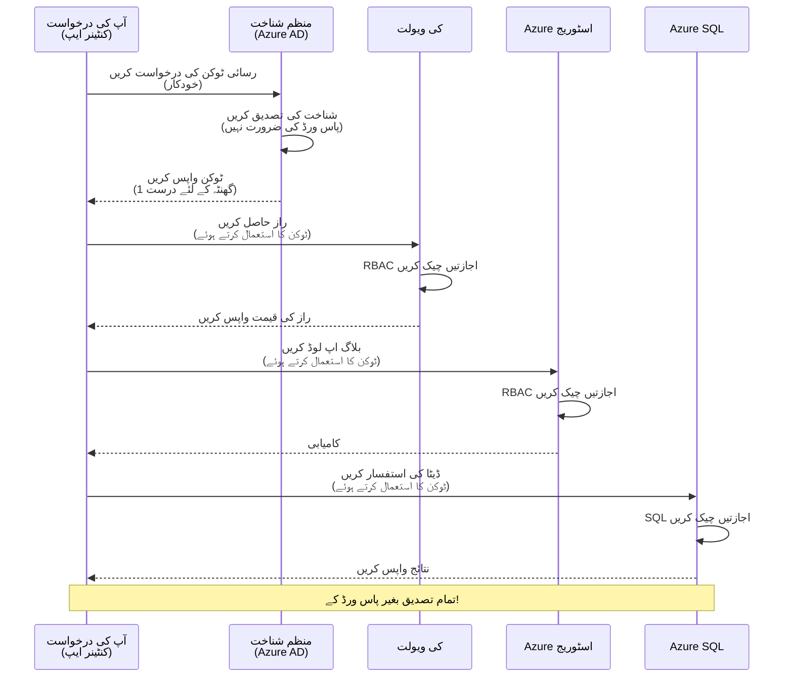
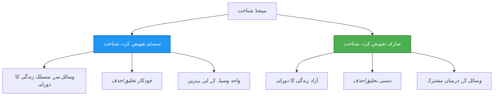

# تصدیقی نمونہ اور منیجڈ شناخت

⏱️ **متوقع وقت**: 45-60 منٹ | 💰 **لاگت کا اثر**: مفت (کوئی اضافی چارجز نہیں) | ⭐ **پیچیدگی**: درمیانہ

**📚 سیکھنے کا راستہ:**
- ← پچھلا: [کنفیگریشن مینجمنٹ](configuration.md) - ماحول کے متغیرات اور رازوں کا انتظام
- 🎯 **آپ یہاں ہیں**: تصدیق اور سیکیورٹی (منیجڈ شناخت، کی والٹ، محفوظ نمونے)
- → اگلا: [پہلا پروجیکٹ](first-project.md) - اپنا پہلا AZD ایپلیکیشن بنائیں
- 🏠 [کورس ہوم](../../README.md)

---

## آپ کیا سیکھیں گے

اس سبق کو مکمل کرنے سے، آپ:
- Azure کی تصدیقی نمونوں (چابیاں، کنکشن سٹرنگز، منیجڈ شناخت) کو سمجھیں گے
- **منیجڈ شناخت** کو بغیر پاس ورڈ کی تصدیق کے لیے نافذ کریں گے
- **Azure Key Vault** انضمام کے ذریعے رازوں کو محفوظ کریں گے
- AZD تعیناتیوں کے لیے **رول بیسڈ ایکسس کنٹرول (RBAC)** ترتیب دیں گے
- کنٹینر ایپس اور Azure سروسز میں سیکیورٹی کی بہترین عملی طریقے اپنائیں گے
- چابی کی بنیاد پر تصدیق سے شناخت کی بنیاد پر تصدیق پر منتقل ہوں گے

## منیجڈ شناخت کیوں اہم ہے

### مسئلہ: روایتی تصدیق

**منیجڈ شناخت سے پہلے:**
```javascript
// ❌ سیکیورٹی کا خطرہ: کوڈ میں ہارڈ کوڈڈ راز
const connectionString = "Server=mydb.database.windows.net;User=admin;Password=P@ssw0rd123";
const storageKey = "xK7mN9pQ2wR5tY8uI0oP3aS6dF1gH4jK...";
const cosmosKey = "C2x7B9n4M1p8Q5w3E6r0T2y5U8i1O4p7...";
```

**مسائل:**
- 🔴 کوڈ، کنفیگریشن فائلز، ماحول کے متغیرات میں راز افشاں
- 🔴 اسناد کی گردش کے لیے کوڈ میں تبدیلی اور دوبارہ تعیناتی ضروری
- 🔴 آڈٹ کے مسائل - کس نے کب کیا رسائی حاصل کی؟
- 🔴 انتشار - راز مختلف سسٹمز میں بکھرے ہوئے
- 🔴 تعمیل کے خطرات - سیکیورٹی آڈٹس ناکام

### حل: منیجڈ شناخت

**منیجڈ شناخت کے بعد:**
```javascript
// ✅ محفوظ: کوڈ میں کوئی راز نہیں
const credential = new DefaultAzureCredential();
const client = new BlobServiceClient(
  "https://mystorageaccount.blob.core.windows.net",
  credential  // Azure خودکار طریقے سے توثیق سنبھالتا ہے
);
```

**فائدے:**
- ✅ کوڈ یا کنفیگریشن میں صفر راز
- ✅ خودکار گردش - Azure خود سنبھالے گا
- ✅ Azure AD لاگز میں مکمل آڈٹ ٹریل
- ✅ مرکزیت یافتہ سیکیورٹی - Azure پورٹل میں انتظام
- ✅ تعمیل کے لیے تیار - سیکیورٹی معیارات پر پورا اترتا ہے

**تشبیہ:** روایتی تصدیق مختلف دروازوں کی متعدد جسمانی چابیاں لے جانے کی طرح ہے۔ منیجڈ شناخت ایک سیکیورٹی بیج کی طرح ہے جو خودکار طور پر آپ کی شناخت کی بنیاد پر رسائی دیتا ہے — کوئی چابیاں ضائع کرنے، نقل کرنے، یا گردش کرنے کی ضرورت نہیں۔

---

## فن تعمیر کا جائزہ

### منیجڈ شناخت کے ساتھ تصدیق کا بہاؤ


```mermaid
sequenceDiagram
    participant App as آپ کی درخواست<br/>(کنٹینر ایپ)
    participant MI as منظم شناخت<br/>(Azure AD)
    participant KV as کی ویولت
    participant Storage as Azure اسٹوریج
    participant DB as Azure SQL
    
    App->>MI: رسائی ٹوکن کی درخواست کریں<br/>(خودکار)
    MI->>MI: شناخت کی تصدیق کریں<br/>(پاس ورڈ کی ضرورت نہیں)
    MI-->>App: ٹوکن واپس کریں<br/>(1 گھنٹہ کے لئے درست)
    
    App->>KV: راز حاصل کریں<br/>(ٹوکن کا استعمال کرتے ہوئے)
    KV->>KV: RBAC اجازتیں چیک کریں
    KV-->>App: راز کی قیمت واپس کریں
    
    App->>Storage: بلاگ اپ لوڈ کریں<br/>(ٹوکن کا استعمال کرتے ہوئے)
    Storage->>Storage: RBAC اجازتیں چیک کریں
    Storage-->>App: کامیابی
    
    App->>DB: ڈیٹا کی استفسار کریں<br/>(ٹوکن کا استعمال کرتے ہوئے)
    DB->>DB: SQL اجازتیں چیک کریں
    DB-->>App: نتائج واپس کریں
    
    Note over App,DB: تمام تصدیق بغیر پاس ورڈ کے!
```
### منیجڈ شناخت کی اقسام


```mermaid
graph TB
    MI[مینجڈ شناخت]
    SystemAssigned[سسٹم تفویض کردہ شناخت]
    UserAssigned[صارف تفویض کردہ شناخت]
    
    MI --> SystemAssigned
    MI --> UserAssigned
    
    SystemAssigned --> SA1[وسائل سے منسلک زندگی کا دورانیہ]
    SystemAssigned --> SA2[خودکار تخلیق/حذف]
    SystemAssigned --> SA3[واحد وسیلہ کے لیے بہترین]
    
    UserAssigned --> UA1[آزاد زندگی کا دورانیہ]
    UserAssigned --> UA2[دستی تخلیق/حذف]
    UserAssigned --> UA3[وسائل کے درمیان مشترکہ]
    
    style SystemAssigned fill:#2196F3,stroke:#1976D2,stroke-width:2px,color:#fff
    style UserAssigned fill:#4CAF50,stroke:#388E3C,stroke-width:2px,color:#fff
```
| خصوصیت | سسٹم تفویض کردہ | صارف تفویض کردہ |
|---------|----------------|---------------|
| **زندگی کا دور** | وسائل سے منسلک | آزاد |
| **تخلیق** | وسائل کے ساتھ خودکار | دستی تخلیق |
| **حذف کرنا** | وسائل کے ساتھ حذف | وسائل کے حذف ہونے کے بعد بھی برقرار |
| **اشتراک** | صرف ایک وسیلہ | متعدد وسائل |
| **استعمال کا کیس** | آسان منظرنامے | پیچیدہ کثیر وسائل منظرنامے |
| **AZD ڈیفالٹ** | ✅ تجویز کردہ | اختیاری |

---

## ضروریات

### درکار آلات

آپ کے پاس پہلے کے اسباق سے یہ انسٹال شدہ ہونا چاہیے:

```bash
# ایزور ڈیویلپر CLI کی تصدیق کریں
azd version
# ✅ توقع کی جاتی ہے: azd ورژن 1.0.0 یا اس سے زیادہ

# ایزور CLI کی تصدیق کریں
az --version
# ✅ توقع کی جاتی ہے: azure-cli ورژن 2.50.0 یا اس سے زیادہ
```

### Azure کی ضروریات

- فعال Azure سبسکرپشن
- اجازتیں:
  - منیجڈ شناخت بنانے کی
  - RBAC رول تفویض کرنے کی
  - کی والٹ وسائل بنانے کی
  - کنٹینر ایپس تعینات کرنے کی

### علم کی ضروریات

آپ نے مکمل کیا ہونا چاہیے:
- [انسٹالیشن گائیڈ](installation.md) - AZD سیٹ اپ
- [AZD بنیادیات](azd-basics.md) - بنیادی تصورات
- [کنفیگریشن مینجمنٹ](configuration.md) - ماحول کے متغیرات

---

## سبق 1: تصدیقی نمونوں کو سمجھنا

### نمونہ 1: کنکشن سٹرنگز (پرانا - گریز کریں)

**کام کرنے کا طریقہ:**
```bash
# کنکشن سٹرنگ میں اسناد شامل ہیں
STORAGE_CONNECTION_STRING="DefaultEndpointsProtocol=https;AccountName=myaccount;AccountKey=xK7mN9pQ2wR5..."
COSMOS_CONNECTION_STRING="AccountEndpoint=https://myaccount.documents.azure.com:443/;AccountKey=C2x7..."
SQL_CONNECTION_STRING="Server=myserver.database.windows.net;User=admin;Password=P@ssw0rd..."
```

**مسائل:**
- ❌ راز ماحول کے متغیرات میں دکھائی دیتے ہیں
- ❌ تعیناتی سسٹمز میں لاگ ہوتے ہیں
- ❌ گردش مشکل ہے
- ❌ رسائی کا آڈٹ ٹریل نہیں

**استعمال کا وقت:** صرف مقامی ترقی کے لیے، کبھی پروڈکشن میں نہیں۔

---

### نمونہ 2: کی والٹ حوالہ جات (بہتر)

**کام کرنے کا طریقہ:**
```bicep
// Store secret in Key Vault
resource keyVault 'Microsoft.KeyVault/vaults@2023-02-01' = {
  name: 'mykv'
  properties: {
    enableRbacAuthorization: true
  }
}

// Reference in Container App
env: [
  {
    name: 'STORAGE_KEY'
    secretRef: 'storage-key'  // References Key Vault
  }
]
```

**فائدے:**
- ✅ راز کی والٹ میں محفوظ ہیں
- ✅ مرکزی راز کا انتظام
- ✅ گردش بغیر کوڈ کی تبدیلی کے

**محدودیتیں:**
- ⚠️ اب بھی چابیاں/پاس ورڈ استعمال ہوتے ہیں
- ⚠️ کی والٹ کی رسائی کا انتظام کرنا ضروری

**استعمال کا وقت:** کنکشن سٹرنگز سے منیجڈ شناخت کی طرف منتقلی کا مرحلہ۔

---

### نمونہ 3: منیجڈ شناخت (بہترین عمل)

**کام کرنے کا طریقہ:**
```bicep
// Enable managed identity
resource containerApp 'Microsoft.App/containerApps@2023-05-01' = {
  name: 'myapp'
  identity: {
    type: 'SystemAssigned'  // Automatically creates identity
  }
}

// Grant permissions
resource roleAssignment 'Microsoft.Authorization/roleAssignments@2022-04-01' = {
  scope: storageAccount
  properties: {
    roleDefinitionId: storageBlobDataContributorRole
    principalId: containerApp.identity.principalId
  }
}
```

**ایپلیکیشن کوڈ:**
```javascript
// کسی راز کی ضرورت نہیں!
const { DefaultAzureCredential } = require('@azure/identity');
const { BlobServiceClient } = require('@azure/storage-blob');

const credential = new DefaultAzureCredential();
const blobServiceClient = new BlobServiceClient(
  'https://mystorageaccount.blob.core.windows.net',
  credential
);
```

**فائدے:**
- ✅ کوڈ/کنفیگریشن میں کوئی راز نہیں
- ✅ خودکار اسناد کی گردش
- ✅ مکمل آڈٹ ٹریل
- ✅ RBAC پر مبنی اجازتیں
- ✅ تعمیل کے لیے تیار

**استعمال کا وقت:** ہمیشہ، پروڈکشن ایپلیکیشنز کے لیے۔

---

## سبق 2: AZD کے ساتھ منیجڈ شناخت کا نفاذ

### قدم بہ قدم نفاذ

آئیے ایک محفوظ کنٹینر ایپ بنائیں جو منیجڈ شناخت استعمال کرتے ہوئے Azure Storage اور Key Vault تک رسائی حاصل کرتی ہے۔

### پروجیکٹ کا ڈھانچہ

```
secure-app/
├── azure.yaml                 # AZD configuration
├── infra/
│   ├── main.bicep            # Main infrastructure
│   ├── core/
│   │   ├── identity.bicep    # Managed identity setup
│   │   ├── keyvault.bicep    # Key Vault configuration
│   │   └── storage.bicep     # Storage with RBAC
│   └── app/
│       └── container-app.bicep
└── src/
    ├── app.js                # Application code
    ├── package.json
    └── Dockerfile
```

### 1. AZD کنفیگریشن (azure.yaml)

```yaml
name: secure-app
metadata:
  template: secure-app@1.0.0

services:
  api:
    project: ./src
    language: js
    host: containerapp

# Enable managed identity (AZD handles this automatically)
```

### 2. انفراسٹرکچر: منیجڈ شناخت کو فعال کریں

**فائل: `infra/main.bicep`**

```bicep
targetScope = 'subscription'

param environmentName string
param location string = 'eastus'

var tags = { 'azd-env-name': environmentName }

// Resource group
resource rg 'Microsoft.Resources/resourceGroups@2021-04-01' = {
  name: 'rg-${environmentName}'
  location: location
  tags: tags
}

// Storage Account
module storage './core/storage.bicep' = {
  name: 'storage'
  scope: rg
  params: {
    name: 'st${uniqueString(rg.id)}'
    location: location
    tags: tags
  }
}

// Key Vault
module keyVault './core/keyvault.bicep' = {
  name: 'keyvault'
  scope: rg
  params: {
    name: 'kv-${uniqueString(rg.id)}'
    location: location
    tags: tags
  }
}

// Container App with Managed Identity
module containerApp './app/container-app.bicep' = {
  name: 'container-app'
  scope: rg
  params: {
    name: 'ca-${environmentName}'
    location: location
    tags: tags
    storageAccountName: storage.outputs.name
    keyVaultName: keyVault.outputs.name
  }
}

// Grant Container App access to Storage
module storageRoleAssignment './core/role-assignment.bicep' = {
  name: 'storage-role'
  scope: rg
  params: {
    principalId: containerApp.outputs.identityPrincipalId
    roleDefinitionId: 'ba92f5b4-2d11-453d-a403-e96b0029c9fe'  // Storage Blob Data Contributor
    targetResourceId: storage.outputs.id
  }
}

// Grant Container App access to Key Vault
module kvRoleAssignment './core/role-assignment.bicep' = {
  name: 'kv-role'
  scope: rg
  params: {
    principalId: containerApp.outputs.identityPrincipalId
    roleDefinitionId: '4633458b-17de-408a-b874-0445c86b69e6'  // Key Vault Secrets User
    targetResourceId: keyVault.outputs.id
  }
}

// Outputs
output AZURE_STORAGE_ACCOUNT_NAME string = storage.outputs.name
output AZURE_KEY_VAULT_NAME string = keyVault.outputs.name
output APP_URL string = containerApp.outputs.url
```

### 3. سسٹم تفویض شدہ شناخت کے ساتھ کنٹینر ایپ

**فائل: `infra/app/container-app.bicep`**

```bicep
param name string
param location string
param tags object = {}
param storageAccountName string
param keyVaultName string

resource containerApp 'Microsoft.App/containerApps@2023-05-01' = {
  name: name
  location: location
  tags: tags
  identity: {
    type: 'SystemAssigned'  // 🔑 Enable managed identity
  }
  properties: {
    configuration: {
      ingress: {
        external: true
        targetPort: 3000
      }
    }
    template: {
      containers: [
        {
          name: 'api'
          image: 'myregistry.azurecr.io/api:latest'
          resources: {
            cpu: json('0.5')
            memory: '1Gi'
          }
          env: [
            {
              name: 'AZURE_STORAGE_ACCOUNT_NAME'
              value: storageAccountName
            }
            {
              name: 'AZURE_KEY_VAULT_NAME'
              value: keyVaultName
            }
            // 🔑 No secrets - managed identity handles authentication!
          ]
        }
      ]
    }
  }
}

// Output the identity for RBAC assignments
output identityPrincipalId string = containerApp.identity.principalId
output id string = containerApp.id
output url string = 'https://${containerApp.properties.configuration.ingress.fqdn}'
```

### 4. RBAC رول تفویض ماڈیول

**فائل: `infra/core/role-assignment.bicep`**

```bicep
param principalId string
param roleDefinitionId string  // Azure built-in role ID
param targetResourceId string

resource roleAssignment 'Microsoft.Authorization/roleAssignments@2022-04-01' = {
  name: guid(principalId, roleDefinitionId, targetResourceId)
  scope: resourceId('Microsoft.Resources/resourceGroups', resourceGroup().name)
  properties: {
    roleDefinitionId: subscriptionResourceId('Microsoft.Authorization/roleDefinitions', roleDefinitionId)
    principalId: principalId
    principalType: 'ServicePrincipal'
  }
}

output id string = roleAssignment.id
```

### 5. منیجڈ شناخت کے ساتھ ایپلیکیشن کوڈ

**فائل: `src/app.js`**

```javascript
const express = require('express');
const { DefaultAzureCredential } = require('@azure/identity');
const { BlobServiceClient } = require('@azure/storage-blob');
const { SecretClient } = require('@azure/keyvault-secrets');

const app = express();
const PORT = process.env.PORT || 3000;

// 🔑 اسناد کی شروعات کریں (خودکار طور پر مینیجڈ شناخت کے ساتھ کام کرتا ہے)
const credential = new DefaultAzureCredential();

// ایزور اسٹوریج کی ترتیب
const storageAccountName = process.env.AZURE_STORAGE_ACCOUNT_NAME;
const blobServiceClient = new BlobServiceClient(
  `https://${storageAccountName}.blob.core.windows.net`,
  credential  // کوئی چابیاں ضروری نہیں!
);

// کی والٹ کی ترتیب
const keyVaultName = process.env.AZURE_KEY_VAULT_NAME;
const secretClient = new SecretClient(
  `https://${keyVaultName}.vault.azure.net`,
  credential  // کوئی چابیاں ضروری نہیں!
);

// صحت کی جانچ
app.get('/health', (req, res) => {
  res.json({ status: 'healthy', authentication: 'managed-identity' });
});

// فائل کو بلب اسٹوریج میں اپ لوڈ کریں
app.post('/upload', async (req, res) => {
  try {
    const containerClient = blobServiceClient.getContainerClient('uploads');
    await containerClient.createIfNotExists();
    
    const blobName = `file-${Date.now()}.txt`;
    const blockBlobClient = containerClient.getBlockBlobClient(blobName);
    
    await blockBlobClient.upload('Hello from managed identity!', 30);
    
    res.json({
      success: true,
      blobName: blobName,
      message: 'File uploaded using managed identity!'
    });
  } catch (error) {
    console.error('Upload error:', error);
    res.status(500).json({ error: error.message });
  }
});

// کی والٹ سے راز حاصل کریں
app.get('/secret/:name', async (req, res) => {
  try {
    const secretName = req.params.name;
    const secret = await secretClient.getSecret(secretName);
    
    res.json({
      name: secretName,
      value: secret.value,
      message: 'Secret retrieved using managed identity!'
    });
  } catch (error) {
    console.error('Secret error:', error);
    res.status(500).json({ error: error.message });
  }
});

// بلب کنٹینرز کی فہرست (ریڈ ایکسیس کی مثال دیتا ہے)
app.get('/containers', async (req, res) => {
  try {
    const containers = [];
    for await (const container of blobServiceClient.listContainers()) {
      containers.push(container.name);
    }
    
    res.json({
      containers: containers,
      count: containers.length,
      message: 'Containers listed using managed identity!'
    });
  } catch (error) {
    console.error('List error:', error);
    res.status(500).json({ error: error.message });
  }
});

app.listen(PORT, () => {
  console.log(`Secure API listening on port ${PORT}`);
  console.log('Authentication: Managed Identity (passwordless)');
});
```

**فائل: `src/package.json`**

```json
{
  "name": "secure-app",
  "version": "1.0.0",
  "dependencies": {
    "express": "^4.18.2",
    "@azure/identity": "^4.0.0",
    "@azure/storage-blob": "^12.17.0",
    "@azure/keyvault-secrets": "^4.7.0"
  },
  "scripts": {
    "start": "node app.js"
  }
}
```

### 6. تعینات کریں اور ٹیسٹ کریں

```bash
# AZD ماحول کو ابتدا کریں
azd init

# بنیادی ڈھانچے اور ایپلیکیشن کو تعینات کریں
azd up

# ایپ کا URL حاصل کریں
APP_URL=$(azd env get-values | grep APP_URL | cut -d '=' -f2 | tr -d '"')

# صحت کی جانچ کریں
curl $APP_URL/health
```

**✅ متوقع نتیجہ:**
```json
{
  "status": "healthy",
  "authentication": "managed-identity"
}
```

**بلوب اپ لوڈ ٹیسٹ:**
```bash
curl -X POST $APP_URL/upload
```

**✅ متوقع نتیجہ:**
```json
{
  "success": true,
  "blobName": "file-1700404800000.txt",
  "message": "File uploaded using managed identity!"
}
```

**کنٹینر لیسٹنگ ٹیسٹ:**
```bash
curl $APP_URL/containers
```

**✅ متوقع نتیجہ:**
```json
{
  "containers": ["uploads"],
  "count": 1,
  "message": "Containers listed using managed identity!"
}
```

---

## عمومی Azure RBAC رولز

### منیجڈ شناخت کے لیے بلٹ ان رول IDs

| سروس | رول کا نام | رول ID | اجازتیں |
|---------|-----------|---------|-------------|
| **Storage** | Storage Blob Data Reader | `2a2b9908-6b94-4a3d-8e5a-a7d8f8cc8a12` | بلوب اور کنٹینرز پڑھیں |
| **Storage** | Storage Blob Data Contributor | `ba92f5b4-2d11-453d-a403-e96b0029c9fe` | بلوب پڑھیں، لکھیں، حذف کریں |
| **Storage** | Storage Queue Data Contributor | `974c5e8b-45b9-4653-ba55-5f855dd0fb88` | قطار کے پیغامات پڑھیں، لکھیں، حذف کریں |
| **Key Vault** | Key Vault Secrets User | `4633458b-17de-408a-b874-0445c86b69e6` | راز پڑھیں |
| **Key Vault** | Key Vault Secrets Officer | `b86a8fe4-44ce-4948-aee5-eccb2c155cd7` | راز پڑھیں، لکھیں، حذف کریں |
| **Cosmos DB** | Cosmos DB Built-in Data Reader | `00000000-0000-0000-0000-000000000001` | Cosmos DB ڈیٹا پڑھیں |
| **Cosmos DB** | Cosmos DB Built-in Data Contributor | `00000000-0000-0000-0000-000000000002` | Cosmos DB ڈیٹا پڑھیں، لکھیں |
| **SQL Database** | SQL DB Contributor | `9b7fa17d-e63e-47b0-bb0a-15c516ac86ec` | SQL ڈیٹا بیس کا انتظام کریں |
| **Service Bus** | Azure Service Bus Data Owner | `090c5cfd-751d-490a-894a-3ce6f1109419` | پیغامات بھیجیں، وصول کریں، انتظام کریں |

### رول IDs کیسے تلاش کریں

```bash
# تمام بلٹ ان کرداروں کی فہرست بنائیں
az role definition list --query "[].{Name:roleName, ID:name}" --output table

# مخصوص کردار تلاش کریں
az role definition list --query "[?contains(roleName, 'Storage Blob')].{Name:roleName, ID:name}" --output table

# کردار کی تفصیلات حاصل کریں
az role definition list --name "Storage Blob Data Contributor"
```

---

## عملی مشقیں

### مشق 1: موجودہ ایپ کے لیے منیجڈ شناخت کو فعال کریں ⭐⭐ (درمیانہ)

**مقصد**: موجودہ کنٹینر ایپ تعیناتی میں منیجڈ شناخت شامل کریں

**منظرنامہ**: آپ کے پاس کنکشن سٹرنگز استعمال کرنے والی کنٹینر ایپ ہے۔ اسے منیجڈ شناخت میں تبدیل کریں۔

**آغاز کی جگہ**: اس کنفیگریشن والی کنٹینر ایپ:

```bicep
// ❌ Current: Using connection string
env: [
  {
    name: 'STORAGE_CONNECTION_STRING'
    secretRef: 'storage-connection'
  }
]
```

**قدامات**:

1. **Bicep میں منیجڈ شناخت کو فعال کریں:**

```bicep
resource containerApp 'Microsoft.App/containerApps@2023-05-01' = {
  name: 'myapp'
  identity: {
    type: 'SystemAssigned'  // Add this
  }
  // ... rest of configuration
}
```

2. **Storage کی رسائی دیں:**

```bicep
// Get storage account reference
resource storageAccount 'Microsoft.Storage/storageAccounts@2023-01-01' existing = {
  name: storageAccountName
}

// Assign role
resource roleAssignment 'Microsoft.Authorization/roleAssignments@2022-04-01' = {
  name: guid(containerApp.id, 'ba92f5b4-2d11-453d-a403-e96b0029c9fe', storageAccount.id)
  scope: storageAccount
  properties: {
    roleDefinitionId: subscriptionResourceId('Microsoft.Authorization/roleDefinitions', 'ba92f5b4-2d11-453d-a403-e96b0029c9fe')
    principalId: containerApp.identity.principalId
    principalType: 'ServicePrincipal'
  }
}
```

3. **ایپلیکیشن کوڈ کو اپ ڈیٹ کریں:**

**پہلے (کنکشن سٹرنگ):**
```javascript
const { BlobServiceClient } = require('@azure/storage-blob');

const blobServiceClient = BlobServiceClient.fromConnectionString(
  process.env.STORAGE_CONNECTION_STRING
);
```

**بعد میں (منیجڈ شناخت):**
```javascript
const { DefaultAzureCredential } = require('@azure/identity');
const { BlobServiceClient } = require('@azure/storage-blob');

const credential = new DefaultAzureCredential();
const blobServiceClient = new BlobServiceClient(
  `https://${process.env.STORAGE_ACCOUNT_NAME}.blob.core.windows.net`,
  credential
);
```

4. **ماحول کے متغیرات کو اپ ڈیٹ کریں:**

```bicep
env: [
  {
    name: 'STORAGE_ACCOUNT_NAME'
    value: storageAccountName  // Just the name, no secrets!
  }
  // Remove STORAGE_CONNECTION_STRING
]
```

5. **تعینات کریں اور ٹیسٹ کریں:**

```bash
# دوبارہ تعینات کریں
azd up

# ٹیسٹ کریں کہ یہ ابھی بھی کام کر رہا ہے
curl https://myapp.azurecontainerapps.io/upload
```

**✅ کامیابی کے معیار:**
- ✅ ایپلیکیشن بغیر غلطی تعینات ہو
- ✅ Storage کے آپریشن کام کریں (اپ لوڈ، لسٹ، ڈاؤن لوڈ)
- ✅ ماحول میں کنکشن سٹرنگز نہ ہوں
- ✅ Azure پورٹل میں "Identity" بلیڈ کے تحت شناخت نظر آئے

**تصدیق:**

```bash
# چیک کریں کہ مینیجڈ شناخت فعال ہے
az containerapp show \
  --name myapp \
  --resource-group rg-myapp \
  --query "identity.type"
# ✅ متوقع: "SystemAssigned"

# کردار تفویض چیک کریں
az role assignment list \
  --assignee $(az containerapp show --name myapp --resource-group rg-myapp --query "identity.principalId" -o tsv) \
  --scope /subscriptions/{sub-id}/resourceGroups/rg-myapp/providers/Microsoft.Storage/storageAccounts/mystorageaccount
# ✅ متوقع: "Storage Blob Data Contributor" کردار دکھاتا ہے
```

**وقت**: 20-30 منٹ

---

### مشق 2: صارف تفویض شدہ شناخت کے ساتھ کثیر سروس رسائی ⭐⭐⭐ (اعلیٰ)

**مقصد**: متعدد کنٹینر ایپس میں مشترکہ صارف تفویض شدہ شناخت بنائیں

**منظرنامہ**: آپ کے پاس 3 مائیکرو سروسز ہیں جنہیں ایک ہی Storage اکاؤنٹ اور Key Vault کی رسائی چاہیے۔

**قدامات**:

1. **صارف تفویض شدہ شناخت بنائیں:**

**فائل: `infra/core/identity.bicep`**

```bicep
param name string
param location string
param tags object = {}

resource userAssignedIdentity 'Microsoft.ManagedIdentity/userAssignedIdentities@2023-01-31' = {
  name: name
  location: location
  tags: tags
}

output id string = userAssignedIdentity.id
output principalId string = userAssignedIdentity.properties.principalId
output clientId string = userAssignedIdentity.properties.clientId
```

2. **صارف تفویض شدہ شناخت کو رولز تفویض کریں:**

```bicep
// In main.bicep
module userIdentity './core/identity.bicep' = {
  name: 'user-identity'
  scope: rg
  params: {
    name: 'id-${environmentName}'
    location: location
    tags: tags
  }
}

// Grant Storage access
resource storageRoleAssignment 'Microsoft.Authorization/roleAssignments@2022-04-01' = {
  name: guid(userIdentity.outputs.principalId, 'storage-contributor')
  scope: storageAccount
  properties: {
    roleDefinitionId: subscriptionResourceId('Microsoft.Authorization/roleDefinitions', 'ba92f5b4-2d11-453d-a403-e96b0029c9fe')
    principalId: userIdentity.outputs.principalId
    principalType: 'ServicePrincipal'
  }
}

// Grant Key Vault access
resource kvRoleAssignment 'Microsoft.Authorization/roleAssignments@2022-04-01' = {
  name: guid(userIdentity.outputs.principalId, 'kv-secrets-user')
  scope: keyVault
  properties: {
    roleDefinitionId: subscriptionResourceId('Microsoft.Authorization/roleDefinitions', '4633458b-17de-408a-b874-0445c86b69e6')
    principalId: userIdentity.outputs.principalId
    principalType: 'ServicePrincipal'
  }
}
```

3. **کثیر کنٹینر ایپس کو شناخت تفویض کریں:**

```bicep
resource apiGateway 'Microsoft.App/containerApps@2023-05-01' = {
  name: 'api-gateway'
  identity: {
    type: 'UserAssigned'
    userAssignedIdentities: {
      '${userIdentity.outputs.id}': {}
    }
  }
  // ... rest of config
}

resource productService 'Microsoft.App/containerApps@2023-05-01' = {
  name: 'product-service'
  identity: {
    type: 'UserAssigned'
    userAssignedIdentities: {
      '${userIdentity.outputs.id}': {}
    }
  }
  // ... rest of config
}

resource orderService 'Microsoft.App/containerApps@2023-05-01' = {
  name: 'order-service'
  identity: {
    type: 'UserAssigned'
    userAssignedIdentities: {
      '${userIdentity.outputs.id}': {}
    }
  }
  // ... rest of config
}
```

4. **ایپلیکیشن کوڈ (تمام سروسز میں یکساں نمونہ):**

```javascript
const { DefaultAzureCredential, ManagedIdentityCredential } = require('@azure/identity');

// صارف کے تفویض کردہ شناخت کے لیے، کلائنٹ ID فراہم کریں
const credential = new ManagedIdentityCredential(
  process.env.AZURE_CLIENT_ID  // صارف کے تفویض کردہ شناخت کی کلائنٹ ID
);

// یا DefaultAzureCredential استعمال کریں (خودکار طور پر پتہ لگاتا ہے)
const credential = new DefaultAzureCredential();

const blobServiceClient = new BlobServiceClient(
  `https://${process.env.STORAGE_ACCOUNT_NAME}.blob.core.windows.net`,
  credential
);
```

5. **تعینات کریں اور تصدیق کریں:**

```bash
azd up

# تمام خدمات کا اسٹوریج تک رسائی حاصل کر سکنا جانچیں
curl https://api-gateway.azurecontainerapps.io/upload
curl https://product-service.azurecontainerapps.io/upload
curl https://order-service.azurecontainerapps.io/upload
```

**✅ کامیابی کے معیار:**
- ✅ 3 سروسز میں ایک شناخت کا اشتراک
- ✅ تمام سروسز Storage اور Key Vault تک رسائی حاصل کر سکتے ہیں
- ✅ ایک سروس حذف کرنے پر شناخت برقرار رہے
- ✅ مرکزی اجازتوں کا انتظام

**صارف تفویض شدہ شناخت کے فوائد:**
- انتظام کے لیے ایک شناخت
- سروسز میں یکساں اجازتیں
- سروس حذف کرنے پر زندہ رہے
- پیچیدہ ڈھانچوں کے لیے بہتر

**وقت**: 30-40 منٹ

---

### مشق 3: کی والٹ سیکرٹ گردش کو نافذ کریں ⭐⭐⭐ (اعلیٰ)

**مقصد**: تیسری پارٹی کی API چابیاں کی والٹ میں محفوظ کریں اور منیجڈ شناخت کا استعمال کرتے ہوئے رسائی حاصل کریں

**منظرنامہ**: آپ کی ایپ کو ایک خارجی API (OpenAI، Stripe، SendGrid) کال کرنے کی ضرورت ہے جو API چابیاں مانگتی ہے۔

**قدامات**:

1. **RBAC کے ساتھ Key Vault بنائیں:**

**فائل: `infra/core/keyvault.bicep`**

```bicep
param name string
param location string
param tags object = {}

resource keyVault 'Microsoft.KeyVault/vaults@2023-02-01' = {
  name: name
  location: location
  tags: tags
  properties: {
    enableRbacAuthorization: true  // Use RBAC instead of access policies
    sku: {
      family: 'A'
      name: 'standard'
    }
    tenantId: subscription().tenantId
    enableSoftDelete: true
    softDeleteRetentionInDays: 90
  }
}

// Allow Container App to read secrets
output id string = keyVault.id
output name string = keyVault.name
output uri string = keyVault.properties.vaultUri
```

2. **راز کی والٹ میں محفوظ کریں:**

```bash
# حاصل کریں کلید والٹ کا نام
KV_NAME=$(azd env get-values | grep AZURE_KEY_VAULT_NAME | cut -d '=' -f2 | tr -d '"')

# محفوظ کریں تیسرے فریق کے API کیز
az keyvault secret set \
  --vault-name $KV_NAME \
  --name "OpenAI-ApiKey" \
  --value "sk-proj-xxxxxxxxxxxxx"

az keyvault secret set \
  --vault-name $KV_NAME \
  --name "Stripe-ApiKey" \
  --value "sk_live_xxxxxxxxxxxxx"

az keyvault secret set \
  --vault-name $KV_NAME \
  --name "SendGrid-ApiKey" \
  --value "SG.xxxxxxxxxxxxx"
```

3. **راز بازیافت کے لیے ایپلیکیشن کوڈ:**

**فائل: `src/config.js`**

```javascript
const { DefaultAzureCredential } = require('@azure/identity');
const { SecretClient } = require('@azure/keyvault-secrets');

class Config {
  constructor() {
    this.credential = new DefaultAzureCredential();
    this.secretClient = new SecretClient(
      `https://${process.env.AZURE_KEY_VAULT_NAME}.vault.azure.net`,
      this.credential
    );
    this.cache = {};
  }

  async getSecret(secretName) {
    // پہلے کیش چیک کریں
    if (this.cache[secretName]) {
      return this.cache[secretName];
    }

    try {
      const secret = await this.secretClient.getSecret(secretName);
      this.cache[secretName] = secret.value;
      console.log(`✅ Retrieved secret: ${secretName}`);
      return secret.value;
    } catch (error) {
      console.error(`❌ Failed to get secret ${secretName}:`, error.message);
      throw error;
    }
  }

  async getOpenAIKey() {
    return this.getSecret('OpenAI-ApiKey');
  }

  async getStripeKey() {
    return this.getSecret('Stripe-ApiKey');
  }

  async getSendGridKey() {
    return this.getSecret('SendGrid-ApiKey');
  }
}

module.exports = new Config();
```

4. **ایپ میں راز استعمال کریں:**

**فائل: `src/app.js`**

```javascript
const express = require('express');
const config = require('./config');
const { OpenAI } = require('openai');

const app = express();

// کی ویؤلٹ سے کلید لے کر OpenAI کو شروع کریں
let openaiClient;

async function initializeServices() {
  const openaiKey = await config.getOpenAIKey();
  openaiClient = new OpenAI({ apiKey: openaiKey });
  console.log('✅ Services initialized with secrets from Key Vault');
}

// شروع کرنے پر کال کریں
initializeServices().catch(console.error);

app.post('/chat', async (req, res) => {
  try {
    const completion = await openaiClient.chat.completions.create({
      model: 'gpt-4.1',
      messages: [{ role: 'user', content: 'Hello!' }]
    });
    
    res.json({
      response: completion.choices[0].message.content,
      authentication: 'Key from Key Vault via Managed Identity'
    });
  } catch (error) {
    res.status(500).json({ error: error.message });
  }
});

app.listen(3000, () => {
  console.log('Secure API with Key Vault integration running');
});
```

5. **تعینات کریں اور ٹیسٹ کریں:**

```bash
azd up

# ٹیسٹ کریں کہ اے پی آئی کیز کام کر رہی ہیں
curl -X POST https://myapp.azurecontainerapps.io/chat \
  -H "Content-Type: application/json" \
  -d '{"message":"Hello AI"}'
```

**✅ کامیابی کے معیار:**
- ✅ کوڈ یا ماحول کے متغیرات میں کوئی API چابیاں نہیں
- ✅ ایپلیکیشن کی والٹ سے چابیاں حاصل کرتی ہے
- ✅ تیسری پارٹی کے API درست کام کرتے ہیں
- ✅ گردش بغیر کوڈ میں تبدیلی کے ممکن ہے

**راز گردش کریں:**

```bash
# خفیہ معلومات کو کی ویولت میں اپ ڈیٹ کریں
az keyvault secret set \
  --vault-name $KV_NAME \
  --name "OpenAI-ApiKey" \
  --value "sk-proj-NEW_KEY_HERE"

# نئی کلید حاصل کرنے کے لئے ایپ کو دوبارہ شروع کریں
az containerapp revision restart \
  --name myapp \
  --resource-group rg-myapp
```

**وقت**: 25-35 منٹ

---

## علم کی تصدیق

### 1. تصدیقی نمونے ✓

اپنی سمجھ بوجھ آزمائیں:

- [ ] **سوال 1**: تین اہم تصدیقی نمونے کون سے ہیں؟ 
  - **جواب**: کنکشن سٹرنگز (پرانا)، کی والٹ حوالہ جات (منتقلی)، منیجڈ شناخت (بہترین)

- [ ] **سوال 2**: منیجڈ شناخت کنکشن سٹرنگز سے بہتر کیوں ہے؟
  - **جواب**: کوڈ میں کوئی راز نہیں، خودکار گردش، مکمل آڈٹ ٹریل، RBAC اجازتیں

- [ ] **سوال 3**: کب آپ سسٹم تفویض شدہ کی بجائے صارف تفویض شدہ شناخت استعمال کریں گے؟
  - **جواب**: جب شناخت کا اشتراک متعدد وسائل میں کرنا ہو یا شناخت کا زندگی کا دور وسائل سے آزاد ہو

**عملی تصدیق:**
```bash
# چیک کریں کہ آپ کی ایپ کس قسم کی شناخت استعمال کرتی ہے
az containerapp show \
  --name myapp \
  --resource-group rg-myapp \
  --query "identity.type"

# شناخت کے لیے تمام کردار تفویض کی فہرست بنائیں
az role assignment list \
  --assignee $(az containerapp show --name myapp --resource-group rg-myapp --query "identity.principalId" -o tsv)
```

---

### 2. RBAC اور اجازتیں ✓

اپنی سمجھ بوجھ آزمائیں:

- [ ] **سوال 1**: "Storage Blob Data Contributor" کے لیے رول ID کیا ہے؟
  - **جواب**: `ba92f5b4-2d11-453d-a403-e96b0029c9fe`

- [ ] **سوال 2**: "Key Vault Secrets User" کون سی اجازتیں دیتا ہے؟
  - **جواب**: راز کی صرف پڑھائی کی اجازت (نہ بنانے، نہ اپ ڈیٹ کرنے، نہ حذف کرنے)

- [ ] **سوال 3**: کنٹینر ایپ کو Azure SQL کی رسائی کیسے دی جاتی ہے؟
  - **جواب**: "SQL DB Contributor" رول تفویض کریں یا SQL کے لیے Azure AD تصدیق ترتیب دیں

**عملی تصدیق:**
```bash
# مخصوص کردار تلاش کریں
az role definition list --name "Storage Blob Data Contributor"

# یہ چیک کریں کہ کون سے کردار آپ کی شناخت کو تفویض کیے گئے ہیں
PRINCIPAL_ID=$(az containerapp show --name myapp --resource-group rg-myapp --query "identity.principalId" -o tsv)
az role assignment list --assignee $PRINCIPAL_ID --output table
```

---

### 3. کی والٹ انضمام ✓

اپنی سمجھ بوجھ آزمائیں:
- [ ] **Q1**: آپ کیسے Key Vault کے لیے RBAC کو ایکسیس پالیسیز کی بجائے فعال کرتے ہیں؟
  - **جواب**: Bicep میں `enableRbacAuthorization: true` سیٹ کریں

- [ ] **Q2**: کونسی Azure SDK لائبریری managed identity کی تصدیق سنبھالتی ہے؟
  - **جواب**: `@azure/identity` `DefaultAzureCredential` کلاس کے ساتھ

- [ ] **Q3**: Key Vault کے راز کتنی دیر کے لیے کیش میں رہتے ہیں؟
  - **جواب**: یہ ایپلیکیشن پر منحصر ہے؛ اپنی کیشنگ حکمت عملی نافذ کریں

**عملی تصدیق:**
```bash
# کلید والٹ تک رسائی کی جانچ کریں
az keyvault secret show \
  --vault-name $KV_NAME \
  --name "OpenAI-ApiKey" \
  --query "value"

# چیک کریں کہ RBAC فعال ہے
az keyvault show \
  --name $KV_NAME \
  --query "properties.enableRbacAuthorization"
# ✅ متوقع: درست
```

---

## سیکیورٹی کی بہترین مشقیں

### ✅ کریں:

1. **ہمیشہ پروڈکشن میں managed identity استعمال کریں**
   ```bicep
   identity: {
     type: 'SystemAssigned'
   }
   ```

2. **کم از کم اجازت والے RBAC کردار استعمال کریں**
   - جب ممکن ہو "Reader" رولز استعمال کریں
   - "Owner" یا "Contributor" صرف ضروری ہو تو استعمال کریں

3. **تیسری پارٹی کیز کو Key Vault میں رکھیں**
   ```javascript
   const apiKey = await secretClient.getSecret('ThirdPartyApiKey');
   ```

4. **آڈٹ لاگنگ کو فعال کریں**
   ```bicep
   diagnosticSettings: {
     logs: [{ category: 'AuditEvent', enabled: true }]
   }
   ```

5. **ڈیولپمنٹ، اسٹیجنگ، اور پروڈکشن کے لیے مختلف شناختیں استعمال کریں**
   ```bash
   azd env new dev
   azd env new staging
   azd env new prod
   ```

6. **رازوں کو باقاعدگی سے تبدیل کریں**
   - Key Vault کے رازوں پر میعاد ختم ہونے کی تاریخ مقرر کریں
   - Azure Functions کے ذریعے گردش کو خودکار بنائیں

### ❌ نہ کریں:

1. **رازوں کو کبھی ہارڈ کوڈ نہ کریں**
   ```javascript
   // ❌ خراب
   const apiKey = "sk-proj-xxxxxxxxxxxxx";
   ```

2. **پروڈکشن میں کنکشن اسٹرنگز استعمال نہ کریں**
   ```javascript
   // ❌ خراب
   BlobServiceClient.fromConnectionString(process.env.STORAGE_CONNECTION_STRING)
   ```

3. **بے حد اجازتیں نہ دیں**
   ```bicep
   // ❌ BAD - too much access
   roleDefinitionId: 'Owner'
   
   // ✅ GOOD - least privilege
   roleDefinitionId: 'Storage Blob Data Reader'
   ```

4. **رازوں کا لاگنگ نہ کریں**
   ```javascript
   // ❌ خراب
   console.log('API Key:', apiKey);
   
   // ✅ اچھا
   console.log('API Key retrieved successfully');
   ```

5. **پروڈکشن کی شناختیں ماحولوں میں بانٹیں نہیں**
   ```bicep
   // ❌ BAD - same identity for dev and prod
   // ✅ GOOD - separate identities per environment
   ```

---

## مسئلہ حل کرنے کی رہنمائی

### مسئلہ: Azure Storage تک رسائی پر "Unauthorized"

**علامات:**
```
Error: Unauthorized (403)
AuthorizationPermissionMismatch: This request is not authorized to perform this operation
```

**تشخیص:**

```bash
# چیک کریں کہ کیا منیجڈ شناخت فعال ہے
az containerapp show \
  --name myapp \
  --resource-group rg-myapp \
  --query "identity.type"
# ✅ متوقع: "SystemAssigned" یا "UserAssigned"

# کردار کی تقرریوں کو چیک کریں
PRINCIPAL_ID=$(az containerapp show --name myapp --resource-group rg-myapp --query "identity.principalId" -o tsv)
az role assignment list --assignee $PRINCIPAL_ID

# متوقع: "Storage Blob Data Contributor" یا اسی طرح کا کردار دیکھنا چاہیے
```

**حل:**

1. **صحیح RBAC رول تفویض کریں:**
```bash
STORAGE_ID=$(az storage account show --name mystorageaccount --resource-group rg-myapp --query "id" -o tsv)
az role assignment create \
  --assignee $PRINCIPAL_ID \
  --role "Storage Blob Data Contributor" \
  --scope $STORAGE_ID
```

2. **پروپیگیشن کے لیے انتظار کریں (5-10 منٹ لگ سکتے ہیں):**
```bash
# کردار کے اسائنمنٹ کی حیثیت چیک کریں
az role assignment list --assignee $PRINCIPAL_ID --scope $STORAGE_ID
```

3. **ایپلیکیشن کوڈ میں صحیح اسناد استعمال کرنے کی تصدیق کریں:**
```javascript
// یقینی بنائیں کہ آپ DefaultAzureCredential استعمال کر رہے ہیں
const credential = new DefaultAzureCredential();
```

---

### مسئلہ: Key Vault تک رسائی سے انکار

**علامات:**
```
Error: Forbidden (403)
The user, group or application does not have secrets get permission
```

**تشخیص:**

```bash
# چیک کریں کہ کی والٹ RBAC فعال ہے
az keyvault show \
  --name $KV_NAME \
  --query "properties.enableRbacAuthorization"
# ✅ متوقع: درست

# رول تفویضات چیک کریں
az role assignment list \
  --assignee $PRINCIPAL_ID \
  --scope /subscriptions/{sub-id}/resourceGroups/rg-myapp/providers/Microsoft.KeyVault/vaults/$KV_NAME
```

**حل:**

1. **Key Vault پر RBAC کو فعال کریں:**
```bash
az keyvault update \
  --name $KV_NAME \
  --enable-rbac-authorization true
```

2. **Key Vault Secrets User کا کردار دیں:**
```bash
KV_ID=$(az keyvault show --name $KV_NAME --query "id" -o tsv)
az role assignment create \
  --assignee $PRINCIPAL_ID \
  --role "Key Vault Secrets User" \
  --scope $KV_ID
```

---

### مسئلہ: DefaultAzureCredential مقامی طور پر ناکام ہو رہا ہے

**علامات:**
```
Error: DefaultAzureCredential failed to retrieve a token
CredentialUnavailableError: No credential available
```

**تشخیص:**

```bash
# چیک کریں کہ آیا آپ لاگ ان ہیں
az account show

# Azure CLI کی توثیق چیک کریں
az ad signed-in-user show
```

**حل:**

1. **Azure CLI میں لاگ ان کریں:**
```bash
az login
```

2. **Azure سبسکرپشن سیٹ کریں:**
```bash
az account set --subscription "Your Subscription Name"
```

3. **مقامی ترقی کے لیے ماحولیاتی متغیرات استعمال کریں:**
```bash
export AZURE_TENANT_ID="your-tenant-id"
export AZURE_CLIENT_ID="your-client-id"
export AZURE_CLIENT_SECRET="your-client-secret"
```

4. **یا مقامی طور پر مختلف سند استعمال کریں:**
```javascript
const { DefaultAzureCredential, AzureCliCredential } = require('@azure/identity');

// لوکل ڈویلپمنٹ کے لئے AzureCliCredential استعمال کریں
const credential = process.env.NODE_ENV === 'production' 
  ? new DefaultAzureCredential()
  : new AzureCliCredential();
```

---

### مسئلہ: رول تفویض کے پھیلاؤ میں زیادہ وقت لگنا

**علامات:**
- رول کامیابی کے ساتھ تفویض ہو گیا
- پھر بھی 403 کی غلطیاں آ رہی ہیں
- وقفے وقفے سے رسائی (کبھی کام کرتا ہے، کبھی نہیں)

**وضاحت:**
Azure RBAC تبدیلیوں کو عالمی سطح پر پھیلنے میں 5-10 منٹ لگ سکتے ہیں۔

**حل:**

```bash
# انتظار کریں اور دوبارہ کوشش کریں
echo "Waiting for RBAC propagation..."
sleep 300  # 5 منٹ انتظار کریں

# رسائی کا معائنہ کریں
curl https://myapp.azurecontainerapps.io/upload

# اگر پھر بھی ناکام ہو رہا ہے، ایپ کو دوبارہ شروع کریں
az containerapp revision restart \
  --name myapp \
  --resource-group rg-myapp
```

---

## لاگت کے پہلو

### Managed Identity کی لاگت

| وسیلہ | لاگت |
|----------|------|
| **Managed Identity** | 🆓 **مفت** - کوئی چارج نہیں |
| **RBAC رول تفویضات** | 🆓 **مفت** - کوئی چارج نہیں |
| **Azure AD ٹوکن درخواستیں** | 🆓 **مفت** - شامل ہے |
| **Key Vault آپریشنز** | $0.03 فی 10,000 آپریشنز |
| **Key Vault اسٹوریج** | $0.024 فی راز فی مہینہ |

**Managed identity پیسے بچاتی ہے:**
- ✅ سروس سے سروس کی تصدیق کے لیے Key Vault آپریشنز ختم کر کے
- ✅ سیکیورٹی واقعات کم کر کے (کوئی لیک شدہ اسناد نہیں)
- ✅ آپریشنل بوجھ کم کر کے (دستی گردش نہیں)

**لاگت کا موازنہ (ماہانہ):**

| منظر نامہ | کنکشن اسٹرنگز | Managed Identity | بچت |
|----------|----------------|-----------------|-------|
| چھوٹی ایپ (1M درخواستیں) | تقریباً $50 (Key Vault + آپریشنز) | تقریباً $0 | $50/ماہ |
| درمیانی ایپ (10M درخواستیں) | تقریباً $200 | تقریباً $0 | $200/ماہ |
| بڑی ایپ (100M درخواستیں) | تقریباً $1,500 | تقریباً $0 | $1,500/ماہ |

---

## مزید جانیں

### سرکاری دستاویزات
- [Azure Managed Identity](https://learn.microsoft.com/entra/identity/managed-identities-azure-resources/overview)
- [Azure RBAC](https://learn.microsoft.com/azure/role-based-access-control/overview)
- [Azure Key Vault](https://learn.microsoft.com/azure/key-vault/general/overview)
- [DefaultAzureCredential](https://learn.microsoft.com/dotnet/api/azure.identity.defaultazurecredential)

### SDK دستاویزات
- [@azure/identity (Node.js)](https://www.npmjs.com/package/@azure/identity)
- [Azure.Identity (C#)](https://www.nuget.org/packages/Azure.Identity/)
- [azure-identity (Python)](https://pypi.org/project/azure-identity/)

### اس کورس میں اگلے مراحل
- ← پچھلا: [Configuration Management](configuration.md)
- → اگلا: [First Project](first-project.md)
- 🏠 [کورس کا ہوم](../../README.md)

### متعلقہ مثالیں
- [Microsoft Foundry Models Chat Example](../../../../examples/azure-openai-chat) - Microsoft Foundry Models کے لیے managed identity استعمال کرتا ہے
- [Microservices Example](../../../../examples/microservices) - کثیر سروس کی تصدیقی پیٹرنز

---

## خلاصہ

**آپ نے سیکھا:**
- ✅ تین تصدیقی پیٹرنز (کنکشن اسٹرنگز، Key Vault، managed identity)
- ✅ AZD میں managed identity کو فعال اور ترتیب دینا
- ✅ Azure خدمات کے لیے RBAC رول تفویضات
- ✅ تیسری پارٹی کے رازوں کے لیے Key Vault انضمام
- ✅ یوزر-اسائنڈ بمقابلہ سسٹم-اسائنڈ شناختیں
- ✅ سیکیورٹی کی بہترین مشقیں اور مسئلہ حل کرنا

**اہم نکات:**
1. **ہمیشہ پروڈکشن میں managed identity استعمال کریں** - صفر راز، خودکار گردش
2. **کم از کم اجازت والے RBAC رولز استعمال کریں** - صرف ضروری اجازتیں دیں
3. **تیسری پارٹی کیز کو Key Vault میں محفوظ کریں** - مرکزی راز مینجمنٹ
4. **ماحول کے لحاظ سے شناختیں الگ رکھیں** - ڈیولپ، اسٹیج، پروڈ کی علیحدگی
5. **آڈٹ لاگنگ کو فعال کریں** - پتہ لگائیں کہ کس نے کیا رسائی کی

**اگلے اقدامات:**
1. اوپر دی گئی عملی مشقیں مکمل کریں
2. کنکشن اسٹرنگز سے managed identity پر منتقل کریں
3. سیکورٹی کے ساتھ اپنا پہلا AZD پروجیکٹ بنائیں: [First Project](first-project.md)

---

<!-- CO-OP TRANSLATOR DISCLAIMER START -->
**ڈس کلیمر**:  
یہ دستاویز AI ترجمہ سروس [Co-op Translator](https://github.com/Azure/co-op-translator) کے استعمال سے ترجمہ کی گئی ہے۔ اگرچہ ہم درستگی کے لیے کوشاں ہیں، لیکن براہ کرم اس بات کا خیال رکھیں کہ خودکار ترجموں میں غلطیاں یا بے دقتیاں ہو سکتی ہیں۔ اصل دستاویز اپنی مادری زبان میں مستند ماخذ سمجھی جانی چاہیے۔ اہم معلومات کے لیے پیشہ ور انسانی ترجمہ کی سفارش کی جاتی ہے۔ اس ترجمے کے استعمال سے پیدا ہونے والی کسی بھی غلط فہمی یا غلط تشریح کی ذمہ داری ہم پر نہیں ہے۔
<!-- CO-OP TRANSLATOR DISCLAIMER END -->