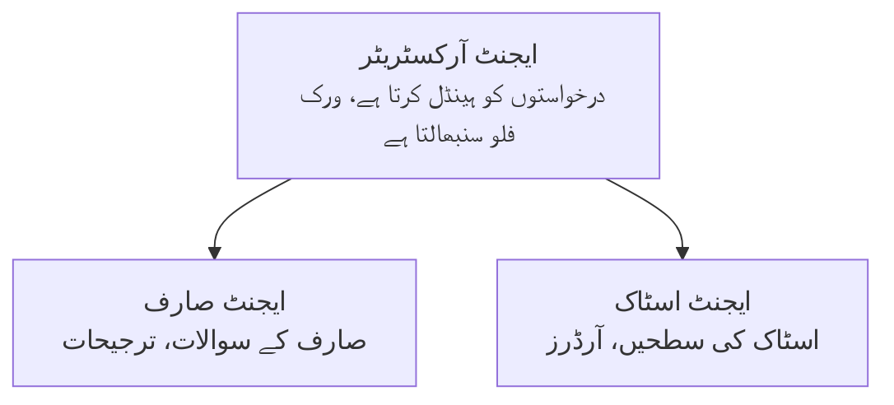

# باب 5: کثیر ایجنٹ AI حل

**📚 کورس**: [ابتدائیوں کے لیے AZD](../../README.md) | **⏱️ دورانیہ**: 2-3 گھنٹے | **⭐ پیچیدگی**: اعلیٰ

---

## جائزہ

یہ باب جدید کثیر ایجنٹ آرکیٹیکچر پیٹرن، ایجنٹ کی ہم آہنگی، اور پیچیدہ مناظر کے لیے پیداواری تیار AI تعیناتیوں کا احاطہ کرتا ہے۔

> جون 2026 میں `azd 1.25.6` کے خلاف تصدیق شدہ۔

## سیکھنے کے مقاصد

اس باب کو مکمل کرکے آپ یہ سیکھیں گے:
- کثیر ایجنٹ آرکیٹیکچر پیٹرنز کو سمجھنا
- مربوط AI ایجنٹ نظام تعینات کرنا
- ایجنٹ سے ایجنٹ تک مواصلات کو نافذ کرنا
- پیداواری تیار کثیر ایجنٹ حل تیار کرنا

---

## 📚 اسباق

| # | سبق | وضاحت | وقت |
|---|--------|-------------|------|
| 1 | [کثیر ایجنٹ کی بنیادی باتیں](multi-agent-basics.md) | عملی: `azd up` کے ساتھ کام کرنے والی کثیر ایجنٹ ایپ تعینات کریں | 45 منٹ |
| 2 | [ہم آہنگی کے پیٹرنز](../chapter-06-pre-deployment/coordination-patterns.md) | ایجنٹ کی ہم آہنگی کی حکمت عملی (باب 6 میں جاری) | 30 منٹ |
| 3 | [ARM ٹیمپلیٹ تعیناتی](../../examples/retail-multiagent-arm-template/README.md) | ایک کلک میں تعیناتی کی مثال | 30 منٹ |

> **سبق 1 سے شروع کریں۔** یہ اس باب کا واحد مکمل عملی، تعیناتی کے قابل سبق ہے۔ سبق 2 باب 6 میں ہے (یہ پری-تعیناتی کی منصوبہ بندی کے ساتھ مشترکہ ہے)، اور [ریٹیل کثیر ایجنٹ حل](../../examples/retail-scenario.md) ایک آرکیٹیکچر بلیو پرنٹ ہے — ایک ڈیزائن حوالہ، ایک کمانڈ ٹیمپلیٹ نہیں۔

---

## 🚀 جلد آغاز

```bash
# آپشن 1: ٹیمپلیٹ سے تعینات کریں
azd init --template agent-openai-python-prompty
azd up

# آپشن 2: ایجنٹ مینیفیسٹ سے تعینات کریں (azure.ai.agents ایکسٹینشن کی ضرورت ہے)
azd extension install azure.ai.agents
azd ai agent init -m agent-manifest.yaml
azd up
```

> **کون سا طریقہ؟** کام کرنے والے نمونے سے شروع کرنے کے لیے `azd init --template` استعمال کریں۔ جب آپ کے پاس اپنا ایجنٹ مینفیست ہو تب `azd ai agent init` استعمال کریں۔ مکمل تفصیلات کے لیے [AZD AI CLI حوالہ](../chapter-08-production/production-ai-practices.md#azd-ai-cli-commands-and-extensions) دیکھیں۔

---

## 🤖 کثیر ایجنٹ آرکیٹیکچر



---

## 🎯 نمایاں حل: ریٹیل کثیر ایجنٹ

[ریٹیل کثیر ایجنٹ حل](../../examples/retail-scenario.md) یہ دکھاتا ہے:

- **کسٹمر ایجنٹ**: صارف کی بات چیت اور ترجیحات کو سنبھالتا ہے
- **انوینٹری ایجنٹ**: اسٹاک اور آرڈر پروسیسنگ کا انتظام کرتا ہے
- **آرکسٹریٹر**: ایجنٹس کے درمیان ہم آہنگی کرتا ہے
- **مشترکہ میموری**: کراس ایجنٹ سیاق و سباق کا انتظام

### استعمال شدہ خدمات

| سروس | مقصد |
|---------|---------|
| Microsoft Foundry Models | زبان کی تفہیم |
| Azure AI Search | مصنوعات کا کیٹلاگ |
| Cosmos DB | ایجنٹ کی حالت اور میموری |
| Container Apps | ایجنٹ کی میزبانی |
| Application Insights | نگرانی |

---

## 🔗 نیویگیشن

| سمت | باب |
|-----------|---------|
| **پچھلا** | [باب 4: بنیادی ڈھانچہ](../chapter-04-infrastructure/README.md) |
| **اگلا** | [باب 6: پری-تعیناتی](../chapter-06-pre-deployment/README.md) |

---

## 📖 متعلقہ وسائل

- [AI ایجنٹس گائیڈ](../chapter-02-ai-development/agents.md)
- [پیداواری AI طریقے](../chapter-08-production/production-ai-practices.md)
- [AI مسائل حل کرنا](../chapter-07-troubleshooting/ai-troubleshooting.md)

---

<!-- CO-OP TRANSLATOR DISCLAIMER START -->
**ڈس کلیمر**:
یہ دستاویز AI ترجمہ سروس [Co-op Translator](https://github.com/Azure/co-op-translator) کے ذریعے ترجمہ کی گئی ہے۔ جبکہ ہم درستگی کے لیے کوشاں ہیں، براہ کرم اس بات سے آگاہ رہیں کہ خودکار ترجمے میں غلطیاں یا عدم درستیاں ہو سکتی ہیں۔ اصل دستاویز اپنے مادری زبان میں مستند ماخذ سمجھی جائے گی۔ حساس معلومات کے لیے پیشہ ور انسانی ترجمہ کی سفارش کی جاتی ہے۔ اس ترجمے کے استعمال سے پیدا ہونے والی کسی بھی غلط فہمی یا غلط تشریح کی ذمہ داری ہم قبول نہیں کرتے۔
<!-- CO-OP TRANSLATOR DISCLAIMER END -->